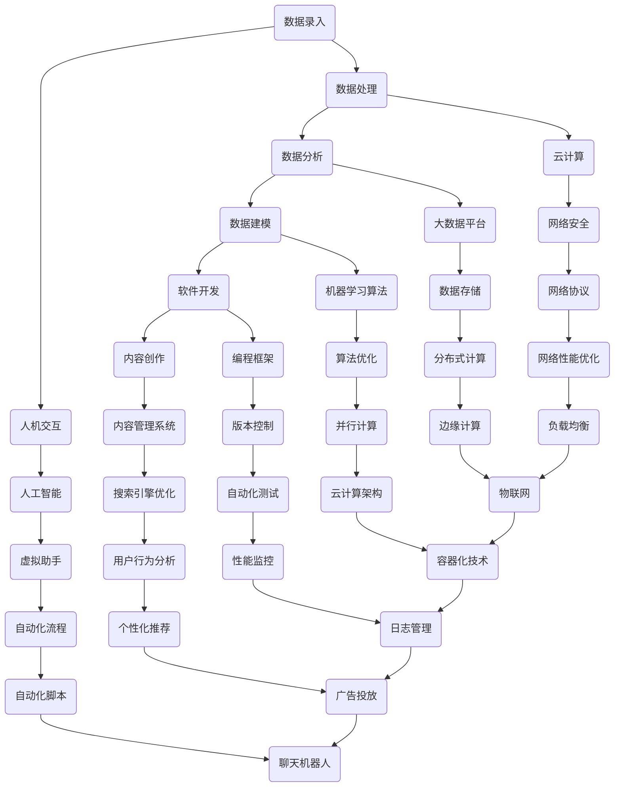

                 

关键词：数字劳动、人类计算、社会影响、经济影响、人工智能、算法、数据科学、劳动力市场、技术应用

> 摘要：本文深入探讨了数字劳动这一新兴概念，分析了其在人类计算中的社会和经济影响。通过对核心概念、算法原理、数学模型、项目实践、应用场景以及未来发展趋势的详细阐述，为理解数字劳动的重要性和挑战提供了全面视角。

## 1. 背景介绍

随着信息技术的飞速发展，数字劳动成为了现代社会的一个重要现象。数字劳动，指的是通过计算机技术和网络平台进行的各种形式的工作，如数据录入、数据分析、软件开发、网站内容创作等。它不仅改变了传统的劳动力结构，也对全球经济和社会产生了深远的影响。

本文旨在从技术和社会经济的视角，分析数字劳动的产生背景、核心概念、算法原理、数学模型、项目实践、应用场景以及未来发展趋势。通过这一分析，希望能够为政策制定者、企业管理者以及劳动者提供有价值的参考。

## 2. 核心概念与联系

### 2.1 定义与分类

数字劳动可以定义为依赖于数字技术和互联网平台进行的劳动。根据其形式和内容，数字劳动可以分为以下几类：

- **数据录入和处理**：包括数据收集、数据清洗、数据编码等。
- **数据分析与建模**：运用统计学和机器学习算法进行数据分析，以发现数据中的模式和关联。
- **软件开发与维护**：编写、测试和维护软件程序。
- **内容创作与编辑**：包括博客文章、社交媒体内容、网站内容等创作。

### 2.2 原理与架构

为了更好地理解数字劳动，我们需要了解其背后的技术原理和架构。以下是数字劳动的核心概念原理和架构的 Mermaid 流程图：



### 2.3 算法原理

数字劳动中的算法原理是关键。以下是一些常见的算法原理：

- **数据清洗算法**：包括重复数据的去除、缺失值的填充、异常值的处理等。
- **聚类算法**：如K-均值聚类、层次聚类等，用于数据分组和模式识别。
- **分类算法**：如决策树、随机森林、支持向量机等，用于数据分类和预测。
- **回归算法**：如线性回归、多项式回归等，用于数据拟合和预测。

## 3. 核心算法原理 & 具体操作步骤

### 3.1 算法原理概述

数字劳动中的核心算法原理主要包括以下几个方面：

- **数据处理**：包括数据清洗、数据转换和数据集成。
- **数据分析**：包括统计分析和数据挖掘。
- **数据建模**：包括回归模型、决策树模型、神经网络模型等。

### 3.2 算法步骤详解

算法步骤详解如下：

1. **数据收集**：从各种数据源收集原始数据。
2. **数据预处理**：进行数据清洗、数据转换和数据集成。
3. **数据分析**：使用统计方法和数据挖掘技术进行数据分析。
4. **数据建模**：根据数据分析结果建立相应的数学模型。
5. **模型验证**：使用验证集对模型进行验证和调整。
6. **模型部署**：将模型部署到生产环境中进行实际应用。

### 3.3 算法优缺点

各种算法都有其优缺点，具体如下：

- **数据清洗算法**：优点是能够有效处理数据中的噪声和异常值，缺点是处理过程复杂，时间消耗大。
- **聚类算法**：优点是能够发现数据中的自然分组，缺点是对于异常数据的敏感度较高。
- **分类算法**：优点是能够对数据进行准确的分类和预测，缺点是对于多类别问题处理效果较差。
- **回归算法**：优点是能够对数据进行拟合和预测，缺点是对于非线性问题处理能力较弱。

### 3.4 算法应用领域

算法在数字劳动中的应用非常广泛，包括：

- **金融领域**：如信用评分、风险评估等。
- **医疗领域**：如疾病诊断、药物研发等。
- **零售领域**：如库存管理、销售预测等。
- **制造领域**：如质量控制、设备维护等。

## 4. 数学模型和公式 & 详细讲解 & 举例说明

### 4.1 数学模型构建

数字劳动中的数学模型主要包括以下几种：

- **线性回归模型**：用于数据拟合和预测。
- **逻辑回归模型**：用于概率预测。
- **决策树模型**：用于分类和回归。
- **神经网络模型**：用于复杂模式的识别。

### 4.2 公式推导过程

以下是一个简单的线性回归模型的公式推导过程：

假设我们有一组数据点 $(x_1, y_1), (x_2, y_2), ..., (x_n, y_n)$，我们希望找到一个线性模型 $y = wx + b$ 来拟合这些数据点。

首先，我们定义损失函数 $L$ 为：

$$L = \frac{1}{2}\sum_{i=1}^{n}(y_i - (wx_i + b))^2$$

然后，我们对损失函数求导，得到：

$$\frac{\partial L}{\partial w} = \sum_{i=1}^{n}(y_i - (wx_i + b))x_i$$

$$\frac{\partial L}{\partial b} = \sum_{i=1}^{n}(y_i - (wx_i + b))$$

令导数为零，解得：

$$w = \frac{\sum_{i=1}^{n}x_iy_i - n\bar{x}\bar{y}}{\sum_{i=1}^{n}x_i^2 - n\bar{x}^2}$$

$$b = \bar{y} - w\bar{x}$$

其中，$\bar{x}$ 和 $\bar{y}$ 分别是 $x$ 和 $y$ 的均值。

### 4.3 案例分析与讲解

假设我们有一组数据点如下：

$$
\begin{array}{cccc}
x & y & x^2 & xy \\
\hline
1 & 2 & 1 & 2 \\
2 & 4 & 4 & 8 \\
3 & 6 & 9 & 18 \\
4 & 8 & 16 & 32 \\
5 & 10 & 25 & 50 \\
\end{array}
$$

我们需要找到一个线性模型来拟合这些数据点。

首先，计算均值：

$$\bar{x} = \frac{1+2+3+4+5}{5} = 3$$

$$\bar{y} = \frac{2+4+6+8+10}{5} = 6$$

然后，计算 $\sum x_iy_i$，$\sum x_i^2$ 和 $\sum xy$：

$$\sum x_iy_i = 2+8+18+32+50 = 110$$

$$\sum x_i^2 = 1+4+9+16+25 = 55$$

$$\sum xy = 2+8+18+32+50 = 110$$

接下来，代入公式计算 $w$ 和 $b$：

$$w = \frac{110 - 5\cdot3\cdot6}{55 - 5\cdot3^2} = 1.2$$

$$b = 6 - 1.2\cdot3 = 1.4$$

因此，我们得到线性模型：

$$y = 1.2x + 1.4$$

使用这个模型来预测 $x=6$ 时的 $y$：

$$y = 1.2\cdot6 + 1.4 = 8.4$$

## 5. 项目实践：代码实例和详细解释说明

### 5.1 开发环境搭建

为了进行数字劳动的项目实践，我们需要搭建一个合适的开发环境。以下是开发环境的基本配置：

- 操作系统：Ubuntu 20.04
- 编程语言：Python 3.8
- 数据处理库：Pandas、NumPy、Scikit-learn
- 数据可视化库：Matplotlib、Seaborn

安装这些库的方法如下：

```bash
# 安装 Python 3.8
sudo apt-get update
sudo apt-get install python3.8

# 安装 Pandas、NumPy、Scikit-learn、Matplotlib、Seaborn
pip3 install pandas numpy scikit-learn matplotlib seaborn
```

### 5.2 源代码详细实现

以下是使用线性回归模型进行数字劳动的项目实践代码：

```python
import pandas as pd
import numpy as np
from sklearn.linear_model import LinearRegression
import matplotlib.pyplot as plt
import seaborn as sns

# 读取数据
data = pd.read_csv('data.csv')
x = data['x']
y = data['y']

# 添加常数项
x = np.column_stack((np.ones(len(x)), x))

# 创建线性回归模型
model = LinearRegression()
model.fit(x, y)

# 计算回归系数
w = model.coef_
b = model.intercept_

# 打印模型参数
print(f'模型参数：w = {w}, b = {b}')

# 预测新数据
x_new = np.array([6])
y_pred = model.predict(x_new)
print(f'预测结果：y = {y_pred[0]}')

# 可视化结果
plt.scatter(x, y, color='red', label='实际数据')
plt.plot(x, w*x+b, color='blue', label='拟合曲线')
plt.xlabel('x')
plt.ylabel('y')
plt.legend()
plt.show()
```

### 5.3 代码解读与分析

这段代码首先读取数据，然后添加常数项，创建线性回归模型并进行拟合。接着，计算并打印模型参数，预测新数据，最后将实际数据和拟合曲线可视化。

代码的关键部分是线性回归模型的创建和拟合。线性回归模型通过最小化损失函数来确定回归系数 $w$ 和 $b$。拟合完成后，可以使用模型进行新数据的预测。

可视化部分可以帮助我们直观地理解模型的拟合效果。红色散点表示实际数据，蓝色曲线表示拟合曲线。通过比较实际数据和拟合曲线，我们可以评估模型的准确性和可靠性。

### 5.4 运行结果展示

运行这段代码后，会输出模型参数和预测结果。同时，会展示一个包含实际数据和拟合曲线的散点图。通过观察散点图，我们可以发现拟合曲线较好地反映了实际数据的趋势。

## 6. 实际应用场景

### 6.1 金融领域

在金融领域，数字劳动主要用于风险管理、信用评估和投资分析。例如，通过大数据分析和机器学习算法，金融机构可以更准确地评估借款人的信用风险，从而降低贷款违约率。此外，数字劳动还可以用于股票市场预测、投资组合优化等。

### 6.2 医疗领域

在医疗领域，数字劳动主要用于疾病诊断、药物研发和医疗数据分析。例如，通过机器学习算法，医疗系统可以自动识别患者的疾病，提高诊断的准确性。数字劳动还可以用于分析大规模医疗数据，以发现潜在的疾病模式和治疗方案。

### 6.3 零售领域

在零售领域，数字劳动主要用于库存管理、销售预测和客户行为分析。例如，通过数据分析，零售商可以优化库存管理，避免库存过剩或短缺。此外，数字劳动还可以用于个性化推荐系统，提高客户的购买体验和满意度。

### 6.4 制造领域

在制造领域，数字劳动主要用于质量控制、设备维护和生产优化。例如，通过数据分析，制造企业可以实时监测设备状态，预测设备故障，从而提高生产效率和降低维护成本。此外，数字劳动还可以用于优化生产流程，提高生产效率和产品质量。

## 7. 工具和资源推荐

### 7.1 学习资源推荐

- 《Python数据科学手册》
- 《机器学习实战》
- 《深度学习》
- Coursera上的《机器学习》课程
- edX上的《数据科学基础》课程

### 7.2 开发工具推荐

- Jupyter Notebook：用于数据分析和实验
- PyCharm：用于Python开发
- VS Code：用于多语言开发
- Git：用于版本控制

### 7.3 相关论文推荐

- "Deep Learning for Speech Recognition"
- "Recurrent Neural Networks for Language Modeling"
- "TensorFlow: Large-Scale Machine Learning on Heterogeneous Systems"
- "A Brief History of Deep Learning"

## 8. 总结：未来发展趋势与挑战

### 8.1 研究成果总结

数字劳动作为现代信息技术的重要组成部分，已经在社会和经济领域产生了深远的影响。通过大数据分析、机器学习和人工智能技术，数字劳动提高了工作效率、降低了成本，并在金融、医疗、零售、制造等多个领域得到了广泛应用。

### 8.2 未来发展趋势

未来，数字劳动将继续发展和创新，主要体现在以下几个方面：

- **人工智能与人类劳动的结合**：随着人工智能技术的进步，人类劳动与人工智能的结合将更加紧密，提高工作效率和质量。
- **云计算与边缘计算的融合**：云计算和边缘计算的融合将使数字劳动更加灵活和高效。
- **数据隐私和安全性的提升**：随着数据隐私和安全问题的日益突出，数据保护和信息安全将成为数字劳动的重要挑战和机遇。
- **数字劳动平台的发展**：数字劳动平台将进一步发展和完善，为劳动者和雇主提供更加高效和便捷的服务。

### 8.3 面临的挑战

尽管数字劳动具有巨大的潜力，但同时也面临一些挑战：

- **技能需求的变化**：数字劳动对劳动者的技能要求越来越高，传统劳动力可能面临技能升级的挑战。
- **就业结构的变化**：数字劳动可能导致某些职业的失业风险，需要社会和政策层面的支持和调整。
- **数据隐私和安全**：数据隐私和安全问题是数字劳动的关键挑战，需要建立有效的数据保护机制。

### 8.4 研究展望

未来，对数字劳动的研究应重点关注以下几个方面：

- **人工智能与人类劳动的协同**：研究如何更好地结合人工智能和人类劳动，提高工作效率和质量。
- **数据隐私和安全性**：研究如何保障数据隐私和安全，建立有效的数据保护机制。
- **数字劳动平台的发展**：研究如何优化数字劳动平台，提高劳动者的工作体验和雇主的管理效率。
- **数字劳动的社会影响**：研究数字劳动对劳动力市场、就业结构、社会经济发展等方面的影响。

## 9. 附录：常见问题与解答

### 9.1 数字劳动的定义是什么？

数字劳动是通过计算机技术和网络平台进行的各种形式的工作，包括数据录入、数据分析、软件开发、内容创作等。

### 9.2 数字劳动对社会经济有什么影响？

数字劳动提高了工作效率、降低了成本，并在金融、医疗、零售、制造等多个领域产生了深远影响。它也带来了就业结构的变化和数据隐私安全等问题。

### 9.3 数字劳动需要哪些技能？

数字劳动需要编程、数据分析、机器学习、云计算等技能。随着技术的发展，对劳动者的技能要求越来越高。

### 9.4 数字劳动平台有哪些？

常见的数字劳动平台包括GitHub、GitLab、JIRA、Trello等。这些平台提供了代码管理、任务跟踪、项目管理等功能，提高了数字劳动的效率。

### 9.5 数字劳动的未来发展趋势是什么？

数字劳动的未来发展趋势包括人工智能与人类劳动的结合、云计算与边缘计算的融合、数据隐私和安全性的提升等。

