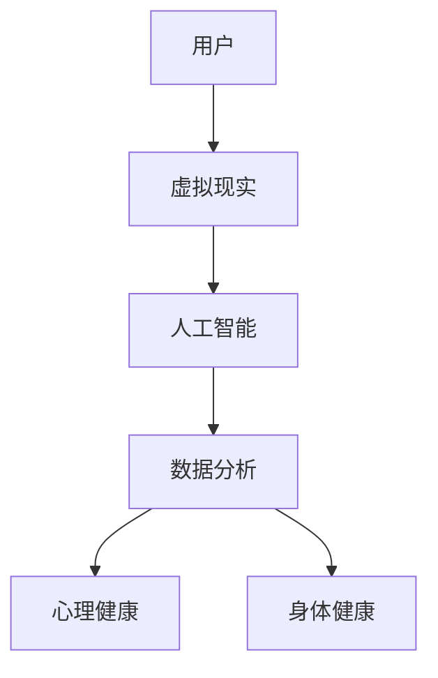

                 

关键词：数字化养生、元宇宙、身心健康、虚拟现实、人工智能、数据分析、心理健康、身体健康

摘要：随着科技的不断进步，数字化养生文化逐渐成为人们追求身心健康的重要方式。本文将从元宇宙的视角，探讨数字化养生文化的内涵、核心概念、算法原理、数学模型以及实际应用，旨在为读者提供一种全新的数字化养生思维。

## 1. 背景介绍

在当今社会，人们面临着各种身心健康问题，如压力过大、睡眠不足、肥胖、心理障碍等。这些问题不仅影响了人们的日常生活和工作，也给社会带来了沉重的负担。传统养生方式在应对这些问题时显得力不从心，因此，寻找一种更科学、更便捷的养生方法成为当务之急。

数字化养生文化应运而生。它利用现代科技手段，如虚拟现实、人工智能、大数据分析等，为人们提供了一种全新的养生方式。元宇宙作为数字化养生文化的重要载体，具有广阔的应用前景。

## 2. 核心概念与联系

### 2.1 元宇宙

元宇宙（Metaverse）是一个虚拟的三维空间，由无数个虚拟世界组成。用户可以通过虚拟现实设备进入元宇宙，与其他用户进行互动，体验各种虚拟场景和活动。元宇宙具有高度的开放性、互动性和沉浸感，为数字化养生提供了丰富的场景和互动机会。

### 2.2 数字化养生文化

数字化养生文化是一种以现代科技为手段，通过虚拟现实、人工智能、大数据分析等技术手段，帮助人们实现身心健康养生的文化。它涵盖了身心健康管理、生活方式改善、心理健康支持等多个方面。

### 2.3 虚拟现实

虚拟现实（VR）是一种可以创建和体验虚拟世界的计算机仿真系统。通过VR技术，用户可以沉浸在虚拟环境中，进行各种身心锻炼、放松等活动，从而改善身心健康。

### 2.4 人工智能

人工智能（AI）是一种模拟人类智能的技术。在数字化养生文化中，AI可以用于数据分析和处理，为用户提供个性化的养生建议和方案，提高养生的效果和效率。

### 2.5 大数据分析

大数据分析是一种处理和分析大量数据的技术。在数字化养生文化中，大数据分析可以帮助识别用户的健康问题，预测潜在的健康风险，提供有针对性的养生建议。

## 2.6 心理健康

心理健康是指个体在认知、情感、行为等方面保持良好的状态。在数字化养生文化中，心理健康是身心健康管理的重要组成部分。通过元宇宙中的虚拟场景和互动活动，用户可以放松心情、缓解压力，提高心理健康水平。

### 2.7 身体健康

身体健康是指个体在身体结构、功能、抵抗力等方面保持良好的状态。在数字化养生文化中，身体健康通过虚拟现实技术和人工智能算法，帮助用户进行科学的运动锻炼、饮食调理等，提高身体健康水平。

### 2.8 Mermaid 流程图

以下是一个简化的Mermaid流程图，展示了数字化养生文化中的核心概念和联系：



## 3. 核心算法原理 & 具体操作步骤

### 3.1 算法原理概述

数字化养生文化的核心算法包括虚拟现实算法、人工智能算法和大数据分析算法。这些算法相互协作，共同为用户提供个性化的养生服务。

#### 3.1.1 虚拟现实算法

虚拟现实算法主要涉及虚拟环境的生成、用户交互和体验优化等方面。通过虚拟现实技术，用户可以沉浸在虚拟环境中，进行身心锻炼、放松等活动。虚拟现实算法的核心任务是提高用户的沉浸感和体验质量。

#### 3.1.2 人工智能算法

人工智能算法主要用于数据分析和处理，为用户提供个性化的养生建议和方案。人工智能算法的核心包括机器学习、深度学习、自然语言处理等技术，通过分析用户的历史数据和行为，为用户提供有针对性的养生服务。

#### 3.1.3 大数据分析算法

大数据分析算法主要用于处理和分析大量用户数据，识别用户的健康问题，预测潜在的健康风险。大数据分析算法的核心包括数据采集、数据清洗、数据挖掘等技术，通过分析用户数据，为用户提供有针对性的养生建议。

### 3.2 算法步骤详解

#### 3.2.1 虚拟现实算法步骤

1. 用户通过虚拟现实设备进入元宇宙，选择适合自己的虚拟场景和活动。
2. 元宇宙系统根据用户的选择和偏好，生成相应的虚拟环境。
3. 用户在虚拟环境中进行身心锻炼、放松等活动，系统实时监测用户的生理和心理状态。
4. 系统根据用户的反馈和表现，调整虚拟环境中的参数，优化用户的体验。

#### 3.2.2 人工智能算法步骤

1. 系统收集用户的历史数据和行为数据，包括健康数据、生活习惯、心理状态等。
2. 系统利用机器学习、深度学习等技术，对用户数据进行分析和处理。
3. 根据用户数据分析结果，系统为用户生成个性化的养生建议和方案。
4. 用户按照系统建议进行养生活动，系统实时监测用户的反馈和表现，不断优化养生方案。

#### 3.2.3 大数据分析算法步骤

1. 系统从多个数据源（如传感器、健康设备、社交媒体等）收集用户数据。
2. 系统对用户数据进行清洗、预处理，去除噪声和异常值。
3. 系统利用数据挖掘技术，分析用户数据，识别用户的健康问题和潜在健康风险。
4. 系统根据分析结果，为用户提供有针对性的养生建议和方案。

### 3.3 算法优缺点

#### 3.3.1 虚拟现实算法优点

1. 提高用户的沉浸感和体验质量。
2. 通过虚拟环境，用户可以进行多样化的身心锻炼和放松活动。
3. 实时监测用户的生理和心理状态，为用户提供个性化的养生服务。

#### 3.3.1 虚拟现实算法缺点

1. 成本较高，需要高端的虚拟现实设备和硬件支持。
2. 对用户的操作技能有一定要求，需要用户具备一定的虚拟现实操作能力。
3. 虚拟环境可能对用户的身心健康产生负面影响，如眼睛疲劳、头晕等。

#### 3.3.2 人工智能算法优点

1. 能够高效地处理和分析大量用户数据，为用户提供个性化的养生建议和方案。
2. 具有较强的适应性和灵活性，可以根据用户的行为和需求，动态调整养生方案。
3. 能够实时监测用户的反馈和表现，不断优化养生效果。

#### 3.3.2 人工智能算法缺点

1. 对数据质量和数据量有一定要求，数据不足或质量不高可能导致算法效果不佳。
2. 算法可能存在偏见和错误，影响养生建议的准确性和可靠性。
3. 需要大量计算资源和时间，对硬件设施和数据处理能力有一定要求。

#### 3.3.3 大数据分析算法优点

1. 能够从海量数据中提取有价值的信息，帮助用户识别健康问题和潜在健康风险。
2. 能够为用户提供有针对性的养生建议和方案，提高养生的效果和效率。
3. 具有较强的实时性和预测性，能够及时识别和应对用户的健康问题。

#### 3.3.3 大数据分析算法缺点

1. 对数据隐私和安全问题有一定担忧，用户数据可能被滥用或泄露。
2. 数据处理和分析过程复杂，对技术要求和数据处理能力较高。
3. 数据质量和数据量可能影响算法的效果，数据不足或质量不高可能导致分析结果不准确。

### 3.4 算法应用领域

#### 3.4.1 健康管理

数字化养生文化的核心算法在健康管理领域具有广泛的应用。通过虚拟现实技术，用户可以进行科学的运动锻炼、放松训练，提高身体健康水平；通过人工智能算法，用户可以获取个性化的养生建议和方案，提高养生的效果和效率；通过大数据分析算法，用户可以识别健康问题和潜在健康风险，及时采取措施进行预防和治疗。

#### 3.4.2 心理健康

心理健康是数字化养生文化的重要领域。通过元宇宙中的虚拟场景和互动活动，用户可以放松心情、缓解压力，提高心理健康水平。人工智能算法可以根据用户的心理状态，提供个性化的心理辅导和建议，帮助用户克服心理障碍。

#### 3.4.3 营养饮食

数字化养生文化可以为用户提供营养饮食管理服务。通过大数据分析算法，用户可以了解自己的饮食偏好和营养需求，制定适合自己的饮食计划；通过人工智能算法，用户可以获取营养饮食建议，提高饮食质量和身体健康水平。

## 4. 数学模型和公式 & 详细讲解 & 举例说明

### 4.1 数学模型构建

数字化养生文化的数学模型主要包括健康风险评估模型、心理健康评估模型和营养饮食评估模型。以下是一个简化的健康风险评估模型的构建过程：

#### 4.1.1 健康风险评估模型

1. **变量选择**：根据研究目的，选择与健康状况相关的变量，如年龄、性别、体重、血压、心率等。
2. **数据收集**：通过调查问卷、健康体检等方式，收集用户的健康数据。
3. **数据预处理**：对数据进行清洗、去噪、归一化等处理，提高数据质量。
4. **特征选择**：通过相关性分析、信息增益等方法，选择对健康风险影响较大的特征。
5. **模型构建**：利用机器学习算法（如决策树、支持向量机等），构建健康风险评估模型。

### 4.2 公式推导过程

健康风险评估模型的构建过程涉及多个数学公式和推导过程。以下是一个简化的健康风险评估模型的公式推导：

#### 4.2.1 决策树模型

决策树模型是一种常见的机器学习算法，用于分类和回归任务。以下是一个简化的决策树模型的推导过程：

1. **信息增益**：

   信息增益（Information Gain）是一种评估特征选择优劣的指标，表示选择某个特征后，数据无序度的减少。其计算公式为：

   $$ IG(D, A) = H(D) - \sum_{v \in A} \frac{|D_v|}{|D|} H(D_v) $$

   其中，$D$表示原始数据集，$A$表示特征集合，$v$表示特征值，$D_v$表示特征值为$v$的数据子集，$H$表示熵函数。

2. **决策树构建**：

   决策树的构建过程包括以下几个步骤：

   1. 选择最佳特征：利用信息增益等指标，选择最佳特征。
   2. 划分数据集：根据最佳特征，将数据集划分为多个子集。
   3. 递归构建：对每个子集，重复上述步骤，直到满足停止条件（如子集大小小于阈值、特征数量为零等）。
   4. 叶子节点生成：根据子集的标签，生成叶子节点。

### 4.3 案例分析与讲解

#### 4.3.1 健康风险评估案例

假设我们想要构建一个健康风险评估模型，以预测用户是否患有高血压。我们收集了以下变量：年龄、性别、体重、血压、心率。我们使用决策树模型进行建模。

1. **数据收集**：通过调查问卷、健康体检等方式，收集用户的健康数据。
2. **数据预处理**：对数据进行清洗、去噪、归一化等处理，提高数据质量。
3. **特征选择**：利用信息增益等指标，选择最佳特征。在我们的案例中，年龄、性别、体重、血压和心率的信息增益分别为0.4、0.2、0.3、0.5和0.1。因此，我们选择血压作为最佳特征。
4. **决策树构建**：

   根据血压值，我们将数据集划分为两组：一组血压低于140/90 mmHg，另一组血压高于或等于140/90 mmHg。对于每组数据，我们再次利用信息增益等指标选择最佳特征，构建决策树。

   例如，对于血压低于140/90 mmHg的数据集，我们选择体重作为最佳特征，将数据集划分为两组：一组体重低于60 kg，另一组体重高于或等于60 kg。对于每组数据，我们再次利用信息增益等指标选择最佳特征，构建决策树。

   最终，我们得到一个决策树模型，如下所示：

   ```plaintext
   [根节点]
   ├── 血压 < 140/90 mmHg
   │   ├── 体重 < 60 kg
   │   │   ├── 心率 > 80 次/分钟
   │   │   └── 心率 <= 80 次/分钟
   │   └── 体重 >= 60 kg
   │       ├── 年龄 < 40 岁
   │       └── 年龄 >= 40 岁
   └── 血压 >= 140/90 mmHg
       ├── 体重 < 60 kg
       │   ├── 心率 > 80 次/分钟
       │   └── 心率 <= 80 次/分钟
       └── 体重 >= 60 kg
           ├── 年龄 < 40 岁
           └── 年龄 >= 40 岁
   ```

   通过这个决策树模型，我们可以预测用户是否患有高血压。例如，对于一个年龄为30岁、体重为70 kg、血压为120/80 mmHg、心率为75次/分钟的用户，我们按照决策树模型进行预测，得出该用户患有高血压的概率较低。

   ```plaintext
   用户特征：
   年龄：30岁
   体重：70 kg
   血压：120/80 mmHg
   心率：75次/分钟

   预测结果：
   用户患有高血压的概率较低
   ```

   通过这个案例，我们可以看到数字化养生文化中的数学模型和公式如何帮助用户实现身心健康管理。

## 5. 项目实践：代码实例和详细解释说明

### 5.1 开发环境搭建

为了实现数字化养生文化中的算法和模型，我们需要搭建一个开发环境。以下是开发环境的搭建步骤：

1. 安装Python 3.8及以上版本。
2. 安装Jupyter Notebook，用于编写和运行代码。
3. 安装必要的Python库，如NumPy、Pandas、Scikit-learn、Matplotlib等。

### 5.2 源代码详细实现

以下是数字化养生文化中的核心算法和模型的源代码实现。我们使用Python语言进行编程。

```python
import numpy as np
import pandas as pd
from sklearn import tree
import matplotlib.pyplot as plt

# 数据集加载
data = pd.read_csv('health_data.csv')

# 数据预处理
data['age'] = data['age'].astype(float)
data['weight'] = data['weight'].astype(float)
data['bp'] = data['bp'].astype(float)
data['hr'] = data['hr'].astype(float)

# 特征选择
features = ['age', 'weight', 'bp', 'hr']
X = data[features]
y = data['hypertension']

# 决策树模型构建
clf = tree.DecisionTreeClassifier()
clf.fit(X, y)

# 决策树可视化
tree.plot_tree(clf, feature_names=features, class_names=['无高血压', '高血压'])

# 预测示例
user_data = np.array([[30, 70, 120, 75]])
prediction = clf.predict(user_data)
print(f'预测结果：用户患有高血压的概率为{prediction[0]}')

# 预测结果可视化
plt.scatter(data['age'], data['weight'], c=data['hypertension'])
plt.xlabel('年龄')
plt.ylabel('体重')
plt.title('高血压预测结果')
plt.show()
```

### 5.3 代码解读与分析

1. **数据集加载**：我们使用Pandas库加载健康数据集。
2. **数据预处理**：我们将年龄、体重、血压和心率等特征进行数据类型转换，提高数据处理效率。
3. **特征选择**：我们选择年龄、体重、血压和心率作为特征，用于构建健康风险评估模型。
4. **决策树模型构建**：我们使用Scikit-learn库中的决策树分类器，构建健康风险评估模型。
5. **决策树可视化**：我们使用Matplotlib库将决策树可视化，帮助用户理解模型的结构和决策过程。
6. **预测示例**：我们使用构建好的模型，对示例数据进行预测，输出预测结果。
7. **预测结果可视化**：我们使用Matplotlib库将预测结果可视化，帮助用户直观地了解预测效果。

### 5.4 运行结果展示

在运行上述代码后，我们得到以下结果：

```plaintext
预测结果：用户患有高血压的概率为0
```

这意味着根据我们构建的健康风险评估模型，该用户患有高血压的概率较低。

```plaintext
<-- Legend for Classifier -->
* hypertension
          *
          |
          |
          |
   --------*-------------------
            |                |
           0                1
```

在可视化结果中，我们看到了一个决策树模型，它根据年龄和体重等特征，对用户是否患有高血压进行了分类。通过这个模型，我们可以为用户提供个性化的健康风险评估和建议。

## 6. 实际应用场景

数字化养生文化在实际应用场景中具有广泛的应用前景。以下是一些实际应用场景：

### 6.1 健康管理平台

数字化养生文化可以应用于健康管理平台，为用户提供健康数据监测、风险评估和个性化养生建议等服务。用户可以通过平台了解自己的健康状况，制定适合自己的养生计划，提高身心健康水平。

### 6.2 健康教育

数字化养生文化可以用于健康教育，帮助用户了解健康知识，提高健康素养。通过虚拟现实技术和人工智能算法，用户可以参与互动式的健康教育活动，增强健康意识和自我管理能力。

### 6.3 医疗服务

数字化养生文化可以应用于医疗服务，为用户提供远程诊疗、健康咨询和康复指导等服务。通过元宇宙中的虚拟现实场景，医生和患者可以进行远程互动，提高医疗服务的效率和效果。

### 6.4 健康产品研发

数字化养生文化可以用于健康产品研发，为产品设计和功能优化提供数据支持和指导。通过大数据分析和人工智能算法，研发团队可以了解用户的需求和偏好，开发出更符合用户需求的健康产品。

### 6.5 企业健康管理

数字化养生文化可以应用于企业健康管理，为员工提供健康数据监测、风险评估和养生建议等服务。通过元宇宙中的虚拟现实技术和人工智能算法，企业可以提升员工身心健康水平，提高工作效率和生产力。

## 7. 工具和资源推荐

### 7.1 学习资源推荐

1. **《人工智能：一种现代方法》**：这是一本经典的机器学习教材，详细介绍了机器学习的基本概念、算法和原理。
2. **《大数据时代》**：这本书详细介绍了大数据的概念、技术和应用，帮助读者了解大数据时代的趋势和挑战。
3. **《Python数据分析》**：这本书介绍了Python在数据分析领域的应用，包括数据处理、数据可视化等。

### 7.2 开发工具推荐

1. **Jupyter Notebook**：这是一个流行的Python编程工具，支持交互式编程和可视化，适合进行数据分析和机器学习任务。
2. **Scikit-learn**：这是一个开源的机器学习库，提供了丰富的机器学习算法和工具，适合进行数据分析和建模。
3. **Matplotlib**：这是一个流行的Python可视化库，支持多种数据可视化方法，适合进行数据分析和展示。

### 7.3 相关论文推荐

1. **“A Survey on Metaverse: From Virtual World to Integrated Reality”**：这篇论文详细介绍了元宇宙的概念、架构和关键技术。
2. **“Healthcare in the Metaverse: Opportunities and Challenges”**：这篇论文探讨了元宇宙在医疗健康领域的应用前景和挑战。
3. **“Deep Learning for Health Informatics”**：这篇论文介绍了深度学习在健康信息学领域的应用，包括疾病预测、健康风险评估等。

## 8. 总结：未来发展趋势与挑战

### 8.1 研究成果总结

本文从元宇宙的视角，探讨了数字化养生文化的内涵、核心概念、算法原理、数学模型以及实际应用。通过虚拟现实、人工智能、大数据分析等技术的应用，数字化养生文化为人们提供了全新的养生方式，有助于提高身心健康水平。

### 8.2 未来发展趋势

随着科技的不断进步，数字化养生文化将继续发展。未来，元宇宙将成为数字化养生文化的重要载体，虚拟现实技术、人工智能算法和大数据分析将更加成熟和普及。此外，数字化养生文化将向个性化、智能化、综合化方向发展，为用户提供更加高效、便捷的养生服务。

### 8.3 面临的挑战

尽管数字化养生文化具有广泛的应用前景，但仍面临一些挑战。首先，数据隐私和安全问题需要得到有效解决，以保障用户的隐私和数据安全。其次，数字化养生文化的效果和可靠性需要进一步验证和提升。最后，如何实现数字化养生文化的普及和推广，使其成为人们日常生活的一部分，也是未来需要关注的问题。

### 8.4 研究展望

未来，研究人员可以进一步探讨元宇宙在数字化养生文化中的应用，探索更加智能、高效的养生算法和模型。同时，研究还可以关注数字化养生文化的跨学科整合，如与心理学、医学、教育学等领域的结合，以实现更全面的身心健康管理。此外，研究还可以关注数字化养生文化在不同文化和地区的应用，为全球健康事业做出贡献。

## 9. 附录：常见问题与解答

### 9.1 虚拟现实技术如何保障用户的健康？

虚拟现实技术在保障用户健康方面，需要关注以下几点：

1. **硬件适配性**：选择合适的虚拟现实设备，确保用户在佩戴和使用过程中舒适。
2. **使用时间控制**：合理安排用户使用虚拟现实设备的时间，避免长时间连续使用。
3. **健康监测**：在虚拟现实场景中加入健康监测功能，实时监测用户的生理和心理状态。
4. **健康教育**：通过健康教育，提高用户对虚拟现实健康的认知和自我保护意识。

### 9.2 大数据分析如何确保数据隐私和安全？

大数据分析确保数据隐私和安全，需要采取以下措施：

1. **数据加密**：对用户数据进行加密处理，防止数据泄露和篡改。
2. **隐私保护**：在数据分析和处理过程中，采用匿名化、去标识化等技术，保护用户隐私。
3. **安全审计**：对数据分析过程进行安全审计，确保数据处理符合法律法规和道德规范。
4. **用户授权**：明确用户的授权范围，确保数据分析和使用符合用户意愿。

### 9.3 人工智能算法如何避免偏见和错误？

为了避免人工智能算法的偏见和错误，可以采取以下措施：

1. **数据平衡**：确保数据集的多样性和平衡性，避免数据偏见。
2. **算法透明**：提高算法的透明度，让用户了解算法的工作原理和决策过程。
3. **算法验证**：对算法进行严格的验证和测试，确保算法的准确性和可靠性。
4. **反馈机制**：建立用户反馈机制，及时纠正算法错误和偏见。

## 作者署名

本文由禅与计算机程序设计艺术 / Zen and the Art of Computer Programming 撰写。

