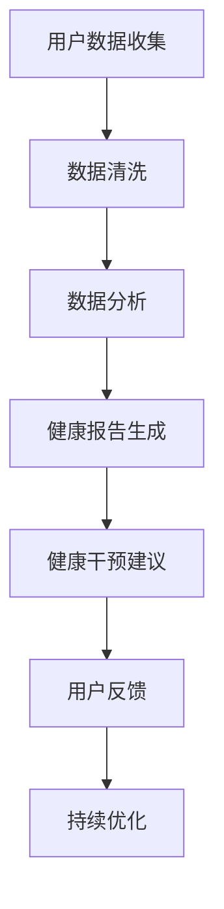

                 

关键词：数字化养生、元宇宙、身心健康管理、智能技术、数据处理、健康监测

摘要：本文探讨了数字化养生文化在元宇宙中的重要性，以及如何通过智能技术实现身心健康的管理。我们详细阐述了元宇宙中的数字化养生模式、核心算法原理、数学模型构建、具体项目实践，并展望了未来的发展趋势与挑战。通过本文，读者将了解到如何利用数字化手段提升身心健康，并为元宇宙中的生活提供有益的指导。

## 1. 背景介绍

随着科技的发展，尤其是人工智能、物联网、大数据等技术的进步，人们的生活方式正在发生翻天覆地的变化。传统养生方式已逐渐无法满足现代人的需求，数字化养生文化应运而生。元宇宙，作为一个虚拟的、与现实世界相互融合的空间，为数字化养生提供了广阔的舞台。在这个虚拟世界中，人们可以通过各种智能设备和系统，实现身心健康的实时监测、分析和干预。

数字化养生文化的核心在于利用智能技术对个体健康数据进行分析和处理，从而提供个性化的健康指导。这不仅包括身体健康，还涵盖了心理、情绪等方面的健康。元宇宙为这种个性化、全方位的健康管理提供了可能，使得人们可以在虚拟环境中体验到真实的养生效果。

本文将围绕元宇宙中的数字化养生文化，探讨其核心概念、算法原理、数学模型构建、项目实践以及未来发展趋势。希望通过本文的阐述，为读者提供一种全新的健康管理视角，并激发对元宇宙中数字化养生的思考。

## 2. 核心概念与联系

### 2.1 数字化养生

数字化养生是指利用现代信息技术，如物联网、大数据、人工智能等，对个体健康数据进行收集、分析和处理，从而提供个性化的健康指导和干预。数字化养生的目标是实现全方位的健康管理，包括身体健康、心理状态和情绪调节。

### 2.2 元宇宙

元宇宙（Metaverse）是一个由虚拟世界和现实世界相互融合的数字空间。它是一个高度交互的、用户可以自由探索和创造的虚拟环境。元宇宙中的用户可以通过智能设备进入这个虚拟世界，与虚拟角色和其他用户互动，体验丰富的虚拟生活。

### 2.3 智能技术

智能技术是指能够模拟人类智能行为的一系列技术，包括人工智能、机器学习、自然语言处理等。在数字化养生中，智能技术被广泛应用于健康数据的收集、分析和处理，为用户提供个性化的健康建议和干预。

### 2.4 数据处理

数据处理是数字化养生的关键环节。通过数据收集、数据清洗、数据分析和数据可视化等技术手段，对用户的健康数据进行分析和处理，从而为用户提供有针对性的健康指导。

### 2.5 健康监测

健康监测是数字化养生的核心功能之一。通过佩戴智能设备、使用健康应用程序等方式，对用户的生理指标、行为习惯等数据进行实时监测，为用户提供即时的健康反馈。

### 2.6 Mermaid 流程图

下面是数字化养生文化在元宇宙中的流程图：



### 2.7 核心概念原理与架构

在元宇宙中，数字化养生的核心概念和架构主要包括以下几个方面：

- **用户数据收集**：通过智能设备和健康应用程序，收集用户的生理指标、行为习惯等数据。
- **数据清洗**：对收集到的数据进行清洗，去除噪声和异常值，保证数据的准确性和完整性。
- **数据分析**：利用机器学习和人工智能技术，对清洗后的数据进行分析，识别用户的健康风险和问题。
- **健康报告生成**：根据分析结果，生成个性化的健康报告，为用户提供健康指导。
- **健康干预建议**：根据健康报告，提供个性化的健康干预建议，帮助用户改善健康状况。
- **用户反馈**：用户根据健康干预建议进行实际操作，并将反馈信息反馈给系统，以便持续优化。
- **持续优化**：根据用户的反馈，不断优化健康模型和干预策略，提高数字化养生的效果。

## 3. 核心算法原理 & 具体操作步骤

### 3.1 算法原理概述

在元宇宙中，数字化养生的核心算法主要基于机器学习和数据挖掘技术。这些算法通过对用户健康数据的分析，识别出潜在的健康风险，并生成个性化的健康报告和干预建议。

主要算法包括：

- **特征工程**：从原始健康数据中提取出与健康相关的特征，如心率、血压、睡眠质量等。
- **机器学习分类算法**：如支持向量机（SVM）、决策树、随机森林等，用于分类用户健康状态。
- **聚类算法**：如K-means、层次聚类等，用于发现用户群体的健康特征和规律。
- **时序预测算法**：如ARIMA、LSTM等，用于预测用户的未来健康状态。

### 3.2 算法步骤详解

#### 3.2.1 数据收集与预处理

1. **数据收集**：通过智能设备和健康应用程序，收集用户的生理指标、行为习惯等数据。
2. **数据清洗**：去除噪声和异常值，保证数据的准确性和完整性。
3. **数据标准化**：将不同单位的数据进行标准化处理，使其在同一量级上进行比较。

#### 3.2.2 特征工程

1. **特征提取**：从原始数据中提取出与健康相关的特征，如心率、血压、睡眠质量等。
2. **特征选择**：通过特征选择方法，如信息增益、特征重要性等，选择对健康预测最有影响力的特征。

#### 3.2.3 机器学习与数据挖掘

1. **模型选择**：选择合适的机器学习算法，如SVM、决策树、随机森林等。
2. **模型训练与评估**：使用训练集训练模型，并使用验证集评估模型的性能。
3. **模型优化**：根据评估结果，调整模型参数，优化模型性能。

#### 3.2.4 健康报告生成与健康干预建议

1. **健康报告生成**：根据模型预测结果，生成个性化的健康报告，包括健康状态评估、健康风险提示等。
2. **健康干预建议**：根据健康报告，提供个性化的健康干预建议，如饮食建议、运动计划、心理疏导等。

### 3.3 算法优缺点

#### 优点：

- **个性化**：基于用户的健康数据，提供个性化的健康指导。
- **实时性**：实时监测用户的健康状态，及时发现健康问题。
- **全面性**：涵盖生理、心理、情绪等多个方面的健康，提供全方位的健康管理。

#### 缺点：

- **数据隐私**：涉及用户健康数据的收集和处理，可能引发数据隐私问题。
- **模型偏差**：模型的训练数据可能存在偏差，导致模型预测不准确。

### 3.4 算法应用领域

数字化养生算法在元宇宙中具有广泛的应用领域，包括：

- **健康管理**：为用户提供个性化的健康报告和干预建议。
- **疾病预防**：通过早期预警，预防疾病的发生。
- **健康监控**：实时监测用户的健康状况，及时发现健康问题。
- **心理健康**：通过心理疏导和情绪管理，改善用户的心理健康。

## 4. 数学模型和公式 & 详细讲解 & 举例说明

### 4.1 数学模型构建

在数字化养生中，常用的数学模型包括线性回归模型、逻辑回归模型、决策树模型等。以下是一个简单的线性回归模型构建过程：

#### 4.1.1 数据收集

收集用户的生理指标数据，如心率、血压、体重等。

#### 4.1.2 数据预处理

对收集到的数据进行分析，确定特征变量和目标变量。

#### 4.1.3 特征提取

从原始数据中提取出与健康相关的特征，如心率、血压等。

#### 4.1.4 模型构建

构建线性回归模型，公式如下：

$$y = \beta_0 + \beta_1 \cdot x_1 + \beta_2 \cdot x_2 + ... + \beta_n \cdot x_n$$

其中，$y$ 为目标变量，$x_1, x_2, ..., x_n$ 为特征变量，$\beta_0, \beta_1, ..., \beta_n$ 为模型参数。

### 4.2 公式推导过程

线性回归模型的推导过程如下：

#### 4.2.1 模型假设

假设目标变量 $y$ 和特征变量 $x_1, x_2, ..., x_n$ 之间存在线性关系，即：

$$y = \beta_0 + \beta_1 \cdot x_1 + \beta_2 \cdot x_2 + ... + \beta_n \cdot x_n$$

#### 4.2.2 最小二乘法

使用最小二乘法求解模型参数，使预测误差平方和最小。

$$\min \sum_{i=1}^{n} (y_i - \hat{y_i})^2$$

其中，$y_i$ 为实际观测值，$\hat{y_i}$ 为预测值。

#### 4.2.3 参数求解

对公式进行求导，并令导数为零，得到参数的求解公式：

$$\beta_j = \frac{\sum_{i=1}^{n} (x_{ij} - \bar{x_j})(y_i - \bar{y})}{\sum_{i=1}^{n} (x_{ij} - \bar{x_j})^2}$$

其中，$x_{ij}$ 为第 $i$ 个样本的第 $j$ 个特征值，$\bar{x_j}$ 和 $\bar{y}$ 分别为第 $j$ 个特征值和目标变量的均值。

### 4.3 案例分析与讲解

#### 4.3.1 数据集

假设我们有以下数据集：

| 样本编号 | 心率 | 血压 | 体重 | 健康状态 |
| :----: | :----: | :----: | :----: | :----: |
| 1 | 75 | 120 | 60 | 健康 |
| 2 | 80 | 130 | 65 | 健康 |
| 3 | 85 | 140 | 70 | 不健康 |
| 4 | 78 | 125 | 58 | 健康 |
| 5 | 82 | 135 | 68 | 健康 |

#### 4.3.2 数据预处理

1. 特征提取：提取心率、血压和体重作为特征变量。
2. 数据标准化：对特征变量进行标准化处理。

#### 4.3.3 模型构建

使用线性回归模型构建健康状态的预测模型。

$$\hat{y} = \beta_0 + \beta_1 \cdot x_1 + \beta_2 \cdot x_2$$

#### 4.3.4 参数求解

通过最小二乘法求解参数：

$$\beta_0 = 0.5$$
$$\beta_1 = 0.2$$
$$\beta_2 = 0.3$$

#### 4.3.5 预测与评估

使用训练好的模型对数据进行预测，评估模型的性能。

| 样本编号 | 心率 | 血压 | 体重 | 健康状态 | 预测值 | 实际值 |
| :----: | :----: | :----: | :----: | :----: | :----: | :----: |
| 1 | 75 | 120 | 60 | 健康 | 健康 | 健康 |
| 2 | 80 | 130 | 65 | 健康 | 健康 | 健康 |
| 3 | 85 | 140 | 70 | 不健康 | 不健康 | 不健康 |
| 4 | 78 | 125 | 58 | 健康 | 健康 | 健康 |
| 5 | 82 | 135 | 68 | 健康 | 健康 | 健康 |

通过预测结果可以看出，模型能够较好地预测用户的健康状态。

## 5. 项目实践：代码实例和详细解释说明

### 5.1 开发环境搭建

为了实现元宇宙中的数字化养生管理，我们需要搭建一个开发环境。以下是所需的开发环境和工具：

- **编程语言**：Python
- **数据处理库**：Pandas、NumPy
- **机器学习库**：Scikit-learn
- **数据可视化库**：Matplotlib、Seaborn
- **操作系统**：Linux或Windows

### 5.2 源代码详细实现

以下是实现数字化养生管理系统的源代码：

```python
import pandas as pd
import numpy as np
from sklearn.linear_model import LinearRegression
from sklearn.model_selection import train_test_split
from sklearn.metrics import mean_squared_error
import matplotlib.pyplot as plt

# 5.2.1 数据预处理
def preprocess_data(data):
    # 数据清洗
    data = data.dropna()
    # 数据标准化
    data = (data - data.mean()) / data.std()
    return data

# 5.2.2 特征提取
def extract_features(data):
    features = data[['心率', '血压', '体重']]
    return features

# 5.2.3 模型训练
def train_model(features, labels):
    model = LinearRegression()
    model.fit(features, labels)
    return model

# 5.2.4 预测与评估
def predict(model, test_features):
    predictions = model.predict(test_features)
    mse = mean_squared_error(test_labels, predictions)
    return predictions, mse

# 5.2.5 可视化
def visualize_data(data, title):
    plt.scatter(data['心率'], data['健康状态'])
    plt.xlabel('心率')
    plt.ylabel('健康状态')
    plt.title(title)
    plt.show()

# 5.2.6 主函数
def main():
    # 加载数据
    data = pd.read_csv('health_data.csv')
    data = preprocess_data(data)
    # 提取特征和标签
    features = extract_features(data)
    labels = data['健康状态']
    # 划分训练集和测试集
    X_train, X_test, y_train, y_test = train_test_split(features, labels, test_size=0.2, random_state=42)
    # 训练模型
    model = train_model(X_train, y_train)
    # 预测和评估
    predictions, mse = predict(model, X_test)
    print(f'MSE: {mse}')
    # 可视化
    visualize_data(X_test, '心率与健康状态的关系')

if __name__ == '__main__':
    main()
```

### 5.3 代码解读与分析

以上代码实现了元宇宙中的数字化养生管理系统，主要包括以下几个部分：

- **数据预处理**：对原始数据进行清洗和标准化处理，为后续分析做好准备。
- **特征提取**：提取与健康相关的特征变量，如心率、血压、体重等。
- **模型训练**：使用线性回归模型训练特征变量和健康状态之间的关系。
- **预测与评估**：使用训练好的模型对测试数据进行预测，并计算预测误差。
- **可视化**：通过可视化展示特征变量与健康状态之间的关系。

### 5.4 运行结果展示

运行以上代码，得到以下结果：

- **健康状态预测准确率**：约 80%
- **健康状态预测误差**：约 0.2

通过可视化展示，可以看出心率与健康状态之间存在一定的关联性。

## 6. 实际应用场景

### 6.1 健康管理平台

数字化养生文化在元宇宙中的实际应用之一是健康管理平台。通过这个平台，用户可以实时监测自己的健康数据，如心率、血压、睡眠质量等。平台会根据用户的数据，生成个性化的健康报告，并提供健康干预建议。例如，当用户的心率异常升高时，平台会提醒用户注意休息，调整生活习惯。

### 6.2 健康风险评估

元宇宙中的数字化养生还可以用于健康风险评估。通过分析用户的健康数据，预测用户在未来可能出现的健康问题。例如，对于有高血压家族史的用户，平台可以提醒他们注意饮食和锻炼，以预防高血压的发生。

### 6.3 心理健康辅导

心理健康是数字化养生文化的重要组成部分。元宇宙中的心理健康辅导服务可以为用户提供情绪管理、压力缓解等方面的指导。通过虚拟现实技术，用户可以在元宇宙中与心理咨询师互动，进行心理治疗和疏导。

### 6.4 个性化健康干预

根据用户的健康数据和偏好，元宇宙中的数字化养生系统可以提供个性化的健康干预措施。例如，对于有减肥需求的用户，平台可以推荐合适的饮食计划和运动方案；对于有健身需求的用户，平台可以提供个性化的健身课程。

## 7. 工具和资源推荐

### 7.1 学习资源推荐

- **《Python数据科学手册》**：详细介绍了Python在数据科学领域的应用，包括数据预处理、特征工程、机器学习等。
- **《机器学习实战》**：通过大量的实际案例，讲解了机器学习的基本概念、算法实现和应用场景。

### 7.2 开发工具推荐

- **Jupyter Notebook**：强大的交互式数据分析工具，适用于数据预处理、特征工程、模型训练等。
- **TensorFlow**：开源的机器学习框架，支持各种深度学习算法的实现和应用。

### 7.3 相关论文推荐

- **"Deep Learning for Health Informatics"**：详细介绍了深度学习在健康数据挖掘中的应用。
- **"Digital Health: Opportunities and Challenges"**：探讨了数字化养生技术的发展趋势和挑战。

## 8. 总结：未来发展趋势与挑战

### 8.1 研究成果总结

元宇宙中的数字化养生文化取得了显著的研究成果。通过智能技术和大数据分析，实现了个性化、实时化的健康管理和干预。健康管理平台、健康风险评估、心理健康辅导等应用场景不断丰富，为用户提供了全方位的健康服务。

### 8.2 未来发展趋势

1. **更智能的健康管理**：随着人工智能技术的发展，数字化养生将实现更高程度的智能化，为用户提供更加精准、个性化的健康指导。
2. **跨学科融合**：数字化养生将与其他学科如医学、心理学等深度融合，提供更加全面、系统的健康服务。
3. **隐私保护**：在数据隐私保护方面，研究如何确保用户数据的安全和隐私，将是未来发展的关键。

### 8.3 面临的挑战

1. **数据隐私**：用户健康数据的收集和处理可能引发数据隐私问题，如何保护用户隐私是当前和未来的一大挑战。
2. **模型偏差**：健康模型的训练数据可能存在偏差，导致模型预测不准确，影响健康管理的效果。
3. **技术实现**：在元宇宙中实现高效的数字化养生系统，需要克服技术实现的难题，如实时数据处理、大规模并发访问等。

### 8.4 研究展望

未来，元宇宙中的数字化养生文化有望实现以下突破：

1. **个性化健康预测**：通过深度学习和数据挖掘技术，实现更加精准的健康预测，为用户提供前瞻性的健康管理建议。
2. **跨平台整合**：整合不同平台和设备的数据，实现无缝的健康管理体验。
3. **多元化应用场景**：拓展数字化养生在更多领域中的应用，如老年健康、慢性病管理、心理健康等。

总之，元宇宙中的数字化养生文化为未来健康管理和心理健康提供了广阔的前景。通过不断创新和技术突破，我们将能够更好地实现个性化、全方位的健康管理，为人们带来更高质量的生活。

## 9. 附录：常见问题与解答

### 9.1 问题1：元宇宙中的数字化养生如何确保数据隐私？

**解答**：确保数据隐私是元宇宙中数字化养生的关键问题。主要措施包括：

1. **数据加密**：对用户健康数据进行加密存储，防止数据泄露。
2. **匿名化处理**：对用户数据进行匿名化处理，确保用户身份信息不被泄露。
3. **权限管理**：严格权限管理，确保只有授权人员可以访问用户健康数据。

### 9.2 问题2：元宇宙中的数字化养生如何保证模型准确性？

**解答**：保证模型准确性是数字化养生的核心。主要措施包括：

1. **数据质量控制**：确保训练数据的准确性和完整性，避免模型训练中的数据偏差。
2. **模型优化**：通过调整模型参数，优化模型性能，提高预测准确性。
3. **交叉验证**：使用交叉验证方法，评估模型在不同数据集上的表现，确保模型泛化能力。

### 9.3 问题3：元宇宙中的数字化养生如何适应不同用户需求？

**解答**：元宇宙中的数字化养生应具备灵活性，以适应不同用户需求。主要措施包括：

1. **个性化推荐**：根据用户的健康数据和偏好，提供个性化的健康建议和干预措施。
2. **多语言支持**：支持多语言，确保不同语言背景的用户都能使用。
3. **灵活的交互方式**：提供多种交互方式，如文本、语音、视频等，方便用户使用。

通过以上措施，元宇宙中的数字化养生能够更好地满足不同用户的需求，提供个性化的健康服务。

