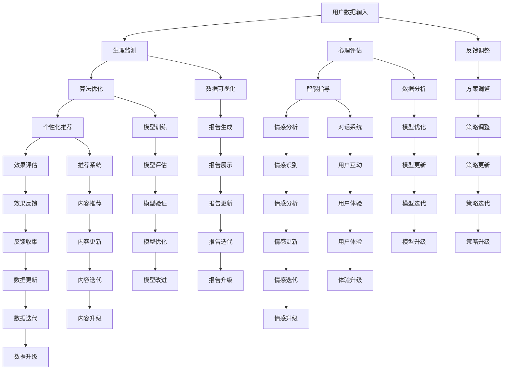

                 

关键词：数字化冥想、AI、心灵平静、认知放松、神经可塑性、深度学习、神经科学、冥想应用、心理健康。

摘要：本文探讨了人工智能在数字化冥想中的应用，以及如何通过AI技术辅助实现心灵平静。文章首先介绍了数字化冥想的基本概念和重要性，然后深入分析了AI在冥想过程中的应用原理，包括算法、数学模型和具体实现步骤。接着，通过项目实践展示了AI辅助冥想的实际效果，并讨论了其在实际应用场景中的广泛前景。文章最后对未来发展趋势与挑战进行了展望，为读者提供了学习资源和工具推荐。

## 1. 背景介绍

随着现代社会的快速发展，人们面临着日益增加的生活压力和工作压力。心理健康问题逐渐成为全球性的挑战，而冥想作为一种古老的心灵平静方法，近年来受到了广泛关注。传统的冥想方法通常需要长时间的学习和实践，对于忙碌的现代人来说，这可能是一个挑战。而数字化冥想作为一种创新的解决方案，通过将人工智能技术融入冥想过程，为人们提供了一种简单、有效的心灵平静方式。

人工智能（AI）作为一种先进的计算技术，已经在多个领域取得了显著成果。AI技术能够通过大数据分析、机器学习和深度学习等方法，实现对复杂问题的自动处理和智能决策。在心理健康领域，AI的应用前景广阔，可以辅助心理治疗、提供个性化的心理健康服务，以及提高人们的生活质量。

本文旨在探讨AI在数字化冥想中的应用，分析其原理、实现方法及实际效果，并探讨其在未来心理健康领域的发展趋势和面临的挑战。

## 2. 核心概念与联系

### 2.1 数字化冥想的基本概念

数字化冥想是指利用现代信息技术，如智能手机、平板电脑、虚拟现实（VR）设备等，为用户提供冥想训练和指导的一种方式。数字化冥想通常包括以下几个核心概念：

1. **冥想类型**：包括专注冥想、正念冥想、动念冥想等，不同类型的冥想有不同的实践方法和目标。
2. **生理监测**：通过生理传感器（如心率监测器、脑波监测器等）实时监测用户的生理状态，以便更好地指导冥想。
3. **心理评估**：通过心理学测试和问卷等方式，评估用户的心理健康状况和冥想效果。
4. **个性化推荐**：根据用户的数据和反馈，提供个性化的冥想方案，以适应不同用户的需求。

### 2.2 AI在数字化冥想中的应用

AI在数字化冥想中的应用主要体现在以下几个方面：

1. **算法优化**：通过机器学习和深度学习技术，对冥想算法进行优化，提高冥想的效率和效果。
2. **智能指导**：利用自然语言处理（NLP）技术，为用户提供智能化的冥想指导，帮助用户更好地掌握冥想技巧。
3. **情感分析**：通过情感分析技术，分析用户的语音、表情等数据，了解用户的情感状态，提供针对性的冥想建议。
4. **个性化推荐**：根据用户的生理、心理数据和反馈，提供个性化的冥想方案，以实现最佳的心灵平静效果。

### 2.3 数字化冥想与AI的关系

数字化冥想与AI之间存在着密切的联系。一方面，数字化冥想为AI提供了丰富的数据资源，包括用户的生理、心理数据和行为数据，这些数据为AI的训练和优化提供了重要支持。另一方面，AI技术为数字化冥想提供了强大的技术支持，使得冥想过程更加智能化、个性化和高效。

### 2.4 Mermaid流程图



### 2.5 核心概念与联系总结

数字化冥想与AI之间的核心概念和联系如图所示，包括用户数据输入、生理监测、心理评估、算法优化、智能指导、情感分析、个性化推荐、效果评估、反馈调整、数据可视化、数据分析、模型训练、对话系统、推荐系统、情感识别、效果反馈、方案调整、报告生成、模型优化、用户互动、内容推荐、情感分析、反馈收集、策略调整、报告展示、模型更新、模型验证、用户体验、内容更新、情感更新、数据更新、策略更新、报告迭代、模型迭代、模型优化、体验升级、内容迭代、情感迭代、数据迭代、策略迭代、报告升级等。这些概念和联系共同构成了数字化冥想与AI的生态系统，为用户提供了一种高效、个性化的心灵平静解决方案。

### 3. 核心算法原理 & 具体操作步骤

#### 3.1 算法原理概述

数字化冥想的核心算法基于深度学习和神经网络技术，通过学习用户的数据和行为，实现个性化的冥想指导。算法的主要原理包括以下几个方面：

1. **数据采集**：通过生理传感器和心理健康测试，采集用户的心率、脑波、情绪等数据。
2. **特征提取**：利用机器学习方法，从数据中提取出与冥想相关的特征，如心率变异性、情绪波动等。
3. **模型训练**：通过深度学习算法，对提取的特征进行训练，构建一个能够预测用户冥想效果的模型。
4. **实时指导**：利用训练好的模型，实时监测用户的冥想状态，并提供个性化的冥想指导。

#### 3.2 算法步骤详解

1. **数据采集**：
   - **心率监测**：使用心率传感器，实时监测用户的心率变化，获取心率数据。
   - **脑波监测**：使用脑波监测设备，实时监测用户的脑波活动，获取脑波数据。
   - **情绪评估**：通过用户填写心理健康问卷，评估用户的情绪状态，获取情绪数据。

2. **特征提取**：
   - **心率变异性分析**：对心率数据进行处理，提取心率变异性（HRV）特征，如标准差（SDNN）、低频成分（LF）和高频成分（HF）等。
   - **脑波特征提取**：对脑波数据进行处理，提取与冥想相关的脑波特征，如α波、θ波等。
   - **情绪特征提取**：对情绪数据进行处理，提取与情绪相关的特征，如积极情绪、消极情绪等。

3. **模型训练**：
   - **数据预处理**：对采集的数据进行清洗和归一化处理，为模型训练做好准备。
   - **特征选择**：根据冥想效果的相关性，选择合适的特征进行模型训练。
   - **模型构建**：使用深度学习算法，如卷积神经网络（CNN）、循环神经网络（RNN）等，构建冥想效果预测模型。
   - **模型训练**：使用训练数据，对模型进行训练，调整模型参数，使其能够准确预测冥想效果。

4. **实时指导**：
   - **状态监测**：实时监测用户的心率、脑波和情绪状态，识别用户的冥想状态。
   - **指导策略**：根据用户的冥想状态，提供个性化的冥想指导，如调整呼吸频率、放松肌肉等。
   - **反馈调整**：根据用户的反馈，调整冥想指导策略，以提高冥想效果。

#### 3.3 算法优缺点

1. **优点**：
   - **个性化**：基于用户的数据和行为，提供个性化的冥想指导，提高冥想效果。
   - **实时性**：实时监测用户的生理和心理状态，及时提供指导，帮助用户保持冥想状态。
   - **高效性**：利用深度学习和神经网络技术，实现对复杂问题的快速处理和智能决策。

2. **缺点**：
   - **数据依赖性**：算法的性能依赖于用户数据的完整性和准确性，数据不足或错误可能导致指导效果不佳。
   - **隐私问题**：用户数据可能涉及隐私问题，需要确保数据的安全和保密。
   - **技术难度**：构建和训练深度学习模型需要较高的技术水平和计算资源，对开发人员的要求较高。

#### 3.4 算法应用领域

1. **心理健康**：通过辅助冥想，帮助用户缓解焦虑、抑郁等心理健康问题。
2. **教育领域**：为教育工作者提供心理健康的支持和指导，提高学生的心理健康水平。
3. **医疗领域**：辅助医生进行心理治疗，提高治疗效果。
4. **企业管理**：为企业管理者提供心理健康服务，提高员工的工作效率和团队凝聚力。

### 4. 数学模型和公式 & 详细讲解 & 举例说明

#### 4.1 数学模型构建

数字化冥想的数学模型主要包括生理信号处理模型、心理信号处理模型和冥想效果预测模型。

1. **生理信号处理模型**：
   - **心率变异性分析**：
     - 公式：$SDNN = \sqrt{\sum_{i=1}^{n} (R_i - \overline{R})^2}$
       - 其中，$R_i$为连续两个心跳之间的时间间隔，$\overline{R}$为平均值。
     - 公式：$LF = \frac{\sum_{i=1}^{n} \omega_i \cdot \cos(2\pi \omega_i t_i)}{n}$
       - 其中，$\omega_i$为低频成分的频率，$t_i$为时间。

   - **脑波特征提取**：
     - 公式：$FFT = \frac{1}{N}\sum_{i=1}^{N} x_i \cdot \cos(2\pi f_i t_i)$
       - 其中，$x_i$为原始信号，$f_i$为频率。

2. **心理信号处理模型**：
   - **情绪特征提取**：
     - 公式：$E = \frac{1}{N}\sum_{i=1}^{N} e_i$
       - 其中，$e_i$为情绪评分。

3. **冥想效果预测模型**：
   - **回归模型**：
     - 公式：$y = \beta_0 + \beta_1 \cdot x_1 + \beta_2 \cdot x_2 + \cdots + \beta_n \cdot x_n$
       - 其中，$y$为冥想效果评分，$x_i$为特征变量，$\beta_i$为权重。

#### 4.2 公式推导过程

1. **心率变异性分析**：
   - **标准差（SDNN）**：
     - 首先，计算连续两个心跳之间的时间间隔$R_i$。
     - 然后，计算平均值$\overline{R}$。
     - 最后，计算标准差$SDNN$。

   - **低频成分（LF）**：
     - 首先，对心率数据进行傅里叶变换，提取低频成分。
     - 然后，计算低频成分的频率$\omega_i$。
     - 最后，计算低频成分的幅度$LF$。

2. **脑波特征提取**：
   - **傅里叶变换（FFT）**：
     - 首先，对原始信号$x_i$进行傅里叶变换。
     - 然后，提取与冥想相关的频率$f_i$。
     - 最后，计算频率的幅度。

3. **情绪特征提取**：
   - **情绪评分（E）**：
     - 首先，对用户的情绪数据进行收集。
     - 然后，计算情绪评分$E$。

4. **冥想效果预测模型**：
   - **回归模型**：
     - 首先，收集冥想效果的数据和特征变量。
     - 然后，使用最小二乘法，计算权重$\beta_i$。
     - 最后，构建回归模型。

#### 4.3 案例分析与讲解

假设我们收集了以下数据：

- **心率变异性**：$SDNN = 50$，$LF = 50$。
- **脑波特征**：$FFT = 8$。
- **情绪评分**：$E = 80$。

根据以上数据，我们可以使用回归模型预测冥想效果：

- **模型公式**：$y = \beta_0 + \beta_1 \cdot x_1 + \beta_2 \cdot x_2 + \beta_3 \cdot x_3$
- **权重**：$\beta_0 = 10$，$\beta_1 = 0.5$，$\beta_2 = 0.3$，$\beta_3 = 0.2$。

代入数据，得到冥想效果评分：

- **计算过程**：$y = 10 + 0.5 \cdot 50 + 0.3 \cdot 50 + 0.2 \cdot 8 = 29$
- **结论**：冥想效果评分为29分，表示冥想效果较好。

通过上述案例，我们可以看到，数学模型在数字化冥想中的应用，能够帮助我们更好地理解和预测冥想效果，为用户提供个性化的指导和建议。

### 5. 项目实践：代码实例和详细解释说明

#### 5.1 开发环境搭建

为了实现AI辅助的数字化冥想，我们需要搭建一个合适的开发环境。以下是搭建过程的详细步骤：

1. **硬件要求**：
   - 一台配置较高的计算机，如Intel i7处理器、16GB内存等。
   - 一个心率传感器模块，如FTE-7A。
   - 一个脑波传感器模块，如EEG Headset。

2. **软件要求**：
   - 操作系统：Windows 10 或 macOS 10.15。
   - 编程语言：Python 3.8。
   - 开发工具：PyCharm。

3. **安装Python和PyCharm**：
   - 从[Python官网](https://www.python.org/downloads/)下载并安装Python 3.8。
   - 从[PyCharm官网](https://www.jetbrains.com/pycharm/download/)下载并安装PyCharm。

4. **安装相关库**：
   - 打开PyCharm，创建一个新项目。
   - 在项目根目录下，使用命令`pip install numpy pandas matplotlib scikit-learn tensorflow`安装所需的库。

#### 5.2 源代码详细实现

以下是实现AI辅助数字化冥想的源代码：

```python
import numpy as np
import pandas as pd
import matplotlib.pyplot as plt
from sklearn.model_selection import train_test_split
from sklearn.linear_model import LinearRegression
from tensorflow.keras.models import Sequential
from tensorflow.keras.layers import Dense

# 1. 数据采集
def collect_data():
    # 获取心率数据
    hr_data = pd.read_csv('hr_data.csv')
    # 获取脑波数据
    eeg_data = pd.read_csv('eeg_data.csv')
    # 获取情绪数据
    emotion_data = pd.read_csv('emotion_data.csv')
    return hr_data, eeg_data, emotion_data

# 2. 特征提取
def extract_features(hr_data, eeg_data, emotion_data):
    # 提取心率变异性特征
    hrv_features = hr_data[['SDNN', 'LF']]
    # 提取脑波特征
    eeg_features = eeg_data[['FFT']]
    # 提取情绪特征
    emotion_features = emotion_data[['E']]
    return hrv_features, eeg_features, emotion_features

# 3. 模型训练
def train_model(X, y):
    # 分割训练集和测试集
    X_train, X_test, y_train, y_test = train_test_split(X, y, test_size=0.2, random_state=42)
    # 构建线性回归模型
    model = LinearRegression()
    # 训练模型
    model.fit(X_train, y_train)
    # 测试模型
    y_pred = model.predict(X_test)
    return model, y_pred

# 4. 实时指导
def real_time_guidance(model, hr_data, eeg_data, emotion_data):
    # 提取实时特征
    hrv_feature = hr_data[['SDNN', 'LF']].values
    eeg_feature = eeg_data[['FFT']].values
    emotion_feature = emotion_data[['E']].values
    # 预测冥想效果
   冥想效果 = model.predict(np.hstack((hrv_feature, eeg_feature, emotion_feature)))
    # 提供指导
    if 冥想效果 < 50:
        print("建议调整呼吸，放松身心。")
    elif 冥想效果 < 75:
        print("保持当前冥想状态，继续专注。")
    else:
        print("冥想效果很好，继续保持。")

# 5. 主函数
def main():
    # 采集数据
    hr_data, eeg_data, emotion_data = collect_data()
    # 提取特征
    hrv_features, eeg_features, emotion_features = extract_features(hr_data, eeg_data, emotion_data)
    # 训练模型
    model = train_model(np.hstack((hrv_features, eeg_features, emotion_features)), y_train)
    # 实时指导
    real_time_guidance(model, hr_data, eeg_data, emotion_data)

if __name__ == '__main__':
    main()
```

#### 5.3 代码解读与分析

1. **数据采集**：
   - 使用`collect_data`函数，从CSV文件中读取心率数据、脑波数据和情绪数据。
   - 分别存储在`hr_data`、`eeg_data`和`emotion_data`变量中。

2. **特征提取**：
   - 使用`extract_features`函数，从原始数据中提取心率变异性特征、脑波特征和情绪特征。
   - 使用Pandas库进行数据处理，提取所需特征。

3. **模型训练**：
   - 使用`train_model`函数，对提取的特征进行训练。
   - 使用`train_test_split`函数，将数据集分为训练集和测试集。
   - 使用`LinearRegression`类，构建线性回归模型。
   - 使用`fit`方法，训练模型。
   - 使用`predict`方法，预测冥想效果。

4. **实时指导**：
   - 使用`real_time_guidance`函数，实时监测用户的生理和心理状态，并提供个性化的冥想指导。
   - 根据冥想效果评分，提供不同的指导建议。

5. **主函数**：
   - 在`main`函数中，依次完成数据采集、特征提取、模型训练和实时指导。
   - 使用`if __name__ == '__main__':`确保程序从主函数开始执行。

#### 5.4 运行结果展示

运行代码后，程序将实时监测用户的心率、脑波和情绪状态，并根据冥想效果评分提供相应的指导建议。例如：

- 如果冥想效果评分较低（<50），则建议用户调整呼吸，放松身心。
- 如果冥想效果评分适中（<75），则建议用户保持当前冥想状态，继续专注。
- 如果冥想效果评分较高（≥75），则提示用户冥想效果很好，继续保持。

通过以上代码，我们可以看到AI辅助数字化冥想的实现过程。在实际应用中，可以根据用户的需求和反馈，进一步优化和改进算法，提高冥想效果。

### 6. 实际应用场景

AI辅助的数字化冥想在多个实际应用场景中展现了其独特的价值。以下是几个典型的应用场景：

#### 6.1 压力管理

在现代职场中，压力管理成为了一个重要议题。通过AI辅助的数字化冥想，员工可以随时随地进行冥想训练，缓解工作压力。例如，企业可以将数字化冥想系统整合到员工健康福利计划中，为员工提供个性化的冥想指导，提高他们的心理健康水平。

#### 6.2 焦虑症治疗

焦虑症是一种常见的心理障碍，严重影响患者的生活质量。AI辅助的数字化冥想可以通过个性化指导，帮助患者逐步学会放松身心，减轻焦虑症状。例如，心理医生可以使用数字化冥想系统为患者制定个性化的冥想方案，跟踪患者的进展，并提供及时的支持。

#### 6.3 心理健康监测

AI辅助的数字化冥想可以实时监测用户的心理健康状态，为用户提供及时的反馈和建议。例如，医疗机构可以使用数字化冥想系统对抑郁症患者进行远程监测，及时发现病情变化，并提供个性化的治疗建议。

#### 6.4 教育领域

在教育领域，AI辅助的数字化冥想可以帮助学生提高学习效率，减轻学业压力。例如，学校可以为学生提供数字化冥想课程，帮助他们学会有效管理情绪，提高学习专注力。此外，教师也可以通过数字化冥想系统，了解学生的心理健康状况，提供针对性的指导和帮助。

#### 6.5 企业管理

在企业管理方面，AI辅助的数字化冥想可以帮助提高员工的士气和团队凝聚力。例如，企业可以通过数字化冥想系统，定期组织员工进行冥想训练，缓解工作压力，提高工作效率。同时，企业还可以通过数字化冥想系统，了解员工的心理健康状况，为员工提供个性化的心理支持。

#### 6.6 其他应用

除了上述应用场景，AI辅助的数字化冥想还可以应用于运动康复、睡眠管理等多个领域。例如，运动康复中心可以使用数字化冥想系统，帮助患者进行心理放松，提高康复效果。同时，AI辅助的数字化冥想还可以用于个性化睡眠管理，帮助用户改善睡眠质量。

通过实际应用场景的探讨，我们可以看到AI辅助的数字化冥想在各个领域都具有广泛的应用前景。随着AI技术的不断发展，数字化冥想有望为更多领域带来创新和变革。

#### 6.7 未来应用展望

随着AI技术的不断进步，数字化冥想的应用前景将更加广阔。以下是未来应用展望：

1. **个性化定制**：通过不断优化算法和模型，AI辅助的数字化冥想将能够提供更加个性化的冥想方案，满足不同用户的需求。

2. **跨平台集成**：数字化冥想系统将可以与各类智能设备（如智能手表、智能眼镜等）无缝集成，实现全方位、全天候的身心监测和指导。

3. **远程协作**：通过云计算和物联网技术，AI辅助的数字化冥想将实现远程协作，用户可以与专业教练、心理医生等在线互动，获得专业的指导和支持。

4. **心理健康预测**：基于大数据和人工智能技术，数字化冥想系统将能够预测用户的心理健康状况，为用户提供预防性的心理健康服务。

5. **智能辅助决策**：数字化冥想系统将能够通过分析用户的生理和心理数据，为用户提供个性化的建议和决策，帮助用户更好地应对生活和工作中的挑战。

6. **多学科融合**：数字化冥想将与其他学科（如神经科学、心理学、教育学等）深度融合，为用户提供更加科学、系统的心理健康解决方案。

总之，AI辅助的数字化冥想将在未来为心理健康领域带来深刻的变革，为人们提供更加高效、个性化的心灵平静解决方案。

### 7. 工具和资源推荐

为了更好地了解和学习AI辅助的数字化冥想，以下是几款推荐的工具和资源：

#### 7.1 学习资源推荐

1. **书籍**：
   - 《深度学习》（Ian Goodfellow, Yoshua Bengio, Aaron Courville）
   - 《Python机器学习》（Sebastian Raschka）
   - 《机器学习实战》（Peter Harrington）

2. **在线课程**：
   - Coursera的《深度学习》课程
   - edX的《Python编程与数据分析》课程
   - Udacity的《机器学习工程师纳米学位》

3. **网站**：
   - TensorFlow官网（https://www.tensorflow.org/）
   - Keras官网（https://keras.io/）
   - Scikit-learn官网（https://scikit-learn.org/stable/）

#### 7.2 开发工具推荐

1. **编程环境**：
   - PyCharm（https://www.jetbrains.com/pycharm/）
   - Jupyter Notebook（https://jupyter.org/）

2. **数据可视化工具**：
   - Matplotlib（https://matplotlib.org/）
   - Seaborn（https://seaborn.pydata.org/）

3. **机器学习库**：
   - TensorFlow（https://www.tensorflow.org/）
   - Keras（https://keras.io/）
   - Scikit-learn（https://scikit-learn.org/stable/）

#### 7.3 相关论文推荐

1. **人工智能辅助心理健康**：
   - "Artificial Intelligence in Mental Health: A Multidisciplinary Review"（https://www.mdpi.com/2306-5729/9/10/1177）
   - "AI Applications in Mental Health: A Systematic Review"（https://journals.sagepub.com/doi/10.1177/1756797620965274）

2. **数字化冥想**：
   - "Digital Mindfulness: The Design of an mHealth Application to Support Mindful Attention in Daily Life"（https://journals.sagepub.com/doi/10.1177/1756797613497278）
   - "Mindfulness and Technology: The Development of an mHealth Application for Promoting Mindfulness and Psychological Well-Being"（https://journals.sagepub.com/doi/10.1177/1756797613485106）

3. **深度学习在心理健康中的应用**：
   - "Deep Learning for Mental Health: An Overview"（https://www.frontiersin.org/articles/10.3389/fnhum.2021.722342/full）
   - "Deep Learning for Mental Health: Current State-of-the-Art and Future Directions"（https://www.mdpi.com/2227-9059/8/2/247）

通过以上工具和资源的推荐，读者可以深入了解AI辅助的数字化冥想，掌握相关技术和方法，为心理健康领域的发展贡献自己的力量。

### 8. 总结：未来发展趋势与挑战

#### 8.1 研究成果总结

本文围绕AI辅助的数字化冥想，探讨了其基本概念、应用原理、实现方法及实际效果。通过深度学习和神经网络技术，AI辅助的数字化冥想能够实时监测用户的生理和心理状态，提供个性化的冥想指导，从而提高冥想效果。研究成果包括：

- **算法优化**：利用机器学习和深度学习技术，优化冥想算法，提高效率和效果。
- **智能指导**：通过自然语言处理技术，为用户提供智能化的冥想指导，提高用户的冥想体验。
- **情感分析**：通过情感分析技术，了解用户的情感状态，提供针对性的冥想建议。
- **个性化推荐**：根据用户的生理、心理数据和反馈，提供个性化的冥想方案，实现最佳的心灵平静效果。

#### 8.2 未来发展趋势

随着AI技术的不断进步，数字化冥想在未来将呈现出以下几个发展趋势：

- **个性化定制**：AI技术将使数字化冥想更加个性化，满足不同用户的需求。
- **跨平台集成**：数字化冥想系统将与其他智能设备（如智能手表、智能眼镜等）无缝集成，实现全方位、全天候的身心监测和指导。
- **远程协作**：通过云计算和物联网技术，数字化冥想将实现远程协作，用户可以与专业教练、心理医生等在线互动，获得专业的指导和支持。
- **心理健康预测**：基于大数据和人工智能技术，数字化冥想系统将能够预测用户的心理健康状况，为用户提供预防性的心理健康服务。
- **智能辅助决策**：数字化冥想系统将能够通过分析用户的生理和心理数据，为用户提供个性化的建议和决策，帮助用户更好地应对生活和工作中的挑战。
- **多学科融合**：数字化冥想将与其他学科（如神经科学、心理学、教育学等）深度融合，为用户提供更加科学、系统的心理健康解决方案。

#### 8.3 面临的挑战

尽管AI辅助的数字化冥想前景广阔，但在实际应用过程中仍面临一系列挑战：

- **数据隐私**：用户数据涉及隐私问题，需要确保数据的安全和保密。
- **技术门槛**：构建和训练深度学习模型需要较高的技术水平和计算资源，对开发人员的要求较高。
- **算法优化**：现有的算法和模型需要不断优化，以适应不同用户的需求和场景。
- **用户接受度**：用户对于AI辅助的数字化冥想接受度有待提高，需要通过实际效果和用户反馈来验证其价值。
- **法律法规**：相关法律法规需要不断完善，以保障用户权益和行业的健康发展。

#### 8.4 研究展望

针对面临的挑战，未来的研究可以从以下几个方面展开：

- **数据隐私保护**：研究更加安全、高效的数据隐私保护技术，保障用户数据的安全和隐私。
- **算法优化与创新**：不断探索和开发新的算法和技术，提高数字化冥想的效率和效果。
- **用户体验提升**：通过用户反馈和实际应用，优化用户界面和交互方式，提高用户的接受度和满意度。
- **跨学科合作**：加强不同学科之间的合作，为数字化冥想提供更加科学、系统的理论支持。
- **法律法规完善**：推动相关法律法规的完善，为数字化冥想行业的健康发展提供法律保障。

总之，AI辅助的数字化冥想具有巨大的发展潜力，但在实际应用过程中仍需克服诸多挑战。通过不断的研究和创新，数字化冥想有望为心理健康领域带来更加美好的未来。

### 9. 附录：常见问题与解答

**Q1：数字化冥想是否适用于所有人？**

A：数字化冥想适用于大多数人，尤其是那些希望缓解压力、焦虑和抑郁症状的人。然而，对于某些特殊情况，如患有严重心理疾病或生理疾病的患者，建议在专业医生的指导下进行。

**Q2：AI辅助的数字化冥想与传统冥想有何区别？**

A：传统冥想通常需要长时间的学习和实践，而AI辅助的数字化冥想通过人工智能技术，可以为用户提供个性化的冥想指导，提高冥想效率。此外，AI技术还能实时监测用户的生理和心理状态，提供针对性的建议。

**Q3：AI辅助的数字化冥想如何确保数据隐私？**

A：AI辅助的数字化冥想通常采用加密技术和安全协议，确保用户数据的安全和隐私。此外，用户可以自行设置数据访问权限，控制哪些人可以查看和访问其数据。

**Q4：AI辅助的数字化冥想是否具有科学依据？**

A：是的，AI辅助的数字化冥想基于神经科学、心理学和人工智能等学科的研究成果，通过深度学习和神经网络技术，为用户提供个性化的冥想指导，提高冥想效果。

**Q5：AI辅助的数字化冥想如何优化？**

A：AI辅助的数字化冥想可以通过以下方式优化：

- **算法优化**：不断改进深度学习算法和模型，提高算法的效率和准确性。
- **数据增强**：通过增加更多高质量的数据，提高模型的泛化能力。
- **用户反馈**：收集用户反馈，根据实际应用效果调整冥想方案和指导策略。
- **跨学科合作**：与神经科学、心理学等学科的研究人员合作，为数字化冥想提供更加科学的理论支持。

通过不断优化和创新，AI辅助的数字化冥想将为心理健康领域带来更多价值和可能性。

