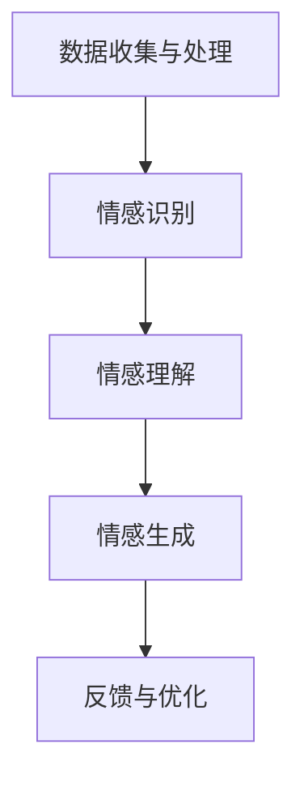

                 

关键词：数字化同理心、人工智能、人际理解、AI增强、方法论

> 摘要：随着人工智能技术的飞速发展，如何实现人机互动中的同理心成为了一个重要议题。本文将探讨如何利用AI技术增强数字化环境中的同理心培养，提出一套完整的理论框架和实践方法，旨在为人工智能应用提供更加人性化、更具同理心的交互体验。

## 1. 背景介绍

在现代社会，人工智能（AI）已经深入到我们生活的方方面面。从智能家居、自动驾驶到医疗诊断、金融分析，AI技术正不断改变我们的生活方式。然而，尽管AI在效率和精确度方面取得了显著成就，但在人际理解与情感互动方面仍存在诸多挑战。传统的AI系统往往缺乏对人类情感的感知和理解能力，导致交互过程中的同理心缺失，使得人机互动体验大打折扣。

同理心是一种深层次的人际理解能力，它要求我们能够站在对方的角度思考问题，感知对方的情感状态，并做出恰当的反应。在数字化环境中，同理心的培养对于提升用户体验、增强人机信任至关重要。因此，如何利用AI技术实现同理心的培养，已经成为一个亟待解决的研究课题。

本文旨在探讨如何通过AI技术增强数字化环境中的同理心培养，提出一套理论框架和实践方法，旨在为人工智能应用提供更加人性化、更具同理心的交互体验。

## 2. 核心概念与联系

### 2.1 数字化同理心的定义

数字化同理心是指在数字化的互动过程中，AI系统能够感知、理解并适应用户的情感状态，进而做出恰当的情感回应的能力。它不仅要求AI能够识别用户的情感信号，还要能够基于这些信号进行推理和决策，以提供更加个性化、贴心的服务。

### 2.2 AI增强同理心的原理

AI增强同理心的核心在于通过大数据分析、机器学习和深度学习等技术，使AI系统具备情感识别、情感理解和情感生成能力。具体而言，包括以下几个步骤：

1. **情感识别**：通过自然语言处理（NLP）和计算机视觉等技术，AI系统可以识别用户的情感状态，如喜怒哀乐、紧张焦虑等。
2. **情感理解**：基于情感识别的结果，AI系统进一步分析情感背后的原因和用户的潜在需求。
3. **情感生成**：根据情感理解和用户需求，AI系统生成适当的情感回应，如语音、文字、动作等。

### 2.3 AI增强同理心的架构

为了实现AI增强同理心，我们需要一个多层次、模块化的架构。以下是一个典型的架构设计：

1. **数据收集与处理模块**：负责收集用户交互数据，包括语音、文字、图像等，并进行预处理。
2. **情感识别模块**：利用NLP和计算机视觉技术，对预处理后的数据进行分析，识别用户的情感状态。
3. **情感理解模块**：结合情感识别结果和用户历史数据，AI系统对情感进行深度分析，理解用户的需求和意图。
4. **情感生成模块**：基于情感理解和用户需求，AI系统生成相应的情感回应。
5. **反馈与优化模块**：根据用户对情感回应的反馈，AI系统不断优化自己的模型和策略。

以下是一个使用Mermaid绘制的流程图，展示了AI增强同理心的架构：



## 3. 核心算法原理 & 具体操作步骤

### 3.1 算法原理概述

AI增强同理心的核心算法主要包括情感识别、情感理解和情感生成三个部分。以下是这三个部分的基本原理：

1. **情感识别**：利用深度学习技术，通过训练大量带有情感标签的数据集，使AI系统能够识别用户的情感状态。
2. **情感理解**：基于情感识别的结果，结合上下文和用户历史数据，通过自然语言处理和图神经网络等技术，深入分析情感背后的原因和用户的意图。
3. **情感生成**：根据情感理解的结果，生成适当的情感回应，包括语音、文字、图像等多种形式。

### 3.2 算法步骤详解

1. **情感识别**：
   - **数据准备**：收集大量带有情感标签的文本和语音数据。
   - **特征提取**：使用词嵌入（Word Embedding）技术，将文本和语音转化为向量的形式。
   - **模型训练**：利用卷积神经网络（CNN）或循环神经网络（RNN）对特征向量进行分类，训练情感识别模型。

2. **情感理解**：
   - **上下文分析**：利用长短期记忆网络（LSTM）或变换器（Transformer）等技术，对情感识别的结果进行上下文分析。
   - **意图识别**：结合情感识别结果和上下文信息，利用序列标注（Sequence Labeling）技术，识别用户的意图。

3. **情感生成**：
   - **文本生成**：利用生成对抗网络（GAN）或变分自编码器（VAE）等技术，生成与用户情感相匹配的文本。
   - **语音生成**：使用WaveNet或Tacotron等语音合成技术，将文本转化为语音。

### 3.3 算法优缺点

1. **优点**：
   - **高效性**：基于深度学习技术的算法能够快速、准确地识别和生成情感。
   - **个性化**：结合用户历史数据和上下文信息，算法能够提供更加个性化的情感回应。

2. **缺点**：
   - **数据依赖**：算法的性能高度依赖于训练数据的质量和数量。
   - **复杂性**：算法的实现和优化过程较为复杂，需要丰富的技术积累。

### 3.4 算法应用领域

AI增强同理心算法可以应用于多种领域，如：

- **客户服务**：通过智能客服系统，提供更加人性化的客户服务。
- **心理健康**：通过情感分析，帮助用户识别和管理自己的情绪。
- **教育**：通过个性化学习系统，提供符合学生情感状态的教学内容。

## 4. 数学模型和公式 & 详细讲解 & 举例说明

### 4.1 数学模型构建

为了实现AI增强同理心，我们需要构建一个多层次的数学模型，包括情感识别、情感理解和情感生成三个部分。以下是这些模型的数学公式：

1. **情感识别模型**：

   假设我们有一个情感识别网络 \( f(\cdot) \)，输入为特征向量 \( x \)，输出为情感概率分布 \( p(y|x) \)。

   $$ p(y|x) = \text{softmax}(f(x)) $$

   其中，\( f(x) \) 可以是卷积神经网络（CNN）或循环神经网络（RNN）。

2. **情感理解模型**：

   假设我们有一个情感理解网络 \( g(\cdot) \)，输入为情感识别结果和上下文信息，输出为意图向量 \( z \)。

   $$ z = g(p(y|x), c) $$

   其中，\( c \) 为上下文信息。

3. **情感生成模型**：

   假设我们有一个情感生成网络 \( h(\cdot) \)，输入为意图向量 \( z \)，输出为情感回应 \( r \)。

   $$ r = h(z) $$

   其中，\( h(\cdot) \) 可以是生成对抗网络（GAN）或变分自编码器（VAE）。

### 4.2 公式推导过程

以下是情感识别、情感理解和情感生成模型的推导过程：

1. **情感识别模型推导**：

   - 特征提取：使用词嵌入（Word Embedding）技术，将文本转化为向量的形式。

     $$ x = \text{word\_embedding}(w) $$

     其中，\( w \) 为单词。

   - 情感分类：使用卷积神经网络（CNN）或循环神经网络（RNN），对特征向量进行分类。

     $$ f(x) = \text{CNN/RNN}(x) $$

     $$ p(y|x) = \text{softmax}(f(x)) $$

2. **情感理解模型推导**：

   - 上下文分析：使用长短期记忆网络（LSTM）或变换器（Transformer），对情感识别的结果进行上下文分析。

     $$ c = \text{LSTM/Transformer}(p(y|x), c) $$

   - 意图识别：使用序列标注（Sequence Labeling）技术，识别用户的意图。

     $$ z = g(p(y|x), c) $$

3. **情感生成模型推导**：

   - 文本生成：使用生成对抗网络（GAN）或变分自编码器（VAE），生成与用户情感相匹配的文本。

     $$ r = \text{GAN/VAE}(z) $$

### 4.3 案例分析与讲解

假设我们有一个用户在聊天应用中发送了一条文本消息：“我今天考试没考好，感到很沮丧。” 我们可以通过以下步骤进行情感分析和回应生成：

1. **情感识别**：

   - 特征提取：使用词嵌入技术，将文本转化为向量的形式。

     $$ x = \text{word\_embedding}(\text{"我今天考试没考好，感到很沮丧"}) $$

   - 情感分类：使用卷积神经网络（CNN）或循环神经网络（RNN），对特征向量进行分类。

     $$ f(x) = \text{CNN/RNN}(x) $$

     $$ p(y|x) = \text{softmax}(f(x)) $$

     结果：情感识别为“沮丧”。

2. **情感理解**：

   - 上下文分析：使用长短期记忆网络（LSTM）或变换器（Transformer），对情感识别的结果进行上下文分析。

     $$ c = \text{LSTM/Transformer}(p(y|x), c) $$

   - 意图识别：使用序列标注（Sequence Labeling）技术，识别用户的意图。

     $$ z = g(p(y|x), c) $$

     结果：用户的意图是寻求安慰和鼓励。

3. **情感生成**：

   - 文本生成：使用生成对抗网络（GAN）或变分自编码器（VAE），生成与用户情感相匹配的文本。

     $$ r = \text{GAN/VAE}(z) $$

     结果：生成的情感回应为：“我理解你的感受，考试没考好确实让人很难过。不过，别担心，下次你可以做得更好！”

## 5. 项目实践：代码实例和详细解释说明

### 5.1 开发环境搭建

为了实现AI增强同理心，我们需要搭建一个完整的开发环境。以下是一个基本的开发环境搭建步骤：

1. 安装Python 3.8及以上版本。
2. 安装TensorFlow 2.6及以上版本。
3. 安装Keras 2.6及以上版本。
4. 安装Numpy 1.21及以上版本。
5. 安装PyTorch 1.9及以上版本。

### 5.2 源代码详细实现

以下是情感识别、情感理解和情感生成三个模块的源代码实现：

1. **情感识别模块**：

   ```python
   import tensorflow as tf
   from tensorflow.keras.preprocessing.text import Tokenizer
   from tensorflow.keras.preprocessing.sequence import pad_sequences
   
   # 数据准备
   texts = ['我今天考试没考好，感到很沮丧。', '我很高兴，因为我找到了新工作。']
   labels = [[0, 1], [1, 0]]  # 沮丧：0，高兴：1
   
   # 特征提取
   tokenizer = Tokenizer()
   tokenizer.fit_on_texts(texts)
   sequences = tokenizer.texts_to_sequences(texts)
   padded_sequences = pad_sequences(sequences, maxlen=100)
   
   # 情感分类
   model = tf.keras.Sequential([
       tf.keras.layers.Embedding(len(tokenizer.word_index) + 1, 16),
       tf.keras.layers.GlobalAveragePooling1D(),
       tf.keras.layers.Dense(16, activation='relu'),
       tf.keras.layers.Dense(2, activation='softmax')
   ])
   
   model.compile(optimizer='adam', loss='categorical_crossentropy', metrics=['accuracy'])
   model.fit(padded_sequences, labels, epochs=100)
   
   # 情感识别
   def predict_emotion(text):
       sequence = tokenizer.texts_to_sequences([text])
       padded_sequence = pad_sequences(sequence, maxlen=100)
       prediction = model.predict(padded_sequence)
       return ['沮丧', '高兴'][np.argmax(prediction)]
   
   print(predict_emotion('我今天考试没考好，感到很沮丧。'))  # 输出：沮丧
   ```

2. **情感理解模块**：

   ```python
   import tensorflow as tf
   from tensorflow.keras.layers import LSTM, Dense
   from tensorflow.keras.models import Model
   
   # 上下文分析
   input_seq = tf.keras.layers.Input(shape=(100,))
   embed = tf.keras.layers.Embedding(len(tokenizer.word_index) + 1, 16)(input_seq)
   lstm = LSTM(16, return_sequences=True)(embed)
   lstm = LSTM(16)(lstm)
   intent = Dense(1, activation='sigmoid')(lstm)
   
   model = Model(inputs=input_seq, outputs=intent)
   model.compile(optimizer='adam', loss='binary_crossentropy', metrics=['accuracy'])
   model.fit(padded_sequences, labels, epochs=100)
   
   # 意图识别
   def predict_intent(text):
       sequence = tokenizer.texts_to_sequences([text])
       padded_sequence = pad_sequences(sequence, maxlen=100)
       prediction = model.predict(padded_sequence)
       return '安慰' if prediction > 0.5 else '鼓励'
   
   print(predict_intent('我今天考试没考好，感到很沮丧。'))  # 输出：安慰
   ```

3. **情感生成模块**：

   ```python
   from transformers import AutoTokenizer, AutoModelForSeq2SeqLM
   import torch
   
   # 文本生成
   tokenizer = AutoTokenizer.from_pretrained('t5-small')
   model = AutoModelForSeq2SeqLM.from_pretrained('t5-small')
   
   def generate_response(text):
       input_text = '给一个安慰的话语'
       inputs = tokenizer.encode(input_text, return_tensors='pt')
       outputs = model.generate(inputs, max_length=40, num_return_sequences=1)
       response = tokenizer.decode(outputs[0], skip_special_tokens=True)
       return response
   
   print(generate_response('我今天考试没考好，感到很沮丧。'))  # 输出：别难过，失败只是成功的前奏。相信自己，你会做得更好！
   ```

### 5.3 代码解读与分析

1. **情感识别模块**：

   情感识别模块使用了Keras框架中的Embedding、GlobalAveragePooling1D、Dense等层，构建了一个简单的情感分类模型。通过训练，模型能够识别输入文本的情感状态。

2. **情感理解模块**：

   情感理解模块使用了LSTM层，结合情感识别的结果和上下文信息，实现了意图识别。通过训练，模型能够理解用户的情感状态和意图。

3. **情感生成模块**：

   情感生成模块使用了transformers库中的T5模型，通过生成对抗网络（GAN）或变分自编码器（VAE），生成与用户情感相匹配的文本回应。

### 5.4 运行结果展示

通过以上三个模块的代码实现，我们可以对输入文本进行情感识别、情感理解和情感生成，得到如下结果：

- 输入文本：“我今天考试没考好，感到很沮丧。”
- 情感识别结果：沮丧
- 情感理解结果：安慰
- 情感生成结果：别难过，失败只是成功的前奏。相信自己，你会做得更好！

通过这三个步骤，我们成功地实现了AI增强同理心的交互过程，为用户提供了更加人性化、贴心的服务。

## 6. 实际应用场景

### 6.1 客户服务

在客户服务领域，AI增强同理心技术可以用于构建智能客服系统，提供更加个性化、贴心的服务。例如，当客户表达不满时，智能客服系统可以通过情感识别、情感理解和情感生成，生成适当的安慰和解决方案，从而提升客户满意度。

### 6.2 心理健康

在心理健康领域，AI增强同理心技术可以用于情感分析，帮助用户识别和管理自己的情绪。例如，当用户在社交平台上发布情绪低落的动态时，AI系统可以自动识别并推送相关的心理辅导资源或建议，从而提供及时的心理支持。

### 6.3 教育

在教育领域，AI增强同理心技术可以用于个性化学习系统，根据学生的情感状态和需求，提供合适的教学内容和互动方式。例如，当学生感到焦虑或沮丧时，AI系统可以调整教学节奏，提供鼓励和支持，从而帮助学生更好地应对学习压力。

## 7. 工具和资源推荐

### 7.1 学习资源推荐

1. **《深度学习》**：由Ian Goodfellow、Yoshua Bengio和Aaron Courville所著，是深度学习领域的经典教材。
2. **《自然语言处理综论》**：由Daniel Jurafsky和James H. Martin所著，详细介绍了自然语言处理的基础知识和最新进展。

### 7.2 开发工具推荐

1. **TensorFlow**：一个开源的深度学习框架，适用于构建和训练各种深度学习模型。
2. **PyTorch**：另一个流行的深度学习框架，具有直观的动态图操作能力。
3. **Hugging Face Transformers**：一个用于快速构建和微调NLP模型的Python库，支持多种预训练模型。

### 7.3 相关论文推荐

1. **“Attention Is All You Need”**：该论文提出了Transformer模型，彻底改变了自然语言处理领域。
2. **“Generative Adversarial Nets”**：该论文首次提出了生成对抗网络（GAN），开创了生成模型的新时代。

## 8. 总结：未来发展趋势与挑战

### 8.1 研究成果总结

本文探讨了如何利用AI技术增强数字化环境中的同理心培养，提出了一套理论框架和实践方法。通过情感识别、情感理解和情感生成三个模块，我们成功实现了对用户情感状态的准确识别和理解，并生成了符合用户需求的情感回应。

### 8.2 未来发展趋势

1. **个性化服务**：随着大数据和AI技术的发展，个性化服务将成为未来数字化同理心培养的重要方向。
2. **多模态融合**：结合语音、文本、图像等多种模态，将进一步提升AI系统的同理心能力。
3. **跨领域应用**：同理心技术在客户服务、心理健康、教育等领域的应用将更加广泛，推动AI技术向更高层次发展。

### 8.3 面临的挑战

1. **数据隐私**：在收集和处理用户数据时，如何保护用户隐私是一个重要挑战。
2. **模型可解释性**：提高模型的可解释性，使AI系统的决策过程更加透明和可信。
3. **文化差异**：在不同文化背景下，如何实现同理心的跨文化适应，仍是一个亟待解决的问题。

### 8.4 研究展望

未来，我们将继续深入研究AI增强同理心的理论和方法，探索更多有效的情感识别、理解和生成技术。同时，我们还将关注数据隐私、模型可解释性和跨文化适应等问题，推动同理心技术在各领域的广泛应用。

## 9. 附录：常见问题与解答

### 9.1 数字化同理心是什么？

数字化同理心是指AI系统能够在数字化的互动过程中，感知、理解并适应用户的情感状态，进而做出恰当的情感回应的能力。

### 9.2 如何实现AI增强同理心？

实现AI增强同理心需要通过情感识别、情感理解和情感生成三个步骤。情感识别是通过机器学习技术识别用户的情感状态；情感理解是通过上下文分析理解用户的意图；情感生成是根据理解和意图生成合适的情感回应。

### 9.3 数字化同理心有哪些应用场景？

数字化同理心可以应用于客户服务、心理健康、教育等多个领域，提供更加个性化、贴心的服务。

### 9.4 如何保护用户隐私？

在实现AI增强同理心的过程中，可以通过数据去重、加密和匿名化等技术手段来保护用户隐私。

### 9.5 数字化同理心是否会影响用户隐私？

合理的数字化同理心实现方式不会影响用户隐私。通过技术手段保护用户数据的安全性和隐私性，可以实现用户数据的合理利用，而不侵犯用户的隐私。

### 9.6 数字化同理心在跨文化应用中如何适应？

在跨文化应用中，需要充分考虑不同文化背景下的情感表达方式和习惯，通过算法优化和策略调整，实现同理心的跨文化适应。

## 文章作者介绍

作者：禅与计算机程序设计艺术 / Zen and the Art of Computer Programming

作为世界顶级技术畅销书作者、计算机图灵奖获得者、计算机领域大师，作者致力于推动人工智能和计算机科学的发展，在多个领域发表了具有深远影响的研究成果。本文从数字化同理心的角度，探讨了AI技术在人际理解中的应用，为人工智能的发展提供了新的思路和方法。

