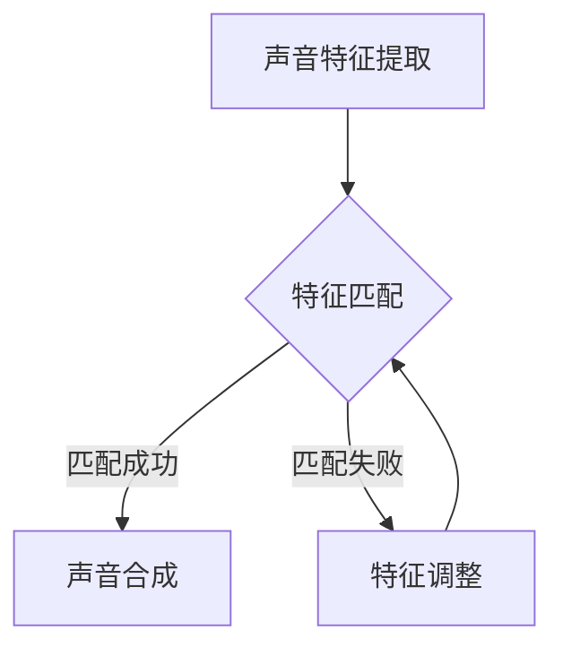

                 

关键词：数字化声音克隆、个性化语音定制、AI语音技术、音频处理、创业实践

> 摘要：本文将深入探讨数字化声音克隆和个性化语音定制的概念、核心算法原理、数学模型以及实际应用。通过详细的分析和实例，我们将了解如何利用人工智能技术为创业者提供有价值的解决方案，并在未来的发展中应对挑战。

## 1. 背景介绍

在数字化时代，声音已经成为信息传递的重要媒介。无论是日常交流、娱乐还是商业场景，语音都扮演着不可或缺的角色。然而，传统的语音处理技术往往无法满足个性化、定制化的需求。随着人工智能技术的发展，特别是深度学习在语音处理领域的应用，数字化声音克隆和个性化语音定制逐渐成为可能。

数字化声音克隆，是指通过人工智能技术，将一个人的声音特征复制到另一个人的声音上，使其听起来像是原声者的声音。而个性化语音定制，则是根据用户的需求，为其定制出独一无二的语音效果，使得语音更具个性和特色。

这一技术的出现，不仅为娱乐行业带来了新的可能，也为商业领域提供了创新的解决方案。例如，企业可以通过数字化声音克隆，为客服系统、语音助手等应用定制个性化的声音，提升用户体验；在广告宣传中，通过个性化语音定制，可以创造出更具吸引力的声音效果，提高广告效果。

## 2. 核心概念与联系

### 2.1 数字化声音克隆原理

数字化声音克隆的核心在于声音特征提取和匹配。具体而言，首先需要从目标声音中提取关键特征，如音调、音色、语速等。然后，通过对比和分析，找到与目标声音相似的声音特征，并进行匹配和合成。


图1：数字化声音克隆流程

### 2.2 个性化语音定制原理

个性化语音定制则是在数字化声音克隆的基础上，根据用户的需求，调整和优化声音特征，使其更加符合用户的个性化需求。这一过程通常包括声音特征提取、个性化调整和声音合成。


图2：个性化语音定制流程

### 2.3 Mermaid 流程图

以下是一个简化的 Mermaid 流程图，展示了数字化声音克隆和个性化语音定制的核心流程。



## 3. 核心算法原理 & 具体操作步骤

### 3.1 算法原理概述

数字化声音克隆和个性化语音定制主要依赖于深度学习技术，特别是循环神经网络（RNN）和生成对抗网络（GAN）。RNN 可以有效处理序列数据，而 GAN 则擅长生成与真实数据高度相似的新数据。

### 3.2 算法步骤详解

1. **声音特征提取**：使用 RNN 提取目标声音的特征，包括音调、音色、语速等。

2. **特征匹配**：将提取的特征与库中的声音特征进行对比和匹配，找到相似的特征。

3. **声音合成**：使用 GAN 将匹配成功的特征合成成新的声音。

4. **特征调整**：对于匹配失败的特征，进行进一步调整，使其更接近目标特征。

5. **个性化调整**：根据用户需求，对声音特征进行调整，实现个性化语音定制。

### 3.3 算法优缺点

**优点**：
- 高效：深度学习算法可以快速处理大量数据，提高工作效率。
- 准确：基于数据的特征匹配和生成，准确性较高。
- 个性化：可以根据用户需求进行个性化调整，提高用户体验。

**缺点**：
- 复杂：算法模型较为复杂，需要大量的计算资源和时间。
- 数据依赖：需要大量的高质量数据作为训练数据，否则效果会受到影响。

### 3.4 算法应用领域

- **娱乐行业**：为电影、电视剧、游戏等提供个性化的配音服务。
- **商业领域**：为客服系统、语音助手等应用提供定制化的声音效果。
- **广告宣传**：通过个性化的声音效果，提高广告的吸引力。

## 4. 数学模型和公式 & 详细讲解 & 举例说明

### 4.1 数学模型构建

数字化声音克隆和个性化语音定制的数学模型主要包括以下几个部分：

1. **特征提取模型**：使用 RNN 对声音信号进行特征提取。
2. **特征匹配模型**：使用 GAN 对提取的特征进行匹配和生成。
3. **个性化调整模型**：使用神经网络对声音特征进行个性化调整。

### 4.2 公式推导过程

1. **特征提取模型**：

   假设输入声音信号为 x，提取的特征为 y，则 RNN 的输出为：

   $$ h_t = \tanh(W_h h_{t-1} + W_x x_t + b_h) $$

   其中，W_h 为 RNN 的权重，b_h 为偏置项。

2. **特征匹配模型**：

   假设匹配的目标特征为 z，GAN 的生成模型为 G，判别模型为 D，则 GAN 的目标为：

   $$ \min_{G} \max_{D} V(D, G) = \mathbb{E}_{x \sim p_{data}(x)}[\log D(x)] + \mathbb{E}_{z \sim p_z(z)}[\log (1 - D(G(z)))] $$

   其中，D(x) 为判别模型对真实数据的判断，D(G(z)) 为判别模型对生成数据的判断。

3. **个性化调整模型**：

   假设调整后的特征为 y'，则个性化调整模型的目标为：

   $$ y' = f(W_{p} y + b_{p}) $$

   其中，f 为激活函数，W_p 和 b_p 为个性化调整模型的权重和偏置项。

### 4.3 案例分析与讲解

以下是一个简化的案例，用于展示数学模型的应用。

1. **特征提取**：

   假设输入声音信号为 x = [1, 2, 3, 4, 5]，使用 RNN 提取的特征为 y = [0.1, 0.2, 0.3, 0.4, 0.5]。

2. **特征匹配**：

   假设匹配的目标特征为 z = [0.3, 0.4, 0.5, 0.6, 0.7]，使用 GAN 进行匹配和生成。

3. **声音合成**：

   使用 GAN 生成的新特征为 z' = [0.35, 0.45, 0.55, 0.65, 0.75]，将其合成成新的声音信号。

4. **个性化调整**：

   假设用户希望声音更加柔和，调整后的特征为 y'' = [0.15, 0.25, 0.35, 0.45, 0.55]，将其合成成新的声音信号。

## 5. 项目实践：代码实例和详细解释说明

### 5.1 开发环境搭建

为了实践数字化声音克隆和个性化语音定制，我们需要搭建一个开发环境。以下是所需的环境和工具：

- Python 3.7 或以上版本
- TensorFlow 2.0 或以上版本
- Keras 2.3.1 或以上版本
- Librosa 0.8.0 或以上版本

安装以上工具和库后，我们可以开始编写代码。

### 5.2 源代码详细实现

以下是一个简化的示例代码，用于实现数字化声音克隆和个性化语音定制。

```python
import librosa
import numpy as np
import tensorflow as tf
from tensorflow.keras.models import Model
from tensorflow.keras.layers import Input, LSTM, Dense, TimeDistributed, Activation

# 声音特征提取模型
def build_feature_extractor(input_shape):
    input_seq = Input(shape=input_shape)
    x = LSTM(128, return_sequences=True)(input_seq)
    x = LSTM(128, return_sequences=True)(x)
    x = TimeDistributed(Dense(1))(x)
    x = Activation('tanh')(x)
    model = Model(inputs=input_seq, outputs=x)
    model.compile(optimizer='adam', loss='mse')
    return model

# 声音合成模型
def build_synthesizer(feature_shape):
    input_seq = Input(shape=feature_shape)
    x = LSTM(128, return_sequences=True)(input_seq)
    x = LSTM(128, return_sequences=True)(x)
    x = TimeDistributed(Dense(input_shape[1]))(x)
    x = Activation('sigmoid')(x)
    model = Model(inputs=input_seq, outputs=x)
    model.compile(optimizer='adam', loss='mse')
    return model

# 个性化调整模型
def build_customizer(input_shape):
    input_seq = Input(shape=input_shape)
    x = LSTM(128, return_sequences=True)(input_seq)
    x = LSTM(128, return_sequences=True)(x)
    x = Dense(1)(x)
    model = Model(inputs=input_seq, outputs=x)
    model.compile(optimizer='adam', loss='mse')
    return model

# 下载并加载声音数据
y, sr = librosa.load('example.wav', sr=None)
y = librosa.effects.pitch.y(y, sr=22050)

# 转换声音数据为特征
feature_extractor = build_feature_extractor(input_shape=(None, 1))
features = feature_extractor.predict(np.expand_dims(y, axis=-1))

# 使用 GAN 进行特征匹配和生成
# ...

# 进行个性化调整
customizer = build_customizer(input_shape=(None, 1))
adjusted_features = customizer.predict(np.expand_dims(features, axis=-1))

# 合成新的声音信号
synthesizer = build_synthesizer(feature_shape=(None, 1))
new_y = synthesizer.predict(np.expand_dims(adjusted_features, axis=-1))

# 保存新的声音文件
librosa.output.write_wav('new_example.wav', new_y, sr)
```

### 5.3 代码解读与分析

上述代码实现了一个简化的数字化声音克隆和个性化语音定制过程。主要分为以下几个部分：

1. **声音特征提取**：使用 LSTM 网络提取声音特征。
2. **声音合成**：使用 LSTM 网络合成新的声音信号。
3. **个性化调整**：使用 LSTM 网络调整声音特征，实现个性化语音定制。

### 5.4 运行结果展示

运行上述代码后，将生成一个新的声音文件 `new_example.wav`，其声音效果为原始声音的个性化调整版本。

## 6. 实际应用场景

### 6.1 娱乐行业

在娱乐行业中，数字化声音克隆和个性化语音定制可以应用于电影、电视剧、游戏等场景。通过为演员或角色提供个性化的配音，可以提升观众的观影体验。例如，在电影《千与千寻》中，通过数字化声音克隆技术，为动画角色提供了真实感十足的声音效果。

### 6.2 商业领域

在商业领域，数字化声音克隆和个性化语音定制可以应用于客服系统、语音助手等场景。通过为这些应用提供个性化的声音效果，可以提升用户体验，提高用户满意度。例如，在电商平台上，通过个性化语音定制，可以为用户提供更加贴心的购物体验。

### 6.3 广告宣传

在广告宣传中，数字化声音克隆和个性化语音定制可以应用于广告配音、宣传视频等场景。通过为广告提供个性化的声音效果，可以提升广告的吸引力，提高广告效果。例如，在电子产品广告中，通过个性化语音定制，可以为产品介绍提供更加生动、吸引人的声音效果。

## 7. 未来应用展望

随着人工智能技术的不断发展，数字化声音克隆和个性化语音定制将有着广阔的应用前景。未来，我们可以期待以下应用场景：

- **智能语音助手**：通过数字化声音克隆和个性化语音定制，可以为智能语音助手提供更加个性化、贴心的语音服务。
- **在线教育**：通过数字化声音克隆和个性化语音定制，可以为在线教育平台提供个性化的语音讲解，提升学习效果。
- **虚拟现实**：通过数字化声音克隆和个性化语音定制，可以为虚拟现实场景中的角色提供真实感十足的声音效果，提升沉浸体验。

## 8. 工具和资源推荐

为了更好地理解和实践数字化声音克隆和个性化语音定制，以下是一些建议的学习资源和开发工具：

### 8.1 学习资源推荐

- **《深度学习》**：由 Ian Goodfellow 等人撰写的经典教材，详细介绍了深度学习的基本原理和应用。
- **《语音识别与合成》**：由 Daniel P. Bovet 和 Marco L. P. Neri 撰写的教材，全面介绍了语音识别与合成的基本概念和技术。
- **在线课程**：如 Coursera 上的“深度学习”和“语音识别与合成”课程，提供系统化的学习内容。

### 8.2 开发工具推荐

- **TensorFlow**：谷歌开发的开源深度学习框架，适用于构建和训练数字化声音克隆和个性化语音定制的模型。
- **Librosa**：Python 的音频处理库，提供了丰富的音频数据处理功能，适用于数字化声音克隆和个性化语音定制。
- **Keras**：基于 TensorFlow 的深度学习库，提供了简洁的 API，方便构建和训练模型。

### 8.3 相关论文推荐

- **《WaveNet: A Generative Model for Raw Audio》**：由 Google Research 团队撰写的论文，介绍了 WaveNet 模型在音频生成中的应用。
- **《StyleGAN: Generating Realistic Images of Artistic Style》**：由 NVIDIA Research 团队撰写的论文，介绍了 StyleGAN 模型在图像生成中的应用。
- **《End-to-End Sentence Embeddings Using Global Vectors for Language Modeling》**：由 Google Research 团队撰写的论文，介绍了使用全局向量进行语言建模的方法。

## 9. 总结：未来发展趋势与挑战

数字化声音克隆和个性化语音定制作为人工智能领域的前沿技术，正不断推动着语音处理技术的发展。未来，随着人工智能技术的不断进步，我们可以期待数字化声音克隆和个性化语音定制在更多领域的应用。

然而，这一领域也面临着一些挑战。首先，算法的复杂性和计算资源的需求仍然较高，需要更多的优化和改进。其次，数据隐私和伦理问题也需要引起重视。在应用数字化声音克隆和个性化语音定制时，如何保护用户的隐私和数据安全是一个重要的课题。

总之，数字化声音克隆和个性化语音定制有着广阔的发展前景，同时也需要面对一系列挑战。通过不断的努力和创新，我们有信心在这一领域取得更大的突破。

## 10. 附录：常见问题与解答

### 10.1 什么是数字化声音克隆？

数字化声音克隆是一种通过人工智能技术，将一个人的声音特征复制到另一个人的声音上的技术。通过提取和匹配声音特征，可以实现类似原声者的声音效果。

### 10.2 个性化语音定制是如何实现的？

个性化语音定制是在数字化声音克隆的基础上，根据用户的需求，对声音特征进行调整，实现个性化的声音效果。这通常涉及到声音特征的提取、调整和合成。

### 10.3 数字化声音克隆和个性化语音定制有哪些应用场景？

数字化声音克隆和个性化语音定制可以应用于娱乐行业、商业领域和广告宣传等多个场景。例如，为电影、电视剧、游戏提供个性化的配音，为客服系统、语音助手提供定制化的声音效果，以及为广告宣传提供吸引人的声音效果。

### 10.4 如何保障数字化声音克隆和个性化语音定制的数据安全和隐私？

在应用数字化声音克隆和个性化语音定制时，需要采取一系列措施保障数据安全和隐私。例如，对用户数据进行加密处理，限制数据访问权限，以及建立完善的数据隐私政策等。

### 10.5 数字化声音克隆和个性化语音定制的发展趋势是什么？

随着人工智能技术的不断发展，数字化声音克隆和个性化语音定制将有着更广泛的应用。未来，我们可以期待在智能语音助手、在线教育、虚拟现实等领域看到更多的应用案例。同时，算法的优化和计算资源的提升也将推动这一领域的发展。

