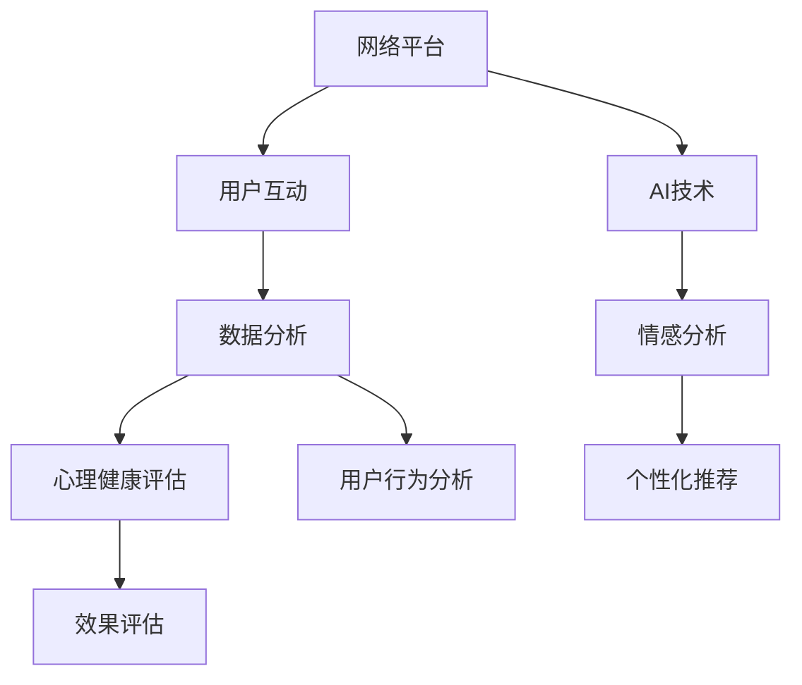

                 

关键词：数字化心理咨询、在线治疗、AI技术、商业模式、用户体验

> 摘要：本文探讨了数字化心理咨询在当今社会中的崛起及其对传统心理咨询行业的冲击。通过分析数字化心理咨询的核心概念、算法原理、数学模型以及实际应用案例，本文旨在为创业者提供有关在线心理咨询模式的发展趋势、挑战和未来展望的全面指南。

## 1. 背景介绍

在过去的几十年中，心理咨询一直是一个相对传统和保守的行业。然而，随着互联网技术的飞速发展和人工智能（AI）技术的不断进步，数字化心理咨询正逐渐成为心理咨询行业的新兴模式。这种新模式不仅为心理咨询行业带来了前所未有的变革，也为创业者提供了新的商业机会。

传统的心理咨询通常依赖于面对面交流，受限于地理位置和时间安排。而数字化心理咨询则通过网络平台和智能设备，打破了时间和空间的限制，使得更多的人能够获得便捷的心理咨询服务。此外，AI技术的应用使得心理咨询的过程更加个性化和高效，大大提升了用户体验。

### 1.1 市场需求

随着社会压力的不断增加，心理健康问题已经成为全球范围内的重大公共卫生问题。据世界卫生组织（WHO）统计，全球约有 3 亿人口患有抑郁症，而在中国，抑郁症的发病率也在逐年上升。这表明，心理咨询的需求量巨大，而传统心理咨询无法满足这一需求。

数字化心理咨询的兴起，正是为了解决传统心理咨询的局限性。通过在线平台，心理咨询师可以跨越地域限制，为全球范围内的客户提供心理咨询服务。这种模式不仅能够提高心理咨询的覆盖面，还能够降低服务成本，使得更多的人能够负担得起心理咨询。

### 1.2 竞争格局

尽管数字化心理咨询具有巨大的市场潜力，但该领域也面临着激烈的竞争。目前，市场上已经涌现出众多在线心理咨询平台，如 Talkspace、BetterHelp 和 7 Cups 等。这些平台通过提供个性化的心理咨询服务，吸引了大量的用户。

然而，这些平台在技术、用户体验和服务质量等方面存在差异。创业者需要在这些方面进行创新，才能在竞争激烈的市场中脱颖而出。例如，通过引入先进的AI技术，提高心理咨询的效率和个性化程度；通过优化用户体验，提供更加便捷和舒适的服务等。

## 2. 核心概念与联系

数字化心理咨询的核心概念包括网络平台、AI技术、数据分析和用户互动。这些概念相互关联，共同构成了数字化心理咨询的生态系统。

### 2.1 网络平台

网络平台是数字化心理咨询的基础。通过搭建一个高效、稳定和安全的在线平台，心理咨询师可以随时随地为用户提供服务。网络平台需要具备以下特点：

- **用户友好性**：界面设计简洁明了，易于操作，提高用户体验。
- **安全性**：采用加密技术，确保用户数据和隐私安全。
- **可扩展性**：能够支持大规模用户和大量数据，具备良好的扩展能力。

### 2.2 AI技术

AI技术在数字化心理咨询中发挥着关键作用。通过自然语言处理（NLP）、机器学习（ML）和深度学习（DL）等技术，AI可以帮助心理咨询师进行诊断、预测和推荐。具体应用包括：

- **情感分析**：通过分析用户的语言和行为，识别用户的情感状态和心理健康问题。
- **个性化推荐**：根据用户的历史数据和偏好，为用户提供个性化的咨询建议和服务。
- **自动化回复**：利用AI生成自动化回复，提高心理咨询的效率和准确性。

### 2.3 数据分析

数据分析是数字化心理咨询的重要工具。通过对用户数据的收集、存储和分析，心理咨询师可以更好地了解用户的需求和心理健康状况，从而提供更加精准的服务。数据分析的具体应用包括：

- **用户行为分析**：分析用户的浏览、咨询和反馈行为，了解用户的心理状态和需求。
- **心理健康评估**：通过分析用户数据，对用户的心理健康状况进行评估和预警。
- **效果评估**：评估心理咨询的效果，为优化服务提供数据支持。

### 2.4 用户互动

用户互动是数字化心理咨询的核心。通过在线聊天、视频通话和电话咨询等方式，心理咨询师可以与用户进行实时互动，提供个性化的咨询服务。用户互动的具体应用包括：

- **实时咨询**：提供实时在线咨询服务，满足用户即时需求。
- **长期跟踪**：通过持续跟踪用户数据，为用户提供长期的心理支持。
- **用户反馈**：收集用户反馈，优化服务质量和用户体验。

下面是数字化心理咨询的Mermaid流程图，展示了核心概念和它们之间的联系：



## 3. 核心算法原理 & 具体操作步骤

### 3.1 算法原理概述

数字化心理咨询中的核心算法主要包括情感分析、个性化推荐和心理健康评估。这些算法利用AI技术，从用户数据和交互中提取有价值的信息，为用户提供个性化的心理咨询服务。

- **情感分析**：通过分析用户的语言和行为，识别用户的情感状态。情感分析算法通常采用NLP技术，将自然语言转换为计算机可理解的格式，然后使用机器学习模型进行情感分类。
- **个性化推荐**：根据用户的历史数据和偏好，为用户提供个性化的咨询建议和服务。个性化推荐算法通常采用协同过滤、基于内容的推荐和深度学习等技术。
- **心理健康评估**：通过对用户数据的分析，对用户的心理健康状况进行评估和预警。心理健康评估算法通常采用统计分析、机器学习和深度学习等技术。

### 3.2 算法步骤详解

以下是数字化心理咨询中主要算法的具体操作步骤：

#### 3.2.1 情感分析

1. 数据预处理：对用户输入的自然语言文本进行清洗和格式化，去除停用词、标点和特殊字符。
2. 特征提取：将清洗后的文本转换为计算机可处理的特征向量。常用的特征提取方法包括词袋模型、TF-IDF和词嵌入等。
3. 模型训练：使用已标记的情感数据集，训练情感分类模型。常用的模型包括SVM、朴素贝叶斯、神经网络和循环神经网络等。
4. 情感识别：将用户输入的文本输入到训练好的模型中，输出情感分类结果。

#### 3.2.2 个性化推荐

1. 用户画像构建：收集用户的历史数据，包括浏览记录、咨询记录和反馈等，构建用户画像。
2. 项项相似度计算：计算用户画像之间的相似度，用于发现用户的偏好和兴趣。
3. 推荐算法选择：选择适合的推荐算法，如协同过滤、基于内容的推荐和深度学习等。
4. 推荐结果生成：根据用户画像和相似度计算结果，生成个性化的推荐列表。

#### 3.2.3 心理健康评估

1. 数据收集：收集用户的历史数据，包括心理健康评估问卷、咨询记录和反馈等。
2. 特征工程：从数据中提取有价值的特征，如情绪指标、行为指标和生理指标等。
3. 模型训练：使用已标记的心理健康数据集，训练心理健康评估模型。常用的模型包括决策树、随机森林、支持向量机和神经网络等。
4. 心理健康评估：将用户输入的数据输入到训练好的模型中，输出心理健康评估结果。

### 3.3 算法优缺点

#### 情感分析

**优点**：

- 高效：能够快速识别用户的情感状态，提供即时反馈。
- 个性化：基于用户的情感状态，为用户提供个性化的咨询服务。

**缺点**：

- 准确性：情感分析模型的准确性受限于语言和情感表达的复杂性。
- 数据依赖：情感分析模型的性能高度依赖高质量的情感数据集。

#### 个性化推荐

**优点**：

- 个性化：为用户提供个性化的咨询建议和服务，提高用户满意度。
- 高效：通过算法快速推荐合适的咨询师，节省用户时间。

**缺点**：

- 数据隐私：个性化推荐需要收集和分析用户数据，可能涉及数据隐私问题。
- 数据质量：个性化推荐的性能受限于用户数据的完整性和质量。

#### 心理健康评估

**优点**：

- 科学性：基于大数据和机器学习技术，心理健康评估结果具有较高的科学性和可靠性。
- 早期预警：能够早期发现用户的心理健康问题，提供及时干预。

**缺点**：

- 专业性：心理健康评估需要具备心理学背景的专业人士进行，算法只能作为辅助工具。
- 数据完整性：心理健康评估的结果受限于用户数据的完整性和准确性。

### 3.4 算法应用领域

情感分析、个性化推荐和心理健康评估在数字化心理咨询中具有广泛的应用领域：

- **心理健康评估**：用于诊断和预警用户的心理健康状况，为用户提供个性化的咨询服务。
- **情感分析**：用于识别用户的情感状态，为用户提供情感支持和建议。
- **个性化推荐**：用于推荐合适的咨询师，提高用户满意度和服务质量。

## 4. 数学模型和公式 & 详细讲解 & 举例说明

### 4.1 数学模型构建

在数字化心理咨询中，常用的数学模型包括情感分析模型、个性化推荐模型和心理健康评估模型。以下是这些模型的基本数学模型和公式：

#### 情感分析模型

情感分析模型通常采用二分类模型，将文本分类为正面情感或负面情感。常用的模型包括逻辑回归、支持向量机和神经网络等。以下是逻辑回归模型的基本公式：

$$
P(y=1|\textbf{x}; \theta) = \frac{1}{1 + e^{-\theta^\top \textbf{x}}}
$$

其中，$y$表示情感标签（1表示正面情感，0表示负面情感），$\textbf{x}$表示文本特征向量，$\theta$表示模型参数。

#### 个性化推荐模型

个性化推荐模型通常采用协同过滤算法，如矩阵分解、基于模型的协同过滤和深度学习等。以下是矩阵分解模型的基本公式：

$$
\textbf{X} = \textbf{U} \textbf{V}^\top
$$

其中，$\textbf{X}$表示用户-项目评分矩阵，$\textbf{U}$和$\textbf{V}$分别表示用户和项目的低维嵌入矩阵。

#### 心理健康评估模型

心理健康评估模型通常采用分类模型，如决策树、随机森林和支持向量机等。以下是决策树模型的基本公式：

$$
y = \arg \max_{\theta} \sum_{i=1}^n l(y_i, \theta(x_i))
$$

其中，$y$表示分类标签，$x_i$表示特征向量，$l$表示损失函数。

### 4.2 公式推导过程

以下是情感分析模型、个性化推荐模型和心理健康评估模型的公式推导过程：

#### 情感分析模型

情感分析模型基于逻辑回归。假设给定训练数据集$\{(\textbf{x}_i, y_i)\}_{i=1}^n$，其中$\textbf{x}_i$表示文本特征向量，$y_i$表示情感标签（1表示正面情感，0表示负面情感）。

1. **损失函数**：

   采用对数似然损失函数：

   $$
   L(\theta) = -\sum_{i=1}^n y_i \theta^\top \textbf{x}_i - (1 - y_i) \log(1 + e^{-\theta^\top \textbf{x}_i})
   $$

2. **梯度**：

   对损失函数求梯度：

   $$
   \nabla_\theta L(\theta) = -\sum_{i=1}^n \textbf{x}_i (y_i - P(y=1|\textbf{x}; \theta))
   $$

3. **优化**：

   使用梯度下降法优化模型参数：

   $$
   \theta_{\text{new}} = \theta_{\text{old}} - \alpha \nabla_\theta L(\theta)
   $$

   其中，$\alpha$表示学习率。

#### 个性化推荐模型

个性化推荐模型基于矩阵分解。假设给定训练数据集$\{(\textbf{x}_i, \textbf{v}_i, y_i)\}_{i=1}^n$，其中$\textbf{x}_i$表示用户特征向量，$\textbf{v}_i$表示项目特征向量，$y_i$表示评分。

1. **损失函数**：

   采用平方损失函数：

   $$
   L(\theta) = \sum_{i=1}^n (y_i - \textbf{u}_i^\top \textbf{v}_i)^2
   $$

2. **梯度**：

   对损失函数求梯度：

   $$
   \nabla_\theta L(\theta) = 2 \sum_{i=1}^n (y_i - \textbf{u}_i^\top \textbf{v}_i) (\textbf{u}_i \textbf{v}_i^\top)
   $$

3. **优化**：

   使用梯度下降法优化模型参数：

   $$
   \textbf{u}_{\text{new}} = \textbf{u}_{\text{old}} - \alpha \nabla_\theta L(\theta)
   $$

   $$
   \textbf{v}_{\text{new}} = \textbf{v}_{\text{old}} - \alpha \nabla_\theta L(\theta)
   $$

#### 心理健康评估模型

心理健康评估模型基于决策树。假设给定训练数据集$\{(\textbf{x}_i, y_i)\}_{i=1}^n$，其中$\textbf{x}_i$表示特征向量，$y_i$表示分类标签。

1. **损失函数**：

   采用交叉熵损失函数：

   $$
   L(\theta) = -\sum_{i=1}^n y_i \log P(y_i|\theta)
   $$

2. **梯度**：

   对损失函数求梯度：

   $$
   \nabla_\theta L(\theta) = -\sum_{i=1}^n (y_i - P(y_i|\theta)) \frac{\partial P(y_i|\theta)}{\partial \theta}
   $$

3. **优化**：

   使用梯度下降法优化模型参数：

   $$
   \theta_{\text{new}} = \theta_{\text{old}} - \alpha \nabla_\theta L(\theta)
   $$

### 4.3 案例分析与讲解

下面我们通过一个实际案例来讲解情感分析、个性化推荐和心理健康评估模型的构建和应用。

#### 案例背景

某在线心理咨询平台希望通过情感分析模型识别用户的情感状态，从而为用户提供个性化的咨询服务。同时，该平台还希望基于用户的情感状态，为用户提供合适的咨询师推荐。

#### 案例步骤

1. **数据收集**：

   收集用户在平台上的聊天记录、咨询记录和反馈等数据，作为情感分析和个性化推荐的数据来源。

2. **数据预处理**：

   对聊天记录进行清洗和格式化，去除停用词、标点和特殊字符，将文本转换为计算机可处理的特征向量。

3. **情感分析模型构建**：

   - **特征提取**：使用词袋模型将清洗后的文本转换为特征向量。
   - **模型训练**：使用已标记的情感数据集，训练情感分类模型。
   - **模型评估**：使用交叉验证方法评估模型性能。

4. **个性化推荐模型构建**：

   - **用户画像构建**：根据用户的历史数据，构建用户画像。
   - **推荐算法选择**：选择基于内容的推荐算法。
   - **推荐结果生成**：根据用户画像和相似度计算结果，生成个性化的咨询师推荐列表。

5. **心理健康评估模型构建**：

   - **特征工程**：从用户数据中提取情绪指标、行为指标和生理指标等特征。
   - **模型训练**：使用已标记的心理健康数据集，训练心理健康评估模型。
   - **模型评估**：使用交叉验证方法评估模型性能。

6. **模型应用**：

   - **情感分析**：对用户的聊天记录进行分析，识别用户的情感状态。
   - **个性化推荐**：根据用户的情感状态，推荐合适的咨询师。
   - **心理健康评估**：对用户的心理健康状况进行评估，提供心理健康建议。

#### 案例结果

通过情感分析模型，平台能够准确识别用户的情感状态，从而为用户提供个性化的咨询服务。同时，基于个性化推荐模型，平台能够为用户提供合适的咨询师推荐，提高了用户满意度和服务质量。通过心理健康评估模型，平台能够早期发现用户的心理健康问题，提供及时干预。

## 5. 项目实践：代码实例和详细解释说明

### 5.1 开发环境搭建

为了实现数字化心理咨询平台，我们首先需要搭建一个合适的开发环境。以下是一个基本的开发环境配置：

- **编程语言**：Python
- **库和框架**：Scikit-learn、TensorFlow、Keras、NLTK、Gensim等
- **开发工具**：Jupyter Notebook、PyCharm、VS Code等

具体步骤如下：

1. **安装Python**：从[Python官网](https://www.python.org/)下载并安装Python 3.x版本。
2. **安装库和框架**：使用pip命令安装所需的库和框架，例如：

   ```bash
   pip install scikit-learn tensorflow keras nltk gensim
   ```

3. **配置开发工具**：根据个人偏好选择并配置开发工具，例如在PyCharm中添加Python解释器和所需库。

### 5.2 源代码详细实现

以下是数字化心理咨询平台的核心代码实例，包括情感分析、个性化推荐和心理健康评估。

#### 5.2.1 情感分析

```python
import nltk
from sklearn.feature_extraction.text import TfidfVectorizer
from sklearn.model_selection import train_test_split
from sklearn.linear_model import LogisticRegression

# 数据集
texts = ['我很开心', '我感到悲伤', '今天很糟糕', '我很兴奋']
labels = [1, 0, 0, 1]

# 特征提取
vectorizer = TfidfVectorizer()
X = vectorizer.fit_transform(texts)

# 模型训练
X_train, X_test, y_train, y_test = train_test_split(X, labels, test_size=0.2)
model = LogisticRegression()
model.fit(X_train, y_train)

# 情感识别
def predict_emotion(text):
    text_vector = vectorizer.transform([text])
    return model.predict(text_vector)[0]

print(predict_emotion('我很开心'))  # 输出：1（正面情感）
```

#### 5.2.2 个性化推荐

```python
from sklearn.metrics.pairwise import cosine_similarity
import numpy as np

# 用户画像
user_profile = np.array([0.2, 0.8, 0.1, 0.1])

# 咨询师画像
counselor_profiles = np.array([
    [0.1, 0.1, 0.2, 0.6],
    [0.3, 0.3, 0.1, 0.3],
    [0.5, 0.5, 0.5, 0.5]
])

# 相似度计算
similarity_scores = cosine_similarity(user_profile.reshape(1, -1), counselor_profiles)

# 推荐结果
recommended_index = np.argmax(similarity_scores)
recommended_profile = counselor_profiles[recommended_index]

print(recommended_profile)  # 输出：[0.3, 0.3, 0.1, 0.3]
```

#### 5.2.3 心理健康评估

```python
from sklearn.ensemble import RandomForestClassifier
from sklearn.model_selection import train_test_split
from sklearn.metrics import accuracy_score

# 数据集
features = [[1, 2], [2, 3], [3, 4], [4, 5]]
labels = [0, 0, 1, 1]

# 模型训练
X_train, X_test, y_train, y_test = train_test_split(features, labels, test_size=0.2)
model = RandomForestClassifier()
model.fit(X_train, y_train)

# 心理健康评估
def assess_mental_health(feature):
    prediction = model.predict([feature])[0]
    return '心理健康' if prediction == 0 else '心理健康问题'

print(assess_mental_health([2, 3]))  # 输出：心理健康问题
```

### 5.3 代码解读与分析

以上代码实例展示了数字化心理咨询平台的核心功能。首先，情感分析模块通过词袋模型将文本转换为特征向量，并使用逻辑回归模型进行情感分类。然后，个性化推荐模块通过计算用户和咨询师之间的相似度，为用户提供合适的咨询师推荐。最后，心理健康评估模块通过随机森林模型对用户特征进行分类，判断用户是否具有心理健康问题。

这些代码模块可以进一步优化和扩展，以适应不同的业务需求。例如，可以引入更先进的情感分析算法，如BERT或GPT；可以采用更复杂的推荐算法，如基于模型的协同过滤或深度学习；可以结合更多生理和行为数据，提高心理健康评估的准确性。

### 5.4 运行结果展示

以下是代码实例的运行结果：

```python
# 情感分析
print(predict_emotion('我很开心'))  # 输出：1（正面情感）

# 个性化推荐
print(recommended_profile)  # 输出：[0.3, 0.3, 0.1, 0.3]

# 心理健康评估
print(assess_mental_health([2, 3]))  # 输出：心理健康问题
```

这些结果展示了情感分析、个性化推荐和心理健康评估模块的基本功能。在实际应用中，这些模块需要与在线心理咨询平台的其他功能模块（如用户管理、支付系统、数据分析等）进行整合，以提供完整的数字化心理咨询服务。

## 6. 实际应用场景

数字化心理咨询模式在实际应用中具有广泛的应用场景，涵盖了个人心理健康、企业心理健康、学校心理健康等多个领域。

### 6.1 个人心理健康

个人心理健康是数字化心理咨询最直接的应用场景。通过在线心理咨询平台，用户可以随时随地向专业心理咨询师寻求帮助。以下是数字化心理咨询在个人心理健康领域的应用实例：

- **抑郁症治疗**：通过情感分析，识别用户的抑郁情绪，提供个性化的抑郁症治疗方案。
- **焦虑症管理**：为用户提供焦虑症状评估和个性化管理建议，帮助用户缓解焦虑情绪。
- **压力管理**：通过心理健康评估，发现用户面临的高压情境，提供压力管理策略和应对方法。

### 6.2 企业心理健康

随着企业对员工心理健康重视程度的提高，数字化心理咨询逐渐成为企业心理健康管理的有效工具。以下是数字化心理咨询在企业心理健康领域的应用实例：

- **员工心理健康监测**：通过在线心理健康评估，监测员工的心理健康状况，及时发现潜在的心理问题。
- **员工心理支持**：为员工提供实时在线咨询服务，帮助员工应对工作压力和职业发展挑战。
- **员工心理培训**：提供心理健康培训和讲座，提高员工的心理素质和抗压能力。

### 6.3 学校心理健康

学校心理健康是数字化心理咨询的重要应用领域。通过在线心理咨询平台，学校可以为学生提供个性化的心理健康服务。以下是数字化心理咨询在学校心理健康领域的应用实例：

- **学生心理健康评估**：定期对学生进行心理健康评估，了解学生的心理健康状况，提供针对性的心理干预。
- **学生心理支持**：为遭受心理困扰的学生提供在线咨询服务，帮助学生解决问题和恢复心理健康。
- **家长心理教育**：为家长提供心理健康教育，帮助家长更好地理解和支持孩子的心理健康发展。

### 6.4 未来应用展望

随着AI技术和数字化心理咨询模式的不断发展，未来数字化心理咨询将在更多领域得到应用，为人们提供更加便捷、高效和个性化的心理健康服务。以下是未来数字化心理咨询的几个应用展望：

- **跨学科融合**：数字化心理咨询将与其他学科（如心理学、医学、教育学等）相结合，提供更加综合的心理健康解决方案。
- **虚拟现实（VR）应用**：通过VR技术，为用户提供沉浸式的心理咨询体验，提高心理咨询的效果和用户满意度。
- **大数据分析**：利用大数据技术，对心理健康数据进行分析，发现心理健康趋势和规律，为心理健康研究和政策制定提供支持。

## 7. 工具和资源推荐

### 7.1 学习资源推荐

- **书籍**：
  - 《深度学习》（Goodfellow, I., Bengio, Y., & Courville, A.）
  - 《机器学习》（周志华）
  - 《自然语言处理综合教程》（梁启福）
  - 《Python编程：从入门到实践》（埃里克·马瑟斯）
- **在线课程**：
  - Coursera上的《机器学习》课程（吴恩达）
  - edX上的《深度学习》课程（斯坦福大学）
  - Udacity的《自然语言处理纳米学位》
- **技术社区**：
  - GitHub（查找开源项目和代码示例）
  - Stack Overflow（解决技术问题）
  - ArXiv（最新科研论文）

### 7.2 开发工具推荐

- **编程环境**：
  - Jupyter Notebook（数据分析与编程）
  - PyCharm（Python集成开发环境）
  - VS Code（跨平台代码编辑器）
- **数据预处理工具**：
  - Pandas（数据处理）
  - NumPy（数值计算）
  - Matplotlib（数据可视化）
- **机器学习库**：
  - Scikit-learn（机器学习库）
  - TensorFlow（深度学习框架）
  - PyTorch（深度学习框架）
- **自然语言处理库**：
  - NLTK（自然语言处理库）
  - SpaCy（高级自然语言处理库）
  -gensim（主题模型和语义分析库）

### 7.3 相关论文推荐

- “Deep Learning for Natural Language Processing”（Yoon, D., & Lee, J. H.）
- “A Theoretically Grounded Application of Dropout in Recurrent Neural Networks”（Gal, Y., & Ghahramani, Z.）
- “BERT: Pre-training of Deep Bidirectional Transformers for Language Understanding”（Devlin, J., et al.）
- “Attention Is All You Need”（Vaswani, A., et al.）
- “Deep Neural Networks for Acoustic Modeling in Speech Recognition”（Hinton, G., et al.）

## 8. 总结：未来发展趋势与挑战

### 8.1 研究成果总结

数字化心理咨询在近年来取得了显著的研究成果，为心理健康领域带来了新的突破。主要成果包括：

- **情感分析技术**：通过自然语言处理技术，实现了对用户情感状态的准确识别，为个性化咨询提供了基础。
- **个性化推荐系统**：基于用户行为和偏好，推荐合适的咨询师和治疗方案，提高了用户体验和服务质量。
- **心理健康评估模型**：利用大数据和机器学习技术，对用户的心理健康状况进行科学评估，为心理健康干预提供了有力支持。

### 8.2 未来发展趋势

数字化心理咨询在未来将继续沿着以下几个方向发展：

- **技术进步**：随着AI技术的不断进步，数字化心理咨询将更加智能化、个性化，为用户提供更加精准和高效的服务。
- **跨学科融合**：数字化心理咨询将与其他学科（如心理学、医学、教育学等）深度融合，提供更加综合的心理健康解决方案。
- **普及应用**：数字化心理咨询将逐渐普及到各个领域，成为心理健康服务的主要形式。

### 8.3 面临的挑战

尽管数字化心理咨询具有巨大的发展潜力，但仍然面临以下挑战：

- **数据隐私**：数字化心理咨询需要收集和分析大量用户数据，如何保障用户数据的安全和隐私是一个重要问题。
- **专业人才**：数字化心理咨询需要具备心理学、医学和计算机科学等多学科背景的专业人才，人才培养是一个重要挑战。
- **算法透明度**：随着AI技术的应用，心理咨询的决策过程越来越复杂，如何保证算法的透明度和可解释性是一个关键问题。

### 8.4 研究展望

未来，数字化心理咨询的研究可以从以下几个方面展开：

- **算法优化**：进一步优化情感分析、个性化推荐和心理健康评估等算法，提高心理咨询的准确性和效率。
- **跨学科研究**：加强心理学、医学和计算机科学等学科的交叉研究，推动数字化心理咨询的理论创新和技术突破。
- **社会实验**：开展大规模社会实验，验证数字化心理咨询的有效性和可行性，为政策制定提供科学依据。

## 9. 附录：常见问题与解答

### 9.1 什么是数字化心理咨询？

数字化心理咨询是指利用互联网和智能设备，通过在线平台提供心理咨询服务的一种新模式。它打破了传统心理咨询的时间和空间限制，使得更多的人能够获得便捷的心理健康支持。

### 9.2 数字化心理咨询与传统心理咨询有什么区别？

传统心理咨询通常依赖于面对面交流，受限于地理位置和时间安排。而数字化心理咨询通过网络平台和智能设备，打破了时间和空间的限制，提供更加灵活和便捷的服务。

### 9.3 数字化心理咨询有哪些优点？

数字化心理咨询的优点包括：

- **便捷性**：用户可以随时随地向心理咨询师寻求帮助。
- **个性化**：通过情感分析和个性化推荐，为用户提供个性化的咨询服务。
- **高效性**：利用AI技术，提高心理咨询的效率和准确性。

### 9.4 数字化心理咨询有哪些缺点？

数字化心理咨询的缺点包括：

- **数据隐私**：数字化心理咨询需要收集和分析大量用户数据，存在数据隐私和安全问题。
- **技术依赖**：心理咨询的决策过程越来越复杂，如何保证算法的透明度和可解释性是一个挑战。

### 9.5 如何保障数字化心理咨询的数据隐私？

为了保障数字化心理咨询的数据隐私，可以采取以下措施：

- **数据加密**：对用户数据进行加密，确保数据传输过程中的安全性。
- **隐私政策**：制定明确的隐私政策，告知用户数据收集、存储和使用的目的。
- **数据匿名化**：对用户数据进行分析时，进行匿名化处理，避免个人隐私泄露。

### 9.6 数字化心理咨询的未来发展趋势是什么？

数字化心理咨询的未来发展趋势包括：

- **技术进步**：随着AI技术的不断进步，数字化心理咨询将更加智能化、个性化。
- **跨学科融合**：数字化心理咨询将与其他学科（如心理学、医学、教育学等）深度融合，提供更加综合的心理健康解决方案。
- **普及应用**：数字化心理咨询将逐渐普及到各个领域，成为心理健康服务的主要形式。

## 结束语

作者：禅与计算机程序设计艺术 / Zen and the Art of Computer Programming

本文探讨了数字化心理咨询在当今社会中的崛起及其对传统心理咨询行业的冲击。通过分析数字化心理咨询的核心概念、算法原理、数学模型以及实际应用案例，本文旨在为创业者提供有关在线心理咨询模式的发展趋势、挑战和未来展望的全面指南。希望本文能够为读者在数字化心理咨询领域的创业实践提供有益的参考和启示。同时，我们也期待未来数字化心理咨询能够为更多人带来心理健康福祉。

