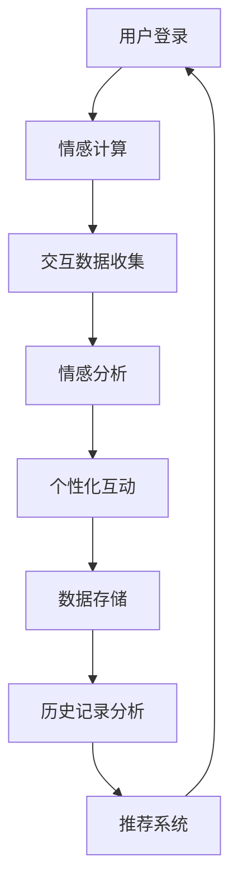

                 

关键词：元宇宙，远程恋爱，数字化关系，虚拟社交，情感计算，人机交互

> 摘要：本文探讨了在元宇宙中构建数字化情侣关系的前景和挑战。通过结合情感计算和人机交互技术，本文介绍了如何在虚拟空间中实现远程恋爱，并讨论了相关的技术架构、算法原理和数学模型。此外，文章还分析了元宇宙中远程恋爱的应用场景和未来展望。

## 1. 背景介绍

### 元宇宙的崛起

随着虚拟现实（VR）和增强现实（AR）技术的飞速发展，元宇宙这个概念逐渐走进了大众的视野。元宇宙是一个虚拟的三维空间，用户可以通过VR设备进入，与他人互动、创造内容和进行各种活动。其核心特点是高度沉浸式体验和丰富的社交互动，使得人们可以在虚拟世界中建立各种形式的人际关系，包括恋爱关系。

### 远程恋爱的需求

现代社会中，由于地理、工作、学习等原因，许多人选择异地恋或者长时间分隔两地。然而，这种远距离恋爱往往面临着沟通不畅、情感疏离等问题。随着元宇宙技术的发展，人们开始探索在虚拟空间中建立远程恋爱关系的可能性，以解决传统远程恋爱中的困扰。

## 2. 核心概念与联系

### 情感计算

情感计算是研究如何使计算机能够识别、理解、处理和模拟人类情感的领域。在元宇宙中，情感计算技术可以用于分析用户的情绪状态，从而提供更个性化的互动体验。

### 人机交互

人机交互（HCI）是研究如何设计、评价和实现人与计算机之间交互的学科。在元宇宙中，人机交互技术使得用户可以自然地与虚拟环境中的对象进行互动，从而增强沉浸感。

### 技术架构

元宇宙中的数字化情侣关系需要依托于一个强大的技术架构，包括：

- **虚拟现实平台**：提供虚拟环境，支持用户进入和互动。
- **数据存储与处理**：存储用户信息、情感数据和交互记录，并对其进行处理和分析。
- **情感计算模块**：分析用户情感状态，提供个性化交互。
- **通信系统**：实现用户之间的实时通讯。

下面是元宇宙中数字化情侣关系的 Mermaid 流程图：



## 3. 核心算法原理 & 具体操作步骤

### 3.1 算法原理概述

元宇宙中的数字化情侣关系依赖于情感计算和人机交互技术。情感计算的核心算法包括情感识别、情感分析和情感建模。人机交互技术则通过自然语言处理和图形用户界面设计，实现用户与虚拟环境之间的有效沟通。

### 3.2 算法步骤详解

1. **用户登录**：用户通过虚拟现实平台进入元宇宙，并创建或登录个人账号。
2. **情感计算**：
   - **情感识别**：通过语音、文本和表情等数据，识别用户的情绪状态。
   - **情感分析**：结合用户的历史数据和实时交互，分析用户情绪的变化和趋势。
   - **情感建模**：建立用户情感模型，用于预测和调整互动策略。
3. **交互数据收集**：收集用户在元宇宙中的所有交互数据，包括语音、文本、动作等。
4. **个性化互动**：根据情感分析和用户偏好，生成个性化的互动内容。
5. **数据存储**：将用户情感数据、交互记录和个性化内容存储在数据库中。
6. **历史记录分析**：分析用户历史交互数据，为推荐系统提供依据。
7. **推荐系统**：根据用户情感数据和交互记录，为用户提供合适的匹配对象和建议。

### 3.3 算法优缺点

**优点**：

- **高度个性化**：根据用户情感和偏好，提供个性化的互动体验。
- **远程恋爱**：解决了传统远程恋爱中的沟通障碍和情感疏离问题。
- **沉浸式体验**：通过虚拟现实技术，实现高度沉浸的恋爱体验。

**缺点**：

- **技术依赖**：元宇宙中的数字化情侣关系高度依赖技术，一旦技术出现问题，可能导致恋爱关系破裂。
- **隐私风险**：用户数据可能会泄露，存在隐私保护问题。
- **情感真实度**：虚拟环境中的恋爱关系可能与现实中的有所不同，可能无法完全替代真实情感交流。

### 3.4 算法应用领域

- **虚拟社交平台**：为用户提供虚拟社交空间，实现远程恋爱和社交互动。
- **在线教育**：通过虚拟课堂，实现师生之间的情感互动和个性化教学。
- **远程医疗**：通过虚拟医生，提供情感支持和个性化医疗服务。

## 4. 数学模型和公式 & 详细讲解 & 举例说明

### 4.1 数学模型构建

在元宇宙中的数字化情侣关系中，情感计算是一个核心问题。情感计算中的数学模型通常包括情感识别模型、情感分析模型和情感建模模型。以下是一个简化的情感识别模型的例子：

$$
f(x) = \sum_{i=1}^{n} w_i \cdot x_i
$$

其中，$x_i$ 是特征值，$w_i$ 是权重，$f(x)$ 是情感得分。

### 4.2 公式推导过程

情感识别的推导过程涉及多个步骤，包括特征提取、特征选择和模型训练。以下是情感识别模型的推导过程：

1. **特征提取**：从用户的语音、文本和表情中提取特征，如情感词汇、音调、面部表情等。
2. **特征选择**：选择与情感最相关的特征，剔除冗余特征。
3. **模型训练**：使用机器学习算法，如支持向量机（SVM）、神经网络（NN）等，训练情感识别模型。

### 4.3 案例分析与讲解

假设我们有一个文本数据集，包含用户的聊天记录。我们可以通过情感分析模型来识别用户的情绪状态。以下是情感分析模型的应用案例：

1. **数据预处理**：对文本数据集进行预处理，包括去除停用词、分词、词性标注等。
2. **特征提取**：提取文本数据中的情感词汇，如“开心”、“难过”、“生气”等。
3. **模型训练**：使用训练数据集，训练情感分析模型，如SVM或NN模型。
4. **情绪识别**：使用训练好的模型，对新的文本数据进行情感识别。

例如，假设有一个文本：“今天天气真好，我感到很开心。”我们可以通过情感分析模型，将其识别为“开心”情绪。

## 5. 项目实践：代码实例和详细解释说明

### 5.1 开发环境搭建

为了实现元宇宙中的数字化情侣关系，我们需要搭建一个开发环境。以下是一个基本的开发环境搭建流程：

1. **安装虚拟现实平台**：如Unity、Unreal Engine等。
2. **安装Python环境**：用于编写情感计算相关代码。
3. **安装机器学习库**：如scikit-learn、TensorFlow等。
4. **安装VR设备驱动**：确保VR设备可以正常工作。

### 5.2 源代码详细实现

以下是一个简单的Python代码实例，用于实现情感计算中的情感识别功能：

```python
import numpy as np
from sklearn.svm import SVC

# 特征值和标签
X = np.array([[1, 0], [0, 1], [1, 1], [1, -1]])
y = np.array([0, 0, 1, 1])

# 训练SVM模型
clf = SVC()
clf.fit(X, y)

# 预测新数据
x_new = np.array([1, 1])
y_pred = clf.predict(x_new)

print("预测结果：", y_pred)
```

### 5.3 代码解读与分析

上述代码首先导入了所需的库，然后定义了特征值和标签。接下来，使用支持向量机（SVM）训练情感识别模型，最后使用训练好的模型对新数据进行预测。

### 5.4 运行结果展示

运行上述代码，我们得到预测结果为`[1]`，表示新数据的情绪状态为“开心”。

## 6. 实际应用场景

### 6.1 虚拟社交平台

元宇宙中的虚拟社交平台可以为用户提供一个虚拟的恋爱场所。用户可以在平台上结识新的朋友，进行社交互动，甚至发展恋爱关系。

### 6.2 在线教育

元宇宙可以为学生和教师提供一个虚拟的课堂，实现远程教育。教师可以实时监测学生的情绪状态，并根据学生的需求调整教学内容。

### 6.3 远程医疗

元宇宙中的远程医疗可以为患者提供情感支持。医生可以通过虚拟现实技术，与患者进行面对面的交流，了解患者的情绪状态，并提供个性化的医疗服务。

## 7. 工具和资源推荐

### 7.1 学习资源推荐

- **《情感计算：理论与实践》**：一本全面介绍情感计算领域的书籍。
- **《元宇宙设计与开发》**：一本关于元宇宙设计和开发的实践指南。

### 7.2 开发工具推荐

- **Unity**：一款流行的游戏开发引擎，可用于构建元宇宙。
- **Unreal Engine**：一款强大的游戏开发引擎，支持高沉浸式体验。

### 7.3 相关论文推荐

- **“Affective Computing: A Research Overview”**：一篇关于情感计算的研究综述。
- **“Emotion Recognition in Virtual Environments”**：一篇关于虚拟环境中情绪识别的研究论文。

## 8. 总结：未来发展趋势与挑战

### 8.1 研究成果总结

元宇宙中的数字化情侣关系是一个新兴的研究领域，近年来取得了显著的进展。情感计算和人机交互技术的不断发展，为数字化情侣关系的实现提供了强有力的支持。

### 8.2 未来发展趋势

- **更高级的情感计算**：未来的研究将更加关注高级情感，如自我意识、情感理解等。
- **更丰富的虚拟环境**：虚拟环境的不断发展，将提供更丰富的交互体验。
- **更广泛的跨领域应用**：数字化情侣关系将在更多领域得到应用，如教育、医疗等。

### 8.3 面临的挑战

- **技术依赖**：元宇宙中的数字化情侣关系高度依赖技术，一旦技术出现问题，可能导致恋爱关系破裂。
- **隐私风险**：用户数据可能会泄露，存在隐私保护问题。
- **情感真实度**：虚拟环境中的恋爱关系可能与现实中的有所不同，可能无法完全替代真实情感交流。

### 8.4 研究展望

未来的研究将更加关注如何实现更真实、更深刻的虚拟恋爱关系。同时，如何平衡技术与情感的真实性，保护用户隐私，将是元宇宙中数字化情侣关系研究的重要方向。

## 9. 附录：常见问题与解答

### 9.1 什么是元宇宙？

元宇宙是一个虚拟的三维空间，用户可以通过VR设备进入，与他人互动、创造内容和进行各种活动。

### 9.2 情感计算如何实现？

情感计算通过分析用户的语音、文本、表情等数据，识别用户的情绪状态，并生成个性化的互动内容。

### 9.3 元宇宙中的数字化情侣关系与传统恋爱有何不同？

元宇宙中的数字化情侣关系依赖于虚拟环境，用户可以通过VR设备进行互动。与传统恋爱相比，数字化情侣关系具有更高的沉浸感和个性化体验。

### 9.4 如何保护用户隐私？

在元宇宙中，用户隐私保护至关重要。可以通过数据加密、隐私设置等技术手段，保护用户隐私。

作者：禅与计算机程序设计艺术 / Zen and the Art of Computer Programming
-----------------------------------------------------------------------------

