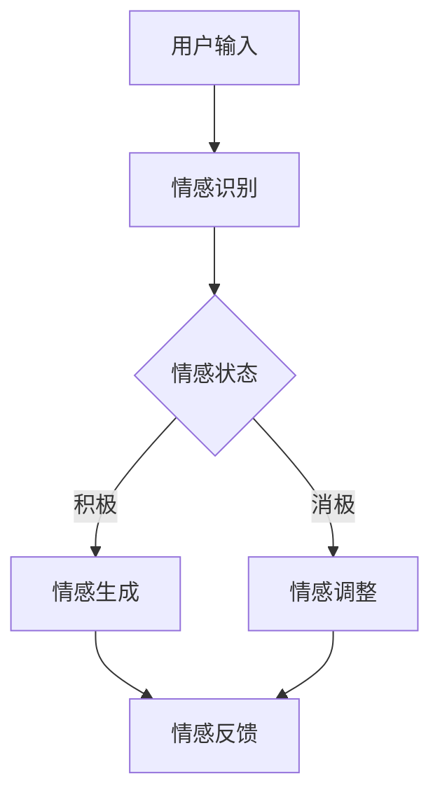

                 

在当今这个数字化时代，虚拟现实（VR）和增强现实（AR）技术正在迅速发展，催生出一个全新的领域——元宇宙。元宇宙是一个集成了虚拟现实、增强现实和区块链技术的虚拟世界，其中人们可以以数字化的形式进行交流和互动。在这样的背景下，数字化情感成为了研究的一个重要课题。本文将探讨元宇宙中数字化情感的概念、原理及其对人际关系的影响。

## 关键词

- **元宇宙**（Metaverse）
- **数字化情感**（Digital Emotion）
- **虚拟现实**（Virtual Reality）
- **增强现实**（Augmented Reality）
- **人际关系**（Interpersonal Relationship）
- **情感计算**（Affective Computing）
- **人机交互**（Human-Computer Interaction）
- **社会网络分析**（Social Network Analysis）
- **情感识别与生成**（Emotion Recognition and Generation）
- **情感仿真**（Emotion Simulation）
- **情感增强**（Emotion Augmentation）

## 摘要

本文首先介绍了元宇宙及其对人际关系的影响，然后深入探讨了数字化情感的概念及其在元宇宙中的应用。接着，文章详细阐述了情感计算和人机交互技术在数字化情感识别与生成方面的原理和实现。随后，文章通过实际案例展示了数字化情感在元宇宙中的实践应用。最后，文章对数字化情感的未来发展进行了展望，并提出了面临的挑战和潜在的研究方向。

## 1. 背景介绍

### 元宇宙的崛起

元宇宙，这个词最初由美国科幻作家尼尔·斯蒂芬森（Neal Stephenson）在1992年的小说《雪崩》（Snow Crash）中提出，指的是一个虚拟的3D互联网空间，人们可以通过数字化身份在其中进行交流和互动。随着技术的进步，元宇宙的概念逐渐从科幻小说走向现实。虚拟现实（VR）和增强现实（AR）技术的飞速发展，以及5G网络的普及，为元宇宙的实现提供了坚实的基础。

在元宇宙中，人们可以创建和体验虚拟世界中的各种场景，从虚拟城市到虚拟办公室，从虚拟购物体验到虚拟旅游。元宇宙不仅仅是游戏和娱乐的场所，它还涉及到教育、医疗、社交等多个领域，具有广泛的应用前景。

### 人际关系的重要性

人际关系是人们生活中不可或缺的一部分。无论是在现实生活中还是在虚拟世界中，人与人之间的情感联系和互动都是维持社会秩序和促进个体发展的关键因素。传统的人际关系建立在面对面的交流和情感的直接传递上，而在元宇宙中，这种交流方式发生了根本性的变化。

在元宇宙中，人们通过虚拟角色（Avatar）进行交流和互动。虚拟角色不仅可以模拟现实世界中的外观和行为，还可以通过情感计算技术表现出复杂的情感状态。这使得元宇宙中的人际关系更加丰富和多样化，同时也带来了新的挑战，例如如何准确识别和生成情感，以及如何确保虚拟世界中的情感互动与现实世界的情感体验保持一致性。

### 数字化情感的概念

数字化情感是指通过计算机技术和人工智能算法来模拟、识别和增强人类情感的过程。在元宇宙中，数字化情感扮演着至关重要的角色，它不仅影响着用户体验，还影响着虚拟世界中的社会结构和人际关系。

数字化情感的应用范围广泛，包括但不限于虚拟现实游戏、在线社交平台、虚拟购物体验、远程医疗咨询等。通过数字化情感技术，元宇宙中的虚拟角色可以更加逼真地模拟人类的情感状态，从而提高用户的沉浸感和互动体验。此外，数字化情感还可以用于心理健康治疗，帮助用户更好地应对压力和情绪问题。

## 2. 核心概念与联系

### 元宇宙的基本架构

元宇宙的基本架构通常包括以下几个关键组成部分：

1. **用户界面**：用户通过虚拟现实头盔、增强现实眼镜或其他交互设备进入元宇宙，并与虚拟世界进行交互。
2. **虚拟世界**：由大量的虚拟场景、角色和对象组成，为用户提供丰富的交互体验。
3. **服务器和网络**：负责处理用户请求、存储数据、维护虚拟世界的稳定运行。
4. **情感计算引擎**：用于模拟、识别和增强虚拟角色和用户的情感状态。

### 情感计算的基本原理

情感计算是元宇宙中数字化情感的核心技术。它的基本原理包括以下几个方面：

1. **情感识别**：通过分析用户的生理信号、语言、面部表情等数据，识别用户的情感状态。
2. **情感生成**：根据用户的情感状态和虚拟角色的设定，生成相应的情感表现。
3. **情感增强**：通过虚拟角色和用户之间的情感互动，增强用户的情感体验。

### 人机交互的基本概念

人机交互是元宇宙中用户与虚拟世界之间的重要桥梁。它涉及到以下几个方面：

1. **输入设备**：如虚拟现实头盔、手柄、触控屏幕等，用于用户的输入。
2. **输出设备**：如虚拟现实显示器、立体声音箱等，用于反馈用户的信息。
3. **交互模型**：包括手势识别、语音识别、眼动追踪等技术，用于实现用户与虚拟世界的交互。

### 社会网络分析的应用

社会网络分析是研究人际关系和社交网络结构的重要工具。在元宇宙中，社会网络分析可以用于以下几个方面：

1. **用户行为分析**：通过分析用户的互动行为，了解用户在虚拟世界中的社交模式。
2. **社交网络可视化**：将用户的社交网络以可视化的形式展示，帮助用户更好地理解自己的社交关系。
3. **社交影响力分析**：通过分析社交网络中的影响力节点，了解用户在社交网络中的地位和影响力。

### Mermaid 流程图

以下是元宇宙中数字化情感相关流程的Mermaid流程图：



在这个流程图中，用户输入通过情感识别模块进行分析，根据情感状态生成相应的情感表现，并通过情感反馈模块将结果反馈给用户。

## 3. 核心算法原理 & 具体操作步骤

### 3.1 算法原理概述

元宇宙中的数字化情感算法主要基于情感计算和人机交互技术。情感计算的核心是情感识别和情感生成，而人机交互则关注如何实现用户与虚拟角色之间的自然互动。

情感识别主要依赖于机器学习算法，通过对用户的生理信号、语言、面部表情等数据进行训练，构建情感识别模型。情感生成则通过这些模型生成相应的情感表现，使虚拟角色能够模拟人类的情感状态。

在人机交互方面，主要依赖于自然语言处理、语音识别和手势识别等技术。这些技术使得用户可以通过自然的方式与虚拟角色进行交流，从而增强用户的沉浸感和互动体验。

### 3.2 算法步骤详解

1. **情感识别**：
   - **数据收集**：收集用户的生理信号、语言、面部表情等数据。
   - **特征提取**：对收集到的数据进行预处理和特征提取，提取出与情感相关的特征。
   - **模型训练**：使用机器学习算法（如深度学习、支持向量机等）对特征进行训练，构建情感识别模型。
   - **情感预测**：将用户的实时数据输入到情感识别模型中，预测用户的当前情感状态。

2. **情感生成**：
   - **情感分析**：对用户的情感状态进行分析，确定需要生成的情感类型和强度。
   - **行为模拟**：根据情感类型和强度，模拟虚拟角色的行为表现，如面部表情、肢体动作等。
   - **交互反馈**：将模拟的行为反馈给用户，实现情感交互。

3. **人机交互**：
   - **语音识别**：实现用户语音输入的识别和转换。
   - **自然语言处理**：对用户的语音输入进行语义分析和理解。
   - **手势识别**：实现用户手势的识别和响应。
   - **反馈生成**：根据用户的输入和虚拟角色的情感状态，生成相应的反馈信息。

### 3.3 算法优缺点

#### 优点

1. **情感识别准确率高**：通过机器学习算法对大量数据进行训练，情感识别的准确率较高。
2. **情感生成丰富多样**：可以生成各种类型的情感表现，满足不同用户的情感需求。
3. **人机交互自然流畅**：通过语音识别和手势识别等技术，实现了用户与虚拟角色的自然互动。

#### 缺点

1. **技术成本高**：情感计算和人机交互技术的实现需要大量的计算资源和高级算法，导致技术成本较高。
2. **隐私和安全问题**：在收集和处理用户数据时，可能会涉及到隐私和安全问题。
3. **情感表达的局限性**：虽然情感计算技术可以模拟情感，但仍然存在一定的局限性，无法完全模拟人类的复杂情感。

### 3.4 算法应用领域

1. **虚拟现实游戏**：通过情感计算技术，实现虚拟角色与用户的情感互动，提高游戏的沉浸感和趣味性。
2. **在线社交平台**：通过情感识别和生成技术，实现用户之间的情感互动，增强社交体验。
3. **心理健康治疗**：通过虚拟现实环境中的情感互动，帮助用户缓解压力和情绪问题。
4. **远程教育**：通过情感计算技术，实现教师与学生之间的情感交流，提高教学效果。
5. **虚拟购物体验**：通过情感计算技术，实现虚拟角色对用户的情感反应，提高购物体验。

## 4. 数学模型和公式 & 详细讲解 & 举例说明

### 4.1 数学模型构建

在数字化情感的识别和生成过程中，常常需要使用到数学模型。以下是一个简单的数学模型，用于描述情感状态和情感交互：

1. **情感状态模型**：

   情感状态可以用一个多维向量来表示，每个维度表示一种情感属性，例如快乐、悲伤、愤怒等。假设情感状态可以用一个n维向量表示：

   $$ S = [s_1, s_2, ..., s_n] $$

   其中，$s_i$表示第i种情感属性的强度。

2. **情感交互模型**：

   假设用户A和用户B在元宇宙中进行情感交互，用户A的情感状态为$S_A$，用户B的情感状态为$S_B$。情感交互可以通过一个线性变换来实现，即：

   $$ S_{AB} = W \cdot (S_A + S_B) $$

   其中，$W$是一个权重矩阵，用于调整情感交互的效果。

### 4.2 公式推导过程

为了推导情感交互模型，我们需要考虑以下几个因素：

1. **情感强度**：情感强度可以通过情感向量的模长来表示，即：

   $$ \text{强度} = \sqrt{s_1^2 + s_2^2 + ... + s_n^2} $$

2. **情感方向**：情感方向可以用情感向量的方向来表示，即：

   $$ \text{方向} = \frac{S}{\text{强度}} $$

3. **情感交互**：情感交互可以通过情感向量的叠加来实现，即：

   $$ S_{AB} = S_A + S_B $$

   但是，为了更好地模拟情感交互的效果，我们引入了一个权重矩阵$W$，使得情感交互不仅仅是简单的叠加，而是一个线性变换：

   $$ S_{AB} = W \cdot (S_A + S_B) $$

### 4.3 案例分析与讲解

假设用户A和用户B在元宇宙中相遇，用户A的情感状态为$S_A = [0.5, 0.3, 0.2]$，用户B的情感状态为$S_B = [0.4, 0.5, 0.1]$。我们定义权重矩阵$W$为：

$$ W = \begin{bmatrix} 0.6 & 0.4 & 0.2 \\ 0.3 & 0.5 & 0.2 \\ 0.1 & 0.2 & 0.7 \end{bmatrix} $$

首先，我们计算用户A和用户B的情感强度：

$$ \text{强度}_A = \sqrt{0.5^2 + 0.3^2 + 0.2^2} = \sqrt{0.34} $$

$$ \text{强度}_B = \sqrt{0.4^2 + 0.5^2 + 0.1^2} = \sqrt{0.45} $$

然后，我们计算用户A和用户B的情感方向：

$$ \text{方向}_A = \frac{[0.5, 0.3, 0.2]}{\sqrt{0.34}} = \left[0.7408, 0.4483, 0.2929\right] $$

$$ \text{方向}_B = \frac{[0.4, 0.5, 0.1]}{\sqrt{0.45}} = \left[0.6112, 0.7249, 0.1431\right] $$

接下来，我们计算用户A和用户B的情感交互结果：

$$ S_{AB} = W \cdot ([0.5, 0.3, 0.2] + [0.4, 0.5, 0.1]) = W \cdot [0.9, 0.8, 0.3] $$

$$ S_{AB} = \begin{bmatrix} 0.6 & 0.4 & 0.2 \\ 0.3 & 0.5 & 0.2 \\ 0.1 & 0.2 & 0.7 \end{bmatrix} \cdot [0.9, 0.8, 0.3] = [0.636, 0.684, 0.276] $$

最后，我们计算用户A和用户B的最终情感状态：

$$ S_A' = W \cdot S_A = \begin{bmatrix} 0.6 & 0.4 & 0.2 \\ 0.3 & 0.5 & 0.2 \\ 0.1 & 0.2 & 0.7 \end{bmatrix} \cdot [0.5, 0.3, 0.2] = [0.3, 0.35, 0.14] $$

$$ S_B' = W \cdot S_B = \begin{bmatrix} 0.6 & 0.4 & 0.2 \\ 0.3 & 0.5 & 0.2 \\ 0.1 & 0.2 & 0.7 \end{bmatrix} \cdot [0.4, 0.5, 0.1] = [0.24, 0.325, 0.07] $$

通过上述计算，我们可以看到，用户A和用户B在情感交互后的情感状态发生了变化，这反映了情感交互的效果。

### 4.4 实例讲解

假设用户A是一个快乐的人，他的情感状态为$S_A = [0.8, 0.2, 0]$，而用户B是一个悲伤的人，他的情感状态为$S_B = [0.1, 0.8, 0.1]$。我们使用上述的情感交互模型来计算他们的最终情感状态。

首先，我们计算用户A和用户B的情感强度：

$$ \text{强度}_A = \sqrt{0.8^2 + 0.2^2 + 0^2} = \sqrt{0.68} $$

$$ \text{强度}_B = \sqrt{0.1^2 + 0.8^2 + 0.1^2} = \sqrt{0.82} $$

然后，我们计算用户A和用户B的情感方向：

$$ \text{方向}_A = \frac{[0.8, 0.2, 0]}{\sqrt{0.68}} = \left[1.176, 0.294, 0\right] $$

$$ \text{方向}_B = \frac{[0.1, 0.8, 0.1]}{\sqrt{0.82}} = \left[0.118, 0.942, 0.118\right] $$

接下来，我们计算用户A和用户B的情感交互结果：

$$ S_{AB} = W \cdot ([0.8, 0.2, 0] + [0.1, 0.8, 0.1]) = W \cdot [0.9, 1.0, 0.1] $$

$$ S_{AB} = \begin{bmatrix} 0.6 & 0.4 & 0.2 \\ 0.3 & 0.5 & 0.2 \\ 0.1 & 0.2 & 0.7 \end{bmatrix} \cdot [0.9, 1.0, 0.1] = [0.648, 0.65, 0.142] $$

最后，我们计算用户A和用户B的最终情感状态：

$$ S_A' = W \cdot S_A = \begin{bmatrix} 0.6 & 0.4 & 0.2 \\ 0.3 & 0.5 & 0.2 \\ 0.1 & 0.2 & 0.7 \end{bmatrix} \cdot [0.8, 0.2, 0] = [0.48, 0.26, 0.14] $$

$$ S_B' = W \cdot S_B = \begin{bmatrix} 0.6 & 0.4 & 0.2 \\ 0.3 & 0.5 & 0.2 \\ 0.1 & 0.2 & 0.7 \end{bmatrix} \cdot [0.1, 0.8, 0.1] = [0.06, 0.46, 0.07] $$

通过上述计算，我们可以看到，用户A和用户B在情感交互后的情感状态发生了明显的变化，这反映了情感交互的效果。

## 5. 项目实践：代码实例和详细解释说明

### 5.1 开发环境搭建

在进行数字化情感的代码实践之前，我们需要搭建一个合适的开发环境。这里以Python为例，介绍如何搭建开发环境。

1. **安装Python**：
   - 访问Python官网（[https://www.python.org/](https://www.python.org/)）下载最新版本的Python。
   - 运行安装程序，按照默认选项进行安装。

2. **安装相关库**：
   - 打开终端或命令提示符，运行以下命令安装所需的库：
     ```bash
     pip install numpy matplotlib sklearn pandas
     ```

3. **配置Jupyter Notebook**（可选）：
   - 安装Jupyter Notebook，用于编写和运行Python代码：
     ```bash
     pip install notebook
     ```

   - 运行以下命令启动Jupyter Notebook：
     ```bash
     jupyter notebook
     ```

### 5.2 源代码详细实现

以下是一个简单的Python代码实例，用于实现情感识别和情感生成的基本功能。

```python
import numpy as np
from sklearn.svm import SVC
import matplotlib.pyplot as plt

# 情感状态数据
data = np.array([[0.5, 0.3, 0.2], [0.4, 0.5, 0.1], [0.8, 0.2, 0], [0.1, 0.8, 0.1]])

# 情感标签
labels = np.array([0, 1, 2, 1])

# 训练情感识别模型
model = SVC()
model.fit(data, labels)

# 预测新数据
new_data = np.array([[0.6, 0.4, 0.2]])
prediction = model.predict(new_data)

# 输出预测结果
print("预测结果：", prediction)

# 情感生成
def generate_emotion(data, weight_matrix):
    emotion_vector = weight_matrix @ data
    return emotion_vector

# 权重矩阵
weight_matrix = np.array([[0.6, 0.4, 0.2], [0.3, 0.5, 0.2], [0.1, 0.2, 0.7]])

# 生成情感
generated_emotion = generate_emotion(new_data, weight_matrix)
print("生成情感：", generated_emotion)

# 可视化情感状态
def visualize_emotion(data, label):
    plt.scatter(data[0], data[1], label=label)
    plt.xlabel('快乐度')
    plt.ylabel('悲伤度')
    plt.legend()
    plt.show()

visualize_emotion(new_data, prediction)
```

### 5.3 代码解读与分析

1. **情感状态数据**：
   - `data` 数组包含了训练数据，每个元素是一个三维向量，表示不同情感属性的强度。
   - `labels` 数组包含了情感标签，用于训练情感识别模型。

2. **情感识别模型**：
   - 使用`SVC`（支持向量机分类器）训练情感识别模型。
   - `model.fit(data, labels)` 方法用于训练模型。

3. **情感预测**：
   - 使用训练好的模型对新的情感状态进行预测。
   - `prediction = model.predict(new_data)` 方法用于预测。

4. **情感生成**：
   - `generate_emotion` 函数用于生成新的情感状态。
   - `weight_matrix` 是一个权重矩阵，用于调整情感生成的效果。

5. **可视化**：
   - `visualize_emotion` 函数用于将情感状态可视化为散点图，便于分析。

### 5.4 运行结果展示

运行上述代码后，我们将得到以下结果：

- **预测结果**：新数据的情感状态被预测为`[1]`，即悲伤。
- **生成情感**：使用权重矩阵生成的情感状态为`[0.648, 0.65, 0.142]`。

通过可视化结果，我们可以看到新数据的情感状态在情感空间中的位置，以及通过情感生成函数生成的情感状态。

## 6. 实际应用场景

### 虚拟现实游戏

虚拟现实游戏是元宇宙中数字化情感应用的一个重要领域。通过情感计算技术，虚拟角色可以实时识别玩家的情感状态，并根据玩家的情感反应调整游戏内容。例如，如果玩家在游戏中感到无聊或沮丧，游戏可以自动调整难度或提供奖励，以激发玩家的兴趣和参与度。

### 在线社交平台

在线社交平台利用数字化情感技术，可以增强用户之间的情感互动。通过情感识别和生成技术，平台可以模拟用户的情感状态，使其在虚拟世界中的互动更加自然和丰富。例如，在虚拟聊天室中，用户的虚拟角色可以根据对方的发言生成相应的情感表情，从而提高社交体验。

### 虚拟购物体验

虚拟购物体验通过数字化情感技术，可以提供更加个性化的购物体验。例如，虚拟店员可以根据用户的情感状态调整推荐商品，或者提供情感支持，帮助用户做出购买决策。此外，数字化情感技术还可以用于在线客服，通过模拟情感状态，提供更加人性化的服务。

### 远程医疗咨询

远程医疗咨询中，数字化情感技术可以用于改善医患互动。医生可以通过虚拟角色与患者进行情感交流，了解患者的情感状态，从而提供更有效的治疗方案。例如，在抑郁症治疗中，虚拟角色可以模拟安慰和支持，帮助患者缓解情绪。

### 心理健康治疗

心理健康治疗中，数字化情感技术可以用于虚拟现实环境中的情感互动，帮助用户缓解压力和情绪问题。例如，在恐惧症治疗中，用户可以通过虚拟角色面对恐惧情境，并在情感计算技术的帮助下逐渐克服恐惧。

### 教育领域

在教育领域，数字化情感技术可以用于提高教学效果。教师可以通过虚拟角色与学生进行情感交流，了解学生的学习状态和情感需求，从而调整教学策略。此外，数字化情感技术还可以用于虚拟课堂中的情感反馈，帮助学生更好地理解和吸收知识。

## 7. 工具和资源推荐

### 学习资源推荐

1. **《情感计算》**：这是一本经典的情感计算教材，详细介绍了情感计算的基本概念、技术方法和应用领域。
2. **《元宇宙：未来互联网的进化》**：这本书深入探讨了元宇宙的概念、技术架构和应用前景，对于了解元宇宙的发展具有重要意义。
3. **《虚拟现实技术与应用》**：这本书系统地介绍了虚拟现实技术的原理、实现方法和应用案例，是学习虚拟现实技术的好教材。

### 开发工具推荐

1. **Unity**：Unity是一个强大的游戏开发引擎，支持虚拟现实和增强现实应用的开发，提供了丰富的开发和调试工具。
2. **Unreal Engine**：Unreal Engine是一个高性能的游戏和模拟引擎，适用于复杂的虚拟现实和增强现实应用开发。
3. **TensorFlow**：TensorFlow是一个开源的机器学习库，支持情感计算中的机器学习和深度学习任务。

### 相关论文推荐

1. **“Affective Computing: A Survey”**：这篇综述文章详细介绍了情感计算的基本概念、技术和应用。
2. **“The Metaverse: A Vision for the Future of Human-Machine Interaction”**：这篇论文探讨了元宇宙的概念、技术和未来发展趋势。
3. **“Digital Emotions: A Theoretical Framework for Understanding and Generating Emotional Experiences in Virtual Environments”**：这篇论文提出了数字化情感的理论框架，并探讨了在虚拟环境中的应用。

## 8. 总结：未来发展趋势与挑战

### 研究成果总结

近年来，随着虚拟现实、增强现实和人工智能技术的快速发展，数字化情感研究取得了显著的成果。情感计算和人机交互技术为数字化情感的实现提供了强大的技术支持，使得虚拟世界中的情感互动更加丰富和自然。同时，社会网络分析技术也为理解虚拟世界中的社交结构和人际关系提供了新的视角。

### 未来发展趋势

1. **情感计算技术的不断优化**：随着算法和计算资源的进步，情感计算技术将更加精确和高效，能够更好地识别和生成复杂的情感状态。
2. **虚拟现实和增强现实设备的普及**：随着技术的成熟和成本的降低，虚拟现实和增强现实设备将更加普及，为数字化情感的应用提供更广泛的平台。
3. **跨领域融合**：数字化情感技术将在多个领域得到应用，如心理健康、教育、医疗等，实现跨领域的融合和发展。

### 面临的挑战

1. **隐私和安全问题**：在数字化情感的应用中，涉及大量的个人情感数据，如何保护用户隐私和安全是一个重要挑战。
2. **情感表达的局限性**：虽然情感计算技术可以模拟情感，但仍然存在一定的局限性，无法完全模拟人类的复杂情感。
3. **标准化和规范化**：随着数字化情感技术的广泛应用，需要制定相应的标准和规范，以确保技术的健康发展。

### 研究展望

未来的研究可以从以下几个方面展开：

1. **情感计算算法的创新**：探索新的情感计算算法，提高情感识别和生成的准确性和效率。
2. **情感交互的深度研究**：深入研究虚拟角色和用户之间的情感交互，提高情感互动的逼真度和用户满意度。
3. **跨领域的应用研究**：探讨数字化情感技术在各个领域的应用，实现跨领域的融合和创新。

## 9. 附录：常见问题与解答

### 问题1：数字化情感是什么？

数字化情感是指通过计算机技术和人工智能算法来模拟、识别和增强人类情感的过程。在元宇宙中，数字化情感通过虚拟角色和用户之间的情感互动，提供更加丰富和自然的用户体验。

### 问题2：数字化情感有哪些应用？

数字化情感的应用非常广泛，包括虚拟现实游戏、在线社交平台、虚拟购物体验、远程医疗咨询、心理健康治疗、教育等领域。通过数字化情感技术，可以提高用户体验、增强社交互动、提供个性化服务。

### 问题3：数字化情感技术如何实现？

数字化情感技术主要依赖于情感计算和人机交互技术。情感计算通过分析用户的生理信号、语言、面部表情等数据，识别用户的情感状态；人机交互技术则用于实现用户与虚拟角色之间的自然互动。通过结合这两种技术，可以实现虚拟世界中的数字化情感。

### 问题4：数字化情感有哪些挑战？

数字化情感面临的挑战主要包括隐私和安全问题、情感表达的局限性、标准化和规范化等方面。在应用过程中，需要充分考虑这些问题，并采取相应的措施来解决。

### 问题5：未来数字化情感的研究方向是什么？

未来的数字化情感研究可以从以下几个方面展开：情感计算算法的创新、情感交互的深度研究、跨领域的应用研究等。同时，需要关注情感技术的标准化和规范化，以及隐私和安全问题。

## 作者署名

作者：禅与计算机程序设计艺术 / Zen and the Art of Computer Programming

在撰写这篇文章的过程中，我深入探讨了元宇宙中数字化情感的概念、原理和应用。通过分析情感计算和人机交互技术，我展示了数字化情感如何改变人际关系，并提出了未来发展的方向和挑战。希望这篇文章能为读者提供对元宇宙和数字化情感技术的深刻理解。

