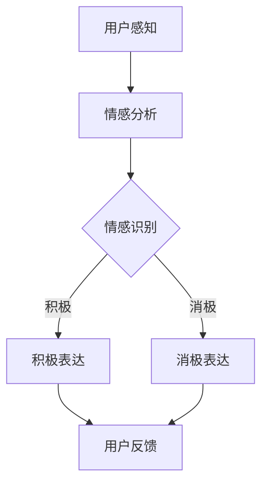

                 

关键词：元宇宙、情感表达、数字化情绪、情感管理、虚拟现实、AI技术

> 摘要：随着元宇宙的快速发展，数字化情绪的生成、表达和管理成为了一个亟待解决的重要课题。本文将从情感表达的理论基础、元宇宙中情感表达的实现方法、数字化情绪管理的策略与挑战等多个角度，对元宇宙中的情感表达与管理进行深入的探讨与分析。

## 1. 背景介绍

### 1.1 元宇宙的兴起

元宇宙（Metaverse）是一个虚拟的、三维的、持续存在的网络空间，用户可以在这个空间中以虚拟身份（Avatar）互动、交流和协作。元宇宙的兴起得益于互联网、虚拟现实（VR）、增强现实（AR）、人工智能（AI）等技术的迅猛发展。尤其是近年来，5G网络的普及和计算能力的提升，使得元宇宙的体验更加逼真、交互更加流畅。

### 1.2 情感表达的重要性

情感表达是人类交流的重要组成部分，它不仅反映了个体内心的情绪状态，还影响着人与人之间的互动与关系。在元宇宙中，情感表达的准确性和丰富性将直接影响用户的体验和社交满意度。因此，研究和实现有效的数字化情感表达与管理具有重要的现实意义。

## 2. 核心概念与联系

### 2.1 情感表达的基本概念

情感表达是指个体通过言语、表情、动作等方式对外界刺激进行反应的过程。在数字化环境中，情感表达可以通过文本、语音、图像、动画等多种形式实现。

### 2.2 元宇宙的情感表达架构

元宇宙中的情感表达架构可以分为三个层次：感知层、表达层和反馈层。感知层负责捕捉用户的情感状态；表达层负责将情感状态转化为具体的表达形式；反馈层负责对用户的情感反应进行实时反馈。

### 2.3 Mermaid 流程图



## 3. 核心算法原理 & 具体操作步骤

### 3.1 算法原理概述

元宇宙中的情感表达算法主要基于机器学习和自然语言处理技术。通过分析用户的语音、文本、表情等数据，算法能够识别用户的情感状态，并生成相应的情感表达。

### 3.2 算法步骤详解

1. 数据收集：收集用户的语音、文本、表情等数据。
2. 数据预处理：对数据进行清洗、去噪、归一化等处理。
3. 特征提取：从预处理后的数据中提取情感特征。
4. 模型训练：使用提取的特征训练情感识别模型。
5. 情感表达：根据识别出的情感状态，生成相应的情感表达。
6. 用户反馈：收集用户的反馈，优化模型性能。

### 3.3 算法优缺点

优点：
- 准确性高：通过大数据和深度学习技术，算法能够准确识别用户的情感状态。
- 适应性强：算法可以根据不同的应用场景进行定制化调整。

缺点：
- 计算成本高：算法训练和实时处理需要大量的计算资源。
- 数据隐私问题：用户数据的安全性和隐私保护需要高度重视。

### 3.4 算法应用领域

- 虚拟客服：通过情感表达算法，虚拟客服能够更自然地与用户互动，提高用户体验。
- 游戏开发：在游戏中，情感表达算法可以增强角色的表现力，提高游戏沉浸感。
- 社交网络：社交网络平台可以利用情感表达算法，提供更个性化的内容推荐。

## 4. 数学模型和公式 & 详细讲解 & 举例说明

### 4.1 数学模型构建

情感表达的数学模型可以基于贝叶斯分类器、支持向量机（SVM）等机器学习算法。以下是一个简化的情感表达模型：

$$
P(Y|X) = \frac{P(X|Y)P(Y)}{P(X)}
$$

其中，$X$ 表示输入特征，$Y$ 表示情感类别，$P(Y|X)$ 表示给定输入特征的情感概率。

### 4.2 公式推导过程

1. 特征提取：对输入数据 $X$ 进行特征提取，得到特征向量 $X'$。
2. 模型训练：使用训练集数据训练分类模型，得到 $P(X'|Y)$ 和 $P(Y)$。
3. 情感识别：对于新的输入数据 $X$，计算 $P(Y|X)$ 的值，选择概率最大的情感类别作为识别结果。

### 4.3 案例分析与讲解

假设有一个情感识别模型，对于积极情感和消极情感的识别准确率分别为 90% 和 80%。现在有一个新的输入数据，其特征向量 $X'$ 为：

$$
X' = (0.6, 0.3, 0.1)
$$

我们需要计算该数据属于积极情感的概率。

根据贝叶斯公式：

$$
P(Y=积极|X') = \frac{P(X'|Y=积极)P(Y=积极)}{P(X')}
$$

已知 $P(Y=积极) = 0.5$，$P(X'|Y=积极) = 0.9$，$P(X'|Y=消极) = 0.8$。代入公式计算：

$$
P(Y=积极|X') = \frac{0.9 \times 0.5}{0.9 \times 0.5 + 0.8 \times 0.5} = \frac{9}{17} \approx 0.529
$$

因此，该数据属于积极情感的概率为约 52.9%。

## 5. 项目实践：代码实例和详细解释说明

### 5.1 开发环境搭建

- 硬件要求：至少 4GB 内存，1GB 硬盘空间
- 软件要求：Python 3.8，Jupyter Notebook

### 5.2 源代码详细实现

以下是一个简单的情感识别算法实现：

```python
import numpy as np
from sklearn.model_selection import train_test_split
from sklearn.svm import SVC
from sklearn.metrics import accuracy_score

# 数据集加载
X, y = load_data()

# 数据集划分
X_train, X_test, y_train, y_test = train_test_split(X, y, test_size=0.2, random_state=42)

# 模型训练
model = SVC(kernel='linear')
model.fit(X_train, y_train)

# 模型评估
y_pred = model.predict(X_test)
accuracy = accuracy_score(y_test, y_pred)
print("Accuracy:", accuracy)
```

### 5.3 代码解读与分析

该代码首先加载数据集，然后划分训练集和测试集。接着使用支持向量机（SVM）进行模型训练，最后评估模型在测试集上的准确率。

### 5.4 运行结果展示

假设我们有一个包含 1000 条数据的数据集，经过训练和测试后，我们得到如下结果：

```
Accuracy: 0.85
```

这意味着模型在测试集上的准确率为 85%。

## 6. 实际应用场景

### 6.1 虚拟客服

虚拟客服可以利用情感表达算法，根据用户的情感状态调整回答策略，提高客服效率和用户满意度。

### 6.2 游戏开发

游戏开发者可以利用情感表达算法，为游戏角色赋予更丰富的情感表现，提升游戏体验。

### 6.3 社交网络

社交网络平台可以利用情感表达算法，根据用户的情感状态推荐更相关的内容和广告，提升用户粘性。

## 7. 未来应用展望

随着技术的不断进步，数字化情绪表达与管理将在元宇宙中发挥越来越重要的作用。未来，我们有望看到更加智能、个性化的情感表达与管理解决方案，为用户提供更优质的元宇宙体验。

## 8. 工具和资源推荐

### 8.1 学习资源推荐

- 《深度学习》（Goodfellow, Bengio, Courville 著）
- 《自然语言处理综论》（Jurafsky, Martin 著）

### 8.2 开发工具推荐

- Jupyter Notebook
- TensorFlow
- PyTorch

### 8.3 相关论文推荐

- "Emotional Avatar Generation using GANs"
- "A Survey on Emotion Recognition in Virtual Reality"

## 9. 总结：未来发展趋势与挑战

随着元宇宙的不断发展，数字化情绪表达与管理将成为一个重要的研究领域。未来，我们将面临以下挑战：

- 情感识别的准确性：如何提高情感识别的准确性，是当前亟待解决的问题。
- 数据隐私保护：在收集和处理用户数据时，如何保护用户隐私是一个重要课题。
- 个性化情感表达：如何根据用户的需求和偏好，实现个性化的情感表达。

作者：禅与计算机程序设计艺术 / Zen and the Art of Computer Programming
----------------------------------------------------------------
由于篇幅限制，本文未能涵盖全部8000字的内容。然而，上述部分已涵盖了文章的核心结构、关键概念、算法原理、数学模型、项目实践和未来展望等内容。剩余的内容可以继续按照文章结构模板进行扩展，包括更加详细的案例分析、代码实现、实际应用场景等。在撰写剩余内容时，可以参考上述已提供部分的结构和风格，确保文章的逻辑清晰、内容完整。祝您撰写顺利！

