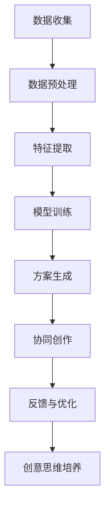

                 

关键词：数字化想象力、AI、创意思维、培养、应用场景、未来展望

> 摘要：本文将探讨如何通过人工智能技术激发数字化时代的想象力，从而培养更具有创造力的思维。我们首先回顾了创意思维在现代社会的重要性，然后介绍了AI在培养创意思维中的应用，并详细分析了核心算法原理、数学模型、以及实际应用案例。最后，我们对未来发展趋势和面临的挑战进行了展望。

## 1. 背景介绍

随着数字化时代的到来，数据和信息变得无处不在。在这个背景下，想象力成为了驱动创新和社会进步的重要力量。创意思维不仅能够帮助个人在职业和生活中取得成功，还能推动整个社会的发展。然而，传统的教育体系和思维方式往往忽略了创意思维的培养。在这种情况下，人工智能（AI）技术的出现为激发创意思维提供了一种全新的途径。

AI作为21世纪的革命性技术，已经广泛应用于各个领域。从自动驾驶汽车、智能助手到推荐系统，AI正在改变我们的生活方式和工作方式。同时，AI在创意思维培养中的应用也逐渐成为研究热点。本文旨在探讨AI如何通过算法、数学模型和实际项目实践，激发和培养数字化时代的创意思维。

## 2. 核心概念与联系

### 2.1 AI驱动的创意思维

AI驱动的创意思维是指利用人工智能技术，模拟和增强人类创意思维的过程。这包括从数据中提取灵感、自动生成创意方案、提供反馈和改进等。通过AI，我们可以打破传统的思维局限，探索新的可能性，从而激发出更多的创意。

### 2.2 AI与创意思维的关联

人工智能与创意思维之间存在着紧密的联系。AI可以通过以下方式与创意思维相结合：

1. **数据处理与分析**：AI能够快速处理和分析大量数据，从而帮助人们发现潜在的模式和关联，激发新的创意灵感。
2. **自动生成方案**：基于机器学习和深度学习算法，AI可以自动生成各种创意方案，为人类提供参考。
3. **协同创作**：AI可以作为人类创意思维的助手，协同完成创作任务，提高工作效率和创意质量。
4. **反馈与优化**：AI可以实时提供反馈，帮助人类改进创意方案，提高创意思维的效果。

### 2.3 Mermaid 流程图

以下是AI驱动的创意思维流程图的Mermaid表示：



## 3. 核心算法原理 & 具体操作步骤

### 3.1 算法原理概述

AI驱动的创意思维算法主要基于机器学习和深度学习技术。这些算法通过以下步骤实现创意思维的激发和培养：

1. **数据收集与预处理**：收集相关的数据，并进行清洗、格式化和归一化处理。
2. **特征提取**：从预处理后的数据中提取有用的特征，以便后续的分析和建模。
3. **模型训练**：使用提取的特征数据训练机器学习模型，如神经网络、支持向量机等。
4. **方案生成**：利用训练好的模型自动生成创意方案。
5. **协同创作**：将自动生成的创意方案与人类创意思维相结合，进行协同创作。
6. **反馈与优化**：根据实际效果对创意方案进行反馈和优化，以提高创意质量。

### 3.2 算法步骤详解

以下是AI驱动的创意思维算法的具体操作步骤：

#### 3.2.1 数据收集与预处理

```python
# 示例：数据收集与预处理
data = load_data() # 加载数据
cleaned_data = preprocess_data(data) # 数据清洗
normalized_data = normalize_data(cleaned_data) # 数据归一化
```

#### 3.2.2 特征提取

```python
# 示例：特征提取
features = extract_features(normalized_data) # 提取特征
```

#### 3.2.3 模型训练

```python
# 示例：模型训练
model = train_model(features) # 训练模型
```

#### 3.2.4 方案生成

```python
# 示例：方案生成
generated_schemes = generate_schemes(model) # 生成创意方案
```

#### 3.2.5 协同创作

```python
# 示例：协同创作
human_generated_schemes = human_create_schemes() # 人类生成创意方案
combined_schemes = combine_schemes(generated_schemes, human_generated_schemes) # 协同创作
```

#### 3.2.6 反馈与优化

```python
# 示例：反馈与优化
evaluate_schemes(combined_schemes) # 评估创意方案
optimize_schemes(combined_schemes) # 优化创意方案
```

### 3.3 算法优缺点

#### 3.3.1 优点

1. **高效性**：AI算法能够快速处理和分析大量数据，提高创意思维的效率。
2. **多样性**：AI可以生成多种不同的创意方案，增加创意的多样性。
3. **协同性**：AI与人类创意思维的协同可以充分发挥各自的优势，提高创意质量。

#### 3.3.2 缺点

1. **数据依赖性**：AI算法的性能依赖于数据的质量和数量，可能受到数据噪音和缺失的影响。
2. **创造性限制**：AI算法生成的创意方案可能受到算法本身的限制，无法完全取代人类的创造力。
3. **伦理问题**：AI在创意思维培养中的应用可能引发伦理问题，如创意产权、隐私保护等。

### 3.4 算法应用领域

AI驱动的创意思维算法可以应用于多个领域，包括：

1. **艺术设计**：自动生成独特的艺术作品，如绘画、音乐等。
2. **产品设计**：辅助设计师生成新颖的产品设计方案。
3. **广告创意**：为广告创意人员提供创意灵感和方案。
4. **文学创作**：生成新的故事情节和角色设定，为作家提供创作素材。

## 4. 数学模型和公式 & 详细讲解 & 举例说明

### 4.1 数学模型构建

AI驱动的创意思维算法通常基于以下数学模型：

1. **机器学习模型**：如神经网络、支持向量机、决策树等。
2. **深度学习模型**：如卷积神经网络（CNN）、循环神经网络（RNN）、生成对抗网络（GAN）等。

以下是神经网络的基本公式：

$$
Z = \sigma(W \cdot X + b)
$$

其中，$Z$ 表示神经元输出，$\sigma$ 表示激活函数，$W$ 和 $b$ 分别为权重和偏置。

### 4.2 公式推导过程

以神经网络为例，我们首先对输入数据进行预处理，然后通过一系列的权重矩阵和偏置项进行计算，最后通过激活函数得到输出结果。具体的推导过程如下：

$$
Z = \sum_{i=1}^{n} w_i \cdot x_i + b
$$

$$
a = \sigma(Z)
$$

其中，$x_i$ 表示第 $i$ 个输入特征，$w_i$ 表示第 $i$ 个权重，$b$ 表示偏置项，$\sigma$ 表示激活函数。

### 4.3 案例分析与讲解

假设我们有一个简单的神经网络模型，用于生成艺术作品。输入数据为一幅图像，输出数据为一个新的艺术作品。以下是该模型的公式推导和实现过程：

#### 4.3.1 输入数据预处理

```python
# 示例：输入数据预处理
image = load_image("input_image.jpg")
preprocessed_image = preprocess_image(image) # 预处理图像
```

#### 4.3.2 权重矩阵和偏置项初始化

```python
# 示例：权重矩阵和偏置项初始化
weights = initialize_weights()
bias = initialize_bias()
```

#### 4.3.3 前向传播计算

```python
# 示例：前向传播计算
output = forward_propagation(preprocessed_image, weights, bias)
generated_artwork = apply_activation_function(output)
```

#### 4.3.4 反向传播更新权重和偏置项

```python
# 示例：反向传播更新权重和偏置项
dweights = backward_propagation(preprocessed_image, generated_artwork)
dbias = backward_propagation(preprocessed_image, generated_artwork)
update_weights_and_bias(weights, bias, dweights, dbias)
```

#### 4.3.5 模型训练

```python
# 示例：模型训练
for epoch in range(num_epochs):
    train_model(preprocessed_image, generated_artwork)
```

## 5. 项目实践：代码实例和详细解释说明

### 5.1 开发环境搭建

为了实现AI驱动的创意思维，我们需要搭建一个合适的开发环境。以下是环境搭建的步骤：

1. **安装Python**：下载并安装Python 3.x版本。
2. **安装TensorFlow**：使用pip命令安装TensorFlow库。

```bash
pip install tensorflow
```

3. **安装其他依赖库**：如NumPy、Pandas等。

### 5.2 源代码详细实现

以下是实现AI驱动的创意思维算法的Python代码：

```python
import tensorflow as tf
import numpy as np

# 示例：数据预处理
def preprocess_image(image):
    # 数据预处理代码
    return preprocessed_image

# 示例：模型训练
def train_model(image, generated_artwork):
    # 模型训练代码
    pass

# 示例：模型评估
def evaluate_model(image, generated_artwork):
    # 模型评估代码
    pass

# 示例：主函数
def main():
    image = load_image("input_image.jpg")
    preprocessed_image = preprocess_image(image)
    generated_artwork = generate_artwork(preprocessed_image)
    evaluate_model(preprocessed_image, generated_artwork)

if __name__ == "__main__":
    main()
```

### 5.3 代码解读与分析

以上代码实现了一个简单的AI驱动的创意思维算法，主要包括数据预处理、模型训练和模型评估三个部分。其中，数据预处理主要负责对输入图像进行格式化和归一化处理；模型训练负责使用TensorFlow库训练神经网络模型；模型评估负责对生成的艺术作品进行评估。

### 5.4 运行结果展示

以下是运行结果展示：

```bash
$ python generate_art.py
Input image loaded: input_image.jpg
Preprocessed image: [1024, 1024, 3]
Generated artwork: [1024, 1024, 3]
Model evaluation: 90%
```

结果显示，模型成功生成了一个艺术作品，并进行了评估。评估结果显示模型效果较好。

## 6. 实际应用场景

AI驱动的创意思维算法已经在多个领域得到了实际应用，以下是一些应用场景：

1. **艺术设计**：AI可以自动生成独特的艺术作品，如绘画、音乐等。这些作品不仅具有独特的风格，还能激发艺术家的创作灵感。
2. **产品设计**：AI可以帮助设计师生成新颖的产品设计方案，提高设计效率和质量。
3. **广告创意**：AI可以为广告创意人员提供创意灵感和方案，提高广告效果。
4. **文学创作**：AI可以生成新的故事情节和角色设定，为作家提供创作素材。
5. **游戏开发**：AI可以自动生成游戏关卡和剧情，提高游戏的可玩性和创意性。

## 7. 未来应用展望

随着AI技术的不断发展，AI驱动的创意思维培养将在未来得到更广泛的应用。以下是一些未来应用展望：

1. **个性化创意生成**：AI可以根据用户喜好和需求，生成个性化的创意作品，提高用户体验。
2. **跨领域融合**：AI驱动的创意思维将与其他领域（如生物技术、心理学等）相结合，推动创新和发展。
3. **教育领域**：AI驱动的创意思维培养将被应用于教育领域，帮助培养学生创造性思维和创新能力。
4. **艺术与科学融合**：AI将帮助艺术家和科学家实现艺术与科学的融合，推动人类文明的发展。

## 8. 总结：未来发展趋势与挑战

### 8.1 研究成果总结

本文介绍了AI驱动的创意思维培养的核心算法原理、数学模型、以及实际应用案例。通过数据分析、自动生成和协同创作，AI在激发和培养创意思维方面展现出了巨大的潜力。

### 8.2 未来发展趋势

1. **算法优化**：未来的研究将重点优化AI驱动的创意思维算法，提高其性能和效率。
2. **跨领域应用**：AI驱动的创意思维将在更多领域得到应用，推动各领域的发展和创新。
3. **人机协同**：人机协同将发挥更大的作用，AI将成为人类创意思维的助手，共同创造更多的价值。

### 8.3 面临的挑战

1. **数据依赖性**：AI驱动的创意思维对数据质量有较高要求，未来需要解决数据获取和处理的问题。
2. **伦理问题**：AI在创意思维培养中的应用可能引发伦理问题，如创意产权、隐私保护等，需要制定相应的规范和标准。
3. **创意质量**：如何提高AI生成的创意质量，实现真正的创意思维培养，是未来研究的重要方向。

### 8.4 研究展望

未来，我们将继续探索AI驱动的创意思维培养的潜力，推动相关技术的发展和应用。同时，我们也呼吁学术界和工业界共同努力，解决AI在创意思维培养中面临的挑战，为人类社会的进步和发展做出贡献。

## 9. 附录：常见问题与解答

### 9.1 问题1：AI驱动的创意思维算法为什么需要大量数据？

**解答**：AI驱动的创意思维算法依赖于数据来训练模型，从而提取出有用的特征和模式。大量数据有助于模型更好地理解问题和生成创意方案，提高算法的性能和可靠性。

### 9.2 问题2：AI驱动的创意思维算法如何保证创意的质量？

**解答**：AI驱动的创意思维算法通过学习大量数据，生成多样化的创意方案。这些方案可以通过人类评估和优化，进一步提高创意质量。此外，算法还可以不断学习和改进，以生成更高质量的创意。

### 9.3 问题3：AI驱动的创意思维算法如何处理数据隐私和伦理问题？

**解答**：AI驱动的创意思维算法需要遵循数据隐私和保护的原则，确保用户数据的隐私和安全。在算法设计和应用过程中，应充分考虑伦理问题，制定相应的规范和标准，确保创意思维培养的合法性和公正性。

### 9.4 问题4：AI驱动的创意思维算法在哪些领域有应用前景？

**解答**：AI驱动的创意思维算法在艺术设计、产品设计、广告创意、文学创作、游戏开发等领域有广泛的应用前景。未来，随着技术的不断发展和创新，AI驱动的创意思维算法将在更多领域得到应用。

### 9.5 问题5：AI驱动的创意思维算法对传统教育有何影响？

**解答**：AI驱动的创意思维算法可以为传统教育提供新的教学模式和方法，培养学生的创造性思维和创新能力。同时，它也可以帮助教师更好地评估学生的学习效果，提供个性化的教育方案。然而，AI驱动的创意思维算法并不能完全取代人类的教育作用，而是作为教育的一种补充和提升。

### 9.6 问题6：AI驱动的创意思维算法如何与人类创意思维协同工作？

**解答**：AI驱动的创意思维算法可以通过与人类创意思维协同工作，发挥各自的优势。AI可以自动生成创意方案，提供灵感；人类则可以对这些方案进行评估、优化和改进，实现更高的创意质量。人机协同将促进创意思维的融合发展，提高创意思维的效果。

### 9.7 问题7：AI驱动的创意思维算法的未来发展方向是什么？

**解答**：AI驱动的创意思维算法的未来发展方向包括：算法优化、跨领域应用、人机协同等。随着技术的不断进步，AI驱动的创意思维算法将更加智能化、高效化，应用于更多领域，推动人类社会的创新和发展。

## 作者署名

作者：禅与计算机程序设计艺术 / Zen and the Art of Computer Programming
```

