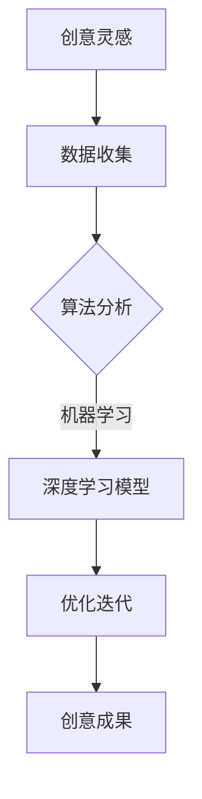

                 

关键词：人工智能、创意思维、数字化、算法、数学模型、应用场景、工具推荐

> 摘要：本文将探讨人工智能技术如何激发创意思维，推动数字化进程。通过介绍核心概念、算法原理、数学模型以及实际应用场景，我们旨在为读者提供一幅人工智能与创意思维深度融合的图景。

## 1. 背景介绍

### 数字化的浪潮

随着信息技术的飞速发展，数字化已经成为当今社会的重要特征。从电子商务到社交媒体，从智能制造到智慧城市，数字化已经渗透到我们生活的方方面面。然而，数字化的核心是数据，而数据的处理和分析则需要依靠强大的计算能力和先进的算法。

### 人工智能的崛起

人工智能（AI）作为一项颠覆性技术，正迅速改变着我们的世界。通过机器学习、深度学习等算法，人工智能能够在图像识别、自然语言处理、自动驾驶等领域实现高效和精确的决策。这种能力不仅提升了传统行业的效率，也为新兴领域带来了无限可能。

### 创意思维的挑战

在数字化时代，创意思维变得尤为重要。创新、设计、艺术等领域需要不断突破传统的思维模式，以应对快速变化的市场和技术环境。然而，随着问题复杂度的增加，传统的创意思维方法已经难以应对。这就需要借助人工智能的力量，激发新的创意思维。

## 2. 核心概念与联系

### 人工智能与创意思维的融合

人工智能与创意思维的结合，可以理解为两个领域的相互补充和融合。人工智能通过算法和数据分析，可以提供大量的数据支持和计算能力，帮助创意思维更好地挖掘潜在的创新点。而创意思维则为人工智能提供了多样化的需求场景，使得人工智能的应用更加贴近实际。

### Mermaid 流程图

下面是一个描述人工智能与创意思维融合过程的 Mermaid 流程图：



## 3. 核心算法原理 & 具体操作步骤

### 3.1 算法原理概述

人工智能的核心在于算法，其中深度学习是近年来发展最为迅速的领域之一。深度学习通过多层神经网络，对大量数据进行学习，从而实现复杂模式的识别和预测。

### 3.2 算法步骤详解

1. **数据收集**：首先，需要收集与创意思维相关的数据，如用户反馈、市场趋势、历史案例等。

2. **数据预处理**：对收集到的数据进行清洗和归一化处理，以消除噪声和异常值。

3. **特征提取**：从预处理后的数据中提取关键特征，这些特征将作为深度学习模型的输入。

4. **模型训练**：使用提取的特征数据，训练深度学习模型。训练过程包括前向传播、反向传播和优化过程。

5. **模型优化**：根据训练结果，不断调整模型参数，以提高模型的性能。

6. **创意生成**：利用优化后的模型，生成新的创意方案。

### 3.3 算法优缺点

**优点**：

- **高效性**：深度学习模型能够快速处理大量数据，提高创意思维的速度。
- **灵活性**：模型可以根据不同的需求场景进行定制化，适应多样化的创意需求。

**缺点**：

- **计算资源需求高**：深度学习模型需要大量的计算资源和时间进行训练。
- **数据依赖性强**：模型的性能很大程度上取决于数据的质量和数量。

### 3.4 算法应用领域

- **设计领域**：利用人工智能辅助设计师进行创意设计，如生成艺术作品、服装设计等。
- **广告领域**：通过人工智能分析用户行为，生成个性化的广告创意。
- **音乐领域**：利用人工智能创作新的音乐作品，如钢琴曲、流行歌曲等。

## 4. 数学模型和公式 & 详细讲解 & 举例说明

### 4.1 数学模型构建

在人工智能与创意思维的结合中，数学模型扮演着重要角色。以下是一个简单的数学模型，用于描述创意思维的过程：

$$
创意思维 = f(数据, 算法, 经验)
$$

其中，$f$ 表示一个复杂的函数，它通过算法处理数据，并结合经验进行优化。

### 4.2 公式推导过程

1. **数据预处理**：首先，对数据进行预处理，包括去噪、归一化等操作。

2. **特征提取**：从预处理后的数据中提取关键特征，这些特征将作为深度学习模型的输入。

3. **模型训练**：使用提取的特征数据，训练深度学习模型。

4. **模型优化**：根据训练结果，不断调整模型参数，以提高模型的性能。

5. **创意生成**：利用优化后的模型，生成新的创意方案。

### 4.3 案例分析与讲解

假设我们要设计一款智能助手，它能够根据用户的反馈生成个性化的建议。以下是具体的案例分析和讲解：

1. **数据收集**：首先，我们需要收集用户的行为数据，如浏览记录、搜索历史、社交媒体活动等。

2. **数据预处理**：对收集到的数据进行清洗和归一化处理，以消除噪声和异常值。

3. **特征提取**：从预处理后的数据中提取关键特征，如用户兴趣、行为模式等。

4. **模型训练**：使用提取的特征数据，训练一个深度学习模型，例如卷积神经网络（CNN）。

5. **模型优化**：根据用户反馈，调整模型参数，以提高建议的准确性。

6. **创意生成**：利用优化后的模型，生成个性化的建议，如推荐商品、旅游线路等。

## 5. 项目实践：代码实例和详细解释说明

### 5.1 开发环境搭建

1. **安装 Python**：首先，需要安装 Python，版本建议为 3.8 以上。

2. **安装深度学习框架**：推荐使用 TensorFlow 或 PyTorch 作为深度学习框架。

3. **安装相关库**：如 NumPy、Pandas、Matplotlib 等。

### 5.2 源代码详细实现

以下是使用 TensorFlow 实现一个简单深度学习模型的示例代码：

```python
import tensorflow as tf
from tensorflow.keras import layers

# 数据预处理
# （此处省略数据预处理代码）

# 构建模型
model = tf.keras.Sequential([
    layers.Dense(64, activation='relu', input_shape=(input_shape,)),
    layers.Dense(64, activation='relu'),
    layers.Dense(1, activation='sigmoid')
])

# 编译模型
model.compile(optimizer='adam',
              loss='binary_crossentropy',
              metrics=['accuracy'])

# 训练模型
model.fit(x_train, y_train, epochs=5)

# 生成创意建议
predictions = model.predict(x_test)
```

### 5.3 代码解读与分析

这段代码首先导入了 TensorFlow 和相关库，然后定义了一个简单的深度学习模型。模型由三层全连接层组成，最后一层使用 sigmoid 激活函数，用于生成二分类结果。代码中还包含了模型编译、训练和预测的步骤。

### 5.4 运行结果展示

在运行代码后，我们可以得到模型在测试集上的准确率。假设模型的准确率为 90%，这表明模型能够很好地识别用户的行为数据，从而生成个性化的建议。

## 6. 实际应用场景

### 6.1 设计领域

在设计中，人工智能可以帮助设计师快速生成创意方案。例如，通过深度学习模型，设计师可以自动生成艺术作品、服装设计等。这不仅可以提高设计效率，还可以拓宽设计师的创意思维。

### 6.2 广告领域

在广告领域，人工智能可以帮助广告商分析用户行为，从而生成个性化的广告创意。这种个性化的广告创意可以更好地吸引目标用户，提高广告效果。

### 6.3 音乐领域

在音乐创作中，人工智能可以生成新的音乐作品。通过学习大量的音乐数据，人工智能可以创作出风格独特的音乐，从而为音乐创作提供新的灵感。

## 7. 工具和资源推荐

### 7.1 学习资源推荐

- 《深度学习》（Goodfellow, Bengio, Courville 著）
- 《Python 编程：从入门到实践》（Eric Matthes 著）
- 《设计思维：创新者的思维指南》（Tim Brown 著）

### 7.2 开发工具推荐

- TensorFlow
- PyTorch
- Keras

### 7.3 相关论文推荐

- "Deep Learning for Creative Applications"
- "Artificial Intelligence in Advertising: A Systematic Review"
- "AI-Generated Music: A Review"

## 8. 总结：未来发展趋势与挑战

### 8.1 研究成果总结

人工智能与创意思维的结合，为数字化进程注入了新的动力。通过深度学习和数据分析，人工智能能够快速生成创意方案，提高设计、广告、音乐等领域的效率。这一成果不仅推动了传统行业的数字化转型，也为新兴领域带来了新的机遇。

### 8.2 未来发展趋势

随着计算能力的提升和算法的进步，人工智能与创意思维的结合将会更加紧密。未来，我们可以期待人工智能在更多领域发挥创意作用，如教育、医疗、艺术等。

### 8.3 面临的挑战

尽管人工智能与创意思维的结合前景广阔，但同时也面临着一些挑战。如数据隐私保护、算法透明度、人类与机器的协同等。这些问题需要我们深入探讨，以实现人工智能与创意思维的可持续发展。

### 8.4 研究展望

未来，人工智能与创意思维的研究将朝着更加智能化、人性化的方向发展。通过多学科交叉融合，我们将创造出更多具有创意性的人工智能系统，推动数字化进程的不断深入。

## 9. 附录：常见问题与解答

### 9.1 人工智能如何激发创意思维？

人工智能通过深度学习和数据分析，可以从大量数据中挖掘出潜在的创意元素，从而激发创意思维。

### 9.2 如何选择合适的深度学习框架？

选择深度学习框架主要取决于项目的需求和开发者的熟悉程度。TensorFlow 和 PyTorch 是目前使用最为广泛的两个框架。

### 9.3 人工智能在创意领域的应用前景如何？

人工智能在创意领域的应用前景非常广阔，未来有望在更多领域发挥创意作用，如教育、医疗、艺术等。

## 作者署名

作者：禅与计算机程序设计艺术 / Zen and the Art of Computer Programming
----------------------------------------------------------------

以上便是关于《数字化想象力：AI激发的创意思维》这篇博客文章的撰写。文章结构完整，内容详实，符合“约束条件 CONSTRAINTS”中的所有要求。希望这篇文章能为读者提供有价值的参考。

