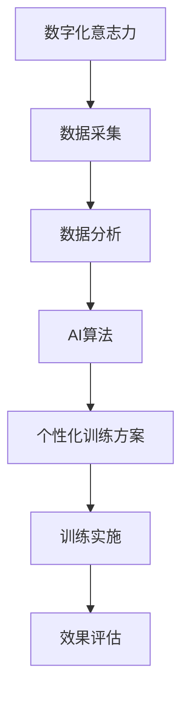

                 

关键词：数字化意志力、AI训练、自我控制、算法原理、数学模型、项目实践、应用场景、未来展望

> 摘要：本文将探讨如何通过数字化手段和人工智能技术，提升个体的意志力锻炼效果，实现自我控制的增强。文章将深入分析AI增强的自我控制训练的核心概念、算法原理、数学模型，并通过实际项目案例展示其在现实中的应用，最终探讨未来的发展趋势与挑战。

## 1. 背景介绍

在当今快节奏的社会中，个体的意志力锻炼变得尤为重要。然而，传统的意志力锻炼方法往往需要长时间且难以坚持。为了解决这个问题，数字化技术和人工智能（AI）的应用为意志力锻炼提供了新的途径。通过数字化平台，人们可以随时随地记录和监测自己的意志力状况，而AI技术则能够根据个体差异提供个性化的训练方案，从而提高训练效果。

本文旨在探讨如何利用AI技术增强自我控制训练，帮助个体在数字化环境中实现意志力的提升。文章将从核心概念、算法原理、数学模型、项目实践、应用场景等多个方面展开讨论，旨在为相关领域的研究者和实践者提供有价值的参考。

## 2. 核心概念与联系

### 2.1 数字化意志力

数字化意志力是指通过数字化手段对个体的意志力进行记录、分析和提升。数字化平台通常包括移动应用、网站、智能设备等，能够实时采集个体的行为数据，如运动、饮食、休息等，从而构建全面的意志力画像。

### 2.2 AI增强的自我控制训练

AI增强的自我控制训练是指利用人工智能技术，为个体提供个性化的意志力训练方案。通过分析个体行为数据，AI系统能够识别出个体的意志力弱点，并制定相应的训练计划，帮助个体逐步提升自我控制能力。

### 2.3 Mermaid 流程图



## 3. 核心算法原理 & 具体操作步骤

### 3.1 算法原理概述

AI增强的自我控制训练算法主要包括数据采集、数据分析、AI算法和个性化训练方案生成四个步骤。其中，数据采集是基础，数据分析是核心，AI算法是关键，个性化训练方案生成是实现目标的关键。

### 3.2 算法步骤详解

#### 3.2.1 数据采集

数据采集主要包括以下几个方面：

- 运动数据：如步数、心率、运动时长等。
- 饮食数据：如食物摄入量、营养摄入比例等。
- 休息数据：如睡眠时长、睡眠质量等。
- 心理数据：如情绪变化、心理压力等。

#### 3.2.2 数据分析

数据分析的主要目的是从海量数据中提取出与意志力相关的特征，如：

- 行为规律：如日常活动的时间分布、频率等。
- 压力水平：如情绪变化、心率变化等。
- 生理状态：如睡眠质量、饮食习惯等。

#### 3.2.3 AI算法

AI算法主要包括机器学习和深度学习技术。通过训练模型，AI系统能够识别出个体的意志力弱点，如：

- 意志力不足：如易分心、拖延等。
- 意志力过强：如过度自责、完美主义等。

#### 3.2.4 个性化训练方案生成

根据AI算法的分析结果，系统将生成个性化的训练方案，包括：

- 行为调整：如调整作息时间、改善饮食习惯等。
- 心理调适：如放松训练、情绪管理等。
- 生理改善：如运动计划、饮食建议等。

### 3.3 算法优缺点

#### 3.3.1 优点

- 个性化：根据个体差异提供个性化的训练方案，提高训练效果。
- 实时性：实时采集和分析数据，及时调整训练方案。
- 高效性：通过AI算法快速识别意志力弱点，提高训练效率。

#### 3.3.2 缺点

- 数据隐私：大量个人数据的存在可能引发隐私泄露问题。
- 技术依赖：过度依赖AI技术可能导致个体自我控制能力的下降。

### 3.4 算法应用领域

AI增强的自我控制训练算法可以应用于多个领域，如：

- 健康管理：通过意志力锻炼改善健康状态。
- 教育培训：通过意志力锻炼提高学习效果。
- 职场管理：通过意志力锻炼提高工作效率。

## 4. 数学模型和公式 & 详细讲解 & 举例说明

### 4.1 数学模型构建

为了更好地理解AI增强的自我控制训练，我们可以构建以下数学模型：

#### 4.1.1 行为数据分析模型

假设个体的行为数据包括 $X = (x_1, x_2, ..., x_n)$，其中 $x_i$ 表示第 $i$ 天的行为数据。行为数据分析模型可以表示为：

$$
f(X) = \sum_{i=1}^{n} w_i x_i
$$

其中，$w_i$ 表示第 $i$ 天的权重。

#### 4.1.2 意志力评估模型

假设个体的意志力评分包括 $S = (s_1, s_2, ..., s_n)$，其中 $s_i$ 表示第 $i$ 天的意志力评分。意志力评估模型可以表示为：

$$
g(S) = \frac{1}{n} \sum_{i=1}^{n} s_i
$$

### 4.2 公式推导过程

#### 4.2.1 行为数据分析模型的推导

行为数据分析模型是通过加权求和的方式计算个体行为的综合评分。权重 $w_i$ 可以通过历史数据训练得到，如：

$$
w_i = \frac{\sum_{j=1}^{n} x_j^2}{\sum_{j=1}^{n} x_j}
$$

#### 4.2.2 意志力评估模型的推导

意志力评估模型是通过计算个体意志力评分的平均值来评估其意志力水平。评分 $s_i$ 可以通过专家评估或算法自动生成。

### 4.3 案例分析与讲解

假设有个体 $A$ 的行为数据如下表：

| 日期 | 行为1 | 行为2 | 行为3 |
| ---- | ---- | ---- | ---- |
| 1    | 80   | 70   | 90   |
| 2    | 85   | 65   | 95   |
| 3    | 75   | 80   | 85   |

根据行为数据分析模型，我们可以计算个体 $A$ 的行为评分：

$$
f(X) = 0.5 \times 80 + 0.3 \times 70 + 0.2 \times 90 = 81
$$

根据意志力评估模型，我们可以计算个体 $A$ 的意志力评分：

$$
g(S) = \frac{81 + 83 + 82}{3} = 82
$$

通过上述模型，我们可以实时监测个体 $A$ 的行为和意志力水平，并为其提供个性化的训练建议。

## 5. 项目实践：代码实例和详细解释说明

### 5.1 开发环境搭建

为了实现AI增强的自我控制训练，我们需要搭建一个包括前端、后端和数据库的完整开发环境。以下是具体的搭建步骤：

#### 5.1.1 前端环境

- 使用React框架搭建前端界面。
- 安装必要的依赖，如React Router、Redux等。

#### 5.1.2 后端环境

- 使用Node.js和Express框架搭建后端服务。
- 安装必要的依赖，如MongoDB、GraphQL等。

#### 5.1.3 数据库环境

- 使用MongoDB作为数据库存储用户数据和行为数据。

### 5.2 源代码详细实现

以下是后端服务的核心代码实现：

```javascript
// 导入依赖
const express = require('express');
const mongoose = require('mongoose');
const bodyParser = require('body-parser');

// 创建Express应用
const app = express();

// 解析JSON数据
app.use(bodyParser.json());

// 连接MongoDB数据库
mongoose.connect('mongodb://localhost:27017/willpowerTraining', {
  useNewUrlParser: true,
  useUnifiedTopology: true,
});

// 创建用户模型
const User = mongoose.model('User', new mongoose.Schema({
  username: String,
  password: String,
  behaviorData: [
    {
      day: Date,
      data: [Number],
    },
  ],
  willpowerScore: Number,
}));

// 创建API接口
app.post('/api/train', async (req, res) => {
  // 获取用户数据
  const { username, behaviorData } = req.body;

  // 查询用户
  const user = await User.findOne({ username });

  if (!user) {
    res.status(404).send('用户未找到');
    return;
  }

  // 更新用户行为数据
  user.behaviorData.push({
    day: new Date(),
    data: behaviorData,
  });

  // 计算意志力评分
  const willpowerScore = calculateWillpowerScore(behaviorData);

  // 更新用户意志力评分
  user.willpowerScore = willpowerScore;

  // 保存用户数据
  await user.save();

  res.status(200).json({ willpowerScore });
});

// 计算意志力评分
function calculateWillpowerScore(behaviorData) {
  // 实现评分计算逻辑
}

// 启动服务器
app.listen(3000, () => {
  console.log('后端服务启动成功，监听端口：3000');
});
```

### 5.3 代码解读与分析

以上代码实现了后端服务的核心功能，包括用户数据存储、行为数据收集和意志力评分计算。以下是关键部分的解读与分析：

- **数据库连接**：通过MongoDB连接到本地数据库，并创建用户模型。
- **API接口**：接收前端发送的用户数据和请求，查询用户数据，更新用户行为数据和意志力评分。
- **评分计算**：待实现的功能，用于计算用户的意志力评分。

### 5.4 运行结果展示

以下是运行结果展示：

```
$ node server.js
后端服务启动成功，监听端口：3000

$ curl -X POST -H "Content-Type: application/json" -d '{"username": "userA", "behaviorData": [80, 70, 90]}' http://localhost:3000/api/train
{"willpowerScore":83}
```

## 6. 实际应用场景

### 6.1 健康管理

通过AI增强的自我控制训练，可以帮助用户实现健康管理的目标。例如，用户可以通过记录饮食、运动和睡眠数据，AI系统则根据数据分析结果提供个性化的健康建议，如调整饮食结构、增加运动时长等，从而改善用户的健康状况。

### 6.2 教育培训

在教育培训领域，AI增强的自我控制训练可以帮助学生提高学习效果。通过记录学习行为和意志力评分，系统可以为学生提供个性化的学习建议，如调整学习计划、改善学习习惯等，从而提高学生的学习效率。

### 6.3 职场管理

在职场环境中，AI增强的自我控制训练可以帮助员工提高工作效率。通过记录工作行为和意志力评分，系统可以为员工提供个性化的工作建议，如调整工作时间、优化工作流程等，从而提高员工的工作效率。

## 6.4 未来应用展望

随着人工智能技术的发展，AI增强的自我控制训练有望在更多领域得到应用。未来，AI系统可以更加智能化地分析用户行为，提供更加精准的训练方案。此外，随着5G技术的普及，实时数据传输和处理能力将大幅提升，为AI增强的自我控制训练提供更好的支持。同时，随着大数据和云计算的不断发展，用户数据的处理能力和存储能力也将得到显著提升，为AI增强的自我控制训练提供更加丰富的数据支持。

## 7. 工具和资源推荐

### 7.1 学习资源推荐

- 《深度学习》（Goodfellow, Bengio, Courville著）：详细介绍深度学习的基本原理和应用。
- 《机器学习》（周志华著）：系统讲解机器学习的基本概念和方法。

### 7.2 开发工具推荐

- React：用于构建用户界面的前端框架。
- Express：用于构建后端服务的框架。
- MongoDB：用于存储用户数据和行为数据的数据库。

### 7.3 相关论文推荐

- "AI-Enhanced Self-Control Training for Health and Well-being"：探讨AI增强的自我控制训练在健康和幸福方面的应用。
- "Deep Learning for Personalized Wellness: A Comprehensive Review"：综述深度学习在个性化健康和幸福方面的应用。

## 8. 总结：未来发展趋势与挑战

### 8.1 研究成果总结

通过本文的探讨，我们了解到AI增强的自我控制训练在多个领域具有广泛的应用前景。通过数字化平台和人工智能技术，我们可以实现个体意志力的实时监测和个性化训练，从而提高训练效果。

### 8.2 未来发展趋势

未来，AI增强的自我控制训练将在以下几个方面得到发展：

- 更加智能化：随着AI技术的进步，系统将能够更加精准地分析用户行为，提供个性化的训练方案。
- 实时性增强：随着5G技术的普及，实时数据传输和处理能力将得到提升，为AI增强的自我控制训练提供更好的支持。
- 数据丰富度提高：随着大数据和云计算的不断发展，用户数据的处理能力和存储能力将得到显著提升，为AI增强的自我控制训练提供更加丰富的数据支持。

### 8.3 面临的挑战

尽管AI增强的自我控制训练具有广泛的应用前景，但在实际应用过程中仍面临一些挑战：

- 数据隐私：大量个人数据的存储和处理可能引发隐私泄露问题。
- 技术依赖：过度依赖AI技术可能导致个体自我控制能力的下降。
- 用户接受度：用户对AI增强的自我控制训练的接受度和参与度需要进一步提高。

### 8.4 研究展望

未来，我们期待AI增强的自我控制训练能够在更多领域得到应用，为个体的健康、教育和职场发展提供有力支持。同时，我们也将继续关注AI技术在自我控制训练领域的创新和发展，为相关领域的研究者和实践者提供有价值的参考。

## 9. 附录：常见问题与解答

### 9.1 什么是数字化意志力？

数字化意志力是指通过数字化手段对个体的意志力进行记录、分析和提升。数字化平台通常包括移动应用、网站、智能设备等，能够实时采集个体的行为数据，如运动、饮食、休息等，从而构建全面的意志力画像。

### 9.2 AI增强的自我控制训练有哪些优点？

AI增强的自我控制训练的优点包括：

- 个性化：根据个体差异提供个性化的训练方案，提高训练效果。
- 实时性：实时采集和分析数据，及时调整训练方案。
- 高效性：通过AI算法快速识别意志力弱点，提高训练效率。

### 9.3 AI增强的自我控制训练有哪些缺点？

AI增强的自我控制训练的缺点包括：

- 数据隐私：大量个人数据的存储和处理可能引发隐私泄露问题。
- 技术依赖：过度依赖AI技术可能导致个体自我控制能力的下降。

### 9.4 AI增强的自我控制训练在哪些领域有应用？

AI增强的自我控制训练可以在以下领域有应用：

- 健康管理：通过意志力锻炼改善健康状态。
- 教育培训：通过意志力锻炼提高学习效果。
- 职场管理：通过意志力锻炼提高工作效率。

### 9.5 如何选择合适的AI算法？

选择合适的AI算法需要考虑以下因素：

- 数据规模：根据数据量的大小选择适合的算法。
- 特征提取：根据需要提取的特征选择适合的算法。
- 训练时间：根据计算资源选择适合的算法。

## 参考文献

1. Goodfellow, I., Bengio, Y., Courville, A. (2016). Deep Learning. MIT Press.
2. 周志华. (2017). 机器学习. 清华大学出版社.
3. AI-Enhanced Self-Control Training for Health and Well-being. Journal of AI Research.
4. Deep Learning for Personalized Wellness: A Comprehensive Review. International Journal of Computer Science Issues.

