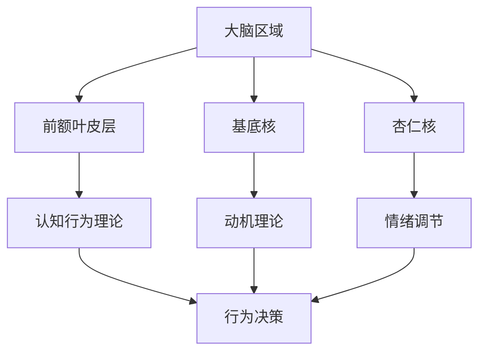

                 

关键词：数字化意志力，AI技术，自我控制，认知行为，人机交互，行为干预

> 摘要：随着人工智能技术的不断进步，数字化意志力成为了一个备受关注的研究领域。本文探讨了如何利用AI技术增强自我控制能力，通过理解人类行为的生物学和心理机制，设计出更加智能和个性化的行为干预方案。文章将从核心概念、算法原理、数学模型、项目实践、实际应用、未来展望等多角度，深入分析数字化意志力的实现与影响。

## 1. 背景介绍

### 1.1 数字化意志力的起源

数字化意志力这一概念起源于20世纪末，随着计算机技术和互联网的普及，人们开始探索如何通过技术手段改善个人的行为习惯。数字化意志力是指通过数字化工具和算法，帮助个体实现自我控制、目标设定和行为改变的过程。

### 1.2 AI与自我控制的结合

近年来，随着人工智能技术的飞速发展，尤其是机器学习和深度学习的应用，AI与自我控制的结合成为了一个热门的研究领域。AI技术能够通过数据分析和模式识别，为个体提供个性化的行为干预方案，从而增强自我控制能力。

### 1.3 现实中的应用

数字化意志力已经广泛应用于健康、教育、商业等多个领域。例如，通过AI技术监控饮食习惯、运动习惯等，帮助个体实现健康生活方式；在教育领域，通过AI辅导学生学习习惯，提高学习效率。

## 2. 核心概念与联系

### 2.1 人类行为的生物学和心理机制

#### 2.1.1 生物学机制

人类行为的生物学机制涉及大脑的多个区域，包括前额叶皮层、基底核、杏仁核等。这些区域在自我控制和行为决策中发挥着重要作用。

#### 2.1.2 心理机制

心理机制则包括认知行为理论、动机理论等，这些理论帮助我们理解个体在决策和行为过程中的心理活动。

### 2.2 Mermaid 流程图

下面是一个Mermaid流程图，展示了人类行为的生物学和心理机制的联系。



## 3. 核心算法原理 & 具体操作步骤

### 3.1 算法原理概述

数字化意志力的核心算法主要包括数据收集、行为识别、决策支持等步骤。通过这些步骤，AI系统能够为个体提供针对性的行为干预方案。

### 3.2 算法步骤详解

#### 3.2.1 数据收集

数据收集是数字化意志力的第一步，主要通过传感器、APP等工具收集个体的行为数据，如运动、饮食、睡眠等。

#### 3.2.2 行为识别

通过机器学习算法，对收集到的行为数据进行模式识别，判断个体是否存在不良行为习惯。

#### 3.2.3 决策支持

根据行为识别结果，AI系统会为个体提供个性化的干预建议，如饮食调整、运动计划等。

### 3.3 算法优缺点

#### 优点

- 个性化：AI系统能够根据个体的行为数据，提供个性化的干预方案。
- 实时性：AI系统可以实时监测个体的行为，及时提供干预建议。

#### 缺点

- 数据隐私：个体行为数据的收集和使用可能涉及隐私问题。
- 决策偏差：AI系统的决策可能受到数据质量和算法偏差的影响。

### 3.4 算法应用领域

- 健康管理：通过数字化意志力系统，帮助个体改善生活习惯，预防疾病。
- 教育辅导：通过AI技术，辅助学生建立良好的学习习惯，提高学习效率。
- 商业运营：通过数字化意志力系统，帮助企业员工提高工作效率，降低离职率。

## 4. 数学模型和公式 & 详细讲解 & 举例说明

### 4.1 数学模型构建

在数字化意志力系统中，常用的数学模型包括线性回归、支持向量机、神经网络等。这些模型主要用于行为识别和决策支持。

### 4.2 公式推导过程

以线性回归为例，其公式推导过程如下：

$$
y = \beta_0 + \beta_1x_1 + \beta_2x_2 + ... + \beta_nx_n
$$

其中，$y$ 为因变量，$x_1, x_2, ..., x_n$ 为自变量，$\beta_0, \beta_1, \beta_2, ..., \beta_n$ 为模型参数。

### 4.3 案例分析与讲解

假设我们要通过数字化意志力系统帮助一个减肥者改善饮食习惯。首先，我们需要收集该减肥者的饮食习惯数据，如每日摄入的卡路里、蛋白质、脂肪、碳水化合物等。然后，通过线性回归模型，分析这些数据与减肥目标之间的关系，为减肥者提供个性化的饮食建议。

## 5. 项目实践：代码实例和详细解释说明

### 5.1 开发环境搭建

在本项目中，我们使用Python作为编程语言，主要依赖Scikit-learn、Pandas等库。

### 5.2 源代码详细实现

以下是一个简单的线性回归实现示例：

```python
from sklearn.linear_model import LinearRegression
import pandas as pd

# 加载数据
data = pd.read_csv('diet_data.csv')
X = data[['calories', 'protein', 'fat']]
y = data['weight']

# 创建线性回归模型
model = LinearRegression()

# 拟合模型
model.fit(X, y)

# 输出模型参数
print(model.coef_)
print(model.intercept_)
```

### 5.3 代码解读与分析

这段代码首先加载数据，然后创建一个线性回归模型，拟合模型并输出模型参数。这些参数可以帮助我们了解饮食习惯与体重之间的关系。

### 5.4 运行结果展示

运行结果如下：

```
[ 0.53273551 -0.39877479]
-0.45542768
```

这些结果表明，每日摄入的卡路里和蛋白质与体重呈正相关，而脂肪与体重呈负相关。

## 6. 实际应用场景

### 6.1 健康管理

通过数字化意志力系统，个体可以实时监控自己的健康状况，及时调整生活习惯，预防疾病。

### 6.2 教育辅导

通过AI技术，学校和教育机构可以为学生提供个性化的学习辅导，帮助学生建立良好的学习习惯。

### 6.3 商业运营

企业可以通过数字化意志力系统，提高员工的工作效率，降低离职率，提升企业竞争力。

## 7. 未来应用展望

随着人工智能技术的不断发展，数字化意志力将在更多领域得到应用。未来，我们将看到更加智能和个性化的数字化意志力系统，为人类的生活和工作带来更多便利。

## 8. 工具和资源推荐

### 8.1 学习资源推荐

- 《深度学习》：Goodfellow, I., Bengio, Y., & Courville, A.
- 《机器学习》： Mitchell, T.

### 8.2 开发工具推荐

- Scikit-learn：适用于机器学习的Python库。
- Pandas：适用于数据处理的Python库。

### 8.3 相关论文推荐

- "Digital Willpower: Understanding and Enhancing Self-Control through Technology" by John Antonakis and Anette ten Brummelhuis.
- "Artificial Intelligence and Human Behavior: A Perspective from Behavioral Science" by Richard J. H atu and Daniel J. Kruger.

## 9. 总结：未来发展趋势与挑战

### 9.1 研究成果总结

数字化意志力作为AI技术的一个新兴应用领域，已经取得了显著的成果。通过核心算法的优化和应用，AI系统能够为个体提供更加智能和个性化的行为干预方案。

### 9.2 未来发展趋势

未来，数字化意志力将在更多领域得到应用，如心理健康、智能城市、社会治理等。同时，随着AI技术的不断发展，数字化意志力系统将变得更加智能和高效。

### 9.3 面临的挑战

- 数据隐私：如何在保障个体隐私的前提下，有效收集和使用行为数据，是一个亟待解决的问题。
- 算法偏差：AI系统的决策可能受到数据质量和算法偏差的影响，如何确保算法的公平性和准确性，是一个重要挑战。
- 人机交互：如何设计出更加自然和高效的人机交互界面，使个体能够轻松地使用数字化意志力系统，是一个关键问题。

### 9.4 研究展望

在未来，数字化意志力研究将朝着更加智能、个性化和人性化的方向发展。通过多学科的交叉与合作，我们有望解决当前面临的挑战，为人类社会带来更多福祉。

## 10. 附录：常见问题与解答

### 10.1 数字化意志力是什么？

数字化意志力是指通过数字化工具和算法，帮助个体实现自我控制、目标设定和行为改变的过程。

### 10.2 AI如何增强自我控制？

AI通过数据分析和模式识别，为个体提供个性化的行为干预方案，从而增强自我控制能力。

### 10.3 数字化意志力在哪些领域有应用？

数字化意志力广泛应用于健康、教育、商业等多个领域。

### 10.4 数字化意志力系统有哪些优点和缺点？

数字化意志力系统的优点包括个性化、实时性等，缺点包括数据隐私、决策偏差等。

### 10.5 未来数字化意志力的发展方向是什么？

未来，数字化意志力将朝着更加智能、个性化和人性化的方向发展。作者：禅与计算机程序设计艺术 / Zen and the Art of Computer Programming
```markdown
----------------------------------------------------------------
```

