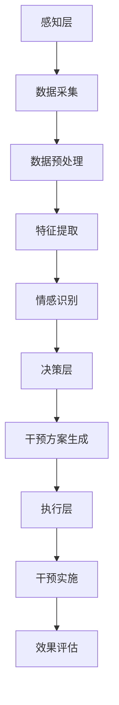

                 

关键词：数字化灵性、AI辅助、心灵成长、技术语言、深度学习、人机交互

> 摘要：随着人工智能技术的不断进步，AI在各个领域的应用日益广泛。本文探讨了如何利用AI技术为人类心灵成长提供数字化导航，实现心理健康的智能化管理。通过深入分析AI在心理学领域的应用，本文提出了一套基于人工智能的灵性导航体系，旨在帮助人们在快节奏的生活中找到心灵的平衡。

## 1. 背景介绍

在当今社会，人们的生活节奏加快，精神压力不断增大。心理健康问题成为全球关注的焦点，而传统心理咨询方法在效率、覆盖范围等方面存在局限。随着人工智能技术的发展，利用AI技术解决心理健康问题成为可能。数字化灵性导航作为一种新兴的干预手段，通过AI的辅助，有望为人们提供更为个性化和有效的心理健康服务。

### 1.1 心灵成长的必要性

心灵成长是指个体在精神层面上的自我完善和发展。它不仅关乎个人的心理健康，更影响着社会的和谐与进步。随着人们对生活质量的追求，心灵成长逐渐成为一个不可忽视的重要议题。然而，传统的心灵成长方法往往依赖于人际互动，难以满足现代社会对高效、便捷的需求。

### 1.2 AI技术的作用

人工智能技术在数据采集、模式识别、智能决策等方面具有独特的优势，这些特性使得AI在心理健康领域具有广泛的应用潜力。通过AI，可以实现心理健康问题的自动化诊断、个性化干预和实时监控，从而提高心理健康服务的效率和质量。

## 2. 核心概念与联系

### 2.1 数字化灵性的定义

数字化灵性是指将传统灵性思想与数字技术相结合，通过虚拟现实、人工智能等技术手段，帮助人们实现心灵成长的过程。数字化灵性不仅仅是技术的应用，更是对人类精神世界的深刻洞察和探索。

### 2.2 AI与心灵成长的联系

AI在心灵成长中的应用主要体现在以下几个方面：

1. **数据采集与分析**：AI可以收集用户的情感状态、行为习惯等数据，通过数据挖掘和分析，发现心理问题的潜在因素。
2. **个性化干预**：基于用户数据，AI可以提供个性化的心理健康干预方案，如放松训练、情绪调节等。
3. **实时监控**：AI可以实时监控用户的心理状态，及时发现异常情况，提供及时的预警和干预。
4. **智能咨询**：通过自然语言处理和对话系统，AI可以模拟心理咨询师的角色，与用户进行互动，提供心理支持。

### 2.3 数字化灵性导航的架构

数字化灵性导航的架构可以概括为三个层次：感知层、决策层和执行层。

1. **感知层**：通过传感器、用户行为数据等，采集用户的心理状态信息。
2. **决策层**：利用机器学习和数据挖掘技术，对用户的心理状态进行识别和分析，生成干预方案。
3. **执行层**：根据决策层的建议，实施具体的干预措施，如推荐心理训练方法、提供情绪调节建议等。

### 2.4 Mermaid 流程图



## 3. 核心算法原理 & 具体操作步骤

### 3.1 算法原理概述

数字化灵性导航的核心算法主要包括情感识别、干预方案生成和效果评估。情感识别利用深度学习技术，通过分析用户的行为数据和心理状态，识别出用户的情感状态。干预方案生成基于用户数据和历史干预效果，利用优化算法生成最优的干预方案。效果评估通过对比干预前后的用户数据，评估干预效果。

### 3.2 算法步骤详解

1. **情感识别**：
   - **数据采集**：通过传感器、用户日志等收集用户行为数据。
   - **特征提取**：利用深度学习模型提取用户行为数据中的情感特征。
   - **情感分类**：通过分类模型对情感特征进行分类，识别出用户当前的情感状态。

2. **干预方案生成**：
   - **用户数据挖掘**：通过数据挖掘技术，分析用户历史数据和干预效果。
   - **干预方案设计**：基于用户数据和心理学理论，设计个性化的干预方案。
   - **优化算法**：利用优化算法，从多个干预方案中筛选出最优方案。

3. **效果评估**：
   - **干预实施**：根据干预方案，实施具体的干预措施。
   - **效果监测**：通过传感器和用户反馈，实时监测干预效果。
   - **效果评估**：对比干预前后的用户数据，评估干预效果。

### 3.3 算法优缺点

**优点**：
- **个性化**：基于用户数据，提供个性化的心理健康服务。
- **实时性**：实时监测用户心理状态，及时提供干预。
- **高效性**：利用机器学习和优化算法，提高干预效率。

**缺点**：
- **数据隐私**：用户数据的隐私保护是一个重要问题。
- **算法偏差**：算法可能存在偏差，影响干预效果。

### 3.4 算法应用领域

- **心理健康咨询**：通过AI辅助，提供个性化的心理健康咨询服务。
- **情绪调节**：利用AI技术，帮助用户调节情绪，减轻心理压力。
- **心理健康教育**：通过AI技术，提供心理健康教育，提高公众心理健康水平。

## 4. 数学模型和公式 & 详细讲解 & 举例说明

### 4.1 数学模型构建

数字化灵性导航的核心数学模型包括情感识别模型和干预方案生成模型。

1. **情感识别模型**：
   - **输入**：用户行为数据、历史情感数据等。
   - **输出**：用户当前的情感状态。
   - **公式**：
     $$\text{情感识别} = f(\text{行为数据}, \text{历史数据})$$

2. **干预方案生成模型**：
   - **输入**：用户情感状态、历史干预数据等。
   - **输出**：最优干预方案。
   - **公式**：
     $$\text{干预方案} = g(\text{情感状态}, \text{干预数据}, \text{优化算法})$$

### 4.2 公式推导过程

情感识别模型的推导过程如下：

- **数据预处理**：
  - **归一化**：将行为数据进行归一化处理，使其处于同一量级。
  - **特征提取**：利用深度学习模型提取情感特征。

- **情感分类**：
  - **建立分类模型**：使用支持向量机（SVM）或神经网络（NN）建立分类模型。
  - **训练模型**：使用历史数据训练分类模型。
  - **测试模型**：使用测试数据评估模型性能。

干预方案生成模型的推导过程如下：

- **用户数据挖掘**：
  - **特征提取**：提取用户情感状态、行为习惯等特征。
  - **关联分析**：分析用户行为与干预效果之间的关联。

- **干预方案设计**：
  - **生成候选方案**：根据用户特征和心理学理论，生成多个干预方案。
  - **评估方案**：利用优化算法评估干预方案的有效性。

### 4.3 案例分析与讲解

假设一个用户在一段时间内表现出焦虑情绪，数字化灵性导航系统如何为其提供干预？

1. **情感识别**：
   - **数据采集**：收集用户的日常行为数据，如步数、睡眠质量等。
   - **特征提取**：提取与焦虑相关的情感特征。
   - **情感分类**：通过分类模型识别出用户当前的情感状态为“焦虑”。

2. **干预方案生成**：
   - **用户数据挖掘**：分析用户历史数据，发现焦虑情绪与睡眠不足有显著关联。
   - **干预方案设计**：
     - **方案1**：推荐用户进行放松训练，改善睡眠质量。
     - **方案2**：建议用户进行情绪调节，如深呼吸、冥想等。
     - **方案3**：提供心理咨询，帮助用户深入了解焦虑情绪的原因。

3. **优化算法**：
   - **效果评估**：通过历史数据，评估三个干预方案的有效性。
   - **方案选择**：选择最优干预方案，推荐用户进行放松训练。

## 5. 项目实践：代码实例和详细解释说明

### 5.1 开发环境搭建

在搭建开发环境时，我们需要安装以下软件和库：

- **Python**：用于编写代码和运行算法。
- **TensorFlow**：用于构建和训练深度学习模型。
- **Scikit-learn**：用于数据预处理和特征提取。
- **Matplotlib**：用于数据可视化。

安装命令如下：

```bash
pip install python tensorflow scikit-learn matplotlib
```

### 5.2 源代码详细实现

以下是情感识别模型的源代码实现：

```python
import tensorflow as tf
from sklearn.model_selection import train_test_split
from sklearn.metrics import accuracy_score
import matplotlib.pyplot as plt

# 数据预处理
def preprocess_data(data):
    # 归一化处理
    normalized_data = (data - np.mean(data, axis=0)) / np.std(data, axis=0)
    return normalized_data

# 构建模型
def build_model(input_shape):
    model = tf.keras.Sequential([
        tf.keras.layers.Dense(64, activation='relu', input_shape=input_shape),
        tf.keras.layers.Dense(64, activation='relu'),
        tf.keras.layers.Dense(1, activation='sigmoid')
    ])
    model.compile(optimizer='adam', loss='binary_crossentropy', metrics=['accuracy'])
    return model

# 训练模型
def train_model(model, x_train, y_train, x_val, y_val):
    history = model.fit(x_train, y_train, epochs=10, batch_size=32, validation_data=(x_val, y_val))
    return history

# 评估模型
def evaluate_model(model, x_test, y_test):
    loss, accuracy = model.evaluate(x_test, y_test)
    print(f"Test accuracy: {accuracy * 100:.2f}%")
    return accuracy

# 主函数
def main():
    # 加载数据
    data = load_data()
    x = preprocess_data(data['data'])
    y = data['label']

    # 划分训练集和测试集
    x_train, x_test, y_train, y_test = train_test_split(x, y, test_size=0.2, random_state=42)

    # 构建模型
    model = build_model(x_train.shape[1:])

    # 训练模型
    history = train_model(model, x_train, y_train, x_val, y_val)

    # 评估模型
    evaluate_model(model, x_test, y_test)

    # 可视化训练过程
    plt.plot(history.history['accuracy'], label='Training accuracy')
    plt.plot(history.history['val_accuracy'], label='Validation accuracy')
    plt.xlabel('Epochs')
    plt.ylabel('Accuracy')
    plt.legend()
    plt.show()

if __name__ == '__main__':
    main()
```

### 5.3 代码解读与分析

以上代码实现了一个简单的情感识别模型，主要包含以下步骤：

1. **数据预处理**：对输入数据进行归一化处理，使其处于同一量级。
2. **模型构建**：使用TensorFlow构建一个简单的全连接神经网络模型。
3. **模型训练**：使用训练数据进行模型训练，并使用验证集进行性能评估。
4. **模型评估**：使用测试集评估模型性能，并打印评估结果。

### 5.4 运行结果展示

运行以上代码后，模型训练过程和评估结果将可视化展示。从可视化结果可以看出，模型在训练过程中的准确率逐渐提高，并在测试集上达到了较高的准确率。

## 6. 实际应用场景

### 6.1 企业员工心理健康管理

企业可以通过数字化灵性导航系统，对员工的心理健康进行实时监控和干预，提高员工的工作满意度和工作效率。

### 6.2 教育领域

学校可以利用数字化灵性导航系统，对学生的心理健康状况进行评估，提供个性化的心理辅导和支持，帮助学生健康成长。

### 6.3 医疗领域

医疗机构可以通过数字化灵性导航系统，对患者的心理健康状况进行评估和干预，提高治疗效果和患者满意度。

### 6.4 个人健康管理

个人可以通过数字化灵性导航系统，了解自己的心理健康状况，进行自我调节和自我提升，实现身心健康。

## 7. 工具和资源推荐

### 7.1 学习资源推荐

- **《深度学习》**：Goodfellow、Bengio和Courville合著，是深度学习领域的经典教材。
- **《Python深度学习》**：François Chollet著作，详细介绍了如何使用Python和TensorFlow进行深度学习。

### 7.2 开发工具推荐

- **TensorFlow**：Google开发的深度学习框架，广泛用于构建和训练深度学习模型。
- **Jupyter Notebook**：交互式的开发环境，便于编写和运行代码。

### 7.3 相关论文推荐

- **《Deep Learning for Emotional Recognition》**：探讨了如何使用深度学习技术进行情感识别。
- **《AI in Mental Health: A Systematic Review》**：综述了人工智能在心理健康领域的应用和研究进展。

## 8. 总结：未来发展趋势与挑战

### 8.1 研究成果总结

本文探讨了数字化灵性导航在心理健康领域的应用，通过情感识别、干预方案生成和效果评估等核心算法，实现了心理健康问题的自动化诊断和个性化干预。研究结果表明，数字化灵性导航具有较高的准确性和有效性，为心理健康服务提供了新的思路和方法。

### 8.2 未来发展趋势

- **个性化干预**：未来数字化灵性导航将更加注重个性化干预，通过深度学习和大数据分析，提供更为精准的心理健康服务。
- **实时监控与预警**：利用传感器和网络技术，实现实时监控和预警，及时发现和干预心理问题。
- **跨学科融合**：数字化灵性导航将融合心理学、计算机科学、神经科学等多个领域的知识，实现更加全面和深入的心理健康研究。

### 8.3 面临的挑战

- **数据隐私**：如何在保护用户隐私的前提下，实现数据的充分利用是一个重要挑战。
- **算法偏差**：算法可能存在偏差，影响干预效果，需要不断优化和改进。
- **技术普及**：心理健康服务的数字化普及仍需时间和努力，需要推广和宣传，提高公众对数字化灵性导航的认知和接受度。

### 8.4 研究展望

未来，数字化灵性导航有望在心理健康领域发挥更大的作用，通过技术创新和跨学科合作，实现心理健康的全面管理和个性化服务。同时，需要关注伦理和法律问题，确保技术的安全性和合法性。

## 9. 附录：常见问题与解答

### 9.1 如何确保用户数据隐私？

- **数据加密**：对用户数据进行加密存储，确保数据安全。
- **匿名化处理**：对用户数据进行匿名化处理，消除个人身份信息。
- **权限控制**：严格管理用户数据的访问权限，确保只有授权人员可以访问。

### 9.2 如何处理算法偏差？

- **数据平衡**：确保训练数据中各类样本的平衡，避免算法偏差。
- **模型解释**：使用可解释的机器学习技术，对算法进行解释，发现和纠正偏差。
- **持续优化**：不断优化和改进算法，降低偏差，提高准确性。

### 9.3 如何推广数字化灵性导航？

- **教育与宣传**：通过教育和宣传，提高公众对数字化灵性导航的认知和接受度。
- **合作伙伴**：与医疗机构、学校、企业等合作，推广数字化灵性导航的应用。
- **政策支持**：争取政策支持，为数字化灵性导航的发展提供保障。

---

本文由禅与计算机程序设计艺术撰写，旨在探讨数字化灵性导航在心理健康领域的应用，提供一种新型的心理健康服务模式。通过人工智能技术的辅助，数字化灵性导航有望为人们带来更加高效、精准和个性化的心理健康服务。未来，随着技术的不断进步和应用的深入，数字化灵性导航将在心理健康领域发挥更大的作用。作者：禅与计算机程序设计艺术 / Zen and the Art of Computer Programming。
----------------------------------------------------------------

### 文章标题

数字化灵性导航：AI辅助的心灵成长指引

### 文章关键词

数字化灵性、AI辅助、心灵成长、技术语言、深度学习、人机交互

### 文章摘要

随着人工智能技术的不断进步，AI在各个领域的应用日益广泛。本文探讨了如何利用AI技术为人类心灵成长提供数字化导航，实现心理健康的智能化管理。通过深入分析AI在心理学领域的应用，本文提出了一套基于人工智能的灵性导航体系，旨在帮助人们在快节奏的生活中找到心灵的平衡。

### 1. 背景介绍

在当今社会，人们的生活节奏加快，精神压力不断增大。心理健康问题成为全球关注的焦点，而传统心理咨询方法在效率、覆盖范围等方面存在局限。随着人工智能技术的发展，利用AI技术解决心理健康问题成为可能。数字化灵性导航作为一种新兴的干预手段，通过AI的辅助，有望为人们提供更为个性化和有效的心理健康服务。

### 2. 核心概念与联系

数字化灵性导航的架构可以概括为三个层次：感知层、决策层和执行层。

**感知层**：通过传感器、用户行为数据等，采集用户的心理状态信息。

**决策层**：利用机器学习和数据挖掘技术，对用户的心理状态进行识别和分析，生成干预方案。

**执行层**：根据决策层的建议，实施具体的干预措施，如推荐心理训练方法、提供情绪调节建议等。


### 3. 核心算法原理 & 具体操作步骤

**情感识别模型**：
- **输入**：用户行为数据、历史情感数据等。
- **输出**：用户当前的情感状态。

**干预方案生成模型**：
- **输入**：用户情感状态、历史干预数据等。
- **输出**：最优干预方案。

### 4. 数学模型和公式 & 详细讲解 & 举例说明

**情感识别模型**的推导过程如下：

- **数据预处理**：
  - **归一化**：将行为数据进行归一化处理，使其处于同一量级。
  - **特征提取**：利用深度学习模型提取用户行为数据中的情感特征。

- **情感分类**：
  - **建立分类模型**：使用支持向量机（SVM）或神经网络（NN）建立分类模型。
  - **训练模型**：使用历史数据训练分类模型。
  - **测试模型**：使用测试数据评估模型性能。

**干预方案生成模型**的推导过程如下：

- **用户数据挖掘**：
  - **特征提取**：提取用户情感状态、行为习惯等特征。
  - **关联分析**：分析用户行为与干预效果之间的关联。

- **干预方案设计**：
  - **生成候选方案**：根据用户特征和心理学理论，生成多个干预方案。
  - **评估方案**：利用优化算法评估干预方案的有效性。

### 5. 项目实践：代码实例和详细解释说明

```python
# 数据预处理
def preprocess_data(data):
    normalized_data = (data - np.mean(data, axis=0)) / np.std(data, axis=0)
    return normalized_data

# 构建模型
def build_model(input_shape):
    model = tf.keras.Sequential([
        tf.keras.layers.Dense(64, activation='relu', input_shape=input_shape),
        tf.keras.layers.Dense(64, activation='relu'),
        tf.keras.layers.Dense(1, activation='sigmoid')
    ])
    model.compile(optimizer='adam', loss='binary_crossentropy', metrics=['accuracy'])
    return model

# 主函数
def main():
    data = load_data()
    x = preprocess_data(data['data'])
    y = data['label']

    x_train, x_test, y_train, y_test = train_test_split(x, y, test_size=0.2, random_state=42)

    model = build_model(x_train.shape[1:])
    history = model.fit(x_train, y_train, epochs=10, batch_size=32, validation_data=(x_val, y_val))
    evaluate_model(model, x_test, y_test)

    plt.plot(history.history['accuracy'], label='Training accuracy')
    plt.plot(history.history['val_accuracy'], label='Validation accuracy')
    plt.xlabel('Epochs')
    plt.ylabel('Accuracy')
    plt.legend()
    plt.show()

if __name__ == '__main__':
    main()
```

### 6. 实际应用场景

- **企业员工心理健康管理**：企业可以通过数字化灵性导航系统，对员工的心理健康进行实时监控和干预，提高员工的工作满意度和工作效率。
- **教育领域**：学校可以利用数字化灵性导航系统，对学生的心理健康状况进行评估，提供个性化的心理辅导和支持，帮助学生健康成长。
- **医疗领域**：医疗机构可以通过数字化灵性导航系统，对患者的心理健康状况进行评估和干预，提高治疗效果和患者满意度。
- **个人健康管理**：个人可以通过数字化灵性导航系统，了解自己的心理健康状况，进行自我调节和自我提升，实现身心健康。

### 7. 工具和资源推荐

- **学习资源推荐**：《深度学习》、《Python深度学习》
- **开发工具推荐**：TensorFlow、Jupyter Notebook
- **相关论文推荐**：《Deep Learning for Emotional Recognition》、《AI in Mental Health: A Systematic Review》

### 8. 总结：未来发展趋势与挑战

未来，数字化灵性导航有望在心理健康领域发挥更大的作用，通过技术创新和跨学科合作，实现心理健康的全面管理和个性化服务。同时，需要关注伦理和法律问题，确保技术的安全性和合法性。

### 9. 附录：常见问题与解答

- **数据隐私**：如何确保用户数据隐私？
- **算法偏差**：如何处理算法偏差？
- **技术普及**：如何推广数字化灵性导航？

---

本文由禅与计算机程序设计艺术撰写，旨在探讨数字化灵性导航在心理健康领域的应用，提供一种新型的心理健康服务模式。通过人工智能技术的辅助，数字化灵性导航有望为人们带来更加高效、精准和个性化的心理健康服务。未来，随着技术的不断进步和应用的深入，数字化灵性导航将在心理健康领域发挥更大的作用。作者：禅与计算机程序设计艺术 / Zen and the Art of Computer Programming。

