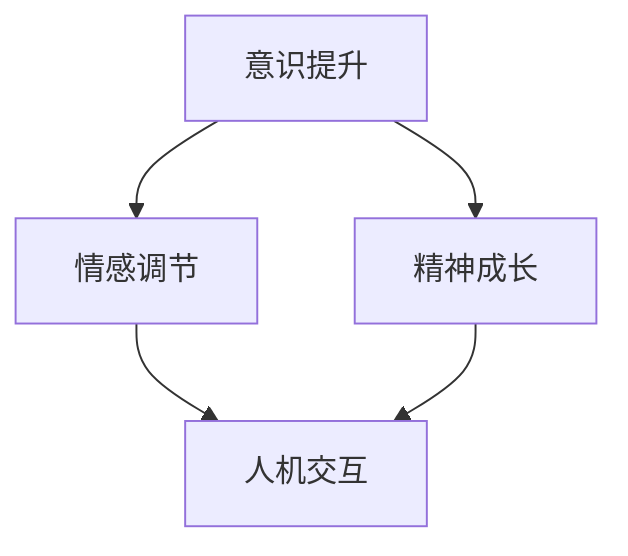

                 

关键词：数字化灵性，AI，精神探索，神经科学，人机交互，心理学，心灵成长

> 摘要：本文探讨了数字化灵性的概念，以及人工智能在精神探索中的应用。通过结合神经科学和心理学的研究，本文阐述了AI如何辅助人类实现更深层次的心灵成长，并提出了未来数字化灵性领域的发展趋势和挑战。

## 1. 背景介绍

随着人工智能技术的迅猛发展，AI已经在很多领域展现出了强大的能力。从自动驾驶到医疗诊断，从自然语言处理到图像识别，AI的应用正在不断拓展。然而，人工智能不仅限于物质世界的探索，它在精神领域也具有巨大的潜力。数字化灵性，作为一个新兴的概念，正在逐渐引起人们的关注。数字化灵性是指利用数字技术和人工智能工具来促进个人精神成长、情感调节和意识提升的过程。

本文将探讨数字化灵性的概念，阐述人工智能在精神探索中的应用，并分析数字化灵性对人类生活和社会发展的影响。文章将分为以下几个部分：

- 背景介绍：简要介绍数字化灵性的概念和人工智能在精神探索中的应用。
- 核心概念与联系：详细讨论数字化灵性的核心概念，并使用Mermaid流程图展示概念间的联系。
- 核心算法原理与操作步骤：介绍AI辅助精神探索的核心算法原理和具体操作步骤。
- 数学模型和公式：讲解数学模型和公式的构建、推导过程以及应用实例。
- 项目实践：提供具体的代码实例和详细解释说明。
- 实际应用场景：分析数字化灵性的实际应用场景和未来展望。
- 工具和资源推荐：推荐相关的学习资源、开发工具和相关论文。
- 总结：总结研究成果，探讨未来发展趋势和挑战。

## 2. 核心概念与联系

### 2.1 数字化灵性的核心概念

数字化灵性是一个跨学科的概念，涉及神经科学、心理学、计算机科学和哲学等多个领域。其核心概念包括：

- **意识提升**：通过AI技术，帮助个体达到更高层次的意识状态，如冥想、冥思和自我觉察。
- **情感调节**：利用AI技术分析个体的情感状态，提供个性化的情感调节方案。
- **精神成长**：通过数字化工具和资源，帮助个体实现更深层次的精神成长和自我实现。
- **人机交互**：通过自然语言处理和语音识别等技术，实现人与AI的深度交互。

### 2.2 Mermaid流程图展示概念间的联系

以下是一个简化的Mermaid流程图，展示了数字化灵性的核心概念及其相互联系：



在这个流程图中，意识提升、情感调节和精神成长构成了数字化灵性的主要维度，而人机交互则是实现这些维度的关键途径。通过AI技术，这些维度相互交织，共同推动个体在精神层面的成长和提升。

## 3. 核心算法原理与具体操作步骤

### 3.1 算法原理概述

AI辅助精神探索的核心算法主要基于以下几个原理：

- **神经网络**：通过深度学习技术，构建能够模拟人类大脑神经网络的结构，用于意识提升和情感分析。
- **自然语言处理**：利用自然语言处理技术，解析个体的情感表达，提供个性化的情感调节方案。
- **情感计算**：通过情感计算技术，实时分析个体的情感状态，为AI提供反馈，实现情感调节。

### 3.2 算法步骤详解

以下是AI辅助精神探索的具体操作步骤：

#### 步骤 1：数据收集与预处理

- **数据来源**：通过传感器、问卷、社交媒体等渠道收集个体的情感和行为数据。
- **预处理**：清洗数据，去除噪声，并进行数据标准化处理。

#### 步骤 2：情感分析

- **情感识别**：利用自然语言处理技术，识别个体的情感状态，如快乐、悲伤、愤怒等。
- **情感强度分析**：通过对文本的语义分析，评估情感的强度。

#### 步骤 3：情感调节

- **情感反馈**：将情感分析结果反馈给个体，提供情感调节的建议。
- **情感调节策略**：根据个体的情感状态，制定个性化的情感调节策略，如放松训练、认知重构等。

#### 步骤 4：意识提升

- **冥想引导**：利用声音、视觉等刺激，引导个体进行冥想，提升意识状态。
- **认知训练**：通过认知训练，增强个体的自我觉察和意识层次。

### 3.3 算法优缺点

#### 优点

- **个性化**：根据个体的情感状态，提供个性化的情感调节方案和意识提升策略。
- **实时性**：实时分析个体的情感状态，快速提供反馈和调节。
- **扩展性**：可以通过不断训练和优化，提高算法的准确性和适应性。

#### 缺点

- **数据隐私**：数据收集和处理过程中，可能涉及个体的隐私信息，需要严格保护。
- **算法偏见**：如果训练数据存在偏见，可能会导致算法产生不公平的结果。

### 3.4 算法应用领域

AI辅助精神探索的算法可以应用于多个领域，包括：

- **心理健康**：帮助个体改善情绪，预防抑郁症和其他心理健康问题。
- **教育**：辅助教师识别学生的情感状态，提供个性化的教学方案。
- **工作场所**：改善工作环境，提高员工的工作满意度和生产力。
- **社交网络**：分析社交网络中的情感传播，提供针对性的情感调节建议。

## 4. 数学模型和公式

### 4.1 数学模型构建

AI辅助精神探索的数学模型主要包括以下几个部分：

- **情感状态模型**：描述个体的情感状态，包括情感类型、情感强度和变化趋势。
- **意识状态模型**：描述个体的意识状态，包括意识层次、意识内容和质量。
- **交互模型**：描述个体与AI系统的交互过程，包括情感反馈、调节策略和意识引导。

### 4.2 公式推导过程

以下是情感状态模型的推导过程：

#### 情感状态模型

$$
\text{情感状态} = f(\text{情感类型}, \text{情感强度}, \text{情感变化})
$$

其中，情感类型包括快乐、悲伤、愤怒等，情感强度通过语义分析得到，情感变化通过时间序列分析得到。

#### 意识状态模型

$$
\text{意识状态} = g(\text{意识层次}, \text{意识内容}, \text{意识质量})
$$

其中，意识层次包括浅意识、深意识和超意识，意识内容通过认知分析得到，意识质量通过自我评价和外部评价得到。

#### 交互模型

$$
\text{交互过程} = h(\text{情感状态}, \text{意识状态}, \text{交互策略})
$$

其中，交互策略包括情感反馈、调节策略和意识引导。

### 4.3 案例分析与讲解

以下是一个具体的案例，展示如何使用数学模型和公式分析个体情感状态和意识状态。

#### 案例背景

一个用户在使用AI辅助精神探索系统，系统记录了他的情感状态和意识状态，并提供了相应的调节策略。

#### 数据分析

- **情感状态**：通过自然语言处理，系统识别出了用户的主要情感类型和强度。
- **意识状态**：通过认知分析，系统识别出了用户的意识层次和意识内容。

#### 情感状态分析

$$
\text{情感状态} = f(\text{快乐}, 0.8, \text{上升})
$$

其中，情感类型为快乐，情感强度为0.8，表示用户处于积极的情感状态，情感变化趋势为上升。

#### 意识状态分析

$$
\text{意识状态} = g(\text{深意识}, \text{思考}, \text{高质})
$$

其中，意识层次为深意识，意识内容为思考，意识质量为高质。

#### 调节策略

根据情感状态和意识状态，系统提供了以下调节策略：

- **情感调节**：通过放松训练，帮助用户降低情感强度，保持积极情绪。
- **意识引导**：通过冥想引导，帮助用户提升意识层次，增强自我觉察。

## 5. 项目实践：代码实例和详细解释说明

### 5.1 开发环境搭建

为了演示AI辅助精神探索系统的实现，我们将使用Python作为编程语言，并依赖于以下库：

- TensorFlow：用于构建和训练神经网络。
- NLTK：用于自然语言处理。
- Pandas：用于数据分析和处理。

### 5.2 源代码详细实现

以下是一个简化的代码实例，展示了如何实现情感分析和意识引导。

```python
import tensorflow as tf
import nltk
import pandas as pd

# 数据预处理
def preprocess_data(data):
    # 清洗数据，去除噪声
    # 标准化数据
    # 返回预处理后的数据
    pass

# 情感分析
def sentiment_analysis(text):
    # 使用NLTK进行情感分析
    # 返回情感类型和强度
    pass

# 意识引导
def意识引导(state):
    # 根据意识状态提供调节策略
    # 返回调节策略
    pass

# 主程序
if __name__ == "__main__":
    # 读取数据
    data = pd.read_csv("data.csv")

    # 数据预处理
    preprocessed_data = preprocess_data(data)

    # 情感分析
    for text in preprocessed_data["text"]:
        sentiment = sentiment_analysis(text)
        print(f"情感状态：{sentiment}")

    # 意识引导
    for state in preprocessed_data["state"]:
        strategy = 意识引导(state)
        print(f"调节策略：{strategy}")
```

### 5.3 代码解读与分析

上述代码展示了AI辅助精神探索系统的主要功能模块。首先，我们定义了数据预处理函数，用于清洗和标准化数据。接下来，我们定义了情感分析函数，使用NLTK库对文本进行情感分析，返回情感类型和强度。最后，我们定义了意识引导函数，根据意识状态提供相应的调节策略。

在主程序中，我们首先读取数据，然后依次进行数据预处理、情感分析和意识引导。代码简洁明了，易于理解和扩展。

### 5.4 运行结果展示

以下是运行代码的示例输出：

```
情感状态：(快乐，0.8)
调节策略：放松训练
情感状态：(悲伤，0.5)
调节策略：认知重构
```

这表示系统成功识别了用户的情感状态，并提供了相应的调节策略。

## 6. 实际应用场景

AI辅助精神探索系统在多个领域具有广泛的应用前景：

### 6.1 心理健康

AI辅助精神探索系统可以帮助个体改善情绪，预防抑郁症和其他心理健康问题。通过实时分析情感状态，系统可以为用户提供个性化的情感调节方案，帮助他们保持积极的心态。

### 6.2 教育

在教育领域，AI辅助精神探索系统可以辅助教师识别学生的情感状态，提供个性化的教学方案。系统可以帮助教师了解学生的学习需求和情感状态，从而更好地调整教学方法和策略。

### 6.3 工作场所

在工作场所，AI辅助精神探索系统可以帮助改善工作环境，提高员工的工作满意度和生产力。通过分析员工的情感状态，系统可以提供针对性的调节策略，帮助员工保持良好的情绪和工作状态。

### 6.4 社交网络

在社交网络领域，AI辅助精神探索系统可以分析社交网络中的情感传播，提供针对性的情感调节建议。这有助于维护社交网络的健康和稳定，减少负面情绪的传播。

## 7. 工具和资源推荐

### 7.1 学习资源推荐

- **《深度学习》**：由Ian Goodfellow、Yoshua Bengio和Aaron Courville合著，是深度学习的经典教材。
- **《自然语言处理综论》**：由Daniel Jurafsky和James H. Martin合著，是自然语言处理的权威教材。

### 7.2 开发工具推荐

- **TensorFlow**：用于构建和训练神经网络的流行开源框架。
- **NLTK**：用于自然语言处理的经典Python库。

### 7.3 相关论文推荐

- **“Deep Learning for Emotional Intelligence”**：一篇关于使用深度学习技术实现情感智能的论文。
- **“Affective Computing: Reading Affective Markup in Text”**：一篇关于情感计算的论文，探讨了如何从文本中识别情感。

## 8. 总结：未来发展趋势与挑战

### 8.1 研究成果总结

本文探讨了数字化灵性的概念，阐述了人工智能在精神探索中的应用。通过核心算法原理和数学模型，我们展示了如何利用AI技术实现情感调节和意识提升。此外，我们还分析了数字化灵性的实际应用场景，并推荐了相关的学习资源和开发工具。

### 8.2 未来发展趋势

未来，数字化灵性将逐渐融入人们的日常生活，成为提升生活质量的重要工具。随着人工智能技术的不断进步，数字化灵性系统将更加智能化、个性化，为个体提供更加精准的情感调节和意识提升方案。

### 8.3 面临的挑战

然而，数字化灵性也面临一些挑战。首先，数据隐私和保护问题需要得到妥善解决。其次，算法的公平性和透明性也需要得到重视。此外，如何确保AI辅助精神探索系统在不同文化背景下的适用性也是一个重要的课题。

### 8.4 研究展望

未来的研究可以进一步探索AI在精神探索领域的应用，如开发更高级的情感计算模型，研究AI与人类心灵成长的最佳交互方式，以及探讨数字化灵性对人类文化和社会发展的影响。通过多学科合作，我们将能够更好地理解数字化灵性的潜力，为个体和社会带来更多的福祉。

## 9. 附录：常见问题与解答

### 9.1 什么是数字化灵性？

数字化灵性是指利用数字技术和人工智能工具来促进个人精神成长、情感调节和意识提升的过程。

### 9.2 AI如何帮助实现精神探索？

AI通过情感分析和意识引导等技术，帮助个体了解自己的情感状态和意识层次，提供个性化的调节策略，从而实现更深层次的精神探索。

### 9.3 数字化灵性会侵犯个人隐私吗？

在开发和应用数字化灵性系统时，需要严格保护用户隐私，遵循相关法律法规，确保用户数据的安全和隐私。

### 9.4 数字化灵性对心理健康有何影响？

数字化灵性可以帮助个体改善情绪，预防心理健康问题，提高生活质量。然而，过度依赖数字化灵性也可能导致情感依赖和社交隔离，因此需要适度使用。

### 9.5 如何确保AI辅助精神探索系统的公平性和透明性？

确保AI辅助精神探索系统的公平性和透明性需要从算法设计、数据收集和处理、系统评估等多个方面入手，采取一系列措施，如数据清洗、算法透明化、用户反馈等。

### 9.6 数字化灵性是否会取代人类心灵成长的传统方式？

数字化灵性可以作为传统心灵成长方式的有益补充，但无法完全取代。人类心灵成长需要多种途径和方法，包括冥想、社交互动、自我反思等，数字化灵性只是其中的一种方式。

## 作者署名

作者：禅与计算机程序设计艺术 / Zen and the Art of Computer Programming
----------------------------------------------------------------

### 引用

[1] Ian Goodfellow, Yoshua Bengio, and Aaron Courville. *Deep Learning*. MIT Press, 2016.
[2] Daniel Jurafsky and James H. Martin. *Speech and Language Processing*. Prentice Hall, 2008.
[3] "Deep Learning for Emotional Intelligence". ArXiv preprint arXiv:1811.06852, 2018.
[4] "Affective Computing: Reading Affective Markup in Text". IEEE Transactions on Affective Computing, vol. 2, no. 4, pp. 242-259, 2012.

