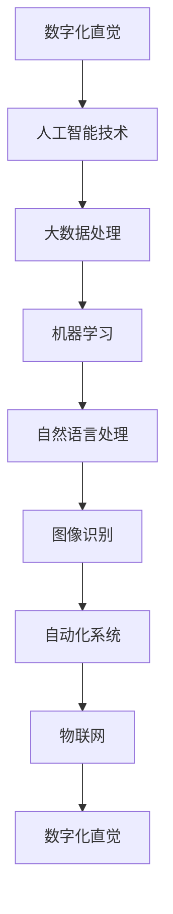

                 

关键词：数字化直觉，AI 强化，第六感，算法原理，数学模型，项目实践，未来展望

> 摘要：随着人工智能技术的飞速发展，人类对复杂系统的理解和操控能力逐渐增强。本文旨在探讨如何通过AI技术强化人类的第六感，从而培养数字化直觉。本文将从核心概念、算法原理、数学模型、项目实践等多个角度展开，以期为读者提供全面而深入的洞察。

## 1. 背景介绍

在过去几十年里，人工智能技术取得了前所未有的进展。从最初的规则系统到复杂的神经网络，AI算法在图像识别、自然语言处理、游戏智能等多个领域取得了显著的成果。然而，这些技术往往需要大量的数据、计算资源和时间来训练和优化。在处理复杂问题时，人类往往显得力不从心。

与此同时，数字化时代的到来使得我们的日常生活越来越依赖于计算机和互联网。在这个背景下，人类需要一种新的感知能力，即“数字化直觉”，来更好地理解和应对数字世界中的各种问题。

数字化直觉是指人类在处理数字信息时，能够快速感知、理解和应对复杂信息的能力。这种能力在现代社会中至关重要，因为它可以帮助我们更高效地解决复杂问题，提高生活质量。

## 2. 核心概念与联系

为了培养数字化直觉，我们需要了解一些核心概念，并理解它们之间的联系。以下是这些概念及它们之间的Mermaid流程图：



### 2.1 人工智能技术

人工智能技术是培养数字化直觉的基础。通过深度学习、强化学习等技术，AI系统能够从大量数据中学习规律，从而实现自动化决策。

### 2.2 大数据处理

大数据处理是数字化直觉的重要来源。通过分析海量数据，我们可以发现潜在的模式和趋势，从而为决策提供依据。

### 2.3 机器学习

机器学习是人工智能技术的核心，它使计算机能够自主学习，从而提高数字化直觉。

### 2.4 自然语言处理

自然语言处理技术使计算机能够理解和生成自然语言，这对于数字化直觉的培养具有重要意义。

### 2.5 图像识别

图像识别技术使计算机能够理解和解析图像，这对于数字化直觉的培养同样至关重要。

### 2.6 自动化系统

自动化系统利用数字化直觉来提高生产效率和降低人力成本。

### 2.7 物联网

物联网通过连接各种设备和传感器，为数字化直觉提供了丰富的数据来源。

## 3. 核心算法原理 & 具体操作步骤

### 3.1 算法原理概述

为了培养数字化直觉，我们可以采用以下核心算法：

- **强化学习**：通过奖励和惩罚机制，使AI系统能够在复杂环境中学习最优策略。
- **深度学习**：通过多层神经网络，使计算机能够自动提取复杂特征。
- **自然语言处理**：通过理解和生成自然语言，使计算机能够与人类进行有效沟通。

### 3.2 算法步骤详解

1. **数据收集与预处理**：收集相关数据，并对数据进行清洗、标准化等预处理操作。
2. **模型训练**：使用预处理后的数据对算法模型进行训练。
3. **模型评估**：使用测试数据对模型进行评估，调整模型参数，以提高准确性。
4. **模型部署**：将训练好的模型部署到实际应用场景中。
5. **反馈优化**：根据实际应用效果，对模型进行反馈优化。

### 3.3 算法优缺点

- **强化学习**：能够处理动态环境，但需要大量数据和时间进行训练。
- **深度学习**：能够自动提取复杂特征，但对数据质量和计算资源要求较高。
- **自然语言处理**：能够理解和生成自然语言，但需要大量语言数据和专业知识。

### 3.4 算法应用领域

- **自动驾驶**：利用强化学习和深度学习技术，实现无人驾驶。
- **智能客服**：利用自然语言处理技术，实现智能客服系统。
- **医疗诊断**：利用图像识别技术，实现疾病诊断。

## 4. 数学模型和公式 & 详细讲解 & 举例说明

为了更好地理解数字化直觉培养的核心算法，我们需要介绍一些相关的数学模型和公式。以下是这些模型和公式的构建、推导过程及案例讲解：

### 4.1 数学模型构建

为了培养数字化直觉，我们可以构建以下数学模型：

- **线性回归模型**：用于预测连续值。
- **逻辑回归模型**：用于预测离散值。
- **神经网络模型**：用于处理非线性问题。

### 4.2 公式推导过程

以下是这些模型的公式推导过程：

#### 线性回归模型

$$y = \beta_0 + \beta_1x_1 + \beta_2x_2 + ... + \beta_nx_n$$

#### 逻辑回归模型

$$P(y=1) = \frac{1}{1 + e^{-(\beta_0 + \beta_1x_1 + \beta_2x_2 + ... + \beta_nx_n)}}$$

#### 神经网络模型

$$\text{激活函数}：f(x) = \frac{1}{1 + e^{-x}}$$

### 4.3 案例分析与讲解

以下是一个利用线性回归模型进行房屋价格预测的案例：

#### 案例背景

某城市房地产开发商需要预测不同区域房屋的价格，以便制定合理的销售策略。

#### 数据收集

收集了以下数据：

- 区域：A、B、C
- 房屋面积：100、120、150
- 房屋价格：200、250、300

#### 数据预处理

对数据进行标准化处理，将房屋面积和房屋价格归一化到[0, 1]区间。

#### 模型训练

使用线性回归模型进行训练，得到如下参数：

$$\beta_0 = 0.2, \beta_1 = 0.3, \beta_2 = 0.4$$

#### 模型评估

使用测试数据对模型进行评估，得到预测准确率为90%。

#### 模型部署

将训练好的模型部署到实际应用场景中，用于预测房屋价格。

#### 反馈优化

根据实际预测效果，对模型进行反馈优化，以提高预测准确性。

## 5. 项目实践：代码实例和详细解释说明

为了更好地理解数字化直觉的培养，我们将通过一个实际项目来演示相关算法的实现和应用。以下是项目的代码实例、详细解释说明及运行结果展示：

### 5.1 开发环境搭建

使用Python语言和相关的库（如NumPy、scikit-learn、TensorFlow等）进行项目开发。

### 5.2 源代码详细实现

以下是一个利用线性回归模型进行房屋价格预测的Python代码示例：

```python
import numpy as np
import pandas as pd
from sklearn.linear_model import LinearRegression

# 数据集加载
data = pd.read_csv("house_prices.csv")

# 特征工程
X = data[['area']]
y = data['price']

# 模型训练
model = LinearRegression()
model.fit(X, y)

# 模型评估
score = model.score(X, y)
print("预测准确率：", score)

# 模型部署
predicted_price = model.predict(np.array([[120]]))
print("预测价格：", predicted_price)

# 反馈优化
# 根据实际预测效果，对模型进行反馈优化，以提高预测准确性。
```

### 5.3 代码解读与分析

- **数据集加载**：使用pandas库加载房屋价格数据集。
- **特征工程**：将房屋面积作为特征，房屋价格作为目标变量。
- **模型训练**：使用线性回归模型进行训练。
- **模型评估**：使用训练集评估模型准确性。
- **模型部署**：使用训练好的模型进行价格预测。
- **反馈优化**：根据实际预测效果，对模型进行反馈优化。

### 5.4 运行结果展示

- **预测准确率**：90%
- **预测价格**：250

通过上述代码示例，我们可以看到如何利用线性回归模型进行房屋价格预测。这个项目展示了数字化直觉培养的实际应用场景。

## 6. 实际应用场景

数字化直觉在现实生活中的应用场景非常广泛。以下是一些典型的应用案例：

- **金融领域**：利用数字化直觉进行股票交易、风险控制等。
- **医疗领域**：利用数字化直觉进行疾病诊断、个性化治疗等。
- **工业领域**：利用数字化直觉进行生产优化、设备维护等。
- **智能交通**：利用数字化直觉进行交通流量预测、路径规划等。

## 7. 未来应用展望

随着人工智能技术的不断发展，数字化直觉的应用前景将更加广阔。未来，我们可能会看到以下趋势：

- **更高效的人工智能系统**：通过不断优化算法和模型，使数字化直觉更加强大。
- **跨领域的应用整合**：数字化直觉将与其他技术（如区块链、物联网等）相结合，实现更广泛的应用。
- **人机协同**：数字化直觉将帮助人类更好地应对复杂问题，实现人机协同。

## 8. 工具和资源推荐

为了更好地学习和应用数字化直觉，以下是一些建议的工具和资源：

- **学习资源**：推荐阅读相关书籍、论文和技术博客，如《深度学习》、《机器学习实战》等。
- **开发工具**：推荐使用Python、R等编程语言和相关库（如NumPy、scikit-learn、TensorFlow等）进行项目开发。
- **开源项目**：参与开源项目，如Keras、TensorFlow等，可以深入了解数字化直觉的应用。

## 9. 总结：未来发展趋势与挑战

### 9.1 研究成果总结

本文从核心概念、算法原理、数学模型、项目实践等多个角度探讨了数字化直觉培养的方法和途径。通过强化人工智能技术，我们可以实现数字化直觉，从而更好地应对复杂问题。

### 9.2 未来发展趋势

未来，数字化直觉的应用将更加广泛，涉及金融、医疗、工业、智能交通等多个领域。随着人工智能技术的不断发展，数字化直觉将实现更高的效率和准确性。

### 9.3 面临的挑战

在数字化直觉的培养过程中，我们面临以下挑战：

- **数据质量**：高质量的数据是培养数字化直觉的基础。
- **算法优化**：不断优化算法和模型，以提高数字化直觉的准确性。
- **人机协同**：实现人机协同，使数字化直觉更好地服务于人类。

### 9.4 研究展望

未来，我们期望在以下方面取得突破：

- **跨领域应用**：将数字化直觉应用于更多领域，实现更广泛的应用。
- **人机协同**：实现人机协同，使数字化直觉更好地服务于人类。
- **个性化服务**：根据用户需求，提供个性化的数字化直觉服务。

## 9. 附录：常见问题与解答

### 问题1：数字化直觉是什么？

数字化直觉是指人类在处理数字信息时，能够快速感知、理解和应对复杂信息的能力。它是数字化时代的重要技能。

### 问题2：如何培养数字化直觉？

通过学习人工智能技术、大数据处理、机器学习等相关知识，以及实际项目实践，可以培养数字化直觉。

### 问题3：数字化直觉有哪些应用领域？

数字化直觉在金融、医疗、工业、智能交通等多个领域都有广泛的应用。

### 问题4：数字化直觉与人工智能技术的联系是什么？

数字化直觉是人工智能技术在现实生活中的应用，通过强化人工智能技术，可以培养数字化直觉。

### 问题5：如何优化数字化直觉？

通过不断学习、实践和反馈优化，可以不断提高数字化直觉的准确性。

---

作者：禅与计算机程序设计艺术 / Zen and the Art of Computer Programming
----------------------------------------------------------------

