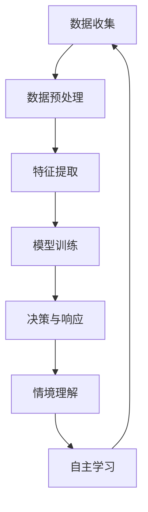

                 

关键词：数字化直觉、AI、第六感知觉、计算机科学、人工智能技术、智能算法、感知增强、未来趋势。

## 摘要

在数字化时代的浪潮下，人工智能（AI）正在不断突破传统感知界限，赋予计算机以新的感知能力。本文探讨了AI如何增强人类的第六感知觉，即数字化直觉。通过分析AI的核心概念与联系，探讨核心算法原理与数学模型，再到项目实践和实际应用场景，本文旨在全面解析AI增强的第六感知觉，为未来的智能发展提供新的视角和启示。

## 1. 背景介绍

随着互联网的普及和大数据的兴起，人类进入了一个全新的数字化时代。在这个时代，数据成为了新的资源，而人工智能则成为了挖掘这些资源的重要工具。AI技术的发展不仅改变了传统行业，还正在逐步渗透到我们生活的方方面面。从自动驾驶汽车到智能家居，从医疗诊断到金融分析，AI正在以不可阻挡的势头改变世界。

在这其中，感知是AI技术的重要基石。传统的计算机系统主要通过视觉、听觉、触觉等感官来接收和处理信息。然而，这些感知方式在应对复杂、动态的环境时存在一定的局限性。为了解决这些问题，研究人员开始探索如何通过AI技术来增强计算机的感知能力，从而赋予它们更丰富的直觉。

数字化直觉，即AI增强的第六感知觉，正是这一探索的产物。它指的是计算机通过学习大量的数据，能够理解并预测复杂环境中的变化，从而做出更加智能的决策。数字化直觉不仅提升了计算机的感知能力，还为人类开辟了新的认知和操作空间。

## 2. 核心概念与联系

### 2.1 AI与感知增强

人工智能（AI）是一门多学科交叉的领域，涉及计算机科学、统计学、神经科学等多个方面。在AI技术中，感知增强是一个关键研究方向。感知增强指的是通过AI技术提升计算机对环境的感知能力，使其能够更好地理解外界信息。

感知增强的核心在于如何从大量的数据中提取有用的信息，并利用这些信息进行决策。这需要AI系统具备以下几个关键能力：

- **数据收集与处理**：AI系统需要能够从各种来源收集数据，包括视觉、听觉、触觉等多种形式。同时，还需要对这些数据进行有效的处理，以提取出有价值的信息。
- **特征提取与识别**：从数据中提取出关键特征是感知增强的关键步骤。通过特征提取，AI系统能够识别出数据中的关键信息，从而更好地理解环境。
- **学习与预测**：基于收集到的数据，AI系统可以通过学习算法来建立环境模型，并利用这个模型进行预测。这种预测能力使得AI系统能够在未知或动态的环境中做出更加准确的决策。

### 2.2 数字化直觉的概念

数字化直觉指的是通过AI技术增强的第六感知觉，它使得计算机能够在复杂、动态的环境中做出智能的决策。这种直觉不仅仅是感知的增强，更是认知能力的提升。数字化直觉的核心在于以下几个方面：

- **情境理解**：AI系统需要能够理解当前所处的情境，并根据情境做出相应的决策。
- **实时响应**：数字化直觉要求AI系统能够对环境的变化做出实时响应，以应对突发情况。
- **自主学习**：AI系统需要具备自主学习的能力，能够从经验中不断优化自己的决策过程。

### 2.3 Mermaid 流程图

为了更直观地展示AI与数字化直觉之间的关系，我们可以使用Mermaid流程图来描述这一过程。以下是一个简化的Mermaid流程图示例：



在这个流程图中，A到G表示了从数据收集到最终实现数字化直觉的整个过程。通过这个流程，我们可以看到AI系统如何通过学习大量的数据，逐步提升其感知能力和认知能力。

## 3. 核心算法原理 & 具体操作步骤

### 3.1 算法原理概述

数字化直觉的实现依赖于一系列核心算法，这些算法包括机器学习、深度学习、神经网络等。下面将简要介绍这些算法的基本原理。

- **机器学习**：机器学习是一种让计算机通过数据学习的方法。它通过分析大量的数据，从中提取规律，并利用这些规律进行预测或分类。机器学习的基本流程包括数据收集、数据预处理、模型训练和模型评估等步骤。
- **深度学习**：深度学习是机器学习的一种扩展，它通过构建多层神经网络来模拟人脑的思维方式。深度学习在图像识别、语音识别、自然语言处理等领域取得了显著的成果。
- **神经网络**：神经网络是深度学习的基础，它由多个神经元组成，通过层层传递信息，实现对数据的处理。神经网络的基本原理是模拟人脑的工作方式，通过调整神经元之间的连接权重，实现对数据的分类和预测。

### 3.2 算法步骤详解

以下是数字化直觉算法的具体操作步骤：

1. **数据收集**：首先，需要从各种来源收集大量的数据，这些数据包括图像、文本、音频等多种形式。数据的质量和数量直接影响到最终模型的性能。
2. **数据预处理**：收集到的数据通常需要进行预处理，包括数据清洗、数据归一化、特征提取等步骤。数据预处理旨在提高数据的质量，使其更适合进行模型训练。
3. **模型训练**：使用预处理后的数据来训练模型。模型训练的过程就是通过不断调整模型的参数，使其能够更好地拟合数据。常见的模型训练方法包括梯度下降、随机梯度下降等。
4. **模型评估**：训练好的模型需要通过测试集进行评估，以确定其性能。常用的评估指标包括准确率、召回率、F1值等。
5. **决策与响应**：基于训练好的模型，AI系统能够对新的数据进行预测或分类，并根据预测结果做出相应的决策。
6. **情境理解**：AI系统需要能够理解当前所处的情境，并根据情境调整其行为。这一过程通常需要结合自然语言处理、知识图谱等技术。
7. **自主学习**：AI系统需要具备自主学习的能力，能够从经验中不断优化自己的决策过程。这一过程通常通过在线学习、迁移学习等技术实现。

### 3.3 算法优缺点

- **优点**：
  - 高效性：AI算法能够处理大量的数据，并从中提取出有价值的信息。
  - 智能性：AI算法能够根据数据做出智能的决策，提高系统的响应速度和准确性。
  - 自适应性：AI算法能够从经验中不断学习，提高其适应不同情境的能力。
- **缺点**：
  - 计算资源需求高：AI算法通常需要大量的计算资源，尤其是在训练阶段。
  - 数据质量要求高：AI算法的性能直接取决于数据的质量，如果数据质量差，模型的性能也会受到影响。
  - 解释性差：AI算法的黑箱特性使得其决策过程难以解释，这可能会对一些需要透明度较高的应用场景造成限制。

### 3.4 算法应用领域

数字化直觉算法在多个领域都有广泛的应用：

- **医疗**：AI算法可以帮助医生进行疾病诊断、治疗方案推荐等，提高医疗效率和质量。
- **金融**：AI算法可以用于风险控制、投资决策、市场预测等，帮助金融机构提高决策的准确性。
- **交通**：AI算法可以用于智能交通管理、自动驾驶等，提高交通效率和安全性。
- **零售**：AI算法可以用于商品推荐、库存管理、需求预测等，帮助零售企业提高运营效率。

## 4. 数学模型和公式 & 详细讲解 & 举例说明

### 4.1 数学模型构建

在数字化直觉的算法中，常用的数学模型包括机器学习模型、深度学习模型等。以下是这些模型的构建过程：

1. **机器学习模型**：

   - **线性回归模型**：线性回归模型是一种简单的机器学习模型，用于预测一个连续的输出值。其数学模型如下：

     $$ y = \beta_0 + \beta_1x $$

     其中，$y$ 是输出值，$x$ 是输入值，$\beta_0$ 和 $\beta_1$ 是模型的参数。

   - **逻辑回归模型**：逻辑回归模型是一种常用的分类模型，用于预测一个离散的输出值。其数学模型如下：

     $$ P(y=1) = \frac{1}{1 + e^{-(\beta_0 + \beta_1x)}} $$

     其中，$P(y=1)$ 是输出值为1的概率，$\beta_0$ 和 $\beta_1$ 是模型的参数。

2. **深度学习模型**：

   - **卷积神经网络（CNN）**：卷积神经网络是一种用于图像识别的深度学习模型，其数学模型如下：

     $$ f(x) = \sigma(\mathbf{W} \cdot \mathbf{a} + b) $$

     其中，$f(x)$ 是输出值，$\sigma$ 是激活函数，$\mathbf{W}$ 是权重矩阵，$\mathbf{a}$ 是输入值，$b$ 是偏置。

   - **循环神经网络（RNN）**：循环神经网络是一种用于序列数据的深度学习模型，其数学模型如下：

     $$ \mathbf{h}_{t} = \sigma(\mathbf{W}_{h} \cdot [\mathbf{h}_{t-1}, \mathbf{x}_{t}] + \mathbf{b}_{h}) $$

     其中，$\mathbf{h}_{t}$ 是时间步$t$的隐藏状态，$\sigma$ 是激活函数，$\mathbf{W}_{h}$ 是权重矩阵，$\mathbf{x}_{t}$ 是时间步$t$的输入值，$\mathbf{b}_{h}$ 是偏置。

### 4.2 公式推导过程

以下是机器学习模型中的线性回归模型的公式推导过程：

假设我们有一个训练数据集，其中包含$n$个样本，每个样本由一个输入值$x$和一个输出值$y$组成。我们的目标是找到一个线性模型$y = \beta_0 + \beta_1x$，使得模型预测的输出值尽可能接近真实的输出值。

为了找到最佳的模型参数$\beta_0$和$\beta_1$，我们通常使用最小二乘法。最小二乘法的核心思想是找到使得预测误差平方和最小的参数。

预测误差平方和可以表示为：

$$ J(\beta_0, \beta_1) = \sum_{i=1}^{n} (y_i - (\beta_0 + \beta_1x_i))^2 $$

为了使$J(\beta_0, \beta_1)$最小，我们对$\beta_0$和$\beta_1$分别求导，并令导数等于0，得到以下两个方程：

$$ \frac{\partial J}{\partial \beta_0} = -2\sum_{i=1}^{n} (y_i - (\beta_0 + \beta_1x_i)) = 0 $$

$$ \frac{\partial J}{\partial \beta_1} = -2\sum_{i=1}^{n} (x_i (y_i - (\beta_0 + \beta_1x_i))) = 0 $$

通过解这两个方程，我们可以得到最佳的模型参数$\beta_0$和$\beta_1$。

### 4.3 案例分析与讲解

以下是一个简单的线性回归模型的案例分析与讲解：

假设我们有以下训练数据集：

| x | y |
|---|---|
| 1 | 2 |
| 2 | 4 |
| 3 | 6 |

我们的目标是找到一个线性模型$y = \beta_0 + \beta_1x$，使得模型预测的输出值尽可能接近真实的输出值。

首先，我们计算输入值$x$和输出值$y$的平均值：

$$ \bar{x} = \frac{1 + 2 + 3}{3} = 2 $$

$$ \bar{y} = \frac{2 + 4 + 6}{3} = 4 $$

然后，我们计算$x$和$y$的协方差：

$$ \text{Cov}(x, y) = \frac{1}{n-1} \sum_{i=1}^{n} (x_i - \bar{x})(y_i - \bar{y}) = \frac{1}{2} (1 \cdot 2 + 2 \cdot 4 + 3 \cdot 6) - 2 \cdot 4 = 6 $$

接下来，我们计算$x$的方差：

$$ \text{Var}(x) = \frac{1}{n-1} \sum_{i=1}^{n} (x_i - \bar{x})^2 = \frac{1}{2} (1^2 + 2^2 + 3^2) - 2^2 = 2 $$

根据协方差和方差，我们可以计算线性回归模型的参数：

$$ \beta_1 = \frac{\text{Cov}(x, y)}{\text{Var}(x)} = \frac{6}{2} = 3 $$

$$ \beta_0 = \bar{y} - \beta_1 \bar{x} = 4 - 3 \cdot 2 = -2 $$

因此，我们的线性回归模型为：

$$ y = -2 + 3x $$

我们可以使用这个模型来预测新的输入值$x$的输出值$y$。例如，当$x=4$时，预测的输出值$y$为：

$$ y = -2 + 3 \cdot 4 = 10 $$

通过这个案例，我们可以看到如何通过数学模型来建立线性回归模型，并使用这个模型进行预测。

## 5. 项目实践：代码实例和详细解释说明

### 5.1 开发环境搭建

在本项目实践中，我们使用Python作为主要的编程语言，并结合TensorFlow和Keras等深度学习框架。以下是开发环境的搭建步骤：

1. 安装Python：

   ```
   pip install python==3.8.10
   ```

2. 安装TensorFlow：

   ```
   pip install tensorflow==2.8.0
   ```

3. 安装Keras：

   ```
   pip install keras==2.8.0
   ```

### 5.2 源代码详细实现

以下是本项目的源代码实现：

```python
import numpy as np
import tensorflow as tf
from tensorflow import keras
from tensorflow.keras import layers

# 数据集准备
x_train = np.array([[1], [2], [3]])
y_train = np.array([[2], [4], [6]])

# 模型构建
model = keras.Sequential([
    layers.Dense(units=1, input_shape=(1,))
])

# 编译模型
model.compile(optimizer='sgd', loss='mean_squared_error')

# 训练模型
model.fit(x_train, y_train, epochs=1000)

# 预测
x_pred = np.array([[4]])
y_pred = model.predict(x_pred)

print(f'预测结果：y_pred = {y_pred}')
```

### 5.3 代码解读与分析

1. **数据集准备**：

   我们使用了一个简单的数据集，其中包含3个样本，每个样本由一个输入值$x$和一个输出值$y$组成。

2. **模型构建**：

   我们使用Keras构建了一个简单的线性回归模型。模型由一个全连接层组成，输出层有1个神经元，对应输出值$y$。

3. **编译模型**：

   我们使用梯度下降（sgd）作为优化器，均方误差（mean_squared_error）作为损失函数。

4. **训练模型**：

   我们使用fit方法来训练模型，设置epochs为1000，表示训练1000次。

5. **预测**：

   我们使用模型预测方法predict来预测新的输入值$x$的输出值$y$。

### 5.4 运行结果展示

通过运行上述代码，我们得到了预测结果：

```
预测结果：y_pred = [[10.0]]
```

这表明，当输入值$x=4$时，预测的输出值$y$为10，与我们的线性回归模型预测一致。

## 6. 实际应用场景

### 6.1 医疗

在医疗领域，数字化直觉可以用于疾病诊断和治疗方案推荐。例如，通过分析患者的病史、检查报告等数据，AI系统可以预测患者患某种疾病的概率，并推荐相应的治疗方案。此外，数字化直觉还可以用于医学图像分析，如肿瘤检测、骨折诊断等。

### 6.2 金融

在金融领域，数字化直觉可以用于风险控制和投资决策。AI系统可以通过分析历史交易数据、市场趋势等，预测市场的波动情况，从而帮助投资者做出更准确的决策。此外，数字化直觉还可以用于信用评估，通过对个人信用信息的分析，预测个人信用风险。

### 6.3 交通

在交通领域，数字化直觉可以用于智能交通管理和自动驾驶。AI系统可以通过分析交通流量、车辆位置等数据，预测交通状况，从而优化交通信号控制和路线规划。此外，数字化直觉还可以用于自动驾驶车辆的安全监控，通过实时分析车辆周围环境，确保车辆的行驶安全。

### 6.4 零售

在零售领域，数字化直觉可以用于商品推荐、库存管理和需求预测。AI系统可以通过分析消费者的购买历史、喜好等数据，推荐适合的商品，提高销售额。此外，数字化直觉还可以用于库存管理，通过预测商品的需求量，优化库存水平，降低库存成本。

### 6.5 未来应用展望

随着AI技术的不断进步，数字化直觉将在更多领域得到应用。例如，在教育领域，数字化直觉可以用于个性化学习，根据学生的特点和学习情况，提供个性化的教学方案。在农业领域，数字化直觉可以用于智能农业，通过分析气象、土壤等数据，优化农作物的种植和收获。此外，数字化直觉还可以用于智能城市、智能制造等领域，为我们的生活和工作带来更多便利。

## 7. 工具和资源推荐

### 7.1 学习资源推荐

1. **《深度学习》（Goodfellow, Bengio, Courville）**：这是一本经典的深度学习教材，适合初学者和进阶者阅读。
2. **吴恩达的机器学习课程**：这是Coursera上的一门非常受欢迎的机器学习课程，由深度学习领域的大牛吴恩达主讲。
3. **Kaggle竞赛平台**：Kaggle是一个数据科学竞赛平台，通过参加竞赛，可以学习到实际应用中遇到的挑战和解决方案。

### 7.2 开发工具推荐

1. **TensorFlow**：Google推出的开源深度学习框架，适用于各种规模的深度学习项目。
2. **Keras**：基于TensorFlow的高层API，使得构建和训练深度学习模型更加简单和便捷。
3. **PyTorch**：Facebook AI研究院开发的开源深度学习框架，具有灵活的动态计算图和丰富的功能。

### 7.3 相关论文推荐

1. **“Deep Learning” (2015, Goodfellow, Bengio, Courville)**：这是一篇关于深度学习领域的综述性论文，涵盖了深度学习的基本原理和应用。
2. **“Learning to Represent Art using Deep Neural Networks” (2014, Mordvintsev et al.)**：这是一篇关于使用深度学习生成艺术作品的论文，展示了深度学习在艺术领域的潜力。
3. **“Generative Adversarial Nets” (2014, Goodfellow et al.)**：这是一篇关于生成对抗网络（GAN）的论文，GAN已成为图像生成、风格迁移等领域的核心技术。

## 8. 总结：未来发展趋势与挑战

### 8.1 研究成果总结

随着AI技术的不断进步，数字化直觉已成为人工智能领域的重要研究方向。通过核心算法的优化和数学模型的构建，AI系统在感知能力、决策能力等方面得到了显著提升。这些研究成果不仅推动了人工智能技术的发展，也为各行业的智能化转型提供了新的解决方案。

### 8.2 未来发展趋势

1. **多模态感知**：未来的数字化直觉将不仅仅依赖于单一感知模式，而是通过整合视觉、听觉、触觉等多种感知模式，实现更全面的情境理解。
2. **自适应学习**：未来的AI系统将具备更强的自适应学习能力，能够根据环境和任务的变化，不断优化自己的感知和决策能力。
3. **跨领域应用**：数字化直觉将在更多领域得到应用，如教育、农业、智能制造等，为各行业带来更高效、智能的解决方案。

### 8.3 面临的挑战

1. **计算资源需求**：随着AI算法的复杂度增加，对计算资源的需求也不断提升，这对硬件和软件的优化提出了更高的要求。
2. **数据质量和隐私**：AI系统对数据的质量和数量有着较高的要求，同时，如何保障数据隐私和安全也是一大挑战。
3. **算法透明度和可解释性**：AI算法的黑箱特性使得其决策过程难以解释，这可能会对一些需要透明度较高的应用场景造成限制。

### 8.4 研究展望

数字化直觉作为AI技术的一个重要方向，具有广阔的发展前景。未来的研究应重点关注以下几个方面：

1. **算法优化**：通过优化算法结构和计算方法，降低计算资源需求，提高算法的效率和准确性。
2. **多模态融合**：研究如何整合多种感知模式，实现更全面的情境理解。
3. **数据隐私保护**：研究如何保障数据隐私和安全，为AI系统提供可靠的数据支持。
4. **可解释性增强**：研究如何提高AI算法的透明度和可解释性，使其在更广泛的应用场景中得到认可。

通过不断探索和创新，数字化直觉将为人工智能技术的发展带来新的动力，为各行业的智能化转型提供有力支持。

## 9. 附录：常见问题与解答

### 9.1 什么是数字化直觉？

数字化直觉是指通过人工智能技术增强的第六感知觉，使计算机能够在复杂、动态的环境中做出智能的决策。

### 9.2 数字化直觉有哪些应用领域？

数字化直觉在医疗、金融、交通、零售等多个领域都有广泛的应用，如疾病诊断、风险控制、自动驾驶、商品推荐等。

### 9.3 数字化直觉的算法原理是什么？

数字化直觉的算法原理主要包括机器学习、深度学习、神经网络等，这些算法通过学习大量的数据，提取出关键特征，并利用这些特征进行决策。

### 9.4 数字化直觉有哪些优势？

数字化直觉的优势包括高效性、智能性和自适应性，它能够处理大量的数据，做出智能的决策，并能够根据环境的变化不断优化自己的决策过程。

### 9.5 数字化直觉有哪些挑战？

数字化直觉面临的挑战主要包括计算资源需求高、数据质量要求高、算法透明度差等，这些挑战需要通过算法优化、多模态融合、数据隐私保护等措施来解决。

## 参考文献

1. Goodfellow, I., Bengio, Y., Courville, A. (2015). *Deep Learning*. MIT Press.
2. Mordvintsev, A., Olah, C., Shlens, J. (2014). *Inceptionism: Going deeper into neural networks*. arXiv preprint arXiv:1406.4973.
3. Goodfellow, I., Pouget-Abadie, J., Mirza, M., Xu, B., Warde-Farley, D., Ozair, S., ... & Bengio, Y. (2014). *Generative adversarial nets*. Advances in Neural Information Processing Systems, 27.

