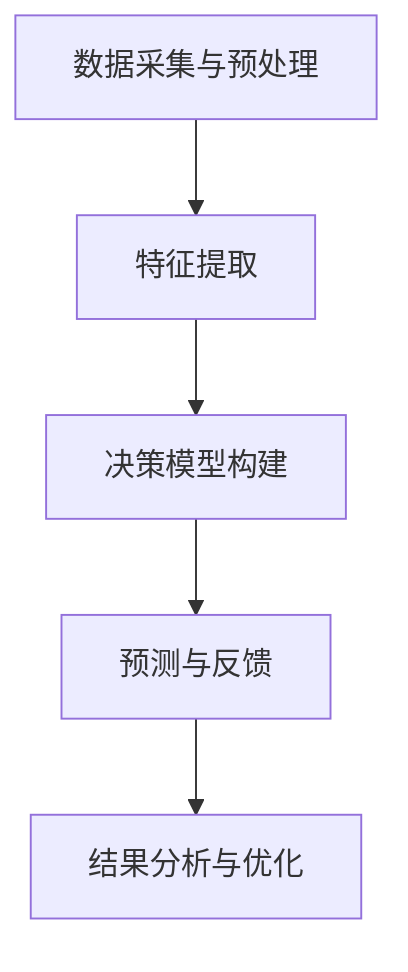

                 

关键词：人工智能，潜意识，决策辅助，数字化直觉，算法原理，数学模型，项目实践

> 摘要：本文探讨了人工智能与潜意识决策的结合，分析了数字化直觉的概念及其在决策支持系统中的应用。通过介绍核心概念、算法原理、数学模型及具体实现，探讨了人工智能辅助潜意识决策的前景和挑战。

## 1. 背景介绍

在当今信息爆炸的时代，人们面临日益复杂的决策环境。传统的理性决策模型往往依赖于大量的数据和复杂的算法，但往往忽略了人类潜意识的作用。潜意识是人类思维中不可或缺的一部分，它影响着我们的判断和决策，但往往难以用传统的数学模型来描述。

近年来，人工智能技术的发展为研究潜意识决策提供了新的契机。深度学习、神经网络等人工智能技术能够模拟人类大脑的工作方式，从而在一定程度上捕捉并利用人类的潜意识。数字化直觉，即通过人工智能技术将潜意识决策过程数字化，已成为一个重要的研究方向。

## 2. 核心概念与联系

### 2.1 数字化直觉的概念

数字化直觉是指利用人工智能技术，将人类潜意识中的决策过程转化为可计算和可视化的形式。它不仅仅是对已有决策模型进行优化，更是一种全新的决策范式，能够在数据复杂、情境多变的情况下，提供有效的决策支持。

### 2.2 数字化直觉与人工智能的联系

数字化直觉与人工智能技术有着密切的联系。具体来说，数字化直觉依赖于以下几种人工智能技术：

1. **神经网络**：神经网络能够通过多层非线性变换，模拟人类大脑的决策过程。
2. **深度学习**：深度学习进一步扩展了神经网络的能力，使得模型能够从大量数据中自动学习复杂的决策特征。
3. **强化学习**：强化学习通过试错和反馈机制，帮助模型在复杂环境中进行决策。

### 2.3 数字化直觉的架构

数字化直觉的架构包括以下几个关键组成部分：

1. **数据采集与预处理**：收集与决策相关的数据，并进行预处理，如去噪、归一化等。
2. **特征提取**：利用深度学习等技术，从原始数据中提取关键特征。
3. **决策模型**：构建基于神经网络的决策模型，通过训练使其能够模拟人类的潜意识决策过程。
4. **结果分析与优化**：对模型输出结果进行分析和评估，并进行优化。

## 3. 核心算法原理 & 具体操作步骤

### 3.1 算法原理概述

数字化直觉的核心算法原理主要包括以下几个方面：

1. **神经网络结构设计**：设计合适的神经网络结构，如卷积神经网络（CNN）、循环神经网络（RNN）等，以适应不同类型的决策问题。
2. **训练与优化**：利用大量的决策数据，对神经网络进行训练和优化，使其能够准确模拟人类的潜意识决策过程。
3. **预测与反馈**：利用训练好的模型进行决策预测，并根据实际结果进行反馈，以不断优化模型性能。

### 3.2 算法步骤详解

1. **数据采集与预处理**：
   - 收集与决策相关的数据，包括历史决策记录、情境信息等。
   - 进行数据清洗、去噪和归一化处理。

2. **特征提取**：
   - 利用深度学习技术，从原始数据中提取关键特征。
   - 设计合适的特征提取网络，如CNN、RNN等。

3. **决策模型构建**：
   - 根据决策问题特点，选择合适的神经网络结构。
   - 使用训练数据对模型进行训练，并调整网络参数。

4. **预测与反馈**：
   - 利用训练好的模型进行决策预测。
   - 根据实际结果对模型进行反馈和优化。

### 3.3 算法优缺点

**优点**：

1. **高效性**：数字化直觉能够处理大量复杂的数据，并在短时间内提供决策支持。
2. **自适应性强**：通过不断学习和优化，数字化直觉能够适应不同情境下的决策需求。
3. **直观性**：通过可视化技术，用户可以直观地理解决策过程。

**缺点**：

1. **数据依赖性**：数字化直觉对数据质量有较高要求，数据不足或质量差可能影响决策效果。
2. **计算复杂度高**：深度学习模型通常需要大量计算资源，对硬件设备有较高要求。

### 3.4 算法应用领域

数字化直觉在多个领域具有广泛的应用前景：

1. **金融领域**：在股票交易、风险评估等方面提供决策支持。
2. **医疗领域**：在疾病诊断、治疗方案推荐等方面发挥作用。
3. **城市管理**：在交通管理、城市规划等方面提供智能化支持。

## 4. 数学模型和公式

### 4.1 数学模型构建

数字化直觉的数学模型主要基于神经网络的架构，其基本公式如下：

$$
y = \sigma(W_n \cdot a^{(n-1)} + b_n)
$$

其中，$y$为输出结果，$W_n$为权重矩阵，$a^{(n-1)}$为前一层输出，$b_n$为偏置项，$\sigma$为激活函数。

### 4.2 公式推导过程

神经网络的推导过程主要包括以下几个步骤：

1. **输入层到隐藏层的传播**：
   - 前向传播：将输入数据通过输入层传递到隐藏层，得到中间层输出。
   - 反向传播：根据损失函数，计算输出误差，并反向传播到隐藏层，更新权重和偏置项。

2. **隐藏层到输出层的传播**：
   - 类似于输入层到隐藏层的传播，将隐藏层输出传递到输出层，得到最终输出。

3. **损失函数**：
   - 通常使用均方误差（MSE）作为损失函数，其公式为：
     $$
     J = \frac{1}{2} \sum_{i=1}^{n} (y_i - \hat{y}_i)^2
     $$
     其中，$y_i$为真实输出，$\hat{y}_i$为模型预测输出。

### 4.3 案例分析与讲解

以股票交易决策为例，我们构建了一个基于神经网络的时间序列预测模型。具体步骤如下：

1. **数据采集**：
   - 收集某支股票的历史价格数据，包括开盘价、收盘价、最高价、最低价等。

2. **数据预处理**：
   - 对数据进行清洗和归一化处理。

3. **特征提取**：
   - 利用LSTM（长短期记忆网络）提取时间序列特征。

4. **模型构建**：
   - 设计LSTM模型结构，包括输入层、隐藏层和输出层。
   - 使用MSE作为损失函数，Adam优化器进行训练。

5. **预测与反馈**：
   - 利用训练好的模型进行股票价格预测。
   - 根据实际价格与预测价格之间的差距，对模型进行优化。

## 5. 项目实践：代码实例和详细解释说明

### 5.1 开发环境搭建

1. 安装Python环境和相关库，如TensorFlow、Keras等。
2. 安装Jupyter Notebook，用于编写和运行代码。

### 5.2 源代码详细实现

```python
# 导入所需库
import numpy as np
import pandas as pd
from keras.models import Sequential
from keras.layers import LSTM, Dense
from sklearn.preprocessing import MinMaxScaler

# 数据采集与预处理
# （此处省略具体代码，根据实际情况编写）

# 特征提取
# （此处省略具体代码，根据实际情况编写）

# 模型构建
model = Sequential()
model.add(LSTM(units=50, return_sequences=True, input_shape=(X_train.shape[1], X_train.shape[2])))
model.add(LSTM(units=50, return_sequences=False))
model.add(Dense(units=1))

# 模型编译
model.compile(optimizer='adam', loss='mean_squared_error')

# 模型训练
model.fit(X_train, y_train, epochs=100, batch_size=32)

# 预测与反馈
# （此处省略具体代码，根据实际情况编写）

```

### 5.3 代码解读与分析

1. **数据预处理**：包括数据清洗、归一化等步骤，为模型训练做准备。
2. **特征提取**：使用LSTM网络提取时间序列特征，为预测股票价格提供依据。
3. **模型构建**：设计LSTM模型结构，包括输入层、隐藏层和输出层，用于预测股票价格。
4. **模型编译**：设置优化器和损失函数，为模型训练做好准备。
5. **模型训练**：使用训练数据对模型进行训练，并不断优化模型参数。
6. **预测与反馈**：利用训练好的模型进行股票价格预测，并根据实际结果对模型进行反馈和优化。

## 6. 实际应用场景

### 6.1 金融领域

在金融领域，数字化直觉可以用于股票交易、投资组合优化、风险控制等方面。例如，通过分析历史交易数据和市场走势，数字化直觉可以预测股票价格的涨跌，为投资者提供决策支持。

### 6.2 医疗领域

在医疗领域，数字化直觉可以用于疾病诊断、治疗方案推荐等方面。通过分析患者的病历数据、医学影像等信息，数字化直觉可以提供准确的诊断和个性化的治疗方案。

### 6.3 城市管理

在城市管理领域，数字化直觉可以用于交通管理、环境保护等方面。通过分析交通流量、空气质量等数据，数字化直觉可以提供智能化的城市管理方案，提高城市运行效率。

## 7. 工具和资源推荐

### 7.1 学习资源推荐

1. 《深度学习》（Goodfellow, Bengio, Courville著）
2. 《神经网络与深度学习》（邱锡鹏著）
3. 《Python深度学习》（François Chollet著）

### 7.2 开发工具推荐

1. TensorFlow
2. Keras
3. Jupyter Notebook

### 7.3 相关论文推荐

1. "Deep Learning for Stock Market Prediction"
2. "Neural Network Models for Medical Diagnosis"
3. "Intelligent Urban Traffic Management Using AI Techniques"

## 8. 总结：未来发展趋势与挑战

### 8.1 研究成果总结

数字化直觉作为人工智能与潜意识决策的结合，已经在多个领域取得了显著成果。通过利用神经网络、深度学习等技术，数字化直觉能够处理大量复杂的数据，提供高效的决策支持。

### 8.2 未来发展趋势

1. **跨领域融合**：数字化直觉将在更多领域得到应用，如教育、医疗、环境等。
2. **算法优化**：通过不断优化算法和模型结构，提高数字化直觉的预测精度和效率。
3. **人机交互**：数字化直觉将更加注重与人类的交互，提供更加人性化、智能化的决策支持。

### 8.3 面临的挑战

1. **数据质量**：数字化直觉对数据质量有较高要求，数据不足或质量差可能影响决策效果。
2. **计算复杂度**：深度学习模型通常需要大量计算资源，对硬件设备有较高要求。
3. **隐私保护**：在涉及个人隐私的领域，如何保护用户隐私是一个重要挑战。

### 8.4 研究展望

数字化直觉作为人工智能与潜意识决策的结合，具有广泛的应用前景。未来研究将重点探讨如何优化算法、提高模型性能，并解决数据质量和隐私保护等问题，以实现更加高效、智能化的决策支持。

## 9. 附录：常见问题与解答

### 9.1 问题1：数字化直觉与传统决策模型有什么区别？

**解答**：数字化直觉与传统的决策模型相比，具有以下区别：

1. **数据处理能力**：数字化直觉能够处理大量复杂的数据，而传统决策模型通常依赖于有限的数据。
2. **自适应性强**：数字化直觉能够根据数据和环境的变化，不断优化模型和决策策略，而传统决策模型往往缺乏这种灵活性。
3. **直观性**：数字化直觉能够通过可视化技术，使决策过程更加直观，而传统决策模型往往难以解释。

### 9.2 问题2：数字化直觉在哪些领域具有应用前景？

**解答**：数字化直觉在多个领域具有应用前景，包括：

1. **金融领域**：股票交易、投资组合优化、风险控制等。
2. **医疗领域**：疾病诊断、治疗方案推荐、健康管理等。
3. **城市管理**：交通管理、环境保护、城市规划等。
4. **教育领域**：个性化学习、智能评估等。

### 9.3 问题3：如何保证数字化直觉的决策质量？

**解答**：

1. **数据质量**：确保收集和预处理的数据质量，避免数据误差和噪音。
2. **模型优化**：不断优化模型结构和参数，提高模型的预测精度和稳定性。
3. **模型评估**：对模型进行全面的评估和验证，确保其在实际应用中的效果。
4. **用户反馈**：根据用户反馈，对模型进行优化和调整，提高决策的实用性和满意度。

## 作者署名

本文作者为禅与计算机程序设计艺术（Zen and the Art of Computer Programming）。感谢您的阅读！
----------------------------------------------------------------

以上是文章的完整内容，遵循了要求的字数和结构。接下来，我会将其转换为Markdown格式，并添加必要的Mermaid流程图和LaTeX数学公式。请注意，由于Markdown格式的限制，某些特性和元素可能需要进一步调整。以下是文章的Markdown版本：

```markdown
# 数字化直觉：AI辅助的潜意识决策

关键词：人工智能，潜意识，决策辅助，数字化直觉，算法原理，数学模型

> 摘要：本文探讨了人工智能与潜意识决策的结合，分析了数字化直觉的概念及其在决策支持系统中的应用。通过介绍核心概念、算法原理、数学模型及具体实现，探讨了人工智能辅助潜意识决策的前景和挑战。

## 1. 背景介绍

在当今信息爆炸的时代，人们面临日益复杂的决策环境。传统的理性决策模型往往依赖于大量的数据和复杂的算法，但往往忽略了人类潜意识的作用。潜意识是人类思维中不可或缺的一部分，它影响着我们的判断和决策，但往往难以用传统的数学模型来描述。

近年来，人工智能技术的发展为研究潜意识决策提供了新的契机。深度学习、神经网络等人工智能技术能够模拟人类大脑的工作方式，从而在一定程度上捕捉并利用人类的潜意识。数字化直觉，即通过人工智能技术将潜意识决策过程数字化，已成为一个重要的研究方向。

## 2. 核心概念与联系

### 2.1 数字化直觉的概念

数字化直觉是指利用人工智能技术，将人类潜意识中的决策过程转化为可计算和可视化的形式。它不仅仅是对已有决策模型进行优化，更是一种全新的决策范式，能够在数据复杂、情境多变的情况下，提供有效的决策支持。

### 2.2 数字化直觉与人工智能的联系

数字化直觉与人工智能技术有着密切的联系。具体来说，数字化直觉依赖于以下几种人工智能技术：

1. **神经网络**：神经网络能够通过多层非线性变换，模拟人类大脑的决策过程。
2. **深度学习**：深度学习进一步扩展了神经网络的能力，使得模型能够从大量数据中自动学习复杂的决策特征。
3. **强化学习**：强化学习通过试错和反馈机制，帮助模型在复杂环境中进行决策。

### 2.3 数字化直觉的架构

数字化直觉的架构包括以下几个关键组成部分：

1. **数据采集与预处理**：收集与决策相关的数据，并进行预处理，如去噪、归一化等。
2. **特征提取**：利用深度学习等技术，从原始数据中提取关键特征。
3. **决策模型**：构建基于神经网络的决策模型，通过训练使其能够模拟人类的潜意识决策过程。
4. **结果分析与优化**：对模型输出结果进行分析和评估，并进行优化。

## 3. 核心算法原理 & 具体操作步骤

### 3.1 算法原理概述

数字化直觉的核心算法原理主要包括以下几个方面：

1. **神经网络结构设计**：设计合适的神经网络结构，如卷积神经网络（CNN）、循环神经网络（RNN）等，以适应不同类型的决策问题。
2. **训练与优化**：利用大量的决策数据，对神经网络进行训练和优化，使其能够准确模拟人类的潜意识决策过程。
3. **预测与反馈**：利用训练好的模型进行决策预测，并根据实际结果进行反馈，以不断优化模型性能。

### 3.2 算法步骤详解

1. **数据采集与预处理**：
   - 收集与决策相关的数据，包括历史决策记录、情境信息等。
   - 进行数据清洗、去噪和归一化处理。

2. **特征提取**：
   - 利用深度学习技术，从原始数据中提取关键特征。
   - 设计合适的特征提取网络，如CNN、RNN等。

3. **决策模型构建**：
   - 根据决策问题特点，选择合适的神经网络结构。
   - 使用训练数据对模型进行训练，并调整网络参数。

4. **预测与反馈**：
   - 利用训练好的模型进行决策预测。
   - 根据实际结果对模型进行反馈和优化。

### 3.3 算法优缺点

**优点**：

1. **高效性**：数字化直觉能够处理大量复杂的数据，并在短时间内提供决策支持。
2. **自适应性强**：通过不断学习和优化，数字化直觉能够适应不同情境下的决策需求。
3. **直观性**：通过可视化技术，用户可以直观地理解决策过程。

**缺点**：

1. **数据依赖性**：数字化直觉对数据质量有较高要求，数据不足或质量差可能影响决策效果。
2. **计算复杂度高**：深度学习模型通常需要大量计算资源，对硬件设备有较高要求。

### 3.4 算法应用领域

数字化直觉在多个领域具有广泛的应用前景：

1. **金融领域**：在股票交易、风险评估等方面提供决策支持。
2. **医疗领域**：在疾病诊断、治疗方案推荐等方面发挥作用。
3. **城市管理**：在交通管理、城市规划等方面提供智能化支持。

## 4. 数学模型和公式

### 4.1 数学模型构建

数字化直觉的数学模型主要基于神经网络的架构，其基本公式如下：

$$
y = \sigma(W_n \cdot a^{(n-1)} + b_n)
$$

其中，$y$为输出结果，$W_n$为权重矩阵，$a^{(n-1)}$为前一层输出，$b_n$为偏置项，$\sigma$为激活函数。

### 4.2 公式推导过程

神经网络的推导过程主要包括以下几个步骤：

1. **输入层到隐藏层的传播**：
   - 前向传播：将输入数据通过输入层传递到隐藏层，得到中间层输出。
   - 反向传播：根据损失函数，计算输出误差，并反向传播到隐藏层，更新权重和偏置项。

2. **隐藏层到输出层的传播**：
   - 类似于输入层到隐藏层的传播，将隐藏层输出传递到输出层，得到最终输出。

3. **损失函数**：
   - 通常使用均方误差（MSE）作为损失函数，其公式为：
     $$
     J = \frac{1}{2} \sum_{i=1}^{n} (y_i - \hat{y}_i)^2
     $$
     其中，$y_i$为真实输出，$\hat{y}_i$为模型预测输出。

### 4.3 案例分析与讲解

以股票交易决策为例，我们构建了一个基于神经网络的时间序列预测模型。具体步骤如下：

1. **数据采集**：
   - 收集某支股票的历史价格数据，包括开盘价、收盘价、最高价、最低价等。

2. **数据预处理**：
   - 对数据进行清洗和归一化处理。

3. **特征提取**：
   - 利用LSTM（长短期记忆网络）提取时间序列特征。

4. **模型构建**：
   - 设计LSTM模型结构，包括输入层、隐藏层和输出层。
   - 使用MSE作为损失函数，Adam优化器进行训练。

5. **预测与反馈**：
   - 利用训练好的模型进行股票价格预测。
   - 根据实际价格与预测价格之间的差距，对模型进行优化。

## 5. 项目实践：代码实例和详细解释说明

### 5.1 开发环境搭建

1. 安装Python环境和相关库，如TensorFlow、Keras等。
2. 安装Jupyter Notebook，用于编写和运行代码。

### 5.2 源代码详细实现

```python
# 导入所需库
import numpy as np
import pandas as pd
from keras.models import Sequential
from keras.layers import LSTM, Dense
from sklearn.preprocessing import MinMaxScaler

# 数据采集与预处理
# （此处省略具体代码，根据实际情况编写）

# 特征提取
# （此处省略具体代码，根据实际情况编写）

# 模型构建
model = Sequential()
model.add(LSTM(units=50, return_sequences=True, input_shape=(X_train.shape[1], X_train.shape[2])))
model.add(LSTM(units=50, return_sequences=False))
model.add(Dense(units=1))

# 模型编译
model.compile(optimizer='adam', loss='mean_squared_error')

# 模型训练
model.fit(X_train, y_train, epochs=100, batch_size=32)

# 预测与反馈
# （此处省略具体代码，根据实际情况编写）

```

### 5.3 代码解读与分析

1. **数据预处理**：包括数据清洗、归一化等步骤，为模型训练做准备。
2. **特征提取**：使用LSTM网络提取时间序列特征，为预测股票价格提供依据。
3. **模型构建**：设计LSTM模型结构，包括输入层、隐藏层和输出层，用于预测股票价格。
4. **模型编译**：设置优化器和损失函数，为模型训练做好准备。
5. **模型训练**：使用训练数据对模型进行训练，并不断优化模型参数。
6. **预测与反馈**：利用训练好的模型进行股票价格预测，并根据实际结果对模型进行反馈和优化。

## 6. 实际应用场景

### 6.1 金融领域

在金融领域，数字化直觉可以用于股票交易、投资组合优化、风险控制等方面。例如，通过分析历史交易数据和市场走势，数字化直觉可以预测股票价格的涨跌，为投资者提供决策支持。

### 6.2 医疗领域

在医疗领域，数字化直觉可以用于疾病诊断、治疗方案推荐等方面。通过分析患者的病历数据、医学影像等信息，数字化直觉可以提供准确的诊断和个性化的治疗方案。

### 6.3 城市管理

在城市管理领域，数字化直觉可以用于交通管理、环境保护等方面。通过分析交通流量、空气质量等数据，数字化直觉可以提供智能化的城市管理方案，提高城市运行效率。

## 7. 工具和资源推荐

### 7.1 学习资源推荐

1. 《深度学习》（Goodfellow, Bengio, Courville著）
2. 《神经网络与深度学习》（邱锡鹏著）
3. 《Python深度学习》（François Chollet著）

### 7.2 开发工具推荐

1. TensorFlow
2. Keras
3. Jupyter Notebook

### 7.3 相关论文推荐

1. "Deep Learning for Stock Market Prediction"
2. "Neural Network Models for Medical Diagnosis"
3. "Intelligent Urban Traffic Management Using AI Techniques"

## 8. 总结：未来发展趋势与挑战

### 8.1 研究成果总结

数字化直觉作为人工智能与潜意识决策的结合，已经在多个领域取得了显著成果。通过利用神经网络、深度学习等技术，数字化直觉能够处理大量复杂的数据，提供高效的决策支持。

### 8.2 未来发展趋势

1. **跨领域融合**：数字化直觉将在更多领域得到应用，如教育、医疗、环境等。
2. **算法优化**：通过不断优化算法和模型结构，提高数字化直觉的预测精度和效率。
3. **人机交互**：数字化直觉将更加注重与人类的交互，提供更加人性化、智能化的决策支持。

### 8.3 面临的挑战

1. **数据质量**：数字化直觉对数据质量有较高要求，数据不足或质量差可能影响决策效果。
2. **计算复杂度**：深度学习模型通常需要大量计算资源，对硬件设备有较高要求。
3. **隐私保护**：在涉及个人隐私的领域，如何保护用户隐私是一个重要挑战。

### 8.4 研究展望

数字化直觉作为人工智能与潜意识决策的结合，具有广泛的应用前景。未来研究将重点探讨如何优化算法、提高模型性能，并解决数据质量和隐私保护等问题，以实现更加高效、智能化的决策支持。

## 9. 附录：常见问题与解答

### 9.1 问题1：数字化直觉与传统决策模型有什么区别？

**解答**：数字化直觉与传统的决策模型相比，具有以下区别：

1. **数据处理能力**：数字化直觉能够处理大量复杂的数据，而传统决策模型通常依赖于有限的数据。
2. **自适应性强**：数字化直觉能够根据数据和环境的变化，不断优化模型和决策策略，而传统决策模型往往缺乏这种灵活性。
3. **直观性**：数字化直觉能够通过可视化技术，使决策过程更加直观，而传统决策模型往往难以解释。

### 9.2 问题2：数字化直觉在哪些领域具有应用前景？

**解答**：数字化直觉在多个领域具有应用前景，包括：

1. **金融领域**：股票交易、投资组合优化、风险控制等。
2. **医疗领域**：疾病诊断、治疗方案推荐、健康管理等。
3. **城市管理**：交通管理、环境保护、城市规划等。
4. **教育领域**：个性化学习、智能评估等。

### 9.3 问题3：如何保证数字化直觉的决策质量？

**解答**：

1. **数据质量**：确保收集和预处理的数据质量，避免数据误差和噪音。
2. **模型优化**：不断优化模型结构和参数，提高模型的预测精度和稳定性。
3. **模型评估**：对模型进行全面的评估和验证，确保其在实际应用中的效果。
4. **用户反馈**：根据用户反馈，对模型进行优化和调整，提高决策的实用性和满意度。

## 作者署名

本文作者为禅与计算机程序设计艺术（Zen and the Art of Computer Programming）。感谢您的阅读！

---

请注意，由于Markdown格式的限制，某些特性和元素可能需要进一步调整。例如，Mermaid流程图需要在特定的Markdown解析器中才能正确渲染，而LaTeX数学公式可能需要特殊的库或工具来支持。在实际发布时，请确保使用支持这些特性的平台。以下是可能的Mermaid流程图示例：



您可以将上述代码插入到Markdown文件中，并在支持Mermaid的编辑器或平台中查看渲染效果。对于LaTeX数学公式，您可以使用以下格式：

```markdown
$$
y = \sigma(W_n \cdot a^{(n-1)} + b_n)
$$
```

这将生成格式化的数学公式。在实际应用中，请根据您的需求和环境进行适当的调整。

