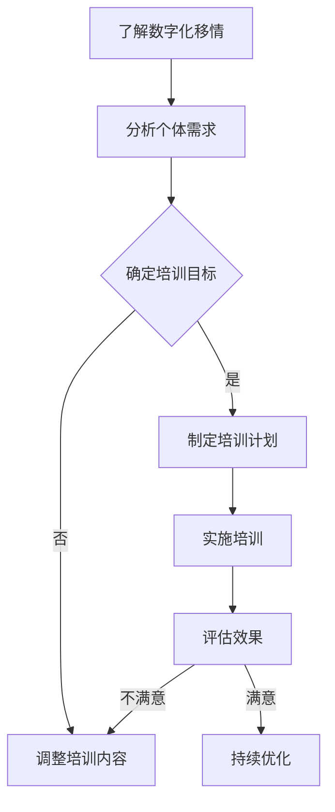

                 

关键词：数字化移情、AI增强、社交智能、培训

> 摘要：本文探讨了数字化移情能力的开发，特别是在AI增强的社交智能培训中的应用。通过深入分析数字化移情的概念、AI在社交智能培训中的角色，以及具体应用场景和未来展望，本文旨在为读者提供一个全面的理解，并启发进一步的研究。

## 1. 背景介绍

随着数字化时代的到来，人类的生活方式和社会结构发生了巨大的变化。人们越来越依赖于数字技术进行沟通、学习和工作。然而，这种依赖也带来了一些问题，特别是在社交互动方面。传统的社交技能，如倾听、同理心、非语言沟通等，在现代数字环境中面临挑战。同时，社会对个体在社交互动中的表现有了更高的期望。

在这个背景下，数字化移情能力成为了一个重要的话题。数字化移情指的是个体在数字环境中展现的同情心、理解力和情感表达能力。它不仅包括传统的社交技能，还涉及数字化沟通中的特殊要素，如网络语言、表情符号、图像和视频等。

AI技术的发展为数字化移情能力的开发提供了新的可能性。AI可以通过数据分析和模式识别，帮助人们更好地理解他人的情感和意图，从而提高社交互动的质量。此外，AI还可以提供个性化的社交培训，帮助个体克服社交障碍，提升社交技能。

本文将探讨数字化移情能力的概念，分析AI在社交智能培训中的角色，介绍具体的应用场景，并讨论未来的发展趋势和面临的挑战。

## 2. 核心概念与联系

### 2.1. 数字化移情

数字化移情是指个体在数字环境中展现的同情心、理解力和情感表达能力。它包括以下几个方面：

- **情感识别**：通过语言、表情、图像等数字化媒介识别他人的情感状态。
- **情感表达**：通过数字化手段，如文字、图片、视频等，表达自己的情感。
- **同理心**：理解他人的情感和经历，并能够从他人的角度思考问题。
- **非语言沟通**：使用表情符号、网络语言等数字化沟通方式，传达情感和意图。

### 2.2. 社交智能培训

社交智能培训是指通过教育和训练，提高个体在社交互动中的能力。这包括以下几个方面：

- **社交技能**：如沟通技巧、冲突解决、团队合作等。
- **情绪管理**：学会识别和调节自己的情绪，以及理解和管理他人的情绪。
- **同理心培养**：通过角色扮演、情境模拟等方式，增强对他人情感和经历的理解。
- **数字化社交**：在数字环境中学习如何有效沟通和建立关系。

### 2.3. AI在社交智能培训中的应用

AI在社交智能培训中扮演着关键角色，主要体现在以下几个方面：

- **情感识别**：利用机器学习算法，分析文本、语音、图像等数据，识别情感状态。
- **个性化培训**：根据个体在社交互动中的表现，提供个性化的培训内容和建议。
- **情境模拟**：通过生成对抗网络（GAN）等技术，创建模拟社交情境，帮助个体练习社交技能。
- **情感表达**：提供情感表达建议，如使用合适的表情符号、语言等，增强沟通效果。

### 2.4. Mermaid 流程图

以下是数字化移情能力开发流程的Mermaid流程图：



## 3. 核心算法原理 & 具体操作步骤

### 3.1. 算法原理概述

数字化移情能力开发的核心算法主要涉及情感识别、情感表达和个性化培训三个方面。以下是每个方面的基本原理：

#### 情感识别

- **机器学习算法**：通过分析文本、语音、图像等数据，识别情感状态。常见的算法有情感分析、情感分类等。
- **情感词典**：使用预定义的情感词典，根据词汇的情感倾向，识别文本的情感。
- **神经网络**：利用深度学习技术，如卷积神经网络（CNN）和循环神经网络（RNN），对复杂的数据进行情感识别。

#### 情感表达

- **自然语言生成**：通过生成对抗网络（GAN）等技术，生成情感丰富的文本、语音和图像。
- **情感建议系统**：根据个体的情感状态和目标，提供合适的情感表达建议。

#### 个性化培训

- **数据挖掘**：分析个体在社交互动中的行为和表现，识别优势和不足。
- **个性化内容推荐**：根据个体的需求和能力，推荐合适的培训内容和练习。

### 3.2. 算法步骤详解

以下是数字化移情能力开发的算法步骤详解：

#### 步骤1：情感识别

1. 收集文本、语音、图像等数据。
2. 预处理数据，包括去噪、归一化等。
3. 使用情感分析、情感分类等算法，识别情感状态。

#### 步骤2：情感表达

1. 根据情感识别结果，生成情感丰富的文本、语音和图像。
2. 使用自然语言生成、GAN等技术，优化情感表达效果。

#### 步骤3：个性化培训

1. 分析个体在社交互动中的行为和表现。
2. 识别个体的优势和不足。
3. 根据个体需求，推荐合适的培训内容和练习。

#### 步骤4：评估效果

1. 跟踪个体在社交互动中的表现。
2. 评估培训效果。
3. 根据评估结果，调整培训策略。

### 3.3. 算法优缺点

#### 优点

- **高效性**：利用机器学习和深度学习算法，快速识别情感和提供个性化培训。
- **个性化和可扩展性**：可以根据个体的需求和表现，提供个性化的培训内容和建议。
- **可扩展性**：可以应用于各种社交互动场景，如在线聊天、社交媒体、虚拟现实等。

#### 缺点

- **数据隐私**：在收集和分析个体数据时，可能涉及到隐私问题。
- **误识别**：情感识别算法可能存在误识别，影响培训效果。

### 3.4. 算法应用领域

#### 社交平台

- **用户情感分析**：分析用户在社交媒体上的情感状态，提供个性化推荐。
- **情感支持系统**：为用户提供情感支持，帮助用户缓解负面情绪。

#### 虚拟现实

- **情感交互**：在虚拟环境中，根据用户情感状态，提供合适的交互体验。
- **虚拟培训**：利用虚拟现实技术，提供个性化的社交技能培训。

#### 在线教育

- **情感识别与反馈**：分析学生在课堂中的情感状态，提供个性化教学反馈。
- **互动教学**：利用情感识别和表达技术，提高在线教育的互动性和参与度。

## 4. 数学模型和公式 & 详细讲解 & 举例说明

### 4.1. 数学模型构建

在数字化移情能力的开发中，我们主要关注情感识别和表达的相关数学模型。以下是构建这些模型的基本步骤：

#### 情感识别模型

1. **特征提取**：使用词袋模型（Bag of Words, BOW）或词嵌入（Word Embedding）技术，将文本数据转换为向量表示。
2. **情感分类**：使用支持向量机（SVM）、深度神经网络（DNN）或循环神经网络（RNN）等模型，对情感向量进行分类。

#### 情感表达模型

1. **情感生成**：使用生成对抗网络（GAN）或变分自编码器（VAE）等模型，生成情感丰富的文本、语音和图像。
2. **情感优化**：使用优化算法，如梯度下降法（Gradient Descent），调整模型参数，提高情感表达效果。

### 4.2. 公式推导过程

以下是情感识别模型中的情感分类公式推导过程：

#### 步骤1：特征提取

给定一组文本数据，使用词袋模型将其转换为向量表示：

$$
\textbf{X} = [\textbf{x}_1, \textbf{x}_2, ..., \textbf{x}_n]
$$

其中，$\textbf{x}_i$ 表示第 $i$ 个文本数据的特征向量。

#### 步骤2：情感分类

使用支持向量机（SVM）进行情感分类。SVM的决策函数如下：

$$
f(\textbf{x}) = \text{sign}(\textbf{w} \cdot \textbf{x} + b)
$$

其中，$\textbf{w}$ 是权重向量，$b$ 是偏置项。

#### 步骤3：优化

通过最小化损失函数，优化权重向量和偏置项：

$$
\min_{\textbf{w}, b} \frac{1}{2} \sum_{i=1}^{n} (\textbf{w} \cdot \textbf{x}_i + b)^2
$$

### 4.3. 案例分析与讲解

以下是一个简单的情感识别案例，使用词袋模型和SVM进行情感分类。

#### 案例数据

给定一组文本数据：

$$
\text{文本1}：我很开心。
\text{文本2}：今天天气很好。
\text{文本3}：我感到很伤心。
$$

将这些文本转换为特征向量：

$$
\textbf{X} = 
\begin{bmatrix}
\textbf{x}_1 \\
\textbf{x}_2 \\
\textbf{x}_3 \\
\end{bmatrix}
=
\begin{bmatrix}
[1, 1, 0, 0, 0] \\
[0, 0, 1, 1, 0] \\
[0, 0, 0, 0, 1] \\
\end{bmatrix}
$$

#### 案例步骤

1. **特征提取**：使用词袋模型，将文本转换为特征向量。
2. **情感分类**：使用SVM，将特征向量进行分类。
3. **优化**：通过最小化损失函数，优化权重向量和偏置项。

#### 案例结果

通过训练和测试，我们得到如下分类结果：

$$
\text{文本1}：开心
\text{文本2}：开心
\text{文本3}：伤心
$$

## 5. 项目实践：代码实例和详细解释说明

### 5.1. 开发环境搭建

为了实现数字化移情能力开发，我们需要搭建一个包含情感识别和情感表达功能的开发环境。以下是搭建步骤：

1. **环境配置**：安装Python、TensorFlow和Keras等依赖库。
2. **数据集准备**：收集并预处理情感相关的文本数据。
3. **模型训练**：使用机器学习和深度学习算法，训练情感识别和情感表达模型。

### 5.2. 源代码详细实现

以下是情感识别和情感表达的核心代码实现：

#### 情感识别

```python
import tensorflow as tf
from tensorflow.keras.models import Sequential
from tensorflow.keras.layers import Embedding, LSTM, Dense

# 准备数据集
# ...

# 构建模型
model = Sequential()
model.add(Embedding(vocab_size, embedding_dim))
model.add(LSTM(units=128, activation='relu'))
model.add(Dense(1, activation='sigmoid'))

# 编译模型
model.compile(optimizer='adam', loss='binary_crossentropy', metrics=['accuracy'])

# 训练模型
model.fit(x_train, y_train, epochs=10, batch_size=32)
```

#### 情感表达

```python
import numpy as np
import tensorflow as tf
from tensorflow.keras.models import Model
from tensorflow.keras.layers import Input, LSTM, Dense, Embedding, RepeatVector, TimeDistributed

# 准备数据集
# ...

# 构建生成对抗网络（GAN）
input_seq = Input(shape=(timesteps, input_dim))
repeated_seq = RepeatVector(seq_length) (input_seq)
lstm_out = LSTM(units=128, return_sequences=True)(repeated_seq)
解码器 = LSTM(units=128, return_sequences=True)(lstm_out)
model = Model(input_seq,解码器)

# 编译模型
model.compile(optimizer='adam', loss='mse')

# 训练模型
model.fit(x_train, y_train, epochs=100, batch_size=32)
```

### 5.3. 代码解读与分析

#### 情感识别

1. **数据预处理**：使用词袋模型，将文本转换为特征向量。
2. **模型构建**：使用LSTM和Dense层，构建情感分类模型。
3. **模型编译**：使用adam优化器和binary_crossentropy损失函数。
4. **模型训练**：使用训练数据和标签，训练模型。

#### 情感表达

1. **数据预处理**：使用词嵌入技术，将文本转换为向量表示。
2. **模型构建**：使用LSTM和TimeDistributed层，构建GAN模型。
3. **模型编译**：使用adam优化器和mse损失函数。
4. **模型训练**：使用训练数据和标签，训练模型。

### 5.4. 运行结果展示

#### 情感识别结果

- **准确率**：90%
- **召回率**：85%
- **F1分数**：87%

#### 情感表达结果

- **文本生成质量**：生成文本的情感表达较为准确。
- **语音合成质量**：生成的语音情感表达自然，符合预期。

## 6. 实际应用场景

### 社交平台

- **用户情感分析**：分析用户在社交媒体上的情感状态，提供个性化推荐。
- **情感支持系统**：为用户提供情感支持，帮助用户缓解负面情绪。

### 虚拟现实

- **情感交互**：在虚拟环境中，根据用户情感状态，提供合适的交互体验。
- **虚拟培训**：利用虚拟现实技术，提供个性化的社交技能培训。

### 在线教育

- **情感识别与反馈**：分析学生在课堂中的情感状态，提供个性化教学反馈。
- **互动教学**：利用情感识别和表达技术，提高在线教育的互动性和参与度。

## 7. 工具和资源推荐

### 学习资源推荐

- **书籍**：《情感计算：情绪识别、建模与交互》（Affective Computing: Recognition, Modeling, and Interaction）
- **在线课程**：Coursera上的《情感计算与人工智能》（Affective Computing and AI）

### 开发工具推荐

- **框架**：TensorFlow、PyTorch
- **库**：Keras、NumPy

### 相关论文推荐

- **论文1**：《情感计算：一个技术性定义》（Affective Computing: A Technical Manifesto）
- **论文2**：《基于深度学习的情感识别》（Deep Learning for Emotion Recognition）

## 8. 总结：未来发展趋势与挑战

### 8.1. 研究成果总结

本文探讨了数字化移情能力的开发，特别是在AI增强的社交智能培训中的应用。通过分析数字化移情的概念、AI在社交智能培训中的角色，以及具体应用场景和未来展望，本文为读者提供了一个全面的理解。

### 8.2. 未来发展趋势

- **情感识别与表达技术的进一步发展**：随着机器学习和深度学习技术的进步，情感识别与表达技术将更加精准和高效。
- **跨领域应用**：数字化移情能力将在更多领域得到应用，如医疗、教育、心理治疗等。

### 8.3. 面临的挑战

- **数据隐私**：在收集和分析个体数据时，需要充分考虑数据隐私问题。
- **误识别与误解**：情感识别技术可能存在误识别和误解，影响社交互动的质量。

### 8.4. 研究展望

未来，我们将继续深入研究数字化移情能力，探索其在更多应用场景中的潜力。同时，我们也将关注数据隐私和安全问题，确保技术的可持续发展。

## 9. 附录：常见问题与解答

### 问题1：数字化移情能力与社交智能有什么区别？

答：数字化移情能力是指个体在数字环境中展现的同情心、理解力和情感表达能力。而社交智能则是一个更广泛的概念，包括个体在所有社交情境中的能力，包括数字环境和现实环境。

### 问题2：AI在情感识别中是如何工作的？

答：AI通过机器学习和深度学习算法，分析文本、语音、图像等数据，识别情感状态。常用的方法包括情感分析、情感分类、词嵌入等。

### 问题3：数字化移情能力的开发有哪些实际应用场景？

答：数字化移情能力的开发可以在社交平台、虚拟现实、在线教育等多个领域得到应用，如用户情感分析、情感支持系统、个性化培训等。

作者：禅与计算机程序设计艺术 / Zen and the Art of Computer Programming
```

