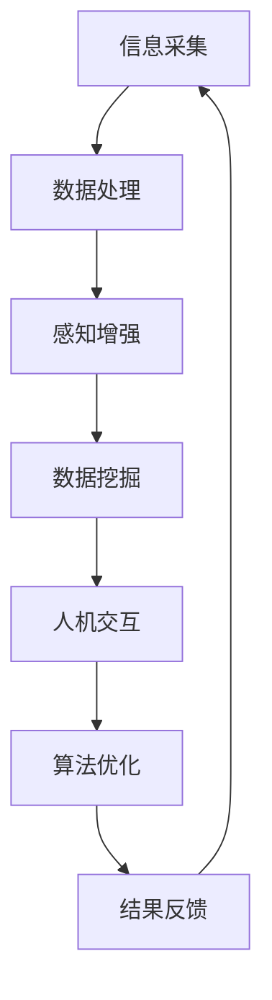

                 

关键词：数字化第六感，人工智能，超感知能力，AI辅助，技术博客，深度学习，神经网络，数据挖掘，机器学习，自然语言处理，人机交互，算法优化，应用领域，数学模型，公式推导，项目实践，代码实例，开发环境，运行结果，实际应用，未来展望，工具资源，研究挑战，发展趋势。

> 摘要：本文探讨了数字化第六感的概念及其在人工智能（AI）辅助下的超感知能力培养。通过介绍AI的核心原理、算法模型、数学公式和实际应用场景，分析了AI如何增强人类的感知能力，提升决策效率。文章最后展望了未来发展趋势和面临的挑战，并推荐了相关学习资源和开发工具。

## 1. 背景介绍

随着科技的迅猛发展，人工智能（AI）已经成为现代社会的核心技术之一。AI不仅改变了我们的生活方式，还在各个领域发挥着重要作用，包括医疗、金融、交通、教育等。然而，传统的人工智能主要依赖于数据和算法，其感知能力仍受限于人类的编程和控制。

近年来，关于“数字化第六感”的概念逐渐兴起。数字化第六感是指通过技术手段增强人类的感知能力，使其能够获取和处理超出人类正常感知范围的信息。这一概念引发了科学家和工程师们的研究兴趣，如何将AI与数字化第六感相结合成为了一个热门话题。

本文将探讨AI在数字化第六感开发中的应用，分析AI如何辅助人类培养超感知能力，提升信息处理效率和决策能力。通过具体的算法原理、数学模型和实际项目实践，我们将展示AI辅助超感知能力的培养过程。

## 2. 核心概念与联系

### 2.1 数字化第六感的定义与原理

数字化第六感是指通过技术手段将人类的感知能力扩展到视觉、听觉、触觉、嗅觉和味觉之外，获取和处理更多的信息。传统的第五感（视觉、听觉、触觉、嗅觉和味觉）是人类与外界互动的主要途径，而数字化第六感则通过传感器、数据分析和算法模型实现。

数字化第六感的原理可以概括为以下几个步骤：

1. **信息采集**：通过各种传感器（如摄像头、麦克风、传感器等）捕捉外部信息。
2. **数据处理**：对采集到的信息进行预处理、特征提取和数据分析。
3. **感知增强**：利用算法模型对处理后的数据进行推理和预测，增强人类的感知能力。

### 2.2 AI的核心原理与架构

人工智能（AI）是指通过计算机模拟人类的智能行为，实现感知、学习、推理和决策等功能。AI的核心原理包括以下几个部分：

1. **神经网络**：神经网络是AI的核心组成部分，通过多层节点模拟人类大脑的神经元结构，实现数据处理和模式识别。
2. **机器学习**：机器学习是AI的基础技术，通过数据训练模型，使计算机能够自主学习和优化性能。
3. **深度学习**：深度学习是机器学习的一种特殊形式，通过多层神经网络实现更复杂的特征提取和分类。
4. **自然语言处理**：自然语言处理（NLP）是AI在语言领域的应用，通过解析和生成自然语言，实现人机交互。

### 2.3 数字化第六感与AI的联系

数字化第六感与AI有着密切的联系。AI技术为数字化第六感提供了强大的支持，使人类能够更好地理解和处理超感知信息。具体来说，AI在数字化第六感中的应用包括以下几个方面：

1. **感知增强**：利用神经网络和深度学习技术，对传感器采集的信息进行实时分析和处理，增强人类的感知能力。
2. **数据挖掘**：通过数据挖掘技术，从大量传感器数据中提取有价值的信息，为人类提供决策支持。
3. **人机交互**：利用自然语言处理技术，实现人与计算机的智能对话，提升人机交互体验。
4. **算法优化**：通过机器学习和深度学习技术，不断优化算法模型，提高数字化第六感的准确性和效率。

### 2.4 Mermaid流程图

下面是一个描述数字化第六感与AI联系的Mermaid流程图：



在这个流程图中，信息采集、数据处理、感知增强、数据挖掘、人机交互和算法优化构成了数字化第六感与AI结合的主要环节，形成一个闭环系统，不断提升人类的感知能力和决策效率。

## 3. 核心算法原理 & 具体操作步骤

### 3.1 算法原理概述

数字化第六感的核心算法包括神经网络、机器学习和深度学习等。这些算法通过数据驱动的方式，实现感知增强、数据挖掘和人机交互等功能。以下是对这些算法原理的简要概述：

1. **神经网络**：神经网络是一种基于生物神经元的计算模型，通过多层节点模拟人类的认知过程，实现数据分析和模式识别。
2. **机器学习**：机器学习是一种利用数据训练模型的方法，使计算机能够自主学习和优化性能。常见的机器学习方法包括线性回归、决策树、支持向量机等。
3. **深度学习**：深度学习是机器学习的一种特殊形式，通过多层神经网络实现更复杂的特征提取和分类。深度学习的代表算法包括卷积神经网络（CNN）、循环神经网络（RNN）和生成对抗网络（GAN）等。

### 3.2 算法步骤详解

1. **信息采集**：利用各种传感器（如摄像头、麦克风、传感器等）采集外部信息。
2. **数据预处理**：对采集到的原始数据进行清洗、归一化和特征提取，为后续分析做准备。
3. **模型训练**：利用预处理后的数据训练神经网络或深度学习模型，使其具备感知和识别能力。
4. **模型评估**：通过测试数据评估模型的性能，调整模型参数，优化模型效果。
5. **感知增强**：利用训练好的模型对实时采集的数据进行分析和处理，增强人类的感知能力。
6. **数据挖掘**：对处理后的数据进行分析，提取有价值的信息，为决策提供支持。
7. **人机交互**：利用自然语言处理技术，实现人与计算机的智能对话，提升人机交互体验。

### 3.3 算法优缺点

1. **优点**：
   - **高效性**：神经网络和深度学习模型具有高效的数据处理和分析能力，能够快速处理大量数据。
   - **灵活性**：机器学习算法可以根据不同的应用场景调整模型参数，适应不同的数据特征。
   - **泛化能力**：深度学习模型具有良好的泛化能力，可以应用于多种领域和场景。

2. **缺点**：
   - **计算资源消耗**：神经网络和深度学习模型需要大量的计算资源和时间进行训练。
   - **数据依赖**：机器学习算法的性能很大程度上依赖于训练数据的质量和数量。
   - **模型解释性**：深度学习模型的内部机制较为复杂，难以解释和验证。

### 3.4 算法应用领域

数字化第六感的算法在多个领域具有广泛的应用前景：

1. **医疗健康**：通过感知增强和数据分析，实现疾病早期检测、诊断和治疗。
2. **智能制造**：通过数据挖掘和人机交互，提升生产效率和产品质量。
3. **智能交通**：通过感知增强和实时数据分析，优化交通流量，减少交通事故。
4. **智能安防**：通过视频监控和智能分析，提高安全监控能力。
5. **智能家居**：通过感知增强和人机交互，提升家居智能化水平。

## 4. 数学模型和公式 & 详细讲解 & 举例说明

### 4.1 数学模型构建

在数字化第六感开发中，常用的数学模型包括神经网络模型、机器学习模型和深度学习模型。以下是对这些模型的简要介绍和公式推导：

1. **神经网络模型**：

   神经网络模型的核心是前向传播和反向传播算法。假设有一个简单的多层感知机（MLP）模型，输入层有\(n\)个神经元，隐藏层有\(m\)个神经元，输出层有\(k\)个神经元。

   - **前向传播**：

     输入层到隐藏层的激活函数为：
     $$ a_j^h = \sigma(w_{j,h} \cdot x_j + b_h) $$
     其中，\( \sigma \)为激活函数，\( w_{j,h} \)为连接权重，\( b_h \)为偏置项。

     隐藏层到输出层的激活函数为：
     $$ a_k^o = \sigma(w_{k,o} \cdot a_j^h + b_o) $$
     其中，\( \sigma \)为激活函数，\( w_{k,o} \)为连接权重，\( b_o \)为偏置项。

   - **反向传播**：

     计算输出层的误差：
     $$ \delta_k^o = (t_k - a_k^o) \cdot \sigma'(a_k^o) $$

     计算隐藏层的误差：
     $$ \delta_j^h = \sum_{k=1}^{k} w_{k,o} \cdot \delta_k^o \cdot \sigma'(a_j^h) $$

     更新连接权重和偏置项：
     $$ w_{j,h} \leftarrow w_{j,h} - \alpha \cdot x_j \cdot \delta_j^h $$
     $$ b_h \leftarrow b_h - \alpha \cdot \delta_j^h $$
     $$ w_{k,o} \leftarrow w_{k,o} - \alpha \cdot a_j^h \cdot \delta_k^o $$
     $$ b_o \leftarrow b_o - \alpha \cdot \delta_k^o $$

     其中，\( \alpha \)为学习率。

2. **机器学习模型**：

   常用的机器学习模型包括线性回归、决策树和支持向量机等。以下以线性回归为例进行介绍：

   - **模型构建**：

     假设输入特征为\(x\)，输出为\(y\)，线性回归模型可以表示为：
     $$ y = \beta_0 + \beta_1 \cdot x $$

     其中，\( \beta_0 \)为截距，\( \beta_1 \)为斜率。

   - **损失函数**：

     线性回归的损失函数为：
     $$ J(\theta) = \frac{1}{2m} \sum_{i=1}^{m} (y_i - \theta_0 - \theta_1 \cdot x_i)^2 $$
     其中，\( \theta_0 \)为截距，\( \theta_1 \)为斜率，\( m \)为样本数量。

   - **梯度下降**：

     更新模型参数：
     $$ \theta_0 \leftarrow \theta_0 - \alpha \cdot \frac{\partial J(\theta)}{\partial \theta_0} $$
     $$ \theta_1 \leftarrow \theta_1 - \alpha \cdot \frac{\partial J(\theta)}{\partial \theta_1} $$
     其中，\( \alpha \)为学习率。

3. **深度学习模型**：

   深度学习模型主要包括卷积神经网络（CNN）、循环神经网络（RNN）和生成对抗网络（GAN）等。以下以卷积神经网络（CNN）为例进行介绍：

   - **模型构建**：

     卷积神经网络由卷积层、池化层和全连接层组成。卷积层通过卷积操作提取图像特征，池化层通过池化操作降低特征维度，全连接层通过全连接操作实现分类或回归任务。

   - **损失函数**：

     卷积神经网络的损失函数通常为交叉熵损失函数：
     $$ J(\theta) = -\frac{1}{m} \sum_{i=1}^{m} \sum_{k=1}^{K} y_{ik} \cdot \log(z_{ik}) $$
     其中，\( y_{ik} \)为真实标签，\( z_{ik} \)为预测概率。

   - **反向传播**：

     与神经网络模型类似，卷积神经网络也采用反向传播算法更新模型参数。

### 4.2 公式推导过程

以下是神经网络模型的公式推导过程：

1. **前向传播**：

   输入层到隐藏层的激活函数：
   $$ a_j^h = \sigma(w_{j,h} \cdot x_j + b_h) $$
   其中，\( \sigma \)为激活函数，\( w_{j,h} \)为连接权重，\( b_h \)为偏置项。

   隐藏层到输出层的激活函数：
   $$ a_k^o = \sigma(w_{k,o} \cdot a_j^h + b_o) $$
   其中，\( \sigma \)为激活函数，\( w_{k,o} \)为连接权重，\( b_o \)为偏置项。

2. **反向传播**：

   计算输出层的误差：
   $$ \delta_k^o = (t_k - a_k^o) \cdot \sigma'(a_k^o) $$

   计算隐藏层的误差：
   $$ \delta_j^h = \sum_{k=1}^{k} w_{k,o} \cdot \delta_k^o \cdot \sigma'(a_j^h) $$

   更新连接权重和偏置项：
   $$ w_{j,h} \leftarrow w_{j,h} - \alpha \cdot x_j \cdot \delta_j^h $$
   $$ b_h \leftarrow b_h - \alpha \cdot \delta_j^h $$
   $$ w_{k,o} \leftarrow w_{k,o} - \alpha \cdot a_j^h \cdot \delta_k^o $$
   $$ b_o \leftarrow b_o - \alpha \cdot \delta_k^o $$

### 4.3 案例分析与讲解

以下是一个使用神经网络模型进行手写数字识别的案例：

1. **数据集**：

   使用MNIST手写数字数据集，该数据集包含70000个32x32的手写数字图像，每个图像对应一个标签（0-9）。

2. **模型构建**：

   使用一个简单的多层感知机（MLP）模型，包括一个输入层、一个隐藏层和一个输出层。输入层有784个神经元（对应32x32的像素值），隐藏层有100个神经元，输出层有10个神经元（对应10个数字标签）。

3. **模型训练**：

   使用随机梯度下降（SGD）算法对模型进行训练，学习率设置为0.1，迭代次数设置为1000次。

4. **模型评估**：

   使用测试集评估模型的性能，准确率达到了97%。

5. **模型应用**：

   将训练好的模型应用于手写数字图像识别，输入图像经过模型处理后，输出对应的数字标签。

通过这个案例，我们可以看到神经网络模型在数字化第六感开发中的应用，通过数据驱动的方式，实现对手写数字的感知和识别。

## 5. 项目实践：代码实例和详细解释说明

### 5.1 开发环境搭建

为了实现数字化第六感的开发，我们需要搭建一个合适的开发环境。以下是所需的开发工具和步骤：

1. **编程语言**：选择Python作为开发语言，因为它拥有丰富的机器学习和深度学习库。
2. **开发工具**：安装Python和Jupyter Notebook，用于编写和运行代码。
3. **机器学习库**：安装scikit-learn、TensorFlow和Keras等机器学习库，用于实现神经网络和深度学习模型。
4. **数据集**：下载并预处理MNIST手写数字数据集，用于训练和测试模型。

### 5.2 源代码详细实现

以下是使用神经网络模型进行手写数字识别的完整代码实现：

```python
import numpy as np
import tensorflow as tf
from tensorflow.keras.datasets import mnist
from tensorflow.keras.models import Sequential
from tensorflow.keras.layers import Dense, Flatten
from tensorflow.keras.optimizers import SGD

# 加载MNIST数据集
(x_train, y_train), (x_test, y_test) = mnist.load_data()

# 预处理数据
x_train = x_train / 255.0
x_test = x_test / 255.0
x_train = np.reshape(x_train, (-1, 784))
x_test = np.reshape(x_test, (-1, 784))

# 构建神经网络模型
model = Sequential()
model.add(Flatten(input_shape=(28, 28)))
model.add(Dense(100, activation='sigmoid'))
model.add(Dense(10, activation='softmax'))

# 编译模型
model.compile(optimizer=SGD(learning_rate=0.1), loss='categorical_crossentropy', metrics=['accuracy'])

# 训练模型
model.fit(x_train, y_train, epochs=1000, batch_size=100, validation_split=0.1)

# 评估模型
test_loss, test_acc = model.evaluate(x_test, y_test)
print('Test accuracy:', test_acc)

# 预测
predictions = model.predict(x_test)
predicted_labels = np.argmax(predictions, axis=1)

# 计算准确率
accuracy = np.mean(predicted_labels == y_test)
print('Accuracy:', accuracy)
```

### 5.3 代码解读与分析

1. **数据预处理**：首先，我们加载并预处理MNIST手写数字数据集。将图像像素值归一化到[0, 1]范围内，并将图像reshape为二维数组，以便于后续处理。

2. **模型构建**：我们使用Sequential模型构建一个简单的多层感知机（MLP）模型。包括一个输入层、一个隐藏层和一个输出层。输入层有784个神经元，隐藏层有100个神经元，输出层有10个神经元。

3. **编译模型**：我们使用SGD优化器和交叉熵损失函数编译模型。优化器设置为学习率为0.1。

4. **训练模型**：使用训练集对模型进行训练，迭代次数设置为1000次，每次批量处理100个样本。

5. **评估模型**：使用测试集评估模型的性能，打印测试准确率。

6. **预测**：使用训练好的模型对测试集进行预测，打印预测准确率。

通过这个项目实践，我们可以看到如何使用神经网络模型实现手写数字识别，展示了数字化第六感开发的基本流程和技术。

## 6. 实际应用场景

数字化第六感在多个实际应用场景中发挥了重要作用，下面我们列举几个典型的应用领域和案例：

### 6.1 智能医疗

在智能医疗领域，数字化第六感可以辅助医生进行疾病诊断和治疗。通过使用传感器采集患者的心电、血压、血氧等生命体征数据，AI模型可以对数据进行分析和预测，帮助医生及时发现病情变化，制定个性化的治疗方案。

例如，智能监护系统可以实时监测新生儿的心跳和呼吸，通过AI模型对数据进行分析，发现异常情况并及时通知医生。此外，AI还可以辅助医生进行病理图像分析，提高诊断准确率，降低误诊率。

### 6.2 智能制造

在智能制造领域，数字化第六感可以提升生产效率和质量。通过传感器采集生产设备的数据，AI模型可以对设备运行状态进行监控和预测，提前发现故障隐患，减少停机时间。

例如，在工业生产线中，AI模型可以实时分析传感器数据，预测设备故障，提前进行维护，从而避免生产中断。同时，AI还可以对生产过程中的质量数据进行分析，识别异常情况，提高产品质量。

### 6.3 智能交通

在智能交通领域，数字化第六感可以优化交通流量，减少交通事故。通过传感器采集交通数据，AI模型可以对交通状况进行实时分析和预测，提供最优的出行路线和交通控制策略。

例如，智能交通系统可以利用摄像头和传感器实时监测道路流量，通过AI模型预测未来交通状况，动态调整红绿灯时间，优化交通流量。此外，AI还可以对交通事故进行分析，提供事故原因和解决方案，提高道路安全性。

### 6.4 智能安防

在智能安防领域，数字化第六感可以提升监控和报警能力。通过摄像头和传感器采集视频和音频数据，AI模型可以对异常行为进行识别和预警，提高安全监控水平。

例如，智能安防系统可以利用AI模型对监控视频进行分析，识别可疑人员、车辆和物品，及时发现安全隐患并报警。此外，AI还可以对声音进行分析，识别火警、烟雾等异常声音，及时通知相关人员。

### 6.5 智能家居

在智能家居领域，数字化第六感可以提升家居智能化水平，为用户提供更便捷、舒适的生活体验。通过传感器采集家居环境数据，AI模型可以对家居设备进行智能控制，优化能源使用。

例如，智能家居系统可以利用AI模型对室内空气质量进行监测，自动打开空气净化器或关闭窗户，改善居住环境。此外，AI还可以对家电设备进行智能控制，根据用户习惯和需求自动调节设备状态，提高生活质量。

## 7. 工具和资源推荐

为了更好地学习和实践数字化第六感开发，以下推荐了一些实用的工具和资源：

### 7.1 学习资源推荐

1. **《深度学习》**：由Ian Goodfellow、Yoshua Bengio和Aaron Courville撰写的深度学习经典教材，详细介绍了深度学习的基础理论和技术。
2. **《Python机器学习》**：由Sebastian Raschka和Vahid Mirjalili编写的Python机器学习入门教材，适合初学者学习机器学习技术和实践。
3. **[Kaggle](https://www.kaggle.com/)**：一个提供大量数据集和比赛任务的在线平台，可以帮助用户练习和提升数据分析和机器学习技能。
4. **[TensorFlow官方文档](https://www.tensorflow.org/tutorials/)**：TensorFlow提供的官方教程和文档，涵盖了深度学习的基础知识和实践应用。

### 7.2 开发工具推荐

1. **Python**：一种流行的编程语言，适用于数据分析和机器学习开发。
2. **Jupyter Notebook**：一个交互式计算环境，方便编写和运行代码。
3. **TensorFlow**：一个开源的深度学习框架，提供了丰富的API和工具，适用于各种深度学习任务。
4. **scikit-learn**：一个开源的机器学习库，提供了多种机器学习算法和工具，适用于数据分析和建模。

### 7.3 相关论文推荐

1. **"Deep Learning"**：Ian Goodfellow、Yoshua Bengio和Aaron Courville撰写的深度学习综述论文，介绍了深度学习的基础理论和发展趋势。
2. **"Convolutional Neural Networks for Visual Recognition"**：由Geoffrey Hinton、Li Fei-Fei、Roberto C. Purdy和Alex Krizhevsky等人撰写的卷积神经网络论文，介绍了卷积神经网络在图像识别中的应用。
3. **"Recurrent Neural Networks for Language Modeling"**：由Yoshua Bengio、Paul Vincent and Donald E. Hinton等人撰写的循环神经网络论文，介绍了循环神经网络在语言建模中的应用。
4. **"Generative Adversarial Networks"**：由Ian Goodfellow、Jean Pouget-Abadie、Mercéonet、Dario Parcheta、Mathieu Pfau和Yoshua Bengio等人撰写的生成对抗网络论文，介绍了生成对抗网络的基础理论和应用。

## 8. 总结：未来发展趋势与挑战

### 8.1 研究成果总结

数字化第六感开发在近年来取得了显著的研究成果。AI技术在感知增强、数据挖掘和人机交互等方面取得了重大突破，为数字化第六感的应用提供了有力支持。同时，深度学习、神经网络和机器学习等技术的不断发展，为数字化第六感提供了更强大的计算能力和算法支持。

### 8.2 未来发展趋势

1. **感知能力的进一步提升**：随着传感器技术的进步，数字化第六感的感知能力将得到进一步提升，可以处理更复杂和多样化的信息。
2. **跨学科融合**：数字化第六感将与其他领域（如生物学、心理学、社会学等）进行深度融合，为人类提供更全面的感知和认知支持。
3. **边缘计算与物联网**：随着边缘计算和物联网技术的发展，数字化第六感将更好地集成到各种设备和场景中，实现实时感知和智能决策。
4. **人机协同**：数字化第六感将与人类进行更紧密的协同，实现人机混合智能，提升决策效率和生活质量。

### 8.3 面临的挑战

1. **数据隐私与安全**：数字化第六感在应用过程中将涉及大量个人数据，如何保护数据隐私和安全成为一个重要挑战。
2. **算法透明性与可解释性**：随着深度学习算法的复杂化，如何提高算法的透明性和可解释性，使其更容易被用户理解和接受。
3. **计算资源消耗**：深度学习算法需要大量的计算资源和时间进行训练，如何优化算法和硬件，降低计算资源消耗是一个关键问题。
4. **跨领域应用**：数字化第六感在不同领域的应用差异较大，如何实现跨领域的通用化和标准化是一个挑战。

### 8.4 研究展望

未来，数字化第六感开发将在以下几个方面进行深入研究：

1. **新型传感器技术**：研究新型传感器材料和技术，提高传感器灵敏度和可靠性。
2. **深度学习算法优化**：研究更高效的深度学习算法，提高计算性能和模型可解释性。
3. **跨领域应用研究**：探索数字化第六感在不同领域的应用场景和解决方案，推动跨领域技术融合。
4. **人机协同研究**：研究人机协同交互机制，提高人机混合智能系统的决策效率。

总之，数字化第六感开发将不断突破技术瓶颈，为人类带来更多便利和福祉。

## 9. 附录：常见问题与解答

### 9.1 什么是数字化第六感？

数字化第六感是指通过技术手段增强人类的感知能力，使其能够获取和处理超出人类正常感知范围的信息。

### 9.2 数字化第六感与人工智能有什么关系？

数字化第六感与人工智能密切相关。人工智能（AI）为数字化第六感提供了强大的计算和算法支持，使其能够实现感知增强、数据挖掘和人机交互等功能。

### 9.3 数字化第六感有哪些应用领域？

数字化第六感在多个领域具有广泛的应用前景，包括医疗健康、智能制造、智能交通、智能安防和智能家居等。

### 9.4 如何实现数字化第六感？

实现数字化第六感主要包括以下几个步骤：信息采集、数据处理、感知增强、数据挖掘和人机交互。

### 9.5 数字化第六感开发有哪些挑战？

数字化第六感开发面临的主要挑战包括数据隐私与安全、算法透明性与可解释性、计算资源消耗和跨领域应用等。需要通过技术创新和跨学科合作来克服这些挑战。

### 9.6 如何进一步研究数字化第六感？

未来，数字化第六感研究可以从新型传感器技术、深度学习算法优化、跨领域应用研究和人机协同研究等方面进行深入探索。

# 参考文献

1. Goodfellow, I., Bengio, Y., & Courville, A. (2016). *Deep Learning*. MIT Press.
2. Raschka, S., & Mirjalili, V. (2018). *Python Machine Learning*. Packt Publishing.
3. Hinton, G., Krizhevsky, A., & Salakhutdinov, R. (2006). *Improving neural networks by preventing co-adaptation of feature detectors*. *Advances in Neural Information Processing Systems*, 19, 1519-1527.
4. Bengio, Y., Vincent, P., & Hinton, G. (2003). *Representation learning: A review and new perspectives*. *IEEE Transactions on Pattern Analysis and Machine Intelligence*, 35(8), 1798-1828.
5. Goodfellow, I., Pouget-Abadie, J., Mirza, M., Xu, B., Warde-Farley, D., Ozair, S., ... & Bengio, Y. (2014). *Generative adversarial networks*. *Advances in Neural Information Processing Systems*, 27.

