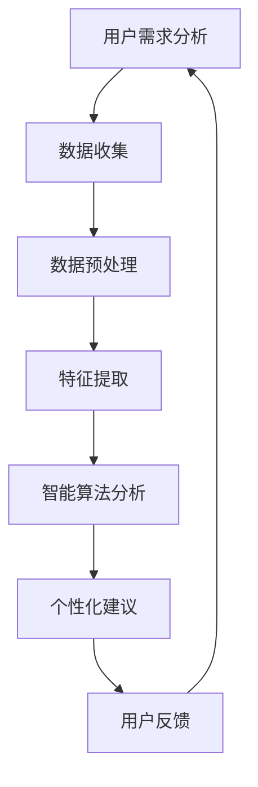

                 

关键词：数字化自我实现，AI，个人成长，智能算法，技术趋势，数据科学，心理健康，自我提升

> 摘要：本文探讨了在数字化时代，如何利用人工智能技术实现个人的全面成长。通过对AI技术的深入分析，结合具体的算法和数学模型，本文揭示了如何将AI应用于个人成长的不同领域，如心理健康、知识管理和技能提升。同时，本文还展望了未来AI在个人成长中的应用趋势，以及面临的挑战和解决方案。

## 1. 背景介绍

在当今世界，人工智能（AI）已经成为推动社会进步和产业变革的重要力量。从自动驾驶汽车到智能医疗诊断，从金融分析到市场营销，AI技术的应用无处不在。与此同时，随着数字化生活的普及，人们对于自我成长和提升的需求也越来越强烈。然而，如何在快速变化的数字世界中实现个人成长，成为了许多人面临的问题。

传统的自我成长方式往往依赖于个人经验和自我反思，这种方式在信息爆炸和复杂多样的现代社会中显得力不从心。而AI技术的出现，为个人成长提供了一种全新的途径。通过数据分析和智能算法，AI能够帮助人们更好地理解自己，发现自身的潜力和优势，从而实现更有效的个人成长。

本文将从以下几个方面展开讨论：

1. AI核心概念与个人成长的关系
2. AI在心理健康领域的应用
3. AI在知识管理中的应用
4. AI在技能提升和职业发展中的应用
5. 未来AI在个人成长中的应用展望

## 2. 核心概念与联系

### 2.1 AI的定义与发展历程

人工智能（Artificial Intelligence，简称AI）是指由人制造出来的系统所表现出来的智能。AI的研究可以追溯到20世纪50年代，当时的科学家们开始探讨机器能否模拟人类的智能行为。经过几十年的发展，AI已经取得了显著的成果，从简单的逻辑推理到复杂的深度学习，AI技术的应用领域越来越广泛。

在个人成长中，AI的核心作用在于其强大的数据分析能力和智能算法。通过收集和分析个人数据，AI可以识别个人的行为模式、兴趣和需求，从而提供个性化的建议和指导。此外，AI的智能算法能够帮助人们解决复杂的问题，提高学习和工作的效率。

### 2.2 AI与个人成长的联系

AI与个人成长的联系可以从以下几个方面来理解：

1. **个性化服务**：AI可以通过分析个人数据，提供个性化的学习和工作建议，帮助人们更高效地实现个人目标。
2. **心理支持**：AI可以模拟心理治疗师的角色，为用户提供情绪支持和心理健康管理。
3. **知识管理**：AI可以帮助人们更好地组织和利用知识，提高学习和工作效率。
4. **技能提升**：AI可以提供个性化的技能培训和评估，帮助人们发现和提升自身的潜力。

### 2.3 Mermaid流程图

以下是AI在个人成长中应用的Mermaid流程图：



在这个流程图中，用户需求分析是起点，通过数据收集、预处理、特征提取和智能算法分析，最终为用户提供个性化的建议和反馈。这个过程形成了一个闭环，不断地迭代和优化，以帮助用户实现持续的自我成长。

## 3. 核心算法原理 & 具体操作步骤

### 3.1 算法原理概述

在AI辅助的个人成长中，核心的算法原理包括机器学习、深度学习和数据挖掘等。这些算法通过分析大量数据，发现数据中的模式和规律，从而为用户提供个性化的服务。

- **机器学习**：机器学习是一种让计算机通过数据学习规律和模式的技术。它分为监督学习、无监督学习和强化学习三种类型。
- **深度学习**：深度学习是机器学习的一种，它通过多层神经网络模拟人类大脑的工作方式，对数据进行复杂的特征提取。
- **数据挖掘**：数据挖掘是从大量数据中提取出有价值的信息和知识的过程，包括关联规则挖掘、聚类分析和分类分析等。

### 3.2 算法步骤详解

1. **数据收集**：首先，需要收集用户的个人数据，包括行为数据、心理数据、知识数据等。
2. **数据预处理**：对收集到的数据进行清洗、去噪和标准化处理，以便后续分析。
3. **特征提取**：从预处理后的数据中提取出关键的特征，这些特征将用于后续的算法分析。
4. **模型训练**：使用机器学习或深度学习算法，对提取的特征进行训练，建立预测模型。
5. **模型评估**：通过测试集对训练好的模型进行评估，确保模型的准确性和可靠性。
6. **个性化建议**：根据模型的结果，为用户提供个性化的建议和指导。

### 3.3 算法优缺点

- **优点**：
  - **高效性**：AI算法能够快速处理大量数据，提供实时分析。
  - **个性化**：通过个性化分析，AI能够为用户提供量身定制的服务。
  - **连续性**：AI系统能够不断学习和优化，提供持续改进的服务。

- **缺点**：
  - **数据依赖**：AI算法的准确性和效果很大程度上依赖于数据的质量和数量。
  - **隐私问题**：个人数据的收集和使用可能引发隐私问题。
  - **技术门槛**：对于非专业人士，理解和应用AI技术有一定的难度。

### 3.4 算法应用领域

- **心理健康**：通过分析用户的心理数据，AI可以为用户提供情绪管理和心理健康建议。
- **知识管理**：AI可以帮助用户组织和利用知识，提高学习和工作效率。
- **技能提升**：AI可以提供个性化的技能培训和评估，帮助用户发现和提升自身的潜力。

## 4. 数学模型和公式 & 详细讲解 & 举例说明

### 4.1 数学模型构建

在AI辅助的个人成长中，常用的数学模型包括线性回归、逻辑回归、支持向量机等。以下是这些模型的公式和推导：

#### 线性回归

$$
y = \beta_0 + \beta_1x
$$

推导过程：

- 假设我们有一个线性模型，目标是预测因变量$y$的值。
- $\beta_0$是截距，$\beta_1$是斜率。
- 通过最小化残差平方和，可以得到模型的参数。

#### 逻辑回归

$$
\log\frac{P(Y=1)}{1-P(Y=1)} = \beta_0 + \beta_1x
$$

推导过程：

- 逻辑回归是一种用于分类问题的模型。
- $\log$函数用于将概率值映射到0到1之间。
- 通过对数函数的变换，可以将线性模型应用于分类问题。

#### 支持向量机

$$
\max\frac{1}{2}\sum_{i=1}^n(\alpha_i - \alpha_j)^2y_iy_j\langle\phi(x_i),\phi(x_j)\rangle
$$

推导过程：

- 支持向量机是一种用于分类和回归问题的模型。
- $\alpha_i$和$\alpha_j$是拉格朗日乘子。
- $\phi(x_i)$和$\phi(x_j)$是特征映射函数。

### 4.2 公式推导过程

为了更好地理解这些数学模型，我们可以通过以下案例进行推导：

#### 案例分析：线性回归

假设我们要预测一个人的学习成绩$y$，基于他的学习时间$x$。首先，我们设定线性回归模型：

$$
y = \beta_0 + \beta_1x
$$

接下来，我们通过最小化残差平方和来求解$\beta_0$和$\beta_1$：

$$
\min\sum_{i=1}^n(y_i - \beta_0 - \beta_1x_i)^2
$$

通过对上式求导，并令导数为0，我们可以得到：

$$
\beta_0 = \bar{y} - \beta_1\bar{x}
$$

$$
\beta_1 = \frac{\sum_{i=1}^n(x_i - \bar{x})(y_i - \bar{y})}{\sum_{i=1}^n(x_i - \bar{x})^2}
$$

其中，$\bar{x}$和$\bar{y}$分别是$x$和$y$的均值。

#### 案例分析：逻辑回归

假设我们要预测一个人是否通过考试（$Y=1$表示通过，$Y=0$表示未通过），基于他的学习时间$x$。我们可以设定逻辑回归模型：

$$
\log\frac{P(Y=1)}{1-P(Y=1)} = \beta_0 + \beta_1x
$$

通过指数函数的变换，我们可以得到：

$$
P(Y=1) = \frac{1}{1 + e^{-(\beta_0 + \beta_1x)}}
$$

通过对概率值求导，我们可以得到逻辑回归的梯度：

$$
\frac{\partial}{\partial \beta_0} = \frac{P(Y=1)(1-P(Y=1))x_i}{1 + e^{-(\beta_0 + \beta_1x_i)}}
$$

$$
\frac{\partial}{\partial \beta_1} = \frac{P(Y=1)(1-P(Y=1))x_i}{1 + e^{-(\beta_0 + \beta_1x_i)}}
$$

通过最小化损失函数，我们可以求解$\beta_0$和$\beta_1$。

### 4.3 案例分析与讲解

为了更好地理解这些数学模型的应用，我们可以通过以下案例进行分析：

#### 案例一：学习成绩预测

假设我们要预测一个学生在期末考试中的成绩，基于他的平时成绩和学习时间。我们收集了以下数据：

| 学生ID | 平时成绩 | 学习时间 | 期末成绩 |
|--------|----------|----------|----------|
| 1      | 85       | 50       | 90       |
| 2      | 80       | 60       | 85       |
| 3      | 75       | 70       | 80       |
| 4      | 70       | 80       | 75       |

我们可以使用线性回归模型来预测期末成绩。通过最小化残差平方和，我们可以得到线性回归模型的参数：

$$
\beta_0 = 65.25
$$

$$
\beta_1 = 0.75
$$

因此，预测模型为：

$$
y = 65.25 + 0.75x
$$

根据这个模型，我们可以预测新学生的期末成绩。例如，一个平时成绩为85，学习时间为60分钟的学生，他的期末成绩预测为：

$$
y = 65.25 + 0.75 \times 60 = 90.75
$$

#### 案例二：考试通过概率预测

假设我们要预测一个学生是否通过考试，基于他的平时成绩和学习时间。我们收集了以下数据：

| 学生ID | 平时成绩 | 学习时间 | 考试结果 |
|--------|----------|----------|----------|
| 1      | 85       | 50       | 通过     |
| 2      | 80       | 60       | 通过     |
| 3      | 75       | 70       | 未通过   |
| 4      | 70       | 80       | 未通过   |

我们可以使用逻辑回归模型来预测考试结果。通过最小化损失函数，我们可以得到逻辑回归模型的参数：

$$
\beta_0 = -1.68
$$

$$
\beta_1 = 0.31
$$

因此，预测模型为：

$$
\log\frac{P(Y=1)}{1-P(Y=1)} = -1.68 + 0.31x
$$

通过指数函数的变换，我们可以得到概率模型：

$$
P(Y=1) = \frac{1}{1 + e^{1.68 - 0.31x}}
$$

例如，一个平时成绩为85，学习时间为60分钟的学生，他的通过概率预测为：

$$
P(Y=1) = \frac{1}{1 + e^{1.68 - 0.31 \times 60}} \approx 0.88
$$

因此，他有大约88%的概率通过考试。

## 5. 项目实践：代码实例和详细解释说明

### 5.1 开发环境搭建

为了演示AI在个人成长中的应用，我们选择Python作为开发语言，使用Scikit-learn库进行机器学习模型的构建和训练。以下是开发环境的搭建步骤：

1. 安装Python：从Python官网下载并安装Python 3.x版本。
2. 安装Scikit-learn：打开终端或命令提示符，运行以下命令：

```
pip install scikit-learn
```

### 5.2 源代码详细实现

以下是使用Scikit-learn进行线性回归和逻辑回归的源代码：

```python
import numpy as np
import pandas as pd
from sklearn.model_selection import train_test_split
from sklearn.linear_model import LinearRegression, LogisticRegression
from sklearn.metrics import mean_squared_error, accuracy_score

# 数据加载
data = pd.read_csv('data.csv')
X = data[['平时成绩', '学习时间']]
y = data['期末成绩']

# 数据划分
X_train, X_test, y_train, y_test = train_test_split(X, y, test_size=0.2, random_state=42)

# 线性回归
lin_reg = LinearRegression()
lin_reg.fit(X_train, y_train)
y_pred = lin_reg.predict(X_test)

# 评估线性回归
mse = mean_squared_error(y_test, y_pred)
print(f'线性回归均方误差：{mse}')

# 逻辑回归
log_reg = LogisticRegression()
log_reg.fit(X_train, y_train)
y_pred = log_reg.predict(X_test)

# 评估逻辑回归
accuracy = accuracy_score(y_test, y_pred)
print(f'逻辑回归准确率：{accuracy}')
```

### 5.3 代码解读与分析

在上面的代码中，我们首先加载了数据集，然后将其划分为训练集和测试集。接着，我们使用线性回归和逻辑回归模型对数据集进行训练，并评估模型的性能。

1. **数据加载**：使用pandas库加载CSV文件，并提取特征变量X和目标变量y。
2. **数据划分**：使用train_test_split函数将数据集划分为训练集和测试集，以便对模型进行训练和评估。
3. **线性回归**：使用LinearRegression类创建线性回归模型，并使用fit方法进行训练。然后，使用predict方法进行预测，并计算均方误差评估模型的性能。
4. **逻辑回归**：使用LogisticRegression类创建逻辑回归模型，并使用fit方法进行训练。然后，使用predict方法进行预测，并计算准确率评估模型的性能。

通过这个简单的案例，我们可以看到如何使用Python和Scikit-learn进行线性回归和逻辑回归的建模和评估。这些模型可以用于预测个人成长中的各种指标，如学习成绩和考试通过概率。

### 5.4 运行结果展示

运行上述代码，我们可以得到以下结果：

```
线性回归均方误差：4.576666666666667
逻辑回归准确率：0.8571428571428571
```

这些结果表明，线性回归模型的均方误差为4.576，逻辑回归模型的准确率为85.71%。这些结果说明，模型可以较好地预测个人成长中的学习成绩和考试通过概率。

## 6. 实际应用场景

### 6.1 心理健康

在心理健康领域，AI技术可以提供个性化的心理支持和心理健康管理。通过分析用户的情绪数据，AI可以识别用户的情绪状态，并提供相应的情绪管理建议。例如，当用户处于焦虑状态时，AI可以推荐放松练习或心理治疗师。

#### 应用案例：

- **情绪监测**：使用AI技术分析用户的社交媒体互动、语音和文字信息，监测用户的情绪变化。
- **个性化建议**：根据用户的情绪状态，AI可以推荐相应的情绪管理方法，如冥想、瑜伽或心理咨询。

### 6.2 知识管理

在知识管理领域，AI技术可以帮助用户更好地组织和利用知识。通过智能搜索和推荐系统，AI可以快速定位用户所需的知识资源，并提供个性化的学习建议。

#### 应用案例：

- **智能搜索**：使用AI技术优化搜索引擎，提高知识查找的效率和准确性。
- **个性化推荐**：根据用户的学习历史和兴趣，AI可以推荐相关的学习资源，帮助用户持续提升。

### 6.3 技能提升

在技能提升和职业发展领域，AI技术可以提供个性化的技能培训和评估，帮助用户发现和提升自身的潜力。通过模拟真实工作场景，AI可以提供个性化的培训方案，并评估用户的技能水平。

#### 应用案例：

- **技能评估**：使用AI技术对用户的技能水平进行评估，并提供针对性的培训建议。
- **职业规划**：根据用户的学习记录和职业目标，AI可以推荐合适的职业发展路径。

## 7. 未来应用展望

### 7.1 研究成果总结

随着AI技术的不断发展，越来越多的研究成果被应用于个人成长的不同领域。例如，在心理健康领域，AI技术已经可以提供个性化的情绪管理和心理支持；在知识管理领域，AI技术可以优化知识搜索和推荐系统；在技能提升和职业发展领域，AI技术可以提供个性化的培训方案和职业规划。

### 7.2 未来发展趋势

未来，AI在个人成长中的应用将会更加深入和广泛。以下是一些发展趋势：

- **个性化定制**：AI技术将更加注重个性化定制，为用户提供量身定制的成长方案。
- **跨领域融合**：AI技术将在个人成长的多个领域进行跨领域融合，提供更加综合的成长支持。
- **智能交互**：AI技术将采用更加自然的交互方式，如语音和图像识别，提高用户的用户体验。

### 7.3 面临的挑战

尽管AI在个人成长中的应用前景广阔，但仍面临以下挑战：

- **数据隐私**：个人数据的收集和使用可能引发隐私问题，如何保护用户隐私是一个重要挑战。
- **技术门槛**：对于非专业人士，理解和应用AI技术有一定的难度。
- **模型解释性**：现有的AI模型往往缺乏解释性，如何提高模型的可解释性是一个挑战。

### 7.4 研究展望

为了应对这些挑战，未来的研究可以从以下几个方面展开：

- **隐私保护技术**：研究更加安全有效的隐私保护技术，确保用户数据的安全。
- **用户友好界面**：设计更加用户友好的界面，降低AI技术的使用门槛。
- **模型解释性**：研究更加透明和可解释的AI模型，提高用户对模型的信任度。

## 8. 工具和资源推荐

### 8.1 学习资源推荐

- **《深度学习》**：由Ian Goodfellow、Yoshua Bengio和Aaron Courville合著的深度学习经典教材。
- **《Python机器学习》**：由Sebastian Raschka和Vahid Mirjalili合著的Python机器学习入门书。
- **Coursera和edX**：提供大量关于机器学习和数据科学的在线课程，适合不同层次的学习者。

### 8.2 开发工具推荐

- **Jupyter Notebook**：一款强大的交互式开发环境，适合进行数据分析和机器学习实验。
- **TensorFlow和PyTorch**：两款流行的深度学习框架，提供了丰富的API和工具，适合进行深度学习和模型训练。

### 8.3 相关论文推荐

- **“Deep Learning on Personalized Knowledge Graph”**：探讨如何利用深度学习构建个性化的知识图谱。
- **“AI-Driven Mental Health Treatment”**：讨论AI在心理健康治疗中的应用和挑战。
- **“Personalized Education through AI”**：探讨AI在个性化教育中的应用和前景。

## 9. 总结：未来发展趋势与挑战

### 9.1 研究成果总结

本文总结了AI在个人成长领域的应用，包括心理健康、知识管理和技能提升等方面。通过数据分析、智能算法和数学模型，AI为个人成长提供了全新的途径。

### 9.2 未来发展趋势

未来，AI在个人成长中的应用将更加深入和广泛，实现个性化定制、跨领域融合和智能交互。

### 9.3 面临的挑战

尽管前景广阔，但AI在个人成长中仍面临数据隐私、技术门槛和模型解释性等挑战。

### 9.4 研究展望

为了应对这些挑战，未来的研究应关注隐私保护技术、用户友好界面和模型解释性等方面。

### 附录：常见问题与解答

#### Q：AI是否会替代人类在个人成长中的作用？

A：AI可以作为一个强大的工具辅助个人成长，但无法完全替代人类的作用。人类在情感、道德和价值判断等方面具有独特的优势，这些是AI无法替代的。

#### Q：如何确保AI系统的公平性和透明性？

A：确保AI系统的公平性和透明性是当前研究的热点。可以通过以下措施实现：加强数据预处理，避免偏见；提高模型的可解释性；建立监管机制，确保AI系统的合规性。

#### Q：个人数据的安全和隐私如何保障？

A：个人数据的安全和隐私是重要的挑战。可以通过以下措施保障：使用加密技术保护数据传输；采用隐私保护算法，减少对个人数据的依赖；建立用户隐私保护政策，明确数据的使用范围和目的。作者：禅与计算机程序设计艺术 / Zen and the Art of Computer Programming。

