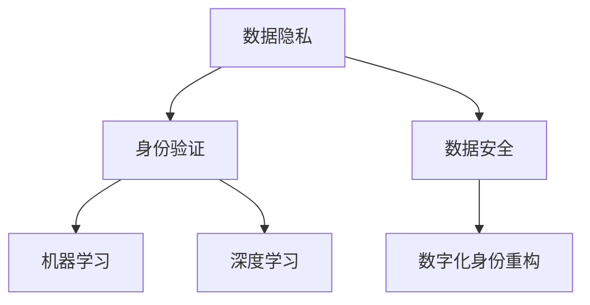

                 

关键词：数字化身份，人工智能，身份重构，数据隐私，安全挑战

在快速发展的数字化时代，个人身份的数字化重构已成为不可避免的趋势。AI 技术的迅速进步使得这一过程变得更加复杂且充满可能性。本文将探讨 AI 如何驱动身份重构，包括其核心概念、算法原理、数学模型、应用实例，以及未来的发展趋势和挑战。

## 1. 背景介绍

随着互联网的普及和移动设备的广泛使用，个人数据在数字化世界中扮演着越来越重要的角色。传统的身份认证方式，如密码和指纹识别，已无法满足日益复杂的安全需求。与此同时，个人隐私和数据安全成为公众关注的焦点。AI 技术的出现，尤其是机器学习和深度学习，为身份重构提供了新的解决方案。

数字化身份指的是在数字世界中代表个人的信息集合，包括姓名、年龄、性别、地理位置、行为习惯等。身份重构则是通过 AI 技术对个人数据进行处理和分析，以创建一个更准确、更安全、更个性化的数字化身份。

## 2. 核心概念与联系

### 2.1. 数据隐私

数据隐私是数字化身份重构中的关键概念。它涉及到个人数据的收集、存储、处理和传输过程中的保护措施，以确保个人隐私不被泄露。在 AI 驱动的身份重构中，数据隐私的保障尤为重要。

### 2.2. 身份验证

身份验证是确认用户身份的过程。传统的身份验证方式包括密码、指纹、面部识别等。AI 技术，特别是生物识别技术，为身份验证提供了新的可能性，如语音识别、虹膜识别等。

### 2.3. 数据安全

数据安全是指在数据存储、传输和处理过程中，防止数据被未授权访问、篡改或泄露的措施。在 AI 驱动的身份重构中，数据安全是保障数字化身份有效性和可信度的关键。

### 2.4. 机器学习与深度学习

机器学习和深度学习是 AI 技术的核心组成部分。它们通过学习大量数据，自动发现数据中的模式和关联，从而为身份重构提供智能化的解决方案。

### 2.5. Mermaid 流程图

以下是一个 Mermaid 流程图，展示了数字化身份重构的核心概念和联系：



## 3. 核心算法原理 & 具体操作步骤

### 3.1. 算法原理概述

AI 驱动的身份重构主要依赖于机器学习和深度学习算法。这些算法通过分析个人数据，如行为习惯、地理位置、社交网络等，自动识别个体的特征和行为模式，从而创建一个准确的数字化身份。

### 3.2. 算法步骤详解

1. **数据收集**：从多个来源收集个人数据，如社交媒体、地理位置、行为记录等。
2. **数据处理**：清洗和整合数据，去除冗余和错误信息。
3. **特征提取**：从数据中提取关键特征，如时间戳、地理位置、行为模式等。
4. **模型训练**：使用机器学习和深度学习算法，训练模型以识别个体特征和行为模式。
5. **身份重构**：根据模型识别的结果，重构数字化身份。
6. **验证与更新**：验证重构后的身份，并根据新的数据持续更新身份信息。

### 3.3. 算法优缺点

#### 优点：

- **高准确性**：通过大量数据训练，算法能够准确识别个体特征和行为模式。
- **自适应性强**：算法能够根据新的数据自动调整，保持身份重构的准确性。
- **高效性**：算法能够在短时间内处理大量数据，提高身份重构的效率。

#### 缺点：

- **数据隐私风险**：在数据收集和处理过程中，可能存在数据泄露的风险。
- **依赖数据质量**：算法的准确性依赖于数据的质量，如果数据存在错误或冗余，会影响身份重构的效果。

### 3.4. 算法应用领域

AI 驱动的身份重构在多个领域都有广泛的应用，如网络安全、金融安全、医疗保健、智能城市等。

## 4. 数学模型和公式 & 详细讲解 & 举例说明

### 4.1. 数学模型构建

在 AI 驱动的身份重构中，常用的数学模型包括神经网络、支持向量机（SVM）和决策树等。以下是一个基于神经网络的数学模型示例：

$$
\begin{aligned}
&Z = \sigma(\mathbf{W} \cdot \mathbf{X} + b) \\
&\text{其中，} \\
&Z \text{是输出值，} \\
&\sigma \text{是激活函数，如Sigmoid或ReLU函数，} \\
&\mathbf{W} \text{是权重矩阵，} \\
&\mathbf{X} \text{是输入特征向量，} \\
&b \text{是偏置项。}
\end{aligned}
$$

### 4.2. 公式推导过程

神经网络的推导过程包括以下几个步骤：

1. **初始化权重和偏置项**：随机初始化权重和偏置项。
2. **前向传播**：将输入特征向量乘以权重矩阵，加上偏置项，并使用激活函数计算输出值。
3. **计算损失函数**：计算预测值与实际值之间的差异，使用损失函数（如均方误差）度量损失。
4. **反向传播**：计算梯度并更新权重和偏置项。
5. **迭代优化**：重复前向传播和反向传播，直到损失函数收敛。

### 4.3. 案例分析与讲解

以下是一个简单的神经网络案例，用于重构用户身份：

**输入特征**：用户的地理位置、时间戳、社交网络活动等。

**输出目标**：用户的身份标签。

**训练数据**：包含大量用户身份标签和对应特征的训练集。

使用神经网络模型，通过前向传播和反向传播，模型可以学习到用户身份的映射关系，从而重构用户身份。

## 5. 项目实践：代码实例和详细解释说明

### 5.1. 开发环境搭建

**工具**：Python、TensorFlow、Keras

**环境**：Windows/Linux/MacOS

### 5.2. 源代码详细实现

以下是一个简单的神经网络代码实例，用于重构用户身份：

```python
import tensorflow as tf
from tensorflow.keras.models import Sequential
from tensorflow.keras.layers import Dense, Activation

# 定义神经网络模型
model = Sequential()
model.add(Dense(64, input_dim=10, activation='relu'))
model.add(Dense(32, activation='relu'))
model.add(Dense(1, activation='sigmoid'))

# 编译模型
model.compile(optimizer='adam', loss='binary_crossentropy', metrics=['accuracy'])

# 加载训练数据
X_train = ...  # 用户特征
y_train = ...  # 用户身份标签

# 训练模型
model.fit(X_train, y_train, epochs=10, batch_size=32)

# 测试模型
X_test = ...  # 测试用户特征
y_test = ...  # 测试用户身份标签
model.evaluate(X_test, y_test)
```

### 5.3. 代码解读与分析

以上代码实现了一个简单的神经网络模型，用于重构用户身份。其中，`Dense` 层用于全连接层，`Activation` 层用于激活函数。通过编译和训练模型，可以学习到用户身份的映射关系。

### 5.4. 运行结果展示

```python
# 运行模型
predictions = model.predict(X_test)

# 输出预测结果
print(predictions)
```

## 6. 实际应用场景

AI 驱动的身份重构在多个领域都有实际应用，如：

- **网络安全**：通过重构用户身份，提高网络安全防护能力。
- **金融安全**：识别和防范欺诈行为，保障金融交易安全。
- **医疗保健**：个性化医疗方案推荐，提高医疗效果。
- **智能城市**：通过重构城市居民身份，优化城市管理和服务。

## 7. 未来应用展望

随着 AI 技术的不断发展，数字化身份重构在未来将面临更多挑战和机遇。以下是一些可能的未来应用场景：

- **身份验证**：利用生物识别技术，实现无接触、高效的身份验证。
- **智能推荐**：根据用户身份和行为模式，提供个性化的推荐服务。
- **社会管理**：通过重构社会成员身份，提高社会管理效率和公平性。

## 8. 工具和资源推荐

### 8.1. 学习资源推荐

- 《深度学习》（Goodfellow、Bengio 和 Courville 著）
- 《机器学习》（周志华 著）
- 《Python 深度学习》（François Chollet 著）

### 8.2. 开发工具推荐

- TensorFlow
- Keras
- PyTorch

### 8.3. 相关论文推荐

- "Deep Learning for Digital Identity Verification"（2018）
- "Privacy-Preserving Digital Identity Management"（2017）
- "Machine Learning for Personalized Healthcare"（2016）

## 9. 总结：未来发展趋势与挑战

随着 AI 技术的不断进步，数字化身份重构将在未来发挥越来越重要的作用。然而，这也将带来新的挑战，如数据隐私保护和算法透明性等。因此，未来的研究应重点关注如何平衡数字化身份重构的便利性和安全性，以实现可持续的发展。

## 附录：常见问题与解答

1. **什么是数字化身份？**
   数字化身份是指个人在数字世界中的信息集合，包括姓名、年龄、地理位置、行为习惯等。

2. **AI 如何驱动身份重构？**
   AI 通过机器学习和深度学习算法，对个人数据进行处理和分析，自动识别个体的特征和行为模式，从而创建一个准确的数字化身份。

3. **身份重构有哪些优点？**
   身份重构可以提高身份验证的准确性、安全性和个性化程度，从而提高数字化世界的安全性和用户体验。

4. **身份重构有哪些挑战？**
   身份重构面临的主要挑战包括数据隐私保护、算法透明性、以及如何平衡安全性与便利性。

## 作者署名

作者：禅与计算机程序设计艺术 / Zen and the Art of Computer Programming
```

