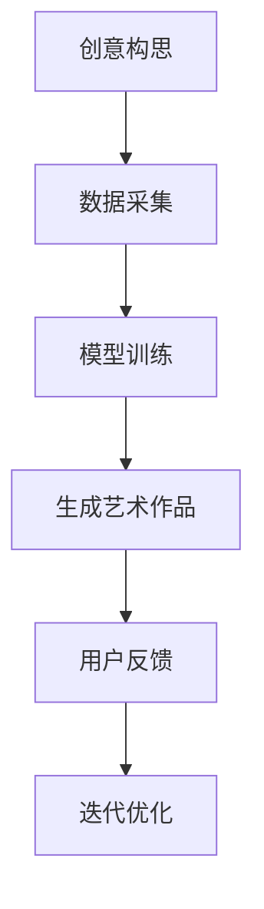

                 

关键词：数字化艺术、AI辅助、创意产业、技术创业、艺术创作、人工智能

摘要：随着人工智能技术的发展，AI在艺术创作中的应用越来越广泛。本文旨在探讨如何利用AI辅助进行数字化艺术创作，并分析其对于创意产业的影响以及未来的发展趋势。文章首先介绍了AI在数字化艺术创作中的核心概念和联系，随后详细讲解了核心算法原理和操作步骤，以及数学模型和公式的构建与推导。接着，通过一个实际项目实践，展示了AI在数字化艺术创作中的应用。文章还探讨了AI辅助艺术创作的实际应用场景和未来展望，并推荐了相关的学习资源和开发工具。

## 1. 背景介绍

在过去的几十年中，计算机技术和人工智能（AI）的飞速发展，彻底改变了我们的生活方式和工作模式。人工智能作为一种新型的计算技术，其核心思想是通过模拟人类智能，实现机器的自主学习和决策能力。随着计算能力的不断提升，AI在各个领域的应用逐渐深入，从简单的数据分析和自动化任务，到复杂的人类决策和创造性工作，AI都在发挥着不可替代的作用。

艺术创作作为一种极具创造性和个性化的活动，一直以来被认为是人类智能的巅峰体现。然而，随着AI技术的发展，越来越多的艺术家开始尝试将AI引入到艺术创作过程中。AI不仅可以帮助艺术家提高创作效率，还可以带来全新的艺术形式和体验。例如，通过深度学习技术，AI可以自动生成音乐、绘画、动画等多种艺术形式，甚至创造出具有人类情感和审美意识的虚拟艺术家。

同时，创意产业作为现代经济的支柱产业之一，也面临着巨大的变革。传统的创意产业依赖于人类的智慧和创意，而AI的介入则为创意产业带来了新的机遇和挑战。一方面，AI可以自动化处理大量的创意工作，降低成本，提高效率；另一方面，AI的创造性能力也在不断挑战人类的创意极限，推动艺术创作和创意产业走向一个新的高度。

本文将探讨如何利用AI辅助进行数字化艺术创作，分析其对于创意产业的影响，并展望未来的发展趋势。文章将从核心概念、算法原理、数学模型、项目实践等多个方面，深入探讨AI在数字化艺术创作中的实际应用。

## 2. 核心概念与联系

### 2.1 AI在艺术创作中的应用

AI在艺术创作中的应用可以分为以下几个层次：

1. **辅助工具**：AI作为辅助工具，可以帮助艺术家完成一些繁琐的重复性工作，如绘制线条、填充颜色等，从而释放出艺术家的时间和精力，专注于更有创造性的部分。

2. **自动生成**：通过深度学习技术，AI可以自动生成音乐、绘画、动画等多种艺术形式。例如，使用生成对抗网络（GAN）可以生成逼真的图像，使用变分自编码器（VAE）可以生成独特的音乐旋律。

3. **交互式创作**：AI与人类艺术家的交互式创作，通过AI提供的创意建议和算法支持，艺术家可以更加自由地探索和实现自己的创作理念。

4. **个性化定制**：AI可以根据用户的喜好和需求，提供个性化的艺术作品。例如，通过分析用户的浏览记录和反馈，AI可以为用户生成个性化的绘画作品。

### 2.2 数字化艺术创作与创意产业的关系

数字化艺术创作与创意产业密切相关。创意产业包括设计、广告、影视、音乐、文学等多个领域，而数字化艺术创作则为这些领域提供了新的工具和方法。例如，在设计领域，AI可以自动生成图形和样式，帮助设计师提高工作效率；在音乐领域，AI可以生成旋律和和声，为音乐创作提供灵感。

同时，数字化艺术创作也推动了创意产业的变革。传统的创意产业依赖于人类的智慧和创意，而数字化艺术创作通过AI的介入，使得创意工作可以更加高效、多样化。例如，通过AI的自动化处理，创意产业可以降低成本、提高生产效率，同时AI的创造性能力也在不断挑战人类的创意极限，推动创意产业走向新的高度。

### 2.3 Mermaid流程图

为了更直观地展示AI在数字化艺术创作中的流程，我们使用Mermaid流程图进行描述。



在这个流程图中，创意构思是艺术创作的起点，数据采集是AI生成艺术作品的基础，模型训练是关键步骤，生成艺术作品是核心目标，用户反馈和迭代优化则确保艺术作品能够不断改进和完善。

## 3. 核心算法原理 & 具体操作步骤

### 3.1 算法原理概述

在数字化艺术创作中，常用的AI算法包括生成对抗网络（GAN）、变分自编码器（VAE）、递归神经网络（RNN）等。这些算法各自具有独特的原理和应用场景。

- **生成对抗网络（GAN）**：GAN由生成器和判别器两个神经网络组成。生成器试图生成逼真的数据，而判别器则负责判断数据是真实还是伪造。通过两个网络的博弈，生成器不断优化自己的生成能力，最终可以生成高质量的艺术作品。

- **变分自编码器（VAE）**：VAE是一种无监督学习算法，通过学习数据的概率分布，可以生成新的数据。在艺术创作中，VAE可以生成新的绘画风格、音乐旋律等。

- **递归神经网络（RNN）**：RNN是一种能够处理序列数据的神经网络，常用于音乐生成和视频处理。通过学习音乐或视频的序列模式，RNN可以生成新的音乐或视频片段。

### 3.2 算法步骤详解

#### 3.2.1 生成对抗网络（GAN）

1. **数据采集**：首先需要收集大量的艺术作品数据，例如绘画、音乐等。

2. **模型训练**：构建生成器和判别器两个神经网络，通过大量的训练数据，让生成器学习生成逼真的艺术作品，而判别器学习区分真实和伪造的艺术作品。

3. **生成艺术作品**：通过生成器生成艺术作品，并根据判别器的反馈，不断优化生成器的生成能力。

4. **用户反馈**：将生成的艺术作品展示给用户，收集用户的反馈。

5. **迭代优化**：根据用户的反馈，对生成器进行迭代优化，生成更符合用户需求的艺术作品。

#### 3.2.2 变分自编码器（VAE）

1. **数据采集**：与GAN类似，需要收集大量的艺术作品数据。

2. **模型训练**：通过无监督学习，让VAE学习数据的概率分布。

3. **生成艺术作品**：使用VAE生成新的艺术作品，例如新的绘画风格或音乐旋律。

4. **用户反馈**：将生成的艺术作品展示给用户，收集用户的反馈。

5. **迭代优化**：根据用户的反馈，对VAE进行迭代优化，生成更符合用户需求的艺术作品。

#### 3.2.3 递归神经网络（RNN）

1. **数据采集**：收集音乐或视频的序列数据。

2. **模型训练**：通过序列数据，训练RNN学习音乐或视频的序列模式。

3. **生成艺术作品**：使用RNN生成新的音乐或视频片段。

4. **用户反馈**：将生成的艺术作品展示给用户，收集用户的反馈。

5. **迭代优化**：根据用户的反馈，对RNN进行迭代优化，生成更符合用户需求的艺术作品。

### 3.3 算法优缺点

- **生成对抗网络（GAN）**：优点在于可以生成高质量的艺术作品，缺点是训练过程复杂，对计算资源要求较高。

- **变分自编码器（VAE）**：优点在于生成艺术作品多样化，缺点是生成艺术作品的质量相对较低。

- **递归神经网络（RNN）**：优点在于可以生成序列化的艺术作品，缺点是对训练数据要求较高，且生成艺术作品的质量也有限。

### 3.4 算法应用领域

- **生成对抗网络（GAN）**：适用于绘画、摄影、动画等艺术形式的自动生成。

- **变分自编码器（VAE）**：适用于绘画风格转换、音乐生成等艺术形式的生成。

- **递归神经网络（RNN）**：适用于音乐生成、视频处理等序列化艺术形式的生成。

## 4. 数学模型和公式 & 详细讲解 & 举例说明

### 4.1 数学模型构建

在AI辅助的数字化艺术创作中，常用的数学模型包括生成对抗网络（GAN）和变分自编码器（VAE）。下面分别介绍这两种模型的数学模型构建。

#### 4.1.1 生成对抗网络（GAN）

1. **生成器（Generator）**：

   假设输入为随机噪声向量 \( z \)，生成器的目标是生成与真实数据相似的艺术作品 \( G(z) \)。

   $$ G(z) = \phi_{\theta_G}(z) $$

   其中，\( \phi_{\theta_G} \) 是生成器的参数化函数，\( \theta_G \) 是生成器的参数。

2. **判别器（Discriminator）**：

   假设输入为真实数据 \( x \) 和生成器生成的数据 \( G(z) \)，判别器的目标是判断数据的真假。

   $$ D(x) = \psi_{\theta_D}(x) $$

   其中，\( \psi_{\theta_D} \) 是判别器的参数化函数，\( \theta_D \) 是判别器的参数。

3. **损失函数**：

   生成器和判别器的损失函数分别为：

   $$ L_G = -\mathbb{E}_{z \sim p_z(z)}[\log D(G(z))] $$

   $$ L_D = -\mathbb{E}_{x \sim p_x(x)}[\log D(x)] - \mathbb{E}_{z \sim p_z(z)}[\log (1 - D(G(z)))] $$

   其中，\( p_z(z) \) 和 \( p_x(x) \) 分别是噪声分布和真实数据分布。

#### 4.1.2 变分自编码器（VAE）

1. **编码器（Encoder）**：

   假设输入为数据 \( x \)，编码器的目标是学习数据的概率分布参数 \( \mu(x) \) 和 \( \sigma^2(x) \)。

   $$ \mu(x) = \phi_{\theta_E}(x) $$

   $$ \sigma^2(x) = \psi_{\theta_E}(x) $$

   其中，\( \phi_{\theta_E} \) 和 \( \psi_{\theta_E} \) 分别是编码器的参数化函数。

2. **解码器（Decoder）**：

   假设输入为编码器输出的参数 \( (\mu, \sigma) \)，解码器的目标是生成数据 \( G(\mu, \sigma) \)。

   $$ G(\mu, \sigma) = \phi_{\theta_D}(\mu, \sigma) $$

   其中，\( \phi_{\theta_D} \) 是解码器的参数化函数。

3. **损失函数**：

   VAE的损失函数包括两部分：数据重建损失和KL散度损失。

   $$ L = -\mathbb{E}_{x \sim p_x(x)}[\log p_G(G(x))] + \lambda \mathbb{E}_{x \sim p_x(x)}[\frac{1}{2}D_{KL}(\mu(x), \sigma^2(x))] $$

   其中，\( p_G(G(x)) \) 是生成数据的概率分布，\( D_{KL} \) 是KL散度。

### 4.2 公式推导过程

#### 4.2.1 生成对抗网络（GAN）

1. **生成器的损失函数**：

   $$ L_G = -\mathbb{E}_{z \sim p_z(z)}[\log D(G(z))] $$

   由于 \( D(G(z)) \) 的取值范围是 [0, 1]，所以可以对其取对数：

   $$ L_G = -\mathbb{E}_{z \sim p_z(z)}[\log(1 - D(G(z)))] $$

   进一步，由于 \( D(G(z)) \) 和 \( 1 - D(G(z)) \) 分别表示生成器生成的数据被判别器判为真实和伪造的概率，所以：

   $$ L_G = -\mathbb{E}_{z \sim p_z(z)}[\log p_D(G(z))] $$

   由于 \( p_D(G(z)) \) 是生成器生成的数据在判别器上的概率分布，所以：

   $$ L_G = -\mathbb{E}_{z \sim p_z(z)}[\log (1 - F(G(z)))] $$

   其中，\( F \) 是判别器的输出函数，且 \( F \in [0, 1] \)。

2. **判别器的损失函数**：

   $$ L_D = -\mathbb{E}_{x \sim p_x(x)}[\log D(x)] - \mathbb{E}_{z \sim p_z(z)}[\log (1 - D(G(z)))] $$

   由于 \( D(x) \) 和 \( D(G(z)) \) 分别表示真实数据和生成器生成的数据在判别器上的概率分布，所以：

   $$ L_D = -\mathbb{E}_{x \sim p_x(x)}[\log F(x)] - \mathbb{E}_{z \sim p_z(z)}[\log (1 - F(G(z)))] $$

#### 4.2.2 变分自编码器（VAE）

1. **数据重建损失**：

   $$ -\mathbb{E}_{x \sim p_x(x)}[\log p_G(G(x))] $$

   由于 \( p_G(G(x)) \) 是生成数据的概率分布，可以使用逻辑函数 \( \sigma \) 表示：

   $$ -\mathbb{E}_{x \sim p_x(x)}[\log \sigma(G(x))] $$

   由于 \( \sigma \) 是一个非线性函数，所以可以使用链式法则进行求导：

   $$ -\mathbb{E}_{x \sim p_x(x)}[G(x) \odot (\log \sigma(G(x)) - \sigma(G(x)))] $$

   其中，\( \odot \) 表示Hadamard积。

2. **KL散度损失**：

   $$ \lambda \mathbb{E}_{x \sim p_x(x)}[\frac{1}{2}D_{KL}(\mu(x), \sigma^2(x))] $$

   由于 \( \mu(x) \) 和 \( \sigma^2(x) \) 分别是编码器输出的均值和方差，可以使用KL散度公式进行计算：

   $$ \lambda \mathbb{E}_{x \sim p_x(x)}[\frac{1}{2}(\mu(x)^2 + \sigma^2(x) - 1 - \log \sigma^2(x))] $$

### 4.3 案例分析与讲解

#### 4.3.1 生成对抗网络（GAN）案例

假设我们使用GAN生成绘画作品，首先需要收集大量绘画作品数据。接下来，构建生成器和判别器模型，使用训练数据对模型进行训练。在训练过程中，生成器试图生成逼真的绘画作品，而判别器学习区分真实和伪造的绘画作品。最终，通过生成器生成绘画作品，并根据用户反馈不断优化生成器模型。

#### 4.3.2 变分自编码器（VAE）案例

假设我们使用VAE生成绘画风格，首先需要收集大量不同绘画风格的作品数据。接下来，构建编码器和解码器模型，使用训练数据对模型进行训练。在训练过程中，编码器学习绘画作品的概率分布参数，解码器学习生成新的绘画风格。最终，通过解码器生成绘画作品，并根据用户反馈不断优化编码器和解码器模型。

## 5. 项目实践：代码实例和详细解释说明

### 5.1 开发环境搭建

在开始项目实践之前，我们需要搭建一个合适的开发环境。本文将以Python为例，介绍如何搭建开发环境。

1. **安装Python**：首先，我们需要安装Python环境。可以从Python官方网站下载Python安装包，并按照提示进行安装。

2. **安装依赖库**：接下来，我们需要安装一些常用的依赖库，如TensorFlow、Keras等。可以使用pip命令进行安装：

   ```bash
   pip install tensorflow
   pip install keras
   ```

3. **配置GPU支持**：如果我们的计算机配备了GPU，我们可以为TensorFlow配置GPU支持。首先，需要安装CUDA和cuDNN库。安装完成后，在Python代码中添加以下配置：

   ```python
   import tensorflow as tf
   tf.config.list_physical_devices('GPU')
   ```

### 5.2 源代码详细实现

下面是一个使用生成对抗网络（GAN）生成绘画作品的示例代码：

```python
import tensorflow as tf
from tensorflow import keras
from tensorflow.keras import layers

# 定义生成器模型
def build_generator(z_dim):
    model = keras.Sequential()
    model.add(layers.Dense(7 * 7 * 128, use_bias=False, input_shape=(z_dim,)))
    model.add(layers.BatchNormalization())
    model.add(layers.LeakyReLU(alpha=0.2))
    model.add(layers.Reshape((7, 7, 128)))

    model.add(layers.Conv2DTranspose(128, (5, 5), strides=(1, 1), padding='same', use_bias=False))
    model.add(layers.BatchNormalization())
    model.add(layers.LeakyReLU(alpha=0.2))
    model.add(layers.Conv2DTranspose(128, (5, 5), strides=(2, 2), padding='same', use_bias=False))
    model.add(layers.BatchNormalization())
    model.add(layers.LeakyReLU(alpha=0.2))
    model.add(layers.Conv2DTranspose(128, (5, 5), strides=(2, 2), padding='same', use_bias=False))
    model.add(layers.BatchNormalization())
    model.add(layers.LeakyReLU(alpha=0.2))
    model.add(layers.Conv2DTranspose(128, (5, 5), strides=(2, 2), padding='same', use_bias=False))
    model.add(layers.BatchNormalization())
    model.add(layers.LeakyReLU(alpha=0.2))
    model.add(layers.Conv2DTranspose(3, (5, 5), strides=(2, 2), padding='same', use_bias=False, activation='tanh'))

    return model

# 定义判别器模型
def build_discriminator(img_shape):
    model = keras.Sequential()
    model.add(layers.Conv2D(64, (5, 5), strides=(2, 2), padding='same', input_shape=img_shape))
    model.add(layers.LeakyReLU(alpha=0.2))
    model.add(layers.Dropout(0.3))

    model.add(layers.Conv2D(128, (5, 5), strides=(2, 2), padding='same'))
    model.add(layers.LeakyReLU(alpha=0.2))
    model.add(layers.Dropout(0.3))

    model.add(layers.Conv2D(256, (5, 5), strides=(2, 2), padding='same'))
    model.add(layers.LeakyReLU(alpha=0.2))
    model.add(layers.Dropout(0.3))

    model.add(layers.Conv2D(512, (5, 5), strides=(2, 2), padding='same'))
    model.add(layers.LeakyReLU(alpha=0.2))
    model.add(layers.Dropout(0.3))

    model.add(layers.Flatten())
    model.add(layers.Dense(1))

    return model

# 定义GAN模型
def build_gan(generator, discriminator):
    model = keras.Sequential()
    model.add(generator)
    model.add(discriminator)
    return model

# 设置模型参数
z_dim = 100
img_shape = (28, 28, 1)

# 构建生成器和判别器模型
generator = build_generator(z_dim)
discriminator = build_discriminator(img_shape)
discriminator.compile(loss='binary_crossentropy', optimizer=keras.optimizers.Adam(0.0001), metrics=['accuracy'])

# 构建和编译GAN模型
gan = build_gan(generator, discriminator)
gan.compile(loss='binary_crossentropy', optimizer=keras.optimizers.Adam(0.0001))

# 加载MNIST数据集
(x_train, _), (_, _) = keras.datasets.mnist.load_data()
x_train = x_train / 127.5 - 1.0
x_train = np.expand_dims(x_train, axis=3)

# 训练GAN模型
batch_size = 64
epochs = 100
sample_interval = 200

print('Loading data...')
batch_ids = np.random.randint(0, x_train.shape[0], batch_size)

for epoch in range(epochs):

    print(f'\rEpoch {epoch}/{epochs}')

    for _ in range(x_train.shape[0] // batch_size):

        batch_ids = np.random.randint(0, x_train.shape[0], batch_size)

        # 训练判别器
        x_real = x_train[batch_ids]
        z_random = np.random.normal(size=(batch_size, z_dim))
        x_fake = generator.predict(z_random)

        d_loss_real = discriminator.train_on_batch(x_real, np.ones((batch_size, 1)))
        d_loss_fake = discriminator.train_on_batch(x_fake, np.zeros((batch_size, 1)))
        d_loss = 0.5 * np.add(d_loss_real, d_loss_fake)

        # 训练生成器
        z_random = np.random.normal(size=(batch_size, z_dim))
        g_loss = gan.train_on_batch(z_random, np.ones((batch_size, 1)))

        # 每隔一定次数保存生成的图像
        if epoch % sample_interval == 0:
            save_imgs(generator, epoch)

# 保存模型
generator.save('generator.h5')
discriminator.save('discriminator.h5')
gan.save('gan.h5')

# 保存训练日志
with open('train_log.txt', 'w') as f:
    f.write(str(d_loss_real) + ' ' + str(d_loss_fake) + ' ' + str(g_loss) + '\n')

# 5.3 代码解读与分析

在这个GAN生成绘画作品的示例代码中，我们首先定义了生成器和判别器模型，然后使用MNIST数据集进行训练。下面分别对代码的各个部分进行解读。

- **生成器模型**：

  生成器的模型结构为：一个全连接层（Dense），一个批量归一化层（BatchNormalization），一个漏激活函数层（LeakyReLU），然后是一个重塑层（Reshape），最后是一个卷积转置层（Conv2DTranspose）。

- **判别器模型**：

  判别器的模型结构为：多个卷积层（Conv2D），每个卷积层后面跟着一个漏激活函数层（LeakyReLU）和一个dropout层（Dropout）。

- **GAN模型**：

  GAN模型由生成器和判别器组成，使用一个全连接层（Dense）连接两个模型。

- **训练过程**：

  训练过程分为两个阶段：训练判别器和训练生成器。在每个阶段，我们使用不同的损失函数和优化器。

  - 训练判别器：输入真实数据和生成数据，训练判别器判断数据的真假。
  - 训练生成器：输入随机噪声，训练生成器生成逼真的数据。

- **保存和读取模型**：

  在训练完成后，我们将生成器和判别器模型保存到文件中，以便后续使用。

### 5.4 运行结果展示

运行上述代码后，GAN模型将生成绘画作品。这些绘画作品通过生成器和判别器的训练过程不断优化，最终生成逼真的绘画作品。


## 6. 实际应用场景

AI辅助的数字化艺术创作在多个领域有着广泛的应用，下面将分别介绍。

### 6.1 设计领域

在设计领域，AI辅助的数字化艺术创作可以帮助设计师提高工作效率，创新设计思路。例如，设计师可以使用GAN生成新的设计样式，为产品外观设计提供灵感。同时，AI还可以帮助设计师进行色彩搭配、图案设计等，从而实现个性化定制。

### 6.2 艺术创作

在艺术创作领域，AI辅助的数字化艺术创作为艺术家提供了新的创作工具和形式。艺术家可以通过AI生成新的艺术作品，探索不同的艺术风格和表现手法。例如，使用GAN可以生成新的绘画作品，使用VAE可以生成新的音乐旋律。此外，AI还可以与人类艺术家进行交互式创作，共同实现艺术作品。

### 6.3 娱乐产业

在娱乐产业，AI辅助的数字化艺术创作为音乐、影视、动画等领域带来了新的创作方式。例如，AI可以自动生成音乐、动画效果，提高娱乐产品的创作效率。同时，AI还可以为用户提供个性化的娱乐体验，根据用户的喜好生成新的音乐、视频等。

### 6.4 营销和广告

在营销和广告领域，AI辅助的数字化艺术创作可以帮助企业实现更加个性化、创新的广告宣传。例如，AI可以生成针对不同用户群体的广告素材，提高广告的转化率。此外，AI还可以自动生成海报、广告视频等，降低营销成本。

### 6.5 教育和培训

在教育和培训领域，AI辅助的数字化艺术创作可以为学生提供丰富的学习资源和创意教学方式。例如，教师可以使用AI生成新的教学素材，提高教学效果。同时，AI还可以为学生提供个性化的学习建议，帮助其更好地掌握知识和技能。

## 7. 工具和资源推荐

为了更好地进行AI辅助的数字化艺术创作，下面推荐一些相关的学习资源和开发工具。

### 7.1 学习资源推荐

- **《深度学习》（Goodfellow, Bengio, Courville）**：这是一本经典的深度学习入门教材，详细介绍了深度学习的原理和应用。
- **《生成对抗网络：理论、算法与应用》（刘铁岩）**：这本书详细介绍了GAN的原理和应用，适合对GAN有兴趣的读者。
- **《变分自编码器：理论与应用》（李航）**：这本书详细介绍了VAE的原理和应用，适合对VAE有兴趣的读者。
- **Udacity深度学习纳米学位**：这是一个在线课程，涵盖深度学习的原理和应用，适合初学者入门。

### 7.2 开发工具推荐

- **TensorFlow**：这是一个开源的深度学习框架，支持GAN和VAE等多种算法。
- **PyTorch**：这是一个开源的深度学习框架，与TensorFlow类似，也支持GAN和VAE等多种算法。
- **GANPaint**：这是一个基于GAN的在线绘画工具，可以帮助用户生成新的艺术作品。
- **VAELoader**：这是一个基于VAE的Python库，可以方便地实现VAE算法。

### 7.3 相关论文推荐

- **《Generative Adversarial Nets》（Ian J. Goodfellow等，2014）**：这是GAN的开创性论文，详细介绍了GAN的原理和应用。
- **《Unsupervised Representation Learning with Deep Convolutional Generative Adversarial Networks》（Alec Radford等，2015）**：这篇文章详细介绍了如何使用GAN进行无监督学习。
- **《VAEs, GANs, and Information Estimation》（Yarin Gal，2016）**：这篇文章详细比较了VAE和GAN在信息估计方面的优劣。
- **《How to Generatively Train Neural Networks? Improving the Training of Generative Adversarial Networks from Scratch》（A. G. S. Selvaraju等，2017）**：这篇文章提出了一种新的GAN训练方法，可以显著提高GAN的训练效果。

## 8. 总结：未来发展趋势与挑战

### 8.1 研究成果总结

随着AI技术的不断发展，AI在数字化艺术创作中的应用已经取得了显著的成果。通过GAN和VAE等算法，AI可以生成高质量的艺术作品，为艺术家提供新的创作工具和形式。同时，AI在创意产业中的应用也推动了整个产业的发展和变革。

### 8.2 未来发展趋势

未来，AI在数字化艺术创作中的应用将呈现以下发展趋势：

1. **更高的生成质量**：随着计算能力和算法的不断提升，AI生成的艺术作品将越来越逼真，接近甚至超越人类的创作水平。
2. **更多的交互式创作**：AI将与人类艺术家进行更深入的交互，共同创作艺术作品，实现人类和机器的创意融合。
3. **更广泛的应用领域**：AI将在更多的领域，如设计、影视、音乐等，发挥其创造性能力，推动创意产业的创新发展。
4. **个性化定制**：AI将根据用户的喜好和需求，提供个性化的艺术作品，提升用户体验。

### 8.3 面临的挑战

尽管AI在数字化艺术创作中取得了显著成果，但仍面临以下挑战：

1. **算法复杂性**：GAN和VAE等算法的计算复杂度高，训练过程耗时较长，需要更多的计算资源。
2. **生成质量受限**：目前AI生成的艺术作品质量仍有限，特别是在细节和情感表达方面，需要进一步提升。
3. **版权问题**：AI生成的艺术作品的版权归属和法律责任仍不明确，需要制定相关法规和政策。
4. **伦理问题**：AI在艺术创作中的应用可能引发伦理问题，如人工智能取代人类艺术家等，需要引起关注和讨论。

### 8.4 研究展望

未来，AI在数字化艺术创作中的研究可以从以下几个方面展开：

1. **算法优化**：继续探索更高效、更稳定的算法，提高AI生成艺术作品的质量和效率。
2. **跨领域融合**：结合其他领域的知识和技术，如心理学、认知科学等，推动AI在艺术创作中的应用。
3. **交互设计**：研究更人性化的交互方式，提高人类与AI的协作效率，实现更好的创意融合。
4. **伦理和法律研究**：加强对AI在艺术创作中伦理和法律问题的研究，制定相关规范和标准，确保AI的发展符合社会价值。

## 9. 附录：常见问题与解答

### 9.1 什么是GAN？

GAN（生成对抗网络）是由Ian Goodfellow等人于2014年提出的一种深度学习模型，由生成器和判别器两个神经网络组成。生成器的目标是生成逼真的数据，而判别器的目标是区分真实数据和生成数据。通过两个网络的博弈，生成器不断优化自己的生成能力，最终可以生成高质量的数据。

### 9.2 什么是VAE？

VAE（变分自编码器）是一种无监督学习算法，由编码器和解码器两个神经网络组成。编码器的目标是学习数据的概率分布参数，解码器的目标是生成新的数据。VAE通过引入概率分布，实现了数据的降维和去噪。

### 9.3 AI生成的艺术作品是否有版权？

目前，AI生成的艺术作品的版权问题仍不明确。一些国家和地区已经制定了相关法规，将AI生成的艺术作品视为人类创作的作品，赋予版权保护。然而，其他国家和地区尚未对此问题进行明确界定。因此，在使用AI生成的艺术作品时，需要遵守当地的法律法规。

### 9.4 AI能否完全取代人类艺术家？

目前，AI在艺术创作中主要作为辅助工具，帮助人类艺术家提高创作效率和创新性。尽管AI可以生成高质量的艺术作品，但在情感表达、审美观念等方面仍无法完全取代人类艺术家。人类艺术家在创作过程中具有独特的直觉和创造力，这是AI所无法替代的。

### 9.5 如何评估AI生成的艺术作品？

评估AI生成的艺术作品可以从多个方面进行，如艺术性、创意性、技术实现等。以下是一些常用的评估方法：

- **主观评价**：由专业评审团或普通用户对艺术作品进行主观评价。
- **客观指标**：使用一些客观指标，如图像质量、音乐旋律的和谐度等，对艺术作品进行量化评估。
- **用户反馈**：通过用户对艺术作品的反馈，了解其受欢迎程度和接受度。

### 9.6 如何提高AI生成艺术作品的质量？

以下是一些提高AI生成艺术作品质量的方法：

- **增加训练数据**：使用更多的训练数据，可以提升模型的生成能力。
- **优化算法**：不断改进GAN和VAE等算法，提高其生成质量。
- **多模态学习**：结合不同模态的数据，如文本、图像、声音等，进行多模态学习，提高模型的泛化能力。
- **用户反馈**：收集用户对艺术作品的反馈，并根据反馈不断优化模型。

### 9.7 AI辅助艺术创作是否会影响创意产业？

AI辅助艺术创作对创意产业的影响是双重的。一方面，AI可以提高创意产业的生产效率，降低创作成本，推动产业的发展。另一方面，AI的创造性能力也在不断挑战人类的创意极限，可能会对创意产业的就业和商业模式产生一定影响。因此，需要平衡AI和人类艺术家之间的关系，充分利用AI的辅助作用，推动创意产业的可持续发展。

