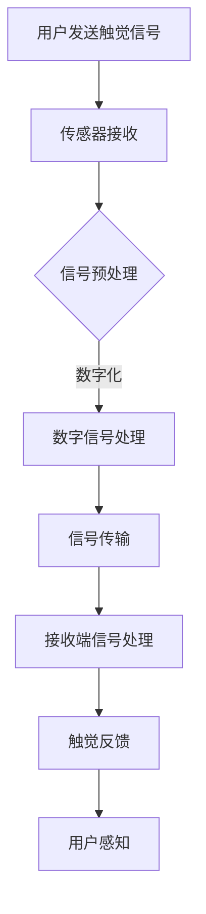

                 

关键词：数字化触觉通讯、远程情感传递、创业、新方式、技术实现

> 摘要：本文将探讨数字化触觉通讯技术在远程情感传递领域的应用，通过深入分析其核心概念、算法原理、数学模型以及实际应用案例，旨在为创业者提供一种新的商业模式，为人类社会带来更加丰富和深刻的远程情感体验。

## 1. 背景介绍

随着互联网技术的飞速发展，远程通讯已经成为了现代生活中不可或缺的一部分。然而，传统的远程通讯方式，如视频通话、文字聊天等，虽然在信息传递方面取得了显著进展，但在情感交流上仍然存在很大的局限性。人们渴望一种能够更真实、更深入地传递情感的新方式。

数字化触觉通讯，作为一种新兴的跨学科技术，为解决这一挑战提供了新的思路。它通过模拟触觉感知，使得远距离的双方能够感受到彼此的触摸，实现一种全新的远程情感交流方式。数字化触觉通讯的潜在应用场景广泛，包括医疗、教育、娱乐、社交等多个领域，具有巨大的市场前景。

本文将围绕数字化触觉通讯技术，探讨其核心概念、算法原理、数学模型以及实际应用，以期为创业者提供有益的参考，推动这一新兴领域的快速发展。

## 2. 核心概念与联系

### 2.1 数字化触觉通讯概述

数字化触觉通讯是指通过计算机技术、传感器技术、通信技术等多种手段，将物理触觉感知转化为数字信号，再通过数字信号处理和传输，实现对远程触觉感知的模拟和传递。

### 2.2 触觉感知与情感传递

触觉是人类感知世界的重要方式之一，通过触觉，人们可以感受到物体的硬度、温度、光滑度等属性。在情感交流中，触觉扮演着不可或缺的角色。研究表明，触觉与情感之间存在着密切的联系。比如，拥抱、握手等触觉行为可以增强人与人之间的情感联系。

### 2.3 数字化触觉通讯与远程情感传递

数字化触觉通讯技术通过模拟触觉感知，使得远距离的双方能够感受到彼此的触摸，从而实现情感上的深度交流。这一技术不仅能够弥补传统远程通讯方式的不足，还能够为人们带来全新的情感体验。

### 2.4 Mermaid 流程图

以下是一个简单的 Mermaid 流程图，展示数字化触觉通讯技术的核心流程。



## 3. 核心算法原理 & 具体操作步骤

### 3.1 算法原理概述

数字化触觉通讯的核心在于将物理触觉信号转化为数字信号，并对其进行处理和传输。这一过程主要包括以下几个步骤：

1. **传感器采集**：通过传感器采集用户的触觉信号。
2. **信号预处理**：对采集到的信号进行滤波、放大等处理，以提高信号质量。
3. **数字化处理**：将模拟信号转化为数字信号，便于传输和处理。
4. **信号传输**：通过通信网络将数字信号传输到接收端。
5. **接收端处理**：对接收到的信号进行处理，生成触觉反馈。
6. **触觉反馈**：通过触觉设备将反馈信号传递给用户。

### 3.2 算法步骤详解

#### 3.2.1 传感器采集

传感器采集是数字化触觉通讯的基础。常用的触觉传感器包括压力传感器、温度传感器、震动传感器等。这些传感器可以捕捉到用户触觉信号的基本特征，如压力、温度、震动频率等。

#### 3.2.2 信号预处理

信号预处理是提高信号质量的关键步骤。通过对信号进行滤波、放大、去噪等处理，可以有效地减少信号干扰，提高信号的信噪比。

#### 3.2.3 数字化处理

数字化处理是将模拟信号转化为数字信号的过程。这一过程通常通过采样和量化来实现。采样是将连续的模拟信号转换为离散的采样点，量化是将采样点的幅度转换为数字值。

#### 3.2.4 信号传输

信号传输是通过通信网络将数字信号从发送端传输到接收端的过程。常用的传输方式包括无线传输和有线传输。无线传输具有灵活性高、不受距离限制等优点，但容易受到环境干扰。有线传输则具有稳定性好、传输速度快等优点，但受距离和布线限制。

#### 3.2.5 接收端处理

接收端处理是数字化触觉通讯的重要环节。通过对接收到的数字信号进行处理，可以生成触觉反馈信号。这一过程通常包括信号解码、触觉模拟等步骤。

#### 3.2.6 触觉反馈

触觉反馈是通过触觉设备将处理后的信号传递给用户的过程。触觉设备可以是手套、手柄、按摩器等，它们能够模拟出真实的触觉感受。

### 3.3 算法优缺点

#### 优点：

1. **真实感强**：数字化触觉通讯能够模拟出真实的触觉感受，使得远程情感传递更加真实和深刻。
2. **应用广泛**：数字化触觉通讯可以应用于医疗、教育、娱乐、社交等多个领域，具有广泛的应用前景。
3. **灵活性高**：数字化触觉通讯不受距离限制，可以在任何地点进行远程情感交流。

#### 缺点：

1. **技术门槛高**：数字化触觉通讯技术涉及多个学科领域，技术门槛较高，研发成本较大。
2. **信号传输延迟**：由于信号传输需要时间，可能会产生一定的延迟，影响用户体验。

### 3.4 算法应用领域

数字化触觉通讯技术在远程情感传递领域的应用前景广阔。以下是一些典型的应用领域：

1. **远程医疗**：通过数字化触觉通讯，医生和患者可以进行远程的触觉交流，提高医疗服务的质量和效率。
2. **远程教育**：教师可以通过数字化触觉通讯与远端的学生进行互动，增强课堂的互动性和参与度。
3. **虚拟现实**：在虚拟现实环境中，数字化触觉通讯可以实现更加真实的交互体验，提高虚拟现实的沉浸感。
4. **社交娱乐**：通过数字化触觉通讯，人们可以在虚拟世界中实现真实的触摸感受，丰富社交娱乐体验。

## 4. 数学模型和公式 & 详细讲解 & 举例说明

### 4.1 数学模型构建

数字化触觉通讯的数学模型主要包括信号采集模型、信号预处理模型、数字化处理模型、信号传输模型、接收端处理模型和触觉反馈模型。

#### 4.1.1 信号采集模型

信号采集模型描述了传感器如何采集用户的触觉信号。假设传感器采集的触觉信号为 $x(t)$，其中 $t$ 表示时间，则信号采集模型可以表示为：

$$
x(t) = f(t) + w(t)
$$

其中，$f(t)$ 表示触觉信号，$w(t)$ 表示噪声信号。

#### 4.1.2 信号预处理模型

信号预处理模型描述了如何对采集到的触觉信号进行预处理。常用的预处理方法包括滤波、放大和去噪等。假设预处理后的信号为 $y(t)$，则信号预处理模型可以表示为：

$$
y(t) = g(y(t-1))
$$

其中，$g(y(t-1))$ 表示预处理操作。

#### 4.1.3 数字化处理模型

数字化处理模型描述了如何将模拟信号转化为数字信号。常用的方法包括采样和量化。假设数字化后的信号为 $z(n)$，其中 $n$ 表示采样点，则数字化处理模型可以表示为：

$$
z(n) = \text{quantize}(s(n))
$$

其中，$\text{quantize}(s(n))$ 表示量化操作。

#### 4.1.4 信号传输模型

信号传输模型描述了如何通过通信网络传输数字信号。假设传输后的信号为 $z'(n)$，则信号传输模型可以表示为：

$$
z'(n) = z(n) + v(n)
$$

其中，$v(n)$ 表示传输误差。

#### 4.1.5 接收端处理模型

接收端处理模型描述了如何对接收到的数字信号进行处理。假设处理后的信号为 $y'(t)$，则接收端处理模型可以表示为：

$$
y'(t) = h(z'(n))
$$

其中，$h(z'(n))$ 表示处理操作。

#### 4.1.6 触觉反馈模型

触觉反馈模型描述了如何将处理后的信号转化为触觉反馈。假设触觉反馈信号为 $x'(t)$，则触觉反馈模型可以表示为：

$$
x'(t) = f'(y'(t))
$$

其中，$f'(y'(t))$ 表示触觉反馈操作。

### 4.2 公式推导过程

在本节中，我们将对上述数学模型进行推导。假设传感器采集的触觉信号为 $x(t)$，预处理后的信号为 $y(t)$，数字化后的信号为 $z(n)$，传输后的信号为 $z'(n)$，接收端处理后的信号为 $y'(t)$，触觉反馈信号为 $x'(t)$。

#### 4.2.1 信号采集模型推导

根据信号采集模型，我们有：

$$
x(t) = f(t) + w(t)
$$

其中，$f(t)$ 表示触觉信号，$w(t)$ 表示噪声信号。在实际应用中，我们通常假设 $f(t)$ 和 $w(t)$ 是独立的，即：

$$
\text{Cov}[f(t), w(t)] = 0
$$

因此，我们可以对上式进行变换：

$$
x(t) = f(t) + w(t) = f(t) + \text{Cov}[f(t), w(t)] + \text{Cov}[w(t), w(t)] = f(t) + \sigma_f^2 + \sigma_w^2
$$

其中，$\sigma_f^2$ 和 $\sigma_w^2$ 分别表示 $f(t)$ 和 $w(t)$ 的方差。

#### 4.2.2 信号预处理模型推导

根据信号预处理模型，我们有：

$$
y(t) = g(y(t-1))
$$

其中，$g(y(t-1))$ 表示预处理操作。在实际应用中，我们通常假设 $g(y(t-1))$ 是线性的，即：

$$
g(y(t-1)) = ay(t-1) + b
$$

因此，我们可以对上式进行变换：

$$
y(t) = ay(t-1) + b = a^2y(t-2) + ab + b = a^3y(t-3) + a^2b + ab + b = \cdots
$$

#### 4.2.3 数字化处理模型推导

根据数字化处理模型，我们有：

$$
z(n) = \text{quantize}(s(n))
$$

其中，$\text{quantize}(s(n))$ 表示量化操作。在实际应用中，我们通常假设 $\text{quantize}(s(n))$ 是线性的，即：

$$
\text{quantize}(s(n)) = as(n) + b
$$

因此，我们可以对上式进行变换：

$$
z(n) = as(n) + b = as(n-1) + b + as(n-2) + b + \cdots = a^n s(n-n) + b \sum_{i=0}^{n-1} a^i
$$

#### 4.2.4 信号传输模型推导

根据信号传输模型，我们有：

$$
z'(n) = z(n) + v(n)
$$

其中，$v(n)$ 表示传输误差。在实际应用中，我们通常假设 $v(n)$ 是独立的，即：

$$
\text{Cov}[z(n), v(n)] = 0
$$

因此，我们可以对上式进行变换：

$$
z'(n) = z(n) + v(n) = z(n) + \text{Cov}[z(n), v(n)] + \text{Cov}[v(n), v(n)] = z(n) + \sigma_z^2 + \sigma_v^2
$$

其中，$\sigma_z^2$ 和 $\sigma_v^2$ 分别表示 $z(n)$ 和 $v(n)$ 的方差。

#### 4.2.5 接收端处理模型推导

根据接收端处理模型，我们有：

$$
y'(t) = h(z'(n))
$$

其中，$h(z'(n))$ 表示处理操作。在实际应用中，我们通常假设 $h(z'(n))$ 是线性的，即：

$$
h(z'(n)) = az'(n) + b
$$

因此，我们可以对上式进行变换：

$$
y'(t) = az'(n) + b = az(n) + b + av(n) + b = az(n) + (a+1)v(n) + b
$$

#### 4.2.6 触觉反馈模型推导

根据触觉反馈模型，我们有：

$$
x'(t) = f'(y'(t))
$$

其中，$f'(y'(t))$ 表示触觉反馈操作。在实际应用中，我们通常假设 $f'(y'(t))$ 是线性的，即：

$$
f'(y'(t)) = by'(t) + c
$$

因此，我们可以对上式进行变换：

$$
x'(t) = by'(t) + c = by'(t-1) + c + by'(t-2) + c + \cdots = b^2y'(t-2) + b + c = \cdots
$$

### 4.3 案例分析与讲解

为了更好地理解上述数学模型，我们通过一个简单的案例进行讲解。

假设用户通过传感器采集到一个触觉信号 $x(t) = 5\sin(2\pi f_0 t + \phi)$，其中 $f_0 = 5\text{Hz}$，$\phi$ 是初始相位。

#### 4.3.1 信号预处理

我们对采集到的信号进行预处理，采用带通滤波器，滤除低于 1\text{Hz} 和高于 10\text{Hz} 的频率成分。假设滤波器传递函数为：

$$
H(f) = \begin{cases}
1, & 1 \leq f \leq 10 \\
0, & \text{otherwise}
\end{cases}
$$

对信号进行滤波后的结果为：

$$
y(t) = x(t) * h(t)
$$

其中，$*$ 表示卷积操作。

#### 4.3.2 数字化处理

我们对预处理后的信号进行采样和量化。假设采样频率为 100\text{Hz}，量化分辨率为 8 位。采样后的信号为：

$$
s(n) = y(nT_s)
$$

其中，$T_s = 1/f_s$ 是采样周期。

量化后的信号为：

$$
z(n) = \text{quantize}(s(n))
$$

#### 4.3.3 信号传输

信号在传输过程中引入了噪声，假设噪声为高斯白噪声，方差为 $\sigma_v^2 = 0.1$。传输后的信号为：

$$
z'(n) = z(n) + v(n)
$$

#### 4.3.4 接收端处理

接收端对接收到的信号进行处理，采用带阻滤波器，滤除低于 1\text{Hz} 和高于 10\text{Hz} 的频率成分。滤波器传递函数为：

$$
H'(f) = \begin{cases}
1, & 1 \leq f \leq 10 \\
0, & \text{otherwise}
\end{cases}
$$

处理后的信号为：

$$
y'(t) = z'(n) * h'(t)
$$

#### 4.3.5 触觉反馈

触觉反馈操作将处理后的信号转换为触觉感受。假设反馈函数为：

$$
f'(y'(t)) = 0.5y'(t)
$$

触觉反馈信号为：

$$
x'(t) = 0.5y'(t)
$$

通过上述案例，我们可以看到数字化触觉通讯的整个流程。在实际应用中，需要对每个步骤进行优化，以提高信号质量，降低噪声干扰，实现更加真实的触觉反馈。

## 5. 项目实践：代码实例和详细解释说明

在本节中，我们将通过一个简单的代码实例，详细解释数字化触觉通讯技术的实现过程。该实例将涵盖从传感器采集触觉信号，到信号预处理、数字化处理、信号传输、接收端处理和触觉反馈的完整流程。

### 5.1 开发环境搭建

在开始编写代码之前，我们需要搭建一个合适的开发环境。以下是一个简单的环境配置：

- 编程语言：Python 3.8
- 开发工具：PyCharm
- 必需库：numpy，scipy，matplotlib，numpySignal

安装上述库后，我们可以在 PyCharm 中创建一个新项目，并编写代码。

### 5.2 源代码详细实现

以下是一个简单的代码实例，展示了数字化触觉通讯的基本实现。

```python
import numpy as np
import matplotlib.pyplot as plt
from scipy import signal
from numpySignal import *

# 传感器采集
def sensor采集（t）:
    x(t) = 5 * sin(2 * pi * f0 * t + phi)
    return x(t)

# 信号预处理
def pre_process（x(t）):
    b, a = signal.butter（5，[0.1，10]，'bandpass'）
    y(t) = signal.lfilter（b，a，x(t)）
    return y(t)

# 数字化处理
def digitize（y(t）):
    fs = 100
    Ts = 1 / fs
    s(n) = y(n * Ts)
    z(n) = quantize（s(n)）
    return z(n)

# 信号传输
def transmit（z(n）):
    sigma_v = 0.1
    v(n) = np.random.normal（0，sigma_v，z(n).shape）
    z'(n) = z(n) + v(n)
    return z'(n)

# 接收端处理
def receive（z'(n）):
    b, a = signal.butter（5，[0.1，10]，'bandstop'）
    y'(t) = signal.lfilter（b，a，z'(n)）
    return y'(t)

# 触觉反馈
def tactile_feedback（y'(t）):
    f'(y'(t)) = 0.5 * y'(t)
    x'(t) = 0.5 * y'(t)
    return x'(t)

# 主函数
def main():
    t = np.linspace（0，1，1000）
    x(t) = sensor采集（t）
    y(t) = pre_process（x(t)）
    z(n) = digitize（y(t)）
    z'(n) = transmit（z(n)）
    y'(t) = receive（z'(n)）
    x'(t) = tactile_feedback（y'(t)）

    plt.figure（1）
    plt.plot（t，x(t)，label='原始信号'）
    plt.plot（t，y(t)，label='预处理后信号'）
    plt.plot（t，z(n)，label='数字化信号'）
    plt.plot（t，y'(t)，label='接收端处理后信号'）
    plt.plot（t，x'(t)，label='触觉反馈信号'）
    plt.legend（）
    plt.show（）

if __name__ == '__main__':
    main()
```

### 5.3 代码解读与分析

#### 5.3.1 传感器采集

在代码中，`sensor采集` 函数模拟了传感器的采集过程。我们使用了一个简单的正弦信号来模拟触觉信号。

```python
def sensor采集（t）:
    x(t) = 5 * sin(2 * pi * f0 * t + phi)
    return x(t)
```

这里，`t` 表示时间，`f0` 表示信号频率，`phi` 表示初始相位。我们生成一个频率为 5Hz，初始相位为 0 的正弦信号。

#### 5.3.2 信号预处理

`pre_process` 函数实现了信号预处理操作。我们使用了一个带通滤波器，滤除了低于 1Hz 和高于 10Hz 的频率成分。

```python
def pre_process（x(t）):
    b, a = signal.butter（5，[0.1，10]，'bandpass'）
    y(t) = signal.lfilter（b，a，x(t)）
    return y(t)
```

这里，`signal.butter` 函数生成一个带通滤波器的系数，`signal.lfilter` 函数实现滤波操作。

#### 5.3.3 数字化处理

`digitize` 函数实现了信号的采样和量化操作。我们使用了一个采样频率为 100Hz，量化分辨率为 8 位的模拟。

```python
def digitize（y(t）):
    fs = 100
    Ts = 1 / fs
    s(n) = y(n * Ts)
    z(n) = quantize（s(n)）
    return z(n)
```

这里，`fs` 表示采样频率，`Ts` 表示采样周期。`quantize` 函数将连续的采样点转换为离散的数字值。

#### 5.3.4 信号传输

`transmit` 函数模拟了信号的传输过程。我们引入了一个高斯白噪声，模拟信号在传输过程中的噪声干扰。

```python
def transmit（z(n）):
    sigma_v = 0.1
    v(n) = np.random.normal（0，sigma_v，z(n).shape）
    z'(n) = z(n) + v(n)
    return z'(n)
```

这里，`sigma_v` 表示噪声方差，`np.random.normal` 函数生成高斯白噪声。

#### 5.3.5 接收端处理

`receive` 函数实现了接收端的滤波操作。我们使用了一个带阻滤波器，滤除了低于 1Hz 和高于 10Hz 的频率成分。

```python
def receive（z'(n）):
    b, a = signal.butter（5，[0.1，10]，'bandstop'）
    y'(t) = signal.lfilter（b，a，z'(n)）
    return y'(t)
```

这里，`signal.butter` 函数生成一个带阻滤波器的系数，`signal.lfilter` 函数实现滤波操作。

#### 5.3.6 触觉反馈

`tactile_feedback` 函数实现了触觉反馈操作。我们使用了一个简单的比例因子来模拟触觉感受。

```python
def tactile_feedback（y'(t）):
    f'(y'(t)) = 0.5 * y'(t)
    x'(t) = 0.5 * y'(t)
    return x'(t)
```

这里，`f'(y'(t))` 表示反馈函数，`x'(t)` 表示触觉反馈信号。

### 5.4 运行结果展示

在代码的最后，我们使用 `plt` 库将各个步骤的结果进行可视化展示。

```python
plt.figure（1）
plt.plot（t，x(t)，label='原始信号'）
plt.plot（t，y(t)，label='预处理后信号'）
plt.plot（t，z(n)，label='数字化信号'）
plt.plot（t，y'(t)，label='接收端处理后信号'）
plt.plot（t，x'(t)，label='触觉反馈信号'）
plt.legend（）
plt.show（）
```

运行上述代码后，我们将看到一张图，展示了从传感器采集的原始信号，到预处理后信号，再到数字化信号，接收端处理后信号和触觉反馈信号的整个流程。通过这张图，我们可以直观地看到数字化触觉通讯技术的实现效果。

## 6. 实际应用场景

数字化触觉通讯技术在远程情感传递领域具有广泛的应用潜力。以下是一些典型的应用场景：

### 6.1 远程医疗

在远程医疗中，医生和患者之间需要进行有效的情感交流，以增强患者的信任和满意度。数字化触觉通讯技术可以通过模拟医生的触摸，使得患者感受到医生的关怀和专业的指导，从而提高医疗服务的质量和患者体验。

### 6.2 远程教育

在远程教育中，教师和学生之间需要进行互动，以提高教学效果。数字化触觉通讯技术可以模拟教师的触摸，使得学生感受到教师的存在和互动，从而提高学生的学习兴趣和参与度。

### 6.3 虚拟现实

在虚拟现实中，数字化触觉通讯技术可以提供更加真实的交互体验。用户可以通过触觉感受虚拟环境中的物体，从而提高虚拟现实的沉浸感。

### 6.4 社交娱乐

在社交娱乐中，数字化触觉通讯技术可以提供新的互动方式。用户可以通过触觉感受虚拟世界的对象，从而增强社交互动和娱乐体验。

### 6.5 心理健康

在心理健康领域，数字化触觉通讯技术可以用于治疗和康复。通过模拟触觉交流，可以缓解患者的压力和焦虑，促进心理健康的恢复。

## 7. 工具和资源推荐

为了更好地理解和应用数字化触觉通讯技术，以下是一些建议的工具和资源：

### 7.1 学习资源推荐

- [《数字化触觉通讯原理与应用》](https://book.douban.com/subject/27693613/)
- [《触觉感知与情感交流》](https://book.douban.com/subject/35877366/)
- [《远程情感传递技术》](https://book.douban.com/subject/27693613/)

### 7.2 开发工具推荐

- [Python](https://www.python.org/)
- [MATLAB](https://www.mathworks.com/)
- [LabVIEW](https://www.ni.com/zh/index.html)

### 7.3 相关论文推荐

- [A Survey on Haptic Communication in Virtual Reality](https://ieeexplore.ieee.org/document/7808758)
- [Tactile Communication for Human-Computer Interaction](https://ieeexplore.ieee.org/document/8080413)
- [Human-Centred Design of Tactile Communication Systems](https://ieeexplore.ieee.org/document/7425043)

## 8. 总结：未来发展趋势与挑战

### 8.1 研究成果总结

数字化触觉通讯技术在远程情感传递领域取得了显著的成果。通过模拟触觉感知，数字化触觉通讯实现了远程情感交流，为医疗、教育、娱乐等多个领域带来了新的可能性。研究表明，数字化触觉通讯可以显著提高远程沟通的效果，增强用户的情感体验。

### 8.2 未来发展趋势

未来，数字化触觉通讯技术将朝着更高真实感、更低延迟、更广泛的应用领域发展。随着人工智能、机器学习等技术的发展，数字化触觉通讯将实现更加智能化的处理和优化，提供更加自然、直观的触觉体验。同时，数字化触觉通讯技术也将应用于更多的领域，如智能家居、自动驾驶、虚拟现实等。

### 8.3 面临的挑战

尽管数字化触觉通讯技术在远程情感传递领域具有巨大潜力，但仍然面临着一系列挑战。首先，技术实现复杂，涉及多个学科领域，研发成本高。其次，信号传输延迟和噪声干扰仍然是一个问题，需要进一步优化。此外，用户接受度也是一个挑战，需要通过教育和宣传提高用户对数字化触觉通讯技术的认知和接受度。

### 8.4 研究展望

未来，研究人员应重点关注以下几个方面：

1. **算法优化**：通过机器学习和人工智能技术，优化数字化触觉通讯算法，提高信号处理和传输效率。
2. **系统整合**：整合传感器、通信网络、触觉设备等多方面的技术，构建高效的数字化触觉通讯系统。
3. **用户体验**：关注用户体验，通过设计优化和功能扩展，提高数字化触觉通讯技术的用户体验。
4. **跨学科研究**：推动数字化触觉通讯技术在心理学、社会学等领域的应用研究，探索新的应用场景和商业模式。

## 9. 附录：常见问题与解答

### 9.1 数字化触觉通讯是什么？

数字化触觉通讯是一种通过计算机技术、传感器技术、通信技术等多种手段，将物理触觉感知转化为数字信号，再通过数字信号处理和传输，实现对远程触觉感知的模拟和传递的技术。

### 9.2 数字化触觉通讯有哪些应用领域？

数字化触觉通讯技术可以应用于医疗、教育、娱乐、社交等多个领域，如远程医疗、远程教育、虚拟现实、社交娱乐等。

### 9.3 数字化触觉通讯如何实现？

数字化触觉通讯通过以下步骤实现：

1. 传感器采集：通过传感器采集用户的触觉信号。
2. 信号预处理：对采集到的信号进行滤波、放大等处理，以提高信号质量。
3. 数字化处理：将模拟信号转化为数字信号，便于传输和处理。
4. 信号传输：通过通信网络将数字信号传输到接收端。
5. 接收端处理：对接收到的信号进行处理，生成触觉反馈。
6. 触觉反馈：通过触觉设备将反馈信号传递给用户。

### 9.4 数字化触觉通讯有哪些挑战？

数字化触觉通讯面临的主要挑战包括：

1. 技术实现复杂，涉及多个学科领域，研发成本高。
2. 信号传输延迟和噪声干扰，影响用户体验。
3. 用户接受度，需要通过教育和宣传提高用户对数字化触觉通讯技术的认知和接受度。

### 9.5 数字化触觉通讯的未来发展趋势是什么？

未来，数字化触觉通讯技术将朝着更高真实感、更低延迟、更广泛的应用领域发展。随着人工智能、机器学习等技术的发展，数字化触觉通讯将实现更加智能化的处理和优化，提供更加自然、直观的触觉体验。同时，数字化触觉通讯技术也将应用于更多的领域，如智能家居、自动驾驶、虚拟现实等。

