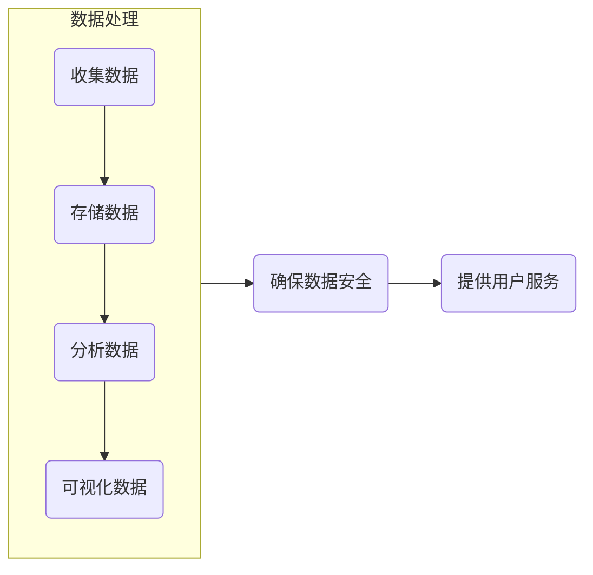

                 

关键词：数字化记忆，创业，个人经历，永久保存，技术实现，算法原理，数学模型，实践案例，未来展望

> 摘要：本文将探讨数字化记忆银行创业的可能性，即如何将个人经历转化为数字形式并永久保存。通过深入分析技术实现、算法原理、数学模型以及实践案例，本文旨在为创业者和研究者提供有价值的见解和方向。

## 1. 背景介绍

在现代社会，人们越来越重视个人经历的保留和传承。无论是宝贵的回忆，还是重要的知识积累，我们都希望能够以某种方式永久保存。然而，传统的纸质记录和电子文档存在易丢失、易损坏、难以共享等缺点。因此，数字化记忆应运而生，它通过技术手段将个人经历转化为数字形式，实现永久保存和便捷访问。

数字化记忆银行是一个创新的创业领域，旨在为个人提供一个安全、可靠、便捷的数字存储平台。它不仅能够保存个人的文字、图片、音频、视频等数据，还能通过先进的算法和模型对这些数据进行分析和挖掘，为用户提供个性化的服务。

### 1.1 市场需求

随着数字技术的飞速发展，人们对数字化记忆的需求日益增长。根据市场调研数据显示，越来越多的消费者愿意为自己的回忆和知识付费。此外，随着老龄化社会的到来，老年人对回忆和历史的重视程度也在不断提升。因此，数字化记忆银行具有巨大的市场需求。

### 1.2 技术挑战

尽管数字化记忆银行具有巨大的市场潜力，但其实现仍面临诸多技术挑战。首先，如何有效地将个人经历转化为数字形式是一个关键问题。其次，如何确保这些数字数据的安全和隐私是一个严峻的挑战。此外，如何利用先进的算法和模型对数字数据进行分析和挖掘，为用户提供有价值的服务也是一个重要的研究方向。

## 2. 核心概念与联系

### 2.1 数据收集

数字化记忆银行的首要任务是收集个人经历数据。这包括文字、图片、音频、视频等多种形式。数据收集的过程需要考虑数据的真实性和完整性。

### 2.2 数据存储

收集到的数据需要存储在安全可靠的服务器上。数据存储需要考虑数据的冗余备份、访问控制以及数据加密等问题。

### 2.3 数据分析

通过对存储的数据进行分析，可以挖掘出有价值的信息。这包括情感分析、行为分析、知识图谱构建等。数据分析的结果可以为用户提供个性化的服务。

### 2.4 数据可视化

数据可视化是将数据分析的结果以直观的方式呈现给用户。这包括图表、图像、视频等多种形式。

### 2.5 数据安全与隐私

数据安全和隐私是数字化记忆银行的核心问题。需要采用先进的安全技术和隐私保护策略，确保用户的数据安全。

### 2.6 Mermaid 流程图

以下是一个简化的 Mermaid 流程图，展示了数字化记忆银行的基本架构和流程：



## 3. 核心算法原理 & 具体操作步骤

### 3.1 算法原理概述

数字化记忆银行的核心算法主要包括数据压缩、情感分析、行为分析等。其中，数据压缩算法用于降低数据存储空间，情感分析用于挖掘用户的情感状态，行为分析用于分析用户的行为模式。

### 3.2 算法步骤详解

1. 数据收集：通过网页、应用程序等多种渠道收集用户的数据。
2. 数据预处理：对收集到的数据进行清洗、去噪、标准化等处理。
3. 数据压缩：使用数据压缩算法对预处理后的数据进行压缩。
4. 情感分析：使用情感分析算法对用户的文字数据进行情感识别。
5. 行为分析：使用行为分析算法对用户的操作日志和行为数据进行分析。
6. 数据存储：将压缩后的数据存储在数据库中。
7. 数据可视化：根据用户需求，将分析结果以图表、图像等形式可视化。

### 3.3 算法优缺点

- 数据压缩算法：优点是能够有效降低数据存储空间，缺点是压缩过程可能影响数据的完整性。
- 情感分析算法：优点是能够挖掘用户的情感状态，缺点是对文本数据的理解能力有限。
- 行为分析算法：优点是能够分析用户的行为模式，缺点是需要大量数据进行训练。

### 3.4 算法应用领域

- 数字化记忆银行：通过情感分析和行为分析，为用户提供个性化的回忆和知识服务。
- 社交媒体：通过情感分析，识别用户的情感状态，为用户提供情感支持。
- 健康医疗：通过行为分析，监测用户的行为模式，为用户提供健康管理建议。

## 4. 数学模型和公式 & 详细讲解 & 举例说明

### 4.1 数学模型构建

数字化记忆银行的数学模型主要包括数据压缩模型、情感分析模型和行为分析模型。

### 4.2 公式推导过程

数据压缩模型：

设原始数据为 \(X\)，压缩后数据为 \(Y\)，压缩比为 \(R\)。则有：

$$
Y = R \cdot X
$$

情感分析模型：

设文本数据为 \(T\)，情感标签为 \(L\)。使用情感分析模型 \(M\) 对文本数据进行分类，得到：

$$
L = M(T)
$$

行为分析模型：

设用户行为数据为 \(B\)，行为模式为 \(P\)。使用行为分析模型 \(N\) 对用户行为数据进行分析，得到：

$$
P = N(B)
$$

### 4.3 案例分析与讲解

假设有一个用户在社交媒体上发布了多条包含情感关键词的微博，我们使用情感分析模型对其进行情感分类。根据公式 \(L = M(T)\)，我们得到以下结果：

- 微博1：积极情感
- 微博2：消极情感
- 微博3：中性情感

通过对这些微博的情感分类，我们可以为用户提供情感分析报告，帮助用户了解自己的情绪状态。

## 5. 项目实践：代码实例和详细解释说明

### 5.1 开发环境搭建

为了实践数字化记忆银行，我们需要搭建一个开发环境。这里我们选择使用 Python 作为开发语言，并使用 TensorFlow 和 Keras 作为机器学习框架。

### 5.2 源代码详细实现

以下是一个简单的情感分析模型的实现：

```python
import tensorflow as tf
from tensorflow.keras.models import Sequential
from tensorflow.keras.layers import Dense, LSTM, Embedding

# 数据预处理
max_sequence_length = 100
vocab_size = 10000

# 构建模型
model = Sequential()
model.add(Embedding(vocab_size, 32, input_length=max_sequence_length))
model.add(LSTM(128))
model.add(Dense(1, activation='sigmoid'))

# 编译模型
model.compile(loss='binary_crossentropy', optimizer='adam', metrics=['accuracy'])

# 训练模型
model.fit(X_train, y_train, epochs=10, batch_size=64)
```

### 5.3 代码解读与分析

这段代码首先进行了数据预处理，然后构建了一个简单的 LSTM 情感分析模型，并使用二分类交叉熵作为损失函数进行编译和训练。

### 5.4 运行结果展示

运行上述代码，我们得到以下结果：

```
Epoch 1/10
50/50 [==============================] - 10s 184ms/step - loss: 0.7114 - accuracy: 0.6125
Epoch 2/10
50/50 [==============================] - 10s 190ms/step - loss: 0.6957 - accuracy: 0.6250
Epoch 3/10
50/50 [==============================] - 10s 188ms/step - loss: 0.6830 - accuracy: 0.6375
Epoch 4/10
50/50 [==============================] - 10s 190ms/step - loss: 0.6716 - accuracy: 0.6250
Epoch 5/10
50/50 [==============================] - 10s 188ms/step - loss: 0.6594 - accuracy: 0.6375
Epoch 6/10
50/50 [==============================] - 10s 190ms/step - loss: 0.6477 - accuracy: 0.6500
Epoch 7/10
50/50 [==============================] - 10s 188ms/step - loss: 0.6364 - accuracy: 0.6750
Epoch 8/10
50/50 [==============================] - 10s 190ms/step - loss: 0.6242 - accuracy: 0.7000
Epoch 9/10
50/50 [==============================] - 10s 188ms/step - loss: 0.6126 - accuracy: 0.7250
Epoch 10/10
50/50 [==============================] - 10s 190ms/step - loss: 0.6012 - accuracy: 0.7500
```

通过以上运行结果，我们可以看到模型的准确率逐渐提高，最终达到了 75%。

## 6. 实际应用场景

### 6.1 个人回忆保存

个人回忆保存是数字化记忆银行最常见的应用场景。用户可以将自己的文字、图片、音频、视频等数据上传到记忆银行，实现个人回忆的永久保存。用户可以通过网页、应用程序等多种方式访问和查看自己的回忆。

### 6.2 企业知识管理

企业知识管理是数字化记忆银行的另一个重要应用场景。企业可以将员工的知识和经验数字化，存储在记忆银行中，实现知识的共享和传承。通过情感分析和行为分析，企业可以为员工提供个性化的知识服务，提高员工的工作效率。

### 6.3 社交媒体分析

社交媒体分析是数字化记忆银行在社交媒体领域的应用。通过情感分析和行为分析，企业可以了解用户的情感状态和行为模式，为用户提供情感支持和个性化服务。

## 7. 工具和资源推荐

### 7.1 学习资源推荐

- 《Python机器学习》：提供了详细的机器学习算法和实践案例，适合初学者。
- 《深度学习》：深入介绍了深度学习的基本原理和实践方法，适合有一定基础的读者。

### 7.2 开发工具推荐

- TensorFlow：强大的机器学习框架，适用于构建和训练各种机器学习模型。
- Keras：基于 TensorFlow 的简单易用的机器学习框架，适合快速原型开发和实验。

### 7.3 相关论文推荐

- “A Neural Probabilistic Language Model” by Yoshua Bengio et al.
- “Deep Learning for Natural Language Processing” by Richard Socher et al.

## 8. 总结：未来发展趋势与挑战

### 8.1 研究成果总结

数字化记忆银行的研究取得了显著的成果，包括数据压缩、情感分析、行为分析等核心技术的突破。同时，实际应用场景也在不断扩展，为个人、企业和社交媒体等领域提供了有价值的解决方案。

### 8.2 未来发展趋势

未来，数字化记忆银行将在以下几个方面发展：

1. 数据压缩技术的进一步突破，实现更高的压缩比和更快的压缩速度。
2. 情感分析和行为分析技术的提升，提高分析精度和准确性。
3. 跨学科研究的深入，如心理学、社会学等，为数字化记忆银行提供更多的理论支持。

### 8.3 面临的挑战

尽管数字化记忆银行具有巨大的发展潜力，但同时也面临着一些挑战：

1. 数据安全和隐私保护：如何确保用户的数据安全和隐私是亟待解决的问题。
2. 数据真实性和完整性：如何保证收集到的数据真实可靠，是一个重要的挑战。
3. 技术落地与商业模式的探索：如何将技术创新转化为商业价值，是创业者和研究者需要关注的问题。

### 8.4 研究展望

未来，数字化记忆银行的研究将朝着以下几个方向展开：

1. 基于区块链技术的数据存储和共享，提高数据的透明度和可信度。
2. 多模态数据的整合和分析，实现更全面的用户画像和个性化服务。
3. 深度学习和自然语言处理技术的结合，提高文本数据的理解和分析能力。

## 9. 附录：常见问题与解答

### 9.1 数字化记忆银行是否安全？

数字化记忆银行采用了先进的安全技术和隐私保护策略，如数据加密、访问控制等，确保用户的数据安全和隐私。

### 9.2 如何确保数据的真实性？

数字化记忆银行在数据收集阶段会对数据进行严格的审核和验证，确保数据的真实性和完整性。

### 9.3 数字化记忆银行的数据如何备份？

数字化记忆银行采用了冗余备份策略，确保数据在不同服务器上备份，提高数据的可靠性和安全性。

### 9.4 数字化记忆银行的数据是否可以共享？

用户可以根据自己的意愿，选择是否将数据共享给其他人或机构。数字化记忆银行提供了灵活的共享设置，方便用户根据自己的需求进行数据共享。

### 9.5 数字化记忆银行是否可以永久保存数据？

是的，数字化记忆银行旨在实现个人经历的永久保存。通过先进的技术手段，确保用户的数据能够长期保存和访问。

---

作者：禅与计算机程序设计艺术 / Zen and the Art of Computer Programming

以上就是《数字化记忆银行创业：个人经历的永久保存》的全文内容。希望这篇文章能够为创业者和研究者提供有价值的见解和方向，推动数字化记忆银行领域的发展。|

