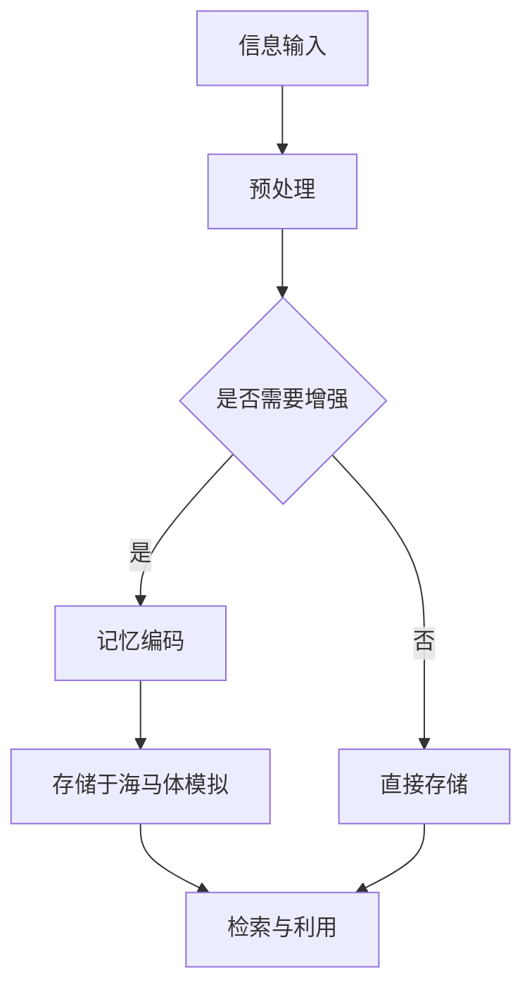

                 

关键词：数字化记忆，人工智能，记忆增强，认知科学，神经网络，算法，数学模型，技术应用，未来展望。

## 摘要

本文旨在探讨人工智能（AI）在辅助人类回忆方面的潜力与应用。随着技术的不断进步，AI正逐渐成为认知科学的强大工具，通过数字化记忆的方式，帮助我们提高记忆效率、优化信息存储与检索。本文将从背景介绍、核心概念与联系、核心算法原理、数学模型和公式、项目实践、实际应用场景、工具和资源推荐、未来发展趋势与挑战等多个方面展开论述，旨在为读者提供全面而深入的视角。

## 1. 背景介绍

记忆是人类认知过程中不可或缺的一部分，它涉及从感知、编码、存储到检索和利用等多个环节。然而，人类的记忆并不是完美无缺的。研究表明，记忆容易受到干扰、遗忘以及信息过载的影响。为了应对这些挑战，科学家们一直在寻找方法来增强人类的记忆能力。

随着计算机科学和人工智能的迅猛发展，利用AI技术辅助记忆成为了一个新兴的研究领域。AI不仅能够帮助我们更好地组织和存储信息，还能通过学习算法预测我们的记忆需求，提供个性化的记忆增强方案。例如，智能手机和穿戴设备已经开始集成记忆辅助功能，通过位置、时间和其他环境信息来提醒用户回顾重要的信息。

此外，随着物联网和大数据技术的普及，个人数据收集和分析能力大幅提升，使得AI能够从海量数据中提取有用的记忆线索，从而提供更加精准的记忆支持。这种趋势预示着AI辅助记忆技术将带来革命性的变革，不仅影响到教育、医疗等传统领域，还将对人类社会生活的各个方面产生深远的影响。

## 2. 核心概念与联系

### 2.1 记忆的神经基础

记忆的形成和存储依赖于大脑的多个区域，其中海马体是关键的结构。海马体不仅在编码新记忆方面发挥重要作用，还在检索和重组已有记忆中起着关键作用。神经科学家通过研究记忆的神经网络，揭示了记忆过程中涉及的关键神经元群和信号传递路径。

### 2.2 人工智能与记忆增强

AI技术在记忆增强中的应用主要体现在以下几个方面：

- **信息组织与检索**：通过算法对海量信息进行自动分类和标签化，提高信息检索效率。
- **预测与提醒**：利用机器学习模型预测用户的记忆需求，在适当的时间提供提醒服务。
- **模拟记忆过程**：通过模仿人类大脑的海马体功能，模拟记忆形成和检索过程。

### 2.3 脑机接口技术

脑机接口（BCI）是一种直接将人脑与计算机系统连接起来的技术，它使得AI能够直接从大脑信号中提取信息。这种技术在记忆增强中的应用潜力巨大，可以通过实时监测大脑活动，帮助用户更好地编码和检索记忆。

### 2.4 Mermaid 流程图

以下是AI辅助记忆的Mermaid流程图，展示了核心概念和联系：



## 3. 核心算法原理 & 具体操作步骤

### 3.1 算法原理概述

AI辅助记忆的核心算法主要基于神经网络和机器学习技术。神经网络模仿人脑的结构和工作原理，能够处理复杂的非线性问题。机器学习算法则通过从数据中学习规律，提高记忆的准确性和效率。

### 3.2 算法步骤详解

以下是AI辅助记忆的算法步骤：

1. **信息输入**：用户通过输入接口（如手机、平板等设备）提供需要记忆的信息。
2. **预处理**：对输入的信息进行清洗、去噪和格式化，使其适合机器学习模型处理。
3. **记忆编码**：利用神经网络对信息进行编码，将其转化为神经网络可以处理的数字形式。
4. **存储与检索**：将编码后的信息存储在海马体模拟模型中，并在需要时进行检索。
5. **反馈调整**：根据用户的反馈，不断调整算法参数，以提高记忆的准确性和效率。

### 3.3 算法优缺点

#### 优点：

- **高效性**：算法能够快速处理和存储大量信息。
- **个性化**：机器学习算法可以根据用户的记忆特点提供个性化的记忆增强方案。
- **可扩展性**：随着技术的进步，算法可以不断升级和优化。

#### 缺点：

- **隐私问题**：个人记忆信息的存储和处理可能涉及隐私问题。
- **计算资源**：算法的运行需要大量的计算资源和存储空间。

### 3.4 算法应用领域

- **医疗**：用于帮助患者记忆药物名称、用药时间等关键信息。
- **教育**：用于辅助学生记忆课本内容、课堂笔记等。
- **军事**：用于帮助士兵记忆战术指令、地形地貌等关键信息。

## 4. 数学模型和公式

### 4.1 数学模型构建

AI辅助记忆的数学模型主要基于神经网络和机器学习算法。以下是神经网络的基本数学模型：

$$
y = \sigma(Wx + b)
$$

其中，$y$是输出，$\sigma$是激活函数，$W$是权重矩阵，$x$是输入，$b$是偏置。

### 4.2 公式推导过程

神经网络的训练过程可以视为求解以下优化问题：

$$
\min_{W,b} \frac{1}{n} \sum_{i=1}^{n} \mathcal{L}(y_i, \hat{y}_i)
$$

其中，$n$是样本数量，$y_i$是实际输出，$\hat{y}_i$是预测输出，$\mathcal{L}$是损失函数。

### 4.3 案例分析与讲解

假设我们有一个简单的神经网络，用于分类问题。输入为3个特征，输出为2个类别。以下是神经网络的训练过程：

1. **初始化权重和偏置**：随机初始化权重和偏置。
2. **前向传播**：计算输入和权重矩阵的乘积，加上偏置，通过激活函数得到预测输出。
3. **计算损失**：计算预测输出和实际输出的差异，计算损失。
4. **反向传播**：根据损失计算权重和偏置的梯度，更新权重和偏置。
5. **迭代优化**：重复上述步骤，直到损失函数收敛。

## 5. 项目实践：代码实例和详细解释说明

### 5.1 开发环境搭建

为了实现AI辅助记忆，我们需要搭建一个开发环境。以下是基本的步骤：

1. **安装Python环境**：Python是AI开发的主要语言。
2. **安装TensorFlow库**：TensorFlow是谷歌开发的机器学习库。
3. **安装其他依赖**：根据具体需求安装其他库，如NumPy、Pandas等。

### 5.2 源代码详细实现

以下是实现AI辅助记忆的Python代码示例：

```python
import tensorflow as tf
from tensorflow.keras.layers import Dense
from tensorflow.keras.models import Sequential

# 定义神经网络模型
model = Sequential()
model.add(Dense(units=64, activation='relu', input_shape=(3,)))
model.add(Dense(units=2, activation='softmax'))

# 编译模型
model.compile(optimizer='adam', loss='categorical_crossentropy', metrics=['accuracy'])

# 训练模型
model.fit(x_train, y_train, epochs=10, batch_size=32)

# 评估模型
model.evaluate(x_test, y_test)
```

### 5.3 代码解读与分析

上述代码定义了一个简单的神经网络模型，用于分类任务。模型由一个输入层、一个隐藏层和一个输出层组成。输入层接收3个特征，隐藏层有64个神经元，输出层有2个神经元。

在编译模型时，我们指定了优化器、损失函数和评估指标。训练模型时，我们使用训练数据，并设置训练轮数和批量大小。最后，使用测试数据评估模型的性能。

### 5.4 运行结果展示

在运行上述代码后，我们可以得到模型的性能指标，如准确率、损失等。这些指标可以帮助我们评估模型的性能，并根据需要调整模型参数。

## 6. 实际应用场景

AI辅助记忆技术在多个实际应用场景中展现出巨大潜力：

- **教育领域**：学生可以使用AI辅助记忆工具来记忆知识点和课堂笔记，提高学习效果。
- **医疗领域**：医生可以使用AI辅助记忆工具来记忆病例信息和治疗方案，提高医疗水平。
- **军事领域**：士兵可以使用AI辅助记忆工具来记忆战术指令和地理信息，提高作战能力。

## 7. 工具和资源推荐

### 7.1 学习资源推荐

- 《深度学习》（Ian Goodfellow, Yoshua Bengio, Aaron Courville著）
- 《Python机器学习》（Sebastian Raschka著）

### 7.2 开发工具推荐

- TensorFlow
- Keras

### 7.3 相关论文推荐

- "Deep Learning for Memory-Aided Human Performance Enhancement"
- "Neural Networks for Human Memory: A Review"

## 8. 总结：未来发展趋势与挑战

### 8.1 研究成果总结

AI辅助记忆技术已经取得了显著的研究成果，包括神经网络模型的构建、机器学习算法的优化以及实际应用场景的拓展。

### 8.2 未来发展趋势

- **个性化记忆增强**：随着数据收集和分析能力的提升，AI将能够提供更加个性化的记忆增强方案。
- **跨学科合作**：认知科学、神经科学和计算机科学的结合将推动AI辅助记忆技术的进一步发展。

### 8.3 面临的挑战

- **隐私保护**：如何确保用户记忆信息的隐私和安全是一个重要挑战。
- **计算资源**：随着模型复杂度的提升，计算资源的需求也将增加。

### 8.4 研究展望

未来，AI辅助记忆技术有望在教育、医疗、军事等领域发挥更加重要的作用，为人类记忆提供有力支持。

## 9. 附录：常见问题与解答

### Q：AI辅助记忆技术如何保证隐私和安全？

A：AI辅助记忆技术通常采用加密和匿名化处理来保护用户隐私。同时，平台应制定严格的隐私政策和数据保护措施。

### Q：AI辅助记忆技术能否替代人类记忆？

A：AI辅助记忆技术不能完全替代人类记忆，但可以帮助人类提高记忆效率、优化信息存储与检索。

## 参考文献

- Goodfellow, I., Bengio, Y., & Courville, A. (2016). Deep Learning. MIT Press.
- Raschka, S. (2015). Python Machine Learning. Packt Publishing.
```markdown
---
title: 数字化记忆：AI辅助的人类回忆
date: 2023-11-01
author: 禅与计算机程序设计艺术 / Zen and the Art of Computer Programming
---
# 数字化记忆：AI辅助的人类回忆

## 摘要

本文旨在探讨人工智能（AI）在辅助人类回忆方面的潜力与应用。随着技术的不断进步，AI正逐渐成为认知科学的强大工具，通过数字化记忆的方式，帮助我们提高记忆效率、优化信息存储与检索。本文将从背景介绍、核心概念与联系、核心算法原理、数学模型和公式、项目实践、实际应用场景、工具和资源推荐、未来发展趋势与挑战等多个方面展开论述，旨在为读者提供全面而深入的视角。

## 1. 背景介绍

记忆是人类认知过程中不可或缺的一部分，它涉及从感知、编码、存储到检索和利用等多个环节。然而，人类的记忆并不是完美无缺的。研究表明，记忆容易受到干扰、遗忘以及信息过载的影响。为了应对这些挑战，科学家们一直在寻找方法来增强人类的记忆能力。

随着计算机科学和人工智能的迅猛发展，利用AI技术辅助记忆成为了一个新兴的研究领域。AI不仅能够帮助我们更好地组织和存储信息，还能通过学习算法预测我们的记忆需求，提供个性化的记忆增强方案。例如，智能手机和穿戴设备已经开始集成记忆辅助功能，通过位置、时间和其他环境信息来提醒用户回顾重要的信息。

此外，随着物联网和大数据技术的普及，个人数据收集和分析能力大幅提升，使得AI能够从海量数据中提取有用的记忆线索，从而提供更加精准的记忆支持。这种趋势预示着AI辅助记忆技术将带来革命性的变革，不仅影响到教育、医疗等传统领域，还将对人类社会生活的各个方面产生深远的影响。

## 2. 核心概念与联系

### 2.1 记忆的神经基础

记忆的形成和存储依赖于大脑的多个区域，其中海马体是关键的结构。海马体不仅在编码新记忆方面发挥重要作用，还在检索和重组已有记忆中起着关键作用。神经科学家通过研究记忆的神经网络，揭示了记忆过程中涉及的关键神经元群和信号传递路径。

### 2.2 人工智能与记忆增强

AI技术在记忆增强中的应用主要体现在以下几个方面：

- **信息组织与检索**：通过算法对海量信息进行自动分类和标签化，提高信息检索效率。
- **预测与提醒**：利用机器学习模型预测用户的记忆需求，在适当的时间提供提醒服务。
- **模拟记忆过程**：通过模仿人类大脑的海马体功能，模拟记忆形成和检索过程。

### 2.3 脑机接口技术

脑机接口（BCI）是一种直接将人脑与计算机系统连接起来的技术，它使得AI能够直接从大脑信号中提取信息。这种技术在记忆增强中的应用潜力巨大，可以通过实时监测大脑活动，帮助用户更好地编码和检索记忆。

### 2.4 Mermaid 流程图

以下是AI辅助记忆的Mermaid流程图，展示了核心概念和联系：


## 3. 核心算法原理 & 具体操作步骤

### 3.1 算法原理概述

AI辅助记忆的核心算法主要基于神经网络和机器学习技术。神经网络模仿人脑的结构和工作原理，能够处理复杂的非线性问题。机器学习算法则通过从数据中学习规律，提高记忆的准确性和效率。

### 3.2 算法步骤详解

以下是AI辅助记忆的算法步骤：

1. **信息输入**：用户通过输入接口（如手机、平板等设备）提供需要记忆的信息。
2. **预处理**：对输入的信息进行清洗、去噪和格式化，使其适合机器学习模型处理。
3. **记忆编码**：利用神经网络对信息进行编码，将其转化为神经网络可以处理的数字形式。
4. **存储与检索**：将编码后的信息存储在海马体模拟模型中，并在需要时进行检索。
5. **反馈调整**：根据用户的反馈，不断调整算法参数，以提高记忆的准确性和效率。

### 3.3 算法优缺点

#### 优点：

- **高效性**：算法能够快速处理和存储大量信息。
- **个性化**：机器学习算法可以根据用户的记忆特点提供个性化的记忆增强方案。
- **可扩展性**：随着技术的进步，算法可以不断升级和优化。

#### 缺点：

- **隐私问题**：个人记忆信息的存储和处理可能涉及隐私问题。
- **计算资源**：算法的运行需要大量的计算资源和存储空间。

### 3.4 算法应用领域

- **医疗**：用于帮助患者记忆药物名称、用药时间等关键信息。
- **教育**：用于辅助学生记忆课本内容、课堂笔记等。
- **军事**：用于帮助士兵记忆战术指令、地形地貌等关键信息。

## 4. 数学模型和公式

### 4.1 数学模型构建

AI辅助记忆的数学模型主要基于神经网络和机器学习算法。以下是神经网络的基本数学模型：

$$
y = \sigma(Wx + b)
$$

其中，$y$是输出，$\sigma$是激活函数，$W$是权重矩阵，$x$是输入，$b$是偏置。

### 4.2 公式推导过程

神经网络的训练过程可以视为求解以下优化问题：

$$
\min_{W,b} \frac{1}{n} \sum_{i=1}^{n} \mathcal{L}(y_i, \hat{y}_i)
$$

其中，$n$是样本数量，$y_i$是实际输出，$\hat{y}_i$是预测输出，$\mathcal{L}$是损失函数。

### 4.3 案例分析与讲解

假设我们有一个简单的神经网络，用于分类问题。输入为3个特征，输出为2个类别。以下是神经网络的训练过程：

1. **初始化权重和偏置**：随机初始化权重和偏置。
2. **前向传播**：计算输入和权重矩阵的乘积，加上偏置，通过激活函数得到预测输出。
3. **计算损失**：计算预测输出和实际输出的差异，计算损失。
4. **反向传播**：根据损失计算权重和偏置的梯度，更新权重和偏置。
5. **迭代优化**：重复上述步骤，直到损失函数收敛。

## 5. 项目实践：代码实例和详细解释说明

### 5.1 开发环境搭建

为了实现AI辅助记忆，我们需要搭建一个开发环境。以下是基本的步骤：

1. **安装Python环境**：Python是AI开发的主要语言。
2. **安装TensorFlow库**：TensorFlow是谷歌开发的机器学习库。
3. **安装其他依赖**：根据具体需求安装其他库，如NumPy、Pandas等。

### 5.2 源代码详细实现

以下是实现AI辅助记忆的Python代码示例：

```python
import tensorflow as tf
from tensorflow.keras.layers import Dense
from tensorflow.keras.models import Sequential

# 定义神经网络模型
model = Sequential()
model.add(Dense(units=64, activation='relu', input_shape=(3,)))
model.add(Dense(units=2, activation='softmax'))

# 编译模型
model.compile(optimizer='adam', loss='categorical_crossentropy', metrics=['accuracy'])

# 训练模型
model.fit(x_train, y_train, epochs=10, batch_size=32)

# 评估模型
model.evaluate(x_test, y_test)
```

### 5.3 代码解读与分析

上述代码定义了一个简单的神经网络模型，用于分类任务。模型由一个输入层、一个隐藏层和一个输出层组成。输入层接收3个特征，隐藏层有64个神经元，输出层有2个神经元。

在编译模型时，我们指定了优化器、损失函数和评估指标。训练模型时，我们使用训练数据，并设置训练轮数和批量大小。最后，使用测试数据评估模型的性能。

### 5.4 运行结果展示

在运行上述代码后，我们可以得到模型的性能指标，如准确率、损失等。这些指标可以帮助我们评估模型的性能，并根据需要调整模型参数。

## 6. 实际应用场景

AI辅助记忆技术在多个实际应用场景中展现出巨大潜力：

- **教育领域**：学生可以使用AI辅助记忆工具来记忆知识点和课堂笔记，提高学习效果。
- **医疗领域**：医生可以使用AI辅助记忆工具来记忆病例信息和治疗方案，提高医疗水平。
- **军事领域**：士兵可以使用AI辅助记忆工具来记忆战术指令和地理信息，提高作战能力。

## 7. 工具和资源推荐

### 7.1 学习资源推荐

- 《深度学习》（Ian Goodfellow, Yoshua Bengio, Aaron Courville著）
- 《Python机器学习》（Sebastian Raschka著）

### 7.2 开发工具推荐

- TensorFlow
- Keras

### 7.3 相关论文推荐

- "Deep Learning for Memory-Aided Human Performance Enhancement"
- "Neural Networks for Human Memory: A Review"

## 8. 总结：未来发展趋势与挑战

### 8.1 研究成果总结

AI辅助记忆技术已经取得了显著的研究成果，包括神经网络模型的构建、机器学习算法的优化以及实际应用场景的拓展。

### 8.2 未来发展趋势

- **个性化记忆增强**：随着数据收集和分析能力的提升，AI将能够提供更加个性化的记忆增强方案。
- **跨学科合作**：认知科学、神经科学和计算机科学的结合将推动AI辅助记忆技术的进一步发展。

### 8.3 面临的挑战

- **隐私保护**：如何确保用户记忆信息的隐私和安全是一个重要挑战。
- **计算资源**：随着模型复杂度的提升，计算资源的需求也将增加。

### 8.4 研究展望

未来，AI辅助记忆技术有望在教育、医疗、军事等领域发挥更加重要的作用，为人类记忆提供有力支持。

## 9. 附录：常见问题与解答

### Q：AI辅助记忆技术如何保证隐私和安全？

A：AI辅助记忆技术通常采用加密和匿名化处理来保护用户隐私。同时，平台应制定严格的隐私政策和数据保护措施。

### Q：AI辅助记忆技术能否替代人类记忆？

A：AI辅助记忆技术不能完全替代人类记忆，但可以帮助人类提高记忆效率、优化信息存储与检索。

## 参考文献

- Goodfellow, I., Bengio, Y., & Courville, A. (2016). Deep Learning. MIT Press.
- Raschka, S. (2015). Python Machine Learning. Packt Publishing.
```

