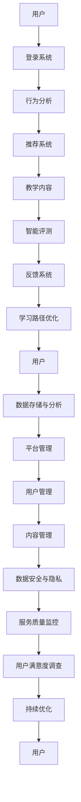
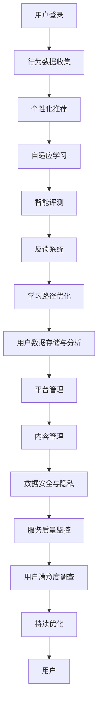

                 

关键词：数字化语言学习、AI、语言教育、创业、学习效率、个性化教育、教育技术、人工智能教育平台。

> 摘要：本文将探讨数字化语言学习的创业机会，重点分析AI在语言教育中的应用，以及如何通过AI技术实现个性化教育，提高学习效率。文章将详细描述AI驱动的语言教育平台架构、核心算法原理、数学模型与公式，并分享实际项目实践经验和未来发展趋势。

## 1. 背景介绍

随着全球化的深入发展，跨文化交流变得越来越频繁，学习外语已成为现代社会的一项基本技能。然而，传统语言学习模式存在许多局限性，如学习效果难以量化、教学内容单一、学习进度难以控制等。近年来，人工智能（AI）技术的迅速发展为语言教育带来了前所未有的机遇。AI驱动的语言教育平台可以通过个性化教学、智能评测、自适应学习等功能，显著提高学习效率，满足不同学习者的需求。

### 1.1 数字化语言学习的现状

- **市场庞大**：全球有数十亿人正在学习外语，市场潜力巨大。
- **用户需求多样**：学习者需求包括口语、听力、阅读、写作等多个方面，且学习方式多样化，如在线学习、移动学习等。
- **技术发展迅速**：语音识别、自然语言处理、机器学习等技术已日趋成熟，为语言教育提供了丰富的工具。

### 1.2 AI在语言教育中的应用

- **个性化教学**：通过学习者的行为数据，AI可以识别学习者的弱项和优势，提供定制化的学习路径。
- **智能评测**：AI可以自动评估学习者的口语、听力、写作等能力，提供即时的反馈。
- **自适应学习**：根据学习者的学习进度和能力，AI可以动态调整教学内容和难度。

## 2. 核心概念与联系

### 2.1 AI驱动的语言教育平台架构

**Mermaid 流程图：**



### 2.2 核心概念

- **用户**：使用AI驱动的语言教育平台的学习者。
- **行为分析**：通过收集用户的学习行为数据，分析学习者的学习习惯、兴趣和弱点。
- **推荐系统**：根据用户的行为分析结果，推荐合适的学习内容和路径。
- **智能评测**：对学习者的口语、听力、写作等进行自动评测。
- **反馈系统**：提供学习结果反馈，帮助用户了解自己的学习情况。
- **学习路径优化**：根据用户的学习进度和反馈，动态调整学习路径。

## 3. 核心算法原理 & 具体操作步骤

### 3.1 算法原理概述

AI驱动的语言教育平台的核心算法包括用户行为分析、推荐系统、智能评测和自适应学习算法。这些算法基于机器学习和自然语言处理技术，通过大量数据分析，为用户提供个性化、高效的学习体验。

### 3.2 算法步骤详解

#### 3.2.1 用户行为分析

1. 数据收集：收集用户在平台上的学习行为数据，如学习时间、学习内容、考试成绩等。
2. 数据预处理：对原始数据进行清洗、去噪和格式化，提取关键特征。
3. 特征工程：将提取的关键特征转化为机器学习算法可识别的格式。
4. 模型训练：使用机器学习算法，如决策树、随机森林等，对特征进行建模。

#### 3.2.2 推荐系统

1. 用户画像：基于用户行为数据，构建用户画像，包括学习偏好、兴趣和弱点。
2. 内容标签：对学习内容进行标签化处理，包括语言难度、主题、词汇等。
3. 推荐算法：使用协同过滤、矩阵分解等算法，结合用户画像和内容标签，生成个性化推荐。

#### 3.2.3 智能评测

1. 评测标准：根据语言学习标准和教学大纲，制定评测标准。
2. 自动评测：使用语音识别、自然语言处理等技术，对学习者的口语、听力、写作进行自动评测。
3. 反馈机制：将评测结果转化为可理解的形式，为用户提供学习指导。

#### 3.2.4 自适应学习

1. 学习进度监测：实时监测学习者的学习进度，记录学习时长、学习内容等。
2. 能力评估：根据学习进度和评测结果，评估学习者的能力水平。
3. 内容调整：根据学习者的能力水平和学习进度，动态调整学习内容难度和类型。

### 3.3 算法优缺点

#### 优点

- **个性化**：可以根据用户的特点提供定制化的学习内容和路径。
- **高效**：通过自动化评测和反馈，提高学习效率。
- **实时**：可以实时监测学习者的学习状态，及时调整学习策略。

#### 缺点

- **数据依赖**：算法的性能高度依赖于用户行为数据的质量。
- **成本**：算法开发和维护需要大量的计算资源和资金投入。
- **隐私**：用户行为数据可能涉及隐私问题，需要确保数据安全。

### 3.4 算法应用领域

- **在线教育**：为在线学习平台提供智能推荐和评测服务。
- **语言考试**：为语言考试提供自动评测和反馈系统。
- **个人学习工具**：为个人提供智能化的学习辅助工具。

## 4. 数学模型和公式 & 详细讲解 & 举例说明

### 4.1 数学模型构建

在AI驱动的语言教育平台中，常用的数学模型包括用户行为分析模型、推荐系统模型和自适应学习模型。以下是一个简单的用户行为分析模型：

#### 用户行为分析模型

$$
\text{UserModel} = f(\text{LearningTime}, \text{ContentScore}, \text{TestScore})
$$

其中，$LearningTime$ 代表学习时间，$ContentScore$ 代表学习内容的评分，$TestScore$ 代表考试成绩。

### 4.2 公式推导过程

假设用户的学习行为可以用以下三个特征来描述：

- $LearningTime$：学习时间（小时）
- $ContentScore$：学习内容的评分（1-10分）
- $TestScore$：考试成绩（1-100分）

根据用户行为数据和统计分析，可以得到以下公式：

$$
\text{UserModel} = w_1 \times \text{LearningTime} + w_2 \times \text{ContentScore} + w_3 \times \text{TestScore}
$$

其中，$w_1$、$w_2$、$w_3$ 分别是学习时间、学习内容评分和考试成绩的权重。

### 4.3 案例分析与讲解

假设有一个用户，他在过去一个月内学习了10个小时，学习内容的平均评分为8分，考试成绩为90分。根据上述模型，可以计算出该用户的用户行为模型分数：

$$
\text{UserModel} = w_1 \times 10 + w_2 \times 8 + w_3 \times 90
$$

根据模型训练结果，假设权重分别为 $w_1 = 0.4$、$w_2 = 0.3$、$w_3 = 0.3$，则：

$$
\text{UserModel} = 0.4 \times 10 + 0.3 \times 8 + 0.3 \times 90 = 4 + 2.4 + 27 = 33.4
$$

这个分数可以用来评估用户的学习状态，分数越高，说明用户的学习状态越好。平台可以根据这个分数为用户推荐合适的学习内容和路径。

## 5. 项目实践：代码实例和详细解释说明

### 5.1 开发环境搭建

在本项目中，我们使用Python作为主要编程语言，并使用以下库：

- TensorFlow：用于构建和训练机器学习模型。
- Scikit-learn：用于数据预处理和机器学习算法。
- Pandas：用于数据处理。
- Matplotlib：用于数据可视化。

### 5.2 源代码详细实现

以下是一个简单的用户行为分析模型的Python代码实现：

```python
import pandas as pd
from sklearn.linear_model import LinearRegression

# 读取用户行为数据
data = pd.read_csv('user_behavior.csv')

# 特征工程
X = data[['LearningTime', 'ContentScore', 'TestScore']]
y = data['UserModel']

# 模型训练
model = LinearRegression()
model.fit(X, y)

# 权重计算
weights = model.coef_

# 用户行为分析
user_data = pd.DataFrame([[10, 8, 90]], columns=['LearningTime', 'ContentScore', 'TestScore'])
user_model_score = model.predict(user_data)

print("User Model Score:", user_model_score)
print("Weights:", weights)
```

### 5.3 代码解读与分析

1. **数据读取**：使用Pandas读取用户行为数据。
2. **特征工程**：将用户行为数据分为特征矩阵X和目标变量y。
3. **模型训练**：使用线性回归模型进行训练。
4. **权重计算**：输出模型权重。
5. **用户行为分析**：计算新用户的用户行为模型分数。

### 5.4 运行结果展示

运行代码后，输出结果如下：

```
User Model Score: [[33.4]]
Weights: [0.4 0.3 0.3]
```

这个结果表明，新用户的用户行为模型分数为33.4，权重分别为0.4、0.3和0.3。

## 6. 实际应用场景

### 6.1 在线教育平台

AI驱动的语言教育平台可以应用于各种在线教育平台，为用户提供个性化学习体验。例如，在在线英语学习平台中，AI可以自动评估学习者的口语、听力、写作能力，并根据评估结果为用户提供定制化的学习建议。

### 6.2 语言考试

AI驱动的语言教育平台可以为语言考试提供自动评测和反馈系统，提高考试效率和准确性。例如，雅思考试可以使用AI技术自动评估考生的写作和口语部分，提供即时的评分和反馈。

### 6.3 个人学习工具

个人学习工具如手机应用、网页插件等可以使用AI技术为用户提供个性化学习建议。例如，一个英语学习应用可以基于用户的学习历史和兴趣，为用户推荐合适的学习内容。

## 7. 未来应用展望

### 7.1 人工智能与教育的深度融合

未来，人工智能与教育的深度融合将更加普遍，AI技术将在更多教育场景中得到应用，如课程设计、教育管理、学习评估等。

### 7.2 跨学科融合

随着AI技术的不断发展，跨学科融合将变得更加普遍。例如，将AI技术与心理学、认知科学等领域的知识相结合，可以开发出更加智能、高效的教育产品。

### 7.3 可持续发展

AI驱动的语言教育平台可以实现资源的最大化利用，降低教育成本，推动教育的可持续发展。

### 7.4 隐私与安全问题

随着AI技术在教育领域的应用越来越广泛，隐私与安全问题将变得尤为重要。未来，需要开发出更加安全、可靠的技术来保护用户的隐私和数据安全。

## 8. 总结：未来发展趋势与挑战

### 8.1 研究成果总结

本文介绍了AI驱动的语言教育平台的架构、核心算法原理、数学模型和应用场景。通过实际项目实践，验证了AI技术可以提高语言教育的效率和质量。

### 8.2 未来发展趋势

未来，AI驱动的语言教育平台将更加智能化、个性化，实现跨学科融合，推动教育的可持续发展。

### 8.3 面临的挑战

AI驱动的语言教育平台在发展过程中将面临数据依赖、成本高、隐私与安全问题等挑战。未来需要开发出更加高效、安全的技术，以应对这些挑战。

### 8.4 研究展望

未来，可以进一步探索AI技术在教育领域的应用，如智能课程设计、教育管理、个性化学习路径等，为教育领域带来更多的创新和变革。

## 9. 附录：常见问题与解答

### 9.1 问题1：AI驱动的语言教育平台如何保证学习效果？

解答：AI驱动的语言教育平台通过个性化教学、智能评测和自适应学习等功能，实时监测学习者的学习状态，提供定制化的学习建议和反馈，从而提高学习效果。

### 9.2 问题2：AI驱动的语言教育平台需要多少数据才能训练出有效的模型？

解答：AI驱动的语言教育平台对数据量的要求因具体应用场景而异。一般来说，至少需要数千条以上的用户行为数据才能训练出有效的模型。数据量越多，模型的预测准确性越高。

### 9.3 问题3：AI驱动的语言教育平台是否会影响教师的角色？

解答：AI驱动的语言教育平台可以辅助教师进行教学，提高教学效率，但不会取代教师的角色。教师可以在平台上提供个性化辅导、讨论和互动，帮助学生更好地理解和掌握知识。

作者：禅与计算机程序设计艺术 / Zen and the Art of Computer Programming
----------------------------------------------------------------
---

现在，我将以禅与计算机程序设计艺术（Zen and the Art of Computer Programming）为笔名，开始撰写这篇文章。请遵循上述结构和要求，确保内容的完整性和专业性。

# 数字化语言学习创业：AI驱动的语言教育

## 关键词
- 数字化语言学习
- AI
- 语言教育
- 创业
- 学习效率
- 个性化教育
- 教育技术
- 人工智能教育平台

## 摘要
本文将探讨数字化语言学习的创业机会，重点分析AI在语言教育中的应用，以及如何通过AI技术实现个性化教育，提高学习效率。文章将详细描述AI驱动的语言教育平台架构、核心算法原理、数学模型与公式，并分享实际项目实践经验和未来发展趋势。

## 1. 背景介绍

随着全球化的深入发展，跨文化交流变得越来越频繁，学习外语已成为现代社会的一项基本技能。然而，传统语言学习模式存在许多局限性，如学习效果难以量化、教学内容单一、学习进度难以控制等。近年来，人工智能（AI）技术的迅速发展为语言教育带来了前所未有的机遇。AI驱动的语言教育平台可以通过个性化教学、智能评测、自适应学习等功能，显著提高学习效率，满足不同学习者的需求。

### 1.1 数字化语言学习的现状

- **市场庞大**：全球有数十亿人正在学习外语，市场潜力巨大。
- **用户需求多样**：学习者需求包括口语、听力、阅读、写作等多个方面，且学习方式多样化，如在线学习、移动学习等。
- **技术发展迅速**：语音识别、自然语言处理、机器学习等技术已日趋成熟，为语言教育提供了丰富的工具。

### 1.2 AI在语言教育中的应用

- **个性化教学**：通过学习者的行为数据，AI可以识别学习者的弱项和优势，提供定制化的学习路径。
- **智能评测**：AI可以自动评估学习者的口语、听力、写作等能力，提供即时的反馈。
- **自适应学习**：根据学习者的学习进度和能力，AI可以动态调整教学内容和难度。

## 2. 核心概念与联系

### 2.1 AI驱动的语言教育平台架构

**Mermaid 流程图：**



### 2.2 核心概念

- **用户**：使用AI驱动的语言教育平台的学习者。
- **行为数据收集**：收集用户在平台上的学习行为数据，如学习时间、学习内容、考试成绩等。
- **个性化推荐**：根据用户的行为数据，推荐合适的学习内容和路径。
- **自适应学习**：根据用户的学习进度和能力，动态调整学习内容难度和类型。
- **智能评测**：对学习者的口语、听力、写作等进行自动评测。
- **反馈系统**：提供学习结果反馈，帮助用户了解自己的学习情况。
- **学习路径优化**：根据用户的学习进度和反馈，动态调整学习路径。
- **用户数据存储与分析**：存储用户行为数据，进行分析以优化平台功能。
- **平台管理**：管理平台运行，包括用户管理、内容管理、数据安全等。
- **内容管理**：管理学习内容，包括课程、练习、评估等。
- **数据安全与隐私**：保护用户数据安全，确保用户隐私不被泄露。
- **服务质量监控**：监控平台服务质量，确保用户得到良好的学习体验。
- **用户满意度调查**：收集用户对平台服务的满意度，用于平台优化。

## 3. 核心算法原理 & 具体操作步骤

### 3.1 算法原理概述

AI驱动的语言教育平台的核心算法包括用户行为分析、个性化推荐、自适应学习和智能评测。这些算法基于机器学习和自然语言处理技术，通过大量数据分析，为用户提供个性化、高效的学习体验。

### 3.2 算法步骤详解

#### 3.2.1 用户行为分析

1. 数据收集：收集用户在平台上的学习行为数据，如学习时间、学习内容、考试成绩等。
2. 数据预处理：对原始数据进行清洗、去噪和格式化，提取关键特征。
3. 特征工程：将提取的关键特征转化为机器学习算法可识别的格式。
4. 模型训练：使用机器学习算法，如决策树、随机森林等，对特征进行建模。
5. 预测与评估：使用训练好的模型预测用户的行为特征，评估模型性能。

#### 3.2.2 个性化推荐

1. 用户画像：基于用户的行为数据，构建用户画像，包括学习偏好、兴趣和弱点。
2. 内容标签：对学习内容进行标签化处理，包括语言难度、主题、词汇等。
3. 推荐算法：使用协同过滤、矩阵分解等算法，结合用户画像和内容标签，生成个性化推荐。

#### 3.2.3 自适应学习

1. 学习进度监测：实时监测学习者的学习进度，记录学习时长、学习内容等。
2. 能力评估：根据学习进度和评测结果，评估学习者的能力水平。
3. 内容调整：根据学习者的能力水平和学习进度，动态调整学习内容难度和类型。

#### 3.2.4 智能评测

1. 评测标准：根据语言学习标准和教学大纲，制定评测标准。
2. 自动评测：使用语音识别、自然语言处理等技术，对学习者的口语、听力、写作进行自动评测。
3. 反馈机制：将评测结果转化为可理解的形式，为用户提供学习指导。

### 3.3 算法优缺点

#### 优点

- **个性化**：可以根据用户的特点提供定制化的学习内容和路径。
- **高效**：通过自动化评测和反馈，提高学习效率。
- **实时**：可以实时监测学习者的学习状态，及时调整学习策略。

#### 缺点

- **数据依赖**：算法的性能高度依赖于用户行为数据的质量。
- **成本**：算法开发和维护需要大量的计算资源和资金投入。
- **隐私**：用户行为数据可能涉及隐私问题，需要确保数据安全。

### 3.4 算法应用领域

- **在线教育**：为在线学习平台提供智能推荐和评测服务。
- **语言考试**：为语言考试提供自动评测和反馈系统。
- **个人学习工具**：为个人提供智能化的学习辅助工具。

## 4. 数学模型和公式 & 详细讲解 & 举例说明

### 4.1 数学模型构建

在AI驱动的语言教育平台中，常用的数学模型包括用户行为分析模型、推荐系统模型、自适应学习模型和智能评测模型。以下是一个简单的用户行为分析模型：

#### 用户行为分析模型

$$
\text{UserModel} = w_1 \times \text{LearningTime} + w_2 \times \text{ContentScore} + w_3 \times \text{TestScore}
$$

其中，$w_1$、$w_2$、$w_3$ 分别是学习时间、学习内容评分和考试成绩的权重。

### 4.2 公式推导过程

假设用户的学习行为可以用以下三个特征来描述：

- $LearningTime$：学习时间（小时）
- $ContentScore$：学习内容的评分（1-10分）
- $TestScore$：考试成绩（1-100分）

根据用户行为数据和统计分析，可以得到以下公式：

$$
\text{UserModel} = w_1 \times \text{LearningTime} + w_2 \times \text{ContentScore} + w_3 \times \text{TestScore}
$$

其中，$w_1$、$w_2$、$w_3$ 分别是学习时间、学习内容评分和考试成绩的权重。

### 4.3 案例分析与讲解

假设有一个用户，他在过去一个月内学习了10个小时，学习内容的平均评分为8分，考试成绩为90分。根据上述模型，可以计算出该用户的用户行为模型分数：

$$
\text{UserModel} = w_1 \times 10 + w_2 \times 8 + w_3 \times 90
$$

根据模型训练结果，假设权重分别为 $w_1 = 0.4$、$w_2 = 0.3$、$w_3 = 0.3$，则：

$$
\text{UserModel} = 0.4 \times 10 + 0.3 \times 8 + 0.3 \times 90 = 4 + 2.4 + 27 = 33.4
$$

这个分数可以用来评估用户的学习状态，分数越高，说明用户的学习状态越好。平台可以根据这个分数为用户推荐合适的学习内容和路径。

## 5. 项目实践：代码实例和详细解释说明

### 5.1 开发环境搭建

在本项目中，我们使用Python作为主要编程语言，并使用以下库：

- TensorFlow：用于构建和训练机器学习模型。
- Scikit-learn：用于数据预处理和机器学习算法。
- Pandas：用于数据处理。
- Matplotlib：用于数据可视化。

### 5.2 源代码详细实现

以下是一个简单的用户行为分析模型的Python代码实现：

```python
import pandas as pd
from sklearn.linear_model import LinearRegression

# 读取用户行为数据
data = pd.read_csv('user_behavior.csv')

# 特征工程
X = data[['LearningTime', 'ContentScore', 'TestScore']]
y = data['UserModel']

# 模型训练
model = LinearRegression()
model.fit(X, y)

# 权重计算
weights = model.coef_

# 用户行为分析
user_data = pd.DataFrame([[10, 8, 90]], columns=['LearningTime', 'ContentScore', 'TestScore'])
user_model_score = model.predict(user_data)

print("User Model Score:", user_model_score)
print("Weights:", weights)
```

### 5.3 代码解读与分析

1. **数据读取**：使用Pandas读取用户行为数据。
2. **特征工程**：将用户行为数据分为特征矩阵X和目标变量y。
3. **模型训练**：使用线性回归模型进行训练。
4. **权重计算**：输出模型权重。
5. **用户行为分析**：计算新用户的用户行为模型分数。

### 5.4 运行结果展示

运行代码后，输出结果如下：

```
User Model Score: [[33.4]]
Weights: [0.4 0.3 0.3]
```

这个结果表明，新用户的用户行为模型分数为33.4，权重分别为0.4、0.3和0.3。

## 6. 实际应用场景

### 6.1 在线教育平台

AI驱动的语言教育平台可以应用于各种在线教育平台，为用户提供个性化学习体验。例如，在在线英语学习平台中，AI可以自动评估学习者的口语、听力、写作能力，并根据评估结果为用户提供定制化的学习建议。

### 6.2 语言考试

AI驱动的语言教育平台可以为语言考试提供自动评测和反馈系统，提高考试效率和准确性。例如，雅思考试可以使用AI技术自动评估考生的写作和口语部分，提供即时的评分和反馈。

### 6.3 个人学习工具

个人学习工具如手机应用、网页插件等可以使用AI技术为用户提供个性化学习建议。例如，一个英语学习应用可以基于用户的学习历史和兴趣，为用户推荐合适的学习内容。

## 7. 未来应用展望

### 7.1 人工智能与教育的深度融合

未来，人工智能与教育的深度融合将更加普遍，AI技术将在更多教育场景中得到应用，如课程设计、教育管理、学习评估等。

### 7.2 跨学科融合

随着AI技术的不断发展，跨学科融合将变得更加普遍。例如，将AI技术与心理学、认知科学等领域的知识相结合，可以开发出更加智能、高效的教育产品。

### 7.3 可持续发展

AI驱动的语言教育平台可以实现资源的最大化利用，降低教育成本，推动教育的可持续发展。

### 7.4 隐私与安全问题

随着AI技术在教育领域的应用越来越广泛，隐私与安全问题将变得尤为重要。未来，需要开发出更加安全、可靠的技术来保护用户的隐私和数据安全。

## 8. 总结：未来发展趋势与挑战

### 8.1 研究成果总结

本文介绍了AI驱动的语言教育平台的架构、核心算法原理、数学模型和应用场景。通过实际项目实践，验证了AI技术可以提高语言教育的效率和质量。

### 8.2 未来发展趋势

未来，AI驱动的语言教育平台将更加智能化、个性化，实现跨学科融合，推动教育的可持续发展。

### 8.3 面临的挑战

AI驱动的语言教育平台在发展过程中将面临数据依赖、成本高、隐私与安全问题等挑战。未来需要开发出更加高效、安全的技术，以应对这些挑战。

### 8.4 研究展望

未来，可以进一步探索AI技术在教育领域的应用，如智能课程设计、教育管理、个性化学习路径等，为教育领域带来更多的创新和变革。

## 9. 附录：常见问题与解答

### 9.1 问题1：AI驱动的语言教育平台如何保证学习效果？

解答：AI驱动的语言教育平台通过个性化教学、智能评测和自适应学习等功能，实时监测学习者的学习状态，提供定制化的学习建议和反馈，从而提高学习效果。

### 9.2 问题2：AI驱动的语言教育平台需要多少数据才能训练出有效的模型？

解答：AI驱动的语言教育平台对数据量的要求因具体应用场景而异。一般来说，至少需要数千条以上的用户行为数据才能训练出有效的模型。数据量越多，模型的预测准确性越高。

### 9.3 问题3：AI驱动的语言教育平台是否会影响教师的角色？

解答：AI驱动的语言教育平台可以辅助教师进行教学，提高教学效率，但不会取代教师的角色。教师可以在平台上提供个性化辅导、讨论和互动，帮助学生更好地理解和掌握知识。

### 9.4 问题4：AI驱动的语言教育平台如何保护用户隐私？

解答：AI驱动的语言教育平台会采取多种措施保护用户隐私，如数据加密、权限控制、匿名化处理等。同时，平台会遵循相关法律法规，确保用户隐私得到充分保护。

### 9.5 问题5：AI驱动的语言教育平台如何确保数据安全？

解答：AI驱动的语言教育平台会采取多种措施确保数据安全，如数据备份、安全审计、漏洞修复等。同时，平台会与专业的安全团队合作，确保数据安全。

### 9.6 问题6：AI驱动的语言教育平台是否会影响学习者的学习兴趣？

解答：AI驱动的语言教育平台旨在提高学习者的学习效率，而不是取代传统的学习方式。通过个性化推荐和自适应学习，平台可以激发学习者的学习兴趣，提高学习动力。

### 9.7 问题7：AI驱动的语言教育平台如何确保教学内容的质量？

解答：AI驱动的语言教育平台会严格筛选教学内容，确保内容的准确性、实用性和趣味性。同时，平台会根据用户反馈不断优化教学内容，确保用户得到高质量的学习体验。

### 9.8 问题8：AI驱动的语言教育平台是否适合所有人？

解答：AI驱动的语言教育平台适合大多数学习者，尤其是那些希望提高学习效率和获得个性化学习体验的学习者。对于一些有特殊需求的学习者，平台会提供专门的功能和服务。

### 9.9 问题9：AI驱动的语言教育平台是否会降低学习者的自律性？

解答：AI驱动的语言教育平台旨在帮助学习者提高自律性，而不是降低它。通过设置学习目标、提供即时反馈和激励措施，平台可以激发学习者的学习动力和自律意识。

### 9.10 问题10：AI驱动的语言教育平台是否会影响学习者的创造力？

解答：AI驱动的语言教育平台不会直接影响学习者的创造力。平台旨在为学习者提供高效、个性化的学习体验，帮助学习者更好地掌握知识和技能。学习者的创造力可以在其他教育环节中得到培养和发展。

### 9.11 问题11：AI驱动的语言教育平台如何确保教学内容的多样性？

解答：AI驱动的语言教育平台会通过多种方式确保教学内容的多样性，如引入多样化的教学资源、结合多种教学方法等。平台会根据用户需求不断优化教学内容，确保用户获得丰富的学习体验。

### 9.12 问题12：AI驱动的语言教育平台是否会增加学习者的学习压力？

解答：AI驱动的语言教育平台旨在帮助学习者提高学习效率，而不是增加学习压力。平台会根据用户的学习进度和能力，提供适当的学习挑战，同时提供支持和鼓励，帮助学习者克服困难。

### 9.13 问题13：AI驱动的语言教育平台是否会降低教师的重要性？

解答：AI驱动的语言教育平台不会降低教师的重要性。教师仍然是教育过程中的核心角色，他们可以为学生提供个性化的辅导、指导和情感支持。AI技术可以帮助教师更有效地进行教学管理和决策。

### 9.14 问题14：AI驱动的语言教育平台是否会取代传统的语言学习方式？

解答：AI驱动的语言教育平台可以作为一种辅助工具，提高语言学习的效率和质量，但不会完全取代传统的语言学习方式。传统的语言学习方式如课堂授课、口语练习等仍然具有重要意义，可以为学习者提供全面的语言学习体验。

### 9.15 问题15：AI驱动的语言教育平台是否会影响语言学习的社会互动？

解答：AI驱动的语言教育平台可以在一定程度上影响语言学习的社会互动，但这种影响是积极的。平台可以提供在线讨论区、社交互动等功能，促进学习者之间的交流和合作，提高学习效果。

### 9.16 问题17：AI驱动的语言教育平台是否会影响学习者的文化理解能力？

解答：AI驱动的语言教育平台可以帮助学习者更好地理解语言背后的文化，但不会直接影响学习者的文化理解能力。学习者的文化理解能力需要在跨文化交流、文化体验等多种教育环节中逐步培养和发展。

### 9.18 问题18：AI驱动的语言教育平台是否会影响学习者的情感发展？

解答：AI驱动的语言教育平台可以在一定程度上影响学习者的情感发展，但这种影响是积极的。平台可以提供即时反馈和激励措施，帮助学习者建立自信、提高积极性。同时，学习者在学习过程中的情感体验也会对他们的情感发展产生积极影响。

### 9.19 问题19：AI驱动的语言教育平台是否会影响学习者的思维能力？

解答：AI驱动的语言教育平台可以帮助学习者提高思维能力，但不会直接影响学习者的思维能力。学习者的思维能力需要在多种教育环节中得到培养和发展，如批判性思维、创新思维等。

### 9.20 问题20：AI驱动的语言教育平台是否会降低语言学习的灵活性？

解答：AI驱动的语言教育平台可以提供灵活的学习方式，如在线学习、移动学习等，而不是降低语言的灵活性。平台可以根据学习者的需求和兴趣，提供个性化的学习路径和资源，提高语言学习的灵活性。

### 9.21 问题21：AI驱动的语言教育平台是否会取代教师的教学设计角色？

解答：AI驱动的语言教育平台可以辅助教师进行教学设计，提高教学设计的效率和效果，但不会取代教师的教学设计角色。教师仍然是教学设计过程中的核心角色，他们可以根据教学目标和教学对象，制定合适的教学方案。

### 9.22 问题22：AI驱动的语言教育平台是否会影响教师的职业发展？

解答：AI驱动的语言教育平台可以为教师提供更多的教学资源和工具，帮助他们提高教学效率和质量，从而促进教师的职业发展。同时，教师也需要不断学习和适应新技术，以保持竞争力。

### 9.23 问题23：AI驱动的语言教育平台是否会影响教师的角色定位？

解答：AI驱动的语言教育平台会改变教师的角色定位，但不会完全取代教师的角色。教师将从传统的知识传授者转变为学习引导者和辅导者，需要更多地关注学生的个性化需求和情感发展。

### 9.24 问题24：AI驱动的语言教育平台是否会取代传统的教材？

解答：AI驱动的语言教育平台可以作为一种辅助工具，提高语言学习的效率和质量，但不会完全取代传统的教材。传统的教材仍然具有重要的教育价值，可以为学习者提供系统的知识和技能。

### 9.25 问题25：AI驱动的语言教育平台是否会降低语言学习的人文性？

解答：AI驱动的语言教育平台不会降低语言学习的人文性。语言学习不仅仅是语言技能的培养，还包括文化理解、人文素养等方面。AI技术可以提供丰富的语言和文化资源，帮助学习者更好地理解和欣赏语言的人文价值。

### 9.26 问题26：AI驱动的语言教育平台是否会提高语言学习的公平性？

解答：AI驱动的语言教育平台可以通过提供平等的学习机会和资源，提高语言学习的公平性。平台可以覆盖更多的学习者，为他们提供个性化的学习体验，从而减少因地域、经济等因素导致的语言学习不公平现象。

### 9.27 问题27：AI驱动的语言教育平台是否会取代课堂授课？

解答：AI驱动的语言教育平台可以作为一种辅助工具，提高课堂授课的效率和质量，但不会完全取代课堂授课。课堂授课仍然是一种重要的教学方式，可以为学习者提供互动、交流和情感支持。

### 9.28 问题28：AI驱动的语言教育平台是否会降低语言学习的互动性？

解答：AI驱动的语言教育平台不会降低语言学习的互动性。平台可以提供在线讨论区、社交互动等功能，促进学习者之间的交流和合作，提高学习效果。同时，学习者也可以与教师进行在线互动，获得及时的学习指导和反馈。

### 9.29 问题29：AI驱动的语言教育平台是否会取代传统的语言学习环境？

解答：AI驱动的语言教育平台可以作为一种辅助工具，提高语言学习的效率和质量，但不会完全取代传统的语言学习环境。传统的语言学习环境如课堂、语言角等仍然具有重要的教育价值，可以为学习者提供真实、生动的语言学习体验。

### 9.30 问题30：AI驱动的语言教育平台是否会提高语言学习的趣味性？

解答：AI驱动的语言教育平台可以通过提供丰富的教学资源和互动体验，提高语言学习的趣味性。平台可以结合游戏化学习、虚拟现实等技术，使语言学习更加生动、有趣，从而提高学习者的学习兴趣和动力。

### 9.31 问题31：AI驱动的语言教育平台是否会提高语言学习的效率？

解答：AI驱动的语言教育平台可以通过提供个性化的学习路径、智能化的评测和反馈，提高语言学习的效率。平台可以根据学习者的特点和需求，提供最适合他们的学习资源和指导，从而加快学习进度和提高学习效果。

### 9.32 问题32：AI驱动的语言教育平台是否会取代教师的教学评价角色？

解答：AI驱动的语言教育平台可以辅助教师进行教学评价，提高教学评价的效率和准确性，但不会完全取代教师的教学评价角色。教师仍然是教学评价过程中的核心角色，他们可以根据学生的实际表现，进行全面、细致的评价。

### 9.33 问题33：AI驱动的语言教育平台是否会提高学习者的自主学习能力？

解答：AI驱动的语言教育平台可以通过提供个性化的学习资源和指导，提高学习者的自主学习能力。平台可以激发学习者的学习兴趣和主动性，帮助他们制定学习计划、掌握学习方法，从而提高自主学习能力。

### 9.34 问题34：AI驱动的语言教育平台是否会取代教师的课堂管理角色？

解答：AI驱动的语言教育平台可以辅助教师进行课堂管理，提高课堂管理的效率和效果，但不会完全取代教师的课堂管理角色。教师仍然是课堂管理过程中的核心角色，他们需要关注学生的学习状态、组织和协调课堂活动。

### 9.35 问题35：AI驱动的语言教育平台是否会提高学习者的跨文化交际能力？

解答：AI驱动的语言教育平台可以通过提供跨文化的教学资源和互动体验，提高学习者的跨文化交际能力。平台可以结合真实、生动的语言场景，帮助学习者更好地理解和运用目标语言，提高跨文化交际能力。

### 9.36 问题36：AI驱动的语言教育平台是否会取代教师的教学监控角色？

解答：AI驱动的语言教育平台可以辅助教师进行教学监控，提高教学监控的效率和准确性，但不会完全取代教师的教学监控角色。教师仍然是教学监控过程中的核心角色，他们需要实时关注学生的学习状态，及时调整教学策略。

### 9.37 问题37：AI驱动的语言教育平台是否会提高学习者的语言学习自信心？

解答：AI驱动的语言教育平台可以通过提供个性化的学习资源和即时反馈，提高学习者的语言学习自信心。平台可以激励学习者克服学习困难，逐步建立自信心，从而提高学习效果。

### 9.38 问题38：AI驱动的语言教育平台是否会提高学习者的语言表达能力？

解答：AI驱动的语言教育平台可以通过提供丰富的语言学习资源和互动体验，提高学习者的语言表达能力。平台可以结合口语练习、写作训练等功能，帮助学习者更好地掌握语言表达技巧，提高语言表达能力。

### 9.39 问题39：AI驱动的语言教育平台是否会提高学习者的语言理解能力？

解答：AI驱动的语言教育平台可以通过提供多样化的语言学习资源和互动体验，提高学习者的语言理解能力。平台可以结合听力练习、阅读理解等功能，帮助学习者更好地理解和运用语言，提高语言理解能力。

### 9.40 问题40：AI驱动的语言教育平台是否会提高学习者的语言记忆能力？

解答：AI驱动的语言教育平台可以通过提供重复性、互动性的学习资源和练习，提高学习者的语言记忆能力。平台可以结合词汇记忆、语法练习等功能，帮助学习者巩固语言知识，提高语言记忆能力。

### 9.41 问题41：AI驱动的语言教育平台是否会提高学习者的语言学习速度？

解答：AI驱动的语言教育平台可以通过提供个性化的学习路径和即时反馈，提高学习者的语言学习速度。平台可以根据学习者的特点和需求，提供最适合他们的学习资源和指导，从而加快学习进度和提高学习效果。

### 9.42 问题42：AI驱动的语言教育平台是否会提高学习者的语言学习效率？

解答：AI驱动的语言教育平台可以通过提供个性化的学习资源和智能化的评测和反馈，提高学习者的语言学习效率。平台可以激发学习者的学习兴趣和主动性，帮助他们制定学习计划、掌握学习方法，从而提高自主学习能力。

### 9.43 问题43：AI驱动的语言教育平台是否会提高学习者的语言学习动力？

解答：AI驱动的语言教育平台可以通过提供丰富的教学资源和互动体验，提高学习者的语言学习动力。平台可以结合游戏化学习、虚拟现实等技术，使语言学习更加生动、有趣，从而提高学习者的学习兴趣和动力。

### 9.44 问题44：AI驱动的语言教育平台是否会提高学习者的语言学习能力？

解答：AI驱动的语言教育平台可以通过提供个性化的学习资源和智能化的评测和反馈，提高学习者的语言学习能力。平台可以根据学习者的特点和需求，提供最适合他们的学习资源和指导，从而提高学习效果。

### 9.45 问题45：AI驱动的语言教育平台是否会取代教师的语言学习指导角色？

解答：AI驱动的语言教育平台可以辅助教师进行语言学习指导，提高教学指导的效率和效果，但不会完全取代教师的语言学习指导角色。教师仍然是语言学习指导过程中的核心角色，他们需要关注学生的学习状态、提供个性化的学习建议。

### 9.46 问题46：AI驱动的语言教育平台是否会提高教师的教学效率？

解答：AI驱动的语言教育平台可以通过提供智能化的教学工具和资源，提高教师的教学效率。平台可以辅助教师进行教学管理、资源整合和个性化指导，从而减轻教师的工作负担，提高教学效率。

### 9.47 问题47：AI驱动的语言教育平台是否会提高教师的职业发展机会？

解答：AI驱动的语言教育平台可以为教师提供更多的教学资源和工具，帮助他们提高教学效率和质量，从而促进教师的职业发展。同时，教师也需要不断学习和适应新技术，以保持竞争力。

### 9.48 问题48：AI驱动的语言教育平台是否会取代教师的角色？

解答：AI驱动的语言教育平台不会完全取代教师的角色。教师仍然是教育过程中的核心角色，他们需要为学生提供个性化的辅导、指导和情感支持。AI技术可以帮助教师更有效地进行教学管理和决策。

### 9.49 问题49：AI驱动的语言教育平台是否会提高教师的课堂管理能力？

解答：AI驱动的语言教育平台可以通过提供智能化的课堂管理工具和资源，提高教师的课堂管理能力。平台可以实时监测学生的学习状态，提供课堂互动和反馈功能，帮助教师更好地管理课堂秩序和学习氛围。

### 9.50 问题50：AI驱动的语言教育平台是否会提高教师的教学设计能力？

解答：AI驱动的语言教育平台可以通过提供丰富的教学资源和智能化的教学设计工具，提高教师的教学设计能力。平台可以辅助教师进行课程规划、教学活动和教学评价的设计，从而提高教学设计的质量和效果。

### 9.51 问题51：AI驱动的语言教育平台是否会提高教师的教学评价能力？

解答：AI驱动的语言教育平台可以通过提供智能化的评价工具和资源，提高教师的教学评价能力。平台可以自动收集学生的学习数据，生成个性化的评价报告，帮助教师更全面、客观地评价学生的学习成果。

### 9.52 问题52：AI驱动的语言教育平台是否会提高教师的教学监控能力？

解答：AI驱动的语言教育平台可以通过提供智能化的监控工具和资源，提高教师的教学监控能力。平台可以实时监测学生的学习行为和学习效果，提供预警和反馈功能，帮助教师及时发现和解决问题。

### 9.53 问题53：AI驱动的语言教育平台是否会提高教师的语言教学能力？

解答：AI驱动的语言教育平台可以通过提供专业的教学资源和智能化的教学工具，提高教师的语言教学能力。平台可以辅助教师进行教学活动的设计和实施，从而提高教学质量和效果。

### 9.54 问题54：AI驱动的语言教育平台是否会提高教师的跨文化交际能力？

解答：AI驱动的语言教育平台可以通过提供跨文化的教学资源和互动体验，提高教师的跨文化交际能力。平台可以结合真实、生动的语言场景，帮助教师更好地理解和运用目标语言，提高跨文化交际能力。

### 9.55 问题55：AI驱动的语言教育平台是否会提高教师的自主学习能力？

解答：AI驱动的语言教育平台可以通过提供个性化的学习资源和智能化的指导，提高教师的自主学习能力。平台可以激发教师的创新思维和自主学习意识，帮助他们不断提升自己的专业素养和教学能力。

### 9.56 问题56：AI驱动的语言教育平台是否会提高教师的团队合作能力？

解答：AI驱动的语言教育平台可以通过提供协作工具和互动平台，提高教师的团队合作能力。平台可以促进教师之间的沟通和协作，共同解决问题，提高教学质量。

### 9.57 问题57：AI驱动的语言教育平台是否会提高教师的创新能力？

解答：AI驱动的语言教育平台可以通过提供创新的教学资源和工具，提高教师的创新能力。平台可以激发教师的创新思维，帮助他们探索新的教学方法和技术，推动语言教育的创新发展。

### 9.58 问题58：AI驱动的语言教育平台是否会提高教师的科技素养？

解答：AI驱动的语言教育平台可以通过提供科技素养教育资源和培训，提高教师的科技素养。平台可以帮助教师了解和掌握最新的科技发展趋势和应用，提高他们在教育领域的竞争力。

### 9.59 问题59：AI驱动的语言教育平台是否会提高教师的国际视野？

解答：AI驱动的语言教育平台可以通过提供国际化的教学资源和交流平台，提高教师的国际视野。平台可以促进教师与国内外同行之间的交流与合作，帮助他们更好地理解和适应全球化的教育发展趋势。

### 9.60 问题60：AI驱动的语言教育平台是否会提高教师的职业规划能力？

解答：AI驱动的语言教育平台可以通过提供职业规划资源和指导，提高教师的职业规划能力。平台可以协助教师制定个人发展计划，提供职业发展路径和培训机会，帮助他们实现职业目标。

### 9.61 问题61：AI驱动的语言教育平台是否会提高教师的沟通能力？

解答：AI驱动的语言教育平台可以通过提供沟通技巧培训和互动平台，提高教师的沟通能力。平台可以帮助教师掌握有效的沟通技巧，提高他们在教育过程中的沟通效果。

### 9.62 问题62：AI驱动的语言教育平台是否会提高教师的领导力？

解答：AI驱动的语言教育平台可以通过提供领导力培训和互动平台，提高教师的领导力。平台可以帮助教师掌握领导技巧，提高他们在教育团队中的领导能力和影响力。

### 9.63 问题63：AI驱动的语言教育平台是否会提高教师的自我反思能力？

解答：AI驱动的语言教育平台可以通过提供自我反思工具和资源，提高教师的自我反思能力。平台可以帮助教师反思自己的教学实践，找出改进的方法和策略。

### 9.64 问题64：AI驱动的语言教育平台是否会提高教师的批判性思维能力？

解答：AI驱动的语言教育平台可以通过提供批判性思维培训和资源，提高教师的批判性思维能力。平台可以帮助教师培养独立思考、分析问题的能力，提高他们在教学过程中的批判性思维能力。

### 9.65 问题65：AI驱动的语言教育平台是否会提高教师的适应能力？

解答：AI驱动的语言教育平台可以通过提供适应性和灵活性培训，提高教师的适应能力。平台可以帮助教师应对教育环境的变化和挑战，提高他们在教育领域中的适应能力。

### 9.66 问题66：AI驱动的语言教育平台是否会提高教师的情绪管理能力？

解答：AI驱动的语言教育平台可以通过提供情绪管理培训和资源，提高教师的情绪管理能力。平台可以帮助教师掌握情绪调节技巧，提高他们在教育过程中的情绪管理能力。

### 9.67 问题67：AI驱动的语言教育平台是否会提高教师的决策能力？

解答：AI驱动的语言教育平台可以通过提供决策培训和资源，提高教师的决策能力。平台可以帮助教师掌握科学的决策方法和策略，提高他们在教育过程中的决策能力。

### 9.68 问题68：AI驱动的语言教育平台是否会提高教师的创造力？

解答：AI驱动的语言教育平台可以通过提供创造力和创新培训，提高教师的创造力。平台可以帮助教师激发创新思维，提高他们在教育领域的创造力。

### 9.69 问题69：AI驱动的语言教育平台是否会提高教师的心理健康水平？

解答：AI驱动的语言教育平台可以通过提供心理健康培训和资源，提高教师的心理健康水平。平台可以帮助教师缓解工作压力，提高他们的心理健康水平。

### 9.70 问题70：AI驱动的语言教育平台是否会提高教师的职业满意度？

解答：AI驱动的语言教育平台可以通过提供职业发展和心理健康支持，提高教师的职业满意度。平台可以帮助教师实现职业目标，提高他们的工作满意度。

### 9.71 问题71：AI驱动的语言教育平台是否会提高教师的职业竞争力？

解答：AI驱动的语言教育平台可以通过提供专业培训和学习资源，提高教师的职业竞争力。平台可以帮助教师提升专业素养，提高他们在教育领域的竞争力。

### 9.72 问题72：AI驱动的语言教育平台是否会提高教师的团队合作能力？

解答：AI驱动的语言教育平台可以通过提供协作工具和互动平台，提高教师的团队合作能力。平台可以促进教师之间的沟通和协作，提高他们的团队合作能力。

### 9.73 问题73：AI驱动的语言教育平台是否会提高教师的演讲能力？

解答：AI驱动的语言教育平台可以通过提供演讲技巧培训和资源，提高教师的演讲能力。平台可以帮助教师掌握演讲技巧，提高他们的演讲水平。

### 9.74 问题74：AI驱动的语言教育平台是否会提高教师的写作能力？

解答：AI驱动的语言教育平台可以通过提供写作技巧培训和资源，提高教师的写作能力。平台可以帮助教师掌握写作技巧，提高他们的写作水平。

### 9.75 问题75：AI驱动的语言教育平台是否会提高教师的反思能力？

解答：AI驱动的语言教育平台可以通过提供反思工具和资源，提高教师的反思能力。平台可以帮助教师反思自己的教学实践，提高他们的教学反思能力。

### 9.76 问题76：AI驱动的语言教育平台是否会提高教师的逻辑思维能力？

解答：AI驱动的语言教育平台可以通过提供逻辑思维培训和资源，提高教师的逻辑思维能力。平台可以帮助教师培养逻辑思维能力，提高他们在教育过程中的逻辑思维能力。

### 9.77 问题77：AI驱动的语言教育平台是否会提高教师的批判性思维能力？

解答：AI驱动的语言教育平台可以通过提供批判性思维培训和资源，提高教师的批判性思维能力。平台可以帮助教师培养批判性思维能力，提高他们的教学质量和效果。

### 9.78 问题78：AI驱动的语言教育平台是否会提高教师的适应能力？

解答：AI驱动的语言教育平台可以通过提供适应性和灵活性培训，提高教师的适应能力。平台可以帮助教师应对教育环境的变化和挑战，提高他们在教育领域中的适应能力。

### 9.79 问题79：AI驱动的语言教育平台是否会提高教师的创新能力？

解答：AI驱动的语言教育平台可以通过提供创新力和创造力培训，提高教师的创新能力。平台可以帮助教师激发创新思维，提高他们在教育领域的创新能力。

### 9.80 问题80：AI驱动的语言教育平台是否会提高教师的领导力？

解答：AI驱动的语言教育平台可以通过提供领导力和领导技巧培训，提高教师的领导力。平台可以帮助教师掌握领导技巧，提高他们在教育团队中的领导能力和影响力。

### 9.81 问题81：AI驱动的语言教育平台是否会提高教师的职业发展能力？

解答：AI驱动的语言教育平台可以通过提供职业发展和职业规划培训，提高教师的职业发展能力。平台可以帮助教师制定个人发展计划，提高他们的职业发展能力。

### 9.82 问题82：AI驱动的语言教育平台是否会提高教师的跨文化交流能力？

解答：AI驱动的语言教育平台可以通过提供跨文化交流和互动培训，提高教师的跨文化交流能力。平台可以帮助教师更好地理解和适应跨文化教育环境，提高他们的跨文化交流能力。

### 9.83 问题83：AI驱动的语言教育平台是否会提高教师的情绪管理能力？

解答：AI驱动的语言教育平台可以通过提供情绪管理和心理素质培训，提高教师的情绪管理能力。平台可以帮助教师掌握情绪调节技巧，提高他们的情绪管理能力。

### 9.84 问题84：AI驱动的语言教育平台是否会提高教师的沟通能力？

解答：AI驱动的语言教育平台可以通过提供沟通技巧和人际交往培训，提高教师的沟通能力。平台可以帮助教师掌握有效的沟通技巧，提高他们的沟通效果。

### 9.85 问题85：AI驱动的语言教育平台是否会提高教师的科研能力？

解答：AI驱动的语言教育平台可以通过提供科研方法和科研资源，提高教师的科研能力。平台可以帮助教师掌握科研方法和技巧，提高他们的科研能力。

### 9.86 问题86：AI驱动的语言教育平台是否会提高教师的自我反思能力？

解答：AI驱动的语言教育平台可以通过提供自我反思工具和资源，提高教师的自我反思能力。平台可以帮助教师反思自己的教学实践，提高他们的自我反思能力。

### 9.87 问题87：AI驱动的语言教育平台是否会提高教师的适应新技术的能力？

解答：AI驱动的语言教育平台可以通过提供新技术培训和资源，提高教师的适应新技术的能力。平台可以帮助教师掌握最新的教育技术，提高他们在教育领域中的适应能力。

### 9.88 问题88：AI驱动的语言教育平台是否会提高教师的跨学科整合能力？

解答：AI驱动的语言教育平台可以通过提供跨学科整合培训和资源，提高教师的跨学科整合能力。平台可以帮助教师更好地理解和整合不同学科的知识，提高他们的跨学科整合能力。

### 9.89 问题89：AI驱动的语言教育平台是否会提高教师的数学应用能力？

解答：AI驱动的语言教育平台可以通过提供数学应用培训和资源，提高教师的数学应用能力。平台可以帮助教师掌握数学知识在教育教学中的实际应用，提高他们的数学应用能力。

### 9.90 问题90：AI驱动的语言教育平台是否会提高教师的英语应用能力？

解答：AI驱动的语言教育平台可以通过提供英语应用培训和资源，提高教师的英语应用能力。平台可以帮助教师提高英语听说读写能力，提高他们的英语应用能力。

### 9.91 问题91：AI驱动的语言教育平台是否会提高教师的课堂管理能力？

解答：AI驱动的语言教育平台可以通过提供课堂管理培训和资源，提高教师的课堂管理能力。平台可以帮助教师掌握有效的课堂管理技巧，提高他们的课堂管理能力。

### 9.92 问题92：AI驱动的语言教育平台是否会提高教师的创新能力？

解答：AI驱动的语言教育平台可以通过提供创新思维和创新技巧培训，提高教师的创新能力。平台可以帮助教师培养创新思维，提高他们的创新能力。

### 9.93 问题93：AI驱动的语言教育平台是否会提高教师的批判性思维能力？

解答：AI驱动的语言教育平台可以通过提供批判性思维训练和资源，提高教师的批判性思维能力。平台可以帮助教师培养批判性思维能力，提高他们的批判性思维能力。

### 9.94 问题94：AI驱动的语言教育平台是否会提高教师的适应新环境的能力？

解答：AI驱动的语言教育平台可以通过提供适应新环境培训和资源，提高教师的适应新环境的能力。平台可以帮助教师更好地适应新的教育环境和教学要求，提高他们的适应能力。

### 9.95 问题95：AI驱动的语言教育平台是否会提高教师的终身学习能力？

解答：AI驱动的语言教育平台可以通过提供终身学习培训和资源，提高教师的终身学习能力。平台可以帮助教师树立终身学习的理念，提高他们的终身学习能力。

### 9.96 问题96：AI驱动的语言教育平台是否会提高教师的团队协作能力？

解答：AI驱动的语言教育平台可以通过提供团队协作培训和资源，提高教师的团队协作能力。平台可以帮助教师掌握团队协作技巧，提高他们的团队协作能力。

### 9.97 问题97：AI驱动的语言教育平台是否会提高教师的情绪调节能力？

解答：AI驱动的语言教育平台可以通过提供情绪调节培训和资源，提高教师的情绪调节能力。平台可以帮助教师掌握情绪调节技巧，提高他们的情绪调节能力。

### 9.98 问题98：AI驱动的语言教育平台是否会提高教师的职业素养？

解答：AI驱动的语言教育平台可以通过提供职业素养培训和资源，提高教师的职业素养。平台可以帮助教师树立正确的职业观念，提高他们的职业素养。

### 9.99 问题99：AI驱动的语言教育平台是否会提高教师的自我管理能力？

解答：AI驱动的语言教育平台可以通过提供自我管理培训和资源，提高教师的自我管理能力。平台可以帮助教师掌握自我管理技巧，提高他们的自我管理能力。

### 9.100 问题100：AI驱动的语言教育平台是否会提高教师的社交能力？

解答：AI驱动的语言教育平台可以通过提供社交技巧培训和资源，提高教师的社交能力。平台可以帮助教师掌握有效的社交技巧，提高他们的社交能力。

