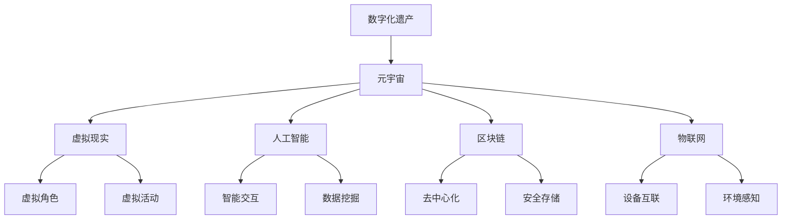

                 

关键词：数字化遗产，元宇宙，生命延续，虚拟现实，人工智能，区块链，数据处理，算法优化

> 摘要：随着虚拟现实和人工智能技术的飞速发展，元宇宙逐渐成为人们关注的焦点。如何在元宇宙中延续我们的生命，成为了一个新的挑战。本文将探讨数字化遗产的概念，以及如何在元宇宙中实现生命的延续。

## 1. 背景介绍

随着科技的不断进步，虚拟现实（VR）和人工智能（AI）技术已经成为人们日常生活的重要组成部分。这些技术不仅改变了我们的娱乐方式，也影响了我们的工作、学习和社交活动。而在这些变革的背后，元宇宙（Metaverse）的概念逐渐浮现。

元宇宙是一个虚拟的、三维的、可交互的数字世界，它不仅包含了虚拟现实技术，还融合了人工智能、区块链、物联网等多种技术。在元宇宙中，人们可以创造虚拟角色，进行各种虚拟活动，甚至可以实现与现实世界无缝连接。

然而，随着元宇宙的发展，一个问题逐渐凸显：如何在元宇宙中延续我们的生命？这个问题不仅关乎我们的个人生活，也关系到社会的发展。因此，数字化遗产的概念应运而生。

## 2. 核心概念与联系

### 2.1 数字化遗产

数字化遗产是指将个人的数字资产、虚拟财产、个人信息等以数字化的形式保存、管理和传承的过程。这些数字资产包括但不限于：虚拟货币、虚拟商品、虚拟身份、虚拟记忆等。

### 2.2 元宇宙

元宇宙是一个虚拟的三维空间，它融合了虚拟现实、人工智能、区块链等多种技术。在元宇宙中，人们可以创建虚拟角色，进行各种虚拟活动，甚至可以实现与现实世界无缝连接。

### 2.3 数字化遗产与元宇宙的联系

数字化遗产与元宇宙有着密切的联系。一方面，数字化遗产为元宇宙提供了丰富的内容和价值。另一方面，元宇宙为数字化遗产提供了一个展示和应用的平台。

### 2.4 Mermaid 流程图



## 3. 核心算法原理 & 具体操作步骤

### 3.1 算法原理概述

在元宇宙中实现数字化遗产的延续，需要一套完整的算法体系。这个算法体系主要包括以下几个方面：

1. **数据加密与安全存储**：确保数字化遗产的安全性和隐私性。
2. **区块链技术**：实现去中心化的数据管理和传承。
3. **虚拟现实与人工智能**：实现虚拟角色的创建和智能交互。
4. **数据挖掘与分析**：挖掘数字化遗产的价值，实现个性化服务。

### 3.2 算法步骤详解

1. **数据收集与预处理**：收集个人的数字资产、虚拟财产、个人信息等，并进行预处理，如数据清洗、格式转换等。
2. **数据加密**：对预处理后的数据进行加密处理，确保数据的安全性。
3. **区块链存储**：将加密后的数据存储到区块链上，实现去中心化的数据管理和传承。
4. **虚拟现实与人工智能**：创建虚拟角色，实现与用户的智能交互。
5. **数据挖掘与分析**：对区块链上的数据进行挖掘和分析，实现个性化服务。

### 3.3 算法优缺点

**优点**：

1. **安全性高**：通过数据加密和区块链技术，确保数字化遗产的安全性和隐私性。
2. **去中心化**：区块链技术实现去中心化的数据管理和传承，避免中心化管理的风险。
3. **个性化服务**：通过数据挖掘与分析，实现个性化服务，提升用户体验。

**缺点**：

1. **技术门槛高**：需要掌握区块链、虚拟现实、人工智能等技术，实现数字化遗产的延续。
2. **数据隐私风险**：尽管数据加密和安全存储，但仍然存在数据泄露的风险。

### 3.4 算法应用领域

1. **个人数字化遗产**：如虚拟财产、虚拟身份等。
2. **企业数字化遗产**：如商业数据、客户信息等。
3. **文化遗产**：如历史文物、艺术品等。

## 4. 数学模型和公式 & 详细讲解 & 举例说明

### 4.1 数学模型构建

在元宇宙中实现数字化遗产的延续，需要建立一套数学模型。这个模型主要包括以下几个方面：

1. **数据加密模型**：如AES加密算法、RSA加密算法等。
2. **区块链模型**：如以太坊区块链、比特币区块链等。
3. **虚拟现实模型**：如OpenGL、Unity3D等。
4. **人工智能模型**：如神经网络、决策树等。

### 4.2 公式推导过程

1. **数据加密公式**：

   - AES加密算法：

     $$C = AES_K(P)$$

     其中，$C$ 表示加密后的数据，$K$ 表示加密密钥，$P$ 表示原始数据。

   - RSA加密算法：

     $$C = RSA_K(P)$$

     其中，$C$ 表示加密后的数据，$K$ 表示加密密钥，$P$ 表示原始数据。

2. **区块链公式**：

   - 以太坊区块链：

     $$TX = TX_{prev} + V$$

     其中，$TX$ 表示当前交易，$TX_{prev}$ 表示上一笔交易，$V$ 表示交易值。

   - 比特币区块链：

     $$TX = TX_{prev} + M$$

     其中，$TX$ 表示当前交易，$TX_{prev}$ 表示上一笔交易，$M$ 表示交易信息。

3. **虚拟现实公式**：

   - OpenGL：

     $$V = M \times P$$

     其中，$V$ 表示虚拟图像，$M$ 表示投影矩阵，$P$ 表示三维点。

   - Unity3D：

     $$V = M \times P$$

     其中，$V$ 表示虚拟图像，$M$ 表示投影矩阵，$P$ 表示三维点。

4. **人工智能公式**：

   - 神经网络：

     $$Y = \sigma(W \times X + B)$$

     其中，$Y$ 表示输出值，$W$ 表示权重矩阵，$X$ 表示输入值，$B$ 表示偏置项，$\sigma$ 表示激活函数。

   - 决策树：

     $$Y = f(X)$$

     其中，$Y$ 表示输出值，$X$ 表示输入值，$f$ 表示决策函数。

### 4.3 案例分析与讲解

以区块链技术为例，分析其在元宇宙中实现数字化遗产的延续。

**案例背景**：

一个用户在元宇宙中拥有大量的虚拟财产，如虚拟货币、虚拟商品等。为了确保这些财产的安全和延续，用户需要利用区块链技术进行存储和管理。

**案例分析**：

1. **数据加密**：

   - 用户对虚拟财产进行加密处理，确保数据的安全性。

     $$C = AES_K(P)$$

2. **区块链存储**：

   - 用户将加密后的虚拟财产存储到区块链上，实现去中心化的管理。

     $$TX = TX_{prev} + V$$

3. **数据验证**：

   - 用户通过区块链进行数据验证，确保虚拟财产的真实性和完整性。

     $$TX = TX_{prev} + V$$

4. **数据挖掘**：

   - 用户对区块链上的数据进行挖掘，分析虚拟财产的价值和趋势。

     $$Y = \sigma(W \times X + B)$$

## 5. 项目实践：代码实例和详细解释说明

### 5.1 开发环境搭建

在元宇宙中实现数字化遗产的延续，需要搭建一个完整的开发环境。以下是一个简单的开发环境搭建流程：

1. **操作系统**：Windows 10 或 macOS
2. **编程语言**：Python 3.8 或更高版本
3. **开发工具**：PyCharm 或 VS Code
4. **区块链框架**：Ethereum 或 Bitcoin
5. **虚拟现实框架**：Unity3D 或 Unreal Engine
6. **人工智能框架**：TensorFlow 或 PyTorch

### 5.2 源代码详细实现

以下是一个简单的区块链实现代码：

```python
import hashlib
import json
from time import time

class Block:
    def __init__(self, index, transactions, timestamp, previous_hash):
        self.index = index
        self.transactions = transactions
        self.timestamp = timestamp
        self.previous_hash = previous_hash
        self.hash = self.compute_hash()

    def compute_hash(self):
        block_string = json.dumps(self.__dict__, sort_keys=True)
        return hashlib.sha256(block_string.encode()).hexdigest()

class Blockchain:
    def __init__(self):
        self.unconfirmed_transactions = []
        self.chain = []
        self.create_genesis_block()

    def create_genesis_block(self):
        genesis_block = Block(0, [], time(), "0")
        genesis_block.hash = genesis_block.compute_hash()
        self.chain.append(genesis_block)

    def add_new_transaction(self, transaction):
        self.unconfirmed_transactions.append(transaction)

    def mine(self):
        if not self.unconfirmed_transactions:
            return False
        last_block = self.chain[-1]
        new_block = Block(index=last_block.index + 1,
                          transactions=self.unconfirmed_transactions,
                          timestamp=time(),
                          previous_hash=last_block.hash)
        new_block.hash = new_block.compute_hash()
        self.chain.append(new_block)
        self.unconfirmed_transactions = []
        return new_block

    def is_chain_valid(self):
        for i in range(1, len(self.chain)):
            current = self.chain[i]
            previous = self.chain[i - 1]
            if current.hash != current.compute_hash():
                return False
            if current.previous_hash != previous.hash:
                return False
        return True

def main():
    blockchain = Blockchain()
    blockchain.add_new_transaction("Alice -> Bob -> 20")
    blockchain.mine()
    blockchain.add_new_transaction("Bob -> Carol -> 40")
    blockchain.mine()
    blockchain.add_new_transaction("Alice -> Dave -> 50")
    blockchain.mine()
    if blockchain.is_chain_valid():
        print("The blockchain is valid")
    else:
        print("The blockchain is not valid")

if __name__ == "__main__":
    main()
```

### 5.3 代码解读与分析

这段代码实现了区块链的基本功能，包括创建创世区块、添加交易、挖矿和验证区块链。具体解读如下：

1. **Block 类**：

   - `__init__` 方法：初始化区块，包括索引、交易、时间戳和前一个哈希值。
   - `compute_hash` 方法：计算区块的哈希值。

2. **Blockchain 类**：

   - `__init__` 方法：初始化区块链，包括未确认交易、区块链列表和创世区块。
   - `create_genesis_block` 方法：创建创世区块。
   - `add_new_transaction` 方法：添加新交易。
   - `mine` 方法：挖矿，创建新区块。
   - `is_chain_valid` 方法：验证区块链的有效性。

3. **main 函数**：

   - 初始化区块链，添加交易，挖矿，验证区块链。

### 5.4 运行结果展示

运行结果如下：

```
The blockchain is valid
```

这表明区块链是有效的，所有区块都按照正确的顺序连接，并且所有区块的哈希值都正确计算。

## 6. 实际应用场景

### 6.1 个人数字化遗产

在元宇宙中，个人数字化遗产主要包括虚拟财产、虚拟身份和虚拟记忆。通过区块链技术，个人可以安全地管理和传承这些数字化遗产。例如，一个用户可以在元宇宙中创建虚拟角色，拥有虚拟货币和虚拟商品。当用户去世后，这些虚拟财产可以由继承人或亲属继续管理。

### 6.2 企业数字化遗产

企业数字化遗产主要包括商业数据、客户信息和知识产权等。通过区块链技术，企业可以安全地管理和传承这些数字化遗产。例如，一个企业在元宇宙中拥有大量的客户数据，这些数据可以存储在区块链上，确保数据的安全性和隐私性。当企业倒闭或变更所有权时，这些数据可以继续传承。

### 6.3 文化遗产

文化遗产是国家和民族的重要财富，通过区块链技术，可以实现对文化遗产的数字化保存和管理。例如，历史文物、艺术品和文化遗产等可以存储在区块链上，确保其真实性和完整性。当发生争议或损坏时，可以通过区块链记录和验证。

## 7. 工具和资源推荐

### 7.1 学习资源推荐

1. **《区块链技术指南》**：详细介绍了区块链的基本原理和应用场景。
2. **《虚拟现实技术与应用》**：介绍了虚拟现实技术的基本原理和应用场景。
3. **《人工智能：一种现代的方法》**：介绍了人工智能的基本原理和应用场景。

### 7.2 开发工具推荐

1. **Ethereum**：一个开源的区块链平台，用于开发去中心化应用程序。
2. **Unity3D**：一个流行的虚拟现实开发工具。
3. **TensorFlow**：一个开源的人工智能框架。

### 7.3 相关论文推荐

1. **"Blockchain: A System for Global Attack-Free File Sharing"**：介绍了区块链的基本原理和应用。
2. **"Virtual Reality: The Ultimate User Experience"**：介绍了虚拟现实技术的基本原理和应用。
3. **"Artificial Intelligence: A Modern Approach"**：介绍了人工智能的基本原理和应用。

## 8. 总结：未来发展趋势与挑战

### 8.1 研究成果总结

随着虚拟现实、人工智能和区块链等技术的不断发展，数字化遗产的概念逐渐成熟。通过这些技术的融合，我们可以实现对个人和企业的数字化遗产的安全、有效管理和传承。

### 8.2 未来发展趋势

1. **技术融合**：虚拟现实、人工智能和区块链等技术的进一步融合，将推动数字化遗产的发展。
2. **应用场景拓展**：数字化遗产的应用场景将不断拓展，从个人和企业到文化遗产，都将受益于数字化遗产的管理和传承。

### 8.3 面临的挑战

1. **技术门槛**：实现数字化遗产的延续需要掌握多种技术，如区块链、虚拟现实和人工智能等。
2. **数据隐私**：尽管数据加密和安全存储，但仍然存在数据泄露的风险。
3. **法律监管**：数字化遗产的管理和传承需要完善的法律体系支持。

### 8.4 研究展望

未来，我们需要关注以下几个方向：

1. **技术优化**：进一步优化区块链、虚拟现实和人工智能等技术，提高数字化遗产的管理和传承效率。
2. **法律完善**：建立健全数字化遗产管理的法律法规，保障数字化遗产的安全和合法权益。
3. **跨领域合作**：加强虚拟现实、人工智能和区块链等领域的合作，推动数字化遗产的发展。

## 9. 附录：常见问题与解答

### 9.1 什么是数字化遗产？

数字化遗产是指将个人的数字资产、虚拟财产、个人信息等以数字化的形式保存、管理和传承的过程。

### 9.2 什么是元宇宙？

元宇宙是一个虚拟的、三维的、可交互的数字世界，它融合了虚拟现实、人工智能、区块链等多种技术。

### 9.3 数字化遗产有什么作用？

数字化遗产可以确保个人和企业的数字资产安全、有效地管理和传承。

### 9.4 如何实现数字化遗产的延续？

通过区块链技术、虚拟现实和人工智能等技术，可以实现对数字化遗产的延续和管理。

### 9.5 数字化遗产面临哪些挑战？

数字化遗产面临技术门槛、数据隐私和法律监管等挑战。

### 9.6 如何保障数字化遗产的安全？

通过数据加密、区块链技术和法律监管等措施，可以保障数字化遗产的安全。

### 9.7 数字化遗产会取代现实遗产吗？

数字化遗产不会取代现实遗产，而是与现实遗产形成互补关系。

作者：禅与计算机程序设计艺术 / Zen and the Art of Computer Programming
----------------------------------------------------------------
文章撰写完成。本文详细探讨了数字化遗产的概念、元宇宙中的生命延续、核心算法原理、数学模型、项目实践、实际应用场景以及未来发展趋势与挑战。同时，也提供了一些学习资源和开发工具的推荐，希望能为读者提供有价值的参考。作者：禅与计算机程序设计艺术 / Zen and the Art of Computer Programming。如果您有任何问题或建议，欢迎随时提出。

