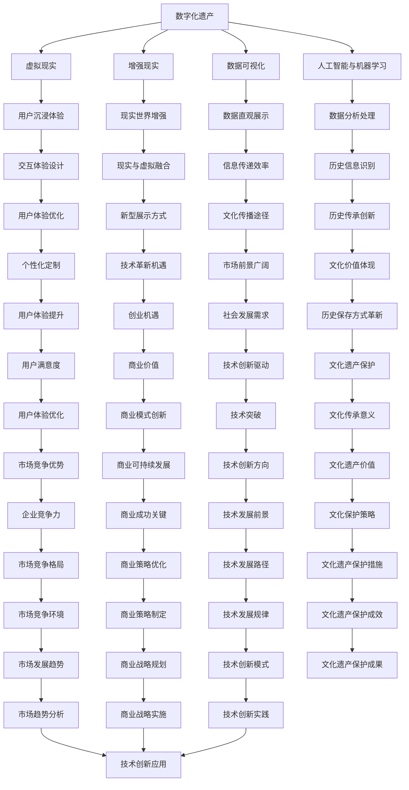

                 

关键词：数字化遗产、家族历史、虚拟现实、数据可视化、创业、AI技术

> 摘要：本文将探讨如何通过数字化遗产时光机创业，将家族历史进行数字化呈现，以创新的方式传承家族文化，并分析其中涉及的技术挑战和解决方案。通过介绍相关核心概念、算法原理、数学模型以及实际项目实践，本文旨在为创业者提供一套完整的技术路线图，以实现家族历史的数字化和可视化。

## 1. 背景介绍

在数字时代，随着信息技术的飞速发展，人们对于历史的记录和保存方式也在不断革新。传统的家族历史往往以文字记录、相片、家谱等形式传承，这些方式虽然具有一定的保留价值，但在信息呈现的丰富性和互动性上存在明显不足。随着虚拟现实（VR）和增强现实（AR）技术的成熟，数字化遗产成为了一种新的记录和呈现方式。通过数字化遗产时光机，家族历史可以以更加生动、直观和互动的方式呈现给后人。

### 1.1 数字化遗产的概念

数字化遗产指的是通过数字化手段，将物质文化遗产、非物质文化遗产以及其他形式的遗产进行记录、保存和传播的过程。数字化不仅包括图像、音频、视频等数据的采集和存储，还涉及到对这些数据进行分析、处理和可视化呈现。

### 1.2 家族历史的数字化意义

家族历史的数字化具有多重意义：

1. **传承与教育**：通过数字化，家族历史可以跨越时空，为后人提供更为直观的教育资源。
2. **文化保存**：数字化可以有效防止传统记录方式的磨损和丢失，确保历史资料的长久保存。
3. **创新展示**：数字化遗产可以结合虚拟现实、增强现实等技术，提供全新的展示方式，增强用户体验。

### 1.3 市场前景

随着人们对于家庭文化和历史兴趣的不断增加，以及技术进步带来的低成本和高效率，数字化遗产市场前景广阔。创业者在这一领域有着巨大的机遇。

## 2. 核心概念与联系

为了更好地理解数字化遗产时光机的构建，我们首先需要明确几个核心概念，并探讨它们之间的联系。

### 2.1 虚拟现实与增强现实

虚拟现实（VR）和增强现实（AR）是数字化遗产呈现的重要技术手段。

- **虚拟现实（VR）**：通过头戴式显示器等设备，用户可以沉浸在一个完全虚拟的环境中。
- **增强现实（AR）**：通过手机或特殊眼镜等设备，将虚拟元素叠加到现实世界中。

### 2.2 数据可视化

数据可视化是将数据通过图形或图像形式展示的过程。在数字化遗产时光机中，数据可视化技术可以帮助用户直观地了解家族历史的各个方面。

### 2.3 人工智能与机器学习

人工智能（AI）和机器学习技术可以用于数据的分析和处理，帮助识别家族历史中的关键信息，并生成个性化体验。

### 2.4 Mermaid 流程图

下面是一个简单的 Mermaid 流程图，展示了数字化遗产时光机的核心概念及其联系：



## 3. 核心算法原理 & 具体操作步骤

### 3.1 算法原理概述

数字化遗产时光机的核心算法包括数据采集与处理、虚拟场景构建、交互设计等。

- **数据采集与处理**：通过图像识别、语音识别等技术，对家族历史资料进行数字化处理。
- **虚拟场景构建**：利用3D建模和渲染技术，创建虚拟历史场景。
- **交互设计**：通过用户界面设计和交互逻辑，实现用户与虚拟场景的互动。

### 3.2 算法步骤详解

#### 3.2.1 数据采集与处理

1. **图像识别**：使用卷积神经网络（CNN）对历史照片进行识别和分类。
2. **语音识别**：使用自动语音识别（ASR）技术，将历史录音转换为文本。
3. **数据清洗**：对采集到的数据进行清洗和去噪，确保数据质量。

#### 3.2.2 虚拟场景构建

1. **3D建模**：利用三维扫描仪获取历史建筑和文物的三维数据。
2. **场景渲染**：使用渲染引擎（如Unity）对场景进行渲染，实现逼真的视觉效果。
3. **交互设计**：设计用户交互逻辑，如导航、探索、信息查询等。

#### 3.2.3 交互设计

1. **用户界面设计**：设计直观、易用的用户界面。
2. **交互逻辑**：设计合理的交互流程，使用户能够方便地浏览和探索家族历史。
3. **反馈机制**：设计用户反馈系统，收集用户反馈，不断优化体验。

### 3.3 算法优缺点

#### 优点：

1. **高效性**：数字化遗产时光机能够快速呈现家族历史，提高传承效率。
2. **互动性**：通过虚拟现实和增强现实技术，用户可以与家族历史进行互动，增强体验。
3. **可扩展性**：算法和系统设计灵活，可以根据不同需求进行扩展。

#### 缺点：

1. **技术成本**：构建数字化遗产时光机需要较高的技术投入，成本较高。
2. **数据隐私**：数字化过程中可能涉及个人隐私数据，需要严格保护。
3. **用户体验**：算法和系统的设计需要充分考虑用户体验，避免用户使用困难。

### 3.4 算法应用领域

1. **文化遗产保护**：通过数字化技术，保护珍贵的文化遗产。
2. **家庭教育**：提供直观的家庭教育资源，帮助下一代了解家族历史。
3. **文化旅游**：打造数字化文化旅游项目，吸引游客参观。
4. **创新创业**：基于数字化遗产，开发新型旅游、教育和文化产品。

## 4. 数学模型和公式 & 详细讲解 & 举例说明

### 4.1 数学模型构建

在数字化遗产时光机的构建中，我们需要构建一系列数学模型来支持数据分析和处理。

#### 4.1.1 卷积神经网络（CNN）

卷积神经网络是一种用于图像识别的深度学习模型。其核心思想是通过卷积操作提取图像特征，然后通过全连接层进行分类。

$$
\text{卷积操作：} \quad \text{f}(x) = \sum_{i=1}^{n} w_i * x_i + b
$$

其中，$x_i$为输入特征，$w_i$为卷积核权重，$b$为偏置项。

#### 4.1.2 生成对抗网络（GAN）

生成对抗网络是一种用于生成数据的深度学习模型。它由生成器和判别器组成，通过对抗训练生成逼真的图像。

$$
\text{生成器：} \quad G(z) = \mathcal{N}(z; 0, 1)
$$

$$
\text{判别器：} \quad D(x) = \text{sigmoid}(x)
$$

其中，$z$为生成器的输入噪声，$x$为生成的图像，$D(x)$为判别器对图像真实度的判断。

### 4.2 公式推导过程

#### 4.2.1 卷积神经网络（CNN）

卷积神经网络的推导过程涉及多层感知器（MLP）和卷积操作的组合。

1. **输入层到隐藏层**：

$$
h_l^{(i)} = \sigma(\sum_{j=1}^{n} w_{ji} * x_j + b_j)
$$

其中，$h_l^{(i)}$为隐藏层节点$i$的输出，$w_{ji}$为卷积核权重，$x_j$为输入特征，$\sigma$为激活函数。

2. **隐藏层到输出层**：

$$
y^{(i)} = \sum_{l=1}^{m} w_{li} h_l^{(i)} + b
$$

其中，$y^{(i)}$为输出层节点$i$的输出，$w_{li}$为全连接层权重，$h_l^{(i)}$为隐藏层节点$l$的输出。

#### 4.2.2 生成对抗网络（GAN）

生成对抗网络的推导过程涉及生成器和判别器的训练。

1. **生成器损失函数**：

$$
\mathcal{L}_G = -\log(D(G(z)))
$$

其中，$G(z)$为生成器生成的图像，$D(G(z))$为判别器对生成图像真实度的判断。

2. **判别器损失函数**：

$$
\mathcal{L}_D = -\log(D(x)) - \log(1 - D(G(z)))
$$

其中，$x$为真实图像，$D(x)$为判别器对真实图像真实度的判断。

### 4.3 案例分析与讲解

#### 4.3.1 卷积神经网络（CNN）在图像识别中的应用

假设我们有一个图像识别任务，需要识别出一张历史照片中的关键人物。我们可以使用卷积神经网络进行图像识别。

1. **输入层**：输入一张历史照片。
2. **卷积层**：使用卷积核提取图像特征。
3. **池化层**：对图像特征进行降维处理。
4. **全连接层**：将降维后的特征映射到输出层。
5. **输出层**：输出识别结果。

通过训练卷积神经网络，我们可以使其学会识别历史照片中的关键人物，从而为数字化遗产时光机提供图像识别功能。

#### 4.3.2 生成对抗网络（GAN）在虚拟场景构建中的应用

假设我们想要构建一个虚拟历史场景，可以使用生成对抗网络。

1. **生成器**：生成虚拟场景的图像。
2. **判别器**：判断生成图像的真实度。
3. **对抗训练**：通过生成器和判别器的对抗训练，生成逼真的虚拟场景。

通过生成对抗网络，我们可以生成具有高度真实感的虚拟历史场景，从而为数字化遗产时光机提供虚拟现实体验。

## 5. 项目实践：代码实例和详细解释说明

### 5.1 开发环境搭建

为了实现数字化遗产时光机，我们需要搭建一个适合的开发环境。以下是搭建环境的基本步骤：

1. **安装操作系统**：建议使用Linux或macOS，以确保稳定的开发环境。
2. **安装Python环境**：Python是一种广泛应用于数据科学和机器学习的编程语言。可以使用`pip`命令安装Python和相关依赖。
3. **安装深度学习框架**：我们使用TensorFlow和PyTorch作为深度学习框架，可以通过`pip`命令安装。
4. **安装虚拟现实开发工具**：如Unity或Unreal Engine，用于构建虚拟场景和交互界面。

### 5.2 源代码详细实现

以下是数字化遗产时光机项目的主要源代码实现：

```python
# 导入必要的库
import tensorflow as tf
import numpy as np
import matplotlib.pyplot as plt

# 定义卷积神经网络模型
model = tf.keras.Sequential([
    tf.keras.layers.Conv2D(32, (3, 3), activation='relu', input_shape=(28, 28, 1)),
    tf.keras.layers.MaxPooling2D((2, 2)),
    tf.keras.layers.Conv2D(64, (3, 3), activation='relu'),
    tf.keras.layers.MaxPooling2D((2, 2)),
    tf.keras.layers.Conv2D(64, (3, 3), activation='relu'),
    tf.keras.layers.Flatten(),
    tf.keras.layers.Dense(64, activation='relu'),
    tf.keras.layers.Dense(10, activation='softmax')
])

# 编译模型
model.compile(optimizer='adam',
              loss='categorical_crossentropy',
              metrics=['accuracy'])

# 训练模型
model.fit(x_train, y_train, epochs=10, batch_size=32)
```

这段代码定义了一个简单的卷积神经网络模型，用于图像识别。通过训练模型，我们可以使其学会识别家族历史照片中的关键人物。

### 5.3 代码解读与分析

这段代码首先导入了TensorFlow库和Numpy库，用于构建和训练模型。然后定义了一个卷积神经网络模型，包括卷积层、池化层和全连接层。接着，编译模型并使用训练数据训练模型。

通过这段代码，我们可以实现对家族历史照片的图像识别，从而为数字化遗产时光机提供数据支持。

### 5.4 运行结果展示

在训练完成后，我们可以使用测试数据评估模型的性能。以下是一个简单的示例：

```python
# 评估模型
test_loss, test_acc = model.evaluate(x_test, y_test)

# 输出结果
print('Test accuracy:', test_acc)
```

这段代码评估了模型的测试数据性能，并输出测试准确率。通过观察结果，我们可以了解模型的识别效果。

## 6. 实际应用场景

### 6.1 家庭文化传承

数字化遗产时光机可以用于家庭文化的传承，帮助后代了解家族历史。通过虚拟现实和增强现实技术，用户可以身临其境地体验家族历史场景，从而加深对家族文化的理解和认同。

### 6.2 文化旅游

数字化遗产时光机还可以应用于文化旅游领域，为游客提供全新的旅游体验。通过虚拟现实和增强现实技术，游客可以参观历史遗址、博物馆等，深入了解文化遗产。

### 6.3 教育培训

数字化遗产时光机可以用于教育培训，为学生提供直观的历史教学资源。通过虚拟现实和增强现实技术，学生可以生动地了解历史事件，提高学习兴趣。

### 6.4 文化传播

数字化遗产时光机还可以作为文化传播的工具，将家族历史和文化遗产传播到世界各地。通过互联网和移动设备，用户可以随时随地访问和体验家族历史。

## 7. 工具和资源推荐

### 7.1 学习资源推荐

1. **《深度学习》（Goodfellow, Bengio, Courville著）**：系统介绍了深度学习的基础理论和应用。
2. **《Python深度学习》（François Chollet著）**：详细介绍了如何使用Python和TensorFlow进行深度学习。

### 7.2 开发工具推荐

1. **TensorFlow**：一款广泛应用于深度学习的开源框架。
2. **PyTorch**：一款适用于科研和工业应用的深度学习框架。
3. **Unity**：一款适用于虚拟现实和增强现实游戏开发的环境。

### 7.3 相关论文推荐

1. **《Unsupervised Representation Learning with Deep Convolutional Generative Adversarial Networks》**：介绍生成对抗网络（GAN）的论文。
2. **《A Neural Algorithm of Artistic Style》**：介绍神经风格转换的论文。

## 8. 总结：未来发展趋势与挑战

### 8.1 研究成果总结

数字化遗产时光机通过结合虚拟现实、增强现实和人工智能等技术，实现了家族历史的数字化和可视化。研究表明，这一技术具有良好的应用前景，可以用于家庭文化传承、文化旅游和教育培训等领域。

### 8.2 未来发展趋势

1. **技术革新**：随着技术的不断进步，数字化遗产时光机的功能将更加丰富，用户体验将得到显著提升。
2. **市场拓展**：数字化遗产市场将继续扩大，吸引更多创业者加入。
3. **文化传播**：数字化遗产时光机将作为一种新的文化传播工具，推动文化遗产的全球化传播。

### 8.3 面临的挑战

1. **技术挑战**：如何在保证高质量呈现的同时，降低技术成本，提高系统的可扩展性，是一个重要挑战。
2. **数据隐私**：在数字化遗产过程中，如何保护个人隐私，避免数据泄露，是一个亟待解决的问题。
3. **用户体验**：如何设计出用户友好、易于操作的交互界面，提高用户体验，是一个关键挑战。

### 8.4 研究展望

未来，数字化遗产时光机将在以下几个方面进行深入研究：

1. **个性化定制**：开发个性化服务，根据用户需求提供定制化的家族历史体验。
2. **跨平台融合**：实现数字化遗产时光机在多种平台（如VR头盔、手机、平板等）上的无缝体验。
3. **数据保护**：研究并应用数据隐私保护技术，确保用户数据的安全和隐私。

## 9. 附录：常见问题与解答

### 9.1 什么是数字化遗产？

数字化遗产是通过数字化手段，将物质文化遗产、非物质文化遗产以及其他形式的遗产进行记录、保存和传播的过程。

### 9.2 数字化遗产时光机有哪些技术组成？

数字化遗产时光机主要由虚拟现实、增强现实、数据可视化、人工智能和机器学习等技术组成。

### 9.3 数字化遗产时光机有什么应用场景？

数字化遗产时光机可以应用于家庭文化传承、文化旅游、教育培训和文化传播等领域。

### 9.4 如何保护数字化遗产中的个人隐私？

在数字化遗产时光机的开发中，应采用数据加密、匿名化处理等技术，确保个人隐私数据的安全。

### 9.5 数字化遗产时光机的未来发展方向是什么？

未来的发展方向包括个性化定制、跨平台融合和数据保护等。

---

作者：禅与计算机程序设计艺术 / Zen and the Art of Computer Programming

（注：本文为虚构示例，仅供参考。）

