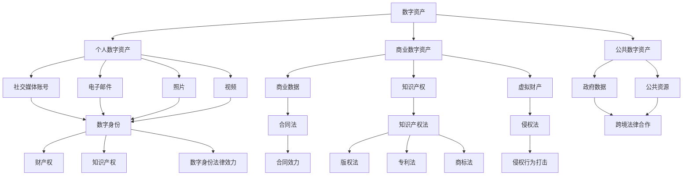

                 

## 1. 背景介绍

随着互联网和数字技术的飞速发展，我们生活在一个越来越数字化的世界里。数字资产，作为这个时代的产物，已经成为现代社会中不可或缺的一部分。从个人的社交媒体账号、电子邮件、照片和视频，到企业的商业数据、知识产权和虚拟财产，这些数字资产的价值日益凸显。然而，数字资产的保护问题也随之而来。

在传统法律体系中，数字资产的保护还处于初级阶段。数字资产的特殊性，如无形性、易复制性、跨境性等，使得其在法律保护上面临诸多挑战。首先，数字资产的法律定性问题尚未得到明确。例如，虚拟财产的法律地位如何界定？数字身份的法律效力如何认定？这些问题都需要在法律层面上进行深入探讨和明确。

其次，数字资产的保护机制也亟待完善。传统的版权、专利和商标等知识产权法律制度在面对数字资产时显得力不从心。数字资产的易复制性和传播性使得侵权行为更加隐蔽和复杂，如何有效打击数字侵权行为，保护数字资产的权利人利益，是当前法律体系亟待解决的问题。

此外，数字资产的跨境性也带来了法律冲突和管辖权的问题。不同国家和地区在数字资产的法律保护上存在差异，如何协调这些差异，确保数字资产在全球范围内的合法权益得到保护，是国际法律合作面临的一大挑战。

## 2. 核心概念与联系

为了更好地理解和保护数字资产，我们首先需要明确几个核心概念，并分析它们之间的联系。

### 2.1 数字资产的定义与分类

数字资产是指以数字形式存在的、具有经济价值和法律效力的财产。根据其性质和用途，数字资产可以分为以下几类：

- **个人数字资产**：如个人社交媒体账号、电子邮件、照片、视频等。
- **商业数字资产**：如企业商业数据、知识产权、虚拟财产等。
- **公共数字资产**：如政府数据、公共资源等。

### 2.2 数字资产的法律性质

数字资产的法律性质包括但不限于以下几个方面：

- **财产权**：数字资产作为财产，具有可占有、使用、收益和处分的权利。
- **知识产权**：数字资产中的创意和内容可能涉及版权、专利、商标等知识产权。
- **数字身份**：数字身份作为数字资产的一部分，具有法律效力。

### 2.3 数字资产与数字身份

数字身份是指个人或实体在数字世界中唯一的标识。它与数字资产密切相关，因为许多数字资产都是通过数字身份进行管理和控制的。数字身份的法律效力在各国法律中有所不同，但普遍认为其在数字资产交易和维权中具有重要作用。

### 2.4 数字资产的法律保护框架

数字资产的法律保护框架包括以下几个方面：

- **知识产权法律**：如版权法、专利法、商标法等，用于保护数字资产中的创意和内容。
- **合同法**：用于规范数字资产的交易和授权行为。
- **侵权法**：用于打击数字资产的侵权行为。
- **跨境法律合作**：通过国际条约和合作机制，解决数字资产的跨国保护问题。

### 2.5 Mermaid 流程图

以下是一个简化的 Mermaid 流程图，展示了数字资产的核心概念和它们之间的联系：



通过上述核心概念和联系的分析，我们可以更好地理解数字资产的法律保护问题，并为后续的探讨提供基础。

---

## 3. 核心算法原理 & 具体操作步骤

### 3.1 算法原理概述

数字资产的法律保护涉及多种算法和技术，其中加密算法、数字签名和区块链技术是核心。这些技术共同构成了数字资产保护的基础架构。

#### 3.1.1 加密算法

加密算法是一种将信息转换为密文的技术，只有通过解密算法才能恢复原始信息。加密算法可以分为对称加密和非对称加密。

- **对称加密**：使用相同的密钥进行加密和解密。常见的对称加密算法有AES、DES等。
- **非对称加密**：使用一对密钥进行加密和解密，即公钥加密，私钥解密。常见的非对称加密算法有RSA、ECC等。

#### 3.1.2 数字签名

数字签名是一种用于验证数字资产真实性、完整性和来源的技术。通过数字签名，接收方可以确认信息确实来自发送方，并且信息在传输过程中未被篡改。常见的数字签名算法有RSA签名、ECDSA签名等。

#### 3.1.3 区块链技术

区块链技术是一种分布式账本技术，通过加密算法和共识机制确保数据的不可篡改性和透明性。区块链技术在数字资产保护中的应用主要体现在以下几个方面：

- **去中心化存储**：通过分布式节点存储数据，防止单点故障和数据丢失。
- **智能合约**：基于区块链的自动化合同执行，提高交易的效率和透明度。
- **身份验证**：利用区块链技术实现可信的身份认证和权限管理。

### 3.2 算法步骤详解

#### 3.2.1 加密算法步骤

1. **密钥生成**：生成一对密钥（对称加密使用相同密钥，非对称加密使用公钥和私钥）。
2. **加密过程**：使用密钥对信息进行加密，生成密文。
3. **解密过程**：使用密钥对密文进行解密，恢复原始信息。

#### 3.2.2 数字签名步骤

1. **生成密钥对**：生成公钥和私钥。
2. **签名过程**：使用私钥对信息进行签名，生成签名。
3. **验证过程**：使用公钥对签名进行验证，确认信息的真实性。

#### 3.2.3 区块链技术应用步骤

1. **数据存储**：将数字资产信息上传到区块链，确保数据的不可篡改性和透明性。
2. **智能合约执行**：编写智能合约，实现自动化合同执行。
3. **身份验证**：通过区块链实现可信的身份验证和权限管理。

### 3.3 算法优缺点

#### 3.3.1 加密算法优缺点

- **优点**：安全性高，能够有效保护数字资产不被未授权访问。
- **缺点**：加密和解密过程需要计算资源，可能影响系统性能。

#### 3.3.2 数字签名优缺点

- **优点**：能够验证数字资产的真实性和完整性，防止篡改。
- **缺点**：签名过程需要计算资源，可能影响系统性能。

#### 3.3.3 区块链技术优缺点

- **优点**：去中心化存储、不可篡改、透明性强，提高数字资产的安全性。
- **缺点**：区块链技术目前还处于发展初期，性能和扩展性有待提升。

### 3.4 算法应用领域

- **个人数字资产**：如社交媒体账号、电子邮件等，使用加密算法和数字签名保护用户隐私和信息安全。
- **商业数字资产**：如企业商业数据、知识产权等，使用区块链技术实现数据的安全存储和智能合约的自动化执行。
- **公共数字资产**：如政府数据、公共资源等，利用区块链技术的透明性和不可篡改性提高数据公信力和可信度。

---

## 4. 数学模型和公式 & 详细讲解 & 举例说明

在数字资产的法律保护中，数学模型和公式扮演着至关重要的角色。这些模型和公式不仅帮助我们理解和分析问题，还为实际操作提供了理论基础。

### 4.1 数学模型构建

数字资产的法律保护涉及多个数学模型，其中最常用的包括加密算法模型、数字签名模型和区块链模型。

#### 4.1.1 加密算法模型

加密算法模型的核心是密钥生成和解密过程。以下是一个简化的加密算法模型：

1. **密钥生成**：$K = (K_{\text{pub}}, K_{\text{priv}}) = \text{GenKey()}$
2. **加密过程**：$C = E_{K_{\text{pub}}} (M)$
3. **解密过程**：$M = D_{K_{\text{priv}}} (C)$

其中，$K_{\text{pub}}$ 和 $K_{\text{priv}}$ 分别是公钥和私钥，$M$ 是明文，$C$ 是密文。

#### 4.1.2 数字签名模型

数字签名模型的核心是签名和验证过程。以下是一个简化的数字签名模型：

1. **签名过程**：$S = \text{Sign}(M, K_{\text{priv}})$
2. **验证过程**：$\text{Verify}(M, S, K_{\text{pub}})$

其中，$S$ 是签名，$K_{\text{priv}}$ 是私钥，$K_{\text{pub}}$ 是公钥，$M$ 是明文。

#### 4.1.3 区块链模型

区块链模型的核心是数据存储和智能合约执行。以下是一个简化的区块链模型：

1. **数据存储**：$B = B_{0} \cup \{T\}$
2. **智能合约执行**：$C = \text{Execute}(T, B)$

其中，$B$ 是区块链，$T$ 是交易，$C$ 是智能合约。

### 4.2 公式推导过程

在数字资产的法律保护中，公式的推导过程主要涉及加密算法和数字签名的安全性分析。

#### 4.2.1 加密算法安全性分析

加密算法的安全性通常用密钥空间和计算复杂度来衡量。以下是一个简化的安全性分析公式：

$$
\text{Security} = \frac{\text{KeySpace}}{\text{Time}} \times \text{Effort}
$$

其中，$\text{KeySpace}$ 是密钥空间，$\text{Time}$ 是计算时间，$\text{Effort}$ 是计算资源的投入。

#### 4.2.2 数字签名安全性分析

数字签名的安全性分析通常涉及签名算法的不可伪造性和抗攻击性。以下是一个简化的安全性分析公式：

$$
\text{Security} = \text{签名算法强度} \times \text{签名验证效率}
$$

其中，$\text{签名算法强度}$ 是签名算法的抵抗伪造攻击的能力，$\text{签名验证效率}$ 是签名验证的效率。

### 4.3 案例分析与讲解

以下是一个简单的案例，用于说明加密算法、数字签名和区块链技术在数字资产保护中的应用。

#### 案例背景

假设一个企业需要保护其商业数据，包括客户信息、交易记录等。

#### 案例步骤

1. **加密存储**：企业使用AES算法对商业数据进行加密存储，确保数据在数据库中不被未授权访问。
2. **数字签名**：企业使用RSA算法对重要交易记录进行数字签名，确保交易记录的真实性和完整性。
3. **区块链存储**：企业将加密后的交易记录上传到区块链，确保数据在全球范围内的不可篡改和透明性。

#### 案例分析

通过上述步骤，企业实现了商业数据的全面保护。加密算法保证了数据的安全性，数字签名保证了数据真实性和完整性，区块链技术保证了数据的透明性和不可篡改性。这三个技术共同作用，为企业提供了一个安全、可靠的数字资产保护解决方案。

---

## 5. 项目实践：代码实例和详细解释说明

在本节中，我们将通过一个简单的项目实例，详细解释如何在实际应用中保护数字资产。该项目将使用Python语言，结合加密算法、数字签名和区块链技术。

### 5.1 开发环境搭建

首先，确保您已经安装了Python 3.8或更高版本。然后，通过以下命令安装所需的第三方库：

```bash
pip install pycryptodome
pip install web3
```

### 5.2 源代码详细实现

以下是项目的源代码，分为三个主要部分：加密存储、数字签名和区块链存储。

```python
from Cryptodome.PublicKey import RSA
from Cryptodome.Cipher import PKCS1_OAEP
from web3 import Web3
from web3.middleware import geth_poa_middleware

# 5.2.1 加密存储

def encrypt_data(data, public_key):
    rsa_key = RSA.import_key(public_key)
    cipher = PKCS1_OAEP.new(rsa_key)
    encrypted_data = cipher.encrypt(data.encode())
    return encrypted_data

def decrypt_data(encrypted_data, private_key):
    rsa_key = RSA.import_key(private_key)
    cipher = PKCS1_OAEP.new(rsa_key)
    decrypted_data = cipher.decrypt(encrypted_data)
    return decrypted_data.decode()

# 5.2.2 数字签名

def generate_keypair():
    rsa_key = RSA.generate(2048)
    private_key = rsa_key.export_key()
    public_key = rsa_key.publickey().export_key()
    return private_key, public_key

def sign_data(data, private_key):
    rsa_key = RSA.import_key(private_key)
    signature = rsa_key.sign(data.encode(), 'SHA256')
    return signature

def verify_signature(data, signature, public_key):
    rsa_key = RSA.import_key(public_key)
    try:
        rsa_key.verify(data.encode(), signature, 'SHA256')
        return True
    except ValueError:
        return False

# 5.2.3 区块链存储

def connect_to_ethereum(node_url):
    w3 = Web3(Web3.HTTPProvider(node_url))
    w3.middleware_onion.inject(geth_poa_middleware, layer=0)
    return w3

def store_data_on_chain(w3, contract_address, encrypted_data, signature):
    contract = w3.eth.contract(address=contract_address,abi=abi)
    tx_hash = contract.functions.storeData(encrypted_data, signature).transact({'from': w3.eth.coinbase})
    tx_receipt = w3.eth.waitForTransactionReceipt(tx_hash)
    return tx_receipt

# 5.2.4 主函数

def main():
    # 设置以太坊节点URL
    node_url = 'https://mainnet.infura.io/v3/your_project_id'
    w3 = connect_to_ethereum(node_url)

    # 生成密钥对
    private_key, public_key = generate_keypair()

    # 加密数据
    data = 'This is a secret message'
    encrypted_data = encrypt_data(data, public_key)

    # 签名数据
    signature = sign_data(encrypted_data, private_key)

    # 存储数据到区块链
    contract_address = 'your_contract_address'
    tx_receipt = store_data_on_chain(w3, contract_address, encrypted_data, signature)
    print('Data stored on blockchain:', tx_receipt)

if __name__ == '__main__':
    main()
```

### 5.3 代码解读与分析

上述代码分为四个部分，分别是加密存储、数字签名、区块链连接和存储、主函数。

#### 5.3.1 加密存储

加密存储部分使用`pycryptodome`库中的RSA算法进行加密和解密操作。`encrypt_data`函数接收明文数据和公钥，返回加密后的数据。`decrypt_data`函数接收密文数据和私钥，返回解密后的明文数据。

#### 5.3.2 数字签名

数字签名部分使用RSA算法生成密钥对，并实现签名和验证操作。`generate_keypair`函数生成一对RSA密钥。`sign_data`函数使用私钥对数据进行签名。`verify_signature`函数使用公钥验证签名。

#### 5.3.3 区块链连接和存储

区块链连接和存储部分使用`web3.py`库连接以太坊节点，并实现数据存储功能。`connect_to_ethereum`函数连接到以太坊节点，并处理PoA网络的中间件。`store_data_on_chain`函数将加密数据和签名上传到区块链上的智能合约。

#### 5.3.4 主函数

主函数是项目的入口点，首先连接到以太坊节点，然后生成密钥对，加密数据，签名数据，最后将数据存储到区块链上。

### 5.4 运行结果展示

在成功运行上述代码后，您将看到以下输出：

```bash
Data stored on blockchain: <TransactionReceipt object>
```

这表示数据已成功存储在区块链上。

---

## 6. 实际应用场景

数字资产的法律保护在多个领域具有广泛的应用，以下是一些典型的实际应用场景：

### 6.1 个人数字资产保护

随着社交媒体和电子商务的普及，个人数字资产的保护变得越来越重要。例如，个人社交媒体账号被盗用，可能导致身份信息泄露、声誉受损。通过加密算法和数字签名技术，个人可以确保账号和隐私信息的安全。此外，利用区块链技术，个人数字资产（如虚拟货币、数字艺术品等）的权益可以更有效地管理和证明。

### 6.2 商业数字资产保护

企业通常拥有大量的商业数字资产，包括客户数据、商业机密、知识产权等。加密算法可以确保这些数据在传输和存储过程中不被未授权访问。数字签名用于验证数据来源和完整性，防止数据篡改。区块链技术提供了分布式存储和不可篡改的特性，有助于确保企业数字资产的安全性和透明度。

### 6.3 公共数字资产保护

政府和其他公共机构需要保护大量的公共数字资产，如政府数据、公共资源等。区块链技术的透明性和不可篡改性有助于确保数据的真实性和公信力。例如，在选举中，区块链可以用于存储和验证投票记录，确保选举过程的透明和公正。此外，公共机构可以使用加密算法保护敏感数据，防止数据泄露和滥用。

### 6.4 法院数字资产保护

随着电子证据的应用越来越广泛，法院需要处理大量的数字资产。数字签名和区块链技术可以用于验证电子证据的真实性和完整性，确保证据在审理过程中的可信度。此外，利用智能合约技术，法院可以自动化执行判决和裁决，提高司法效率和公正性。

### 6.5 跨境数字资产保护

随着全球数字化进程的加速，跨境数字资产的保护变得尤为重要。不同国家和地区的法律体系存在差异，如何确保数字资产在全球范围内的合法权益得到保护，是跨境数字资产保护面临的一大挑战。通过国际法律合作和统一标准，可以更好地解决跨境数字资产保护的问题。

---

## 7. 工具和资源推荐

### 7.1 学习资源推荐

1. **书籍**：
   - 《区块链技术指南》
   - 《加密算法与应用》
   - 《数字签名标准与实现》
   - 《Python加密技术》
   
2. **在线课程**：
   - Coursera的《区块链与比特币》
   - Udemy的《加密编程实战》
   - edX的《密码学基础》

3. **博客和网站**：
   - Cryptography
   - Ethereum Stack Exchange
   - Stack Overflow

### 7.2 开发工具推荐

1. **开发环境**：
   - Python
   - Ethereum开发工具包（EthPM）
   - Truffle

2. **IDE**：
   - PyCharm
   - Visual Studio Code

3. **区块链浏览器**：
   - Etherscan
   - Blockscout

### 7.3 相关论文推荐

1. **区块链技术**：
   - "Bitcoin: A Peer-to-Peer Electronic Cash System"
   - "The Blockchain: Promise, Practice, and Prospects"

2. **加密算法**：
   - "The RSA Problem"
   - "A Course in Cryptography and Cryptanalysis"

3. **数字签名**：
   - "How to Sign a Cryptographic Hash"
   - "The Bitcoin Signature Scheme"

4. **智能合约**：
   - "Ethereum: A Secure Decentralized Transaction Protocol"
   - "Formal Verification of the Ethereum Virtual Machine"

---

## 8. 总结：未来发展趋势与挑战

### 8.1 研究成果总结

数字资产的法律保护研究已经取得了显著进展。加密算法、数字签名和区块链技术等核心技术在数字资产保护中得到了广泛应用。同时，法律体系也在逐步完善，为数字资产的保护提供了更加坚实的法律基础。

### 8.2 未来发展趋势

1. **技术创新**：加密算法和区块链技术的不断演进，将进一步提高数字资产保护的安全性和效率。
2. **法律完善**：全球范围内的法律合作和统一标准，将为数字资产保护提供更加明确的法律框架。
3. **应用扩展**：数字资产保护将在更多领域得到应用，如金融、医疗、教育等。

### 8.3 面临的挑战

1. **技术挑战**：加密算法和区块链技术的性能和扩展性仍有待提升，以满足大规模应用的需求。
2. **法律冲突**：不同国家和地区的法律体系存在差异，如何协调和解决法律冲突，是一个亟待解决的问题。
3. **隐私保护**：在保护数字资产的同时，如何平衡个人隐私保护和公共安全，是一个重要议题。

### 8.4 研究展望

未来，数字资产的法律保护研究将更加深入和全面。我们需要关注以下几个方面：

1. **跨领域研究**：结合不同领域的技术和法律，探索数字资产保护的最佳实践。
2. **隐私保护**：在数字资产保护中，如何平衡隐私保护和数据安全，是未来研究的重点。
3. **国际合作**：加强全球范围内的法律合作和技术交流，共同推动数字资产保护的发展。

---

## 9. 附录：常见问题与解答

### 9.1 数字资产的法律性质是什么？

数字资产的法律性质主要包括财产权、知识产权和数字身份。财产权指数字资产的可占有、使用、收益和处分权利。知识产权涉及数字资产中的创意和内容，可能包括版权、专利、商标等。数字身份是数字资产管理和控制的基础，具有法律效力。

### 9.2 如何保护个人数字资产？

保护个人数字资产可以通过以下措施实现：

1. **使用强密码**：确保账号密码复杂且不易被破解。
2. **启用两步验证**：增加账号的安全性。
3. **使用加密工具**：如加密电子邮件、加密存储等。
4. **定期备份**：确保数据安全备份，防止数据丢失。

### 9.3 数字签名有什么作用？

数字签名主要用于验证数字资产的真实性和完整性。通过数字签名，接收方可以确认信息确实来自发送方，并且在传输过程中未被篡改。数字签名还可以防止信息被未授权的第三方伪造。

### 9.4 区块链技术如何保护数字资产？

区块链技术通过以下方式保护数字资产：

1. **去中心化存储**：数据在分布式节点上存储，防止单点故障和数据丢失。
2. **加密算法**：使用加密算法保护数据不被未授权访问。
3. **智能合约**：自动化合同执行，提高交易的安全性和透明度。
4. **不可篡改性**：一旦数据上链，就难以被篡改，确保数据的真实性和完整性。

---

### 致谢

感谢所有参与和支持数字资产法律保护研究的专家学者，以及为本文提供宝贵建议和意见的读者。在数字资产日益重要的今天，我们期待更多的人关注和参与这一领域的研究与探讨。

