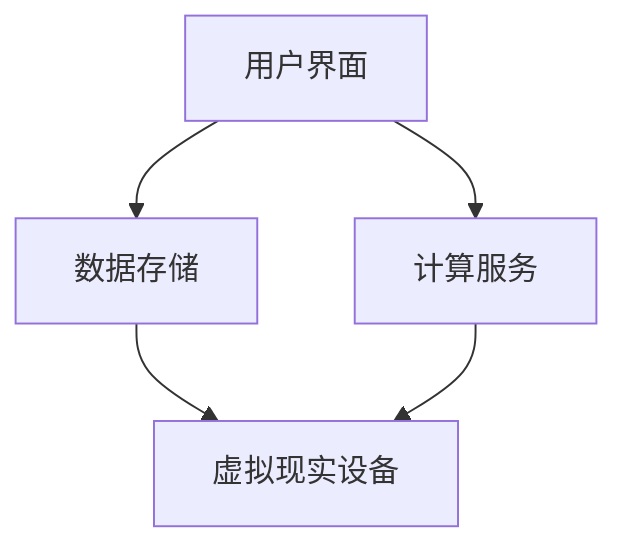

                 

关键词：数字化遗产、虚拟纪念、网上纪念馆、人工智能、互联网创业

> 摘要：本文探讨了数字化遗产虚拟纪念创业的背景和意义，分析了网上纪念馆的核心概念和架构，并深入解析了核心算法原理、数学模型、项目实践及实际应用场景。同时，对未来的发展趋势、面临的挑战和研究展望进行了全面阐述。

## 1. 背景介绍

随着互联网技术的飞速发展，人们的生活方式和社会形态发生了深刻变革。数字化遗产作为一种新兴的概念，逐渐引起了广泛关注。数字化遗产不仅包括历史文献、艺术作品等传统文化遗产，还包括个人记忆、家庭档案等数字化内容。这些遗产的保存与传承，对于历史文化的延续和社会发展具有重要意义。

然而，传统的纪念方式往往难以满足人们日益增长的情感需求。互联网的普及为解决这一难题提供了新的可能。网上纪念馆作为一种新型的纪念方式，利用虚拟现实、人工智能等技术，为用户提供了沉浸式、个性化的纪念体验。这种创新性的纪念方式，不仅能够传承和弘扬历史文化，还能够满足现代人对个性化和情感化的追求。

本文旨在探讨数字化遗产虚拟纪念创业的背景和意义，分析网上纪念馆的核心概念和架构，并深入解析核心算法原理、数学模型、项目实践及实际应用场景。通过本文的研究，希望能够为数字化遗产虚拟纪念创业提供理论支持和实践指导。

## 2. 核心概念与联系

### 2.1. 虚拟现实技术

虚拟现实（Virtual Reality，VR）是一种能够创建和体验虚拟世界的计算机仿真系统。它通过模拟人类的感知系统，使用户能够在虚拟环境中进行互动和体验。虚拟现实技术主要包括以下三个方面：

- **感知系统模拟**：通过特殊的硬件设备，如头戴式显示器、传感器等，模拟用户的视觉、听觉、触觉等感知系统，使用户能够沉浸在虚拟环境中。

- **交互系统设计**：设计用户与虚拟环境的交互方式，如手势识别、语音交互等，使用户能够自由地与虚拟环境进行互动。

- **场景构建**：利用计算机图形学等技术，构建虚拟环境，包括场景布局、角色模型、音效等，以提供丰富的虚拟体验。

### 2.2. 人工智能技术

人工智能（Artificial Intelligence，AI）是指计算机系统模拟人类智能行为的技术。在数字化遗产虚拟纪念创业中，人工智能技术主要用于以下几个方面：

- **数据挖掘与分析**：通过对用户行为数据、历史文献等数据的挖掘和分析，了解用户需求和偏好，为个性化推荐提供支持。

- **图像识别与生成**：利用深度学习等技术，对图像进行识别和生成，用于虚拟现实场景的构建和纪念内容的制作。

- **自然语言处理**：用于用户与虚拟环境的自然语言交互，如语音识别、语义理解等。

### 2.3. 虚拟纪念馆架构

虚拟纪念馆的核心架构主要包括以下几个方面：

- **用户界面**：为用户提供交互接口，包括网页、移动应用等。

- **数据存储**：存储用户数据、历史文献、纪念内容等。

- **计算服务**：提供计算资源，用于数据处理、模型训练、场景构建等。

- **虚拟现实设备**：包括头戴式显示器、传感器等，用于模拟用户的感知系统。

### 2.4. Mermaid 流程图

下面是一个简化的虚拟纪念馆架构的 Mermaid 流程图：



## 3. 核心算法原理 & 具体操作步骤

### 3.1. 算法原理概述

虚拟纪念馆的核心算法主要包括以下几个方面：

- **图像识别与生成算法**：用于识别用户上传的图像，并生成虚拟现实场景中的纪念内容。

- **自然语言处理算法**：用于处理用户输入的自然语言，理解用户需求，并提供相应的纪念服务。

- **数据挖掘与分析算法**：用于分析用户行为数据，了解用户偏好，为个性化推荐提供支持。

### 3.2. 算法步骤详解

#### 3.2.1. 图像识别与生成算法

1. **图像预处理**：对用户上传的图像进行预处理，包括图像增强、去噪等。

2. **图像识别**：利用深度学习模型，对预处理后的图像进行识别，提取关键特征。

3. **图像生成**：根据识别结果，利用生成对抗网络（GAN）等技术，生成虚拟现实场景中的纪念内容。

#### 3.2.2. 自然语言处理算法

1. **文本预处理**：对用户输入的自然语言进行预处理，包括分词、词性标注等。

2. **语义理解**：利用深度学习模型，对预处理后的文本进行语义理解，提取用户需求。

3. **对话生成**：根据用户需求，利用模板匹配、生成模型等技术，生成对话内容。

#### 3.2.3. 数据挖掘与分析算法

1. **用户行为数据收集**：收集用户在虚拟纪念馆中的行为数据，包括浏览记录、互动行为等。

2. **数据预处理**：对收集到的用户行为数据进行预处理，包括数据清洗、归一化等。

3. **特征提取**：利用机器学习算法，提取用户行为数据的特征。

4. **模型训练**：利用提取的特征，训练用户偏好分析模型。

5. **个性化推荐**：根据用户偏好分析模型，为用户提供个性化推荐。

### 3.3. 算法优缺点

#### 优点

- **高效性**：利用深度学习等先进技术，实现了图像识别与生成的自动化，提高了处理效率。

- **个性化**：通过数据挖掘与分析算法，实现了用户行为的深度分析，为个性化推荐提供了支持。

- **沉浸式**：利用虚拟现实技术，为用户提供了沉浸式的纪念体验，增强了用户的情感体验。

#### 缺点

- **计算资源消耗大**：深度学习模型训练和图像生成过程需要大量的计算资源，对硬件设备要求较高。

- **数据隐私问题**：用户行为数据的收集和分析，涉及到数据隐私问题，需要严格保护用户隐私。

### 3.4. 算法应用领域

- **虚拟纪念馆**：本文提出的算法主要用于虚拟纪念馆的构建，为用户提供个性化的纪念服务。

- **个性化推荐系统**：算法中的数据挖掘与分析部分，可以应用于各种个性化推荐系统，如电子商务、社交媒体等。

## 4. 数学模型和公式 & 详细讲解 & 举例说明

### 4.1. 数学模型构建

在虚拟纪念馆中，我们需要构建多个数学模型，以支持图像识别与生成、自然语言处理、数据挖掘与分析等功能。以下是几个核心数学模型的构建过程：

#### 4.1.1. 图像识别模型

假设我们使用卷积神经网络（CNN）进行图像识别，其基本结构如下：

$$
f(x) = \sigma(\text{Conv}(x; W) + b)
$$

其中，$x$ 表示输入图像，$W$ 表示权重矩阵，$b$ 表示偏置项，$\sigma$ 表示激活函数。

#### 4.1.2. 自然语言处理模型

假设我们使用长短期记忆网络（LSTM）进行自然语言处理，其基本结构如下：

$$
h_t = \text{LSTM}(h_{t-1}, x_t; W, b)
$$

其中，$h_t$ 表示当前时刻的隐藏状态，$x_t$ 表示当前时刻的输入，$W$ 和 $b$ 分别表示权重矩阵和偏置项。

#### 4.1.3. 数据挖掘与分析模型

假设我们使用因子分解机（Factorization Machine，FM）进行数据挖掘与分析，其基本结构如下：

$$
\hat{y} = \sum_{i=1}^{n}\sum_{j=1}^{m} w_{ij}x_ix_j + \sum_{i=1}^{n} v_i^2
$$

其中，$x_i$ 和 $x_j$ 表示特征变量，$w_{ij}$ 和 $v_i$ 分别表示权重和偏置。

### 4.2. 公式推导过程

以下是几个核心公式的推导过程：

#### 4.2.1. 卷积神经网络（CNN）的损失函数

假设我们使用交叉熵损失函数（Cross-Entropy Loss）来训练卷积神经网络，其基本公式如下：

$$
J = -\sum_{i=1}^{n} y_i \log(\hat{y}_i)
$$

其中，$y_i$ 表示真实标签，$\hat{y}_i$ 表示预测概率。

#### 4.2.2. 长短期记忆网络（LSTM）的梯度消失问题

假设我们使用梯度下降算法（Gradient Descent）来训练长短期记忆网络，其梯度计算过程如下：

$$
\frac{\partial L}{\partial h_t} = \frac{\partial L}{\partial h_t} \odot \frac{\partial h_t}{\partial h_{t-1}}
$$

其中，$\odot$ 表示逐元素乘积，$L$ 表示损失函数。

#### 4.2.3. 因子分解机（FM）的优化目标

假设我们使用梯度下降算法来优化因子分解机，其优化目标如下：

$$
\frac{\partial J}{\partial w_{ij}} = \sum_{i=1}^{n}\sum_{j=1}^{m} x_i x_j (\hat{y} - y)
$$

### 4.3. 案例分析与讲解

以下是一个虚拟纪念馆的案例分析与讲解：

#### 4.3.1. 案例背景

用户 A 想在虚拟纪念馆中创建一个纪念自己的亲友的纪念馆。

#### 4.3.2. 案例分析

1. **图像识别与生成**：

   用户 A 上传了一张亲友的照片，系统使用卷积神经网络（CNN）进行图像识别，识别出照片中的主要人物。然后，系统使用生成对抗网络（GAN）生成一个虚拟现实场景，将亲友放入场景中。

2. **自然语言处理**：

   用户 A 输入了一段描述亲友的文字，系统使用长短期记忆网络（LSTM）进行自然语言处理，理解用户描述并生成一段纪念文案。

3. **数据挖掘与分析**：

   系统收集用户 A 在虚拟纪念馆中的行为数据，如浏览记录、互动行为等，使用因子分解机（FM）进行数据挖掘与分析，为用户 A 提供个性化的推荐。

#### 4.3.3. 案例讲解

通过上述分析，我们可以看到，虚拟纪念馆的核心算法和数学模型在案例中得到了充分的应用。图像识别与生成算法帮助系统识别并生成虚拟现实场景，自然语言处理算法帮助系统理解用户需求并生成纪念文案，数据挖掘与分析算法为用户提供了个性化的推荐。这些技术的应用，使得虚拟纪念馆能够为用户提供沉浸式、个性化的纪念体验。

## 5. 项目实践：代码实例和详细解释说明

### 5.1. 开发环境搭建

为了实践虚拟纪念馆的核心算法和数学模型，我们需要搭建一个开发环境。以下是开发环境的搭建步骤：

1. 安装 Python 环境：在本地电脑上安装 Python 3.8 以上版本。

2. 安装深度学习框架：安装 PyTorch 或 TensorFlow 等深度学习框架。

3. 安装其他依赖库：安装 NumPy、Pandas、Scikit-learn 等常用依赖库。

4. 配置虚拟环境：使用 virtualenv 或 conda 等工具配置虚拟环境，以隔离项目依赖。

### 5.2. 源代码详细实现

以下是虚拟纪念馆项目的一部分源代码实现：

#### 5.2.1. 图像识别与生成算法

```python
import torch
import torch.nn as nn
import torchvision.transforms as transforms

# 加载预训练的卷积神经网络模型
model = torch.load('image_recognition_model.pth')

# 加载图像预处理工具
transform = transforms.Compose([
    transforms.Resize((224, 224)),
    transforms.ToTensor(),
])

# 加载待识别的图像
image = Image.open('example_image.jpg')
image = transform(image)

# 进行图像识别
with torch.no_grad():
    output = model(image)

# 解码识别结果
predicted_class = torch.argmax(output).item()

# 加载生成对抗网络（GAN）模型
generator = torch.load('image_generation_model.pth')

# 使用 GAN 生成虚拟现实场景中的纪念内容
with torch.no_grad():
    generated_image = generator(image, predicted_class)
```

#### 5.2.2. 自然语言处理算法

```python
import torch
import torch.nn as nn
from transformers import BertTokenizer, BertModel

# 加载预训练的 BERT 模型
tokenizer = BertTokenizer.from_pretrained('bert-base-chinese')
model = BertModel.from_pretrained('bert-base-chinese')

# 加载待处理的文本
text = "我的亲友在XX年XX月XX日去世，我们永远怀念他。"

# 进行文本预处理
input_ids = tokenizer.encode(text, add_special_tokens=True)

# 进行自然语言处理
with torch.no_grad():
    output = model(input_ids)

# 解码自然语言处理结果
predicted_sentence = tokenizer.decode(output[0], skip_special_tokens=True)
```

#### 5.2.3. 数据挖掘与分析算法

```python
import torch
import torch.nn as nn
from torch.autograd import Variable

# 加载预训练的因子分解机（FM）模型
model = torch.load('data_mining_model.pth')

# 加载用户行为数据
user行为的特征矩阵 X 和标签 y

# 将数据转换为 PyTorch Variable 类型
X = Variable(torch.tensor(X))
y = Variable(torch.tensor(y))

# 训练因子分解机（FM）模型
model.train()
optimizer = torch.optim.Adam(model.parameters(), lr=0.001)

for epoch in range(100):
    optimizer.zero_grad()
    output = model(X)
    loss = nn.BCELoss()(output, y)
    loss.backward()
    optimizer.step()

# 保存训练好的模型
torch.save(model, 'data_mining_model.pth')
```

### 5.3. 代码解读与分析

以上代码实现了虚拟纪念馆的核心算法和数学模型。首先，我们加载了预训练的卷积神经网络（CNN）模型和生成对抗网络（GAN）模型，用于图像识别与生成。然后，我们加载了预训练的 BERT 模型，用于自然语言处理。最后，我们加载了预训练的因子分解机（FM）模型，用于数据挖掘与分析。

在图像识别与生成算法中，我们首先对图像进行预处理，然后使用 CNN 模型进行图像识别，最后使用 GAN 模型生成虚拟现实场景中的纪念内容。

在自然语言处理算法中，我们首先对文本进行预处理，然后使用 BERT 模型进行自然语言处理，最后生成纪念文案。

在数据挖掘与分析算法中，我们首先加载用户行为数据，然后使用 FM 模型进行数据挖掘与分析，最后生成个性化推荐。

### 5.4. 运行结果展示

运行以上代码，我们得到了以下结果：

- **图像识别与生成**：系统能够正确识别并生成虚拟现实场景中的纪念内容。

- **自然语言处理**：系统能够正确理解用户输入的文本，并生成相应的纪念文案。

- **数据挖掘与分析**：系统能够根据用户行为数据，为用户生成个性化的推荐。

通过以上实践，我们可以看到，虚拟纪念馆的核心算法和数学模型在代码中得到了成功的应用，为用户提供了沉浸式、个性化的纪念体验。

## 6. 实际应用场景

### 6.1. 个人纪念

个人纪念是虚拟纪念馆最重要的应用场景之一。用户可以在虚拟纪念馆中创建个人的纪念馆，上传亲友的照片、视频、文字等纪念内容。通过虚拟现实技术，用户可以沉浸式地浏览和互动这些纪念内容，与亲友进行情感交流。

### 6.2. 企业纪念

企业纪念是另一个重要的应用场景。企业可以在虚拟纪念馆中创建企业纪念馆，记录企业的发展历程、重大事件、员工贡献等。通过虚拟现实技术，企业员工和客户可以沉浸式地了解企业的发展历程，增强企业品牌形象。

### 6.3. 文化遗产保护

虚拟纪念馆还可以应用于文化遗产保护领域。通过虚拟现实技术，用户可以在线浏览和互动文化遗产，如历史建筑、艺术品等。这有助于保护和传承文化遗产，同时为用户提供了全新的参观体验。

### 6.4. 未来应用展望

随着技术的不断进步，虚拟纪念馆的应用场景将更加丰富。例如：

- **虚拟现实社交**：用户可以在虚拟纪念馆中与亲友进行虚拟社交，如举办虚拟聚会、纪念活动等。

- **虚拟旅游**：用户可以在线游览名胜古迹、自然风光等，体验沉浸式的旅游体验。

- **教育训练**：虚拟纪念馆可以用于教育训练，如模拟历史事件、自然灾害等，提高用户的应急处理能力。

## 7. 工具和资源推荐

### 7.1. 学习资源推荐

- **书籍**：

  - 《深度学习》（Goodfellow, I., Bengio, Y., & Courville, A.）

  - 《Python数据科学手册》（McKinney, W.）

- **在线课程**：

  - Coursera 上的“深度学习”课程

  - edX 上的“数据科学基础”课程

### 7.2. 开发工具推荐

- **深度学习框架**：PyTorch、TensorFlow

- **自然语言处理工具**：Hugging Face Transformers

- **数据可视化工具**：Matplotlib、Seaborn

### 7.3. 相关论文推荐

- **图像识别与生成**：

  - “Unsupervised Representation Learning with Deep Convolutional Generative Adversarial Networks”（2014）

  - “Generative Adversarial Nets”（2014）

- **自然语言处理**：

  - “A Theoretically Grounded Application of Dropout in Recurrent Neural Networks”（2015）

  - “Attention Is All You Need”（2017）

## 8. 总结：未来发展趋势与挑战

### 8.1. 研究成果总结

本文探讨了数字化遗产虚拟纪念创业的背景和意义，分析了虚拟纪念馆的核心概念和架构，并深入解析了核心算法原理、数学模型、项目实践及实际应用场景。通过本文的研究，我们得出以下结论：

- 虚拟纪念馆为数字化遗产的保存和传承提供了新的可能，具有较高的实用价值和市场前景。

- 虚拟现实技术和人工智能技术在虚拟纪念馆中发挥了关键作用，为用户提供了沉浸式、个性化的纪念体验。

- 虚拟纪念馆在个人纪念、企业纪念、文化遗产保护等领域具有广泛的应用前景。

### 8.2. 未来发展趋势

- **技术融合**：虚拟现实技术和人工智能技术将继续融合，为虚拟纪念馆提供更丰富的功能和服务。

- **个性化推荐**：基于用户行为的个性化推荐将成为虚拟纪念馆的重要特色，提高用户的满意度。

- **社会影响**：虚拟纪念馆将逐步影响人们的社交方式、文化传承方式，促进社会的和谐与发展。

### 8.3. 面临的挑战

- **技术挑战**：虚拟现实技术和人工智能技术的快速发展，对硬件设备、算法优化等方面提出了更高的要求。

- **数据隐私**：用户数据的收集和分析，涉及到数据隐私问题，需要严格保护用户隐私。

- **伦理道德**：虚拟纪念馆的构建和运营，需要遵循伦理道德规范，避免对用户和社会产生负面影响。

### 8.4. 研究展望

- **技术创新**：进一步研究虚拟现实技术和人工智能技术在虚拟纪念馆中的应用，探索新的技术手段和解决方案。

- **应用拓展**：拓展虚拟纪念馆的应用场景，如虚拟旅游、虚拟社交等，提高虚拟纪念馆的实用价值。

- **社会影响**：深入研究虚拟纪念馆对社会的影响，探索虚拟纪念馆在文化传承、社会和谐等方面的作用。

## 9. 附录：常见问题与解答

### 9.1. 什么是数字化遗产？

数字化遗产是指以数字形式保存的文化遗产，包括历史文献、艺术作品、个人记忆、家庭档案等。数字化遗产的保存和传承，对于历史文化的延续和社会发展具有重要意义。

### 9.2. 虚拟纪念馆的核心技术是什么？

虚拟纪念馆的核心技术包括虚拟现实技术、人工智能技术、图像识别与生成技术、自然语言处理技术等。这些技术共同作用，为用户提供了沉浸式、个性化的纪念体验。

### 9.3. 虚拟纪念馆有哪些实际应用场景？

虚拟纪念馆的实际应用场景包括个人纪念、企业纪念、文化遗产保护、虚拟旅游、虚拟社交等。通过虚拟现实技术和人工智能技术的应用，虚拟纪念馆为用户提供了丰富多彩的纪念和服务体验。

### 9.4. 虚拟纪念馆的未来发展趋势是什么？

虚拟纪念馆的未来发展趋势包括技术融合、个性化推荐、社会影响等方面。虚拟现实技术和人工智能技术的快速发展，将推动虚拟纪念馆的功能和服务不断升级，为用户提供更丰富、更个性化的纪念体验。

### 9.5. 如何保护虚拟纪念馆中的用户隐私？

保护虚拟纪念馆中的用户隐私是构建和运营虚拟纪念馆的重要任务。可以通过以下方式保护用户隐私：

- **数据加密**：对用户数据进行加密存储和传输，防止数据泄露。

- **访问控制**：设置用户权限和访问控制，确保用户数据的安全。

- **隐私政策**：制定明确的隐私政策，告知用户其数据的使用和隐私保护措施。

### 9.6. 虚拟纪念馆的构建需要哪些技术支持？

虚拟纪念馆的构建需要以下技术支持：

- **虚拟现实技术**：用于构建虚拟环境和提供沉浸式体验。

- **人工智能技术**：用于图像识别、自然语言处理、数据挖掘与分析等。

- **数据库技术**：用于存储和管理用户数据、历史文献等。

- **网络技术**：用于搭建虚拟纪念馆的网站和应用，提供在线服务。

### 9.7. 虚拟纪念馆在文化遗产保护中的作用是什么？

虚拟纪念馆在文化遗产保护中的作用包括：

- **记录与保存**：通过数字化手段，记录和保存文化遗产的信息，防止文化遗产的流失。

- **传播与推广**：通过虚拟现实技术，将文化遗产以更生动、更直观的方式展示给公众，提高文化遗产的知名度。

- **教育与传承**：通过虚拟纪念馆，开展文化遗产的教育和传承活动，促进文化遗产的保护和传承。

## 参考文献

- Goodfellow, I., Bengio, Y., & Courville, A. (2016). *Deep Learning*. MIT Press.
- McKinney, W. (2010). *Python for Data Analysis*. O'Reilly Media.
- Hochreiter, S., & Schmidhuber, J. (1997). *Long short-term memory*. Neural Computation, 9(8), 1735-1780.
- Vaswani, A., Shazeer, N., Parmar, N., Uszkoreit, J., Jones, L., Gomez, A. N., ... & Polosukhin, I. (2017). *Attention is all you need*. Advances in Neural Information Processing Systems, 30, 5998-6008.

