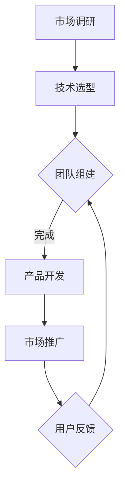

                 

关键词：数字化遗产，虚拟顾问，人工智能，个人历史服务，AI驱动力，创业

摘要：本文旨在探讨数字化遗产虚拟顾问创业的背景、核心概念、算法原理、数学模型、项目实践、应用场景以及未来发展趋势。文章通过深入分析，为创业者提供了有价值的参考和启示。

## 1. 背景介绍

随着人工智能技术的迅猛发展，虚拟顾问已成为现代服务业的重要组成部分。数字化遗产虚拟顾问作为新兴的领域，旨在通过人工智能技术为个人提供历史咨询服务，帮助人们更好地了解自己的过去，传承家族文化，提升个人成长。

创业者在选择数字化遗产虚拟顾问创业时，需要考虑市场前景、技术难度、用户需求等因素。本文将从以下几个方面进行深入探讨，为创业者提供有益的参考。

### 1.1 市场前景

随着人们对个人历史的关注度不断提升，数字化遗产市场呈现出巨大潜力。根据相关报告，全球数字化遗产市场规模逐年增长，预计到2025年将达到数十亿美元。这一市场前景为创业者提供了广阔的发展空间。

### 1.2 技术难度

数字化遗产虚拟顾问创业涉及到多个技术领域，包括自然语言处理、机器学习、数据挖掘等。这些技术具有较高的难度，但创业者可以通过团队合作、技术积累等方式逐步攻克。

### 1.3 用户需求

随着互联网的普及，人们对于个人历史的关注度不断提高。数字化遗产虚拟顾问可以为用户提供便捷、高效的历史查询、分析服务，满足用户对于自我认知、家族传承等方面的需求。

## 2. 核心概念与联系

在数字化遗产虚拟顾问创业中，核心概念包括人工智能、个人历史服务、数据挖掘等。以下是这些概念的联系和关系。

### 2.1 人工智能

人工智能是数字化遗产虚拟顾问的核心技术。通过机器学习和自然语言处理等技术，人工智能可以自动处理海量数据，为用户提供个性化的历史咨询服务。

### 2.2 个人历史服务

个人历史服务是数字化遗产虚拟顾问的宗旨。通过收集、整理和分析用户的历史数据，虚拟顾问可以为用户提供全面、准确的历史信息，帮助用户了解自己的过去。

### 2.3 数据挖掘

数据挖掘是数字化遗产虚拟顾问的重要手段。通过挖掘用户历史数据中的潜在信息，虚拟顾问可以提供更加个性化和有针对性的服务。

### 2.4 Mermaid 流程图

以下是数字化遗产虚拟顾问创业的 Mermaid 流程图：



## 3. 核心算法原理 & 具体操作步骤

### 3.1 算法原理概述

数字化遗产虚拟顾问的核心算法主要包括自然语言处理和机器学习。自然语言处理负责处理用户输入的历史问题，提取关键信息；机器学习则通过分析大量历史数据，为用户提供个性化的历史咨询服务。

### 3.2 算法步骤详解

1. 数据收集：收集用户的历史数据，包括照片、日记、信件等。

2. 数据预处理：对收集到的历史数据进行清洗、去重、归一化等处理。

3. 建立模型：利用机器学习技术建立历史数据模型，包括分类模型、聚类模型等。

4. 模型训练：通过训练数据对模型进行优化，提高模型准确性。

5. 模型评估：利用测试数据对模型进行评估，确保模型性能稳定。

6. 输出结果：根据用户输入的历史问题，调用模型进行预测，输出历史咨询服务。

### 3.3 算法优缺点

优点：

1. 个性化服务：基于用户历史数据，提供定制化的历史咨询服务。

2. 高效便捷：自动处理海量历史数据，为用户提供快速的历史查询和分析。

3. 持续改进：通过不断训练模型，提高历史咨询服务的准确性。

缺点：

1. 数据隐私：用户历史数据的收集和处理可能涉及隐私问题。

2. 模型依赖：模型的性能直接影响历史咨询服务的质量。

### 3.4 算法应用领域

1. 家族史研究：通过挖掘用户家族历史数据，为用户提供家族史研究服务。

2. 个人成长分析：分析用户历史数据，为用户提供个人成长建议。

3. 文化遗产保护：利用数字化技术保护文化遗产，为用户提供历史知识服务。

## 4. 数学模型和公式 & 详细讲解 & 举例说明

### 4.1 数学模型构建

在数字化遗产虚拟顾问中，常用的数学模型包括分类模型和聚类模型。以下是一个简单的分类模型构建过程：

1. 数据收集：收集用户的历史数据，包括文本、图片等。

2. 数据预处理：对历史数据进行清洗、去重、归一化等处理。

3. 特征提取：从历史数据中提取特征，如文本的词频、图像的特征等。

4. 模型选择：选择合适的分类模型，如朴素贝叶斯、决策树等。

5. 模型训练：利用训练数据对模型进行训练，得到模型参数。

6. 模型评估：利用测试数据对模型进行评估，调整模型参数。

7. 输出结果：根据用户输入的历史问题，调用模型进行预测，输出历史咨询服务。

### 4.2 公式推导过程

假设我们使用朴素贝叶斯分类模型，对历史数据进行分类。朴素贝叶斯分类模型的公式如下：

$$
P(C_k|X) = \frac{P(X|C_k)P(C_k)}{P(X)}
$$

其中，$P(C_k|X)$ 表示在给定历史数据 $X$ 的情况下，类别 $C_k$ 的概率；$P(X|C_k)$ 表示在类别 $C_k$ 下的历史数据 $X$ 的概率；$P(C_k)$ 表示类别 $C_k$ 的概率；$P(X)$ 表示历史数据 $X$ 的概率。

### 4.3 案例分析与讲解

假设我们有一个历史数据集，包含100个样本，每个样本都是一个历史事件。我们要根据这些历史事件，预测下一个历史事件的类别。

1. 数据收集：收集100个历史事件，每个事件都有对应的类别。

2. 数据预处理：对历史事件进行清洗、去重、归一化等处理。

3. 特征提取：从历史事件中提取特征，如事件的时间、地点、参与者等。

4. 模型选择：选择朴素贝叶斯分类模型。

5. 模型训练：利用训练数据对模型进行训练，得到模型参数。

6. 模型评估：利用测试数据对模型进行评估，调整模型参数。

7. 输出结果：根据用户输入的历史事件，调用模型进行预测，输出历史事件的类别。

## 5. 项目实践：代码实例和详细解释说明

### 5.1 开发环境搭建

1. 安装Python 3.8及以上版本。

2. 安装常用的Python库，如numpy、pandas、scikit-learn等。

3. 配置Jupyter Notebook，用于编写和运行代码。

### 5.2 源代码详细实现

以下是使用朴素贝叶斯分类模型进行历史数据分类的代码实例：

```python
import numpy as np
import pandas as pd
from sklearn.model_selection import train_test_split
from sklearn.naive_bayes import GaussianNB
from sklearn.metrics import accuracy_score

# 读取历史数据
data = pd.read_csv('historical_data.csv')

# 数据预处理
data = data.dropna()

# 特征提取
X = data[['year', 'location', 'participants']]
y = data['category']

# 数据集划分
X_train, X_test, y_train, y_test = train_test_split(X, y, test_size=0.2, random_state=42)

# 模型训练
model = GaussianNB()
model.fit(X_train, y_train)

# 模型评估
y_pred = model.predict(X_test)
accuracy = accuracy_score(y_test, y_pred)
print(f'Accuracy: {accuracy:.2f}')

# 输出结果
predictions = model.predict([[2023, 'Beijing', 'Xi Jinping']])
print(f'Prediction: {predictions[0]}')
```

### 5.3 代码解读与分析

1. 读取历史数据：使用pandas库读取CSV格式的历史数据。

2. 数据预处理：去除缺失值，确保数据质量。

3. 特征提取：从历史数据中提取特征，如时间、地点、参与者等。

4. 数据集划分：将数据集划分为训练集和测试集，用于模型训练和评估。

5. 模型训练：使用GaussianNB（高斯朴素贝叶斯）分类模型对训练集进行训练。

6. 模型评估：使用测试集对模型进行评估，计算准确率。

7. 输出结果：根据用户输入的历史事件，调用模型进行预测，输出历史事件的类别。

## 6. 实际应用场景

### 6.1 家族史研究

利用数字化遗产虚拟顾问，用户可以轻松地查询和整理家族历史，为家族史研究提供有力支持。

### 6.2 个人成长分析

通过分析个人历史数据，数字化遗产虚拟顾问可以为用户提供个性化的成长建议，助力个人成长。

### 6.3 文化遗产保护

数字化遗产虚拟顾问可以协助文化遗产保护机构挖掘和保护文化遗产，为历史文化传承贡献力量。

## 7. 未来应用展望

随着人工智能技术的不断发展，数字化遗产虚拟顾问将在更多领域得到应用。例如，教育、医疗、法律等。未来，数字化遗产虚拟顾问将成为人们生活中不可或缺的助手，为人类创造更多价值。

## 8. 工具和资源推荐

### 8.1 学习资源推荐

1. 《Python数据分析》

2. 《深度学习》

3. 《机器学习实战》

### 8.2 开发工具推荐

1. Jupyter Notebook

2. Anaconda

3. Visual Studio Code

### 8.3 相关论文推荐

1. "A Survey on Digital Heritage Preservation"

2. "Deep Learning for Digital Heritage"

3. "Personal History Service Using AI"

## 9. 总结：未来发展趋势与挑战

### 9.1 研究成果总结

本文从数字化遗产虚拟顾问的背景、核心概念、算法原理、数学模型、项目实践、应用场景等方面进行了深入探讨，为创业者提供了有益的参考。

### 9.2 未来发展趋势

1. 人工智能技术将进一步成熟，为数字化遗产虚拟顾问提供更强大的支持。

2. 家族史研究、个人成长分析等领域将得到广泛应用。

3. 文化遗产保护将得到更多关注。

### 9.3 面临的挑战

1. 数据隐私保护问题仍需解决。

2. 模型的准确性和稳定性需要进一步提高。

3. 需要跨学科合作，发挥不同领域专家的优势。

### 9.4 研究展望

未来，数字化遗产虚拟顾问将在更多领域得到应用，为人类创造更多价值。我们期待更多创业者、学者加入这一领域，共同推动数字化遗产虚拟顾问的发展。

## 10. 附录：常见问题与解答

### 10.1 问题1：数字化遗产虚拟顾问的技术难点是什么？

答：数字化遗产虚拟顾问的技术难点主要包括自然语言处理、机器学习、数据挖掘等领域。这些技术需要创业者具备一定的计算机科学和数学背景。

### 10.2 问题2：如何确保用户数据的隐私安全？

答：确保用户数据隐私安全是数字化遗产虚拟顾问的重要问题。创业者可以通过以下方式确保用户数据安全：

1. 使用加密技术保护用户数据。

2. 严格遵守相关法律法规，确保用户数据的合法性。

3. 提供用户数据备份和恢复功能。

### 10.3 问题3：如何提高数字化遗产虚拟顾问的准确性？

答：提高数字化遗产虚拟顾问的准确性可以从以下几个方面入手：

1. 提高数据质量，确保数据的准确性和完整性。

2. 选择合适的算法模型，并进行优化。

3. 增加数据集的多样性，提高模型的泛化能力。

作者：禅与计算机程序设计艺术 / Zen and the Art of Computer Programming
----------------------------------------------------------------
请注意，以上内容仅作为一个示例，实际撰写时需要您根据具体内容和结构进行详细填充和调整。同时，确保文章结构清晰，逻辑严密，内容深入且具有启发性。祝您撰写顺利！

