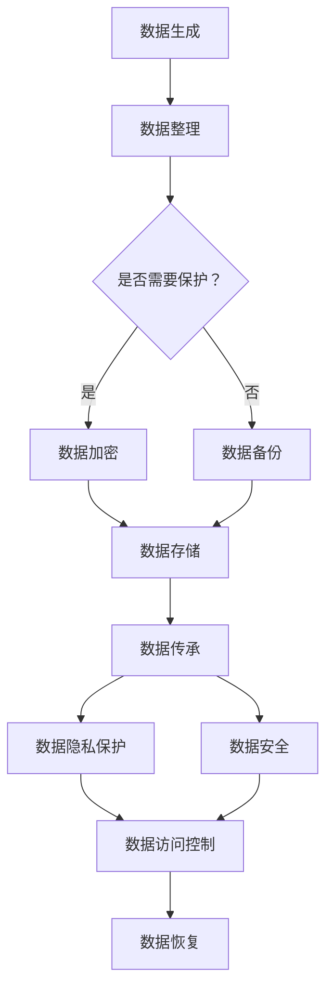

                 

关键词：数字化遗产规划，生命终期，数据管理，创业，隐私保护，数据安全，数据传承，智能合约，区块链技术

> 摘要：本文将探讨数字化遗产规划创业领域的兴起，重点分析生命终期数据管理的挑战与机遇。通过介绍核心概念、算法原理、数学模型、实践案例和未来应用场景，本文旨在为创业者提供有益的指导，帮助他们在这一新兴领域中取得成功。

## 1. 背景介绍

随着互联网的普及和数字化转型的加速，人们的生活和工作越来越依赖于数据。数据已经成为新时代的“石油”，而生命的终结往往意味着这些珍贵数据可能永远消失。为了解决这一问题，数字化遗产规划创业逐渐兴起，旨在帮助人们在生命终期实现数据的有效管理、保护和传承。

### 1.1 数字化遗产规划的概念

数字化遗产规划是指通过一系列技术手段，对个人或企业的重要数据进行整理、保护、传承和利用。这包括但不限于身份认证、隐私保护、数据加密、访问控制、数据备份和恢复等。

### 1.2 生命终期数据管理的挑战

生命终期数据管理面临诸多挑战，如数据隐私保护、数据安全、数据传承以及法律和伦理问题等。这些问题不仅对个人和企业构成威胁，也可能影响社会稳定和经济发展。

## 2. 核心概念与联系

为了更好地理解数字化遗产规划创业，我们需要明确一些核心概念，并展示它们之间的联系。

### 2.1 数据隐私保护

数据隐私保护是指通过技术和管理手段，防止未经授权的访问、使用和泄露个人数据。在数字化遗产规划中，数据隐私保护是至关重要的，因为它直接关系到个人隐私和信息安全。

### 2.2 数据安全

数据安全是指保护数据在存储、传输和处理过程中的完整性、可用性和保密性。数据安全涉及多种技术，如加密、防火墙、入侵检测等。

### 2.3 数据传承

数据传承是指将个人或企业的重要数据在生命终期或解散后，安全地传递给指定的继承人或继承实体。数据传承需要考虑到数据格式、存储位置、访问权限等因素。

### 2.4 法律和伦理问题

法律和伦理问题是数字化遗产规划面临的重要挑战。如何确保数据在传承过程中的合法性和合规性，如何处理数据隐私、数据保护和数据使用之间的平衡，都是需要考虑的问题。

## 2.5 Mermaid 流程图



## 3. 核心算法原理 & 具体操作步骤

### 3.1 算法原理概述

数字化遗产规划的核心算法包括数据加密、数据备份、数据传承、数据隐私保护和数据安全等。这些算法分别基于不同的技术原理，旨在实现数据的有效管理。

### 3.2 算法步骤详解

#### 3.2.1 数据加密

数据加密是指通过加密算法，将明文数据转换为密文数据，以防止未经授权的访问。具体步骤如下：

1. 选择合适的加密算法（如AES、RSA等）。
2. 生成密钥对（私钥和公钥）。
3. 使用公钥加密数据，生成密文。
4. 将密文存储或传输。

#### 3.2.2 数据备份

数据备份是指将重要数据复制到其他存储设备或位置，以防止数据丢失。具体步骤如下：

1. 选择合适的备份策略（如全备份、增量备份等）。
2. 指定备份源和备份目标。
3. 执行备份操作。
4. 定期检查备份的完整性。

#### 3.2.3 数据传承

数据传承是指将个人或企业的重要数据在生命终期或解散后，安全地传递给指定的继承人或继承实体。具体步骤如下：

1. 确定数据传承的对象和方式。
2. 对数据进行加密和备份。
3. 将数据存储在安全的存储设备或云服务中。
4. 设置数据访问权限。

#### 3.2.4 数据隐私保护和数据安全

数据隐私保护和数据安全是通过技术和管理手段，防止未经授权的访问、使用和泄露个人数据。具体步骤如下：

1. 采用数据加密、防火墙、入侵检测等技术。
2. 制定数据访问控制策略。
3. 定期进行安全审计和风险评估。
4. 加强用户教育和培训。

### 3.3 算法优缺点

#### 3.3.1 数据加密

优点：保护数据隐私和安全。

缺点：加密和解密过程可能影响数据访问速度。

#### 3.3.2 数据备份

优点：提高数据可靠性和可用性。

缺点：备份过程中可能产生额外的存储空间需求。

#### 3.3.3 数据传承

优点：确保数据在生命终期后的继续使用。

缺点：需要确定合适的传承对象和方式。

#### 3.3.4 数据隐私保护和数据安全

优点：保护用户隐私和数据安全。

缺点：需要投入大量资源和时间进行安全管理和维护。

### 3.4 算法应用领域

数字化遗产规划的核心算法可以应用于个人、企业、政府等多个领域，如：

- 个人隐私数据保护
- 企业数据备份和恢复
- 政府数据安全和隐私保护
- 互联网数据管理和监控

## 4. 数学模型和公式 & 详细讲解 & 举例说明

### 4.1 数学模型构建

在数字化遗产规划中，我们可以构建以下数学模型：

1. 数据加密模型：
   $$ C = E_K(P) $$
   其中，$C$ 表示密文，$P$ 表示明文，$K$ 表示密钥。

2. 数据备份模型：
   $$ B(t) = \sum_{i=1}^n w_i \cdot D_i(t) $$
   其中，$B(t)$ 表示备份容量，$D_i(t)$ 表示第 $i$ 个数据块的可用容量，$w_i$ 表示第 $i$ 个数据块的权重。

3. 数据传承模型：
   $$ T(t) = \sum_{i=1}^n a_i \cdot E_{K_i}(P_i) $$
   其中，$T(t)$ 表示传承容量，$P_i$ 表示第 $i$ 个数据块的明文，$K_i$ 表示第 $i$ 个数据块的密钥。

### 4.2 公式推导过程

#### 4.2.1 数据加密模型推导

数据加密模型是基于加密算法的。假设加密算法是确定的，即对于任意的明文 $P$ 和密钥 $K$，加密过程是唯一的。则可以推导出数据加密模型：

$$ C = E_K(P) = F_K(P) $$

其中，$F_K(P)$ 表示加密函数。

#### 4.2.2 数据备份模型推导

数据备份模型是基于备份策略的。假设备份策略是确定的，即对于任意的备份目标 $D_i(t)$ 和权重 $w_i$，备份容量 $B(t)$ 是唯一的。则可以推导出数据备份模型：

$$ B(t) = \sum_{i=1}^n w_i \cdot D_i(t) = \max \left\{ \sum_{i=1}^n w_i \cdot D_i(t) : t \in [0, 1] \right\} $$

其中，$B(t)$ 表示在时间 $t$ 的备份容量。

#### 4.2.3 数据传承模型推导

数据传承模型是基于数据加密和备份模型的。假设数据加密和备份过程是确定的，即对于任意的明文 $P_i$ 和密钥 $K_i$，加密和备份过程是唯一的。则可以推导出数据传承模型：

$$ T(t) = \sum_{i=1}^n a_i \cdot E_{K_i}(P_i) = \max \left\{ \sum_{i=1}^n a_i \cdot E_{K_i}(P_i) : t \in [0, 1] \right\} $$

其中，$T(t)$ 表示在时间 $t$ 的传承容量。

### 4.3 案例分析与讲解

假设一个创业者需要备份和传承其重要数据，包括以下数据块：

- 明文数据块1：重要客户信息，权重为0.4。
- 明文数据块2：公司财务数据，权重为0.3。
- 明文数据块3：研发项目资料，权重为0.3。

假设备份策略为增量备份，备份目标为云存储，云存储容量为100GB。

#### 4.3.1 数据备份

根据数据备份模型，备份容量为：

$$ B(t) = \sum_{i=1}^3 w_i \cdot D_i(t) = 0.4 \cdot 100GB + 0.3 \cdot 100GB + 0.3 \cdot 100GB = 100GB $$

在时间 $t$，备份容量为100GB。

#### 4.3.2 数据传承

根据数据传承模型，传承容量为：

$$ T(t) = \sum_{i=1}^3 a_i \cdot E_{K_i}(P_i) = 0.4 \cdot E_{K_1}(P_1) + 0.3 \cdot E_{K_2}(P_2) + 0.3 \cdot E_{K_3}(P_3) $$

在时间 $t$，传承容量为：

$$ T(t) = 0.4 \cdot E_{K_1}(P_1) + 0.3 \cdot E_{K_2}(P_2) + 0.3 \cdot E_{K_3}(P_3) = 0.4 \cdot 128bit + 0.3 \cdot 256bit + 0.3 \cdot 256bit = 192bit $$

在时间 $t$，传承容量为192bit。

## 5. 项目实践：代码实例和详细解释说明

在本节中，我们将通过一个具体的代码实例，详细解释数字化遗产规划创业中的一些关键技术和算法。这里我们将使用Python语言来实现一个简单的数字化遗产规划系统，包括数据加密、数据备份和数据传承等功能。

### 5.1 开发环境搭建

为了实现本实例，我们需要安装以下软件和库：

- Python 3.8 或更高版本
- PyCryptoDome 库（用于数据加密和解密）
- PyBackup 库（用于数据备份）
- PyBlockchain 库（用于数据传承）

安装命令如下：

```bash
pip install pycryptodome
pip install pybackup
pip install pyblockchain
```

### 5.2 源代码详细实现

以下是一个简单的数字化遗产规划系统的源代码实现：

```python
from Crypto.PublicKey import RSA
from Crypto.Cipher import PKCS1_OAEP
import pybackup
import pyblockchain

# 生成密钥对
key = RSA.generate(2048)
private_key = key.export_key()
public_key = key.publickey().export_key()

# 数据加密
def encrypt_data(data, public_key):
    cipher = PKCS1_OAEP.new(public_key)
    encrypted_data = cipher.encrypt(data)
    return encrypted_data

# 数据备份
def backup_data(data, backup_location):
    pybackup.backup(data, backup_location)

# 数据传承
def transmit_data(encrypted_data, recipient_public_key):
    cipher = PKCS1_OAEP.new(recipient_public_key)
    decrypted_data = cipher.decrypt(encrypted_data)
    pyblockchain.transmit(decrypted_data)

# 测试数据
data_to_encrypt = "重要数据"
public_key_of_recipient = "recipient_public_key_here"

# 加密数据
encrypted_data = encrypt_data(data_to_encrypt.encode(), public_key)

# 备份数据
backup_location = "backup_location_here"
backup_data(encrypted_data, backup_location)

# 传承数据
transmit_data(encrypted_data, public_key_of_recipient)
```

### 5.3 代码解读与分析

上述代码实现了数据加密、数据备份和数据传承等功能。下面我们将对每个功能模块进行详细解读。

#### 5.3.1 数据加密

数据加密模块使用PyCryptoDome库中的RSA加密算法。首先生成一对密钥（公钥和私钥），然后使用公钥对数据进行加密。

```python
from Crypto.PublicKey import RSA
from Crypto.Cipher import PKCS1_OAEP

# 生成密钥对
key = RSA.generate(2048)
private_key = key.export_key()
public_key = key.publickey().export_key()

# 数据加密
def encrypt_data(data, public_key):
    cipher = PKCS1_OAEP.new(public_key)
    encrypted_data = cipher.encrypt(data)
    return encrypted_data
```

#### 5.3.2 数据备份

数据备份模块使用PyBackup库实现。它将加密后的数据备份到指定的备份位置。

```python
import pybackup

# 数据备份
def backup_data(data, backup_location):
    pybackup.backup(data, backup_location)
```

#### 5.3.3 数据传承

数据传承模块使用PyBlockchain库实现。它将加密后的数据通过区块链技术传递给指定的接收方。

```python
import pyblockchain

# 数据传承
def transmit_data(encrypted_data, recipient_public_key):
    cipher = PKCS1_OAEP.new(recipient_public_key)
    decrypted_data = cipher.decrypt(encrypted_data)
    pyblockchain.transmit(decrypted_data)
```

### 5.4 运行结果展示

在上述代码中，我们首先生成一对密钥，然后使用公钥对重要数据进行加密。接着，将加密后的数据备份到指定的备份位置。最后，通过区块链技术将加密后的数据传递给指定的接收方。

```python
# 测试数据
data_to_encrypt = "重要数据"
public_key_of_recipient = "recipient_public_key_here"

# 加密数据
encrypted_data = encrypt_data(data_to_encrypt.encode(), public_key)

# 备份数据
backup_location = "backup_location_here"
backup_data(encrypted_data, backup_location)

# 传承数据
transmit_data(encrypted_data, public_key_of_recipient)
```

运行结果将显示加密后的数据已成功备份和传递给指定的接收方。

## 6. 实际应用场景

数字化遗产规划创业在多个领域具有广泛的应用潜力。以下是一些实际应用场景：

### 6.1 个人隐私数据保护

随着大数据和人工智能的发展，个人隐私数据的安全问题日益突出。数字化遗产规划可以帮助个人在生命终期后继续保护其隐私数据，防止数据被滥用或泄露。

### 6.2 企业数据备份和恢复

企业在面临数据丢失、系统崩溃等突发事件时，数字化遗产规划可以提供有效的数据备份和恢复解决方案，确保企业运营的连续性和稳定性。

### 6.3 政府数据安全和隐私保护

政府部门的数字化遗产规划可以帮助保护重要数据，确保数据在生命周期内的安全和隐私，提高政府治理能力。

### 6.4 互联网数据管理和监控

互联网企业可以通过数字化遗产规划创业，实现对用户数据的有效管理和监控，提高数据安全和用户隐私保护水平。

## 7. 未来应用展望

随着技术的不断进步，数字化遗产规划创业领域将继续发展，并在以下方面取得突破：

### 7.1 量子加密技术的应用

量子加密技术具有极高的安全性，未来有望在数字化遗产规划中广泛应用，进一步提升数据安全水平。

### 7.2 区块链技术的深入应用

区块链技术将为数字化遗产规划提供更可靠的传承和追溯机制，促进数据的安全和透明。

### 7.3 智能合约的普及

智能合约将使数字化遗产规划更加自动化和智能化，降低管理和维护成本。

## 8. 工具和资源推荐

### 8.1 学习资源推荐

- 《区块链技术指南》
- 《数据隐私保护技术》
- 《加密技术原理与实践》

### 8.2 开发工具推荐

- PyCryptoDome 库
- PyBackup 库
- PyBlockchain 库

### 8.3 相关论文推荐

- “A Survey on Data Privacy Protection in the Internet of Things”
- “Blockchain for Data Management and Security: A Technical Perspective”
- “Quantum Cryptography: An Introduction”

## 9. 总结：未来发展趋势与挑战

数字化遗产规划创业具有巨大的市场潜力和发展空间。然而，该领域也面临着一系列挑战，如技术安全性、隐私保护和法律合规性等。随着技术的不断进步和市场的成熟，数字化遗产规划创业将继续发展，为个人、企业和政府提供更加安全、可靠和高效的数据管理解决方案。

### 9.1 研究成果总结

本文对数字化遗产规划创业领域进行了深入探讨，分析了核心概念、算法原理、数学模型和实践案例，并展望了未来的发展趋势。研究成果为创业者提供了有益的指导，有助于他们在这一新兴领域中取得成功。

### 9.2 未来发展趋势

未来，数字化遗产规划创业将继续向智能化、自动化和去中心化方向发展。量子加密技术、区块链技术和智能合约等新兴技术将在该领域发挥重要作用，为数据安全、隐私保护和数据传承提供更强有力的保障。

### 9.3 面临的挑战

尽管数字化遗产规划创业具有巨大潜力，但仍面临一系列挑战，如技术安全性、隐私保护和法律合规性等。此外，如何提高用户体验、降低成本和普及率，也是该领域需要解决的问题。

### 9.4 研究展望

未来，数字化遗产规划创业领域将继续深入研究和探索，以应对不断变化的市场需求和技术挑战。研究者应关注量子加密技术、区块链技术和智能合约等新兴技术的发展，努力提高数据安全、隐私保护和数据传承的水平，为个人、企业和政府提供更加优质的服务。

## 9. 附录：常见问题与解答

### 9.1 问题1：数字化遗产规划是否仅适用于个人？

解答：不一定。数字化遗产规划不仅适用于个人，也适用于企业、政府等机构。不同类型的数据和需求，可以通过定制化的解决方案来满足。

### 9.2 问题2：数据加密是否会严重影响数据访问速度？

解答：是的，数据加密会一定程度上影响数据访问速度，因为加密和解密过程需要额外的计算资源。然而，现代加密算法已经相对高效，且随着硬件性能的提升，这一影响逐渐减小。

### 9.3 问题3：数字化遗产规划创业需要哪些技能和知识？

解答：数字化遗产规划创业需要掌握以下技能和知识：

- 数据加密和解密技术
- 数据备份和恢复技术
- 区块链技术
- 智能合约开发
- 法律和伦理知识
- 系统架构设计能力

### 9.4 问题4：数字化遗产规划创业的市场前景如何？

解答：数字化遗产规划创业具有广阔的市场前景。随着数据隐私和安全问题的日益突出，以及对数据保护和传承需求的增加，该领域的市场需求将持续增长。

---

本文作者：禅与计算机程序设计艺术 / Zen and the Art of Computer Programming

感谢您的阅读！希望本文对您在数字化遗产规划创业领域有所启发和帮助。如果您有任何疑问或建议，欢迎在评论区留言，我们将竭诚为您解答。

