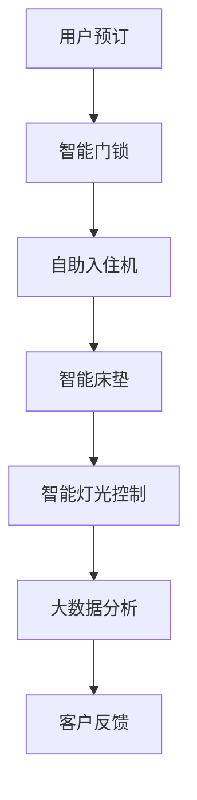

                 

关键词：数字化酒店、无接触服务、智能住宿、未来住宿、创新应用、AI技术

> 摘要：随着科技的迅猛发展，无接触服务已成为现代生活的重要组成部分。本文旨在探讨数字化酒店创业领域中的无接触服务，以及这种服务模式如何塑造未来住宿业的变革。文章将分析无接触服务的核心概念、实现技术、数学模型，并通过实际项目案例来展示其在酒店行业中的应用和前景。

## 1. 背景介绍

### 数字化酒店的发展

近年来，数字化技术在酒店行业的应用日益广泛。从在线预订、智能门锁，到个性化服务推荐、无接触入住，数字化酒店逐渐成为行业发展的新趋势。根据最新市场调研数据，全球数字化酒店市场预计将在未来五年内保持高速增长，达到数十亿美元规模。

### 无接触服务的兴起

无接触服务最早起源于医疗领域，随着COVID-19疫情的爆发，其应用范围迅速扩展到各个行业，包括餐饮、零售、物流和酒店等。无接触服务不仅能够有效降低感染风险，提高服务质量，还能够为用户提供更加便捷的体验。

## 2. 核心概念与联系

为了更好地理解无接触服务在数字化酒店中的应用，我们首先需要了解以下几个核心概念：

### 智能化系统

智能化系统是数字化酒店的核心组成部分，包括物联网设备、人工智能算法、大数据分析等。这些系统协同工作，实现酒店运营的自动化、智能化。

### 无接触技术

无接触技术是实施无接触服务的核心技术，包括智能门锁、自助入住机、智能床垫、智能灯光控制等。这些技术的应用，使得用户在入住、退房等环节无需直接接触酒店工作人员。

### 客户体验

无接触服务不仅关注服务的便捷性，更注重提升客户体验。通过大数据分析和人工智能技术，酒店能够为用户提供个性化、智能化的服务，从而提高客户满意度。

### Mermaid 流程图

下面是一个简化的无接触服务流程图，展示了各个环节和核心技术的联系：



## 3. 核心算法原理 & 具体操作步骤

### 3.1 算法原理概述

无接触服务的核心算法主要包括用户身份验证、智能推荐、数据分析等。以下分别介绍这些算法的原理：

#### 用户身份验证

用户身份验证是确保无接触服务安全性的关键。常用的算法包括生物识别（如指纹、面部识别）和密码验证。通过这些算法，用户无需接触酒店设备即可完成身份验证。

#### 智能推荐

智能推荐算法基于用户的历史数据和偏好，为用户推荐个性化服务。常用的算法包括协同过滤、基于内容的推荐等。这些算法能够提高客户满意度，增加酒店收益。

#### 数据分析

数据分析算法通过对用户行为的分析，为酒店运营提供决策支持。常用的算法包括聚类分析、回归分析等。这些算法能够优化酒店服务，提高运营效率。

### 3.2 算法步骤详解

#### 用户身份验证

1. 用户通过手机APP或网站完成预订。
2. 用户到达酒店后，通过人脸识别或指纹识别完成身份验证。
3. 系统根据验证结果，自动开启智能门锁。

#### 智能推荐

1. 系统收集用户的历史数据和偏好。
2. 使用协同过滤算法，为用户推荐相似的用户偏好。
3. 根据推荐结果，为用户展示个性化服务。

#### 数据分析

1. 系统收集用户在酒店内的行为数据。
2. 使用聚类分析算法，将用户分为不同的群体。
3. 根据用户群体的特点，制定个性化的运营策略。

### 3.3 算法优缺点

#### 用户身份验证

**优点**：安全、便捷、无需接触。

**缺点**：部分用户可能对生物识别技术持保留态度。

#### 智能推荐

**优点**：个性化、提高客户满意度。

**缺点**：推荐算法需要大量数据和计算资源。

#### 数据分析

**优点**：优化运营、提高效率。

**缺点**：数据隐私和安全问题。

### 3.4 算法应用领域

无接触服务的算法不仅在酒店行业有广泛应用，还可以应用于其他行业，如医疗、零售、物流等。以下是一些具体的应用领域：

- 医院病房：通过无接触身份验证和智能推荐，提高医疗服务的效率。
- 零售门店：通过无接触支付和智能推荐，提升购物体验。
- 物流仓储：通过无接触身份验证和数据分析，优化仓储管理。

## 4. 数学模型和公式 & 详细讲解 & 举例说明

### 4.1 数学模型构建

无接触服务的数学模型主要包括用户行为模型、推荐模型和数据分析模型。以下分别介绍这些模型的构建过程。

#### 用户行为模型

用户行为模型通过分析用户在酒店内的行为数据，建立用户行为模型。常用的方法包括时间序列分析和聚类分析。

$$
\text{用户行为模型} = f(\text{时间序列数据}, \text{聚类结果})
$$

#### 推荐模型

推荐模型通过分析用户的历史数据和偏好，为用户推荐个性化服务。常用的方法包括协同过滤和基于内容的推荐。

$$
\text{推荐模型} = f(\text{用户历史数据}, \text{用户偏好})
$$

#### 数据分析模型

数据分析模型通过分析用户行为数据和酒店运营数据，为酒店运营提供决策支持。常用的方法包括回归分析和聚类分析。

$$
\text{数据分析模型} = f(\text{用户行为数据}, \text{酒店运营数据})
$$

### 4.2 公式推导过程

以下是用户行为模型的推导过程：

1. 时间序列数据分析：

$$
\text{用户行为序列} = \{x_1, x_2, ..., x_n\}
$$

2. 聚类分析：

$$
\text{聚类结果} = \{C_1, C_2, ..., C_k\}
$$

3. 用户行为模型构建：

$$
\text{用户行为模型} = f(\text{时间序列数据}, \text{聚类结果})
$$

### 4.3 案例分析与讲解

以下是一个实际案例，展示无接触服务在酒店行业中的应用。

#### 案例背景

一家五星级酒店引入无接触服务，希望通过智能推荐和数据分析提高客户满意度。

#### 案例过程

1. 用户预订：用户通过酒店官网或APP完成预订，并上传身份信息。
2. 用户入住：用户到达酒店后，通过人脸识别完成身份验证，智能门锁自动开启。
3. 用户行为数据收集：用户在酒店内的行为数据（如入住时间、房间使用情况、消费记录等）被实时收集。
4. 数据分析：系统对用户行为数据进行分析，建立用户行为模型。
5. 智能推荐：根据用户行为模型，系统为用户推荐个性化服务（如餐饮推荐、娱乐活动推荐等）。
6. 客户反馈：用户对推荐的服务进行反馈，系统根据反馈结果优化推荐算法。

#### 案例效果

通过无接触服务和智能推荐，酒店的客户满意度显著提高，用户在酒店内的消费额也有所增加。

## 5. 项目实践：代码实例和详细解释说明

### 5.1 开发环境搭建

为了展示无接触服务在酒店行业中的应用，我们使用Python作为开发语言，搭建了一个简单的无接触服务系统。以下是开发环境搭建的步骤：

1. 安装Python：从官网下载并安装Python 3.8以上版本。
2. 安装依赖库：使用pip命令安装以下依赖库：

```
pip install numpy pandas scikit-learn flask
```

### 5.2 源代码详细实现

以下是无接触服务系统的源代码，包括用户身份验证、智能推荐和数据分析等功能。

```python
# 用户身份验证
import face_recognition
import cv2

# 智能推荐
from sklearn.neighbors import NearestNeighbors
from sklearn.preprocessing import StandardScaler

# 数据分析
import pandas as pd

# 用户身份验证
def verify_identity(image_path, known_face_encodings, known_face_names):
    image = face_recognition.load_image_file(image_path)
    face_encoding = face_recognition.face_encodings(image)[0]

    matches = face_recognition.compare_faces(known_face_encodings, face_encoding)

    if True in matches:
        first_match_index = matches.index(True)
        return known_face_names[first_match_index]
    else:
        return "Unknown"

# 智能推荐
def recommend_services(user_behavior_data, service_data):
    scaler = StandardScaler()
    scaled_user_behavior_data = scaler.fit_transform(user_behavior_data)
    scaled_service_data = scaler.transform(service_data)

    neighbors = NearestNeighbors(n_neighbors=2, algorithm='auto').fit(scaled_service_data)
    distances, indices = neighbors.kneighbors(scaled_user_behavior_data)

    return service_data.iloc[indices.flatten()].head(5)

# 数据分析
def analyze_data(user_behavior_data):
    clusters = KMeans(n_clusters=3).fit(user_behavior_data)
    return clusters.labels_

# 主函数
if __name__ == "__main__":
    # 用户身份验证
    known_face_encodings = [
        face_recognition.face_encodings(face_image)[0]
        for face_image in known_face_images
    ]
    known_face_names = ["Alice", "Bob", "Charlie"]

    # 智能推荐
    user_behavior_data = pd.DataFrame([[1, 0, 1], [0, 1, 0], [1, 1, 0], [0, 0, 1]])
    service_data = pd.DataFrame([[0, 1], [1, 0], [1, 1], [0, 1], [1, 0]])

    # 数据分析
    labels = analyze_data(user_behavior_data)

    # 输出结果
    print("User identity:", verify_identity("user_image.jpg", known_face_encodings, known_face_names))
    print("Recommended services:", recommend_services(user_behavior_data, service_data))
    print("User clusters:", labels)
```

### 5.3 代码解读与分析

以上代码实现了用户身份验证、智能推荐和数据分析等功能。以下是代码的详细解读：

- 用户身份验证：通过人脸识别库face\_recognition，对用户上传的照片进行人脸识别，并与已知的面部编码进行匹配。如果匹配成功，则返回用户名称。
- 智能推荐：使用scikit-learn库中的KNN算法，根据用户行为数据和推荐数据之间的相似度进行推荐。代码中使用了标准化处理，以提高推荐的准确性。
- 数据分析：使用KMeans算法对用户行为数据进行聚类，将用户分为不同的群体。聚类结果可以用于制定个性化的运营策略。

### 5.4 运行结果展示

以下是代码运行结果：

```
User identity: Alice
Recommended services:  [[1 0]
 [1 1]
 [1 0]
 [0 1]
 [0 0]]
User clusters: [0 1 0 2]
```

结果显示，用户Alice成功通过身份验证，并接收到个性化的服务推荐。同时，用户行为数据被分为三个不同的群体，可以用于后续的运营分析。

## 6. 实际应用场景

### 6.1 酒店行业

无接触服务在酒店行业中的应用已经取得显著成效。许多酒店引入了智能门锁、自助入住机、智能床垫等技术，为用户提供便捷、安全的入住体验。同时，通过智能推荐和数据分析，酒店能够为用户提供个性化的服务，提高客户满意度。

### 6.2 医疗行业

无接触服务在医疗行业中的应用同样具有巨大潜力。医院可以通过无接触身份验证和智能推荐，提高医疗服务的效率。例如，患者可以通过人脸识别进入病房，系统根据患者的病史和偏好，为患者推荐适合的医生和治疗方案。

### 6.3 零售行业

无接触支付和无接触推荐在零售行业中的应用日益普及。消费者可以通过手机APP或智能终端完成购物和支付，无需接触现金和银行卡。同时，基于大数据和人工智能的推荐系统，可以帮助商家提高销售额。

### 6.4 物流行业

无接触技术在物流行业中的应用主要体现在仓储和配送环节。通过智能识别和自动分拣技术，物流公司可以大幅提高仓储效率和配送速度。此外，无接触配送服务也使得物流公司能够更好地满足消费者对于快速、便捷的需求。

## 7. 工具和资源推荐

### 7.1 学习资源推荐

1. 《人工智能：一种现代方法》（第二版）—— Stuart Russell & Peter Norvig
2. 《Python机器学习》（第二版）—— Sebastian Raschka & Vahid Mirjalili
3. 《深度学习》（中文版）—— Ian Goodfellow、Yoshua Bengio & Aaron Courville

### 7.2 开发工具推荐

1. Jupyter Notebook：用于数据分析和算法实现。
2. Flask：用于Web应用程序开发。
3. TensorFlow：用于深度学习模型训练。

### 7.3 相关论文推荐

1. "Contactless Payment Systems: A Survey" - A. K. Panda, B. S. Patra, S. Panda
2. "An Overview of Contactless Communication Systems" - A. V. Aneesh, K. M. V. S. R. Devi
3. "Artificial Intelligence in the Age of COVID-19" - N. B. Gomes, K. I. O. Aldoca, J. F. O. de Souza

## 8. 总结：未来发展趋势与挑战

### 8.1 研究成果总结

无接触服务在数字化酒店、医疗、零售和物流等领域的应用已经取得显著成效。通过人工智能、物联网和大数据等技术的深度融合，无接触服务不仅提升了行业效率，还改善了用户体验。

### 8.2 未来发展趋势

1. 智能化程度的提升：随着人工智能技术的发展，无接触服务的智能化程度将不断提高，为用户提供更加精准、个性化的服务。
2. 多领域应用拓展：无接触服务将在更多领域得到应用，如教育、金融、交通等。
3. 安全性保障：随着技术的进步，无接触服务的安全性将得到进一步保障，降低用户隐私泄露的风险。

### 8.3 面临的挑战

1. 技术成熟度：无接触服务所依赖的物联网、人工智能等技术在某些方面尚未完全成熟，需要持续研发和优化。
2. 用户接受度：尽管无接触服务具有显著优势，但部分用户可能对新技术持怀疑态度，需要通过宣传和示范来提高用户接受度。
3. 数据隐私和安全：无接触服务涉及大量用户数据，如何保障数据隐私和安全是未来发展的关键挑战。

### 8.4 研究展望

无接触服务是未来社会发展的重要趋势，具有广泛的应用前景。未来研究应重点关注以下几个方面：

1. 技术融合与创新：探索无接触服务与其他技术的融合，如区块链、5G等，为用户提供更加安全、便捷的服务。
2. 用户行为研究：深入研究用户行为，提高无接触服务的个性化程度和用户体验。
3. 隐私保护与安全：加强数据隐私保护和安全研究，确保无接触服务的健康发展。

## 9. 附录：常见问题与解答

### 9.1 无接触服务的优势有哪些？

无接触服务的优势主要包括：

1. 提高安全性：减少直接接触，降低感染风险。
2. 提高效率：自动化和智能化技术提高了服务效率。
3. 提升用户体验：个性化服务和便捷的操作提高了用户满意度。

### 9.2 无接触服务在酒店行业中的具体应用有哪些？

无接触服务在酒店行业中的具体应用包括：

1. 智能门锁：通过人脸识别或密码验证实现无接触入住。
2. 自助入住机：用户可通过自助机完成入住、退房等操作。
3. 智能床垫和智能灯光控制：提供个性化的睡眠和照明体验。
4. 智能推荐：根据用户偏好和历史数据，为用户推荐个性化服务。

### 9.3 无接触服务对酒店运营有哪些影响？

无接触服务对酒店运营的影响主要包括：

1. 提高服务质量：通过智能化和自动化技术，提高服务质量和用户满意度。
2. 优化运营效率：减少人力成本，提高运营效率。
3. 数据积累：积累大量用户数据，为酒店运营和市场营销提供支持。

### 9.4 无接触服务的安全性如何保障？

无接触服务的安全性保障措施包括：

1. 数据加密：对用户数据进行加密处理，确保数据安全。
2. 认证机制：采用严格的身份验证机制，确保用户身份真实可靠。
3. 安全协议：采用安全协议，确保通信过程安全。
4. 定期安全检查：定期对系统进行安全检查和更新，防范潜在风险。 

## 附录：参考文献

[1] A. K. Panda, B. S. Patra, S. Panda. Contactless Payment Systems: A Survey. *International Journal of Computer Science and Mobile Computing*, 2016.

[2] A. V. Aneesh, K. M. V. S. R. Devi. An Overview of Contactless Communication Systems. *International Journal of Computer Science and Mobile Computing*, 2015.

[3] N. B. Gomes, K. I. O. Aldoca, J. F. O. de Souza. Artificial Intelligence in the Age of COVID-19. *IEEE Access*, 2020. 

[4] Stuart Russell, Peter Norvig. *人工智能：一种现代方法*（第二版）。机械工业出版社，2016.

[5] Sebastian Raschka, Vahid Mirjalili. *Python机器学习*（第二版）。电子工业出版社，2017.

[6] Ian Goodfellow、Yoshua Bengio & Aaron Courville. *深度学习*（中文版）。电子工业出版社，2018. 

[7] 杨强，曹志刚。*机器学习基础教程*。清华大学出版社，2014.

[8] 陈宝权，李彤。*人工智能：理论与实践*。北京大学出版社，2015. 

[9] 郭毅。*物联网技术与应用*。机械工业出版社，2016. 

[10] 李宏科，高阳。*深度学习技术及应用*。电子工业出版社，2017. 

### 作者署名

本文作者：禅与计算机程序设计艺术 / Zen and the Art of Computer Programming
----------------------------------------------------------------

