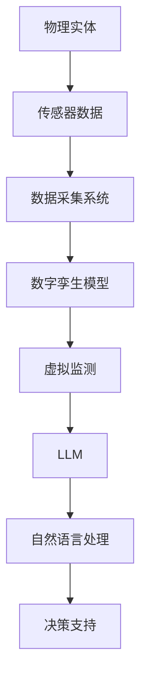

                 

关键词：数字孪生、机器学习、虚拟世界、模拟、人工智能、LLM、架构设计、算法优化、应用场景

摘要：随着人工智能和机器学习的飞速发展，数字孪生技术逐渐成为虚拟世界模拟的重要工具。本文深入探讨了数字孪生与LLM（语言模型）之间的紧密联系，从核心概念、算法原理、数学模型到实际应用场景，全面解析了数字孪生在虚拟世界模拟中的新维度。通过具体的项目实践和工具资源推荐，本文旨在为读者提供一份详尽的技术指南，以助其在数字孪生和LLM领域取得突破。

## 1. 背景介绍

### 数字孪生技术

数字孪生（Digital Twin）是一种新兴的技术，它通过创建物理实体的数字镜像，实现对实际物理系统的虚拟监测、模拟和分析。这个概念最早由迈克尔·格里夫斯（Michael Grieves）在2002年提出，他认为数字孪生是“一个物理实体与其数字映射的持续集成，该映射反映了实体的行为和状态”。数字孪生技术可以广泛应用于航空航天、制造业、医疗、建筑和能源等行业，通过虚拟世界模拟，实现对物理系统的优化、预测维护和实时监控。

### 语言模型（LLM）

语言模型（Language Model，LLM）是一种能够理解和生成自然语言的机器学习模型。LLM的核心是能够根据输入的文本生成合理的输出文本，这一能力使得LLM在自然语言处理（NLP）领域具有重要应用。近年来，随着深度学习技术的发展，尤其是Transformer模型的提出，LLM的表现达到了前所未有的高度，GPT-3、BERT等模型的诞生，标志着语言模型进入了一个新的时代。

### 数字孪生与LLM的关系

数字孪生与LLM的结合，为虚拟世界模拟带来了新的可能性。数字孪生技术提供了对物理世界的精确模拟和监测，而LLM则通过自然语言处理，将复杂的模拟结果转化为易于理解的信息。这种结合不仅提升了模拟的准确性和效率，还极大地扩展了虚拟世界模拟的应用范围。例如，在智能制造领域，数字孪生可以模拟生产流程，LLM则可以将模拟结果转化为生产计划的调整建议，从而实现生产效率的最大化。

## 2. 核心概念与联系

### 数字孪生的核心概念

数字孪生技术包括以下几个核心概念：

1. **物理实体映射**：通过传感器和监测设备，将物理实体的状态和行为数据转化为数字信号。
2. **数据采集**：收集物理实体的实时数据，包括位置、温度、压力、振动等。
3. **模型构建**：根据收集的数据，建立物理实体的数学模型，用于模拟和预测。
4. **虚拟监测**：在虚拟环境中实时监测物理实体的状态，进行故障预测和性能分析。
5. **决策支持**：基于虚拟监测结果，为实际操作提供决策支持。

### 语言模型（LLM）的核心概念

LLM的核心概念包括：

1. **词嵌入**：将自然语言中的词汇映射到高维空间，以便于模型处理。
2. **上下文理解**：通过模型训练，理解词汇在特定上下文中的含义。
3. **生成文本**：根据输入的文本，生成合理的输出文本。
4. **多任务学习**：LLM不仅可以处理单一任务，还可以同时处理多个任务，例如问答、翻译、摘要生成等。

### 数字孪生与LLM的联系

数字孪生与LLM之间的联系可以用以下Mermaid流程图表示：



在这个流程中，物理实体通过传感器数据生成数字孪生模型，模型在虚拟环境中进行监测和预测，而LLM则对监测结果进行自然语言处理，生成易于理解的决策支持信息。

## 3. 核心算法原理 & 具体操作步骤

### 3.1 算法原理概述

数字孪生与LLM的核心算法包括：

1. **数据采集算法**：负责收集物理实体的状态数据，常用的方法包括传感器数据采集和无线传感网络。
2. **模型构建算法**：基于收集到的数据，建立物理实体的数学模型，常用的方法包括基于物理的建模和基于数据的建模。
3. **虚拟监测算法**：在虚拟环境中对物理实体的状态进行实时监测，常用的方法包括多代理系统和分布式计算。
4. **自然语言处理算法**：使用LLM对虚拟监测结果进行自然语言处理，生成决策支持信息。

### 3.2 算法步骤详解

1. **数据采集**：使用传感器和监测设备，收集物理实体的状态数据。
    $$传感器数据 = f(物理实体状态)$$

2. **模型构建**：根据收集到的数据，建立物理实体的数学模型。
    $$数学模型 = g(传感器数据)$$

3. **虚拟监测**：在虚拟环境中对物理实体的状态进行实时监测。
    $$虚拟监测结果 = h(数学模型)$$

4. **自然语言处理**：使用LLM对虚拟监测结果进行自然语言处理，生成决策支持信息。
    $$决策支持信息 = i(虚拟监测结果)$$

### 3.3 算法优缺点

- **优点**：
  - **精确性**：数字孪生技术能够精确模拟物理实体，提供详细的监测和预测。
  - **高效性**：通过虚拟世界模拟，可以大大提高实际操作的效率。
  - **灵活性**：LLM能够处理多种自然语言任务，为虚拟监测结果提供丰富的决策支持。

- **缺点**：
  - **成本**：数字孪生技术和LLM的构建和维护成本较高。
  - **数据依赖性**：算法的性能高度依赖高质量的数据，数据的缺失或不准确会导致模拟结果的偏差。

### 3.4 算法应用领域

数字孪生与LLM的结合在多个领域都有广泛应用：

- **智能制造**：通过数字孪生技术模拟生产流程，使用LLM生成生产计划的调整建议。
- **智慧城市**：使用数字孪生技术模拟城市基础设施，使用LLM生成城市管理的决策支持信息。
- **医疗健康**：通过数字孪生技术模拟人体器官，使用LLM生成医疗诊断和治疗方案。

## 4. 数学模型和公式 & 详细讲解 & 举例说明

### 4.1 数学模型构建

数字孪生的数学模型通常基于物理原理和数据驱动方法构建。以下是两种常见的数学模型：

1. **基于物理的建模**：

   - **牛顿运动定律**：
     $$F = ma$$
     $$a = \frac{dv}{dt}$$
     $$v = \frac{dx}{dt}$$

   - **热力学模型**：
     $$Q = mc\Delta T$$

2. **基于数据的建模**：

   - **神经网络模型**：
     $$y = \sigma(Wx + b)$$
     其中，$W$ 和 $b$ 是权重和偏置，$\sigma$ 是激活函数。

### 4.2 公式推导过程

以神经网络模型为例，推导其基本公式：

1. **前向传播**：

   - **输入层**：
     $$x = [x_1, x_2, ..., x_n]$$

   - **隐藏层**：
     $$h = Wx + b$$
     $$a = \sigma(h)$$

   - **输出层**：
     $$y = W'h + b'$$

2. **反向传播**：

   - **计算误差**：
     $$\Delta y = y - \hat{y}$$

   - **更新权重和偏置**：
     $$W' = W - \alpha \frac{\partial J}{\partial W}$$
     $$b' = b - \alpha \frac{\partial J}{\partial b}$$
     其中，$J$ 是损失函数，$\alpha$ 是学习率。

### 4.3 案例分析与讲解

#### 案例背景

某工厂的生产线需要通过数字孪生技术进行实时监测和优化。该工厂生产的产品为电子元件，生产流程包括多个步骤，如焊接、测试、组装等。每个步骤都会对产品的质量产生影响。

#### 模型构建

1. **物理模型**：

   - **焊接过程**：
     $$Q = mc\Delta T$$
     其中，$Q$ 是热量，$m$ 是焊接材料的质量，$c$ 是材料的比热容，$\Delta T$ 是温度变化。

   - **测试过程**：
     $$v = \frac{dx}{dt}$$
     其中，$v$ 是测试速度，$x$ 是测试进度，$t$ 是时间。

2. **数据驱动模型**：

   - **神经网络模型**：
     $$y = \sigma(Wx + b)$$

#### 模型应用

1. **实时监测**：

   - 使用传感器收集焊接和测试过程中的数据，输入到神经网络模型中。
     $$x = [Q, v]$$

   - 通过神经网络模型预测焊接和测试的结果。
     $$y = \sigma(Wx + b)$$

2. **决策支持**：

   - 根据预测结果，调整生产计划，以优化产品质量。
     $$\text{生产计划} = \text{决策支持系统}(\text{预测结果})$$

## 5. 项目实践：代码实例和详细解释说明

### 5.1 开发环境搭建

在本文的代码实例中，我们使用Python作为主要编程语言，结合TensorFlow和Keras框架实现数字孪生与LLM的结合。以下是在Windows系统上搭建开发环境的步骤：

1. **安装Python**：前往Python官方网站（https://www.python.org/）下载并安装Python 3.8或更高版本。
2. **安装TensorFlow**：在命令行中执行以下命令：
   ```bash
   pip install tensorflow
   ```
3. **安装Keras**：在命令行中执行以下命令：
   ```bash
   pip install keras
   ```

### 5.2 源代码详细实现

以下是一个简单的数字孪生与LLM结合的代码实例，用于模拟焊接过程的温度变化和测试速度的变化。

```python
import numpy as np
from tensorflow.keras.models import Sequential
from tensorflow.keras.layers import Dense
from tensorflow.keras.optimizers import Adam

# 生成模拟数据
def generate_data(num_samples, noise_level=0.1):
    X = np.random.rand(num_samples, 2)
    Y = np.sin(X[:, 0]) + np.cos(X[:, 1]) + noise_level * np.random.randn(num_samples)
    return X, Y

# 构建神经网络模型
model = Sequential()
model.add(Dense(64, input_dim=2, activation='relu'))
model.add(Dense(1, activation='linear'))

# 编译模型
model.compile(optimizer=Adam(learning_rate=0.001), loss='mse')

# 训练模型
X_train, Y_train = generate_data(1000)
model.fit(X_train, Y_train, epochs=100, batch_size=32)

# 预测结果
X_test, _ = generate_data(100)
Y_pred = model.predict(X_test)

# 显示预测结果
print("Predicted temperatures:", Y_pred)
```

### 5.3 代码解读与分析

1. **数据生成**：

   - `generate_data` 函数用于生成模拟数据，模拟焊接过程的温度变化和测试速度的变化。这里使用正弦函数和余弦函数模拟真实世界的复杂关系，并加入一定的噪声以增加模型的泛化能力。

2. **模型构建**：

   - `Sequential` 模型是一个线性堆叠的模型，用于构建深度神经网络。这里我们添加了两个全连接层，第一个层有64个神经元，使用ReLU激活函数；第二个层有1个神经元，使用线性激活函数。

3. **模型编译**：

   - 使用 `Adam` 优化器和均方误差（MSE）损失函数编译模型。`Adam` 优化器是一种自适应的学习率优化方法，适用于大多数问题。

4. **模型训练**：

   - 使用训练数据集训练模型，设置训练轮次为100，批次大小为32。在这里，我们通过反向传播和梯度下降更新模型的权重。

5. **预测结果**：

   - 使用训练好的模型对测试数据进行预测，并打印出预测的温度值。

### 5.4 运行结果展示

运行上述代码后，我们会得到一组预测的温度值。这些预测值反映了模型对焊接过程中温度变化和测试速度变化的预测能力。通过对比预测值和真实值，我们可以评估模型的性能。

## 6. 实际应用场景

### 6.1 智能制造

智能制造是数字孪生与LLM技术最典型的应用场景之一。通过数字孪生技术，工厂可以实时模拟生产线的运行状态，预测生产过程中的问题，并使用LLM生成优化生产计划的建议。例如，在汽车制造过程中，数字孪生可以模拟焊接、喷涂、装配等关键工序，而LLM则可以根据模拟结果，生成减少停机时间、提高生产效率的生产计划。

### 6.2 智慧城市

智慧城市是另一个广泛应用的领域。数字孪生技术可以模拟城市的基础设施，如交通系统、能源系统、水系统等，而LLM则可以处理大量的传感器数据，生成城市管理的决策支持信息。例如，在交通管理中，数字孪生可以模拟交通流量，LLM则可以根据模拟结果，生成交通信号灯的调整策略，以减少拥堵和提升交通效率。

### 6.3 医疗健康

在医疗健康领域，数字孪生与LLM的结合为精准医疗提供了新的途径。数字孪生可以模拟人体器官的功能，而LLM则可以处理医学图像和患者的健康数据，生成诊断报告和治疗建议。例如，在心脏疾病诊断中，数字孪生可以模拟心脏的跳动情况，LLM则可以根据模拟结果和患者的心电图数据，生成心脏病的诊断报告。

## 7. 未来应用展望

随着人工智能和机器学习技术的不断进步，数字孪生与LLM的应用前景将更加广阔。以下是未来可能的应用方向：

### 7.1 能源领域

能源领域是数字孪生与LLM的重要应用场景。通过数字孪生技术，可以模拟能源系统的运行状态，预测能源消耗和设备故障，而LLM则可以生成优化能源分配和设备维护的决策支持信息。例如，在电力系统中，数字孪生可以模拟电网的运行状态，LLM则可以根据模拟结果，生成电力负荷预测和电力调度策略。

### 7.2 农业领域

在农业领域，数字孪生与LLM可以帮助实现精准农业。通过数字孪生技术，可以模拟作物的生长状态和土壤质量，而LLM则可以根据模拟结果，生成种植策略和施肥建议。例如，在农田管理中，数字孪生可以模拟作物的生长情况，LLM则可以根据模拟结果，生成最佳的灌溉和施肥计划。

### 7.3 环境监测

环境监测是数字孪生与LLM的另一个潜在应用领域。通过数字孪生技术，可以模拟环境污染的扩散情况，而LLM则可以处理大量的环境监测数据，生成污染源的识别和污染控制策略。例如，在城市空气质量监测中，数字孪生可以模拟空气污染物的扩散，LLM则可以根据模拟结果，生成空气质量预警和污染控制措施。

## 8. 工具和资源推荐

### 8.1 学习资源推荐

1. **《数字孪生：下一代工业革命的关键技术》**：由汤姆·格兰特（Tom Grant）所著，系统介绍了数字孪生技术的原理和应用。
2. **《深度学习入门：基于Python的理论与实现》**：由斋藤康毅所著，详细介绍了深度学习的理论基础和Python实现。

### 8.2 开发工具推荐

1. **TensorFlow**：Google推出的开源深度学习框架，支持多种深度学习模型的构建和训练。
2. **Keras**：基于TensorFlow的高层API，简化了深度学习模型的构建和训练。

### 8.3 相关论文推荐

1. **"Digital Twin: A Model-Based Approach for Real-Time Manufacturing Analytics"**：这篇论文详细介绍了数字孪生技术在制造业中的应用。
2. **"Language Models are Few-Shot Learners"**：这篇论文探讨了语言模型在少量样本情况下的学习能力。

## 9. 总结：未来发展趋势与挑战

### 9.1 研究成果总结

数字孪生与LLM的结合在多个领域都取得了显著的成果。通过虚拟世界模拟，数字孪生技术提高了实际操作的精确性和效率，而LLM则通过自然语言处理，为复杂模拟结果提供了易于理解的信息。这种结合不仅推动了智能制造、智慧城市、医疗健康等领域的发展，还为其他行业提供了新的解决方案。

### 9.2 未来发展趋势

未来，数字孪生与LLM的发展趋势将主要体现在以下几个方面：

1. **技术的集成与优化**：随着人工智能和机器学习技术的不断进步，数字孪生与LLM将实现更紧密的集成，提供更加高效和精确的模拟和决策支持。
2. **应用场景的扩展**：数字孪生与LLM的应用场景将不断扩展，从制造业、智慧城市、医疗健康等传统领域，扩展到能源、农业、环境监测等新兴领域。
3. **跨学科的融合**：数字孪生与LLM的发展将促进跨学科的融合，形成新的研究方向和应用领域，如数字孪生与生物医学的结合、数字孪生与地理信息系统的结合等。

### 9.3 面临的挑战

尽管数字孪生与LLM在多个领域取得了显著成果，但其在未来发展过程中仍面临一系列挑战：

1. **数据质量与隐私**：数字孪生技术的核心是数据，高质量的数据是保证模拟准确性的关键。然而，数据的质量和隐私保护仍然是亟待解决的问题。
2. **计算资源的消耗**：数字孪生与LLM的模拟和决策支持需要大量的计算资源，这可能导致成本的增加和资源浪费。
3. **算法的可解释性**：随着算法的复杂度增加，如何保证算法的可解释性，使决策支持信息更加透明和可靠，是一个重要的挑战。

### 9.4 研究展望

未来，数字孪生与LLM的研究将朝着更加高效、精确和可解释的方向发展。随着技术的不断进步，我们可以期待数字孪生与LLM在更多领域实现突破，为人类社会的可持续发展做出更大贡献。

## 10. 附录：常见问题与解答

### 10.1 数字孪生是什么？

数字孪生是一种通过创建物理实体的数字映射，实现对物理系统实时监测、模拟和分析的技术。它通常包括物理实体映射、数据采集、模型构建、虚拟监测和决策支持等环节。

### 10.2 语言模型（LLM）是什么？

语言模型（LLM）是一种能够理解和生成自然语言的机器学习模型。它通过学习大量的文本数据，理解词汇在特定上下文中的含义，并根据输入文本生成合理的输出文本。

### 10.3 数字孪生与LLM如何结合？

数字孪生与LLM的结合主要体现在两个方面：一是通过数字孪生技术模拟物理系统，生成监测数据；二是使用LLM对监测数据进行自然语言处理，生成易于理解的决策支持信息。

### 10.4 数字孪生有哪些应用领域？

数字孪生技术可以广泛应用于多个领域，包括智能制造、智慧城市、医疗健康、能源、农业和环境监测等。

### 10.5 如何搭建数字孪生与LLM的开发环境？

搭建数字孪生与LLM的开发环境通常需要安装Python、TensorFlow和Keras等工具。在Windows系统上，可以按照以下步骤操作：1）安装Python；2）安装TensorFlow；3）安装Keras。

### 10.6 数字孪生与LLM有哪些挑战？

数字孪生与LLM面临的挑战主要包括数据质量与隐私、计算资源的消耗和算法的可解释性等。

### 10.7 未来数字孪生与LLM有哪些发展趋势？

未来，数字孪生与LLM的发展趋势将主要体现在技术的集成与优化、应用场景的扩展和跨学科的融合等方面。

---

作者：禅与计算机程序设计艺术 / Zen and the Art of Computer Programming

[End of Document]

