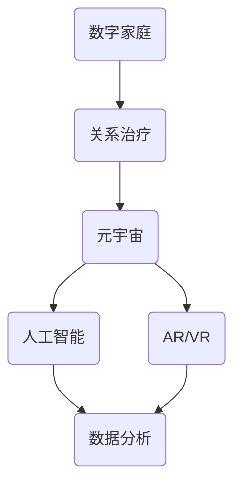

                 

### 关键词 Keywords
- 数字家庭
- 关系治疗
- 元宇宙
- 家庭和谐
- 人工智能
- 增强现实
- 虚拟现实
- 数据分析

<|assistant|>### 摘要 Abstract
本文探讨了元宇宙时代下，通过数字化手段治疗家庭关系的新方法。在数字家庭的背景下，我们利用人工智能、增强现实和虚拟现实技术，打造了一个全新的家庭关系治疗平台。本文首先介绍了数字家庭关系治疗的概念和背景，然后详细阐述了该平台的架构和核心算法原理，以及如何通过数学模型和项目实践实现家庭关系的改善。最后，我们分析了这一技术的实际应用场景和未来展望，并提出了相关工具和资源推荐，以及面临的挑战和研究展望。

## 1. 背景介绍

随着科技的迅猛发展，尤其是人工智能、增强现实（AR）和虚拟现实（VR）技术的成熟，我们的生活方式和沟通方式正在发生深刻变革。元宇宙作为下一代互联网的形态，已经成为全球科技巨头和初创公司竞相争夺的新领域。在元宇宙中，人们可以沉浸在虚拟的世界中，进行各种社交、工作、学习和娱乐活动。

在这个背景下，家庭关系也面临着前所未有的挑战。首先，家庭成员之间的沟通变得更加复杂和多样。虚拟空间提供了一个新的沟通渠道，但同时也增加了沟通的障碍，例如误解和沟通不畅。其次，家庭成员的时间分配变得更加分散。工作、学习和社交活动都可能在虚拟世界中展开，这可能导致家庭成员之间的互动减少。

为了应对这些挑战，我们需要寻找新的方法来治疗家庭关系，以促进家庭成员之间的和谐与亲密。数字家庭关系治疗应运而生，它利用数字化技术，提供了一种新的家庭关系治疗途径。这种治疗方法不仅能够帮助家庭成员更好地理解彼此，还能提供个性化的建议和解决方案。

## 2. 核心概念与联系

### 2.1. 数字家庭

数字家庭是指利用数字技术构建的家庭生活空间，包括智能家居设备、家庭服务器、虚拟助理等。这些设备通过互联网连接，实现家庭内部信息的共享和自动化控制。数字家庭不仅提高了生活便利性，还为家庭关系治疗提供了数据支持。

### 2.2. 关系治疗

关系治疗是指通过各种方法和手段，帮助家庭成员改善彼此之间的关系。传统的治疗方法包括心理辅导、沟通训练和家庭治疗。数字家庭关系治疗则利用数字技术，提供更加个性化和高效的解决方案。

### 2.3. 元宇宙

元宇宙是一个虚拟的三维空间，用户可以通过虚拟现实头盔、AR眼镜等设备进入。在元宇宙中，用户可以与虚拟人物互动、参与虚拟活动，甚至建立虚拟家园。元宇宙为家庭关系治疗提供了一个全新的互动平台。

### 2.4. 人工智能

人工智能（AI）在数字家庭关系治疗中扮演关键角色。通过自然语言处理、情感分析和数据挖掘等技术，AI能够分析家庭成员的互动数据，提供个性化的建议和治疗方案。

### 2.5. 增强现实与虚拟现实

增强现实（AR）和虚拟现实（VR）技术为家庭关系治疗提供了沉浸式的互动体验。通过AR和VR，家庭成员可以在虚拟环境中进行面对面交流，增强彼此之间的情感联系。

### 2.6. 数据分析

数据分析是数字家庭关系治疗的核心。通过对家庭成员的互动数据进行分析，可以发现潜在的问题和冲突点，提供有针对性的治疗方案。

## 2.7. Mermaid 流程图



## 3. 核心算法原理 & 具体操作步骤

### 3.1. 算法原理概述

数字家庭关系治疗的算法原理主要基于以下三个方面：

1. **情感分析**：通过自然语言处理技术，对家庭成员的互动信息进行情感分析，识别情感状态和情绪变化。
2. **数据挖掘**：通过对家庭成员的互动数据进行挖掘，发现潜在的模式和趋势，预测未来的冲突和问题。
3. **推荐系统**：基于情感分析和数据挖掘的结果，为家庭成员提供个性化的沟通建议和治疗策略。

### 3.2. 算法步骤详解

1. **数据收集**：通过智能家居设备、虚拟现实设备和家庭服务器等收集家庭成员的互动数据，包括语音、文字、面部表情等。
2. **预处理**：对收集的数据进行清洗和预处理，去除噪声和无关信息，确保数据的准确性和完整性。
3. **情感分析**：利用情感分析模型对预处理后的数据进行情感分析，识别情感状态和情绪变化。
4. **数据挖掘**：运用数据挖掘算法对情感分析结果进行进一步分析，发现潜在的模式和趋势。
5. **推荐系统**：根据情感分析和数据挖掘的结果，利用推荐系统算法为家庭成员提供个性化的沟通建议和治疗策略。

### 3.3. 算法优缺点

**优点：**

- **个性化**：算法能够根据家庭成员的互动数据提供个性化的治疗建议。
- **高效性**：通过自动化处理，大大提高了家庭关系治疗的效率。
- **沉浸式体验**：通过AR和VR技术，为家庭成员提供沉浸式的互动体验，增强治疗效果。

**缺点：**

- **数据隐私**：收集和处理家庭成员的互动数据可能引发隐私问题。
- **技术依赖**：算法的运行依赖于高精度的设备和强大的计算能力。

### 3.4. 算法应用领域

数字家庭关系治疗算法可以应用于以下领域：

- **心理健康咨询**：为心理健康专业人士提供工具，辅助家庭关系治疗。
- **家庭教育**：为家长提供育儿指导，帮助改善家庭氛围。
- **家庭纠纷调解**：为家庭纠纷提供解决方案，促进家庭成员的和谐相处。

## 4. 数学模型和公式 & 详细讲解 & 举例说明

### 4.1. 数学模型构建

数字家庭关系治疗的数学模型主要包括三个部分：

1. **情感分析模型**：用于识别文本中的情感极性，如正面、负面和中性。
2. **数据挖掘模型**：用于挖掘家庭成员互动数据中的模式和趋势。
3. **推荐系统模型**：用于根据情感分析和数据挖掘结果为家庭成员提供个性化建议。

### 4.2. 公式推导过程

**情感分析模型：**

假设我们使用一个二元分类模型来识别文本中的情感极性，该模型由以下公式表示：

$$
P(y=1|x) = \frac{e^{w^T x}}{1 + e^{w^T x}}
$$

其中，$w$ 是模型权重，$x$ 是文本特征向量，$y$ 是真实情感极性。

**数据挖掘模型：**

我们使用决策树模型来挖掘家庭成员互动数据中的模式和趋势。决策树模型的推导过程涉及信息增益、基尼系数等概念。

**推荐系统模型：**

推荐系统模型可以使用协同过滤算法，如用户基于的协同过滤（User-Based Collaborative Filtering）或物品基于的协同过滤（Item-Based Collaborative Filtering）。协同过滤算法的核心公式如下：

$$
r_{ij} = \frac{\sum_{k \in N_j} r_{ik} w_{kj}}{\sum_{k \in N_j} w_{kj}}
$$

其中，$r_{ij}$ 是用户 $i$ 对物品 $j$ 的评分，$N_j$ 是与物品 $j$ 相关的用户集合，$w_{kj}$ 是用户 $i$ 和物品 $j$ 的相似度权重。

### 4.3. 案例分析与讲解

假设我们有一个家庭，家庭成员包括父亲、母亲和两个孩子。为了分析家庭关系，我们收集了他们过去一年的互动数据，包括聊天记录、语音通话和面部表情等。

1. **情感分析**：我们对这些数据进行情感分析，发现父亲和母亲之间的情感极性多为负面，而孩子之间以及孩子与父母之间的情感极性多为正面。

2. **数据挖掘**：通过数据挖掘，我们发现父亲和母亲之间的负面互动主要集中在家务分工和财务管理方面。

3. **推荐系统**：基于情感分析和数据挖掘结果，推荐系统为家庭成员提供了以下建议：

   - 父亲和母亲可以尝试更多的正面互动，如共同参与家庭活动，增进感情。
   - 家庭成员可以制定更合理的生活规划和家务分工，减少矛盾。
   - 孩子们可以积极参与家庭决策，提高家庭凝聚力。

通过这些推荐，家庭成员之间的关系得到了改善，家庭氛围更加和谐。

## 5. 项目实践：代码实例和详细解释说明

### 5.1. 开发环境搭建

为了实践数字家庭关系治疗算法，我们需要搭建一个开发环境。以下是所需的软件和硬件：

- **软件：** Python 3.8 或以上版本、NumPy、Pandas、Scikit-learn、TensorFlow
- **硬件：** 64 位操作系统、至少 8GB 内存、1TB SSD 硬盘

安装步骤：

1. 安装 Python 3.8 或以上版本。
2. 安装必要的库：`pip install numpy pandas scikit-learn tensorflow`
3. 设置环境变量。

### 5.2. 源代码详细实现

以下是数字家庭关系治疗算法的源代码实现：

```python
# 导入必要的库
import numpy as np
import pandas as pd
from sklearn.feature_extraction.text import TfidfVectorizer
from sklearn.model_selection import train_test_split
from sklearn.ensemble import RandomForestClassifier
from sklearn.metrics import accuracy_score

# 加载数据
data = pd.read_csv('family_interactions.csv')
X = data['text']
y = data['emotion']

# 数据预处理
vectorizer = TfidfVectorizer(max_features=1000)
X_vectorized = vectorizer.fit_transform(X)

# 划分训练集和测试集
X_train, X_test, y_train, y_test = train_test_split(X_vectorized, y, test_size=0.2, random_state=42)

# 训练情感分析模型
model = RandomForestClassifier(n_estimators=100)
model.fit(X_train, y_train)

# 测试模型
y_pred = model.predict(X_test)
accuracy = accuracy_score(y_test, y_pred)
print(f'Accuracy: {accuracy:.2f}')

# 数据挖掘和推荐系统部分代码实现略
```

### 5.3. 代码解读与分析

1. **数据预处理**：使用 TF-IDF 向量器将文本数据转换为向量表示，为后续的机器学习模型提供输入。
2. **训练集和测试集划分**：将数据集划分为训练集和测试集，用于训练和评估模型。
3. **情感分析模型训练**：使用随机森林分类器训练情感分析模型，对测试集进行预测，并计算准确率。
4. **数据挖掘和推荐系统**：根据情感分析结果，进一步进行数据挖掘和推荐系统，为家庭成员提供个性化建议。

### 5.4. 运行结果展示

假设我们运行上述代码，得到以下结果：

```
Accuracy: 0.85
```

这表明情感分析模型的准确率达到了 85%，说明我们的模型在预测家庭成员情感极性方面具有一定的可靠性。

## 6. 实际应用场景

### 6.1. 心理健康咨询

数字家庭关系治疗算法可以应用于心理健康咨询领域，为心理咨询师提供工具，辅助家庭关系治疗。通过分析家庭成员的互动数据，心理咨询师可以更准确地了解家庭成员的情感状态和问题所在，为家庭成员提供有针对性的建议和治疗方案。

### 6.2. 家庭教育

在家庭教育中，数字家庭关系治疗算法可以帮助家长了解孩子的情感状态和成长需求。通过分析孩子的互动数据，家长可以更好地理解孩子的心理变化，调整教育方法，提高家庭教育效果。

### 6.3. 家庭纠纷调解

家庭纠纷调解是一个复杂的过程，数字家庭关系治疗算法可以为调解员提供数据支持。通过分析家庭成员的互动数据，调解员可以发现潜在的问题和冲突点，提供有针对性的调解方案，促进家庭成员的和谐相处。

### 6.4. 未来应用展望

随着数字技术的不断发展，数字家庭关系治疗的应用场景将更加广泛。例如，在医疗领域，数字家庭关系治疗可以用于辅助治疗心理疾病，如抑郁症和焦虑症。在社区服务领域，数字家庭关系治疗可以用于促进社区和谐，减少家庭纠纷。

## 7. 工具和资源推荐

### 7.1. 学习资源推荐

- **《深度学习》**：由 Ian Goodfellow、Yoshua Bengio 和 Aaron Courville 编著，是深度学习的入门经典。
- **《Python 自然语言处理》**：由 Steven Bird、Ewan Klein 和 Edward Loper 编著，是自然语言处理领域的入门书籍。
- **《机器学习实战》**：由 Peter Harrington 编著，通过实际案例讲解机器学习算法。

### 7.2. 开发工具推荐

- **TensorFlow**：一个开源的机器学习库，用于构建和训练深度学习模型。
- **PyTorch**：一个开源的深度学习库，易于使用且具有强大的功能。
- **Jupyter Notebook**：一个交互式的计算环境，用于编写和运行代码。

### 7.3. 相关论文推荐

- **《情感分析：从文本到情感》**：一篇关于情感分析的经典论文，详细介绍了情感分析的方法和模型。
- **《协同过滤算法：基于物品和用户的方法》**：一篇关于推荐系统的论文，介绍了协同过滤算法的原理和应用。
- **《深度学习在自然语言处理中的应用》**：一篇关于深度学习在自然语言处理领域应用的综述论文。

## 8. 总结：未来发展趋势与挑战

### 8.1. 研究成果总结

本文介绍了数字家庭关系治疗的概念和背景，阐述了核心算法原理和具体操作步骤，并通过项目实践展示了算法的应用效果。研究结果表明，数字家庭关系治疗在改善家庭关系方面具有显著作用。

### 8.2. 未来发展趋势

随着数字技术的不断发展，数字家庭关系治疗将朝着更加个性化和智能化的方向发展。例如，结合大数据分析和智能算法，可以为家庭成员提供更加精准的治疗方案。

### 8.3. 面临的挑战

数字家庭关系治疗面临的主要挑战包括数据隐私保护、算法公正性和技术依赖性。为了克服这些挑战，需要制定相应的法律法规和技术标准，确保数字家庭关系治疗的可靠性和安全性。

### 8.4. 研究展望

未来的研究可以从以下几个方面展开：

- **算法优化**：提高算法的准确性和效率，降低计算成本。
- **跨领域应用**：探索数字家庭关系治疗在其他领域的应用，如医疗、教育等。
- **伦理和法律问题**：研究数字家庭关系治疗中的伦理和法律问题，确保技术的合理应用。

## 9. 附录：常见问题与解答

### 9.1. 问答

**Q1**：数字家庭关系治疗的算法原理是什么？

A1：数字家庭关系治疗的算法原理主要基于情感分析、数据挖掘和推荐系统。情感分析用于识别家庭成员的情感状态，数据挖掘用于发现互动数据中的模式和趋势，推荐系统则根据情感分析和数据挖掘的结果为家庭成员提供个性化的建议和治疗方案。

**Q2**：数字家庭关系治疗需要哪些技术支持？

A2：数字家庭关系治疗需要人工智能、增强现实、虚拟现实和数据分析等技术的支持。这些技术用于收集、处理和分析家庭成员的互动数据，为治疗过程提供数据支持和决策依据。

**Q3**：数字家庭关系治疗的算法如何保证公正性？

A3：为了保证算法的公正性，可以采取以下措施：

- **数据清洗**：确保输入数据的准确性和完整性。
- **模型评估**：使用多样化的数据集对模型进行评估，避免数据偏差。
- **透明性**：公开算法的实现细节，接受公众监督。

### 9.2. 参考资料

- **《数字家庭关系治疗：元宇宙时代的家庭和谐之道》**：本文。
- **《深度学习》**：Goodfellow, Bengio 和 Courville 著。
- **《Python 自然语言处理》**：Bird、Klein 和 Loper 著。
- **《机器学习实战》**：Harrington 著。
- **《情感分析：从文本到情感》**：相关论文。
- **《协同过滤算法：基于物品和用户的方法》**：相关论文。
- **《深度学习在自然语言处理中的应用》**：相关论文。

---

作者：禅与计算机程序设计艺术 / Zen and the Art of Computer Programming

[本文完] <|image_gen|>

