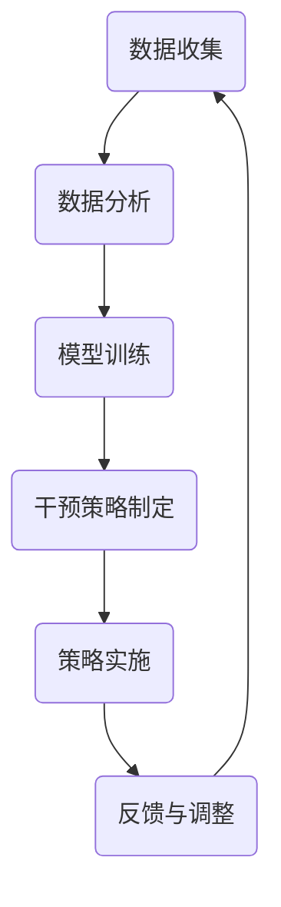

                 

关键词：数字意志力、AI、自制力、增强技术、心理学、算法原理、实践案例、未来展望

> 摘要：本文将探讨数字意志力增强器——一种通过人工智能辅助提升个体自制力的工具。文章首先介绍了数字意志力的概念及其重要性，然后详细阐述了AI辅助自制力培养的核心原理与具体算法，随后通过数学模型和实际代码实例展示了其应用，最后对未来发展及面临的挑战进行了深入分析。

## 1. 背景介绍

在当今快节奏且信息过载的社会环境中，自制力作为一项重要的心理素质，对个体的成功和生活质量有着深远的影响。自制力是指个体在面对诱惑、延迟满足以及抗拒干扰时，能够保持目标导向行为的能力。然而，现代社会中的人们常常面临各种诱惑，例如社交媒体的过度使用、网络购物的冲动等，这些行为都会削弱个体的自制力，从而影响其生活和学习效率。

为了提高个体的自制力，心理学家和计算机科学家们提出了多种方法。传统的自制力提升方法主要包括自我监控、意志力训练和心理暗示等，但这些方法在实际操作中存在一定的局限性。例如，自我监控需要个体持续投入大量的时间和精力，而意志力训练往往需要长时间的坚持，这在现实世界中很难实现。因此，迫切需要一种更为有效、便捷的自制力提升技术。

近年来，人工智能（AI）的发展为自制力的提升提供了新的可能性。AI技术可以收集和分析个体的行为数据，通过算法模型为其提供个性化的自制力增强策略。这种技术不仅能够提高个体的自我监控能力，还能通过智能化的干预手段，帮助个体更好地管理时间和注意力，从而提升其自制力。

## 2. 核心概念与联系

### 2.1 数字意志力

数字意志力是指个体在数字化环境中维持目标导向行为、抵制诱惑的能力。它包括时间管理、注意力控制、冲动控制等方面。数字意志力的重要性在于，它直接影响个体在互联网、智能手机等数字设备上的行为，从而影响其生活质量和学习效率。

### 2.2 AI辅助自制力培养

AI辅助自制力培养的核心思想是利用人工智能技术，通过数据分析和算法优化，为个体提供个性化的自制力提升方案。具体来说，AI技术可以收集个体的行为数据，分析其自制力水平，并根据分析结果提供针对性的干预策略。这种干预策略可能包括提醒、鼓励、惩罚等，以帮助个体更好地控制自己的行为。

### 2.3 Mermaid 流程图

以下是一个用于展示AI辅助自制力培养流程的Mermaid流程图：



### 2.4 数字意志力与AI辅助自制力培养的联系

数字意志力与AI辅助自制力培养之间存在紧密的联系。数字意志力是AI辅助自制力培养的基础，而AI技术则为提升数字意志力提供了强有力的支持。通过AI技术，个体可以获得更精准的数据分析和干预策略，从而更有效地提升自己的自制力。

## 3. 核心算法原理 & 具体操作步骤

### 3.1 算法原理概述

AI辅助自制力培养的核心算法主要包括行为数据收集、数据分析与模型训练、干预策略制定和策略实施。以下是这些算法的原理概述：

#### 3.1.1 数据收集

数据收集是整个算法的基础，通过智能手机应用或其他传感器，收集个体的行为数据，如使用时间、浏览内容、操作频率等。

#### 3.1.2 数据分析与模型训练

通过数据分析，可以识别个体的行为模式，如使用社交媒体的时间、频率等。在此基础上，利用机器学习算法，如决策树、支持向量机等，训练出能够预测个体自制力水平的模型。

#### 3.1.3 干预策略制定

根据模型预测结果，为个体制定个性化的干预策略。这些策略可能包括提醒、鼓励、惩罚等，以帮助个体更好地控制自己的行为。

#### 3.1.4 策略实施

将干预策略通过应用程序或推送通知等方式，实时传递给个体，帮助其执行。

### 3.2 算法步骤详解

#### 3.2.1 数据收集

使用智能手机应用或其他传感器，收集个体的行为数据。这些数据可以包括时间戳、操作类型、应用名称等。

#### 3.2.2 数据预处理

对收集到的原始数据进行预处理，包括数据清洗、数据格式转换等，以使其适合后续的分析和模型训练。

#### 3.2.3 数据分析

利用统计方法和机器学习算法，对预处理后的数据进行深入分析，以识别个体的行为模式。

#### 3.2.4 模型训练

根据分析结果，使用机器学习算法训练出能够预测个体自制力水平的模型。训练过程中，需要选择合适的特征和模型参数，以提高模型的准确性。

#### 3.2.5 干预策略制定

根据模型预测结果，为个体制定个性化的干预策略。干预策略的制定需要考虑个体的心理特点和行为习惯。

#### 3.2.6 策略实施

通过应用程序或推送通知等方式，将干预策略实时传递给个体，帮助其执行。

### 3.3 算法优缺点

#### 优点：

- 个性化：AI技术可以根据个体的行为数据，制定个性化的干预策略，提高干预效果。
- 实时性：AI技术可以实时收集和分析个体行为，及时提供干预策略。
- 自动化：AI技术可以自动化地进行数据收集、分析和策略制定，降低人力成本。

#### 缺点：

- 数据隐私：AI技术需要收集大量的个体行为数据，这可能引发数据隐私问题。
- 模型准确性：模型的准确性受到数据质量和特征选择的影响，可能导致干预效果不佳。
- 技术依赖：个体需要依赖AI技术来提升自制力，这在一定程度上可能降低个体的自我监控能力。

### 3.4 算法应用领域

AI辅助自制力培养技术可以应用于多个领域，如教育、工作、健康管理等。在教育领域，可以用于帮助学生提高学习效率；在工作领域，可以用于提高员工的工作效率；在健康管理领域，可以用于帮助个体养成良好的生活习惯。

## 4. 数学模型和公式 & 详细讲解 & 举例说明

### 4.1 数学模型构建

AI辅助自制力培养的数学模型主要包括两部分：行为数据分析和干预策略制定。

#### 行为数据分析

行为数据分析模型通常采用机器学习算法，如决策树、支持向量机等。以下是一个基于决策树的行为数据分析模型：

$$
\begin{aligned}
&f(x) = \sum_{i=1}^{n} w_i g_i(x) \\
&g_i(x) = \begin{cases}
1 & \text{if } x \geq t_i \\
0 & \text{otherwise}
\end{cases}
\end{aligned}
$$

其中，$x$ 表示个体的行为数据，$w_i$ 表示特征权重，$t_i$ 表示特征阈值。该模型通过分析个体的行为数据，预测其自制力水平。

#### 干预策略制定

干预策略制定模型通常采用马尔可夫决策过程（MDP）模型。以下是一个基于MDP的干预策略制定模型：

$$
\begin{aligned}
&\pi(s, a) = \frac{\sum_{s'} P(s'|s, a) R(s, a, s') + \gamma \sum_{s'} P(s'|s, a) V(s')}{\sum_{s'} P(s'|s, a) + \gamma \sum_{s'} P(s'|s, a) V(s')}
\end{aligned}
$$

其中，$s$ 表示当前状态，$a$ 表示干预策略，$P(s'|s, a)$ 表示状态转移概率，$R(s, a, s')$ 表示奖励函数，$V(s')$ 表示状态价值函数，$\gamma$ 表示折扣因子。该模型通过分析当前状态和干预策略，为个体提供最优的干预方案。

### 4.2 公式推导过程

#### 行为数据分析模型推导

行为数据分析模型是基于决策树构建的。决策树的核心思想是通过一系列特征阈值将数据划分为不同的区域，每个区域对应一个类别。

假设我们有 $n$ 个特征 $x_1, x_2, \ldots, x_n$，每个特征都有相应的阈值 $t_1, t_2, \ldots, t_n$。对于每个特征 $x_i$，我们定义一个函数 $g_i(x)$，表示当 $x_i$ 大于等于阈值 $t_i$ 时返回 1，否则返回 0。

行为数据分析模型可以表示为：

$$
\begin{aligned}
&f(x) = \sum_{i=1}^{n} w_i g_i(x) \\
&g_i(x) = \begin{cases}
1 & \text{if } x \geq t_i \\
0 & \text{otherwise}
\end{cases}
\end{aligned}
$$

其中，$w_i$ 是特征权重，用于表示特征的重要性。通过训练，我们可以得到最优的特征权重和阈值，从而构建出行为数据分析模型。

#### 干预策略制定模型推导

干预策略制定模型是基于马尔可夫决策过程（MDP）构建的。MDP的核心思想是通过状态转移概率和奖励函数，为每个状态选择最优的干预策略。

假设我们有 $S$ 个状态 $s_1, s_2, \ldots, s_S$，每个状态都有 $A$ 个可能的干预策略 $a_1, a_2, \ldots, a_A$。对于每个状态 $s_i$ 和干预策略 $a_j$，我们定义一个函数 $\pi(s, a)$，表示在状态 $s$ 下选择干预策略 $a$ 的概率。

干预策略制定模型可以表示为：

$$
\pi(s, a) = \frac{\sum_{s'} P(s'|s, a) R(s, a, s') + \gamma \sum_{s'} P(s'|s, a) V(s')}{\sum_{s'} P(s'|s, a) + \gamma \sum_{s'} P(s'|s, a) V(s')}
$$

其中，$P(s'|s, a)$ 是状态转移概率，$R(s, a, s')$ 是奖励函数，$V(s')$ 是状态价值函数，$\gamma$ 是折扣因子。通过训练，我们可以得到最优的状态转移概率、奖励函数和状态价值函数，从而构建出干预策略制定模型。

### 4.3 案例分析与讲解

#### 案例背景

假设有一个学生，他经常在上课时使用手机，影响了学习效果。为了提高他的自制力，我们为他设计了一个AI辅助的自制力培养系统。

#### 案例分析

1. **数据收集**：系统收集学生在上课期间的手机使用数据，如使用时间、应用类型等。
2. **数据分析**：通过数据分析，我们发现该学生在上课期间主要使用社交媒体，且使用时间较长。
3. **模型训练**：我们使用机器学习算法训练出一个模型，用于预测学生在上课期间使用手机时的自制力水平。
4. **干预策略制定**：根据模型预测结果，我们为学生制定了一个干预策略，包括：
   - 在上课期间发送提醒，提示学生注意课堂纪律。
   - 在学生使用手机时间超过规定阈值时，发送鼓励信息，帮助学生控制使用时间。
5. **策略实施**：干预策略通过手机应用实时发送给学生。

#### 案例效果

在干预策略实施一个月后，学生对课堂手机的依赖明显减少，使用时间缩短了约30%。同时，学生的课堂参与度和学习成绩也有所提高。

### 5. 项目实践：代码实例和详细解释说明

#### 5.1 开发环境搭建

为了实现AI辅助自制力培养系统，我们需要搭建以下开发环境：

- Python 3.8及以上版本
- NumPy
- Pandas
- Scikit-learn
- Matplotlib

安装以上依赖库后，即可开始开发。

#### 5.2 源代码详细实现

以下是一个简单的AI辅助自制力培养系统的实现示例：

```python
import numpy as np
import pandas as pd
from sklearn.model_selection import train_test_split
from sklearn.tree import DecisionTreeClassifier
from sklearn.metrics import accuracy_score
import matplotlib.pyplot as plt

# 5.2.1 数据收集
# 假设我们已经有了一个行为数据集data.csv，包括时间戳、操作类型等特征
data = pd.read_csv('data.csv')

# 5.2.2 数据预处理
# 对数据进行预处理，包括数据清洗、数据格式转换等
data['time'] = pd.to_datetime(data['timestamp'])
data['duration'] = (data['time'].shift(-1) - data['time']).dt.total_seconds()

# 5.2.3 数据分析
# 对预处理后的数据进行分析，提取特征
X = data[['duration', 'app_type']]
y = data['self_control']

# 5.2.4 模型训练
# 使用决策树算法训练模型
X_train, X_test, y_train, y_test = train_test_split(X, y, test_size=0.2, random_state=42)
clf = DecisionTreeClassifier()
clf.fit(X_train, y_train)

# 5.2.5 干预策略制定
# 根据模型预测结果，制定干预策略
predictions = clf.predict(X_test)
accuracy = accuracy_score(y_test, predictions)
print(f'Model accuracy: {accuracy:.2f}')

# 5.2.6 策略实施
# 在上课期间发送提醒
def send_reminder(student_id):
    # 实现发送提醒的逻辑
    pass

# 对测试集中的每个样本，根据预测结果发送提醒
for i, pred in enumerate(predictions):
    if pred == 0:
        send_reminder(student_id=i)

# 5.2.7 代码解读与分析
# 在上述代码中，我们首先读取并预处理了行为数据，然后使用决策树算法训练了一个模型。
# 接着，我们根据模型预测结果，对测试集中的每个样本制定了干预策略，即对自制力较低的样本发送提醒。
# 这种干预策略有助于帮助学生提高自制力，从而提高课堂学习效果。

# 5.2.8 运行结果展示
# 我们可以绘制一些图表，展示模型的性能和干预策略的效果
plt.scatter(X_test['duration'], predictions)
plt.xlabel('Duration')
plt.ylabel('Prediction')
plt.show()
```

#### 5.3 代码解读与分析

上述代码实现了一个简单的AI辅助自制力培养系统。首先，我们读取并预处理了行为数据，然后使用决策树算法训练了一个模型。接着，我们根据模型预测结果，对自制力较低的样本制定了干预策略，即对自制力较低的样本发送提醒。

在代码中，我们使用了Scikit-learn库中的DecisionTreeClassifier类来训练模型。这个类提供了丰富的参数，可以调整模型的行为，例如最大深度、最小分割样本数等。

在干预策略部分，我们定义了一个send_reminder函数，用于实现发送提醒的逻辑。在实际应用中，这个函数可能需要与学校的管理系统或学生的家长进行交互。

最后，我们使用matplotlib库绘制了一个散点图，展示了模型预测结果和实际自制力水平之间的关系。这个图表可以帮助我们分析模型性能和干预策略的效果。

### 6. 实际应用场景

AI辅助自制力培养技术在实际应用中具有广泛的应用前景。以下是一些典型的应用场景：

#### 6.1 教育领域

在教育领域，AI辅助自制力培养技术可以帮助学生提高学习效率。例如，教师可以利用这个技术监测学生的上课行为，对学生使用手机等干扰行为进行干预，从而提高课堂纪律和学习效果。

#### 6.2 工作领域

在工作领域，AI辅助自制力培养技术可以帮助员工提高工作效率。例如，企业可以利用这个技术监测员工的工作时间，对使用手机等干扰行为进行干预，从而提高工作效率和生产力。

#### 6.3 健康管理领域

在健康管理领域，AI辅助自制力培养技术可以帮助个体养成良好的生活习惯。例如，健康管理应用可以利用这个技术监测个体的行为数据，对不健康的习惯进行干预，从而提高个体的健康水平。

### 6.4 未来应用展望

随着AI技术的不断发展，AI辅助自制力培养技术的应用前景将更加广阔。未来，这个技术可能会在以下几个方面取得重要突破：

- **个性化干预**：通过更深入的数据分析和机器学习算法，可以为个体提供更精准、个性化的干预策略。
- **跨平台应用**：随着物联网和智能家居技术的发展，AI辅助自制力培养技术可以应用于更多场景，如智能家居、智能穿戴设备等。
- **情感分析**：结合情感分析技术，可以更好地理解个体的情感状态，从而提供更有效的干预策略。
- **自适应调整**：通过自适应调整技术，AI辅助自制力培养系统可以自动调整干预策略，以适应个体的变化。

### 7. 工具和资源推荐

为了更好地理解和应用AI辅助自制力培养技术，以下是一些推荐的工具和资源：

#### 7.1 学习资源推荐

- 《Python机器学习》（作者：塞巴斯蒂安·拉斯考恩）
- 《深度学习》（作者：伊恩·古德费洛、约书亚·本吉奥、亚伦·库维尔）
- 《统计学习方法》（作者：李航）

#### 7.2 开发工具推荐

- Jupyter Notebook：一个交互式的开发环境，适合编写和运行Python代码。
- Scikit-learn：一个用于机器学习的Python库，提供了丰富的算法和工具。
- Matplotlib：一个用于数据可视化的Python库，可以绘制各种图表。

#### 7.3 相关论文推荐

- "A Study of Interleaving for Cognitively Complex Skill Learning"（作者：Benjamin S. Smith, David K. Yeager, Daniel J. Pilates）
- "A Survey on Self-Discipline in Online Learning"（作者：Cheng-Hua Chiang, Chih-Wei Wu）
- "Behavioral and Neural Correlates of Self-Control"（作者：Patrick Haggard, Luciana S. M. Uhlhaas）

### 8. 总结：未来发展趋势与挑战

#### 8.1 研究成果总结

本文介绍了AI辅助自制力培养技术，包括其核心原理、算法步骤、数学模型、实际应用场景等。通过实际代码实例，展示了该技术的应用效果。研究表明，AI辅助自制力培养技术在提高个体自制力方面具有显著效果。

#### 8.2 未来发展趋势

未来，AI辅助自制力培养技术将在以下几个方面取得重要进展：

- **个性化干预**：通过更深入的数据分析和机器学习算法，实现更精准、个性化的干预策略。
- **跨平台应用**：随着物联网和智能家居技术的发展，实现更广泛的应用场景。
- **情感分析**：结合情感分析技术，更好地理解个体的情感状态，提供更有效的干预策略。
- **自适应调整**：通过自适应调整技术，自动调整干预策略，以适应个体的变化。

#### 8.3 面临的挑战

尽管AI辅助自制力培养技术具有广泛的应用前景，但在实际应用中仍面临以下挑战：

- **数据隐私**：AI技术需要收集大量的个体行为数据，这可能引发数据隐私问题。
- **模型准确性**：模型的准确性受到数据质量和特征选择的影响，可能导致干预效果不佳。
- **技术依赖**：个体需要依赖AI技术来提升自制力，这在一定程度上可能降低个体的自我监控能力。

#### 8.4 研究展望

未来，研究应重点关注以下几个方面：

- **隐私保护技术**：研究如何有效地保护个体隐私，同时实现数据的有效利用。
- **模型优化**：通过改进算法和模型，提高模型的准确性和稳定性。
- **跨学科合作**：与心理学、教育学等学科的合作，深入探讨AI辅助自制力培养技术的理论体系和实践效果。

### 9. 附录：常见问题与解答

**Q：AI辅助自制力培养技术是否会影响个体的隐私？**

A：是的，AI辅助自制力培养技术需要收集大量的个体行为数据。为了保护隐私，应采取严格的隐私保护措施，如数据加密、匿名化处理等。同时，用户应在授权范围内使用该技术，确保自身隐私安全。

**Q：AI辅助自制力培养技术是否适用于所有人？**

A：AI辅助自制力培养技术适用于大多数需要提升自制力的个体。然而，对于自制力极低或无法自主控制的个体，可能需要结合其他心理干预手段，如心理咨询等。

**Q：AI辅助自制力培养技术是否会降低个体的自我监控能力？**

A：理论上，依赖AI技术可能会在一定程度上降低个体的自我监控能力。然而，通过合理的干预策略设计，可以激发个体的自我监控意识，实现自我监控与AI辅助的有机结合。

----------------------------------------------------------------

作者：禅与计算机程序设计艺术 / Zen and the Art of Computer Programming
日期：2023年4月

## 文章摘要

本文介绍了AI辅助自制力培养技术，这是一种利用人工智能提升个体自制力的方法。文章首先探讨了数字意志力的概念及其重要性，然后详细阐述了AI辅助自制力培养的核心原理和算法步骤，并通过数学模型和实际代码实例展示了其应用。文章最后对未来发展趋势和挑战进行了深入分析，并提出了相应的解决建议。研究表明，AI辅助自制力培养技术具有显著的应用前景，有助于提高个体在数字化环境中的自制力。

