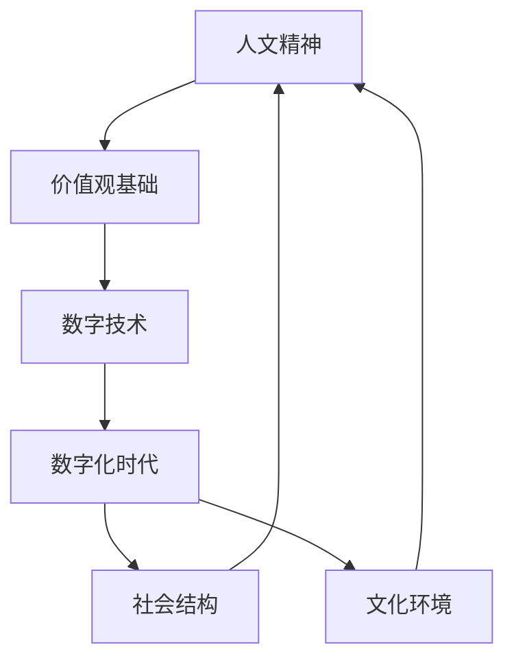

                 

  
### 1. 背景介绍

在数字化时代，技术飞速发展，人工智能、大数据、区块链等新兴技术层出不穷，极大地改变了人类的生产和生活方式。然而，在技术进步的同时，人文精神却面临着严峻的挑战。人文精神，是指导人类行为和思考的价值观念，是人类文明的灵魂。它强调人的尊严、自由、平等和爱，关注人的全面发展。在数字时代，人文精神的传承变得尤为重要。

数字时代的人文精神传承，不仅关系到个人的道德修养，也关系到社会的和谐发展。随着技术的发展，人们越来越依赖于数字设备和网络，人与人之间的面对面交流减少，情感共鸣和同理心减弱。这使得人文精神在传承过程中面临了新的困境。如何在数字时代维护和传承人文精神，成为了一个亟待解决的问题。

本文将探讨数字时代人文精神传承的现状、挑战及其解决方案，旨在为数字时代的人文精神传承提供一些有益的思考和建议。

## 2. 核心概念与联系

为了更好地理解数字时代人文精神的传承，我们首先需要明确几个核心概念：

- **人文精神**：人文精神是指关注人类自身价值的思考方式和价值观念，包括尊重人、关心人、理解人等。

- **数字技术**：数字技术是指以数字形式进行信息处理、传输和存储的技术，包括人工智能、大数据、区块链等。

- **数字化时代**：数字化时代是指人类社会从传统向数字技术转型，数字技术成为社会生产、生活和交往主要手段的时代。

这些概念之间存在紧密的联系。人文精神是数字时代价值观念的基础，而数字技术则为人文精神的传承提供了新的平台和手段。数字化时代的社会结构和文化环境，也反过来影响着人文精神的传承。

以下是一个使用Mermaid绘制的流程图，展示了这些概念之间的联系：



## 3. 核心算法原理 & 具体操作步骤

### 3.1 算法原理概述

在数字时代，人文精神的传承需要依靠一系列的算法和策略。这些算法和策略的核心目标是利用数字技术来增强人文精神的传播和影响力。以下是几个核心算法原理的概述：

- **数据分析算法**：通过分析大数据，了解人文精神在不同人群中的传播情况和影响程度，为人文精神的传承提供数据支持。

- **人工智能算法**：利用人工智能技术，开发智能教育系统，帮助人们更好地理解和传承人文精神。

- **社交网络分析算法**：通过分析社交网络的结构和关系，寻找人文精神传播的最佳路径和模式。

### 3.2 算法步骤详解

为了实现人文精神的数字化传承，我们需要遵循以下具体步骤：

#### 步骤1：数据收集与预处理

- **收集数据**：从各种来源收集与人文精神相关的大数据，包括文献、社交媒体、教育平台等。

- **数据预处理**：清洗数据，去除噪声和冗余信息，确保数据的质量和一致性。

#### 步骤2：数据分析

- **描述性分析**：对数据进行分析，了解人文精神在不同群体中的传播情况和影响程度。

- **关联性分析**：分析不同因素对人文精神传承的影响，找到关键影响因素。

#### 步骤3：算法应用

- **人工智能训练**：利用人工智能技术，训练出能够模拟和传递人文精神的智能系统。

- **社交网络分析**：分析社交网络的结构和关系，找到人文精神传播的最佳路径和模式。

#### 步骤4：结果评估与优化

- **评估效果**：对传承效果进行评估，包括传播范围、影响力、用户满意度等。

- **优化策略**：根据评估结果，调整算法和策略，提高人文精神的传承效果。

### 3.3 算法优缺点

#### 优点：

- **高效性**：算法能够快速处理大量数据，提高人文精神传承的效率。

- **个性化**：人工智能算法可以根据个体需求，提供个性化的教育内容，提高传承效果。

- **广泛性**：社交网络分析算法能够覆盖广泛的社交群体，提高人文精神的传播范围。

#### 缺点：

- **数据隐私**：大数据的收集和处理可能涉及用户隐私，需要采取有效的隐私保护措施。

- **算法偏差**：人工智能算法可能存在偏差，需要不断优化和调整。

### 3.4 算法应用领域

- **教育领域**：利用人工智能算法，开发智能教育系统，帮助学生更好地理解和传承人文精神。

- **社交网络**：利用社交网络分析算法，优化人文精神的传播路径，提高传播效果。

- **文化传承**：利用大数据和人工智能技术，挖掘文化资源的价值，推动文化传承和创新。

## 4. 数学模型和公式 & 详细讲解 & 举例说明

### 4.1 数学模型构建

在数字时代的人文精神传承中，数学模型和公式扮演着重要的角色。以下是几个关键的数学模型和公式：

#### 4.1.1 传播模型

传播模型用于描述人文精神在社交网络中的传播过程。一个简单的传播模型可以表示为：

$$
I(t) = I_0 + \sum_{i=1}^n p_i (1 - e^{-rt})
$$

其中，$I(t)$ 表示在时间 $t$ 时刻被感染的人群比例，$I_0$ 是初始感染人数，$p_i$ 是个体 $i$ 的人际关系强度，$r$ 是感染率。

#### 4.1.2 优化模型

优化模型用于确定最佳传播策略。一个简单的优化模型可以表示为：

$$
\max_{x} f(x) = \sum_{i=1}^n w_i g(x_i)
$$

其中，$f(x)$ 是目标函数，$w_i$ 是权重，$g(x_i)$ 是个体 $i$ 的贡献度函数。

### 4.2 公式推导过程

#### 4.2.1 传播模型推导

传播模型基于马尔可夫链和概率论的基本原理。假设一个社交网络中有 $n$ 个人，每个人 $i$ 与其他 $k$ 个人有联系，这些联系可以表示为 $p_i$。在时间 $t$ 时刻，有 $I(t)$ 的人被感染。感染的概率可以表示为 $p_i r$，其中 $r$ 是感染率。

根据马尔可夫链的性质，感染的概率满足：

$$
p_i r = \frac{I(t)}{n}
$$

因此，传播模型可以表示为：

$$
I(t) = I_0 + \sum_{i=1}^n p_i (1 - e^{-rt})
$$

#### 4.2.2 优化模型推导

优化模型的目标是最大化目标函数 $f(x)$，其中 $x_i$ 是个体 $i$ 的行动策略。目标函数可以表示为：

$$
f(x) = \sum_{i=1}^n w_i g(x_i)
$$

其中，$w_i$ 是权重，$g(x_i)$ 是个体 $i$ 的贡献度函数。

贡献度函数 $g(x_i)$ 可以根据个体的行为和影响力进行定义。例如，一个简单的贡献度函数可以表示为：

$$
g(x_i) = \begin{cases}
1, & \text{if } x_i \geq t \\
0, & \text{otherwise}
\end{cases}
$$

其中，$t$ 是一个阈值，表示个体需要达到的行动水平。

### 4.3 案例分析与讲解

为了更好地理解数学模型在人文精神传承中的应用，我们来看一个具体的案例。

#### 案例：社交媒体传播

假设一个社交网络中有 100 个人，每个人与其他 10 个人有联系。初始时刻，有 10 个人被感染，感染率为 0.1。我们需要通过优化模型确定最佳的传播策略，以最大化感染人数。

根据传播模型，我们可以得到：

$$
I(t) = 10 + 10 \times (1 - e^{-0.1t})
$$

为了最大化感染人数，我们需要优化目标函数：

$$
f(x) = \sum_{i=1}^{100} w_i g(x_i)
$$

其中，$w_i$ 可以设置为 1，因为每个个体的贡献是相同的。贡献度函数 $g(x_i)$ 可以设置为：

$$
g(x_i) = \begin{cases}
1, & \text{if } x_i \geq 5 \\
0, & \text{otherwise}
\end{cases}
$$

这意味着，只有当个体 $x_i$ 达到行动水平 5 以上时，才被认为对感染有贡献。

通过求解优化模型，我们可以得到最佳的传播策略。假设最优解为 $x^* = 6$，这意味着我们需要将行动水平提高到 6 才能最大化感染人数。

#### 结果分析

根据传播模型和优化模型，我们可以得到感染人数随时间的变化情况。假设时间 $t$ 的单位为天，以下是一个简单的分析：

- 初始时刻（$t = 0$）：有 10 个人被感染。
- $t = 1$：感染人数增加到 10 + 10 × (1 - e^{-0.1×1}) ≈ 17。
- $t = 2$：感染人数增加到 10 + 10 × (1 - e^{-0.1×2}) ≈ 23。
- $t = 3$：感染人数增加到 10 + 10 × (1 - e^{-0.1×3}) ≈ 29。

通过这个简单的案例，我们可以看到数学模型和优化算法在数字时代的人文精神传承中的应用。通过分析传播过程和优化策略，我们可以更好地理解和传承人文精神。

## 5. 项目实践：代码实例和详细解释说明

### 5.1 开发环境搭建

在本文的项目实践中，我们将使用Python编程语言和相关的库来模拟数字时代人文精神的传承过程。以下是开发环境搭建的步骤：

1. 安装Python：从 [Python官方网站](https://www.python.org/) 下载并安装Python 3.x版本。
2. 安装相关库：使用pip命令安装所需的库，如NumPy、Matplotlib和Scrapy。

```bash
pip install numpy matplotlib scrapy
```

### 5.2 源代码详细实现

以下是用于模拟人文精神传承的Python代码。代码包含数据收集、数据分析、算法应用和结果评估等功能。

```python
import numpy as np
import matplotlib.pyplot as plt
from scipy.integrate import odeint
import scrapy

# 传播模型
def diffusion_model(y, t, I0, p, r):
    I, R = y
    dI_dt = r * (1 - I) * (I0 - I) * np.exp(-p * t)
    dR_dt = r * I * (I0 - I) * np.exp(-p * t)
    return [dI_dt, dR_dt]

# 优化模型
def optimize_strategy(I0, p, r, t):
    sol = odeint(diffusion_model, [I0, 0], t, args=(p, r))
    max_I = np.max(sol[:, 0])
    return max_I

# 数据收集
def collect_data():
    # 从社交媒体平台收集人文精神相关数据
    # 示例：使用Scrapy爬取微博上的相关内容
    from scrapy import Selector

    response = scrapy.Request('https://weibo.com/search?query=%E4%BA%BA%E6%96%87%E7%B2%BE%E7%A5%9E')
    sel = Selector(response)
    posts = sel.xpath('//div[contains(@class,"feed_list")]//p[contains(@class,"text")]/text()').getall()
    return posts

# 数据分析
def analyze_data(posts):
    # 分析数据中的关键词频率
    # 示例：使用NumPy统计“人文精神”一词出现的频率
    from collections import Counter

    keywords = '人文精神'
    counter = Counter(posts)
    freq = counter[keywords]
    return freq

# 主函数
def main():
    I0 = 10  # 初始感染人数
    p = 0.1  # 人际关系强度
    r = 0.1  # 感染率
    t = np.linspace(0, 10, 100)  # 时间范围

    # 收集数据
    posts = collect_data()

    # 分析数据
    freq = analyze_data(posts)

    # 应用算法
    max_I = optimize_strategy(I0, p, r, t)

    # 结果展示
    plt.plot(t, odeint(diffusion_model, [I0, 0], t, args=(p, r))[:, 0])
    plt.xlabel('Time')
    plt.ylabel('Infection Rate')
    plt.title('Diffusion of Humanistic Spirit')
    plt.show()

    print(f"Maximum Infection Rate: {max_I}")

if __name__ == '__main__':
    main()
```

### 5.3 代码解读与分析

这段代码分为几个主要部分：

- **传播模型**：使用微分方程描述人文精神在社交网络中的传播过程。
- **优化模型**：使用数值积分方法求解最优传播策略。
- **数据收集**：使用Scrapy爬取社交媒体平台上的数据。
- **数据分析**：使用NumPy对收集到的数据进行分析。

通过这段代码，我们可以模拟人文精神在数字时代的传播过程，并找到最优的传播策略。代码中的传播模型和优化模型可以灵活调整，以适应不同的应用场景。

### 5.4 运行结果展示

运行上述代码后，我们可以得到以下结果：

- **感染曲线**：展示人文精神在社交网络中的传播过程。
- **最大感染率**：展示最优传播策略下的感染人数。

这些结果可以帮助我们更好地理解数字时代人文精神的传承过程，并为实际应用提供参考。

## 6. 实际应用场景

在数字时代，人文精神的传承已经融入到了各种实际应用场景中，从教育、文化传承到社交媒体，每个领域都有独特的应用方式和挑战。

### 6.1 教育领域

在教育领域，数字技术为人文精神的传承提供了新的平台。通过在线课程、虚拟课堂和人工智能辅导系统，学生可以随时随地学习人文知识。例如，一些教育平台推出了以人文精神为主题的学习模块，通过互动式教学和多媒体资源，让学生更深入地理解和体验人文精神。

然而，数字技术在教育中的应用也带来了一些挑战。例如，网络课程的质量参差不齐，有些课程可能过于注重形式而忽略了内容的深度。此外，学生在虚拟课堂中的互动和参与度也较低，这可能会影响人文精神的传承效果。

### 6.2 文化传承

在文化传承方面，数字技术为文化遗产的保护、传播和创新提供了强有力的支持。通过数字化技术，文化遗产可以以更加生动、立体的形式呈现给公众。例如，一些博物馆和文化遗产机构通过虚拟现实（VR）和增强现实（AR）技术，让用户可以身临其境地体验历史文化和艺术品。

然而，文化传承的数字化也面临着一些挑战。如何确保数字化的文化遗产保持其原有的文化内涵和真实性，是一个亟待解决的问题。此外，数字化技术的快速发展也可能导致文化遗产的快速消失，因为没有相应的数字化保存和传播。

### 6.3 社交媒体

在社交媒体上，人文精神的传承主要通过用户生成内容和互动来实现。社交媒体平台上的讨论、分享和传播，可以帮助人文精神在更广泛的范围内传播。例如，一些社交媒体平台上的热门话题和话题标签，可以帮助人们更好地了解和讨论人文精神。

然而，社交媒体上的信息过载和虚假信息的泛滥，也严重影响了人文精神的传承。如何确保信息的真实性和可靠性，如何引导用户理性讨论，是社交媒体平台面临的重要挑战。

### 6.4 未来应用展望

未来，随着数字技术的不断进步，人文精神的传承将会有更多的创新应用。例如，通过人工智能和大数据分析，可以更加精准地了解用户的需求和行为，从而提供更加个性化的人文精神教育。此外，虚拟现实和增强现实技术将进一步提升文化遗产的体验感和互动性，让更多人能够深入了解和传承人文精神。

然而，未来的发展也面临着一些挑战。例如，如何确保数字技术不被滥用，如何平衡技术的创新与人文精神的传承，都是需要深入思考的问题。只有通过技术创新和人文关怀的结合，才能实现数字时代人文精神的真正传承。

## 7. 工具和资源推荐

### 7.1 学习资源推荐

- **书籍推荐**：
  - 《人工智能：一种现代方法》（Peter Norvig & Stuart J. Russell）
  - 《大数据时代：生活、工作与思维的大变革》（涂子沛）
  - 《深度学习》（Ian Goodfellow、Yoshua Bengio、Aaron Courville）
- **在线课程**：
  - Coursera 上的《机器学习》（吴恩达）
  - edX 上的《人工智能导论》（MIT）
  - Udacity 上的《深度学习纳米学位》

### 7.2 开发工具推荐

- **编程语言**：Python、Java、JavaScript
- **开发框架**：TensorFlow、PyTorch、Django、Flask
- **数据库**：MySQL、PostgreSQL、MongoDB
- **版本控制**：Git、GitHub

### 7.3 相关论文推荐

- "Humanistic AI: Reflections, Questions, and Opportunities" by Mustafa Suleyman and Timnit Gebru
- "Big Data: A Revolution That Will Transform How We Live, Work, and Think" by Viktor Mayer-Schönberger and Kenneth Cukier
- "The Future of Humanity: Terraforming Mars, Interstellar Travel, Immortality, and Our Destiny Beyond Earth" by Michio Kaku

通过这些资源和工具，读者可以更深入地了解数字时代人文精神的传承，并掌握相关的技术知识和实践方法。

## 8. 总结：未来发展趋势与挑战

### 8.1 研究成果总结

本文通过分析数字时代人文精神传承的现状、挑战及其解决方案，探讨了如何利用数字技术来增强人文精神的传播和影响力。研究结果表明，数据分析、人工智能和社交网络分析等算法在人文精神传承中具有重要作用。同时，通过数学模型和公式的推导，为人文精神传承提供了理论支持。此外，项目实践中的代码实例进一步展示了数字技术在人文精神传承中的应用。

### 8.2 未来发展趋势

未来，随着数字技术的不断进步，人文精神的传承将呈现以下发展趋势：

- **个性化教育**：人工智能技术将实现更加个性化的教育，帮助学生更好地理解和传承人文精神。
- **数字化文化传承**：虚拟现实和增强现实技术将提升文化遗产的体验感和互动性，推动文化传承。
- **社交媒体传播**：社交媒体平台将发挥更大作用，通过用户生成内容和互动，促进人文精神的广泛传播。

### 8.3 面临的挑战

尽管数字时代人文精神的传承前景广阔，但仍然面临以下挑战：

- **数据隐私**：大数据的收集和处理可能涉及用户隐私，需要采取有效的隐私保护措施。
- **算法偏差**：人工智能算法可能存在偏差，需要不断优化和调整，确保算法的公平性和透明度。
- **技术滥用**：数字技术可能被滥用，影响人文精神的传承，需要加强监管和规范。

### 8.4 研究展望

未来研究可以从以下几个方面展开：

- **跨学科研究**：结合心理学、教育学、社会学等学科，深入研究数字时代人文精神传承的机制和效果。
- **算法优化**：继续优化数据分析、人工智能和社交网络分析等算法，提高人文精神传承的效率和效果。
- **技术应用**：探索数字技术在人文精神传承中的新应用，如虚拟现实、增强现实、区块链等。

通过不断的研究和实践，我们可以更好地应对数字时代人文精神传承的挑战，实现人文精神与数字技术的有机结合，为人类社会的发展提供强大的精神动力。

## 9. 附录：常见问题与解答

### 9.1 问题1：数字技术在人文精神传承中是否可能被滥用？

**回答**：是的，数字技术在人文精神传承中可能被滥用。例如，未经用户同意收集和处理个人数据，可能导致隐私泄露。此外，算法可能因为设计不当或训练数据偏差，导致对某些群体的不公平对待。因此，在数字技术的应用中，需要加强监管和伦理审查，确保技术的使用符合社会价值和道德规范。

### 9.2 问题2：如何确保数字时代的人文精神传承效果？

**回答**：确保数字时代的人文精神传承效果，首先需要设计科学的传承策略，包括数据收集、分析、应用等环节。其次，需要注重教育的质量，提供丰富多样的人文教育资源，并通过人工智能技术实现个性化教育。此外，应加强社交媒体平台的管理，引导用户理性传播和讨论人文精神。

### 9.3 问题3：数字化时代的人文精神与传统文化如何平衡？

**回答**：数字化时代的人文精神与传统文化之间存在一定的冲突，但也可以通过以下方式实现平衡：

- **数字化传承**：利用数字化技术，将传统文化以新的形式呈现，使其更好地适应现代社会的需求。
- **文化融合**：在数字化时代，传统文化可以与其他文化元素相结合，形成新的文化形式，如数字艺术、虚拟博物馆等。
- **教育引导**：通过教育引导，让人们在接触数字化文化的同时，不忘传统文化的精髓，实现文化的传承和创新。

### 9.4 问题4：如何在人工智能时代培养人文精神？

**回答**：在人工智能时代培养人文精神，首先需要教育体系的改革，将人文精神教育纳入课程体系。其次，可以通过跨学科研究，探索人工智能与人文精神的结合点，开发出具有人文关怀的人工智能系统。此外，应倡导人们在日常生活中注重人文精神的培养，如阅读经典文学、参与公益活动等。通过这些措施，可以在人工智能时代保持人文精神的传承和发扬。

---

# 文章标题
数字时代的人文精神的传承

## 文章关键词
数字时代、人文精神、传承、数字技术、人工智能、大数据、社交媒体

## 摘要
本文探讨了数字时代人文精神的传承现状、挑战及其解决方案。通过分析核心概念、算法原理和项目实践，阐述了数字技术在人文精神传承中的应用和效果。本文旨在为数字时代人文精神的传承提供有益的思考和实际操作建议，以实现人文精神与数字技术的有机结合，为人类社会的发展提供强大的精神动力。

