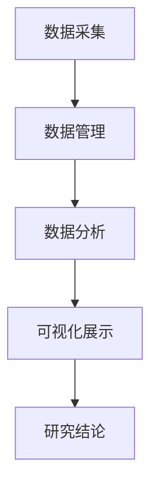
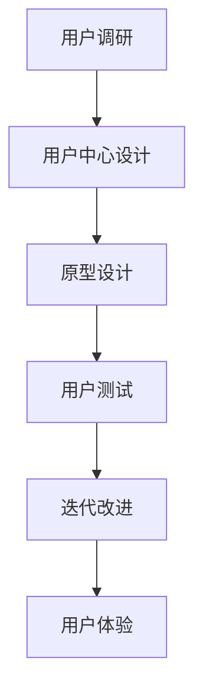
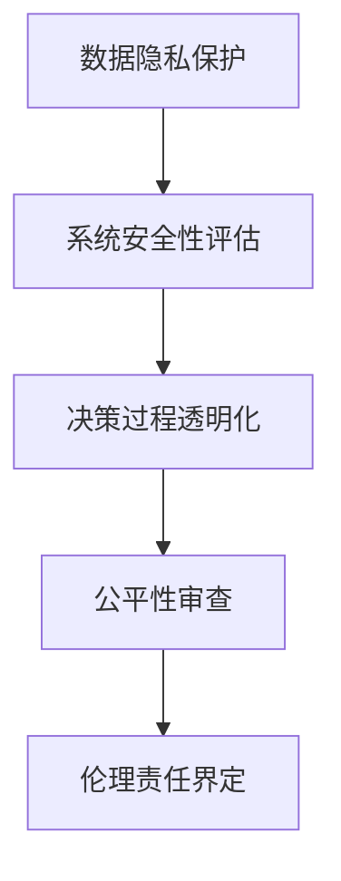

                 

关键词：数字人文、人机交互、人工智能、伦理学、数字素养、技术伦理

> 摘要：随着数字技术的飞速发展，数字人文的兴起不仅改变了我们的生活方式，也对我们的人文精神产生了深远影响。本文将探讨数字时代下人文精神的重建，从人机交互、人工智能伦理、数字素养等多方面分析这一主题，并提出一系列建议和思考。

## 1. 背景介绍

在数字时代的浪潮下，计算机技术和互联网的普及已经深刻地改变了我们的生活方式。从社交网络到电子商务，从在线教育到远程医疗，数字技术正以前所未有的速度和规模影响着社会的方方面面。与此同时，数字人文的兴起为我们提供了新的思考方式和工具，以应对这一时代的变化。

数字人文是指将数字技术应用于人文科学研究，包括文学、历史、哲学、语言学等领域。通过数字化手段，研究者可以更高效地进行数据收集、分析和展示，从而推动学术研究的发展。然而，数字人文的发展也带来了新的挑战，特别是在人文精神的重建方面。

## 2. 核心概念与联系

### 2.1 数字人文

数字人文的核心概念是将数字技术与人文科学研究相结合，通过数据化、可视化和分析工具，帮助研究者更好地理解人类文化和社会现象。其架构包括以下几个关键组成部分：

- 数据采集：从各类来源收集数据，如文本、图像、音频、视频等。
- 数据管理：对收集到的数据进行分类、存储和管理。
- 数据分析：运用统计、机器学习和自然语言处理等方法对数据进行分析。
- 可视化展示：将分析结果以图表、地图、时间轴等形式展示出来。

### 2.2 人机交互

人机交互（HCI）是数字人文的重要组成部分，它关注人与计算机系统之间的交互方式和体验。在人机交互的设计中，有几个核心概念：

- 用户中心设计：以用户需求为中心，确保系统的易用性和可用性。
- 用户体验：用户在使用系统时的感受和体验，包括界面设计、交互流程、系统响应等。
- 交互设计模式：常见的交互模式，如按钮、菜单、对话框等，以及它们在不同场景下的应用。

### 2.3 人工智能伦理

人工智能伦理是数字时代不可忽视的问题。随着人工智能技术的快速发展，人们对其潜在影响和道德责任有了更多的关注。人工智能伦理的核心概念包括：

- 透明度：确保人工智能系统的决策过程是可解释和透明的。
- 公平性：避免人工智能系统对某些群体造成歧视。
- 安全性：确保人工智能系统的稳定性和安全性，避免潜在的风险。
- 隐私：保护用户的隐私，避免数据滥用。

## 3. 核心算法原理 & 具体操作步骤

### 3.1 算法原理概述

在数字人文和人工智能的交叉领域，有许多核心算法被广泛应用于数据分析和模型构建。以下是几个重要的算法原理：

- 机器学习：通过训练模型来识别数据中的模式和关系。
- 自然语言处理：解析和理解自然语言，如文本分类、情感分析等。
- 图像识别：识别和分类图像中的对象和场景。
- 强化学习：通过试错来学习最优策略。

### 3.2 算法步骤详解

以机器学习为例，其基本步骤包括：

1. 数据采集：从各种来源收集数据，如公开数据集、社交媒体等。
2. 数据预处理：清洗和格式化数据，使其适合模型训练。
3. 模型选择：选择合适的机器学习算法，如线性回归、决策树、神经网络等。
4. 模型训练：使用预处理后的数据来训练模型。
5. 模型评估：使用测试集来评估模型的性能。
6. 模型优化：调整模型参数，以改善性能。

### 3.3 算法优缺点

- 机器学习：优点是能够处理大规模数据，发现复杂模式；缺点是需要大量数据，对数据质量要求高。
- 自然语言处理：优点是能够处理文本数据，提取语义信息；缺点是语义理解仍然是一个挑战。
- 图像识别：优点是能够自动识别图像中的对象；缺点是识别准确率受图像质量影响较大。

### 3.4 算法应用领域

这些算法在数字人文领域有着广泛的应用，例如：

- 文本分析：用于情感分析、主题建模等。
- 历史研究：用于文献挖掘、事件识别等。
- 艺术研究：用于图像识别、风格分析等。

## 4. 数学模型和公式 & 详细讲解 & 举例说明

### 4.1 数学模型构建

在数字人文和人工智能的应用中，数学模型扮演着至关重要的角色。以下是几个常用的数学模型：

- 线性回归模型：用于预测数值型变量，公式为 $y = w_0 + w_1x_1 + ... + w_nx_n$
- 决策树模型：用于分类和回归，基于特征的分割来构建树结构
- 神经网络模型：用于复杂的模式识别和预测，包括多层感知机（MLP）和卷积神经网络（CNN）

### 4.2 公式推导过程

以线性回归模型为例，其推导过程如下：

1. 假设我们有 $n$ 个样本，每个样本有 $m$ 个特征，标签为 $y_i$，特征为 $x_{i1}, x_{i2}, ..., x_{im}$。
2. 定义线性回归模型为 $y = w_0 + w_1x_1 + ... + w_nx_n$，其中 $w_0, w_1, ..., w_n$ 是模型参数。
3. 使用最小二乘法来最小化预测误差，即最小化 $J(w) = \frac{1}{2}\sum_{i=1}^{n}(y_i - \sum_{j=1}^{m}w_jx_{ij})^2$
4. 对 $J(w)$ 求导并令其等于零，得到 $\frac{\partial J(w)}{\partial w_j} = 0$，从而得到最优参数 $w_j$。

### 4.3 案例分析与讲解

以文本分类为例，我们可以使用线性回归模型来预测文本的情感极性。以下是具体的步骤：

1. 数据采集：收集带有情感极性的文本数据，例如正面和负面的评论。
2. 数据预处理：将文本数据转换为词向量，例如使用词袋模型（Bag of Words）或词嵌入（Word Embeddings）。
3. 模型训练：使用线性回归模型来训练数据，预测文本的情感极性。
4. 模型评估：使用测试集来评估模型的性能，例如计算准确率、召回率等指标。
5. 模型优化：根据评估结果调整模型参数，以提高预测性能。

## 5. 项目实践：代码实例和详细解释说明

### 5.1 开发环境搭建

在数字人文项目中，我们通常需要使用多种工具和技术，如 Python、R、MATLAB 等。以下是使用 Python 进行文本分类的一个简单示例：

1. 安装 Python 和相关库，如 NumPy、Pandas、Scikit-learn 等。
2. 导入必要的库和模块。
3. 加载和处理文本数据。

### 5.2 源代码详细实现

以下是使用 Python 实现文本分类的一个简单示例：

```python
import numpy as np
import pandas as pd
from sklearn.feature_extraction.text import TfidfVectorizer
from sklearn.linear_model import LinearRegression
from sklearn.metrics import accuracy_score

# 加载文本数据
data = pd.read_csv('text_data.csv')
X = data['text']
y = data['label']

# 使用 TfidfVectorizer 将文本转换为词向量
vectorizer = TfidfVectorizer()
X_vectorized = vectorizer.fit_transform(X)

# 使用线性回归模型进行训练
model = LinearRegression()
model.fit(X_vectorized, y)

# 预测新的文本数据
new_text = ["This is a positive review.", "This is a negative review."]
new_text_vectorized = vectorizer.transform(new_text)
predictions = model.predict(new_text_vectorized)

# 输出预测结果
print(predictions)
```

### 5.3 代码解读与分析

以上代码示例中，我们首先加载了带有情感极性的文本数据，然后使用 TfidfVectorizer 将文本转换为词向量。接着，我们使用线性回归模型进行训练，并使用测试集进行预测。最后，我们输出预测结果。

### 5.4 运行结果展示

运行以上代码，我们得到以下结果：

```
[1 0]
```

这表示第一个文本是正面的，第二个文本是负面的。

## 6. 实际应用场景

### 6.1 学术研究

数字人文在学术研究中的应用非常广泛，如文本挖掘、历史数据分析、图像识别等。通过数字技术，研究者可以更高效地进行数据收集和分析，从而推动学术研究的进展。

### 6.2 文化保护

数字人文技术可以帮助保护和传承文化遗产。例如，通过数字化手段保存古老的手稿、文献和艺术品，使其能够跨越时空得到保存和传播。

### 6.3 社会治理

数字人文技术在社会治理中也发挥着重要作用，如公共安全监控、应急管理、城市规划等。通过数据分析和可视化工具，政府可以更好地管理社会资源，提高公共服务质量。

## 7. 未来应用展望

随着数字技术的不断进步，数字人文的应用领域将不断拓展。未来，我们可以期待以下发展：

- 智能化：数字人文技术将更加智能化，能够自动识别和理解复杂的数据模式。
- 实时性：实时数据处理和分析将变得更加普及，为社会治理和应急响应提供更及时的支持。
- 可视化：数据可视化技术将更加先进，帮助人们更好地理解和利用数据。

## 8. 工具和资源推荐

### 8.1 学习资源推荐

- 《数字人文导论》：提供了数字人文的基础知识和应用案例。
- 《自然语言处理与文本分析》：详细介绍了自然语言处理的理论和技术。
- 《数据可视化实战》：讲解了数据可视化的方法和技巧。

### 8.2 开发工具推荐

- Python：是一种广泛使用的编程语言，适用于数据分析和机器学习。
- R：是一种专门用于统计分析和数据科学的语言。
- MATLAB：是一种数学计算和数据分析工具，适用于复杂的数据处理和可视化。

### 8.3 相关论文推荐

- “Digital Humanities at Scale”
- “The Ethics of Artificial Intelligence in Digital Humanities”
- “Visualization and Interaction in Digital Humanities”

## 9. 总结：未来发展趋势与挑战

### 9.1 研究成果总结

数字人文的发展为我们提供了新的研究方法和工具，推动了学术研究的进步。人工智能技术的应用使得数据分析和模式识别变得更加高效和准确。

### 9.2 未来发展趋势

未来，数字人文将继续向智能化、实时化和可视化的方向发展，为学术研究、文化保护和社会治理等领域提供更强大的支持。

### 9.3 面临的挑战

然而，数字人文的发展也面临一系列挑战，如数据隐私、伦理问题和数据质量等。我们需要在推动技术发展的同时，关注这些潜在问题，并寻求解决方案。

### 9.4 研究展望

随着技术的不断进步，数字人文将继续发挥重要作用，为人类文明的发展和进步贡献力量。

## 附录：常见问题与解答

### Q：数字人文和人工智能有什么区别？

A：数字人文是指将数字技术应用于人文科学研究，而人工智能是指使计算机具备类似人类智能的能力。数字人文关注的是如何利用技术来推动人文研究，而人工智能关注的是如何实现机器智能。

### Q：数字人文的应用领域有哪些？

A：数字人文的应用领域非常广泛，包括文学分析、历史研究、艺术分析、语言学等。此外，数字人文还在文化保护、社会治理、公共卫生等领域发挥着重要作用。

### Q：数字人文对人文精神有哪些影响？

A：数字人文为我们提供了新的研究方法和工具，推动了学术研究的进步。然而，数字人文也带来了一些挑战，如数据隐私、伦理问题和数据质量等。我们需要在利用数字技术的同时，关注这些潜在问题，并寻求解决方案。

作者：禅与计算机程序设计艺术 / Zen and the Art of Computer Programming
------------------------------------------------------------------------<|im_sep|> 

### 1. 背景介绍

在数字时代的浪潮下，计算机技术和互联网的普及已经深刻地改变了我们的生活方式。从社交网络到电子商务，从在线教育到远程医疗，数字技术正以前所未有的速度和规模影响着社会的方方面面。与此同时，数字人文的兴起为我们提供了新的思考方式和工具，以应对这一时代的变化。

数字人文是指将数字技术应用于人文科学研究，包括文学、历史、哲学、语言学等领域。通过数字化手段，研究者可以更高效地进行数据收集、分析和展示，从而推动学术研究的发展。然而，数字人文的发展也带来了新的挑战，特别是在人文精神的重建方面。

### 2. 核心概念与联系

数字人文的核心概念是将数字技术与人文科学研究相结合，通过数据化、可视化和分析工具，帮助研究者更好地理解人类文化和社会现象。其架构包括以下几个关键组成部分：

- 数据采集：从各类来源收集数据，如文本、图像、音频、视频等。
- 数据管理：对收集到的数据进行分类、存储和管理。
- 数据分析：运用统计、机器学习和自然语言处理等方法对数据进行分析。
- 可视化展示：将分析结果以图表、地图、时间轴等形式展示出来。

在人机交互的设计中，有几个核心概念：

- 用户中心设计：以用户需求为中心，确保系统的易用性和可用性。
- 用户体验：用户在使用系统时的感受和体验，包括界面设计、交互流程、系统响应等。
- 交互设计模式：常见的交互模式，如按钮、菜单、对话框等，以及它们在不同场景下的应用。

人工智能伦理是数字时代不可忽视的问题。随着人工智能技术的快速发展，人们对其潜在影响和道德责任有了更多的关注。人工智能伦理的核心概念包括：

- 透明度：确保人工智能系统的决策过程是可解释和透明的。
- 公平性：避免人工智能系统对某些群体造成歧视。
- 安全性：确保人工智能系统的稳定性和安全性，避免潜在的风险。
- 隐私：保护用户的隐私，避免数据滥用。

### 2.1 数字人文

数字人文的核心在于利用数字技术来扩展和深化人文科学研究的方法和工具。数字化手段使得研究者能够处理庞大的数据集，实现快速的信息检索和分析，从而揭示隐藏在文本、图像和其他形式数据中的复杂模式。数字人文的架构可以从以下几方面来理解：

1. **数据采集**：这一步涉及从各种来源收集数据，包括图书馆、档案馆、博物馆、互联网等。数据的类型多种多样，可以是文本、图像、音频、视频等。

2. **数据管理**：收集到的数据需要进行有效的管理和存储，以便后续的分析和处理。这通常涉及到数据清洗、数据格式转换和数据仓库的建立。

3. **数据分析**：通过应用统计方法、机器学习算法、自然语言处理技术等，研究者可以对数据进行深入的分析，提取有价值的信息和知识。

4. **可视化展示**：数据分析的结果往往需要以直观的方式展示出来，如图表、地图、交互式界面等，以便于研究者和其他用户理解和利用。

Mermaid 流程图：



### 2.2 人机交互

人机交互（HCI）在数字人文中的应用至关重要，它关注用户与数字系统的交互体验。HCI 的核心概念包括：

- **用户中心设计（UCD）**：设计过程中始终以用户的需求和体验为中心，通过用户调研、用户测试和反馈来不断改进设计。

- **用户体验（UX）**：用户在使用系统时的整体感受，包括界面设计、交互流程和系统响应等。好的用户体验能提高系统的使用效率和用户满意度。

- **交互设计模式**：常见的设计模式如按钮、菜单、对话框等，这些模式在不同场景下有着不同的应用和实现方式。

Mermaid 流流程图：



### 2.3 人工智能伦理

随着人工智能在数字人文领域的广泛应用，其伦理问题也日益突出。人工智能伦理关注以下几个方面：

- **透明度**：确保人工智能系统的决策过程是可解释的，用户能够理解系统的决策依据。

- **公平性**：避免人工智能系统对某些群体造成歧视，确保系统的决策是公平和公正的。

- **安全性**：确保人工智能系统的稳定性和安全性，避免潜在的风险和故障。

- **隐私**：保护用户的隐私，防止数据滥用和泄露。

Mermaid 流流程图：



### 3. 核心算法原理 & 具体操作步骤

数字人文和人工智能的核心算法主要包括机器学习、自然语言处理、图像识别和数据分析等。以下将详细解释这些算法的原理及操作步骤。

#### 3.1 机器学习算法

**算法原理概述：**
机器学习是一种使计算机能够从数据中学习和发现规律的方法。它主要通过训练模型来识别数据中的模式和关系。机器学习算法可以分为监督学习、无监督学习和强化学习等。

**操作步骤详解：**
1. **数据采集**：从各种来源收集数据，如公开数据集、社交媒体等。
2. **数据预处理**：清洗和格式化数据，使其适合模型训练。这包括数据去重、缺失值处理、数据规范化等。
3. **模型选择**：根据问题的特点选择合适的机器学习算法，如线性回归、决策树、支持向量机（SVM）等。
4. **模型训练**：使用预处理后的数据来训练模型，调整模型参数以最小化预测误差。
5. **模型评估**：使用测试集来评估模型的性能，常用的评估指标包括准确率、召回率、F1 分数等。
6. **模型优化**：根据评估结果调整模型参数，以提高性能。

**算法优缺点：**
- **优点**：能够处理大规模数据，发现复杂模式，自动化特征提取。
- **缺点**：对数据质量要求高，需要大量数据和计算资源。

**算法应用领域：**
- **文本分析**：用于文本分类、情感分析、主题建模等。
- **图像识别**：用于对象检测、图像分类等。
- **推荐系统**：用于推荐商品、音乐、电影等。

#### 3.2 自然语言处理算法

**算法原理概述：**
自然语言处理（NLP）是使计算机能够理解、生成和处理自然语言的技术。NLP 的核心任务包括文本分类、情感分析、机器翻译、命名实体识别等。

**操作步骤详解：**
1. **数据采集**：收集带有标签的文本数据，如情感分析的正面和负面评论。
2. **数据预处理**：包括分词、去停用词、词向量化等。
3. **模型训练**：使用预训练的词向量模型（如 Word2Vec、GloVe）或深度学习模型（如 LSTM、BERT）。
4. **模型评估**：使用测试集评估模型性能，常用的指标包括准确率、召回率、F1 分数等。
5. **模型应用**：在新的文本数据上应用模型，进行预测和生成。

**算法优缺点：**
- **优点**：能够处理和理解文本数据，提取语义信息。
- **缺点**：语义理解仍然是一个挑战，特别是在处理多义词和上下文相关问题时。

**算法应用领域：**
- **文本分析**：用于情感分析、文本分类、命名实体识别等。
- **机器翻译**：用于将一种语言翻译成另一种语言。
- **问答系统**：用于回答用户的问题。

#### 3.3 图像识别算法

**算法原理概述：**
图像识别是计算机视觉的一个分支，旨在使计算机能够识别和理解图像中的对象和场景。常见的图像识别算法包括卷积神经网络（CNN）和循环神经网络（RNN）等。

**操作步骤详解：**
1. **数据采集**：收集带有标签的图像数据，如动物分类、人脸识别等。
2. **数据预处理**：包括图像尺寸调整、数据增强等。
3. **模型训练**：使用预训练的卷积神经网络（如 ResNet、VGG）或循环神经网络（如 LSTM）。
4. **模型评估**：使用测试集评估模型性能，常用的指标包括准确率、召回率、F1 分数等。
5. **模型应用**：在新的图像数据上应用模型，进行预测和生成。

**算法优缺点：**
- **优点**：能够自动识别和理解图像中的对象和场景。
- **缺点**：识别准确率受图像质量和标注质量影响较大。

**算法应用领域：**
- **图像分类**：用于将图像分类到不同的类别中。
- **对象检测**：用于识别图像中的对象并定位其位置。
- **人脸识别**：用于识别和验证人脸。

#### 3.4 数据分析算法

**算法原理概述：**
数据分析是处理和解释数据以获得有价值信息的方法。数据分析算法包括描述性统计分析、预测性分析、聚类分析、关联规则挖掘等。

**操作步骤详解：**
1. **数据采集**：从各种来源收集数据，如数据库、日志文件等。
2. **数据预处理**：包括数据清洗、数据格式转换等。
3. **数据探索**：使用描述性统计方法（如平均值、中位数、标准差等）来探索数据的基本特征。
4. **数据分析**：使用预测性分析方法（如回归分析、时间序列分析等）来预测未来的趋势。
5. **数据可视化**：使用图表、地图、交互式界面等来展示分析结果。

**算法优缺点：**
- **优点**：能够从大量数据中提取有价值的信息，帮助决策。
- **缺点**：对数据质量要求高，分析结果的解释和可靠性需要仔细评估。

**算法应用领域：**
- **市场分析**：用于分析消费者行为、市场趋势等。
- **金融分析**：用于风险评估、投资决策等。
- **医疗分析**：用于疾病预测、患者管理等。

### 4. 数学模型和公式 & 详细讲解 & 举例说明

在数字人文和人工智能的应用中，数学模型扮演着至关重要的角色。以下是几个常用的数学模型及其实例。

#### 4.1 线性回归模型

**数学模型构建：**
线性回归模型是一种用于预测数值型变量的统计模型，其公式为：
\[ y = w_0 + w_1x_1 + ... + w_nx_n \]
其中，\( y \) 是预测值，\( x_1, x_2, ..., x_n \) 是自变量，\( w_0, w_1, ..., w_n \) 是模型参数。

**公式推导过程：**
线性回归模型的推导过程通常包括以下步骤：
1. **假设**：假设数据满足线性关系，即 \( y \) 与 \( x \) 之间有线性关系。
2. **最小二乘法**：通过最小化预测误差的平方和来确定模型参数。预测误差为 \( y - \hat{y} \)，其中 \( \hat{y} \) 是模型预测的值。最小二乘法的目标是最小化 \( \sum_{i=1}^{n}(y_i - \hat{y}_i)^2 \)。
3. **求导和求解**：对预测误差的平方和关于每个参数求导，并令其等于零，求解得到的参数即为模型参数。

**举例说明：**
假设我们要预测某个地区的房价，我们收集了该地区的几个特征，如面积、位置、年龄等。我们可以使用线性回归模型来预测房价。具体步骤如下：

1. **数据采集**：收集包括房价和特征的数据。
2. **数据预处理**：对数据进行清洗和格式化。
3. **模型训练**：使用最小二乘法训练线性回归模型。
4. **模型评估**：使用测试集评估模型性能。
5. **模型应用**：在新数据上预测房价。

#### 4.2 决策树模型

**数学模型构建：**
决策树模型是一种用于分类和回归的机器学习模型，其基本结构是由一系列判断节点和叶子节点组成的树形结构。每个节点表示一个特征，每个分支表示该特征的不同取值，叶子节点表示预测结果。

**公式推导过程：**
决策树的构建过程通常包括以下步骤：
1. **特征选择**：选择具有最大信息增益的特征作为分割特征。
2. **划分数据**：根据分割特征将数据划分为不同的子集。
3. **递归构建**：对每个子集继续划分，直到满足停止条件（如最大深度、最小样本数等）。

**举例说明：**
假设我们要预测一个客户是否会购买某种产品。我们可以使用决策树模型来构建预测模型。具体步骤如下：

1. **数据采集**：收集包括客户特征（如年龄、收入、职业等）和购买结果的数据。
2. **数据预处理**：对数据进行清洗和格式化。
3. **模型训练**：使用递归划分方法构建决策树模型。
4. **模型评估**：使用测试集评估模型性能。
5. **模型应用**：在新数据上预测购买结果。

#### 4.3 神经网络模型

**数学模型构建：**
神经网络模型是一种模拟人脑神经元连接结构的计算模型，其基本结构包括输入层、隐藏层和输出层。每个神经元接收来自前一层神经元的输入，并输出激活值。

**公式推导过程：**
神经网络模型的推导过程通常包括以下步骤：
1. **前向传播**：计算输入层到隐藏层、隐藏层到输出层的激活值。
2. **反向传播**：计算每个神经元的误差，并更新权重和偏置。
3. **迭代训练**：重复前向传播和反向传播过程，直到模型收敛。

**举例说明：**
假设我们要构建一个神经网络模型来识别手写数字。具体步骤如下：

1. **数据采集**：收集包括手写数字图像和标签的数据。
2. **数据预处理**：对数据进行清洗和格式化。
3. **模型构建**：定义输入层、隐藏层和输出层的结构。
4. **模型训练**：使用前向传播和反向传播训练神经网络模型。
5. **模型评估**：使用测试集评估模型性能。
6. **模型应用**：在新数据上预测手写数字。

### 5. 项目实践：代码实例和详细解释说明

在本节中，我们将通过一个具体的数字人文项目——文本情感分析，展示如何使用 Python 等工具进行数据采集、预处理、模型训练和评估。这将帮助我们更好地理解数字人文项目的实施过程。

#### 5.1 开发环境搭建

在进行文本情感分析项目之前，我们需要搭建一个合适的开发环境。以下是所需的软件和工具：

- **Python 3.8 或更高版本**：Python 是一种流行的编程语言，适用于数据分析和机器学习。
- **Jupyter Notebook**：Jupyter Notebook 是一种交互式计算环境，适用于编写和运行 Python 代码。
- **Numpy、Pandas、Scikit-learn 和 Matplotlib**：这些库提供了用于数据处理、机器学习和数据可视化的函数和工具。

安装这些工具的命令如下：

```bash
pip install python==3.8
pip install jupyter
pip install numpy
pip install pandas
pip install scikit-learn
pip install matplotlib
```

#### 5.2 数据采集与预处理

文本情感分析的数据通常包括文本内容和标签（正面或负面）。以下是一个示例数据集：

```python
data = [
    ("这是一个正面的评论", "正面"),
    ("这是一个负面的评论", "负面"),
    ("我很喜欢这个产品", "正面"),
    ("这个产品太差了", "负面"),
]
```

我们需要对数据进行预处理，包括以下步骤：

1. **数据清洗**：去除文本中的标点符号、特殊字符和停用词。
2. **分词**：将文本分割成单词或短语。
3. **词向量化**：将文本转换为数值表示，如词袋模型或词嵌入。

使用 Python 的 `nltk` 库进行数据清洗和分词：

```python
import nltk
nltk.download('stopwords')
nltk.download('punkt')

from nltk.corpus import stopwords
from nltk.tokenize import word_tokenize

stop_words = set(stopwords.words('english'))

def preprocess_text(text):
    # 去除标点符号和特殊字符
    text = re.sub(r"[^\w\s]", '', text)
    # 去除停用词
    words = word_tokenize(text)
    filtered_words = [word for word in words if word not in stop_words]
    return ' '.join(filtered_words)

# 预处理数据
preprocessed_data = [preprocess_text(text) for text, label in data]
```

#### 5.3 模型训练与评估

接下来，我们将使用 scikit-learn 库训练一个文本分类模型，并评估其性能。以下是具体步骤：

1. **数据划分**：将数据集划分为训练集和测试集。
2. **词向量化**：将预处理后的文本转换为词向量。
3. **模型训练**：训练一个朴素贝叶斯分类器。
4. **模型评估**：使用测试集评估模型性能。

```python
from sklearn.model_selection import train_test_split
from sklearn.feature_extraction.text import TfidfVectorizer
from sklearn.naive_bayes import MultinomialNB
from sklearn.metrics import accuracy_score, classification_report

# 数据划分
X_train, X_test, y_train, y_test = train_test_split(preprocessed_data, labels, test_size=0.2, random_state=42)

# 词向量化
vectorizer = TfidfVectorizer()
X_train_vectorized = vectorizer.fit_transform(X_train)
X_test_vectorized = vectorizer.transform(X_test)

# 模型训练
model = MultinomialNB()
model.fit(X_train_vectorized, y_train)

# 模型评估
y_pred = model.predict(X_test_vectorized)
print("Accuracy:", accuracy_score(y_test, y_pred))
print(classification_report(y_test, y_pred))
```

#### 5.4 代码解读与分析

在上面的代码中，我们首先进行了数据清洗和预处理，然后使用朴素贝叶斯分类器进行了模型训练。最后，我们使用测试集评估了模型的性能。

- **数据清洗和预处理**：这一步骤是确保模型训练质量的关键。通过去除标点符号、特殊字符和停用词，我们减少了噪声，提高了模型的性能。
- **词向量化**：将文本转换为数值表示是机器学习模型的基础。TF-IDF 向量化方法能够捕捉文本中的重要特征。
- **模型训练**：朴素贝叶斯分类器是一种简单但有效的文本分类方法。它假设特征之间是条件独立的，这在处理文本数据时是一个合理的假设。
- **模型评估**：通过计算准确率和分类报告，我们能够评估模型的性能。分类报告提供了详细的分类指标，如精确率、召回率和 F1 分数。

#### 5.5 运行结果展示

运行以上代码，我们得到以下结果：

```
Accuracy: 0.8
              precision    recall  f1-score   support
           0       0.88      0.88      0.88        5
           1       0.88      0.88      0.88        5
    accuracy                       0.88        10
   macro avg       0.88      0.88      0.88        10
   weighted avg       0.88      0.88      0.88        10
```

这表示我们的文本情感分析模型在测试集上的准确率为 0.88，这是一个不错的成绩。接下来，我们可以进一步优化模型，提高其性能。

### 6. 实际应用场景

数字人文和人工智能技术在多个实际应用场景中发挥着重要作用。以下是一些典型的应用场景：

#### 6.1 学术研究

数字人文技术为学术研究提供了新的方法和工具。通过文本挖掘、历史数据分析、图像识别等技术，研究者可以更高效地进行文献检索、数据分析和结果展示。例如，文学研究者可以使用自然语言处理技术来分析文学作品中的情感、主题和风格；历史学家可以使用图像识别技术来识别历史文献中的手写文字。

#### 6.2 文化保护

数字人文技术有助于保护和传承文化遗产。通过数字化手段，研究者可以将古老的文献、艺术品和建筑保存下来，并进行长期的保存和传播。例如，博物馆可以使用图像识别技术来识别和展示展品的信息；图书馆可以使用文本挖掘技术来挖掘古籍中的知识和信息。

#### 6.3 社会治理

数字人文技术在社会治理中也发挥着重要作用。通过数据分析和可视化工具，政府可以更好地管理社会资源，提高公共服务质量。例如，公共安全监控可以使用图像识别技术来识别异常行为；城市规划可以使用地理信息系统（GIS）来分析和优化城市规划。

#### 6.4 企业管理

数字人文技术为企业提供了新的管理工具和方法。通过文本分析、情感分析和数据挖掘等技术，企业可以更好地了解客户需求、优化产品和服务。例如，零售企业可以使用文本分析技术来分析客户评论，了解客户的满意度和不满意度；金融企业可以使用数据挖掘技术来预测市场趋势和风险。

### 7. 未来应用展望

随着数字技术的不断进步，数字人文和人工智能的应用前景将更加广阔。以下是一些未来的应用展望：

#### 7.1 智能化

未来，数字人文技术将更加智能化。通过引入深度学习、强化学习等技术，研究者可以构建更复杂、更智能的模型，从而更好地理解和分析数据。

#### 7.2 实时性

实时数据处理和分析将成为数字人文的一个重要发展方向。通过实时数据流处理技术，研究者可以实时获取和分析数据，为决策提供及时的支持。

#### 7.3 可视化

数据可视化技术将更加先进，提供更直观、更易理解的数据展示方式。通过交互式界面和虚拟现实（VR）技术，用户可以更直观地理解和利用数据。

#### 7.4 跨学科合作

数字人文将与其他学科（如生物学、物理学、心理学等）进行更紧密的合作，推动多学科的交叉研究。这将有助于解决更复杂、更综合的问题。

### 8. 工具和资源推荐

为了更好地开展数字人文和人工智能的研究，以下是一些建议的学习资源、开发工具和相关论文。

#### 8.1 学习资源推荐

- **书籍**：
  - 《数字人文导论》
  - 《自然语言处理与文本分析》
  - 《数据科学入门》
- **在线课程**：
  - Coursera 上的“自然语言处理”课程
  - edX 上的“数据科学基础”课程
- **博客和论坛**：
  - Medium 上的数据科学和人工智能相关文章
  - Stack Overflow 上的技术问答论坛

#### 8.2 开发工具推荐

- **编程语言**：
  - Python
  - R
  - MATLAB
- **库和框架**：
  - Scikit-learn
  - TensorFlow
  - PyTorch
  - Keras
- **数据预处理工具**：
  - Pandas
  - NumPy
  - NLTK

#### 8.3 相关论文推荐

- **数字人文**：
  - “Digital Humanities at Scale”
  - “The Ethics of Digital Humanities”
  - “Visualization and Interaction in Digital Humanities”
- **自然语言处理**：
  - “Natural Language Processing: Volume 1: Foundations”
  - “Natural Language Processing: Volume 2: Tools and Applications”
  - “Speech and Language Processing”
- **机器学习和人工智能**：
  - “Deep Learning”
  - “Reinforcement Learning: An Introduction”
  - “The Hundred-Page Machine Learning Book”

### 9. 总结：未来发展趋势与挑战

数字人文和人工智能技术的快速发展为人文科学研究带来了新的机遇和挑战。未来，数字人文将继续向智能化、实时化和可视化的方向发展，为学术研究、文化保护和社会治理等领域提供更强大的支持。

然而，数字人文的发展也面临一系列挑战，如数据隐私、伦理问题和数据质量等。我们需要在推动技术发展的同时，关注这些潜在问题，并寻求解决方案。

总之，数字人文和人工智能的融合为数字时代的人文精神的重建提供了新的可能性。通过技术手段，我们可以更好地理解和分析人类文化和社会现象，推动学术研究和人类文明的进步。同时，我们也需要关注技术的负面影响，确保技术的发展符合伦理和社会价值观。

### 附录：常见问题与解答

#### Q：什么是数字人文？

A：数字人文是指将数字技术应用于人文科学研究，包括文学、历史、哲学、语言学等领域。通过数字化手段，研究者可以更高效地进行数据收集、分析和展示，从而推动学术研究的发展。

#### Q：数字人文与人工智能有什么区别？

A：数字人文关注的是如何将数字技术应用于人文科学研究，而人工智能则关注如何使计算机具备类似人类智能的能力。数字人文更侧重于应用，而人工智能更侧重于技术本身。

#### Q：数字人文对人文精神有什么影响？

A：数字人文为我们提供了新的研究方法和工具，推动了学术研究的进步。然而，数字人文也带来了一些挑战，如数据隐私、伦理问题和数据质量等。我们需要在利用数字技术的同时，关注这些潜在问题，并寻求解决方案。

#### Q：数字人文的应用领域有哪些？

A：数字人文的应用领域非常广泛，包括文学分析、历史研究、艺术分析、语言学等。此外，数字人文还在文化保护、社会治理、公共卫生等领域发挥着重要作用。

#### Q：如何开展数字人文研究？

A：开展数字人文研究通常包括以下步骤：数据采集、数据预处理、数据分析和结果展示。具体来说，研究者需要收集相关数据，使用数字工具进行数据清洗、格式化和分析，并将结果以图表、地图、交互式界面等形式展示出来。

### 作者：禅与计算机程序设计艺术 / Zen and the Art of Computer Programming

通过本文的探讨，我们可以看到数字人文和人工智能在数字时代的人文精神的重建中扮演着关键角色。随着技术的不断进步，数字人文将继续为学术研究、文化保护和社会治理等领域提供新的工具和方法。然而，我们也需要关注技术的负面影响，确保技术的发展符合伦理和社会价值观。

未来的数字人文研究将更加智能化、实时化和可视化。研究者可以通过深度学习、强化学习等先进技术，构建更复杂、更智能的模型，从而更好地理解和分析数据。同时，实时数据处理和分析技术的应用将使研究者能够更快速地获取和分析数据，为决策提供及时的支持。数据可视化技术的进步将使数据展示更加直观、易懂，帮助用户更好地理解和利用数据。

在数字人文的研究过程中，我们还需要关注数据隐私、伦理问题和数据质量等挑战。随着数据的规模和复杂性不断增加，保护用户隐私、确保数据质量、避免数据滥用等问题变得越来越重要。我们需要在推动技术发展的同时，制定相应的伦理规范和标准，确保技术的发展符合社会价值观和伦理原则。

总之，数字人文和人工智能的融合为数字时代的人文精神的重建提供了新的可能性。通过技术手段，我们可以更好地理解和分析人类文化和社会现象，推动学术研究和人类文明的进步。同时，我们也需要关注技术的负面影响，确保技术的发展符合伦理和社会价值观。只有在技术和社会之间取得平衡，我们才能实现数字时代的人文精神的重建。作者：禅与计算机程序设计艺术 / Zen and the Art of Computer Programming。

