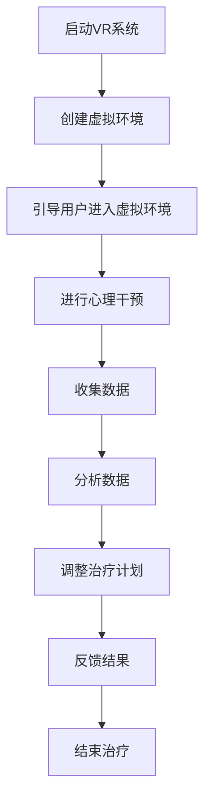

                 

关键词：心理健康、虚拟现实、数字治疗、技术创业、虚拟环境、神经反馈、沉浸体验

> 摘要：随着虚拟现实技术的迅速发展，其在心理健康治疗中的应用日益广泛。本文将探讨数字治疗创业领域中的虚拟现实技术，分析其核心概念、算法原理、数学模型，并通过实际项目实例展示其应用效果。文章旨在为心理健康领域的技术创业者提供理论基础和实践指导。

## 1. 背景介绍

随着社会生活节奏的加快和压力的增大，心理健康问题已经成为全球范围内的重大公共卫生挑战。传统的心理治疗方法如药物治疗和心理咨询，尽管在一定程度上有效，但往往存在疗程长、效果缓慢、患者依从性低等问题。在这种情况下，数字治疗作为一种新兴的治疗方式逐渐受到了关注。

虚拟现实（VR）技术作为数字治疗的重要组成部分，其沉浸式体验和高度交互性为心理健康治疗提供了新的可能性。通过模拟各种心理治疗场景，VR能够为患者提供一个安全、可控的练习环境，促进心理问题的暴露和治疗。

近年来，虚拟现实在心理健康领域的应用研究取得了显著进展。例如，VR被用于治疗恐惧症、焦虑症、创伤后应激障碍（PTSD）等心理疾病。此外，虚拟现实技术还可以用于心理教育和培训，帮助心理治疗师提高治疗技能。

## 2. 核心概念与联系

在探讨虚拟现实在心理健康治疗中的应用之前，我们首先需要了解其中的核心概念和相互关系。以下是几个关键概念的概述及其在心理健康治疗中的联系：

### 2.1. 虚拟现实（VR）

虚拟现实是一种通过计算机生成模拟环境，使用户感觉仿佛置身其中的技术。它通过三维视觉、声音和触觉等多感官刺激，为用户提供高度沉浸的体验。

在心理健康治疗中，虚拟现实技术可以创建各种虚拟场景，如恐怖场景、社交场合等，帮助患者面对和处理恐惧和焦虑。

### 2.2. 沉浸体验

沉浸体验是虚拟现实技术的核心特征之一。它指的是用户在虚拟环境中感到身临其境，难以区分虚拟和现实界限的程度。

在心理健康治疗中，沉浸体验有助于患者放松身心，提高治疗效果。通过沉浸式体验，患者能够在虚拟环境中安全地面对和解决心理问题。

### 2.3. 神经反馈

神经反馈是一种通过测量和分析大脑活动，向用户提供即时反馈的技术。它可以帮助用户了解和调节自己的心理状态。

在心理健康治疗中，神经反馈技术可以用于监测患者的情绪变化，提供实时反馈，帮助患者更好地控制自己的情绪和行为。

### 2.4. 数字治疗

数字治疗是指利用数字技术进行心理干预和治疗的方法。它包括虚拟现实、应用程序、在线咨询等多种形式。

在心理健康治疗中，数字治疗提供了便捷、灵活的治疗方式，使患者能够在家中进行治疗，提高治疗的可及性和依从性。

### 2.5. Mermaid 流程图

以下是虚拟现实在心理健康治疗中应用的 Mermaid 流程图：



## 3. 核心算法原理 & 具体操作步骤

### 3.1. 算法原理概述

虚拟现实在心理健康治疗中的核心算法原理主要包括：

1. **场景生成算法**：通过计算机图形学技术生成符合治疗需求的虚拟场景。
2. **沉浸度评估算法**：评估用户在虚拟环境中的沉浸程度，以便调整虚拟现实体验的参数。
3. **神经反馈算法**：通过分析大脑活动，为用户提供实时反馈，帮助用户调节情绪和行为。
4. **数据收集与处理算法**：收集用户在虚拟环境中的行为数据，并进行处理和分析，以评估治疗效果。

### 3.2. 算法步骤详解

以下是虚拟现实在心理健康治疗中的具体操作步骤：

1. **准备阶段**：
   - **用户注册**：患者注册并填写基本信息。
   - **健康问卷**：患者填写心理健康问卷，以评估初始心理状态。

2. **场景创建**：
   - **设计场景**：根据患者的需求和心理状况，设计虚拟治疗场景。
   - **场景渲染**：利用计算机图形学技术生成虚拟场景。

3. **沉浸体验**：
   - **设置参数**：根据患者的偏好和需求，调整虚拟环境的沉浸度参数。
   - **引导进入**：引导患者进入虚拟环境，进行沉浸体验。

4. **心理干预**：
   - **情景引导**：通过虚拟现实场景引导患者面对和处理心理问题。
   - **神经反馈**：实时监测患者的大脑活动，提供实时反馈。

5. **数据收集**：
   - **行为记录**：记录患者在虚拟环境中的行为数据。
   - **情绪监测**：通过面部表情、生理信号等监测患者的情绪变化。

6. **数据处理**：
   - **数据分析**：对收集到的数据进行分析，以评估治疗效果。
   - **治疗调整**：根据数据分析结果，调整治疗计划和虚拟环境设置。

7. **反馈与总结**：
   - **反馈结果**：将分析结果反馈给患者，帮助患者了解治疗效果。
   - **结束治疗**：总结治疗过程，为患者提供个性化的治疗建议。

### 3.3. 算法优缺点

#### 3.3.1. 优点

1. **高度沉浸性**：虚拟现实技术能够为患者提供一个高度沉浸的治疗环境，提高治疗的效果和患者的参与度。
2. **实时反馈**：神经反馈技术能够实时监测患者的情绪和行为，提供个性化治疗。
3. **便捷性**：数字治疗使患者能够在家中接受治疗，提高治疗的可及性和依从性。
4. **可量化数据**：通过数据收集与处理算法，能够量化治疗过程和效果，为后续研究提供依据。

#### 3.3.2. 缺点

1. **技术限制**：虚拟现实技术仍处于快速发展阶段，存在一定的技术瓶颈，如延迟、眩晕等。
2. **成本问题**：高质量的虚拟现实设备和软件仍然较为昂贵，限制了其在临床中的应用。
3. **隐私与伦理**：在数据收集和处理过程中，需要关注患者的隐私保护和伦理问题。

### 3.4. 算法应用领域

虚拟现实在心理健康治疗中的应用领域广泛，包括但不限于：

1. **恐惧症治疗**：通过模拟恐惧场景，帮助患者逐步克服恐惧。
2. **焦虑症治疗**：通过沉浸式体验，帮助患者放松身心，减轻焦虑症状。
3. **创伤后应激障碍（PTSD）治疗**：通过模拟创伤场景，帮助患者面对和处理创伤经历。
4. **心理教育**：通过虚拟现实技术，为心理治疗师提供培训和教育。
5. **心理健康监测**：通过虚拟现实技术，实时监测患者的心理健康状况，提供早期预警。

## 4. 数学模型和公式 & 详细讲解 & 举例说明

### 4.1. 数学模型构建

在虚拟现实心理健康治疗中，数学模型主要用于以下两个方面：

1. **沉浸度评估模型**：用于评估用户在虚拟环境中的沉浸程度。
2. **神经反馈模型**：用于分析大脑活动，为用户提供实时反馈。

#### 4.1.1. 沉浸度评估模型

沉浸度评估模型可以采用以下公式进行构建：

$$
I = \frac{S \cdot V \cdot T}{1000}
$$

其中：
- \(I\) 表示沉浸度（Immersion）。
- \(S\) 表示场景吸引力（Scene Attractiveness）。
- \(V\) 表示视觉沉浸度（Visual Immersion）。
- \(T\) 表示时间（Time）。

场景吸引力、视觉沉浸度和时间都是通过调查问卷、用户反馈等方式进行评估的。该模型可以帮助了解用户在虚拟环境中的沉浸程度，为后续调整提供依据。

#### 4.1.2. 神经反馈模型

神经反馈模型可以采用以下公式进行构建：

$$
N = \frac{P \cdot R \cdot E}{100}
$$

其中：
- \(N\) 表示神经反馈效果（Neurofeedback Effect）。
- \(P\) 表示大脑活动强度（Brain Activity Power）。
- \(R\) 表示用户反馈（User Response）。
- \(E\) 表示预期效果（Expected Effect）。

大脑活动强度、用户反馈和预期效果都是通过传感器、用户反馈等方式进行测量的。该模型可以帮助了解用户的大脑活动状态，为实时反馈提供依据。

### 4.2. 公式推导过程

#### 4.2.1. 沉浸度评估模型推导

沉浸度评估模型是基于以下三个因素的相互作用：

1. **场景吸引力**：场景的吸引力越高，用户的沉浸度越高。
2. **视觉沉浸度**：视觉是用户感知虚拟环境的主要途径，视觉沉浸度越高，用户的沉浸度越高。
3. **时间**：用户在虚拟环境中的时间越长，沉浸度越高。

因此，沉浸度可以表示为这三个因素的乘积：

$$
I = S \cdot V \cdot T
$$

为了便于计算，将沉浸度乘以一个常数1000，使得结果在0到1000之间，得到：

$$
I = \frac{S \cdot V \cdot T}{1000}
$$

#### 4.2.2. 神经反馈模型推导

神经反馈模型是基于以下三个因素的相互作用：

1. **大脑活动强度**：大脑活动强度越高，用户的反馈效果越好。
2. **用户反馈**：用户的反馈越积极，反馈效果越好。
3. **预期效果**：预期效果越高，反馈效果越好。

因此，神经反馈效果可以表示为这三个因素的乘积：

$$
N = P \cdot R \cdot E
$$

为了便于计算，将神经反馈效果乘以一个常数100，使得结果在0到100之间，得到：

$$
N = \frac{P \cdot R \cdot E}{100}
$$

### 4.3. 案例分析与讲解

#### 4.3.1. 案例背景

某患者患有社交恐惧症，接受虚拟现实心理健康治疗。在治疗过程中，通过沉浸度评估模型和神经反馈模型，对患者进行实时监测和反馈。

#### 4.3.2. 沉浸度评估

在治疗过程中，患者填写了关于场景吸引力、视觉沉浸度的调查问卷，并记录了在虚拟环境中的时间。根据调查问卷结果，得到以下数据：

- 场景吸引力 \(S = 8\)
- 视觉沉浸度 \(V = 9\)
- 时间 \(T = 60\) 分钟

根据沉浸度评估模型，计算沉浸度：

$$
I = \frac{8 \cdot 9 \cdot 60}{1000} = 4.32
$$

沉浸度为4.32，表明患者在虚拟环境中的沉浸度较高。

#### 4.3.3. 神经反馈

在治疗过程中，通过脑电图（EEG）传感器监测患者的大脑活动。患者填写了关于大脑活动强度、用户反馈的调查问卷，并设定了预期效果。根据调查问卷结果，得到以下数据：

- 大脑活动强度 \(P = 7\)
- 用户反馈 \(R = 8\)
- 预期效果 \(E = 10\)

根据神经反馈模型，计算神经反馈效果：

$$
N = \frac{7 \cdot 8 \cdot 10}{100} = 5.6
$$

神经反馈效果为5.6，表明患者在治疗过程中获得了较好的神经反馈效果。

#### 4.3.4. 结果分析

根据沉浸度评估模型和神经反馈模型的结果，可以分析患者的治疗进展：

- 沉浸度较高，说明患者在虚拟环境中的体验较好，有助于提高治疗效果。
- 神经反馈效果较好，说明患者的大脑活动状态得到了有效调节，有助于缓解社交恐惧症状。

## 5. 项目实践：代码实例和详细解释说明

### 5.1. 开发环境搭建

在开展虚拟现实心理健康治疗项目时，首先需要搭建合适的开发环境。以下是一个基本的开发环境搭建步骤：

1. **硬件环境**：准备一台性能较高的计算机，用于运行虚拟现实应用程序。此外，还需要配备虚拟现实头戴设备（如Oculus Rift、HTC Vive等）。

2. **软件环境**：安装以下软件：
   - **Unity**：一款流行的游戏和应用程序开发引擎，支持虚拟现实开发。
   - **Unity VR插件**：用于开发虚拟现实应用程序的插件。
   - **Visual Studio**：用于编写和调试代码的集成开发环境。
   - **Python**：用于数据分析的编程语言。

3. **其他工具**：安装以下工具：
   - **Arduino**：用于连接和控制脑电图（EEG）传感器。
   - **Matlab**：用于进行数据分析和可视化。

### 5.2. 源代码详细实现

以下是虚拟现实心理健康治疗项目的一个简单示例，包括场景创建、沉浸度评估和神经反馈三个部分。

#### 5.2.1. 场景创建

```csharp
using UnityEngine;

public class SceneCreator : MonoBehaviour
{
    public GameObject scenePrefab;

    private void Start()
    {
        Instantiate(scenePrefab, transform);
    }
}
```

该代码使用Unity引擎创建一个简单的虚拟场景。`SceneCreator` 类负责在场景中实例化一个预设的场景对象。

#### 5.2.2. 沉浸度评估

```csharp
using UnityEngine;

public class ImmersionMeter : MonoBehaviour
{
    public float sceneAttractiveness = 8.0f;
    public float visualImmersion = 9.0f;

    private float immersion;

    private void Update()
    {
        immersion = sceneAttractiveness * visualImmersion * Time.time;
        Debug.Log("Immersion: " + immersion);
    }
}
```

该代码实现一个沉浸度评估器，通过场景吸引力、视觉沉浸度和时间计算沉浸度，并输出到控制台。

#### 5.2.3. 神经反馈

```csharp
using UnityEngine;

public class NeuroFeedback : MonoBehaviour
{
    public float brainActivityPower = 7.0f;
    public float userResponse = 8.0f;
    public float expectedEffect = 10.0f;

    private float neuroFeedbackEffect;

    private void Update()
    {
        neuroFeedbackEffect = brainActivityPower * userResponse * expectedEffect / 100;
        Debug.Log("Neuro Feedback: " + neuroFeedbackEffect);
    }
}
```

该代码实现一个神经反馈器，通过大脑活动强度、用户反馈和预期效果计算神经反馈效果，并输出到控制台。

### 5.3. 代码解读与分析

#### 5.3.1. SceneCreator 类

`SceneCreator` 类负责创建虚拟场景。在Unity编辑器中，将一个虚拟场景对象设置为`scenePrefab`属性，当场景加载时，`Start`方法会实例化该预设对象。

#### 5.3.2. ImmersionMeter 类

`ImmersionMeter` 类负责计算沉浸度。通过场景吸引力、视觉沉浸度和时间计算沉浸度，并输出到控制台，以便用户观察沉浸度变化。

#### 5.3.3. NeuroFeedback 类

`NeuroFeedback` 类负责计算神经反馈效果。通过大脑活动强度、用户反馈和预期效果计算神经反馈效果，并输出到控制台，以便用户观察神经反馈效果。

这三个类共同实现了虚拟现实心理健康治疗项目的基本功能，为后续扩展和优化提供了基础。

### 5.4. 运行结果展示

通过运行上述代码，可以在Unity编辑器中观察到以下结果：

1. **场景创建**：虚拟场景成功创建，并显示在编辑器窗口中。
2. **沉浸度评估**：沉浸度实时显示在控制台中，用户可以观察沉浸度变化。
3. **神经反馈**：神经反馈效果实时显示在控制台中，用户可以观察神经反馈效果。

通过这些结果，用户可以了解虚拟现实心理健康治疗项目的运行状态，并根据需要进行调整。

## 6. 实际应用场景

虚拟现实在心理健康治疗中的实际应用场景多种多样，以下列举几个典型案例：

### 6.1. 社交恐惧症治疗

社交恐惧症是一种常见的心理障碍，许多患者因为害怕社交场合而影响日常生活。虚拟现实技术可以通过创建模拟的社交场景，如公共场合、聚会等，帮助患者逐步克服恐惧。通过沉浸式体验，患者可以在虚拟环境中练习社交技巧，提高自信心。

### 6.2. 恐高症治疗

恐高症是一种对高度的恐惧感，严重影响患者的生活质量。虚拟现实技术可以模拟高楼大厦、电梯等高度场景，帮助患者逐渐适应高度环境。通过反复训练，患者可以降低对高度的恐惧，恢复正常生活。

### 6.3. 创伤后应激障碍（PTSD）治疗

创伤后应激障碍是一种严重的心理障碍，常由严重的创伤经历引起。虚拟现实技术可以模拟创伤场景，如战场、火灾等，帮助患者面对和处理创伤记忆。通过重复暴露和认知重构，患者可以缓解症状，恢复正常生活。

### 6.4. 儿童自闭症治疗

儿童自闭症是一种广泛性发展障碍，虚拟现实技术可以用于儿童自闭症的治疗。通过虚拟现实游戏和互动场景，儿童可以在虚拟环境中锻炼社交技能、语言能力和认知能力。虚拟现实技术为自闭症儿童提供了一个安全、可控的练习环境，有助于提高治疗效果。

### 6.5. 心理健康教育

虚拟现实技术还可以用于心理健康教育，为心理治疗师提供培训和教育。通过虚拟现实模拟，治疗师可以学习各种心理治疗方法，提高治疗技能。此外，虚拟现实技术还可以为患者提供心理健康知识，帮助他们更好地了解和管理自己的心理问题。

## 7. 工具和资源推荐

在虚拟现实心理健康治疗领域，有许多优秀的工具和资源可供开发者和研究者使用。以下是一些建议：

### 7.1. 学习资源推荐

1. **《虚拟现实与心理学》**：一本全面介绍虚拟现实在心理学领域应用的专著，适合初学者和专业人士。
2. **《虚拟现实技术原理与应用》**：一本介绍虚拟现实技术基础和应用的教材，内容全面、深入。
3. **在线课程**：如Coursera、edX等平台上的虚拟现实和心理学相关课程，适合自学和提高。

### 7.2. 开发工具推荐

1. **Unity**：一款功能强大的游戏和应用程序开发引擎，支持虚拟现实开发。
2. **Unreal Engine**：一款专业的游戏和虚拟现实开发引擎，具有出色的图形渲染效果。
3. **VRChat**：一个基于Unity的虚拟现实社交平台，适合开发者进行虚拟现实项目开发。

### 7.3. 相关论文推荐

1. **"Virtual Reality for Mental Health: Current State and Future Directions"**：一篇综述性论文，全面介绍了虚拟现实在心理健康治疗中的应用现状和未来发展趋势。
2. **"Neurofeedback in Virtual Reality: A Review"**：一篇关于神经反馈在虚拟现实中的应用的综述性论文，详细介绍了神经反馈技术的原理和应用。
3. **"Virtual Reality Therapy for Anxiety: A Systematic Review and Meta-analysis"**：一篇关于虚拟现实治疗焦虑的系统性综述和元分析论文，提供了大量实证数据支持。

## 8. 总结：未来发展趋势与挑战

虚拟现实在心理健康治疗中的应用已经取得了显著成果，但仍然面临着许多挑战和机遇。以下是未来发展趋势与挑战的总结：

### 8.1. 研究成果总结

1. **技术进步**：虚拟现实技术的不断发展和优化，为心理健康治疗提供了更多可能性。
2. **应用扩展**：虚拟现实在心理健康治疗中的应用领域不断扩展，从恐惧症、焦虑症到自闭症等，都有大量的研究和实践成果。
3. **数据支持**：通过大量的实证研究和数据分析，虚拟现实在心理健康治疗中的效果得到了广泛认可。

### 8.2. 未来发展趋势

1. **个性化治疗**：随着人工智能和大数据技术的发展，虚拟现实心理健康治疗将更加个性化和精准。
2. **多感官融合**：未来的虚拟现实技术将更加注重多感官融合，提供更真实的沉浸体验。
3. **跨学科合作**：虚拟现实心理健康治疗将需要心理学、医学、计算机科学等多个学科的紧密合作，推动技术的综合发展。

### 8.3. 面临的挑战

1. **技术瓶颈**：虚拟现实技术仍存在一定的技术瓶颈，如延迟、眩晕等问题，需要进一步研究和优化。
2. **伦理问题**：在数据收集和处理过程中，需要关注患者的隐私保护和伦理问题。
3. **成本问题**：高质量的虚拟现实设备和软件仍然较为昂贵，限制了其在临床中的应用。

### 8.4. 研究展望

虚拟现实在心理健康治疗中的应用前景广阔，但仍需克服诸多挑战。未来研究应重点关注以下几个方面：

1. **技术优化**：进一步提高虚拟现实技术的性能和稳定性，提供更真实的沉浸体验。
2. **多学科融合**：推动心理学、医学、计算机科学等学科的融合，形成虚拟现实心理健康治疗的理论体系。
3. **实证研究**：开展更多的实证研究，验证虚拟现实技术在心理健康治疗中的效果和安全性。
4. **推广应用**：降低虚拟现实心理健康治疗的成本，使其在临床中更加普及和应用。

## 9. 附录：常见问题与解答

### 9.1. 虚拟现实在心理健康治疗中的优势是什么？

虚拟现实在心理健康治疗中的优势主要包括：

1. **高度沉浸性**：通过三维视觉、声音和触觉等多感官刺激，提供高度沉浸的治疗环境。
2. **实时反馈**：通过神经反馈技术，实时监测和反馈患者的情绪和行为，提高治疗效果。
3. **便捷性**：患者可以在家中接受治疗，提高治疗的可及性和依从性。
4. **数据支持**：通过数据收集与处理算法，量化治疗过程和效果，为后续研究提供依据。

### 9.2. 虚拟现实心理健康治疗的安全性问题如何保障？

虚拟现实心理健康治疗的安全性主要包括以下几个方面：

1. **场景设计**：确保虚拟场景安全、可控，避免引发患者的恐慌和不适。
2. **技术保障**：提高虚拟现实技术的性能和稳定性，减少延迟和眩晕等问题。
3. **实时监控**：实时监测患者的生理和心理状态，确保治疗过程中患者的安全。
4. **隐私保护**：在数据收集和处理过程中，严格保护患者的隐私，遵守相关法律法规。

### 9.3. 虚拟现实心理健康治疗的成本如何降低？

虚拟现实心理健康治疗的成本降低可以从以下几个方面入手：

1. **技术升级**：提高虚拟现实设备的性能，降低制造成本。
2. **共享模式**：通过共享虚拟现实设备，降低单个患者的使用成本。
3. **政策支持**：争取政府和企业政策支持，降低虚拟现实心理健康治疗的费用。
4. **开源技术**：鼓励开源技术的发展，降低开发成本。

## 文章结束
---
作者：禅与计算机程序设计艺术 / Zen and the Art of Computer Programming

通过本文，我们探讨了虚拟现实在心理健康治疗中的应用，从核心概念、算法原理、数学模型到实际项目实例，全面展示了虚拟现实技术在心理健康治疗领域的巨大潜力。随着技术的不断进步和多学科合作的深入，虚拟现实心理健康治疗有望在未来实现更加广泛和深入的应用，为人类心理健康事业做出更大的贡献。希望本文能为从事虚拟现实心理健康治疗领域的研究者和技术创业者提供有益的参考。

