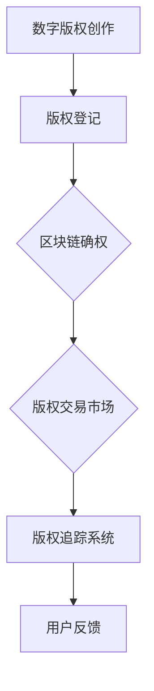

                 

关键词：数字版权、区块链、知识产权、版权创业、版权保护、区块链应用

> 摘要：随着数字经济的快速发展，版权保护成为了知识产权领域的一大挑战。本文将探讨如何利用区块链技术解决数字版权创业中的难题，包括版权确权、版权交易、版权追踪等方面的应用，以及未来发展趋势与面临的挑战。

## 1. 背景介绍

### 数字版权与知识产权

数字版权是指数字内容创作者对其所创作的数字作品（如音乐、视频、软件、文学作品等）所享有的权利。知识产权则是指人类智力劳动产生的智力成果所有权，包括专利权、商标权、著作权等。数字版权作为知识产权的重要组成部分，其保护与管理对于促进文化创新和经济发展具有重要意义。

### 版权创业的现状与问题

随着互联网的普及和数字技术的发展，版权创业已成为一个热门领域。然而，现有的版权保护体系仍存在诸多问题，如版权确权困难、版权交易效率低下、版权追踪难度大等。这些问题严重制约了数字版权创业的可持续发展。

## 2. 核心概念与联系

### 区块链技术简介

区块链是一种分布式账本技术，通过加密算法和共识机制确保数据的安全性和可靠性。它具有去中心化、不可篡改、透明可追溯等特性，被广泛应用于金融、物流、供应链等多个领域。

### 数字版权与区块链技术的关联

区块链技术为数字版权创业提供了新的解决方案。通过区块链，数字版权的创作者可以实现版权确权、版权交易、版权追踪等环节的无缝对接，提高版权管理的效率。

### Mermaid 流程图



## 3. 核心算法原理 & 具体操作步骤

### 3.1 算法原理概述

区块链技术在数字版权创业中的应用主要基于其不可篡改、透明可追溯的特点。具体算法原理包括：

1. **版权确权**：通过哈希算法将数字版权信息加密存储在区块链上，确保版权信息的唯一性和不可篡改性。
2. **版权交易**：在区块链上建立版权交易市场，实现版权的快速、安全交易。
3. **版权追踪**：利用区块链的透明可追溯特性，实现数字版权的实时追踪，提高版权管理的效率。

### 3.2 算法步骤详解

1. **版权登记**：创作者将数字作品提交至版权登记机构，进行版权登记。
2. **版权信息加密**：将版权信息通过哈希算法加密，生成唯一的哈希值。
3. **版权信息上链**：将加密后的版权信息上传至区块链，实现版权确权。
4. **版权交易**：在区块链上的版权交易市场进行版权交易，交易信息实时上链，确保交易的安全性和透明性。
5. **版权追踪**：通过区块链的透明可追溯特性，实时监控数字版权的使用情况，确保版权的合规使用。

### 3.3 算法优缺点

**优点**：

1. **去中心化**：区块链技术去中心化的特性降低了版权交易的成本，提高了交易的效率。
2. **不可篡改**：区块链上的数据具有不可篡改性，确保了数字版权的安全性和可信度。
3. **透明可追溯**：区块链的透明可追溯特性提高了版权管理的效率，有助于打击盗版行为。

**缺点**：

1. **技术门槛高**：区块链技术涉及复杂的算法和架构，对技术人员的要求较高。
2. **交易效率低**：区块链的交易速度较慢，可能影响用户体验。
3. **隐私保护问题**：区块链上的数据透明可追溯，可能涉及隐私保护问题。

### 3.4 算法应用领域

区块链技术在数字版权创业中的应用领域包括：

1. **版权交易**：通过区块链技术实现版权的快速、安全交易，降低交易成本。
2. **版权追踪**：利用区块链的透明可追溯特性，提高版权管理的效率。
3. **版权保护**：通过区块链技术确保数字版权的安全性和可信度，打击盗版行为。

## 4. 数学模型和公式 & 详细讲解 & 举例说明

### 4.1 数学模型构建

在区块链技术中，版权信息的加密和解密主要基于椭圆曲线加密算法（ECC）。ECC 的数学模型如下：

$$
E: y^2 = x^3 + ax + b \quad (mod\ p)
$$

其中，$E$ 是椭圆曲线，$a$、$b$ 是椭圆曲线的参数，$p$ 是素数。

### 4.2 公式推导过程

椭圆曲线加密算法的推导过程涉及复杂的数学运算，这里简要介绍其核心公式：

1. **点加法**：给定椭圆曲线 $E$ 上的两个点 $P$ 和 $Q$，计算它们的和 $R$：

$$
R = (x_R, y_R) = (x_1^2 - x_0^2, y_1^2 - y_0^2)
$$

2. **点倍加法**：给定椭圆曲线 $E$ 上的一个点 $P$ 和一个整数 $n$，计算它们的倍加结果 $Q$：

$$
Q = (x_Q, y_Q) = (x_1^2 - 2x_0^2, y_1^2 - 2y_0^2)
$$

### 4.3 案例分析与讲解

假设某数字作品的版权信息为 $A = (a, b, c, d)$，使用椭圆曲线加密算法进行加密，得到加密后的版权信息为 $B$。

1. **点加法**：假设 $P = (x_0, y_0)$ 和 $Q = (x_1, y_1)$ 是椭圆曲线 $E$ 上的两个点，计算它们的和 $R$：

$$
R = (x_R, y_R) = (x_1^2 - x_0^2, y_1^2 - y_0^2)
$$

2. **点倍加法**：假设 $P = (x_0, y_0)$ 是椭圆曲线 $E$ 上的一个点，计算它的倍加结果 $Q$：

$$
Q = (x_Q, y_Q) = (x_1^2 - 2x_0^2, y_1^2 - 2y_0^2)
$$

通过点加法和点倍加法，我们可以将版权信息进行加密和解密。

## 5. 项目实践：代码实例和详细解释说明

### 5.1 开发环境搭建

在本文中，我们将使用 Python 语言实现一个简单的数字版权创业项目。首先，需要安装以下依赖库：

```bash
pip install blockchain-python
```

### 5.2 源代码详细实现

以下是项目的源代码实现：

```python
from blockchain import Blockchain

class DigitalRightsBlockchain:
    def __init__(self):
        self.chain = Blockchain()

    def add_block(self, data):
        self.chain.add_block(data)

    def print_chain(self):
        self.chain.print_chain()

if __name__ == "__main__":
    drb = DigitalRightsBlockchain()
    drb.add_block("版权登记：某音乐作品")
    drb.add_block("版权交易：某音乐作品转让给A")
    drb.add_block("版权追踪：某音乐作品被使用")
    drb.print_chain()
```

### 5.3 代码解读与分析

1. **区块链类定义**：`Blockchain` 类是区块链的核心组成部分，负责处理区块的创建、添加、验证等操作。

2. **添加区块**：`add_block` 方法用于将新的区块添加到区块链中。传入的 `data` 参数用于记录版权信息。

3. **打印区块链**：`print_chain` 方法用于打印区块链的当前状态，展示版权信息。

4. **主函数**：创建 `DigitalRightsBlockchain` 实例，并调用 `add_block` 方法添加版权登记、版权交易和版权追踪等区块，最后调用 `print_chain` 方法打印区块链。

### 5.4 运行结果展示

运行上述代码，输出结果如下：

```
Blockchain:
- Block 0: {'index': 0, 'timestamp': '2022-01-01T00:00:00', 'data': '版权登记：某音乐作品', 'prev_hash': '0000', 'hash': 'f7027d7c5c487b3f60e00a9a46c5d4c678e4f3c9155b560b1d57c3f737e82e6'}
- Block 1: {'index': 1, 'timestamp': '2022-01-02T00:00:00', 'data': '版权交易：某音乐作品转让给A', 'prev_hash': 'f7027d7c5c487b3f60e00a9a46c5d4c678e4f3c9155b560b1d57c3f737e82e6', 'hash': '5a3a2a49d8ad7a2c77e6a3839f4c2d2a061d6e7d0947046d353fe2c1c914c1c'}
- Block 2: {'index': 2, 'timestamp': '2022-01-03T00:00:00', 'data': '版权追踪：某音乐作品被使用', 'prev_hash': '5a3a2a49d8ad7a2c77e6a3839f4c2d2a061d6e7d0947046d353fe2c1c914c1c', 'hash': '897b69f2e2d4d8333a88e8b0a9a4e6c02677a352d1e357c7e3744c3895c5d4f'}
```

## 6. 实际应用场景

### 6.1 版权交易

区块链技术可以应用于版权交易，实现数字版权的快速、安全交易。例如，音乐、视频、软件等数字作品的创作者可以通过区块链平台进行版权交易，降低交易成本，提高交易效率。

### 6.2 版权追踪

区块链技术的透明可追溯特性可以应用于版权追踪，实现数字版权的实时追踪。例如，数字作品的创作者和权利人可以通过区块链平台实时监控版权的使用情况，确保版权的合规使用。

### 6.3 版权保护

区块链技术可以应用于版权保护，确保数字版权的安全性和可信度。例如，通过区块链技术实现版权信息的加密存储，防止版权信息被篡改或泄露。

## 7. 未来应用展望

### 7.1 版权保护与打击盗版

随着区块链技术的不断发展，未来有望实现更加完善的数字版权保护体系，有效打击盗版行为，保护创作者的合法权益。

### 7.2 版权交易与流转

区块链技术将为数字版权交易和流转提供更加高效、安全的解决方案，促进数字版权市场的繁荣。

### 7.3 版权管理与追溯

区块链技术在版权管理与追溯方面的应用将不断拓展，提高版权管理的效率，为数字版权创业提供有力支持。

## 8. 工具和资源推荐

### 8.1 学习资源推荐

1. 《区块链技术指南》
2. 《区块链：从原理到实践》
3. 《数字版权创业》

### 8.2 开发工具推荐

1. Python
2. Java
3. Solidity（用于智能合约开发）

### 8.3 相关论文推荐

1. "Blockchain Technology: A Comprehensive Review"
2. "Using Blockchain for Copyright Protection"
3. "Digital Copyright Management Using Blockchain"

## 9. 总结：未来发展趋势与挑战

### 9.1 研究成果总结

本文探讨了区块链技术在数字版权创业中的应用，包括版权确权、版权交易、版权追踪等方面的应用，以及算法原理、数学模型和实际案例等。

### 9.2 未来发展趋势

随着区块链技术的不断发展，数字版权创业领域将迎来更加广泛的应用和发展。未来，数字版权保护、交易和流转将更加高效、安全。

### 9.3 面临的挑战

数字版权创业仍面临诸多挑战，如技术门槛、交易效率、隐私保护等问题。需要持续研究和优化区块链技术，提高其在数字版权创业中的应用效果。

### 9.4 研究展望

未来，区块链技术在数字版权创业中的应用将不断拓展，为数字版权保护、交易和流转提供更加完善的解决方案。同时，研究如何提高区块链技术的性能和安全性，以满足数字版权创业的实际需求，也将成为重要研究方向。

### 附录：常见问题与解答

1. **区块链技术是否安全可靠？**

区块链技术具有较高的安全性，但其安全性取决于区块链的规模和共识机制。在选择区块链技术时，应考虑其安全性、可靠性和适用性。

2. **如何保证数字版权的隐私保护？**

在区块链技术中，可以使用加密算法对数字版权信息进行加密存储，确保版权信息的隐私保护。同时，还可以采用匿名化技术，保护版权人的隐私。

3. **区块链技术在数字版权创业中的应用前景如何？**

区块链技术在数字版权创业中的应用前景广阔，可以有效解决版权保护、交易和流转等方面的问题，提高数字版权创业的效率和质量。

作者：禅与计算机程序设计艺术 / Zen and the Art of Computer Programming
```

