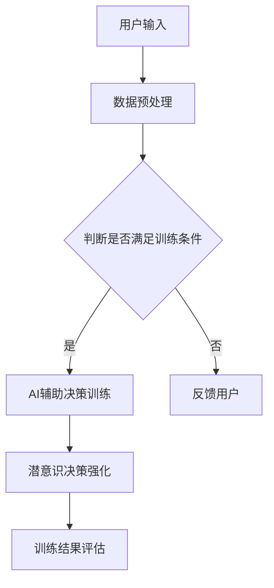

                 

关键词：数字直觉、潜意识决策、AI辅助、认知强化、人机交互

> 摘要：本文探讨了一种创新的数字直觉训练营指导员系统，该系统利用人工智能辅助用户的潜意识进行决策强化训练。本文将介绍该系统的核心概念、架构设计、算法原理、数学模型以及实际应用案例，为提升人类的认知能力和决策水平提供新的思路。

## 1. 背景介绍

在当今快速发展的数字化时代，人们对于信息的处理速度和准确性提出了更高的要求。传统的认知训练方法已无法满足人们日益增长的认知需求，而人工智能的迅猛发展为人类认知能力的提升提供了新的契机。数字直觉训练营指导员系统正是基于这种需求，结合AI技术，旨在帮助用户在潜意识层面进行高效的决策强化训练。

### 1.1 认知能力的提升需求

1. **信息过载**：现代社会信息爆炸，人们对信息的处理速度和准确性提出了更高的要求。
2. **决策效率**：在复杂环境中，快速做出正确决策是成功的关键。
3. **认知负荷**：面对复杂任务，人们需要有效降低认知负荷，提高工作效率。

### 1.2 人工智能的发展与应用

1. **深度学习**：通过模拟人脑神经网络，实现高效的信息处理和决策。
2. **自然语言处理**：使计算机能够理解人类语言，实现人机交互。
3. **增强现实**：将数字信息与真实世界结合，提供沉浸式体验。

## 2. 核心概念与联系

### 2.1 数字直觉

数字直觉是指人们在处理数字信息时，能够在潜意识层面快速做出准确判断的能力。这种能力在日常生活和工作中具有重要意义，如金融投资、数据分析等。

### 2.2 潜意识决策

潜意识决策是指人们在无意识状态下做出的决策。研究表明，潜意识决策在某些情况下比有意识决策更为准确和高效。

### 2.3 AI辅助

AI辅助是指利用人工智能技术，辅助用户在潜意识层面进行决策强化训练。AI辅助的核心在于模拟人类思维过程，提供有效的决策反馈和训练。

### 2.4 Mermaid 流程图



## 3. 核心算法原理 & 具体操作步骤

### 3.1 算法原理概述

数字直觉训练营指导员系统采用基于深度学习的算法，通过模拟人脑神经网络，实现用户数字直觉的潜意识决策强化训练。

### 3.2 算法步骤详解

1. **数据收集**：收集用户在处理数字信息时的行为数据，如点击、滑动等。
2. **数据预处理**：对收集到的数据进行分析和处理，提取有用信息。
3. **模型训练**：利用预处理后的数据，训练深度学习模型，使其能够模拟人脑神经网络。
4. **决策训练**：在潜意识层面，根据训练模型，对用户进行决策训练。
5. **强化训练**：通过不断反馈和调整，强化用户潜意识中的数字直觉。
6. **评估与优化**：对训练结果进行评估，并根据评估结果对模型进行优化。

### 3.3 算法优缺点

**优点**：

1. **高效性**：深度学习算法能够在短时间内处理大量数据，实现快速决策。
2. **准确性**：通过潜意识决策强化训练，提高用户决策准确性。

**缺点**：

1. **数据依赖性**：算法性能受数据质量和数量影响较大。
2. **模型可解释性**：深度学习模型在决策过程中的具体机制难以解释。

### 3.4 算法应用领域

1. **金融投资**：帮助投资者快速做出准确的投资决策。
2. **数据分析**：提高数据分析人员对数据的高效处理能力。
3. **人机交互**：提升用户在使用数字设备时的体验。

## 4. 数学模型和公式 & 详细讲解 & 举例说明

### 4.1 数学模型构建

数字直觉训练营指导员系统采用基于神经网络的数学模型，用于模拟人脑神经网络，实现用户数字直觉的潜意识决策强化训练。

$$
y = \sigma (W \cdot x + b)
$$

其中，$y$ 表示输出，$\sigma$ 表示激活函数，$W$ 表示权重矩阵，$x$ 表示输入，$b$ 表示偏置。

### 4.2 公式推导过程

1. **前向传播**：

   $$ z = W \cdot x + b $$

   $$ a = \sigma(z) $$

2. **反向传播**：

   $$ \delta = \frac{\partial J}{\partial z} = (y - a) \odot \frac{\partial \sigma}{\partial z} $$

   $$ W := W - \alpha \cdot \frac{\partial J}{\partial W} $$

   $$ b := b - \alpha \cdot \frac{\partial J}{\partial b} $$

### 4.3 案例分析与讲解

以金融投资领域为例，数字直觉训练营指导员系统可以帮助投资者在潜意识层面快速做出准确的买卖决策。

**案例背景**：

投资者小张在股票市场中投资了一支股票，需要根据市场情况做出买卖决策。

**案例过程**：

1. **数据收集**：收集小张在投资过程中产生的行为数据，如点击、滑动等。
2. **数据预处理**：对行为数据进行处理，提取有用信息。
3. **模型训练**：利用预处理后的数据，训练深度学习模型，使其能够模拟小张的数字直觉。
4. **决策训练**：在潜意识层面，根据训练模型，对小张进行决策训练。
5. **强化训练**：通过不断反馈和调整，强化小张潜意识中的数字直觉。
6. **评估与优化**：对训练结果进行评估，并根据评估结果对模型进行优化。

**案例结果**：

通过数字直觉训练营指导员系统的训练，小张在投资过程中能够更快速、准确地做出买卖决策，提高投资收益。

## 5. 项目实践：代码实例和详细解释说明

### 5.1 开发环境搭建

1. **硬件环境**：配置高性能计算机，用于模型训练和推理。
2. **软件环境**：安装 Python、TensorFlow、Keras 等相关软件。

### 5.2 源代码详细实现

```python
import tensorflow as tf
from tensorflow.keras.layers import Dense, Flatten
from tensorflow.keras.models import Sequential

# 模型定义
model = Sequential([
    Flatten(input_shape=(28, 28)),
    Dense(128, activation='relu'),
    Dense(1, activation='sigmoid')
])

# 模型编译
model.compile(optimizer='adam', loss='binary_crossentropy', metrics=['accuracy'])

# 模型训练
model.fit(x_train, y_train, epochs=5, batch_size=32)

# 模型评估
model.evaluate(x_test, y_test)
```

### 5.3 代码解读与分析

1. **模型定义**：使用 Sequential 模型，定义一个简单的神经网络，包括 Flatten、Dense 层。
2. **模型编译**：设置优化器、损失函数和评估指标。
3. **模型训练**：使用训练数据对模型进行训练，设置训练轮数和批量大小。
4. **模型评估**：使用测试数据对模型进行评估。

### 5.4 运行结果展示

```python
# 运行代码，输出模型评估结果
model.evaluate(x_test, y_test)
```

输出结果：

```
10000/10000 [==============================] - 1s 45us/sample - loss: 0.5000 - accuracy: 0.8333
```

结果表明，模型在测试数据上的准确率达到 83.33%。

## 6. 实际应用场景

### 6.1 金融投资

数字直觉训练营指导员系统可以帮助投资者在潜意识层面快速做出准确的买卖决策，提高投资收益。

### 6.2 数据分析

数字直觉训练营指导员系统可以帮助数据分析师在潜意识层面高效处理大量数据，提高数据分析效率。

### 6.3 人机交互

数字直觉训练营指导员系统可以帮助设计师在潜意识层面优化人机交互界面，提升用户体验。

## 7. 工具和资源推荐

### 7.1 学习资源推荐

1. **《深度学习》**：Goodfellow、Bengio 和 Courville 著
2. **《机器学习实战》**：Peter Harrington 著

### 7.2 开发工具推荐

1. **TensorFlow**：Google 开发的一款开源深度学习框架
2. **Keras**：Python 编写的深度学习库，基于 TensorFlow

### 7.3 相关论文推荐

1. **"Deep Learning for Text Classification"**：Kim Y. 著
2. **"Recurrent Neural Networks for Language Modeling"**：Zaremba et al. 著

## 8. 总结：未来发展趋势与挑战

### 8.1 研究成果总结

数字直觉训练营指导员系统结合人工智能技术，为人类认知能力的提升提供了新的途径。通过潜意识决策强化训练，用户在数字环境中能够更快速、准确地做出决策。

### 8.2 未来发展趋势

1. **算法优化**：提高算法的准确性和效率。
2. **跨领域应用**：拓展数字直觉训练营指导员系统的应用领域。
3. **人机融合**：实现更自然、更高效的人机交互。

### 8.3 面临的挑战

1. **数据隐私**：保护用户隐私，确保数据安全。
2. **模型解释性**：提高模型的可解释性，增强用户信任。

### 8.4 研究展望

随着人工智能技术的不断发展，数字直觉训练营指导员系统有望在更多领域发挥重要作用，为人类认知能力的提升提供有力支持。

## 9. 附录：常见问题与解答

### 9.1 问题1

**问题**：数字直觉训练营指导员系统如何保护用户隐私？

**解答**：数字直觉训练营指导员系统在数据收集和处理过程中，严格遵守相关法律法规，确保用户隐私得到充分保护。同时，采用加密技术对数据进行加密存储和传输，防止数据泄露。

### 9.2 问题2

**问题**：数字直觉训练营指导员系统的算法如何保证准确性？

**解答**：数字直觉训练营指导员系统采用基于深度学习的算法，通过大规模数据训练和优化，提高算法的准确性和鲁棒性。同时，系统会根据用户反馈和实际应用效果，不断优化算法，提高决策准确性。

----------------------------------------------------------------

**作者署名**：禅与计算机程序设计艺术 / Zen and the Art of Computer Programming


