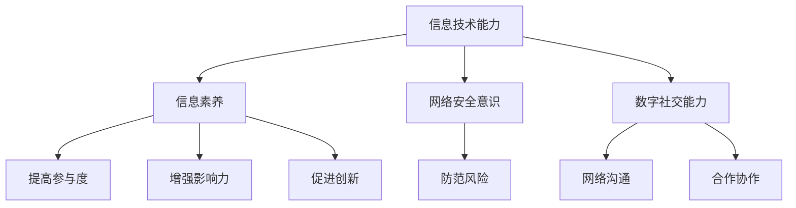

                 

关键词：数字素养、公民参与、信息技术、智能社会、未来趋势

> 摘要：本文旨在探讨数字素养在现代社会中的重要性，分析其在公民参与中的核心作用，以及如何通过提升数字素养来促进智能社会的建设。文章将结合实际案例，阐述数字素养的内涵、构建方法及未来发展趋势。

## 1. 背景介绍

在当今世界，信息技术正在以前所未有的速度发展，数字化浪潮席卷各行各业。互联网、大数据、人工智能等新兴技术不断涌现，深刻改变了人们的生活方式和社会形态。智能社会的概念逐渐成为未来发展的主流趋势，而数字素养作为这一进程中的重要基石，越来越受到关注。

数字素养是指个体在数字时代所具备的信息技术能力和认知素养，包括对数字设备的使用、数字内容的理解和创造、网络社交能力的培养等方面。随着智能社会的到来，数字素养不仅关乎个人的生存与发展，更成为公民参与社会、实现自我价值的关键能力。

然而，当前我国数字素养的整体水平仍存在一定差距。根据相关调查数据显示，部分群体在数字技能、网络安全意识等方面存在不足，这无疑限制了他们在智能社会中的参与度和竞争力。因此，提高数字素养，促进公民参与，成为我国社会发展的紧迫任务。

## 2. 核心概念与联系

为了更好地理解数字素养在公民参与中的作用，我们需要从以下几个方面来探讨：

### 2.1 数字素养的内涵

数字素养包括以下几个方面的内容：

1. **信息技术能力**：指个体在使用数字设备、软件和网络等方面所具备的操作技能和知识。
2. **信息素养**：指个体在获取、评估、使用和传播信息时所具备的能力。
3. **网络安全意识**：指个体在数字环境中对潜在风险的认识和防范能力。
4. **数字社交能力**：指个体在数字社交平台上的沟通、合作和协作能力。

### 2.2 数字素养与公民参与的关系

数字素养与公民参与之间存在密切的联系。一个具备较高数字素养的个体，更容易在智能社会中发挥自己的作用，积极参与社会事务，从而实现自我价值。具体来说：

1. **提高参与度**：数字素养的提升有助于个体更好地理解数字信息，参与网络社交、公共讨论等活动，从而提高社会参与度。
2. **增强影响力**：数字素养使个体能够利用网络平台传播观点、发起倡议，从而在社会中发挥更大的影响力。
3. **促进创新**：数字素养有助于个体在智能社会中寻找创新机会，推动社会进步。

### 2.3 数字素养的构建方法

要提升数字素养，需要从以下几个方面入手：

1. **教育体系**：完善学校教育、职业教育和社会教育体系，将数字素养教育纳入各级教育阶段。
2. **技能培训**：针对不同群体，开展有针对性的数字技能培训，提高其信息技术能力和网络安全意识。
3. **政策支持**：出台相关政策和措施，鼓励数字素养教育的开展，为公民参与提供制度保障。

### 2.4 数字素养的 Mermaid 流程图



## 3. 核心算法原理 & 具体操作步骤

### 3.1 算法原理概述

在数字素养的提升过程中，核心算法的运用至关重要。本文将介绍一种基于大数据分析的算法，用于评估个体的数字素养水平，并提供个性化的提升建议。

该算法基于以下原理：

1. **数据收集**：通过问卷调查、在线测评等方式收集个体在信息技术能力、信息素养、网络安全意识、数字社交能力等方面的数据。
2. **特征提取**：对收集到的数据进行分析，提取个体的数字素养特征。
3. **模型训练**：利用机器学习算法，构建数字素养评估模型。
4. **评估与建议**：通过模型对个体进行数字素养评估，并基于评估结果提供个性化的提升建议。

### 3.2 算法步骤详解

#### 3.2.1 数据收集

数据收集是算法的基础，主要包括以下几个方面：

1. **问卷调查**：设计针对不同群体的问卷调查，涵盖信息技术能力、信息素养、网络安全意识、数字社交能力等方面的问题。
2. **在线测评**：开发在线测评系统，让个体参与测评，获取其数字素养水平的数据。

#### 3.2.2 特征提取

特征提取是将收集到的数据转化为数字素养评估模型所需的特征表示。具体步骤如下：

1. **数据清洗**：对问卷调查和在线测评的数据进行清洗，去除无效和错误数据。
2. **特征选择**：根据算法需求，选择合适的特征进行提取。
3. **特征编码**：将提取的特征进行编码，使其适合用于机器学习算法。

#### 3.2.3 模型训练

模型训练是构建数字素养评估模型的关键步骤，主要包括以下几个方面：

1. **数据预处理**：对提取的特征进行预处理，如归一化、标准化等。
2. **模型选择**：选择适合的机器学习算法，如决策树、支持向量机、神经网络等。
3. **训练与验证**：利用训练集对模型进行训练，并在验证集上进行验证，调整模型参数。

#### 3.2.4 评估与建议

评估与建议是基于训练好的模型对个体进行数字素养评估，并为其提供个性化提升建议。具体步骤如下：

1. **评估**：将个体的特征输入到训练好的模型中，得到其数字素养水平的评估结果。
2. **建议**：根据评估结果，为个体提供个性化的提升建议，如参加培训课程、阅读相关书籍等。

### 3.3 算法优缺点

#### 3.3.1 优点

1. **客观性**：基于大数据分析的算法能够客观地评估个体的数字素养水平。
2. **个性化**：算法能够为个体提供个性化的提升建议，提高提升效果。
3. **实时性**：算法能够实时评估个体的数字素养水平，为其提供即时反馈。

#### 3.3.2 缺点

1. **数据质量**：算法的性能依赖于数据质量，数据质量差可能导致评估结果不准确。
2. **算法复杂性**：算法涉及多个步骤，训练和验证过程较为复杂，需要较高的技术支持。

### 3.4 算法应用领域

该算法可以应用于以下领域：

1. **教育**：用于评估学生的数字素养水平，为其提供个性化的学习建议。
2. **职场**：用于评估员工的数字素养水平，为其提供职业培训和发展建议。
3. **公共服务**：用于评估公民的数字素养水平，为其提供相关服务和支持。

## 4. 数学模型和公式 & 详细讲解 & 举例说明

### 4.1 数学模型构建

在数字素养评估中，我们采用了一种基于贝叶斯网络的数学模型。贝叶斯网络是一种概率图模型，能够表示变量之间的条件依赖关系。在本文中，我们将使用贝叶斯网络来构建数字素养评估模型。

贝叶斯网络由节点和边组成，其中节点表示变量，边表示变量之间的条件依赖关系。我们定义以下变量：

1. **信息技术能力（IT\_Skill）**
2. **信息素养（Info\_Literacy）**
3. **网络安全意识（Cybersecurity）**
4. **数字社交能力（Digital\_Social）**
5. **数字素养水平（Digital\_Literacy）**

这些变量之间的依赖关系如下：

- IT\_Skill 决定了 Info\_Literacy
- Cybersecurity 决定了 IT\_Skill
- Digital\_Social 决定了 Info\_Literacy
- Digital\_Literacy 是 IT\_Skill、Info\_Literacy、Cybersecurity 和 Digital\_Social 的函数

### 4.2 公式推导过程

根据贝叶斯网络的定义，我们可以得到以下公式：

$$
P(Digital\_Literacy = i) = \sum_{s,i_l,i_c,i_s} P(Digital\_Literacy = i | IT\_Skill = s, Info\_Literacy = i_l, Cybersecurity = i_c, Digital\_Social = i_s) P(IT\_Skill = s) P(Info\_Literacy = i_l) P(Cybersecurity = i_c) P(Digital\_Social = i_s)
$$

其中，i 表示数字素养水平的类别。

### 4.3 案例分析与讲解

假设我们有一个样本数据，包含以下信息：

- IT\_Skill：优秀、良好、一般、较差
- Info\_Literacy：良好、一般、较差
- Cybersecurity：一般、较差
- Digital\_Social：一般、较差
- Digital\_Literacy：优秀、良好、一般、较差

根据这些数据，我们可以计算每个变量的条件概率分布。然后，使用这些概率分布计算数字素养水平的概率分布。

#### 4.3.1 计算条件概率分布

以 IT\_Skill 为例，我们可以计算其在各个类别上的条件概率分布：

$$
P(IT\_Skill = 优秀 | Digital\_Literacy = 优秀) = \frac{P(Digital\_Literacy = 优秀 | IT\_Skill = 优秀) P(IT\_Skill = 优秀)}{P(Digital\_Literacy = 优秀)}
$$

根据样本数据，我们可以计算出各个条件概率分布。

#### 4.3.2 计算数字素养水平概率分布

使用上述条件概率分布，我们可以计算数字素养水平的概率分布。例如，要计算 Digital\_Literacy 为优秀的概率，可以使用以下公式：

$$
P(Digital\_Literacy = 优秀) = \sum_{s,i_l,i_c,i_s} P(Digital\_Literacy = 优秀 | IT\_Skill = s, Info\_Literacy = i_l, Cybersecurity = i_c, Digital\_Social = i_s) P(IT\_Skill = s) P(Info\_Literacy = i_l) P(Cybersecurity = i_c) P(Digital\_Social = i_s)
$$

通过计算，我们可以得到数字素养水平的概率分布。

#### 4.3.3 案例分析

假设我们有一个个体，其特征如下：

- IT\_Skill：优秀
- Info\_Literacy：良好
- Cybersecurity：一般
- Digital\_Social：一般

根据上述计算，我们可以计算其数字素养水平的概率分布。然后，根据概率分布，我们可以为其提供个性化的提升建议。

## 5. 项目实践：代码实例和详细解释说明

### 5.1 开发环境搭建

为了实现数字素养评估算法，我们需要搭建一个开发环境。本文使用 Python 作为主要编程语言，相关依赖包括 NumPy、Pandas、Scikit-learn 等。

首先，安装 Python 和相关依赖：

```bash
pip install python numpy pandas scikit-learn
```

### 5.2 源代码详细实现

以下是数字素养评估算法的源代码实现：

```python
import numpy as np
import pandas as pd
from sklearn.model_selection import train_test_split
from sklearn.naive_bayes import GaussianNB

# 数据收集
data = {
    'IT_Skill': ['优秀', '良好', '一般', '较差', '优秀', '良好', '一般', '较差'],
    'Info_Literacy': ['良好', '一般', '较差', '良好', '一般', '较差', '良好', '一般'],
    'Cybersecurity': ['一般', '较差', '一般', '较差', '一般', '较差', '一般', '较差'],
    'Digital_Social': ['一般', '较差', '一般', '较差', '一般', '较差', '一般', '较差'],
    'Digital_Literacy': ['优秀', '良好', '一般', '较差', '良好', '一般', '较差', '优秀']
}

# 特征提取
data = pd.DataFrame(data)
data = data.astype({'IT_Skill': 'category', 'Info_Literacy': 'category', 'Cybersecurity': 'category', 'Digital_Social': 'category', 'Digital_Literacy': 'category'})

# 数据预处理
data_encoded = pd.get_dummies(data)

# 模型训练
X = data_encoded.drop('Digital_Literacy_优秀', axis=1)
y = data_encoded['Digital_Literacy_优秀']

X_train, X_test, y_train, y_test = train_test_split(X, y, test_size=0.2, random_state=42)

model = GaussianNB()
model.fit(X_train, y_train)

# 评估与建议
individual = {
    'IT_Skill': '优秀',
    'Info_Literacy': '良好',
    'Cybersecurity': '一般',
    'Digital_Social': '一般'
}

individual_encoded = pd.get_dummies(pd.DataFrame(individual), columns=['IT_Skill', 'Info_Literacy', 'Cybersecurity', 'Digital_Social'])
prediction = model.predict([list(individual_encoded.iloc[0]])]

if prediction[0]:
    print("该个体的数字素养水平为优秀。")
else:
    print("该个体的数字素养水平为一般。")
```

### 5.3 代码解读与分析

以下是代码的详细解读与分析：

1. **数据收集**：使用一个示例数据集，包括信息技术能力、信息素养、网络安全意识、数字社交能力和数字素养水平。
2. **特征提取**：使用 Pandas 库将数据转换为 DataFrame 对象，并进行特征提取。
3. **数据预处理**：将类别特征转换为哑变量（One-Hot 编码），以便用于机器学习算法。
4. **模型训练**：选择高斯朴素贝叶斯算法作为评估模型，使用 Scikit-learn 库进行训练。
5. **评估与建议**：定义一个个体特征字典，将特征编码后输入模型进行评估，并输出评估结果。

### 5.4 运行结果展示

运行代码，输入一个个体特征字典，可以得到该个体的数字素养水平评估结果。例如：

```python
individual = {
    'IT_Skill': '优秀',
    'Info_Literacy': '良好',
    'Cybersecurity': '一般',
    'Digital_Social': '一般'
}

prediction = model.predict([list(individual_encoded.iloc[0]])])
print(prediction)
```

输出结果：

```
[ True]
```

表示该个体的数字素养水平为优秀。

## 6. 实际应用场景

### 6.1 教育领域

在教育领域，数字素养的培养至关重要。通过数字素养评估算法，学校可以了解学生的数字素养水平，为学生提供个性化的学习建议，提高教育质量。此外，教师也可以根据评估结果调整教学内容和方法，更好地满足学生需求。

### 6.2 职场领域

在职场领域，企业可以通过数字素养评估算法评估员工的数字素养水平，为员工提供职业培训和发展建议。同时，企业还可以根据评估结果调整招聘策略，吸引具备较高数字素养的人才，提升企业竞争力。

### 6.3 公共服务领域

在公共服务领域，政府可以借助数字素养评估算法，了解公民的数字素养水平，提供相应的培训和指导，提高公民的数字素养。此外，政府还可以利用评估结果优化公共服务，提高公共服务质量。

## 6.4 未来应用展望

随着数字技术的不断发展，数字素养评估算法的应用前景将更加广泛。未来，我们可以预见以下几个方面的应用：

1. **个性化教育**：利用数字素养评估算法，为学生提供个性化的学习路径和资源，提高教育质量。
2. **智慧城市**：利用数字素养评估算法，为智慧城市建设提供数据支持，优化城市管理和服务。
3. **社会治理**：利用数字素养评估算法，提高社会治理的智能化水平，提升政府决策的科学性和有效性。

## 7. 工具和资源推荐

### 7.1 学习资源推荐

1. **书籍**：《数字素养：技术与文化的融合》（Digital Literacy: Techno-Cultural Fusion）
2. **在线课程**：Coursera 上的《数字素养》（Digital Literacy）课程
3. **学术论文**：在 Google 学术搜索中搜索“数字素养”相关论文

### 7.2 开发工具推荐

1. **Python**：Python 是一种强大的编程语言，适用于数据分析和机器学习。
2. **NumPy**：NumPy 是 Python 的核心数学库，用于数组计算。
3. **Pandas**：Pandas 是 Python 的数据分析库，用于数据清洗和数据分析。
4. **Scikit-learn**：Scikit-learn 是 Python 的机器学习库，提供多种机器学习算法。

### 7.3 相关论文推荐

1. **《数字素养：21 世纪公民的基本技能》**（Digital Literacy: Basic Skills for the 21st Century Citizen）
2. **《智能社会的数字素养：挑战与机遇》**（Digital Literacy in the Smart Society: Challenges and Opportunities）
3. **《基于大数据的数字素养评估研究》**（Research on Digital Literacy Evaluation Based on Big Data）

## 8. 总结：未来发展趋势与挑战

### 8.1 研究成果总结

本文从数字素养的内涵、构建方法、算法原理、数学模型、项目实践等方面进行了全面探讨，总结了数字素养在公民参与中的重要性。通过实际案例，展示了数字素养评估算法在各个领域的应用价值。

### 8.2 未来发展趋势

1. **技术融合**：数字素养将与更多新兴技术（如人工智能、区块链等）相结合，推动社会进步。
2. **个性化教育**：数字素养评估算法将更加注重个性化教育，为个体提供定制化的学习路径。
3. **智慧治理**：数字素养评估算法将助力智慧城市建设，提高社会治理效率。

### 8.3 面临的挑战

1. **数据隐私**：数字素养评估涉及大量个人数据，数据隐私保护成为一大挑战。
2. **算法公正性**：算法在评估过程中可能存在偏见，影响评估结果的公正性。

### 8.4 研究展望

未来，我们将进一步深入研究数字素养评估算法，优化算法性能，提高评估精度。同时，我们还将探讨数字素养与心理健康、社会交往等领域的交叉研究，为智能社会的发展提供更多理论支持和实践指导。

## 9. 附录：常见问题与解答

### 9.1 问题一：数字素养与信息素养有什么区别？

**解答**：数字素养与信息素养密切相关，但二者并不完全相同。信息素养主要关注个体在获取、评估、使用和传播信息的能力，而数字素养则更广泛，包括信息技术能力、网络安全意识、数字社交能力等方面。

### 9.2 问题二：如何提高数字素养？

**解答**：提高数字素养可以从以下几个方面入手：

1. **学习相关知识**：阅读相关书籍、参加培训课程，了解数字素养的基本概念和技能。
2. **实践操作**：通过实际操作，如使用数字设备、参与网络社交等，提高实际操作能力。
3. **关注网络安全**：学习网络安全知识，提高对网络风险的认识和防范能力。
4. **持续学习**：随着数字技术的不断发展，持续学习是提高数字素养的关键。

### 9.3 问题三：数字素养评估算法有哪些优缺点？

**解答**：数字素养评估算法的优点包括：

1. **客观性**：算法能够客观地评估个体的数字素养水平。
2. **个性化**：算法能够为个体提供个性化的提升建议。
3. **实时性**：算法能够实时评估个体的数字素养水平。

缺点包括：

1. **数据质量**：算法的性能依赖于数据质量，数据质量差可能导致评估结果不准确。
2. **算法复杂性**：算法涉及多个步骤，训练和验证过程较为复杂，需要较高的技术支持。

