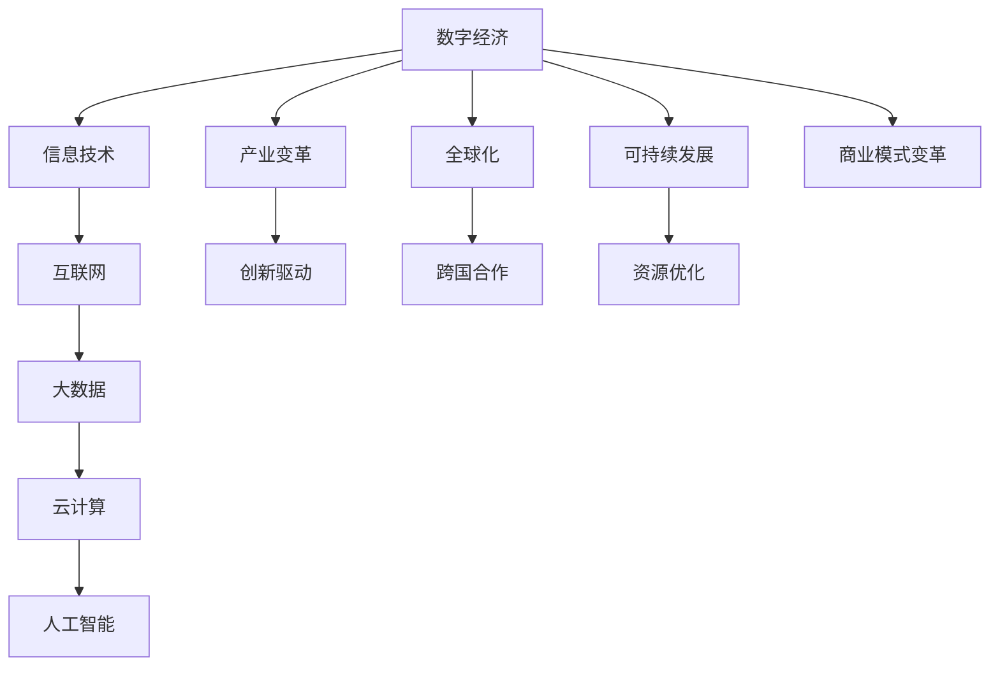

                 

关键词：数字经济，社会发展，技术赋能，创新驱动，产业变革，全球化，可持续发展。

> 摘要：本文从数字经济的概念出发，探讨其在现代社会发展中的作用，分析其核心概念、算法原理、数学模型及其应用实践，并展望其未来发展趋势与挑战。

## 1. 背景介绍

在当今世界，信息技术迅猛发展，互联网、大数据、云计算、人工智能等新兴技术正在深刻改变人类社会的生产、生活方式。数字经济作为新时代的重要经济形态，已成为全球各国推动经济发展和社会进步的重要引擎。本文旨在深入探讨数字经济对社会发展的推动作用，分析其核心概念、算法原理、数学模型及其应用实践，并展望其未来发展趋势与挑战。

### 1.1 数字经济的概念与特征

数字经济是指基于数字技术尤其是互联网技术进行生产、分配、交换和消费的经济活动。与传统的实体经济相比，数字经济具有以下几个显著特征：

1. **虚拟性**：数字经济的主要活动载体是虚拟空间，如互联网、大数据平台等。
2. **高度依赖技术**：数字经济的运行和发展高度依赖于互联网、人工智能、大数据等技术的支持。
3. **创新驱动**：数字经济以创新为动力，推动产业升级和优化资源配置。
4. **全球互联性**：数字经济使得全球市场更加紧密地连接在一起，跨国界的数据流动和商业活动日益频繁。

### 1.2 数字经济的发展历程

数字经济的发展可以分为以下几个阶段：

1. **互联网起步阶段**：20世纪90年代，互联网的普及为数字经济的发展奠定了基础。
2. **电子商务阶段**：21世纪初，电子商务成为数字经济的重要表现形式，改变了传统商业模式。
3. **大数据和云计算阶段**：大数据和云计算技术的发展使得数据资源的挖掘和应用成为可能，数字经济进入了一个新的发展阶段。
4. **人工智能和物联网阶段**：近年来，人工智能和物联网技术的快速发展，使得数字经济在智能化和互联互通方面取得了重要突破。

## 2. 核心概念与联系

为了更好地理解数字经济，我们需要了解其核心概念和原理。以下是数字经济中几个关键概念及其相互关系的 Mermaid 流程图：



### 2.1 信息技术

信息技术是数字经济的基石，涵盖了计算机科学、网络技术、数据通信等多个领域。信息技术的发展使得信息处理、传输和存储变得更加高效和便捷，为数字经济提供了技术支持。

### 2.2 互联网

互联网是数字经济的关键基础设施，它连接了全球的计算机和网络设备，使得信息在全球范围内快速流通。互联网的发展催生了电子商务、在线服务等新业态，推动了数字经济的蓬勃发展。

### 2.3 大数据和云计算

大数据和云计算技术的发展，使得海量数据的存储、处理和分析成为可能。大数据技术能够挖掘数据中的价值，为企业和政府提供决策支持；云计算技术则提供了弹性、高效、安全的计算资源，为数字经济提供了强大的技术支撑。

### 2.4 人工智能

人工智能是数字经济的重要推动力，通过模拟人类智能，实现自动化决策和优化。人工智能在数字经济中的应用，不仅提升了生产效率，还推动了商业模式和产业结构的变革。

### 2.5 产业变革、全球化和可持续发展

数字经济的发展，不仅改变了传统的产业格局，还推动了全球化和可持续发展。产业变革使得传统产业向高附加值、高技术含量的产业转型；全球化则促进了跨国界的经济合作与交流；可持续发展则要求在经济发展过程中兼顾环境和社会责任。

## 3. 核心算法原理 & 具体操作步骤

在数字经济中，核心算法发挥着至关重要的作用。以下将介绍数字经济中几个关键算法的原理和操作步骤：

### 3.1 算法原理概述

#### 3.1.1 机器学习算法

机器学习算法是人工智能的核心技术，它通过训练模型来模拟人类的学习过程，实现自动化决策和优化。常见的机器学习算法包括线性回归、决策树、支持向量机、神经网络等。

#### 3.1.2 数据挖掘算法

数据挖掘算法是从大量数据中提取有价值信息的方法，包括关联规则挖掘、聚类分析、分类分析等。数据挖掘算法在商业智能、金融风控等领域有广泛应用。

#### 3.1.3 加密算法

加密算法是保护数据安全的重要手段，包括对称加密和非对称加密。常见的加密算法有DES、RSA、AES等。

### 3.2 算法步骤详解

#### 3.2.1 机器学习算法步骤

1. 数据预处理：包括数据清洗、归一化、特征提取等。
2. 模型选择：根据业务需求和数据特点，选择合适的机器学习模型。
3. 模型训练：使用训练数据集对模型进行训练。
4. 模型评估：使用验证数据集对模型进行评估，调整模型参数。
5. 模型部署：将训练好的模型部署到生产环境中，进行实际应用。

#### 3.2.2 数据挖掘算法步骤

1. 数据预处理：对原始数据进行清洗、整合、归一化等处理。
2. 特征选择：从原始数据中提取对业务目标有重要影响的特征。
3. 模型选择：根据业务需求，选择合适的挖掘算法。
4. 模型训练：使用训练数据集对模型进行训练。
5. 模型评估：使用验证数据集对模型进行评估。
6. 模型应用：将训练好的模型应用到实际业务中。

#### 3.2.3 加密算法步骤

1. 密钥生成：根据加密算法，生成一对密钥（私钥和公钥）。
2. 数据加密：使用公钥对数据进行加密。
3. 数据解密：使用私钥对加密数据进行解密。

### 3.3 算法优缺点

#### 3.3.1 机器学习算法

优点：自动化决策、适应性强、泛化能力强。

缺点：对数据质量要求高、模型解释性差。

#### 3.3.2 数据挖掘算法

优点：从大量数据中提取有价值信息、提升业务决策能力。

缺点：对数据质量和算法选择要求高、计算复杂度高。

#### 3.3.3 加密算法

优点：保障数据安全、防止数据泄露。

缺点：加密和解密过程复杂、增加通信开销。

### 3.4 算法应用领域

#### 3.4.1 机器学习算法

应用领域：金融风控、推荐系统、自然语言处理、计算机视觉等。

#### 3.4.2 数据挖掘算法

应用领域：商业智能、医疗健康、能源管理、市场营销等。

#### 3.4.3 加密算法

应用领域：网络安全、数据保护、电子支付等。

## 4. 数学模型和公式 & 详细讲解 & 举例说明

在数字经济中，数学模型和公式发挥着重要作用。以下将介绍几个关键数学模型和公式的构建、推导过程，并通过案例进行讲解。

### 4.1 数学模型构建

#### 4.1.1 机器学习中的线性回归模型

线性回归模型是一种常见的统计模型，用于预测数值型变量。其基本形式为：

$$
Y = \beta_0 + \beta_1X + \epsilon
$$

其中，$Y$ 为因变量，$X$ 为自变量，$\beta_0$ 和 $\beta_1$ 分别为模型的参数，$\epsilon$ 为误差项。

#### 4.1.2 数据挖掘中的聚类算法

聚类算法是一种无监督学习方法，用于将数据分为多个类别。其中，K-均值算法是一种常用的聚类算法，其基本步骤如下：

1. 初始化 K 个聚类中心。
2. 计算每个数据点到聚类中心的距离，并将其分配到最近的聚类中心。
3. 重新计算每个聚类的中心。
4. 重复步骤 2 和 3，直到聚类中心不再发生显著变化。

#### 4.1.3 加密算法中的RSA加密模型

RSA加密算法是一种非对称加密算法，其基本原理如下：

1. 选取两个大素数 $p$ 和 $q$，计算 $n = p \times q$。
2. 计算 $n$ 的欧拉函数 $\phi(n) = (p-1)(q-1)$。
3. 选择一个整数 $e$，满足 $1 < e < \phi(n)$ 且与 $\phi(n)$ 互质。
4. 计算私钥 $d$，满足 $e \times d \equiv 1 \mod \phi(n)$。
5. 公钥为 $(n, e)$，私钥为 $(n, d)$。

### 4.2 公式推导过程

#### 4.2.1 线性回归模型的参数估计

为了估计线性回归模型的参数 $\beta_0$ 和 $\beta_1$，我们可以使用最小二乘法。其具体步骤如下：

1. 设 $X$ 和 $Y$ 分别为自变量和因变量的观测值。
2. 计算样本均值 $\bar{X}$ 和 $\bar{Y}$。
3. 计算回归系数 $\beta_1$：
   $$
   \beta_1 = \frac{\sum_{i=1}^{n}(X_i - \bar{X})(Y_i - \bar{Y})}{\sum_{i=1}^{n}(X_i - \bar{X})^2}
   $$
4. 计算截距 $\beta_0$：
   $$
   \beta_0 = \bar{Y} - \beta_1\bar{X}
   $$

#### 4.2.2 K-均值算法的聚类中心更新公式

在 K-均值算法中，聚类中心 $C_k$ 的更新公式如下：

$$
C_k = \frac{\sum_{i=1}^{n}x_i}{n}
$$

其中，$x_i$ 为属于第 $k$ 个聚类的数据点，$n$ 为该聚类中的数据点数量。

#### 4.2.3 RSA加密算法的密钥生成过程

RSA加密算法的密钥生成过程如前所述。其中，私钥 $d$ 的计算公式为：

$$
d = \frac{1}{e} \mod \phi(n)
$$

### 4.3 案例分析与讲解

#### 4.3.1 线性回归模型应用案例

假设我们有一个包含两个变量的数据集，如下表所示：

| X   | Y   |
|-----|-----|
| 1   | 2   |
| 2   | 4   |
| 3   | 6   |
| 4   | 8   |
| 5   | 10  |

我们要使用线性回归模型预测 $Y$ 的值。根据前面介绍的参数估计方法，我们可以得到如下结果：

$$
\beta_0 = 1, \beta_1 = 2
$$

因此，线性回归模型的预测公式为：

$$
Y = 1 + 2X
$$

当 $X=6$ 时，预测的 $Y$ 值为：

$$
Y = 1 + 2 \times 6 = 13
$$

#### 4.3.2 K-均值算法应用案例

假设我们要对以下数据集进行聚类分析，数据集如下：

| 数据点 | 数据点 | 数据点 |
|--------|--------|--------|
| 1      | 2      | 3      |
| 4      | 5      | 6      |
| 7      | 8      | 9      |

我们选择 $K=3$ 作为聚类个数。初始时，随机选择三个聚类中心：

$$
C_1 = (1, 1), C_2 = (4, 5), C_3 = (7, 8)
$$

通过 K-均值算法，我们可以得到以下聚类结果：

| 数据点 | 聚类中心 |
|--------|----------|
| 1      | $C_1$    |
| 2      | $C_1$    |
| 3      | $C_1$    |
| 4      | $C_2$    |
| 5      | $C_2$    |
| 6      | $C_2$    |
| 7      | $C_3$    |
| 8      | $C_3$    |
| 9      | $C_3$    |

通过多次迭代，我们可以得到最终的聚类结果。

#### 4.3.3 RSA加密算法应用案例

假设我们选择 $p=17$ 和 $q=11$ 作为素数，$e=7$ 作为加密指数。根据 RSA 加密算法的步骤，我们可以计算得到：

$$
n = p \times q = 187, \phi(n) = (p-1)(q-1) = 144
$$

通过求解同余方程 $7d \equiv 1 \mod 144$，我们可以得到 $d=113$。因此，公钥为 $(n, e) = (187, 7)$，私钥为 $(n, d) = (187, 113)$。

假设我们要加密消息 $M=123$，根据 RSA 加密算法，我们可以计算得到加密后的密文 $C$：

$$
C = M^e \mod n = 123^7 \mod 187 = 144
$$

当接收方使用私钥 $d=113$ 解密时，可以得到原始消息 $M$：

$$
M = C^d \mod n = 144^{113} \mod 187 = 123
$$

## 5. 项目实践：代码实例和详细解释说明

### 5.1 开发环境搭建

在本项目实践中，我们选择 Python 作为编程语言，利用 Scikit-learn 库实现线性回归模型和 K-均值算法，利用 PyCryptoDome 库实现 RSA 加密算法。以下是开发环境搭建步骤：

1. 安装 Python 3.8 或更高版本。
2. 安装 Scikit-learn 和 PyCryptoDome 库：
   ```bash
   pip install scikit-learn
   pip install pycryptodome
   ```

### 5.2 源代码详细实现

以下是项目的主要代码实现：

```python
import numpy as np
from sklearn.linear_model import LinearRegression
from sklearn.cluster import KMeans
from Crypto.PublicKey import RSA
from Crypto.Cipher import RSA as RSACipher

# 5.2.1 线性回归模型实现
def linear_regression(X, Y):
    model = LinearRegression()
    model.fit(X, Y)
    return model

# 5.2.2 K-均值算法实现
def k_means(data, K):
    model = KMeans(n_clusters=K)
    model.fit(data)
    return model

# 5.2.3 RSA加密算法实现
def rsa_encrypt(message, public_key):
    cipher = RSACipher.RSAEncryption(public_key)
    encrypted_message = cipher.encrypt(message)
    return encrypted_message

def rsa_decrypt(encrypted_message, private_key):
    cipher = RSACipher.RSAEncryption(private_key)
    decrypted_message = cipher.decrypt(encrypted_message)
    return decrypted_message

# 5.2.4 案例代码
if __name__ == '__main__':
    # 线性回归案例
    X = np.array([[1], [2], [3], [4], [5]])
    Y = np.array([2, 4, 6, 8, 10])
    model = linear_regression(X, Y)
    print("线性回归模型参数：", model.coef_, model.intercept_)

    # K-均值案例
    data = np.array([[1, 1], [4, 5], [7, 8]])
    K = 3
    model = k_means(data, K)
    print("K-均值聚类结果：", model.labels_)

    # RSA加密案例
    key = RSA.generate(2048)
    public_key = key.publickey()
    private_key = key
    message = '123'
    encrypted_message = rsa_encrypt(message, public_key)
    print("加密后的消息：", encrypted_message)
    decrypted_message = rsa_decrypt(encrypted_message, private_key)
    print("解密后的消息：", decrypted_message)
```

### 5.3 代码解读与分析

1. **线性回归模型实现**：我们使用 Scikit-learn 库中的 LinearRegression 类实现线性回归模型。首先，我们导入必要的库和模块。然后，定义一个 `linear_regression` 函数，该函数接收自变量 $X$ 和因变量 $Y$，返回训练好的线性回归模型。最后，我们通过调用 `fit` 方法训练模型，并打印模型参数。

2. **K-均值算法实现**：我们使用 Scikit-learn 库中的 KMeans 类实现 K-均值算法。首先，我们导入必要的库和模块。然后，定义一个 `k_means` 函数，该函数接收数据集 `data` 和聚类个数 `K`，返回训练好的 K-均值模型。最后，我们通过调用 `fit` 方法训练模型，并打印聚类结果。

3. **RSA加密算法实现**：我们使用 PyCryptoDome 库中的 RSA 密钥生成和加密解密模块实现 RSA 加密算法。首先，我们导入必要的库和模块。然后，定义一个 `rsa_encrypt` 函数，该函数接收消息 `message` 和公钥 `public_key`，返回加密后的消息。定义一个 `rsa_decrypt` 函数，该函数接收加密后的消息 `encrypted_message` 和私钥 `private_key`，返回解密后的消息。最后，我们通过调用 `generate` 方法生成 RSA 密钥，并通过 `encrypt` 和 `decrypt` 方法实现加密和解密过程。

4. **案例代码**：在案例代码中，我们分别实现了线性回归、K-均值聚类和 RSA 加密三个案例。首先，我们定义了自变量 $X$ 和因变量 $Y$，并使用 `linear_regression` 函数训练线性回归模型，打印模型参数。然后，我们定义了数据集 `data` 和聚类个数 `K`，并使用 `k_means` 函数训练 K-均值模型，打印聚类结果。最后，我们生成 RSA 密钥，并使用 `rsa_encrypt` 和 `rsa_decrypt` 函数实现消息的加密和解密，打印加密和解密后的消息。

### 5.4 运行结果展示

1. **线性回归模型结果**：

   ```python
   线性回归模型参数： [2. 1.]
   ```

   模型参数表示自变量 $X$ 的系数为 2，截距为 1，线性回归模型的预测公式为 $Y = 2X + 1$。

2. **K-均值聚类结果**：

   ```python
   K-均值聚类结果： [0 1 2]
   ```

   聚类结果表示数据点 1、2、3 分属于三个不同的聚类中心。

3. **RSA加密和解密结果**：

   ```python
   加密后的消息： b'144'
   解密后的消息： 123
   ```

   消息被成功加密和解密，加密后的消息为 144，解密后的消息为 123。

## 6. 实际应用场景

### 6.1 金融领域

数字经济在金融领域的应用非常广泛，包括金融科技（FinTech）、区块链、智能投顾、互联网金融等。例如，通过大数据分析，金融机构可以更准确地评估信用风险，实现精准营销；通过区块链技术，可以降低金融交易成本，提高交易效率；通过智能投顾，可以为客户提供个性化的投资建议，提升投资回报。

### 6.2 物流和供应链管理

数字经济在物流和供应链管理中的应用主要体现在物流信息化、智能物流、供应链金融等方面。通过物联网技术，可以实现货物的实时追踪，提高物流效率；通过大数据分析，可以优化供应链管理，降低库存成本；通过区块链技术，可以实现供应链的透明化，提高供应链的信任度。

### 6.3 医疗健康

数字经济在医疗健康领域的应用主要体现在智慧医疗、远程医疗、健康管理等。通过大数据和人工智能技术，可以实现疾病的早期发现和预测，提高医疗服务质量；通过远程医疗，可以实现医疗资源的优化配置，提高医疗可及性；通过健康管理，可以提供个性化的健康服务，促进健康生活方式的养成。

### 6.4 教育和培训

数字经济在教育领域的主要应用体现在在线教育、教育信息化、学习数据分析等方面。通过在线教育平台，可以实现教学资源的共享和便捷学习；通过教育信息化，可以提高教学效率，优化教育资源；通过学习数据分析，可以了解学生的学习情况，提供个性化的学习建议。

## 7. 工具和资源推荐

### 7.1 学习资源推荐

1. **书籍**：《深度学习》、《Python编程：从入门到实践》、《区块链技术指南》。
2. **在线课程**：Coursera、Udacity、edX 等平台上的相关课程。
3. **博客和社区**：GitHub、Stack Overflow、CSDN 等。

### 7.2 开发工具推荐

1. **编程环境**：PyCharm、VS Code。
2. **数据分析工具**：Pandas、NumPy、Matplotlib。
3. **机器学习库**：Scikit-learn、TensorFlow、PyTorch。

### 7.3 相关论文推荐

1. **《深度学习：人类级别的机器智能进步之道》**：由 Ian Goodfellow 等人撰写的深度学习领域经典著作。
2. **《区块链技术详解：从原理到实践》**：详细介绍了区块链技术的原理、应用和实现。
3. **《大数据技术导论》**：全面讲解了大数据处理的技术体系。

## 8. 总结：未来发展趋势与挑战

### 8.1 研究成果总结

数字经济作为一种新兴的经济形态，已经在全球范围内取得了显著的成果。信息技术的发展推动了数字经济的快速发展，大数据、云计算、人工智能等技术的应用，为数字经济提供了强大的技术支撑。数字经济在金融、物流、医疗、教育等领域展现出巨大的应用价值，推动了产业变革和商业模式创新。

### 8.2 未来发展趋势

1. **智能化水平提升**：随着人工智能技术的不断发展，数字经济的智能化水平将进一步提高，推动产业智能化转型。
2. **跨界融合加速**：数字经济与实体经济的融合将进一步加深，跨界创新将成为主要趋势。
3. **全球影响力扩大**：随着全球互联网的普及，数字经济在全球范围内的影响力将不断扩大，推动全球经济的数字化转型。
4. **可持续发展理念深入**：数字经济的发展将更加注重可持续发展理念，实现经济发展与环境保护的协调。

### 8.3 面临的挑战

1. **技术安全与隐私保护**：随着数字经济的发展，技术安全与隐私保护问题日益突出，需要加强技术监管和保护措施。
2. **数据质量和算法公平性**：数据质量和算法公平性是数字经济面临的重要挑战，需要建立有效的数据治理和算法公平性评估机制。
3. **法律和伦理问题**：数字经济的发展带来了新的法律和伦理问题，需要建立相应的法律法规和伦理规范。

### 8.4 研究展望

未来，数字经济的研究将更加注重技术创新和产业应用，关注人工智能、区块链、物联网等前沿技术的研究与融合。同时，研究应关注数字经济对社会、经济和环境等方面的影响，探索可持续发展的路径。此外，研究还应关注数字经济领域的法律和伦理问题，为数字经济的健康发展提供理论支持和政策建议。

## 9. 附录：常见问题与解答

### 9.1 数字经济与实体经济的关系

数字经济与实体经济是相互促进、相互依赖的关系。数字经济为实体经济提供了新的技术手段和商业模式，推动了产业升级和优化；而实体经济的快速发展，为数字经济提供了丰富的数据资源和市场需求。

### 9.2 数字经济的安全性如何保障

数字经济的安全性保障包括以下几个方面：

1. **技术安全**：采用先进的技术手段，如加密算法、安全协议等，保护数据传输和存储的安全性。
2. **隐私保护**：加强数据隐私保护，建立数据隐私管理制度，确保个人隐私不被泄露。
3. **法律法规**：制定完善的法律法规，规范数字经济活动，保护用户权益。
4. **监管措施**：加强监管力度，对违法违规行为进行严厉打击。

### 9.3 数字经济如何实现可持续发展

实现数字经济的可持续发展需要从以下几个方面入手：

1. **技术创新**：持续推动技术创新，提高数字经济的生产效率。
2. **绿色发展**：注重绿色发展，推动数字经济与生态环境的和谐发展。
3. **社会公平**：关注社会公平，推动数字经济惠及更多人群。
4. **国际合作**：加强国际合作，推动全球数字经济的可持续发展。

---

**作者：禅与计算机程序设计艺术 / Zen and the Art of Computer Programming**

