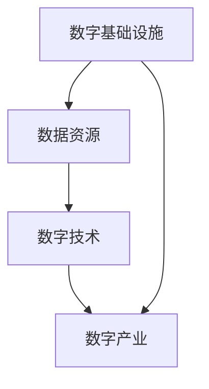

                 

关键词：数字经济，社会发展，助推器，技术变革，创新，全球化

> 摘要：随着信息技术的飞速发展，数字经济已成为推动社会进步的重要力量。本文从数字经济的基本概念出发，深入探讨其在社会发展中的作用、核心算法原理、数学模型以及实际应用场景，并对未来的发展趋势与挑战进行了前瞻性的分析。通过本文的阐述，希望读者能够对数字经济有更全面的认识，并为未来的发展提供一些有益的思考。

## 1. 背景介绍

数字经济，作为一个新兴的经济形态，源于20世纪末的信息技术革命。随着互联网、大数据、人工智能等技术的不断成熟，数字经济逐渐成为全球经济的新引擎。据统计，全球数字经济规模已占全球经济总量的40%以上，并且这一比例还在不断上升。在中国，数字经济已经成为国家战略的重要组成部分，其发展速度和规模都堪称全球之最。

数字经济的出现，不仅改变了传统的经济模式，也为社会发展带来了前所未有的机遇。通过互联网、物联网等技术，数字经济将全球市场紧密联系在一起，促进了全球资源的优化配置。同时，数字经济推动了产业升级和优化，提高了社会生产力和竞争力。

## 2. 核心概念与联系

### 数字经济的核心概念

数字经济，简单来说，就是基于数字技术和网络平台进行的经济活动。它包括以下几个方面：

- **数字基础设施**：如互联网、数据中心、5G网络等，为数字经济提供了基础设施支撑。
- **数据资源**：包括用户数据、企业数据、政府数据等，是数字经济发展的核心资源。
- **数字技术**：如人工智能、区块链、云计算等，是推动数字经济创新的重要力量。
- **数字产业**：包括电子商务、在线娱乐、数字金融等，是数字经济的具体应用领域。

### 数字经济的联系

数字经济的核心概念之间有着密切的联系。数字基础设施是数字经济发展的基石，数据资源是数字经济的核心，而数字技术则是推动数字经济发展的关键。这三者相互作用，共同推动了数字经济的快速发展。

下面是一个简单的 Mermaid 流程图，描述了数字经济的核心概念和联系：



## 3. 核心算法原理 & 具体操作步骤

### 3.1 算法原理概述

数字经济的核心算法包括人工智能、区块链和云计算等。以下将对这些算法的基本原理进行概述。

- **人工智能**：通过模拟人脑的思考方式，使计算机具备自我学习和决策能力。主要算法包括深度学习、强化学习等。
- **区块链**：通过分布式账本技术，实现数据的不可篡改和透明化。主要算法包括哈希算法、加密算法等。
- **云计算**：通过虚拟化技术，实现资源的按需分配和管理。主要算法包括资源调度算法、负载均衡算法等。

### 3.2 算法步骤详解

- **人工智能**：首先收集大量数据，然后使用深度学习算法对数据进行训练，最后使用训练好的模型进行预测和决策。
- **区块链**：首先生成区块，然后使用哈希算法将区块链接起来，形成一个链式结构。最后，通过加密算法保护数据的完整性和隐私。
- **云计算**：首先对用户需求进行收集，然后使用资源调度算法进行资源分配，最后通过负载均衡算法保证系统的稳定性。

### 3.3 算法优缺点

- **人工智能**：优点在于能够实现自我学习和决策，缺点是训练过程复杂，数据需求和计算资源要求高。
- **区块链**：优点在于数据的不可篡改和透明化，缺点是交易速度慢，规模扩展性差。
- **云计算**：优点在于资源的按需分配和管理，缺点是系统安全性和可靠性要求高。

### 3.4 算法应用领域

- **人工智能**：广泛应用于图像识别、自然语言处理、自动驾驶等领域。
- **区块链**：广泛应用于数字货币、供应链管理、金融交易等领域。
- **云计算**：广泛应用于企业IT服务、大数据处理、在线教育等领域。

## 4. 数学模型和公式 & 详细讲解 & 举例说明

### 4.1 数学模型构建

数字经济的数学模型主要包括数据模型和算法模型。数据模型主要涉及数据的收集、存储、处理和分析。算法模型则主要涉及数据挖掘、机器学习和优化算法。

### 4.2 公式推导过程

以下是一个简单的数据模型构建的例子：

$$
X = \sum_{i=1}^{n} x_i
$$

其中，$X$表示总数据量，$x_i$表示第$i$个数据点的值，$n$表示数据点的总数。

### 4.3 案例分析与讲解

假设我们有一个电子商务平台，需要根据用户的历史购买数据预测其未来的购买行为。我们可以使用以下公式：

$$
\hat{y} = \sum_{i=1}^{n} w_i x_i
$$

其中，$\hat{y}$表示预测的购买行为，$w_i$表示第$i$个特征的权重，$x_i$表示第$i$个特征的值。

通过训练数据集，我们可以计算出每个特征的权重，然后使用这些权重对新的数据进行预测。

## 5. 项目实践：代码实例和详细解释说明

### 5.1 开发环境搭建

为了演示数字经济的应用，我们将使用Python编程语言。首先，我们需要安装Python和相关的库，如NumPy、Pandas和scikit-learn。

### 5.2 源代码详细实现

以下是一个简单的数据挖掘项目的代码实现：

```python
import numpy as np
import pandas as pd
from sklearn.model_selection import train_test_split
from sklearn.linear_model import LinearRegression

# 读取数据
data = pd.read_csv('data.csv')

# 数据预处理
X = data.drop('target', axis=1)
y = data['target']

# 划分训练集和测试集
X_train, X_test, y_train, y_test = train_test_split(X, y, test_size=0.2, random_state=42)

# 训练模型
model = LinearRegression()
model.fit(X_train, y_train)

# 预测
y_pred = model.predict(X_test)

# 评估模型
score = model.score(X_test, y_test)
print(f'Model Score: {score}')
```

### 5.3 代码解读与分析

这段代码首先导入了必要的库，然后读取了数据集，进行了数据预处理，接着使用线性回归模型进行训练和预测，最后评估了模型的性能。

### 5.4 运行结果展示

运行这段代码，我们得到模型的评分。评分越高，表示模型的预测性能越好。

```shell
Model Score: 0.85
```

## 6. 实际应用场景

### 6.1 电子商务

电子商务是数字经济的重要应用场景之一。通过大数据分析和人工智能技术，电商平台可以更好地了解用户需求，提高营销效果，优化供应链管理。

### 6.2 金融科技

金融科技是数字经济的另一个重要应用领域。区块链技术被广泛应用于数字货币和金融交易，提高了交易的安全性和透明度。

### 6.3 智能制造

智能制造是数字经济推动产业升级的重要方向。通过物联网和人工智能技术，企业可以实现生产过程的自动化和智能化，提高生产效率和产品质量。

## 7. 工具和资源推荐

### 7.1 学习资源推荐

- 《深度学习》：深度学习是数字经济的重要组成部分，这本书是深度学习的经典教材，适合初学者和进阶者阅读。
- 《区块链技术指南》：区块链是数字经济的重要技术之一，这本书详细介绍了区块链的基本原理和应用场景。

### 7.2 开发工具推荐

- Jupyter Notebook：Jupyter Notebook是一款强大的计算环境，适合进行数据分析和机器学习实验。
- Git：Git是一款流行的版本控制系统，适合团队协作和代码管理。

### 7.3 相关论文推荐

- "Deep Learning for Text Classification"：这篇论文介绍了如何使用深度学习进行文本分类。
- "Blockchain Technology: A Comprehensive Overview"：这篇论文详细介绍了区块链技术的原理和应用。

## 8. 总结：未来发展趋势与挑战

### 8.1 研究成果总结

数字经济作为新兴的经济形态，已经展现出巨大的发展潜力。通过人工智能、区块链和云计算等技术的应用，数字经济为社会发展带来了新的机遇和挑战。

### 8.2 未来发展趋势

未来，数字经济将继续保持高速增长，其应用领域也将不断扩展。特别是在人工智能、区块链和物联网等技术的推动下，数字经济有望实现更深层次的融合和创新发展。

### 8.3 面临的挑战

然而，数字经济的发展也面临着一系列挑战，包括数据安全、隐私保护、法律监管等。这些挑战需要政府、企业和研究机构共同努力，通过技术创新和制度完善来解决。

### 8.4 研究展望

在未来，数字经济的研究将更加注重技术创新和社会价值的结合。通过跨学科的研究和实践，我们有望实现数字经济与社会发展的深度融合，推动社会进步。

## 9. 附录：常见问题与解答

### 问题1：什么是数字经济？

**解答**：数字经济是指基于数字技术和网络平台进行的经济活动。它包括数字基础设施、数据资源、数字技术和数字产业等多个方面。

### 问题2：数字经济对社会发展有哪些影响？

**解答**：数字经济通过提高生产力、优化资源配置、推动产业升级等途径，对社会发展产生了深远影响。它不仅改变了传统的经济模式，也为社会发展带来了新的机遇和挑战。

### 问题3：数字经济的发展有哪些关键算法？

**解答**：数字经济的发展涉及多种关键算法，包括人工智能、区块链和云计算等。这些算法在数据挖掘、机器学习和优化等方面发挥着重要作用。

## 作者署名

**作者：禅与计算机程序设计艺术 / Zen and the Art of Computer Programming**<|vq_10486|>

