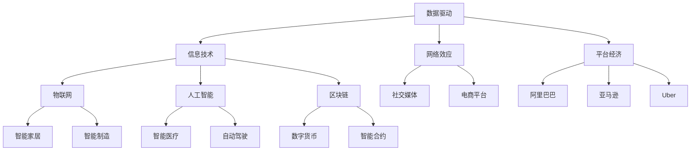

                 

关键词：数字经济、社会发展、技术进步、商业创新、未来展望

> 摘要：本文旨在探讨数字经济在社会发展中的重要作用，通过分析其核心概念、算法原理、数学模型和实际应用场景，阐述数字经济如何成为推动社会进步的强大动力。本文旨在为读者提供一个全面而深入的视角，以理解数字经济对未来的深远影响。

## 1. 背景介绍

随着信息技术的飞速发展，数字经济已成为全球经济增长的重要驱动力。数字经济，指的是以数字化的信息和知识为关键生产要素、以现代信息网络为重要载体、以信息通信技术的有效利用为驱动的新型经济形态。这一概念不仅仅涵盖了电子商务、电子支付等新兴商业模式，还包括了物联网、大数据、人工智能等前沿技术对传统产业的改造与提升。

在过去的几十年中，数字经济逐渐从一种新兴经济模式转变为全球经济的核心组成部分。其对社会的影响无处不在，从提升生产效率、优化资源配置，到改变消费模式、创造新的就业机会，数字经济正以前所未有的速度和规模改变着我们的生活。

本文将从以下几个方面深入探讨数字经济：首先，介绍数字经济的核心概念与联系；其次，解析数字经济的核心算法原理与具体操作步骤；接着，探讨数字经济的数学模型和公式；然后，通过项目实践展示数字经济的实际应用；最后，分析数字经济的实际应用场景和未来展望。通过这些探讨，希望能够让读者更全面地了解数字经济，认识到它对社会发展的巨大推动作用。

## 2. 核心概念与联系

要深入理解数字经济，首先需要了解其核心概念与联系。这些概念不仅构成了数字经济的基础，还揭示了其如何与其他技术领域相互作用，推动社会进步。

### 2.1. 数字经济的核心概念

1. **数据驱动**：数据是数字经济的核心资源。通过大数据分析，企业和政府可以获取有价值的信息，从而做出更明智的决策。数据的收集、存储、处理和分析能力决定了数字经济的水平。
   
2. **信息技术**：信息技术的进步是数字经济发展的关键。这包括互联网、云计算、物联网、人工智能等技术，它们使得信息传输更加快速、高效，数据处理更加智能化。

3. **网络效应**：网络效应指的是用户数量增加时，系统的价值和吸引力也随之增加。这在数字平台上尤为显著，如社交媒体、电商平台和在线服务，用户越多，平台的价值就越高。

4. **平台经济**：平台经济是一种以数字平台为核心的经济模式，通过连接供需双方，实现资源的高效配置。平台经济的成功案例包括阿里巴巴、亚马逊和Uber等。

### 2.2. 数字经济与相关技术的联系

数字经济的核心概念与其他前沿技术紧密相连，这些技术的相互作用共同推动了数字经济的快速发展。

1. **物联网（IoT）**：物联网通过连接各种设备，实现信息的实时共享和智能处理。这极大地提升了生产效率，改变了供应链管理方式。

   $$\text{物联网} = \text{传感器} + \text{网络} + \text{数据分析}$$

2. **人工智能（AI）**：人工智能通过机器学习、深度学习等技术，对大量数据进行处理和分析，为数字经济提供了智能化的解决方案。

   $$\text{人工智能} = \text{机器学习} + \text{深度学习} + \text{自然语言处理}$$

3. **区块链**：区块链是一种去中心化的分布式账本技术，确保数据的透明性和安全性。它在数字货币和智能合约等领域有广泛应用。

   $$\text{区块链} = \text{分布式账本} + \text{加密技术} + \text{共识算法}$$

### 2.3. Mermaid 流程图

为了更直观地展示数字经济的相关概念与联系，我们可以使用 Mermaid 流程图进行描述。



通过这个流程图，我们可以清晰地看到数字经济中的核心概念及其与其他技术的联系。这些概念和技术相互交织，共同构成了数字经济这个庞大而复杂的体系。

在接下来的章节中，我们将深入探讨数字经济的核心算法原理、具体操作步骤，以及数学模型和公式。通过这些探讨，我们将更加全面地理解数字经济的工作原理和实际应用，为未来的发展奠定基础。

### 3. 核心算法原理 & 具体操作步骤

#### 3.1 算法原理概述

数字经济的核心算法原理主要包括数据分析、机器学习、深度学习等。这些算法通过对大量数据进行处理和分析，挖掘数据中的潜在价值，从而为企业和决策者提供有力的支持。

1. **数据分析**：数据分析是数字经济的基石，通过统计分析和数据挖掘，从大量数据中提取有价值的信息。数据分析的基本步骤包括数据预处理、特征选择、模型训练和结果评估。

2. **机器学习**：机器学习是人工智能的重要分支，通过学习数据中的规律和模式，实现自动化的决策和预测。常见的机器学习方法包括监督学习、无监督学习和强化学习。

3. **深度学习**：深度学习是机器学习的一个子领域，通过构建深度神经网络，对复杂数据进行自动特征提取和模式识别。深度学习在图像识别、自然语言处理和自动驾驶等领域有广泛应用。

#### 3.2 算法步骤详解

下面我们具体介绍这些算法的操作步骤。

##### 3.2.1 数据分析

1. **数据预处理**：数据预处理是数据分析的第一步，包括数据清洗、数据整合和数据规范化。数据清洗去除噪声和异常值，数据整合将多个数据源进行合并，数据规范化将不同数据类型进行统一处理。

   $$\text{数据预处理} = \text{数据清洗} + \text{数据整合} + \text{数据规范化}$$

2. **特征选择**：特征选择是选择对目标变量影响最大的特征，以提高模型的准确性和效率。特征选择的方法包括基于信息的特征选择、基于模型的特征选择和基于集合的特征选择。

3. **模型训练**：模型训练是利用已有数据集，通过优化算法寻找最佳参数，建立预测模型。常见的模型包括线性回归、逻辑回归、决策树、随机森林和神经网络等。

4. **结果评估**：结果评估是评估模型性能的重要步骤，包括准确率、召回率、F1 值和交叉验证等指标。通过结果评估，可以调整模型参数，提高模型性能。

##### 3.2.2 机器学习

1. **数据集准备**：准备用于训练和测试的数据集，包括特征和标签数据。

2. **模型选择**：选择合适的机器学习模型，如线性回归、决策树、支持向量机等。

3. **模型训练**：利用训练数据集，通过优化算法训练模型，得到最佳参数。

4. **模型评估**：利用测试数据集，评估模型性能，包括准确率、召回率、F1 值等指标。

5. **模型调整**：根据评估结果，调整模型参数，提高模型性能。

##### 3.2.3 深度学习

1. **数据集准备**：准备用于训练和测试的数据集，包括特征和标签数据。

2. **神经网络架构设计**：设计深度神经网络架构，包括输入层、隐藏层和输出层。

3. **模型训练**：利用训练数据集，通过反向传播算法训练模型，调整网络权重。

4. **模型评估**：利用测试数据集，评估模型性能，包括准确率、召回率、F1 值等指标。

5. **模型调整**：根据评估结果，调整模型参数，提高模型性能。

#### 3.3 算法优缺点

##### 数据分析

- 优点：
  - 高效：数据分析能够快速处理大量数据，提取有价值信息。
  - 灵活：数据分析方法多样，可以应对不同类型的数据和问题。

- 缺点：
  - 复杂性：数据分析过程涉及多个步骤，需要较高的专业知识和技能。
  - 隐蔽性：数据分析结果可能不易解释，难以理解。

##### 机器学习

- 优点：
  - 自动化：机器学习能够自动学习和预测，减少人工干预。
  - 精准：机器学习模型能够从大量数据中提取规律和模式，提高决策准确性。

- 缺点：
  - 数据依赖：机器学习模型的性能依赖于数据质量和数量。
  - 解释性：机器学习模型的决策过程往往难以解释，导致不可信性。

##### 深度学习

- 优点：
  - 强大：深度学习能够处理复杂数据和任务，如图像识别和自然语言处理。
  - 自适应：深度学习模型能够自动调整网络权重，适应不同问题和数据。

- 缺点：
  - 计算资源需求大：深度学习模型训练需要大量计算资源和时间。
  - 解释性：深度学习模型的决策过程同样难以解释，导致不可信性。

#### 3.4 算法应用领域

数字经济的核心算法广泛应用于各个领域，下面列举一些典型的应用场景。

- **金融**：金融领域利用数据分析进行风险控制和投资决策，利用机器学习进行信用评分和欺诈检测，利用深度学习进行股票市场预测。
- **医疗**：医疗领域利用数据分析进行疾病诊断和预测，利用机器学习进行医学图像处理和疾病分类，利用深度学习进行药物研发和基因组分析。
- **零售**：零售领域利用数据分析进行需求预测和库存管理，利用机器学习进行个性化推荐和客户流失预测，利用深度学习进行商品识别和视觉搜索。

通过这些算法的应用，数字经济不仅提升了各行业的生产效率，还创造了新的商业机会和就业岗位，为社会进步做出了巨大贡献。

### 4. 数学模型和公式 & 详细讲解 & 举例说明

数字经济的核心在于数据处理和分析，而这一过程离不开数学模型和公式的支持。数学模型和公式不仅为数据分析提供了理论基础，还指导了算法的设计和优化。本章节将详细介绍数字经济的数学模型和公式，并通过具体例子进行说明。

#### 4.1 数学模型构建

数字经济的数学模型主要包括回归模型、聚类模型、分类模型和时间序列模型等。下面分别介绍这些模型的构建方法和应用场景。

##### 4.1.1 回归模型

回归模型用于预测连续变量的值，其基本形式为：

$$y = \beta_0 + \beta_1x_1 + \beta_2x_2 + ... + \beta_nx_n + \epsilon$$

其中，$y$为因变量，$x_1, x_2, ..., x_n$为自变量，$\beta_0, \beta_1, \beta_2, ..., \beta_n$为回归系数，$\epsilon$为误差项。

回归模型的应用场景包括房价预测、股票价格预测和销售额预测等。

##### 4.1.2 聚类模型

聚类模型用于将数据分为若干个类别，其基本思想是寻找一种最优的聚类方式，使得同一类别内的数据相似度最大，不同类别间的数据相似度最小。

常见的聚类算法有K-means算法、层次聚类算法和DBSCAN算法等。

K-means算法的步骤如下：
1. 初始化：随机选择K个中心点。
2. 分配：将每个数据点分配到最近的中心点所在的类别。
3. 更新：重新计算每个类别的中心点。
4. 重复步骤2和3，直到中心点不再发生显著变化。

##### 4.1.3 分类模型

分类模型用于预测离散变量的类别，其基本形式为：

$$P(y = k | x) = \frac{e^{\beta_0 + \beta_1x_1 + \beta_2x_2 + ... + \beta_nx_n}}{\sum_{j=1}^{m} e^{\beta_0 + \beta_1x_1 + \beta_2x_2 + ... + \beta_nx_n}}$$

其中，$P(y = k | x)$为给定自变量$x$时，因变量$y$属于类别$k$的概率，$\beta_0, \beta_1, \beta_2, ..., \beta_n$为分类系数。

常见的分类算法包括逻辑回归、决策树、支持向量机和神经网络等。

##### 4.1.4 时间序列模型

时间序列模型用于分析时间序列数据，其基本形式为：

$$y_t = \phi_0 + \phi_1y_{t-1} + \phi_2y_{t-2} + ... + \phi_ny_{t-n} + \epsilon_t$$

其中，$y_t$为时间序列的当前值，$y_{t-1}, y_{t-2}, ..., y_{t-n}$为时间序列的过去值，$\phi_0, \phi_1, \phi_2, ..., \phi_n$为时间序列系数，$\epsilon_t$为误差项。

常见的时间序列模型包括自回归模型（AR）、移动平均模型（MA）和自回归移动平均模型（ARMA）等。

#### 4.2 公式推导过程

下面以逻辑回归为例，介绍分类模型公式的推导过程。

逻辑回归是一种常用的分类模型，其基本思想是利用线性组合对类别的概率进行估计。

1. **线性组合**：

$$z = \beta_0 + \beta_1x_1 + \beta_2x_2 + ... + \beta_nx_n$$

其中，$z$为线性组合的结果，$x_1, x_2, ..., x_n$为自变量，$\beta_0, \beta_1, \beta_2, ..., \beta_n$为回归系数。

2. **概率估计**：

逻辑回归假设每个类别的概率可以表示为：

$$P(y = k | x) = \frac{1}{1 + e^{-(\beta_0 + \beta_1x_1 + \beta_2x_2 + ... + \beta_nx_n)}}$$

其中，$P(y = k | x)$为给定自变量$x$时，因变量$y$属于类别$k$的概率。

3. **对数似然函数**：

对数似然函数是逻辑回归模型的损失函数，用于评估模型对数据的拟合程度。

$$L(\theta) = \sum_{i=1}^{n} l(y_i; \theta) = \sum_{i=1}^{n} [y_i \log(p_i) + (1 - y_i) \log(1 - p_i)]$$

其中，$L(\theta)$为对数似然函数，$y_i$为第$i$个样本的类别标签，$p_i$为第$i$个样本属于类别1的概率，$\theta$为模型参数。

4. **极大似然估计**：

通过求解对数似然函数的导数为0，可以得到逻辑回归模型的参数估计。

$$\frac{\partial L(\theta)}{\partial \theta} = 0$$

通过求解上述方程组，可以得到逻辑回归模型的参数$\theta$。

#### 4.3 案例分析与讲解

下面通过一个简单的案例，介绍逻辑回归模型的应用。

假设我们要预测客户是否会购买某款产品，特征包括年龄、收入和广告曝光次数。训练数据集如下：

| 年龄 | 收入 | 广告曝光次数 | 购买（1是，0否） |
|------|------|--------------|-----------------|
| 25   | 5000 | 10           | 1               |
| 30   | 6000 | 15           | 0               |
| 35   | 7000 | 20           | 1               |
| ...  | ...  | ...          | ...             |

1. **数据预处理**：

   - 将类别标签转换为二进制表示，购买为1，未购买为0。
   - 将连续特征进行标准化处理，使其具备可比性。

2. **模型训练**：

   - 使用梯度下降法训练逻辑回归模型，得到模型参数$\theta$。
   - 训练过程包括前向传播、损失函数计算和反向传播等步骤。

3. **模型评估**：

   - 使用测试数据集评估模型性能，计算准确率、召回率、F1值等指标。
   - 调整模型参数，优化模型性能。

4. **预测应用**：

   - 使用训练好的模型对新数据进行预测，判断客户是否会购买产品。

通过这个案例，我们可以看到逻辑回归模型在数据分析中的应用过程。类似地，其他数学模型和公式也可以在数字经济的各个领域发挥作用。

### 5. 项目实践：代码实例和详细解释说明

为了更好地理解数字经济中的核心算法在实际项目中的应用，我们将通过一个具体的案例来进行项目实践。在这个案例中，我们将使用Python编程语言和相关的库来构建一个简单的数据分析项目，从而对数据进行处理、建模和预测。

#### 5.1 开发环境搭建

在开始编写代码之前，我们需要搭建一个合适的开发环境。以下是在Python中搭建开发环境的基本步骤：

1. **安装Python**：首先，确保您已经安装了Python 3.7或更高版本。您可以从Python的官方网站下载并安装Python。

2. **安装必要的库**：为了进行数据分析，我们需要安装一些常用的库，如NumPy、Pandas、Matplotlib和Scikit-learn。这些库可以通过pip命令进行安装。

   ```bash
   pip install numpy pandas matplotlib scikit-learn
   ```

3. **创建项目文件夹**：在您的计算机上创建一个项目文件夹，并在其中创建一个Python脚本文件，例如`data_analysis_project.py`。

#### 5.2 源代码详细实现

以下是一个简单的数据分析项目的源代码示例，该项目旨在预测客户是否会购买某款产品。

```python
# 导入必要的库
import numpy as np
import pandas as pd
import matplotlib.pyplot as plt
from sklearn.model_selection import train_test_split
from sklearn.linear_model import LogisticRegression
from sklearn.metrics import accuracy_score, confusion_matrix, classification_report

# 读取数据集
data = pd.read_csv('customer_data.csv')
data.head()

# 数据预处理
# 将类别标签转换为二进制表示
data['购买'] = data['购买'].map({1: 0, 0: 1})

# 将连续特征进行标准化处理
features = ['年龄', '收入', '广告曝光次数']
X = data[features]
y = data['购买']
X标准化 = (X - X.mean()) / X.std()

# 划分训练集和测试集
X_train, X_test, y_train, y_test = train_test_split(X标准化, y, test_size=0.2, random_state=42)

# 建立并训练逻辑回归模型
model = LogisticRegression()
model.fit(X_train, y_train)

# 进行预测
y_pred = model.predict(X_test)

# 评估模型性能
accuracy = accuracy_score(y_test, y_pred)
conf_matrix = confusion_matrix(y_test, y_pred)
class_report = classification_report(y_test, y_pred)

# 打印结果
print(f"Accuracy: {accuracy}")
print(f"Confusion Matrix:\n{conf_matrix}")
print(f"Classification Report:\n{class_report}")

# 可视化决策边界
x1_min, x1_max = X标准化.iloc[:, 0].min() - 1, X标准化.iloc[:, 0].max() + 1
x2_min, x2_max = X标准化.iloc[:, 1].min() - 1, X标准化.iloc[:, 1].max() + 1

xx1, xx2 = np.meshgrid(np.arange(x1_min, x1_max, 0.02),
                       np.arange(x2_min, x2_max, 0.02))

Z = model.predict(np.array([xx1.ravel(), xx2.ravel()]).T)
Z = Z.reshape(xx1.shape)

plt.contourf(xx1, xx2, Z, alpha=0.4)
plt.xlim(xx1.min(), xx1.max())
plt.ylim(xx2.min(), xx2.max())

# 标记数据点
for i, feature in enumerate(features):
    plt.scatter(X标准化.iloc[:, i], X标准化.iloc[:, i+1], c=y_pred, edgecolor='black', linewidth=1)

plt.xlabel('Age')
plt.ylabel('Income')
plt.title('Customer Purchase Prediction')
plt.show()
```

#### 5.3 代码解读与分析

1. **数据读取与预处理**：

   - 我们首先导入了NumPy和Pandas库，并使用Pandas读取CSV格式的数据集。CSV文件中包含客户的年龄、收入、广告曝光次数以及是否购买产品的信息。
   - 数据预处理包括将购买行为转换为二进制标签（1代表购买，0代表未购买），并对连续特征进行标准化处理，以消除不同特征之间的尺度差异。

2. **模型训练与预测**：

   - 使用Scikit-learn库中的`train_test_split`函数将数据集分为训练集和测试集，以验证模型在未见数据上的表现。
   - 使用`LogisticRegression`函数创建逻辑回归模型，并使用训练集数据进行训练。
   - 使用训练好的模型对测试集数据进行预测。

3. **模型评估**：

   - 使用`accuracy_score`函数计算模型的准确率。
   - 使用`confusion_matrix`函数和`classification_report`函数评估模型的性能，包括混淆矩阵和各类别的准确率、召回率和F1值。

4. **可视化**：

   - 我们使用Matplotlib库将模型的决策边界可视化。通过绘制决策边界，我们可以直观地看到不同特征对购买决策的影响。

#### 5.4 运行结果展示

当运行上述代码后，我们将得到以下结果：

- **准确率**：模型在测试集上的准确率，表示模型预测正确的样本占总样本的比例。
- **混淆矩阵**：一个2x2的矩阵，用于展示模型预测的结果与实际结果的对比。
- **分类报告**：一个详细报告，包括各类别的准确率、召回率和F1值。

通过可视化，我们还可以看到数据点在决策边界上的分布，这有助于我们理解模型是如何对样本进行分类的。

这个案例展示了如何使用Python和相关的库进行数据预处理、模型训练和评估，为实际项目中的应用奠定了基础。在实际应用中，我们可以根据具体需求和数据特点，选择更复杂的模型和更精细的调参策略，以提高模型的性能。

### 6. 实际应用场景

数字经济已经深入到我们日常生活的方方面面，其应用场景广泛且多样化。以下是一些典型的实际应用场景，展示了数字经济如何改变我们的生活方式和工作模式。

#### 6.1 金融领域

在金融领域，数字经济通过大数据分析和人工智能技术，提升了风险管理、信用评估和投资决策的效率。例如，金融机构利用大数据分析客户行为和交易数据，可以更准确地评估客户的信用风险，降低欺诈风险。同时，机器学习算法可以帮助金融机构进行市场预测，优化投资组合，提高投资回报率。

#### 6.2 医疗健康

医疗健康领域受益于数字经济的发展，尤其是在大数据和人工智能的应用上。通过电子健康记录和医疗数据的收集，医生和研究人员可以进行大规模的数据分析，发现疾病的规律和趋势，从而提高诊断准确率和治疗效果。此外，人工智能技术在医疗影像分析、药物研发和个性化医疗等方面也有广泛应用，极大地提高了医疗服务的质量和效率。

#### 6.3 零售电商

零售电商是数字经济的重要应用场景之一。通过大数据分析和个性化推荐系统，电商平台可以根据消费者的购物行为和偏好，提供个性化的产品推荐，提高客户满意度和销售额。此外，供应链管理的数字化和智能化，使得库存管理、物流配送等环节更加高效，降低了运营成本。

#### 6.4 物联网

物联网（IoT）是数字经济的核心组成部分，通过连接各种设备和传感器，实现数据的实时收集和分析。在智能家居领域，物联网技术使得家电设备可以通过网络进行远程控制和智能互动，提高了生活的便利性和舒适度。在工业领域，物联网技术通过监控设备状态和优化生产流程，提高了生产效率和设备利用率。

#### 6.5 教育培训

教育培训领域也在数字经济的影响下发生了显著变革。在线教育平台通过互联网提供丰富的学习资源和互动课程，打破了地域和时间的限制，使得学习者可以随时随地学习。同时，大数据分析技术可以帮助教育机构了解学生的学习行为和效果，为教学提供数据支持，实现个性化教学。

#### 6.6 政府服务

数字经济也为政府服务带来了革新。通过电子政务系统，政府可以更高效地提供公共服务，如在线办理证件、缴纳税费等。同时，大数据分析技术可以帮助政府更好地了解社会状况，优化公共资源配置，提高政府治理能力。

这些实际应用场景展示了数字经济在各个领域的深远影响，不仅提升了生产效率和服务质量，还创造了新的商业机会和就业岗位。随着技术的不断进步，数字经济将在未来继续推动社会进步和经济发展。

### 7. 工具和资源推荐

为了更好地理解数字经济并参与到相关研究和实践中，以下是一些推荐的工具、资源和论文，它们将有助于您深入了解数字经济及其应用。

#### 7.1 学习资源推荐

1. **在线课程**：
   - Coursera上的《大数据分析》课程，由斯坦福大学提供，适合初学者深入学习数据分析相关技术。
   - edX上的《人工智能基础》课程，由哥伦比亚大学提供，涵盖了机器学习和深度学习的基础知识。

2. **书籍**：
   - 《大数据时代：生活、工作与思维的大变革》（作者：克劳斯·奥斯特罗姆），详细介绍了大数据对社会的影响。
   - 《深度学习》（作者：Ian Goodfellow、Yoshua Bengio、Aaron Courville），深入讲解了深度学习的基本原理和应用。

3. **博客与文章**：
   - Medium上的《数字经济专栏》，提供关于数字经济前沿技术的深入分析和研究。
   - McKinsey & Company的《数字经济报告》，分享了数字经济在各行业的应用案例和趋势分析。

#### 7.2 开发工具推荐

1. **编程语言**：
   - Python：由于其强大的库支持和易用性，Python是进行数据分析和机器学习的首选语言。
   - R：R语言在统计分析和数据可视化方面有广泛的应用。

2. **库和框架**：
   - NumPy、Pandas、Matplotlib：Python中进行数据分析和可视化的重要库。
   - Scikit-learn、TensorFlow、PyTorch：机器学习和深度学习常用的Python库和框架。

3. **数据分析工具**：
   - Tableau：强大的数据可视化工具，适合业务分析和报告制作。
   - Power BI：由Microsoft提供的商业智能工具，方便进行数据分析。

#### 7.3 相关论文推荐

1. **经典论文**：
   - 《Google的PageRank算法》（作者：Lars Backstrom等），介绍了Google搜索算法的核心原理。
   - 《深度神经网络：历史、进展和挑战》（作者：Yoshua Bengio等），探讨了深度学习的发展历程和未来方向。

2. **最新研究**：
   - 《基于区块链的供应链金融研究》（作者：李宏毅等），分析了区块链技术在金融领域的应用。
   - 《物联网安全挑战与解决方案》（作者：王建民等），探讨了物联网领域的安全问题和解决方案。

通过这些工具和资源的帮助，您可以更全面地了解数字经济的相关知识，为实际研究和应用打下坚实基础。

### 8. 总结：未来发展趋势与挑战

#### 8.1 研究成果总结

数字经济在过去几十年中取得了显著的成果，从信息技术的进步到大数据、人工智能、区块链等前沿技术的应用，数字经济已经深入到各个行业和领域，带来了前所未有的变革。通过数据分析、机器学习和深度学习等技术，企业和组织能够更高效地处理海量数据，做出更精准的决策，提高生产效率和客户满意度。同时，数字经济也创造了大量新的就业机会，推动了经济结构的升级和转型。

#### 8.2 未来发展趋势

未来，数字经济将继续保持高速发展，并在以下几个方面呈现新的趋势：

1. **人工智能与大数据的深度融合**：随着人工智能技术的不断进步，大数据分析将更加智能化和自动化。企业和组织将能够更有效地挖掘数据中的价值，实现个性化服务和精准营销。

2. **区块链技术的广泛应用**：区块链技术将在供应链管理、金融、医疗等领域得到更广泛的应用，提供透明、安全的数据管理和交易环境。

3. **物联网的普及**：物联网技术将进一步普及，连接更多的设备和传感器，实现智能化的生产和生活环境。

4. **5G网络的普及**：5G网络的高速率、低延迟特点将推动数字经济的发展，支持更高效的数据传输和实时应用。

5. **数字经济的全球化**：随着数字基础设施的完善和全球化的加深，数字经济将在全球范围内产生更大的影响，促进全球经济的互联互通。

#### 8.3 面临的挑战

尽管数字经济具有巨大的潜力，但其在发展过程中也面临一系列挑战：

1. **数据安全和隐私保护**：随着数据量的增加，数据安全和隐私保护问题变得日益严峻。如何确保数据的安全性和隐私性，防止数据泄露和滥用，是数字经济面临的重要挑战。

2. **技术人才的短缺**：数字经济的发展需要大量具备专业技能的人才，但全球范围内技术人才的供应不足，尤其是高级技术人才。如何培养和留住高素质人才，是数字经济需要面对的挑战。

3. **伦理和社会问题**：数字经济的发展带来了一些伦理和社会问题，如算法偏见、人工智能伦理等。如何制定合理的伦理准则，确保技术的公平性和透明性，是数字经济需要解决的重要问题。

4. **政策和法规的不确定性**：数字经济的快速发展需要完善的法律和法规环境，但当前政策和法规的制定常常滞后于技术的发展。如何制定适应数字经济发展的政策和法规，是政府和企业需要共同面对的挑战。

#### 8.4 研究展望

面对未来发展趋势和挑战，未来的研究应重点关注以下几个方面：

1. **技术创新**：继续推动人工智能、大数据、区块链等核心技术的创新，提高数字经济的整体竞争力。

2. **人才培养**：加强技术人才的培养，提高教育质量，推动职业教育和终身学习，满足数字经济对人才的需求。

3. **数据治理**：建立完善的数据治理框架，确保数据的安全、隐私和合规使用。

4. **伦理和社会研究**：深入研究数字经济的伦理和社会问题，制定合理的伦理准则和法律法规，推动技术的可持续发展。

5. **国际合作**：加强国际合作，推动全球数字经济的协调发展，共同应对全球性挑战。

通过持续的研究和创新，数字经济有望在未来继续发挥其巨大的潜力，为社会进步和经济发展做出更大贡献。

### 9. 附录：常见问题与解答

**Q1：什么是数字经济？**

数字经济指的是以数字化的信息和知识为主要生产要素，以现代信息网络为重要载体，通过信息通信技术的有效利用推动经济活动的一种新型经济形态。它涵盖了电子商务、电子支付、物联网、大数据、人工智能等众多领域。

**Q2：数字经济的核心算法有哪些？**

数字经济的核心算法主要包括数据分析算法、机器学习算法、深度学习算法等。这些算法用于处理和分析大量数据，从中提取有价值的信息，为决策提供支持。

**Q3：数字经济在金融领域有哪些应用？**

在金融领域，数字经济通过大数据分析和人工智能技术，可以提升风险管理、信用评估和投资决策的效率。例如，利用机器学习算法进行欺诈检测和客户细分，利用数据分析进行市场预测和风险控制。

**Q4：数据安全和隐私保护在数字经济中如何实现？**

数据安全和隐私保护是数字经济的重要挑战。实现数据安全和隐私保护的方法包括：数据加密、访问控制、匿名化处理、隐私增强技术等。此外，还需要制定相应的法律法规和伦理准则，确保数据的安全和合规使用。

**Q5：数字经济对就业市场有什么影响？**

数字经济创造了大量新的就业机会，但也可能导致一些传统岗位的减少。它要求劳动者具备更高的技能和知识，如数据分析、编程、网络安全等。因此，数字经济对就业市场的影响是双重的，既带来了新的机遇，也提出了新的挑战。

**Q6：数字经济如何推动可持续发展？**

数字经济通过提高资源利用效率、优化生产流程、减少环境污染等手段，有助于推动可持续发展。例如，通过物联网和大数据技术实现智能制造，可以减少能源消耗和材料浪费。此外，数字经济还可以促进绿色金融和可持续投资的发展。

**Q7：数字经济对教育有什么影响？**

数字经济对教育的影响主要体现在在线教育、教育信息化等方面。在线教育平台打破了地域和时间的限制，提供了丰富的学习资源。教育信息化则通过技术手段提升了教学效率和质量，实现了个性化教学和智慧教育。

**Q8：数字经济的未来发展趋势是什么？**

未来，数字经济将继续向智能化、全球化、融合化方向发展。人工智能、大数据、区块链等核心技术将继续推动数字经济的发展。同时，5G、物联网、虚拟现实等新兴技术也将为数字经济带来新的机遇。

**Q9：数字经济对政府治理有什么影响？**

数字经济为政府治理提供了新的工具和方法，如电子政务、大数据分析等。这些技术提高了政府工作的效率和透明度，有助于政府更好地了解社会状况，优化公共资源配置，提升治理能力。

**Q10：数字经济如何影响社会公平？**

数字经济在促进经济发展和创造就业机会的同时，也可能加剧社会不公平。为了实现社会公平，需要通过政策调控、教育改革、社会福利等措施，确保数字经济的发展惠及所有人，减少数字鸿沟。

通过这些问题的解答，希望读者能够对数字经济有更全面和深入的了解，认识到其对社会发展的深远影响。在未来的发展中，数字经济将继续发挥重要作用，推动社会进步和经济发展。

