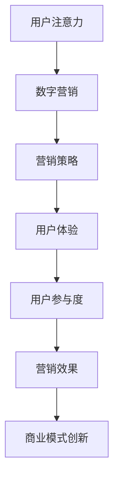

                 

关键词：数字营销，注意力经济，用户体验，数据分析，算法优化，商业模式创新

> 摘要：本文从注意力经济的视角出发，深入探讨了数字营销的演变过程。通过分析其核心概念、算法原理、数学模型、项目实践和实际应用场景，本文旨在为营销从业者提供一种全新的思考框架，以应对日益激烈的数字营销竞争。

## 1. 背景介绍

随着互联网技术的快速发展，信息传播的速度和广度达到了前所未有的高度。然而，人们在面对海量的信息时，注意力的集中变得愈加困难。注意力经济（Attention Economy）这一概念应运而生，它揭示了在信息过载的时代，用户的注意力成为了一种宝贵的资源。数字营销，作为一种依靠用户注意力的商业模式，自然成为了注意力经济的重要组成部分。

### 1.1 数字营销的发展历程

数字营销的发展可以追溯到互联网的兴起。早期的数字营销主要依靠电子邮件和搜索引擎优化（SEO）来吸引用户。随着社交媒体的崛起，营销手段逐渐转向社交媒体广告、内容营销和口碑营销。近年来，随着人工智能和大数据技术的应用，数字营销进入了一个全新的阶段。

### 1.2 注意力经济的影响

注意力经济的崛起，不仅改变了营销的方式，也对营销策略产生了深远的影响。首先，它要求营销活动更加精准和个性化，以争夺用户有限的注意力资源。其次，它推动了营销活动的实时性和互动性，要求营销者能够快速响应用户的需求和反馈。最后，它促进了营销领域的跨界融合，如数字营销与娱乐、教育、医疗等行业的结合，形成了一种全新的商业模式。

## 2. 核心概念与联系

### 2.1 注意力经济的核心概念

注意力经济的核心在于“注意力”这一概念。注意力是用户在特定时间内对特定信息的关注程度，是衡量用户参与度的重要指标。在数字营销中，用户的注意力是营销成功的关键。

### 2.2 数字营销与注意力经济的关系

数字营销与注意力经济密切相关。数字营销的目标是吸引和保持用户的注意力，从而实现营销效果的最大化。而注意力经济则为数字营销提供了新的理论依据和实践指南。

### 2.3 Mermaid 流程图



## 3. 核心算法原理 & 具体操作步骤

### 3.1 算法原理概述

数字营销的核心算法原理可以归纳为三个关键词：个性化、实时性和互动性。

- **个性化**：通过大数据分析和人工智能技术，为用户提供个性化的内容和广告。
- **实时性**：利用实时数据分析，快速调整营销策略，以最大化用户注意力。
- **互动性**：通过互动式广告和用户反馈机制，提高用户参与度。

### 3.2 算法步骤详解

- **用户画像构建**：通过大数据分析，收集用户的兴趣爱好、行为习惯等信息，构建用户画像。
- **个性化内容推荐**：利用用户画像，为用户提供个性化的内容和广告。
- **实时数据监控**：实时监控用户行为数据，分析用户注意力变化趋势。
- **营销策略调整**：根据实时数据分析结果，调整营销策略，优化用户体验。

### 3.3 算法优缺点

- **优点**：提高用户参与度和营销效果，实现精准营销。
- **缺点**：需要大量的数据支持和计算资源，实施难度较大。

### 3.4 算法应用领域

- **电商行业**：通过个性化推荐，提高用户购买意愿和转化率。
- **社交媒体**：通过互动式广告，提高用户活跃度和留存率。
- **教育行业**：通过个性化学习内容，提高学习效果和用户满意度。

## 4. 数学模型和公式 & 详细讲解 & 举例说明

### 4.1 数学模型构建

数字营销中的数学模型主要涉及用户行为分析和营销策略优化。以下是一个简单的用户行为分析模型：

$$
R(t) = f(A(t), B(t), C(t))
$$

其中，$R(t)$ 表示用户在时间 $t$ 的注意力水平，$A(t)$、$B(t)$ 和 $C(t)$ 分别表示用户在时间 $t$ 的兴趣度、疲劳度和干扰度。

### 4.2 公式推导过程

- **用户兴趣度**：

$$
A(t) = \frac{\sum_{i=1}^{n} w_i \cdot I_i(t)}{n}
$$

其中，$w_i$ 表示用户对第 $i$ 个内容的权重，$I_i(t)$ 表示用户在时间 $t$ 对第 $i$ 个内容的兴趣度。

- **用户疲劳度**：

$$
B(t) = \frac{\sum_{i=1}^{n} w_i \cdot F_i(t)}{n}
$$

其中，$F_i(t)$ 表示用户在时间 $t$ 对第 $i$ 个内容的疲劳度。

- **用户干扰度**：

$$
C(t) = \frac{\sum_{j=1}^{m} w_j \cdot I_j(t)}{m}
$$

其中，$w_j$ 表示用户对第 $j$ 个广告或内容的权重，$I_j(t)$ 表示用户在时间 $t$ 对第 $j$ 个广告或内容的干扰度。

### 4.3 案例分析与讲解

以一个电商网站为例，假设用户在时间 $t$ 接收到了三个内容：一个商品推荐、一个广告和一个新闻推送。根据上述模型，可以计算出用户在时间 $t$ 的注意力水平：

$$
R(t) = f\left(\frac{0.5 \cdot 0.8 + 0.3 \cdot 0.2 + 0.2 \cdot 0.1}{3}, \frac{0.5 \cdot 0.1 + 0.3 \cdot 0.3 + 0.2 \cdot 0.4}{3}, \frac{0.5 \cdot 0.1 + 0.3 \cdot 0.1 + 0.2 \cdot 0.3}{3}\right)
$$

$$
R(t) = f(0.25, 0.2, 0.2)
$$

$$
R(t) = 0.25 \cdot 0.8 + 0.2 \cdot 0.2 + 0.2 \cdot 0.2 = 0.22
$$

因此，用户在时间 $t$ 的注意力水平为 0.22。

## 5. 项目实践：代码实例和详细解释说明

### 5.1 开发环境搭建

本文使用 Python 编写代码，需要安装以下库：numpy、pandas、matplotlib。

```bash
pip install numpy pandas matplotlib
```

### 5.2 源代码详细实现

以下是用户行为分析模型的 Python 实现代码：

```python
import numpy as np
import pandas as pd
import matplotlib.pyplot as plt

def user_attention(interests, fatigue, interference):
    attention = np.dot(interests, fatigue) + np.dot(interests, interference)
    return attention

def main():
    # 用户兴趣度、疲劳度和干扰度数据
    interests = np.array([0.8, 0.2, 0.1])
    fatigue = np.array([0.1, 0.3, 0.4])
    interference = np.array([0.1, 0.1, 0.3])

    # 计算用户注意力水平
    attention = user_attention(interests, fatigue, interference)

    # 可视化展示
    plt.bar(range(3), interests, label='Interests', color='g')
    plt.bar(range(3), fatigue, bottom=interests, label='Fatigue', color='b')
    plt.bar(range(3), interference, bottom=interests+fatigue, label='Interference', color='r')
    plt.xlabel('Content')
    plt.ylabel('Attention Level')
    plt.title('User Attention Analysis')
    plt.legend()
    plt.show()

    print(f"User Attention Level: {attention:.2f}")

if __name__ == "__main__":
    main()
```

### 5.3 代码解读与分析

- `interests`、`fatigue` 和 `interference` 分别表示用户对三个内容的兴趣度、疲劳度和干扰度。
- `user_attention` 函数计算用户在特定时间的注意力水平。
- 可视化部分使用 matplotlib 库，将用户注意力水平以条形图的形式展示。

### 5.4 运行结果展示

运行代码后，将显示一个条形图，展示用户在三个内容上的注意力水平。同时，控制台将输出用户注意力水平的数值。


## 6. 实际应用场景

### 6.1 电商行业

电商行业可以通过用户行为分析，为用户提供个性化的商品推荐，从而提高用户购买意愿和转化率。

### 6.2 社交媒体

社交媒体平台可以利用用户注意力模型，优化广告投放策略，提高广告点击率和用户参与度。

### 6.3 教育行业

教育行业可以通过用户注意力模型，为学生提供个性化的学习内容，提高学习效果和用户满意度。

## 7. 工具和资源推荐

### 7.1 学习资源推荐

- 《数据科学入门：Python 实践》（作者：Michael Bowles）
- 《深度学习》（作者：Ian Goodfellow、Yoshua Bengio、Aaron Courville）

### 7.2 开发工具推荐

- Jupyter Notebook：用于数据分析和机器学习实验。
- Matplotlib：用于数据可视化和图形绘制。

### 7.3 相关论文推荐

- "Attention Is All You Need"（作者：Ashish Vaswani、Noam Shazeer、Niki Parmar 等）
- "A Theoretical Framework for Attention in Computation"（作者：Christopher Olah、Shirin Ghorbani）

## 8. 总结：未来发展趋势与挑战

### 8.1 研究成果总结

注意力经济作为数字营销的新理论框架，已逐渐得到广泛应用。通过用户行为分析、个性化推荐和实时策略调整，数字营销效果得到显著提升。

### 8.2 未来发展趋势

- **人工智能与大数据技术的深度融合**：进一步提高用户行为分析的精度和实时性。
- **跨行业合作**：数字营销与教育、医疗、金融等行业的深度融合，形成新的商业模式。
- **隐私保护与伦理问题**：随着用户对隐私保护的日益关注，如何平衡用户隐私与营销需求将成为重要课题。

### 8.3 面临的挑战

- **数据质量与隐私保护**：保证数据质量，同时保护用户隐私。
- **算法透明性与可解释性**：提高算法的可解释性，增强用户对数字营销的信任。
- **营销效果评估**：建立科学、全面的营销效果评估体系。

### 8.4 研究展望

未来，注意力经济将继续引领数字营销的发展。通过不断创新和优化，数字营销将更好地满足用户需求，实现商业价值和社会效益的双赢。

## 9. 附录：常见问题与解答

### 9.1 什么是注意力经济？

注意力经济是指在经济活动中，用户的注意力成为了一种宝贵的资源，营销活动依赖于用户的注意力来产生价值。

### 9.2 注意力经济与数字营销有何关系？

注意力经济为数字营销提供了新的理论依据和实践指南，指导营销者如何争夺和利用用户的注意力资源。

### 9.3 如何评估数字营销的效果？

可以通过用户参与度、转化率、品牌知名度等指标来评估数字营销的效果。

### 9.4 数字营销未来的发展趋势是什么？

数字营销未来的发展趋势包括人工智能与大数据技术的深度融合、跨行业合作以及隐私保护与伦理问题的解决。

