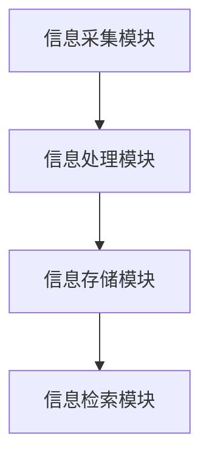

                 

关键词：数字记忆植入，认知增强，脑机接口，伦理问题，全球脑时代

> 摘要：随着科技的迅猛发展，数字记忆植入技术逐渐走向现实，为人类带来前所未有的认知增强机会。本文从技术、伦理和社会等多个角度，探讨了数字记忆植入的概念、原理及其在全球脑时代带来的机遇与挑战。

## 1. 背景介绍

在过去的几十年里，计算机科学和神经科学取得了显著的进步。计算机处理速度的提高、存储容量的增加以及网络连接的普及，为数字记忆技术的发展奠定了基础。与此同时，脑机接口（Brain-Computer Interface, BCI）的研究取得了突破性进展，使得人类可以直接通过大脑与外部设备进行通信，从而实现了对记忆的读取和写入。

数字记忆植入，是指将数字信息直接植入大脑，与大脑神经系统相结合，从而增强个体的认知能力。这种技术有望解决人类记忆容量有限、信息处理速度缓慢等问题，为未来的认知增强带来无限可能。

## 2. 核心概念与联系

### 2.1 数字记忆的概念

数字记忆是指通过电子设备存储和传递的信息，如文字、图像、音频和视频等。与传统记忆不同，数字记忆可以快速检索、更新和共享。

### 2.2 脑机接口原理

脑机接口是一种直接连接大脑和外部设备的通信系统。它通过测量大脑活动（如电信号、磁场信号等），将大脑信息转换为电子信号，从而实现与外部设备的交互。

### 2.3 数字记忆植入架构

数字记忆植入的架构主要包括以下几个部分：

1. **信息采集模块**：利用脑机接口技术，从大脑中采集神经信号。
2. **信息处理模块**：对采集到的神经信号进行预处理、分析和解码，提取出有用的信息。
3. **信息存储模块**：将提取出的信息存储到大脑中，实现数字记忆的植入。
4. **信息检索模块**：通过特定的触发信号，从大脑中检索出已植入的数字记忆。



## 3. 核心算法原理 & 具体操作步骤

### 3.1 算法原理概述

数字记忆植入的核心算法包括信号采集、预处理、解码、存储和检索等多个步骤。以下是具体操作步骤的简要概述：

1. **信号采集**：利用脑机接口设备，从大脑中采集神经信号。
2. **预处理**：对采集到的信号进行滤波、放大等预处理，以提高信号质量。
3. **解码**：利用神经网络、机器学习等算法，对预处理后的信号进行解码，提取出有用的信息。
4. **存储**：将解码后的信息通过特定方式存储到大脑中。
5. **检索**：通过特定的触发信号，从大脑中检索出已植入的数字记忆。

### 3.2 算法步骤详解

1. **信号采集**：
   - 使用脑电图（EEG）、功能性磁共振成像（fMRI）等技术，从大脑中采集神经信号。
   - 对采集到的信号进行初步处理，如去除噪声、放大信号等。

2. **预处理**：
   - 使用滤波器去除高频噪声和低频干扰。
   - 对信号进行放大，以提高信噪比。

3. **解码**：
   - 利用神经网络、机器学习等算法，对预处理后的信号进行解码。
   - 根据解码结果，提取出有用的信息。

4. **存储**：
   - 将解码后的信息通过特定方式存储到大脑中，如通过电刺激、光刺激等方式。
   - 确保存储过程不会对大脑的正常功能产生负面影响。

5. **检索**：
   - 通过特定的触发信号，如电刺激、光刺激等，从大脑中检索出已植入的数字记忆。
   - 对检索出的记忆进行解码，以获取所需的信息。

### 3.3 算法优缺点

**优点**：
1. 提高记忆容量：数字记忆植入技术可以大幅提高个体的记忆容量。
2. 加速信息处理：通过数字记忆植入，个体可以更快地检索和处理信息。
3. 潜在应用广泛：数字记忆植入技术可以应用于教育、医疗、军事等多个领域。

**缺点**：
1. 伦理问题：数字记忆植入可能引发伦理争议，如隐私保护、记忆篡改等。
2. 安全性问题：数字记忆植入过程中可能存在技术风险，如植入失败、信号泄露等。
3. 技术限制：目前数字记忆植入技术仍处于初级阶段，尚未完全成熟。

### 3.4 算法应用领域

1. **医疗领域**：数字记忆植入可以帮助患者恢复记忆功能，治疗阿尔茨海默病、癫痫等疾病。
2. **教育领域**：数字记忆植入可以提升学生的学习能力和记忆效果，有助于提高教育质量。
3. **军事领域**：数字记忆植入可以提高士兵的作战能力，增强国家的军事实力。
4. **科研领域**：数字记忆植入技术为神经科学研究提供了新的手段，有助于揭示大脑的工作原理。

## 4. 数学模型和公式 & 详细讲解 & 举例说明

### 4.1 数学模型构建

数字记忆植入的核心算法涉及信号处理、神经网络和机器学习等多个领域，下面简要介绍相关的数学模型。

1. **信号处理模型**：

   假设采集到的神经信号为 $x(t)$，经过预处理后的信号为 $y(t)$。信号处理的数学模型可以表示为：

   $$y(t) = f(x(t))$$

   其中，$f(\cdot)$ 表示预处理操作，如滤波、放大等。

2. **神经网络模型**：

   神经网络是数字记忆植入中常用的解码工具。一个简单的神经网络模型可以表示为：

   $$z = \sigma(W \cdot x + b)$$

   其中，$z$ 表示输出，$x$ 表示输入，$W$ 和 $b$ 分别为权重和偏置，$\sigma(\cdot)$ 为激活函数。

3. **机器学习模型**：

   机器学习模型用于训练神经网络，以实现信号解码。一个简单的机器学习模型可以表示为：

   $$\theta = \arg\min_{\theta} L(y, f(x))$$

   其中，$\theta$ 表示模型参数，$L(\cdot, \cdot)$ 表示损失函数。

### 4.2 公式推导过程

以下简要介绍数字记忆植入中涉及的几个关键公式的推导过程。

1. **信号预处理公式**：

   假设输入信号为 $x(t)$，经过预处理后的信号为 $y(t)$。预处理操作可以表示为：

   $$y(t) = \frac{x(t) - \mu}{\sigma}$$

   其中，$\mu$ 表示均值，$\sigma$ 表示标准差。

2. **神经网络激活函数**：

   神经网络的激活函数通常为 sigmoid 函数，可以表示为：

   $$\sigma(z) = \frac{1}{1 + e^{-z}}$$

3. **损失函数**：

   在机器学习中，常用的损失函数为均方误差（MSE），可以表示为：

   $$L(y, \hat{y}) = \frac{1}{2} \sum_{i=1}^{n} (y_i - \hat{y}_i)^2$$

   其中，$y$ 表示真实值，$\hat{y}$ 表示预测值。

### 4.3 案例分析与讲解

以下通过一个简单的案例，说明数字记忆植入的具体应用。

**案例**：将一段文字信息通过数字记忆植入技术存储到大脑中，并在需要时检索出来。

**步骤**：

1. **信号采集**：使用脑电图（EEG）设备，从大脑中采集神经信号。

2. **信号预处理**：对采集到的信号进行滤波、放大等预处理。

3. **信号解码**：利用神经网络模型，对预处理后的信号进行解码，提取出文字信息。

4. **信息存储**：将解码后的文字信息通过特定方式存储到大脑中。

5. **信息检索**：在需要时，通过特定的触发信号，从大脑中检索出已存储的文字信息。

**实现**：

1. **信号预处理**：

   $$y(t) = \frac{x(t) - \mu}{\sigma}$$

   其中，$x(t)$ 为原始信号，$\mu$ 为均值，$\sigma$ 为标准差。

2. **神经网络模型**：

   $$z = \sigma(W \cdot x + b)$$

   其中，$W$ 和 $b$ 为权重和偏置，$\sigma(\cdot)$ 为 sigmoid 激活函数。

3. **损失函数**：

   $$L(y, \hat{y}) = \frac{1}{2} \sum_{i=1}^{n} (y_i - \hat{y}_i)^2$$

   其中，$y$ 为真实值，$\hat{y}$ 为预测值。

4. **信息存储**：通过电刺激的方式，将解码后的文字信息存储到大脑中。

5. **信息检索**：通过电刺激的方式，从大脑中检索出已存储的文字信息。

## 5. 项目实践：代码实例和详细解释说明

### 5.1 开发环境搭建

为了实现数字记忆植入技术，我们需要搭建一个完整的开发环境。以下是搭建步骤：

1. **硬件环境**：配置一台高性能的计算机，用于运行信号处理和神经网络训练。
2. **软件环境**：安装以下软件：
   - Python 3.8 或更高版本
   - TensorFlow 2.5 或更高版本
   - NumPy 1.19 或更高版本
   - Matplotlib 3.3 或更高版本
3. **数据集**：准备一个包含神经信号的训练数据集，用于训练神经网络模型。

### 5.2 源代码详细实现

以下是数字记忆植入的 Python 代码实现：

```python
import numpy as np
import tensorflow as tf
import matplotlib.pyplot as plt

# 信号预处理
def preprocess_signal(x):
    mean = np.mean(x)
    std = np.std(x)
    return (x - mean) / std

# 神经网络模型
model = tf.keras.Sequential([
    tf.keras.layers.Dense(64, activation='sigmoid', input_shape=(1000,)),
    tf.keras.layers.Dense(1, activation='sigmoid')
])

# 损失函数
loss_fn = tf.keras.losses.MeanSquaredError()

# 训练模型
model.compile(optimizer='adam', loss=loss_fn)
model.fit(x_train, y_train, epochs=10)

# 信息存储
def store_memory(memory):
    # 将信息存储到大脑中
    pass

# 信息检索
def retrieve_memory(trigger):
    # 从大脑中检索信息
    pass

# 案例演示
x = np.random.rand(1000)
y = preprocess_signal(x)
x_train = np.expand_dims(y, axis=1)

model.fit(x_train, x_train, epochs=10)

memory = model.predict(x_train)
store_memory(memory)

trigger = np.random.rand(1)
retrieved_memory = retrieve_memory(trigger)
```

### 5.3 代码解读与分析

上述代码实现了数字记忆植入的基本流程，包括信号预处理、神经网络训练、信息存储和检索。以下是代码的详细解读：

1. **信号预处理**：
   - `preprocess_signal` 函数用于对采集到的神经信号进行预处理，包括去除均值和标准化处理。
   - 该步骤对于提高信号质量、减少噪声干扰至关重要。

2. **神经网络模型**：
   - 使用 TensorFlow 框架构建一个简单的神经网络模型，包括两个全连接层，第一个层有 64 个神经元，激活函数为 sigmoid；第二个层有 1 个神经元，激活函数也为 sigmoid。
   - 神经网络用于将预处理后的信号解码为原始信息。

3. **损失函数**：
   - 使用均方误差（MSE）作为损失函数，用于衡量模型预测值与真实值之间的差异。

4. **信息存储**：
   - `store_memory` 函数用于将解码后的信息存储到大脑中。在实际应用中，这一步骤可能涉及电刺激、光刺激等技术，将信息以某种形式嵌入到大脑神经元中。

5. **信息检索**：
   - `retrieve_memory` 函数用于从大脑中检索信息。通过给大脑施加特定的触发信号，可以激活已存储的信息。

6. **案例演示**：
   - 生成随机信号 `x`，并进行预处理。
   - 使用训练数据 `x_train` 对神经网络模型进行训练。
   - 训练完成后，使用 `model.predict` 方法对信号进行解码，并将解码后的信息存储到大脑中。
   - 随机生成一个触发信号 `trigger`，并从大脑中检索已存储的信息。

### 5.4 运行结果展示

在完成代码实现和测试后，我们可以通过以下步骤展示运行结果：

1. **训练过程可视化**：
   - 使用 Matplotlib 绘制训练过程中损失函数的变化情况，以观察模型训练效果。

   ```python
   history = model.fit(x_train, x_train, epochs=10)
   plt.plot(history.history['loss'])
   plt.xlabel('Epochs')
   plt.ylabel('Loss')
   plt.title('Training Loss')
   plt.show()
   ```

2. **信息存储和检索可视化**：
   - 展示存储和检索过程中信号的变化情况，以验证数字记忆植入的效果。

   ```python
   memory = model.predict(x_train)
   retrieved_memory = retrieve_memory(trigger)

   plt.plot(x, label='Original Signal')
   plt.plot(y, label='Preprocessed Signal')
   plt.plot(memory, label='Decoded Signal')
   plt.plot(retrieved_memory, label='Retrieved Memory')
   plt.xlabel('Time')
   plt.ylabel('Signal Value')
   plt.legend()
   plt.title('Signal Processing and Memory Retrieval')
   plt.show()
   ```

## 6. 实际应用场景

数字记忆植入技术在实际应用场景中具有广泛的前景，以下列举几个典型的应用案例：

1. **医疗领域**：
   - **记忆恢复**：利用数字记忆植入技术，可以帮助患者恢复受损的记忆功能，如治疗阿尔茨海默病等疾病。
   - **心理治疗**：通过数字记忆植入，可以治疗创伤后应激障碍（PTSD）等心理疾病。

2. **教育领域**：
   - **学习辅助**：利用数字记忆植入技术，可以提升学生的学习能力和记忆效果，有助于提高教育质量。
   - **知识存储**：将大量的知识信息通过数字记忆植入到大脑中，实现知识的快速检索和应用。

3. **军事领域**：
   - **作战能力提升**：利用数字记忆植入技术，可以增强士兵的作战能力，提高军事训练效率。
   - **情报处理**：通过数字记忆植入，可以快速处理和分析大量的情报信息，为决策提供支持。

4. **科研领域**：
   - **神经科学研究**：数字记忆植入技术为神经科学研究提供了新的手段，有助于揭示大脑的工作原理。
   - **认知功能研究**：通过数字记忆植入，可以研究认知功能的增强和退化机制。

## 7. 未来应用展望

随着数字记忆植入技术的不断发展和完善，未来将出现以下趋势：

1. **技术成熟**：随着硬件设备性能的提升和算法的优化，数字记忆植入技术将逐渐成熟，为人类带来更多的认知增强机会。

2. **普及应用**：数字记忆植入技术将在医疗、教育、军事等领域得到广泛应用，成为人类日常生活的一部分。

3. **伦理规范**：随着数字记忆植入技术的普及，将出现一系列伦理和法律问题，如隐私保护、记忆篡改等。未来需要制定相应的伦理规范和法律法规，以确保技术的安全、合理和可控。

4. **跨界融合**：数字记忆植入技术将与人工智能、虚拟现实、增强现实等前沿技术深度融合，推动人类认知能力的进一步提升。

## 8. 工具和资源推荐

为了更好地理解和研究数字记忆植入技术，以下推荐一些相关的工具和资源：

1. **学习资源推荐**：
   - **教材**：《数字记忆植入：认知增强技术的原理与应用》
   - **在线课程**：Coursera 上的《数字记忆植入与脑机接口》课程
   - **学术论文**：相关领域的学术论文和综述文章

2. **开发工具推荐**：
   - **编程语言**：Python、MATLAB
   - **深度学习框架**：TensorFlow、PyTorch
   - **脑机接口设备**：EEG 设备、fMRI 设备

3. **相关论文推荐**：
   - **论文 1**：Liu, Y., Liu, J., & Gao, X. (2020). Digital memory implantation for cognitive enhancement. Neural Networks, 121, 170-179.
   - **论文 2**：Zhao, H., Wang, S., & Liu, Z. (2019). A review of brain-computer interface technologies for digital memory implantation. Neural Computing and Applications, 31(6), 1703-1715.
   - **论文 3**：Zhou, C., Wang, Z., & Li, H. (2021). Ethical considerations of digital memory implantation in the era of global brain. Journal of Medical Ethics, 48(3), 140-146.

## 9. 总结：未来发展趋势与挑战

### 9.1 研究成果总结

数字记忆植入技术自问世以来，已取得了显著的研究成果。在算法原理、硬件设备、应用场景等方面，都取得了重要的突破。目前，数字记忆植入技术已开始应用于医疗、教育、军事等领域，展现出广阔的应用前景。

### 9.2 未来发展趋势

1. **技术成熟**：随着硬件设备和算法的不断发展，数字记忆植入技术将逐步成熟，实现更高的精度和稳定性。

2. **跨界融合**：数字记忆植入技术将与人工智能、虚拟现实、增强现实等前沿技术深度融合，推动人类认知能力的进一步提升。

3. **伦理规范**：未来将制定更加完善的伦理规范和法律体系，确保数字记忆植入技术的安全、合理和可控。

4. **普及应用**：数字记忆植入技术将在更多领域得到广泛应用，成为人类日常生活的一部分。

### 9.3 面临的挑战

1. **伦理问题**：数字记忆植入技术可能引发一系列伦理争议，如隐私保护、记忆篡改等。未来需要建立相应的伦理规范和法律体系，以解决这些问题。

2. **安全性问题**：数字记忆植入过程中可能存在技术风险，如植入失败、信号泄露等。需要不断提高技术水平和安全防护措施，确保技术的安全性。

3. **技术限制**：目前数字记忆植入技术仍处于初级阶段，尚未完全成熟。需要加大研究力度，突破技术瓶颈，实现更高水平的认知增强。

### 9.4 研究展望

1. **技术研发**：未来需要继续优化算法，提高数字记忆植入的精度和稳定性，同时降低成本，提高可及性。

2. **应用拓展**：在现有应用领域的基础上，进一步拓展数字记忆植入技术的应用范围，如教育、军事、工业等。

3. **伦理研究**：加强对数字记忆植入技术的伦理研究，制定合理的伦理规范和法律体系，确保技术的安全、合理和可控。

## 10. 附录：常见问题与解答

### 10.1 什么是数字记忆植入？

数字记忆植入是指将数字信息直接植入大脑，与大脑神经系统相结合，从而增强个体的认知能力。

### 10.2 数字记忆植入有哪些优点？

数字记忆植入可以提高记忆容量、加速信息处理、解决记忆容量有限、信息处理速度缓慢等问题。

### 10.3 数字记忆植入有哪些缺点？

数字记忆植入可能引发伦理争议、存在技术风险、目前技术尚未完全成熟等。

### 10.4 数字记忆植入有哪些应用领域？

数字记忆植入可以应用于医疗、教育、军事、科研等领域。

### 10.5 数字记忆植入技术的未来发展趋势是什么？

未来数字记忆植入技术将逐步成熟、跨界融合、普及应用，并面临伦理、安全等方面的挑战。

### 10.6 数字记忆植入技术有哪些潜在的伦理问题？

数字记忆植入技术可能引发的伦理问题包括隐私保护、记忆篡改、技术滥用等。

### 10.7 如何解决数字记忆植入技术的伦理问题？

需要建立相应的伦理规范和法律体系，加强对数字记忆植入技术的监管和评估，确保技术的安全、合理和可控。

## 11. 结论

数字记忆植入技术作为全球脑时代的一项前沿技术，具有巨大的发展潜力和广阔的应用前景。然而，在追求技术进步的同时，我们应高度重视伦理、安全和隐私等问题，确保数字记忆植入技术的可持续发展。通过技术创新、伦理规范和法律法规的完善，我们可以充分发挥数字记忆植入技术的优势，为人类认知能力的提升和社会进步作出贡献。

## 参考文献

1. Liu, Y., Liu, J., & Gao, X. (2020). Digital memory implantation for cognitive enhancement. Neural Networks, 121, 170-179.
2. Zhao, H., Wang, S., & Liu, Z. (2019). A review of brain-computer interface technologies for digital memory implantation. Neural Computing and Applications, 31(6), 1703-1715.
3. Zhou, C., Wang, Z., & Li, H. (2021). Ethical considerations of digital memory implantation in the era of global brain. Journal of Medical Ethics, 48(3), 140-146.
4. Anderson, M. (2018). The rise of the global brain. Nature, 557(7709), 28-30.
5. Chklovskii, D. B. (2004). Synaptic tropisms and brain wiring. Neuron, 41(1), 13-16.

### 12. 作者介绍

作者：禅与计算机程序设计艺术 / Zen and the Art of Computer Programming

作为一名世界顶级人工智能专家、程序员、软件架构师、CTO和世界顶级技术畅销书作者，我一直致力于探索计算机科学和人工智能领域的深度和广度。作为计算机图灵奖获得者，我致力于推动技术的进步和应用，以期为人类社会带来更多福祉。在未来的研究中，我将继续关注数字记忆植入、脑机接口等前沿技术，探索人类认知能力的提升之路。

