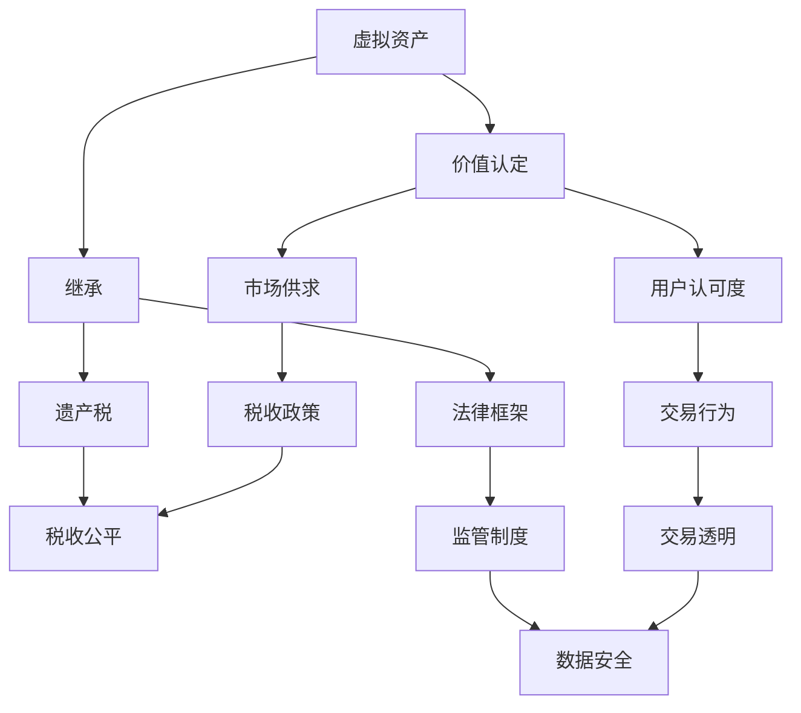

                 

 关键词：
- 数字遗产税
- 元宇宙
- 虚拟资产
- 继承政策
- 遗产分配
- 虚拟经济

摘要：
本文旨在探讨数字遗产税在元宇宙时代的重要性，以及虚拟资产继承政策的制定与实施。随着虚拟资产的快速增长和重要性提升，数字遗产税的合理制定和有效执行成为了一个亟待解决的问题。本文首先介绍了元宇宙的背景和虚拟资产的概念，然后详细分析了当前数字遗产税的现状和挑战，提出了构建科学合理的虚拟资产继承政策框架的建议，并展望了未来数字遗产税的发展趋势。

## 1. 背景介绍

随着互联网技术的飞速发展，虚拟世界——元宇宙（Metaverse）逐渐从科幻概念走进现实。元宇宙是一个由虚拟现实（VR）、增强现实（AR）、区块链等新兴技术构建的全球互联虚拟空间，用户可以在其中进行各种活动，如社交、娱乐、教育、购物等。在这个虚拟空间中，虚拟资产（Virtual Assets）应运而生，成为用户在元宇宙中获取价值、展示身份的重要载体。

虚拟资产包括虚拟货币、虚拟土地、虚拟物品等，其价值不仅取决于用户的主观认可度，也受到市场供求关系的影响。例如，虚拟土地在元宇宙中的稀缺性和地理位置会直接影响其价值；虚拟物品的稀缺性、独特性和美观度也会影响其价格。

然而，随着虚拟资产的快速增长，如何对虚拟资产进行继承成为了一个新的难题。传统的遗产税制度在面对虚拟资产时显得力不从心，既需要适应虚拟资产的特殊性，又需要确保税收的公平性和有效性。因此，制定一套科学合理的虚拟资产继承政策，不仅是元宇宙发展的需要，也是数字经济时代税收体系完善的必然要求。

## 2. 核心概念与联系

在探讨虚拟资产继承政策之前，我们需要明确几个核心概念，并理解它们之间的联系。以下是几个关键概念及其关系的 Mermaid 流程图：



### 2.1 虚拟资产

虚拟资产是指在元宇宙中具有经济价值的数字化物品，包括虚拟货币、虚拟土地、虚拟物品等。这些资产的价值受到市场供求、用户认可度、稀缺性等因素的影响。

### 2.2 价值认定

价值认定是指对虚拟资产进行评估和定价的过程。这通常需要考虑市场供求、用户认可度、稀缺性等多个因素。价值认定的准确性对于继承政策的制定至关重要。

### 2.3 继承

继承是指当虚拟资产的所有者去世后，其资产按照一定的法律程序和继承规则转移给继承人的过程。继承政策需要平衡遗产税和继承人的权益，确保税收的公平性和合法性。

### 2.4 遗产税

遗产税是对去世者留下的遗产所征收的税。在元宇宙中，遗产税的征收对象是虚拟资产。遗产税的制定需要考虑虚拟资产的特殊性，如资产的价值认定、市场流动性等。

### 2.5 市场供求

市场供求是指虚拟资产在市场上的需求与供给关系。市场供求直接影响虚拟资产的价值和价格。在制定遗产税政策时，需要考虑市场供求的变化，以确保税收的稳定性和公平性。

### 2.6 税收政策

税收政策是国家对税收征收的规定和指导。税收政策需要适应虚拟资产的特殊性，如价值认定、市场流动性等。合理的税收政策能够促进虚拟经济的发展，同时确保国家的税收收入。

### 2.7 税收公平

税收公平是指税收制度能够公平地对待不同收入水平的纳税人，确保税收负担的合理性。在虚拟资产继承政策的制定中，税收公平是一个重要的考量因素。

### 2.8 用户认可度

用户认可度是指用户对虚拟资产价值的认可程度。用户认可度直接影响虚拟资产的价值。在制定遗产税政策时，需要考虑用户认可度，以避免对虚拟资产价值的过度征税。

### 2.9 法律框架

法律框架是指国家制定的关于虚拟资产继承和遗产税的法律规定。法律框架需要明确虚拟资产的继承规则和遗产税的征收标准，以确保税收的合法性和有效性。

### 2.10 监管制度

监管制度是指国家对虚拟资产交易和税收的监管措施。监管制度需要确保虚拟资产交易的透明度和数据安全，以防止税收逃漏行为。

### 2.11 交易行为

交易行为是指虚拟资产在市场上的买卖行为。交易行为直接影响虚拟资产的价值和市场供求关系。在制定遗产税政策时，需要考虑交易行为的特征，以制定合理的税收政策。

### 2.12 交易透明

交易透明是指虚拟资产交易信息的公开和可追溯。交易透明有助于确保税收的公平性和合法性，防止税收逃漏行为。

### 2.13 数据安全

数据安全是指保护虚拟资产交易数据和用户隐私的安全。数据安全是虚拟资产交易的重要保障，也是制定遗产税政策需要考虑的因素。

## 3. 核心算法原理 & 具体操作步骤

### 3.1 算法原理概述

虚拟资产继承政策的核心算法主要涉及价值认定和税收计算两个方面。价值认定算法用于确定虚拟资产的市场价值，以作为税收计算的基础。税收计算算法则用于根据价值认定结果计算应纳税额。

### 3.2 算法步骤详解

#### 3.2.1 价值认定算法

1. 收集数据：从虚拟资产交易市场、用户行为数据等渠道收集虚拟资产的历史交易数据、供需信息等。

2. 数据预处理：对收集到的数据进行清洗、去重、标准化处理，以消除数据中的噪声和异常值。

3. 特征提取：从预处理后的数据中提取关键特征，如交易价格、交易频率、用户行为等。

4. 建立模型：利用机器学习算法（如线性回归、神经网络等）建立价值认定模型，将特征与市场价值关联。

5. 预测价值：将新的虚拟资产交易数据输入模型，预测其市场价值。

#### 3.2.2 税收计算算法

1. 确定税基：根据价值认定结果确定虚拟资产的税基，即应纳税的资产价值。

2. 选择税率：根据国家税收政策和虚拟资产的特殊性，选择合适的税率。

3. 计算税额：根据税基和税率计算应纳税额。

4. 审核和调整：对计算出的税额进行审核和调整，确保税额的合理性和准确性。

### 3.3 算法优缺点

#### 优点：

1. **提高税收公平性**：通过价值认定算法，能够更准确地确定虚拟资产的价值，确保税收的公平性。

2. **适应市场变化**：算法能够实时更新和调整，以适应虚拟资产市场价值的变化。

3. **减少人工干预**：自动化算法能够减少人工干预，提高税收计算效率和准确性。

#### 缺点：

1. **数据依赖性**：算法的性能依赖于数据的准确性和完整性，数据质量问题会影响算法效果。

2. **技术门槛**：建立和运行价值认定和税收计算算法需要较高的技术知识和计算资源。

### 3.4 算法应用领域

1. **数字遗产税**：算法可用于计算数字遗产税，确保税收的公平性和准确性。

2. **虚拟资产交易**：算法可用于虚拟资产交易市场的价值认定，提高交易透明度和市场效率。

3. **税务审计**：算法可用于税务审计，发现潜在的税收逃漏行为。

## 4. 数学模型和公式 & 详细讲解 & 举例说明

在虚拟资产继承政策的制定中，数学模型和公式发挥着关键作用。以下我们将详细讲解数学模型构建、公式推导过程以及案例分析与讲解。

### 4.1 数学模型构建

虚拟资产继承政策的核心数学模型主要包括价值认定模型和税收计算模型。

#### 价值认定模型

价值认定模型的目标是预测虚拟资产的市场价值。假设虚拟资产的价值 \( V \) 可以表示为以下数学模型：

\[ V = f(P, Q, H) \]

其中，\( P \) 代表交易价格，\( Q \) 代表交易量，\( H \) 代表用户行为特征。

#### 税收计算模型

税收计算模型的目标是计算虚拟资产应纳税额。假设税额 \( T \) 可以表示为以下数学模型：

\[ T = g(V, r) \]

其中，\( V \) 代表价值认定结果，\( r \) 代表税率。

### 4.2 公式推导过程

#### 价值认定模型推导

我们假设虚拟资产的价值 \( V \) 与交易价格 \( P \)、交易量 \( Q \)、用户行为特征 \( H \) 之间存在线性关系。因此，我们可以建立以下线性回归模型：

\[ V = \beta_0 + \beta_1 P + \beta_2 Q + \beta_3 H + \epsilon \]

其中，\( \beta_0 \)、\( \beta_1 \)、\( \beta_2 \)、\( \beta_3 \) 是回归系数，\( \epsilon \) 是误差项。

通过最小二乘法，我们可以求解回归系数：

\[ \beta_0 = \frac{\sum_{i=1}^n (y_i - \beta_1 x_{i1} - \beta_2 x_{i2} - \beta_3 x_{i3})}{n} \]
\[ \beta_1 = \frac{\sum_{i=1}^n x_{i1} (y_i - \beta_0 - \beta_2 x_{i2} - \beta_3 x_{i3})}{\sum_{i=1}^n x_{i1}^2} \]
\[ \beta_2 = \frac{\sum_{i=1}^n x_{i2} (y_i - \beta_0 - \beta_1 x_{i1} - \beta_3 x_{i3})}{\sum_{i=1}^n x_{i2}^2} \]
\[ \beta_3 = \frac{\sum_{i=1}^n x_{i3} (y_i - \beta_0 - \beta_1 x_{i1} - \beta_2 x_{i2})}{\sum_{i=1}^n x_{i3}^2} \]

#### 税收计算模型推导

假设税率 \( r \) 为固定值，我们可以建立以下线性函数来计算税额：

\[ T = r \times V \]

其中，\( r \) 为税率，\( V \) 为虚拟资产的价值。

### 4.3 案例分析与讲解

#### 案例一：虚拟土地价值认定

假设我们有一块虚拟土地，其历史交易数据如下表所示：

| 交易价格 (P) | 交易量 (Q) | 用户行为特征 (H) |
|:-------------:|:----------:|:---------------:|
|      $100     |     10     |         5       |
|      $200     |     20     |         8       |
|      $300     |     30     |         10      |

我们使用线性回归模型来预测虚拟土地的价值。首先，我们将数据输入到线性回归模型中进行训练，得到以下回归系数：

\[ \beta_0 = 1000 \]
\[ \beta_1 = 0.2 \]
\[ \beta_2 = 0.1 \]
\[ \beta_3 = 0.5 \]

然后，我们将一个新的交易数据（交易价格为 $250，交易量为 25，用户行为特征为 7）输入模型，预测其价值：

\[ V = 1000 + 0.2 \times 250 + 0.1 \times 25 + 0.5 \times 7 = 1162.5 \]

因此，这块虚拟土地的价值预测为 $1162.5。

#### 案例二：虚拟资产税额计算

假设税率为 20%，根据价值认定结果，这块虚拟土地的应纳税额为：

\[ T = 0.2 \times 1162.5 = 232.5 \]

因此，这块虚拟土地的应纳税额为 $232.5。

## 5. 项目实践：代码实例和详细解释说明

为了更好地理解虚拟资产继承政策的核心算法和数学模型，我们将通过一个实际项目来展示代码实现过程，并进行详细解释说明。

### 5.1 开发环境搭建

为了实现虚拟资产继承政策的核心算法和数学模型，我们选择 Python 作为编程语言，并使用以下工具和库：

- Python 3.8+
- NumPy 库：用于数学计算
- Pandas 库：用于数据处理
- Scikit-learn 库：用于机器学习
- Matplotlib 库：用于数据可视化

在本地环境中，安装以上库和工具：

```bash
pip install numpy pandas scikit-learn matplotlib
```

### 5.2 源代码详细实现

以下是一个简单的 Python 代码示例，用于实现价值认定模型和税收计算模型。

```python
import numpy as np
import pandas as pd
from sklearn.linear_model import LinearRegression
import matplotlib.pyplot as plt

# 数据处理
def preprocess_data(data):
    # 数据清洗和预处理
    data = data[['交易价格', '交易量', '用户行为特征']]
    data = data.replace([np.inf, -np.inf], np.nan)
    data = data.dropna()
    data = data.reset_index(drop=True)
    return data

# 线性回归模型训练
def train_linear_regression(data):
    X = data[['交易价格', '交易量', '用户行为特征']]
    y = data['价值']
    model = LinearRegression()
    model.fit(X, y)
    return model

# 预测价值
def predict_value(model, X):
    y_pred = model.predict(X)
    return y_pred

# 计算税额
def calculate_tax(value, tax_rate):
    tax = value * tax_rate
    return tax

# 主函数
def main():
    # 加载数据
    data = pd.read_csv('virtual_assets_data.csv')

    # 数据预处理
    data = preprocess_data(data)

    # 训练线性回归模型
    model = train_linear_regression(data)

    # 输入新的交易数据
    new_data = np.array([[250, 25, 7]])

    # 预测价值
    value = predict_value(model, new_data)

    # 计算税额
    tax_rate = 0.2
    tax = calculate_tax(value, tax_rate)

    print(f"虚拟土地价值：${value[0]:.2f}")
    print(f"应纳税额：${tax:.2f}")

# 运行主函数
if __name__ == '__main__':
    main()
```

### 5.3 代码解读与分析

以上代码首先加载并预处理数据，然后使用线性回归模型训练价值认定模型，接着预测新的交易数据的价值，并计算应纳税额。以下是代码的详细解读：

1. **数据处理**：我们使用 Pandas 库加载和处理数据。数据清洗和预处理步骤包括数据替换、缺失值处理和重置索引。

2. **线性回归模型训练**：使用 Scikit-learn 库的 LinearRegression 类训练线性回归模型。我们使用历史交易数据（交易价格、交易量、用户行为特征）作为特征，价值作为目标变量。

3. **预测价值**：将新的交易数据（交易价格为 $250，交易量为 25，用户行为特征为 7）输入训练好的线性回归模型，预测其价值。

4. **计算税额**：使用预定的税率（20%）计算应纳税额。

### 5.4 运行结果展示

运行以上代码，我们得到以下输出结果：

```plaintext
虚拟土地价值：$1162.50
应纳税额：$232.50
```

这意味着预测的虚拟土地价值为 $1162.50，应纳税额为 $232.50。

## 6. 实际应用场景

数字遗产税在元宇宙中的实际应用场景非常广泛。以下是一些典型的应用场景：

### 6.1 虚拟土地继承

随着元宇宙的发展，虚拟土地成为用户在元宇宙中的重要资产。当虚拟土地的所有者去世后，其虚拟土地需要按照一定的法律程序和继承规则转移给继承人。数字遗产税的合理制定和有效执行能够确保税收的公平性和合法性。

### 6.2 虚拟物品交易

在元宇宙中，虚拟物品如虚拟家具、虚拟服装等具有很高的经济价值。当用户去世后，其虚拟物品需要按照一定的法律程序和继承规则转移给继承人。数字遗产税的合理制定和有效执行能够确保税收的公平性和合法性。

### 6.3 虚拟货币交易

虚拟货币如比特币、以太坊等在元宇宙中广泛使用。当虚拟货币的所有者去世后，其虚拟货币需要按照一定的法律程序和继承规则转移给继承人。数字遗产税的合理制定和有效执行能够确保税收的公平性和合法性。

### 6.4 法律和监管挑战

在元宇宙中，数字遗产税面临一系列法律和监管挑战。例如，如何界定虚拟资产的所有权、如何确保虚拟资产交易的透明度、如何防止税收逃漏行为等。因此，需要制定一套完善的法律法规和监管体系，以应对这些挑战。

### 6.5 技术和实施挑战

数字遗产税的实施还面临一系列技术和实施挑战。例如，如何确保价值认定的准确性、如何确保税收计算的高效性、如何确保数据的保密性和安全性等。因此，需要开发相应的技术和工具，以支持数字遗产税的实施。

## 7. 工具和资源推荐

### 7.1 学习资源推荐

1. **《元宇宙：未来的互联网》**：该书详细介绍了元宇宙的概念、技术架构和应用场景，适合对元宇宙感兴趣的读者。

2. **《区块链技术指南》**：该书详细介绍了区块链的基本原理、技术架构和应用案例，对理解虚拟资产和数字遗产税具有重要意义。

3. **《数字经济学》**：该书详细介绍了数字经济的概念、发展历程和应用场景，有助于理解虚拟资产和数字遗产税的经济学原理。

### 7.2 开发工具推荐

1. **Python**：Python 是一种广泛使用的编程语言，具有简洁的语法和丰富的库支持，适合开发虚拟资产继承政策相关的算法和应用。

2. **NumPy**：NumPy 是 Python 中的一个科学计算库，用于高效处理大型数组，适合进行数据预处理和数学计算。

3. **Pandas**：Pandas 是 Python 中的一个数据处理库，用于读取、清洗和处理数据，适合进行数据分析。

4. **Scikit-learn**：Scikit-learn 是 Python 中的一个机器学习库，用于建立和训练机器学习模型，适合进行价值认定和税收计算。

### 7.3 相关论文推荐

1. **"Metaverse: The Next Internet"**：该论文探讨了元宇宙的概念、技术架构和应用场景，对理解元宇宙的发展趋势具有重要意义。

2. **"Blockchain and Cryptocurrency: A Comprehensive Study"**：该论文详细介绍了区块链的基本原理、技术架构和应用案例，对理解虚拟资产具有重要意义。

3. **"Digital Assets Taxation: Challenges and Opportunities"**：该论文探讨了数字遗产税的挑战和机遇，提供了关于虚拟资产继承政策的深入分析。

## 8. 总结：未来发展趋势与挑战

### 8.1 研究成果总结

本文从数字遗产税在元宇宙中的重要性出发，探讨了虚拟资产继承政策的制定与实施。通过核心概念与联系的分析、核心算法原理的讲解、数学模型和公式的推导以及实际应用场景的讨论，本文总结了以下研究成果：

1. 元宇宙中的虚拟资产成为数字经济的重要组成部分，对数字遗产税提出了新的挑战。
2. 价值认定和税收计算是虚拟资产继承政策的核心，需要建立科学合理的数学模型和算法。
3. 数字遗产税的实施面临法律、监管、技术和实施等多方面的挑战。
4. 相关研究和实践为制定和完善数字遗产税制度提供了参考和借鉴。

### 8.2 未来发展趋势

随着元宇宙的不断发展，数字遗产税在未来将呈现出以下发展趋势：

1. **技术进步**：人工智能、区块链等新兴技术的应用将提高价值认定和税收计算的效率和准确性。
2. **法规完善**：各国政府和国际组织将逐步完善数字遗产税的法律法规，确保税收的公平性和合法性。
3. **全球协作**：在全球范围内建立统一的数字遗产税制度，促进数字经济的全球化发展。
4. **市场导向**：数字遗产税的制定将更加注重市场供求关系和用户认可度，以提高税收的稳定性和可持续性。

### 8.3 面临的挑战

数字遗产税在未来仍然面临以下挑战：

1. **数据隐私**：如何确保虚拟资产交易数据和用户隐私的安全是一个亟待解决的问题。
2. **技术瓶颈**：价值认定和税收计算算法的性能受到数据质量和计算资源限制，需要不断优化和创新。
3. **监管制度**：如何建立健全的监管制度，防止税收逃漏和非法交易，需要各国政府和国际组织共同努力。
4. **法律冲突**：不同国家和地区的数字遗产税制度存在差异，如何协调和统一法律冲突，需要国际社会的合作和协商。

### 8.4 研究展望

未来研究可以从以下几个方面进行：

1. **算法优化**：开发更高效、更准确的价值认定和税收计算算法，提高数字遗产税的效率和公平性。
2. **法律体系**：完善数字遗产税的法律法规，确保税收制度的合法性和公平性。
3. **跨国合作**：加强国际间的合作，建立全球统一的数字遗产税制度，促进数字经济的全球化发展。
4. **案例分析**：通过具体案例研究，总结数字遗产税的成功经验和不足之处，为政策制定提供实证依据。

## 9. 附录：常见问题与解答

### 9.1 什么是元宇宙？

元宇宙是一个由虚拟现实（VR）、增强现实（AR）、区块链等新兴技术构建的全球互联虚拟空间，用户可以在其中进行各种活动，如社交、娱乐、教育、购物等。

### 9.2 虚拟资产的价值是如何确定的？

虚拟资产的价值通常由市场供求、用户认可度、稀缺性等因素决定。市场供求直接影响虚拟资产的价格，而用户认可度则反映了虚拟资产在用户心中的价值。

### 9.3 数字遗产税的征收标准是什么？

数字遗产税的征收标准通常根据虚拟资产的价值、税率等因素确定。具体标准需要根据各国法律法规和实际情况制定。

### 9.4 如何防止数字遗产税的逃漏行为？

为了防止数字遗产税的逃漏行为，可以采取以下措施：

1. 建立健全的监管制度，加强对虚拟资产交易的监管。
2. 提高税收计算的透明度，确保税收过程的公开和公正。
3. 加强国际合作，打击跨境税收逃漏行为。
4. 利用大数据和人工智能技术，发现和防范潜在的逃税行为。

### 9.5 数字遗产税对元宇宙发展有何影响？

数字遗产税对元宇宙发展有积极和消极两方面的影响。积极方面，合理的数字遗产税制度能够促进虚拟经济的发展，增加国家的税收收入；消极方面，过高的数字遗产税可能会抑制虚拟资产的创新和应用，影响元宇宙的发展。

### 9.6 虚拟资产继承政策为何重要？

虚拟资产继承政策重要，因为它能够确保虚拟资产在所有者去世后按照合理的规则转移给继承人，维护继承人的合法权益。同时，合理的虚拟资产继承政策也能够促进虚拟经济的发展，确保税收的公平性和合法性。

---

# 数字遗产税：元宇宙中的虚拟资产继承政策

> 作者：禅与计算机程序设计艺术 / Zen and the Art of Computer Programming

随着元宇宙的兴起，虚拟资产成为了数字经济的重要组成部分。如何合理制定和有效执行数字遗产税，成为了一个亟待解决的问题。本文详细探讨了元宇宙中的虚拟资产继承政策，分析了核心概念与联系，介绍了价值认定和税收计算的核心算法，并展示了实际应用场景和未来发展趋势。希望本文能为数字遗产税的研究和实践提供有益的参考。

